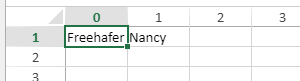
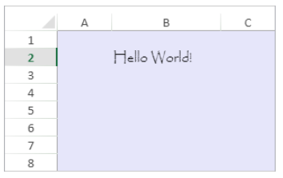
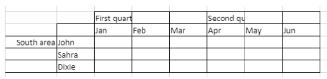
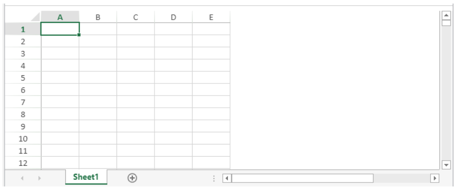
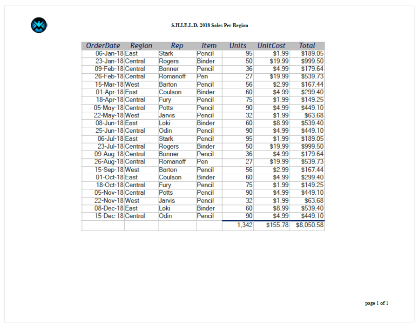

> **Warning**: The commands on this page are not thread-safe.

[A](#a) -
[C](#c) -
[D](#d) -
[E](#e) -
[F](#f) -
[G](#g) -
[I](#i) -
[M](#m) -
[N](#n) -
[O](#o) -
[P](#p) -
[R](#r) -
[S](#s)

## A

### VP ADD FORMULA NAME

<!-- REF #_method_.VP ADD FORMULA NAME.Syntax -->

**VP ADD FORMULA NAME** ( _vpAreaName_ : Text ; _vpFormula_ : Text ; _name_ : Text { ; _options_ : Object } )<!-- END REF -->

<!-- REF #_method_.VP ADD FORMULA NAME.Params -->

| Paramètres | Type   |    | Description                             |                  |
| ---------- | ------ | -- | --------------------------------------- | ---------------- |
| vpAreaName | Text   | -> | Nom d'objet formulaire zone 4D View Pro |                  |
| vpFormula  | Text   | -> | Formule 4D View Pro                     |                  |
| name       | Text   | -> | Nom de la formule                       |                  |
| options    | Object | -> | Options de la formule nommée            | <!-- END REF --> |

#### Description

The `VP ADD FORMULA NAME` command <!-- REF #_method_.VP ADD FORMULA NAME.Summary -->creates or modifies a named formula in the open document<!-- END REF -->.

> Les formules nommées créées par cette commande sont stockées dans le document.

In _vpAreaName_, pass the name of the 4D View Pro area. Si vous passez un nom inexistant, une erreur est retournée.

Pass the 4D View Pro formula that you want to name in _vpFormula_. For detailed information about formula syntax, see [Formulas and Functions](formulas.md) page.

Pass the new name for the formula in _name_. Si le nom est déjà utilisé dans le même scope, la nouvelle formule nommée remplace la formule existante. A noter que vous pouvez utiliser le même nom pour plusieurs scopes (ci-dessous).

You can pass an object with additional properties for the named formula in _options_. Les propriétés suivantes sont prises en charge :

| Propriété | Type   | Description                                                                                                                                                                                                                                                                                                                                                                                                                                             |
| --------- | ------ | ------------------------------------------------------------------------------------------------------------------------------------------------------------------------------------------------------------------------------------------------------------------------------------------------------------------------------------------------------------------------------------------------------------------------------------------------------- |
| scope     | Number | Scope de la formule. You can pass the sheet index (counting begins at 0) or use the following constants: <li>`vk current sheet`</li><li>`vk workbook`</li>The scope determines whether a formula name is local to a given worksheet (_scope_=sheet index or `vk current sheet`), or global across the entire workbook (_scope_=`vk workbook`). |
| comment   | Text   | Commentaire associé à une formule nommée                                                                                                                                                                                                                                                                                                                                                                                                                |

#### Exemple

```4d
VP ADD FORMULA NAME("ViewProArea";"SUM($A$1:$A$10)";"Total2")
```

#### Voir également

[Cell references](formulas.md#cell-references)<br/>[VP Get formula by name](#vp-get-formula-by-name)<br/>[VP Get names](#vp-get-names)

### VP ADD RANGE NAME

<!-- REF #_method_.VP ADD RANGE NAME.Syntax -->

**VP ADD RANGE NAME** ( _rangeObj_ : Object ; _name_ : Text { ; _options_ : Object } )<!-- END REF -->

<!-- REF #_method_.VP ADD RANGE NAME.Params -->

| Paramètres | Type   |    | Description                  |                  |
| ---------- | ------ | -- | ---------------------------- | ---------------- |
| rangeObj   | Object | -> | Objet plage                  |                  |
| name       | Text   | -> | Nom de la formule            |                  |
| options    | Object | -> | Options de la formule nommée | <!-- END REF --> |

#### Description

The `VP ADD RANGE NAME` command <!-- REF #_method_.VP ADD RANGE NAME.Summary -->creates or modifies a named range in the open document<!-- END REF -->.

> Les plages nommées créées par cette commande sont stockées dans le document.

In _rangeObj_, pass the range that you want to name and in _name_, pass the new name for the range. Si le nom est déjà utilisé dans le même scope, la nouvelle plage nommée remplace la plage existante. A noter que vous pouvez utiliser le même nom pour plusieurs scopes (ci-dessous).

You can pass an object with additional properties for the named range in _options_. Les propriétés suivantes sont prises en charge :

| Propriété | Type   | Description                                                                                                                                                                                                                                                                                                                                                                                                                                         |
| --------- | ------ | --------------------------------------------------------------------------------------------------------------------------------------------------------------------------------------------------------------------------------------------------------------------------------------------------------------------------------------------------------------------------------------------------------------------------------------------------- |
| scope     | Number | Scope de la plage. You can pass the sheet index (counting begins at 0) or use the following constants: <li>`vk current sheet`</li><li>`vk workbook`</li>The scope determines whether a range name is local to a given worksheet (_scope_=sheet index or `vk current sheet`), or global across the entire workbook (_scope_=`vk workbook`). |
| comment   | Text   | Commentaire associé à une plage nommée                                                                                                                                                                                                                                                                                                                                                                                                              |

> - Une plage nommée est en réalité une formule nommée contenant des coordonnées. `VP ADD RANGE NAME` facilitates the creation of named ranges, but you can also use the [`VP ADD FORMULA NAME`](#vp-add-formula-name) method to create named ranges.
> - Formulas defining named ranges can be retrieved with the [`VP Get formula by name`](#vp-get-formula-by-name) method.

#### Exemple

Vous souhaitez créer une plage nommée à partir d'une plage contenant une cellule :

```4d
$range:=VP Cell("ViewProArea";2;10)
VP ADD RANGE NAME($range;"Total1")
```

#### Voir également

[VP Get names](#vp-get-names)<br/>[VP Name](#vp-name)

### VP ADD SELECTION

<!-- REF #_method_.VP ADD SELECTION.Syntax -->

**VP ADD SELECTION** ( _rangeObj_ : Object )<!-- END REF -->

<!-- REF #_method_.VP ADD SELECTION.Params -->

| Paramètres | Type |    | Description |                  |
| ---------- | ---- | -- | ----------- | ---------------- |
| rangeObj   | Text | -> | Objet plage | <!-- END REF --> |

#### Description

The `VP ADD SELECTION` command <!-- REF #_method_.VP ADD SELECTION.Summary -->adds the specified cells to the currently selected cells<!-- END REF -->.

In _rangeObj_, pass a range object of cells to add to the current selection.

> La cellule active n'est pas modifiée.

#### Exemple

Les cellules sélectionnées sont les suivantes :


Le code suivant ajoutera des cellules à votre sélection :

```4d
$currentSelection:=VP Cells("myVPArea";3;4;2;3)
VP ADD SELECTION($currentSelection)
```

Résultat:


#### Voir également

[VP Get active cell](#vp-get-active-cell)<br/>[VP Get selection](#vp-get-selection)<br/>[VP RESET SELECTION](#vp-reset-selection)<br/>[VP SET ACTIVE CELL](#vp-set-active-cell)<br/>[VP SET SELECTION](#vp-set-selection)<br/>[VP SHOW CELL](#vp-show-cell)

### VP ADD SHEET

<!-- REF #_method_.VP ADD SHEET.Syntax -->

**VP ADD SHEET** ( _vpAreaName_ : Text )<br/>**VP ADD SHEET** ( _vpAreaName_ : Text ; _index_ : Integer )<br/>**VP ADD SHEET** ( _vpAreaName_ : Text ; _sheet_ : Integer ; _name_ : Text )<!-- END REF -->

<!-- REF #_method_.VP ADD SHEET.Params -->

| Paramètres | Type    |    | Description                             |                  |
| ---------- | ------- | -- | --------------------------------------- | ---------------- |
| vpAreaName | Text    | -> | Nom d'objet formulaire zone 4D View Pro |                  |
| sheet      | Integer | -> | Indice de la nouvelle feuille           |                  |
| name       | Text    | -> | Nom de la feuille                       | <!-- END REF --> |

#### Description

The `VP ADD SHEET` command <!-- REF #_method_.VP ADD SHEET.Summary -->inserts a sheet in the document loaded in _vpAreaName_.<!-- END REF -->

In _vpAreaName_, pass the name of the 4D View Pro area.

In _sheet_, you can pass an index for the new sheet. If the passed _index_ is inferior to or equal to 0, the command inserts the new sheet at the beginning. If _index_ exceeds the number of sheets, the command inserts the new sheet after the existing ones.

> La numérotation démarre à 0.

In _name_, you can pass a name for the new sheet. The new name cannot contain the following characters: `*, :, [, ], ?,\,/`

#### Exemple

Le document comporte actuellement 3 feuilles :


Pour insérer une feuille à la troisième position (index 2) et la nommer "March" :

```4d
VP ADD SHEET("ViewProArea";2;"March")
```


#### Voir également

[VP REMOVE SHEET](#vp-remove-sheet)

### VP ADD SPAN

<!-- REF #_method_.VP ADD SPAN.Syntax -->

**VP ADD SPAN** ( _rangeObj_ : Object )<!-- END REF -->

<!-- REF #_method_.VP ADD SPAN.Params -->

| Paramètres | Type   |    | Description |                  |
| ---------- | ------ | -- | ----------- | ---------------- |
| rangeObj   | Object | -> | Objet plage | <!-- END REF --> |

#### Description

The `VP ADD SPAN` command combines the cells in _rangeObj_ as a single span of cells.

In _rangeObj_, pass a range object of cells. Les cellules de la plage sont jointes, afin de créer une cellule plus large qui s'étend sur plusieurs colonnes et/ou lignes. Vous pouvez passer plusieurs plages de cellules pour créer plusieurs fusions de cellules en même temps. A noter que si les plages de cellules se chevauchent, seule la première plage est utilisée.

> - Seules les données contenues dans la cellule supérieure gauche sont affichées. Les données des autres cellules combinées sont cachées jusqu'à ce que la fusion soit retirée.
> - Les données masquées, contenues dans les cellules fusionnées, sont accessibles via des formules (commençant par la cellule supérieure gauche).

#### Exemple

Pour fusionner les cellules First quarter et Second quarter avec les deux cellules côte à côte, et de fusionner la cellule South area avec les deux lignes en-dessous :


```4d
 // First quarter range
 $q1:=VP Cells("ViewProArea";2;3;3;1)
 
  // Second quarter range
 $q2:=VP Cells("ViewProArea";5;3;3;1)
 
  // South area range
 $south:=VP Cells("ViewProArea";0;5;1;3)
 
 VP ADD SPAN(VP Combine ranges($q1;$q2;$south))
```


#### Voir également

[4D View Pro Range Object Properties](getting-started.md#using-range-objects)<br/>[VP Get spans](#vp-get-spans)<br/>[VP REMOVE SPAN](#vp-remove-span)

### VP ADD STYLESHEET

<!-- REF #_method_.VP ADD STYLESHEET.Syntax -->

**VP ADD STYLESHEET** ( _vpAreaName_ : Text ; _styleName_ : Text ; _styleObj_ : Object { ; _sheet_ : Integer } )<!-- END REF -->

<!-- REF #_method_.VP ADD STYLESHEET.Params -->

| Paramètres | Type    |    | Description                                                                 |                  |
| ---------- | ------- | -- | --------------------------------------------------------------------------- | ---------------- |
| vpAreaName | Text    | -> | Nom d'objet formulaire zone 4D View Pro                                     |                  |
| styleName  | Text    | -> | Nom du style                                                                |                  |
| styleObj   | Object  | -> | Objet définissant les propriétés de l'attribut                              |                  |
| sheet      | Integer | -> | Numéro d'indice de la feuille (feuille courante si omis) | <!-- END REF --> |

#### Description

The `VP ADD STYLESHEET` command <!-- REF #_method_.VP ADD STYLESHEET.Summary -->creates or modifies the _styleName_ style sheet based upon the combination of the properties specified in _styleObj_ in the open document<!-- END REF -->. Si une feuille de style ayant le même nom et le même index existe déjà dans le document, cette commande l'écrasera et le remplacera avec les nouvelles valeurs.

> Les feuilles de style créées par cette commande sont sauvegardées avec le document.

In _vpAreaName_, pass the name of the 4D View Pro area. Si vous passez un nom inexistant, une erreur est retournée.

The _styleName_ parameter lets you assign a name to the style sheet. Si le nom existe déjà dans le même scope, la nouvelle feuille de style remplace la feuille existante. A noter que vous pouvez utiliser le même nom pour plusieurs scopes (ci-dessous).

Within the _styleObj_, designate the settings for the style sheet (e.g., font, text decoration, alignment, borders, etc.). For the full list of style properties, see [Style object properties](configuring.md#style-object-properties).

You can designate where to define the style sheet in the optional _sheet_ parameter using the sheet index (indexing starts at 0) or with the following constants:

- `vk current sheet`
- `vk workbook`

If a _styleName_ style sheet is defined at the workbook level and at a sheet level, the sheet level has priority over the workbook level when the style sheet is set.

To apply the style sheet, use the [VP SET DEFAULT STYLE](#vp-set-default-style) or [VP SET CELL STYLE](#vp-set-cell-style) commands.

#### Exemple

Le code suivant :

```4d
$styles:=New object
$styles.backColor:="green"
 
//Line Border Object
$borders:=New object("color";"green";"style";vk line style medium dash dot)
 
$styles.borderBottom:=$borders
$styles.borderLeft:=$borders
$styles.borderRight:=$borders
$styles.borderTop:=$borders
 
VP ADD STYLESHEET("ViewProArea";"GreenDashDotStyle";$styles)
 
//To apply the style
VP SET CELL STYLE(VP Cells("ViewProArea";1;1;2;2);New object("name";"GreenDashDotStyle"))
```

will create and apply the following style object named _GreenDashDotStyle_:

```
{
 backColor:green,
 borderBottom:{color:green,style:10},
 borderLeft:{color:green,style:10},
 borderRight:{color:green,style:10},
 borderTop:{color:green,style:10}
}
```

#### Voir également

[4D View Pro Style Objects and Style Sheets](configuring.md#style-objects--style-sheets)<br/>[VP Get stylesheet](#vp-get-stylesheet)<br/>[VP Get stylesheets](#vp-get-stylesheets)<br/>[VP REMOVE STYLESHEET](#vp-remove-stylesheet)<br/>[VP SET CELL STYLE](#vp-set-cell-style)<br/>[VP SET DEFAULT STYLE](#vp-set-default-style)

### VP All

<!-- REF #_method_.VP All.Syntax -->

**VP All** ( _vpAreaName_ : Text { ; _sheet_ : Integer } )  : Object<!-- END REF -->

<!-- REF #_method_.VP All.Params -->

| Paramètres | Type    |    | Description                                                                 |                  |
| ---------- | ------- | -- | --------------------------------------------------------------------------- | ---------------- |
| vpAreaName | Text    | -> | Nom d'objet formulaire zone 4D View Pro                                     |                  |
| sheet      | Integer | -> | Numéro d'indice de la feuille (feuille courante si omis) |                  |
| Résultat   | Object  | <- | Objet plage de toutes les cellules                                          | <!-- END REF --> |

#### Description

The `VP ALL` command <!-- REF #_method_.VP All.Summary -->returns a new range object referencing all cells<!-- END REF -->.

In _vpAreaName_, pass the name of the 4D View Pro area. Si vous passez un nom inexistant, une erreur est retournée.

In the optional _sheet_ parameter, you can designate a specific spreadsheet where the range will be defined (counting begins at 0). If omitted or if you pass `vk current sheet`, the current spreadsheet is used.

#### Exemple

Vous souhaitez définir une plage pour toutes les cellules de la feuille courante :

```4d
$all:=VP All("ViewProArea") // toutes les cellules de la feuille courante
```

#### Voir également

[VP Cell](#vp-cell)<br/>[VP Cells](#vp-cells)<br/>[VP Column](#vp-column)<br/>[VP Combine ranges](#vp-combine-ranges)<br/>[VP Name](#vp-name)<br/>[VP Row](#vp-row)

## C

### VP Cell

<!-- REF #_method_.VP Cell.Syntax -->

**VP Cell** ( _vpAreaName_ ; _column_ : Integer ; _row_ : Integer ; Text { ; _sheet_ : Integer } )  : Object<!-- END REF -->

<!-- REF #_method_.VP Cell.Params -->

| Paramètres | Type    |    | Description                                                                 |
| ---------- | ------- | -- | --------------------------------------------------------------------------- |
| vpAreaName | Text    | -> | Nom d'objet formulaire zone 4D View Pro                                     |
| column     | Longint | -> | Indice de la colonne                                                        |
| row        | Longint | -> | Indice de la ligne                                                          |
| sheet      | Integer | -> | Numéro d'indice de la feuille (feuille courante si omis) |
| Résultat   | Object  | <- | Objet plage d'une seule cellule                                             |

<!-- END REF -->

#### Description

The `VP Cell` command <!-- REF #_method_.VP Cell.Summary -->returns a new range object referencing a specific cell<!-- END REF -->.

> Cette commande s'applique aux plages d'une seule cellule. To create a range object for multiple cells, use the [VP Cells](#vp-cells) command.

In _vpAreaName_, pass the name of the 4D View Pro area. Si vous passez un nom inexistant, une erreur est retournée.

The _column_ parameter defines the column of the cell range's position. Passez l'indice de la colonne dans ce paramètre.

The _row_ parameter defines the row of the cell range's position. Passez l'indice de la ligne dans ce paramètre.

In the optional _sheet_ parameter, you can indicate the index of the sheet where the range will be defined. If omitted or if you pass `vk current sheet`, the current spreadsheet is used by default.

> l'indexation démarre à 0.

#### Exemple

Vous souhaitez définir une plage pour la cellule de la feuille courante (sur la feuille courante) :


Le code est le suivant :

```4d
$cell:=VP Cell("ViewProArea";2;4) // C5
```

#### Voir également

[VP All](#vp-all)<br/>[VP Cells](#vp-cells)<br/>[VP Column](#vp-column)<br/>[VP Combine ranges](#vp-combine-ranges)<br/>[VP Name](#vp-name)<br/>[VP Row](#vp-row)

### VP Cells

<!-- REF #_method_.VP Cells.Syntax -->

**VP Cells** ( _vpAreaName_ : Text ; _column_: Integer ; _row_: Integer ; _columnCount_ : Integer ; _rowCount_ : Integer { ; _sheet_ : Integer } ) : Object<!-- END REF -->

<details><summary>Historique</summary>

| Release | Modifications |
| ------- | ------------- |
| 17 R4   | Ajout         |

</details>

<!-- REF #_method_.VP Cells.Params -->

| Paramètres  | Type    |    | Description                                                                 |                  |
| ----------- | ------- | -- | --------------------------------------------------------------------------- | ---------------- |
| vpAreaName  | Text    | -> | Nom d'objet formulaire zone 4D View Pro                                     |                  |
| column      | Integer | -> | Indice de la colonne                                                        |                  |
| row         | Integer | -> | Indice de la ligne                                                          |                  |
| columnCount | Integer | -> | Nombre de colonnes                                                          |                  |
| rowCount    | Integer | -> | Nombre de lignes                                                            |                  |
| sheet       | Integer | -> | Numéro d'indice de la feuille (feuille courante si omis) |                  |
| Résultat    | Object  | <- | Objet plage de toutes les cellules                                          | <!-- END REF --> |

#### Description

The `VP Cells` command <!-- REF #_method_.VP Cells.Summary -->returns a new range object referencing specific cells<!-- END REF -->.

In _vpAreaName_, pass the name of the 4D View Pro area. Si vous passez un nom inexistant, une erreur est retournée.

The _column_ parameter defines the first column of the cell range. Passez l'indice de la colonne (la numérotation commence à zéro) dans ce paramètre. If the range is within multiple columns, you should also use the _columnCount_ parameter.

In the _row_ parameter, you can define the row(s) of the cell range's position. Passez l'indice de la ligne (la numérotation commence à zéro) dans ce paramètre. If the range is within multiple rows, you should also use the _rowCount_ parameter.

The _columnCount_ parameter allows you to define the total number of columns the range is within. _columnCount_ must be greater than 0.

The _rowCount_ parameter allows you to define the total number of rows the range is within. _rowCount_ must be greater than 0.

In the optional _sheet_ parameter, you can designate a specific spreadsheet where the range will be defined (counting begins at 0). If omitted or if you pass `vk current sheet`, the current spreadsheet is used by default.

#### Exemple

Vous souhaitez définir un objet plage pour les cellules suivantes (de la feuille courante) :


Le code est le suivant :

```4d
$cells:=VP Cells("ViewProArea";2;4;2;3) // de C5 à D7
```

#### Voir également

[VP All](#vp-all)<br/>[VP Cells](#vp-cells)<br/>[VP Column](#vp-column)<br/>[VP Combine ranges](#vp-combine-ranges)<br/>[VP Name](#vp-name)<br/>[VP Row](#vp-row)

### VP Column

<!-- REF #_method_.VP Column.Syntax -->

**VP Column** ( _vpAreaName_ : Text ; _column_: Integer ; _columnCount_ : Integer { ; _sheet_ : Integer } ) : Object<!-- END REF -->

<!-- REF #_method_.VP Column.Params -->

| Paramètres  | Type    |    | Description                                                                 |                  |
| ----------- | ------- | -- | --------------------------------------------------------------------------- | ---------------- |
| vpAreaName  | Text    | -> | Nom d'objet formulaire zone 4D View Pro                                     |                  |
| column      | Integer | -> | Indice de la colonne                                                        |                  |
| columnCount | Integer | -> | Nombre de colonnes                                                          |                  |
| sheet       | Integer | -> | Numéro d'indice de la feuille (feuille courante si omis) |                  |
| Résultat    | Object  | <- | Objet plage de toutes les cellules                                          | <!-- END REF --> |

#### Description

The `VP Column` command <!-- REF #_method_.VP Column.Summary -->returns a new range object referencing a specific column or columns<!-- END REF -->.

In _vpAreaName_, pass the name of the 4D View Pro area. Si vous passez un nom inexistant, une erreur est retournée.

The _column_ parameter defines the first column of the column range. Passez l'indice de la colonne (la numérotation commence à zéro) dans ce paramètre. If the range contains multiple columns, you should also use the optional _columnCount_ parameter.

The optional _columnCount_ parameter allows you to define the total number of columns of the range. _columnCount_ must be greater than 0. Si le paramètre est omis, la valeur 1 sera définie par défaut et une plage de type colonne sera créée.

In the optional _sheet_ parameter, you can designate a specific spreadsheet where the range will be defined (counting begins at 0). If omitted or if you pass `vk current sheet`, the current spreadsheet is used by default.

#### Exemple

Vous souhaitez définir une plage pour la colonne ci-dessous (dans la feuille courante) :


Le code est le suivant :

```4d
 $column:=VP Column("ViewProArea";3) // colonne D
```

#### Voir également

[VP All](#vp-all)<br/>[VP Cells](#vp-cells)<br/>[VP Column](#vp-column)<br/>[VP Combine ranges](#vp-combine-ranges)<br/>[VP Name](#vp-name)<br/>[VP Row](#vp-row)<br/>[VP SET COLUMN ATTRIBUTES](#vp-set-column-attributes)

### VP COLUMN AUTOFIT

<!-- REF #_method_.VP COLUMN AUTOFIT.Syntax -->

**VP COLUMN AUTOFIT** ( _rangeObj_ : Object )<!-- END REF -->

<!-- REF #_method_.VP COLUMN AUTOFIT.Params -->

| Paramètres | Type   |    | Description |                  |
| ---------- | ------ | -- | ----------- | ---------------- |
| rangeObj   | Object | -> | Objet plage | <!-- END REF --> |

#### Description

The `VP COLUMN AUTOFIT` command <!-- REF #_method_.VP COLUMN AUTOFIT.Summary -->automatically sizes the column(s) in _rangeObj_ according to their contents<!-- END REF -->.

In _rangeObj_, pass a range object containing a range of the columns whose size will be automatically handled.

#### Exemple

Les colonnes suivantes sont toutes de la même taille et n'affichent pas certaines parties du texte :


La sélection des colonnes et l'exécution du code suivant :

```4d
 VP COLUMN AUTOFIT(VP Get selection("ViewProarea"))
```

... resizes the columns to fit the size of the contents:


#### Voir également

[VP ROW AUTOFIT](#vp-row-autofit)

### VP Combine ranges

<!-- REF #_method_.VP Combine ranges.Syntax -->

**VP Combine ranges** ( _rangeObj_ : Object ; _otherRangeObj_ : Object {;..._otherRangeObjN_ : Object }  ) : Object<!-- END REF -->

<!-- REF #_method_.VP Combine ranges.Params -->

| Paramètres    | Type   |    | Description                        |                  |
| ------------- | ------ | -- | ---------------------------------- | ---------------- |
| rangeObj      | Object | -> | Objet plage                        |                  |
| otherRangeObj | Object | -> | Objet plage                        |                  |
| Résultat      | Object | <- | Objet contenant une plage combinée | <!-- END REF --> |

#### Description

The `VP Combine Ranges` command <!-- REF #_method_.VP Combine ranges.Summary -->returns a new range object that incorporates two or more existing range objects<!-- END REF -->. Toutes les plages doivent provenir de la même zone 4D View Pro.

In _rangeObj_, pass the first range object.

In _otherRangeObj_, pass another range object(s) to combine with _rangeObj_.

> The command incorporates _rangeObj_ and _otherRangeObj_ objects by reference.

#### Exemple

Vous souhaitez combiner des plages de type cellule, colonne et ligne dans une nouvelle plage distincte :

```4d
 $cell:=VP Cell("ViewProArea";2;4) // C5
 $column:=VP Column("ViewProArea";3) // column D
 $row:=VP Row("ViewProArea";9) // row 10
 
 $combine:=VP Combine ranges($cell;$column;$row)
```

#### Voir également

[VP All](#vp-all)<br/>[VP Cells](#vp-cells)<br/>[VP Column](#vp-column)<br/>[VP Combine ranges](#vp-combine-ranges)<br/>[VP Name](#vp-name)<br/>[VP Row](#vp-row)<br/>[VP SET COLUMN ATTRIBUTES](#vp-set-column-attributes)

### VP Convert from 4D View

<!-- REF #_method_.VP Convert from 4D View.Syntax -->

**VP Convert from 4D View** ( _4DViewDocument_ : Blob ) : Object<!-- END REF -->

<!-- REF #_method_.VP Convert from 4D View.Params -->

| Paramètres     | Type   |    | Description                        |
| -------------- | ------ | -- | ---------------------------------- |
| 4DViewDocument | Blob   | -> | Document 4D View                   |
| Résultat       | Object | <- | 4D View Pro object<!-- END REF --> |

#### Description

The `VP Convert from 4D View` command <!-- REF #_method_.VP Convert from 4D View.Summary -->allows you to convert a legacy 4D View document into a 4D View Pro object<!-- END REF -->.

> Cette commande ne nécessite pas l'installation du plug-in 4D View dans votre environnement.

In the _4DViewDocument_ parameter, pass a BLOB variable or field containing the 4D View document to convert. La commande retourne un objet 4D View Pro dans lequel toutes les informations stockées à l'origine dans le document 4D View sont converties en attributs 4D View Pro.

#### Exemple

Vous souhaitez obtenir un objet 4D View Pro à partir d'une zone 4D View stockée dans un BLOB :

```4d
C_OBJECT($vpObj)
$vpObj:=VP Convert from 4D View($pvblob)
```

### VP Convert to picture

<!-- REF #_method_.VP Convert to picture.Syntax -->

**VP Convert to picture** ( _vpObject_ : Object {; _rangeObj_ : Object} ) : Picture<!-- END REF -->

<!-- REF #_method_.VP Convert to picture.Params -->

| Paramètres | Type    |    | Description                                     |                  |
| ---------- | ------- | -- | ----------------------------------------------- | ---------------- |
| vpObject   | Object  | -> | Objet 4D View Pro contenant la zone à convertir |                  |
| rangeObj   | Object  | -> | Objet plage                                     |                  |
| Résultat   | Picture | <- | Image SVG de la zone                            | <!-- END REF --> |

#### Description

The `VP Convert to picture` command <!-- REF #_method_.VP Convert to picture.Summary -->converts the _vpObject_ 4D View Pro object (or the _rangeObj_ range within _vpObject_) to a SVG picture<!-- END REF -->.

Cette commande est utile, par exemple :

- pour intégrer un document 4D View Pro dans un autre document, tel qu'un document 4D Write Pro
- pour imprimer un document 4D View Pro sans le charger dans une zone 4D View Pro.

In _vpObject_, pass the 4D View Pro object that you want to convert. This object must have been previously parsed using [VP Export to object](#vp-export-to-object) or saved using [VP EXPORT DOCUMENT](#vp-export-document).

> SVG conversion process requires that expressions and formats (cf. [Cell Format](configuring.md#cell-format)) included in the 4D View Pro area be evaluated at least once, so that they can be correctly exported. Si vous convertissez un document qui n'a pas été évalué au préalable, les expressions ou les formats peuvent être rendus de manière inattendue.

In _rangeObj_, pass a range of cells to convert. Par défaut, si ce paramètre est omis, tout le contenu du document est converti.

Les contenus de document sont convertis en tenant compte de leurs attributs d'affichage, y compris les formats (voir la note ci-dessus), la visibilité des en-têtes, des colonnes et des lignes. La conversion des éléments suivants est prise en charge :

- Texte : style / police / taille / alignement / rotation / format
- Arrière-plan de cellule : couleur / image
- Bordure de cellule : épaisseur / couleur / style
- Fusion de cellules
- Images
- Hauteur de lignes
- Largeur de colonnes
- Visibilité : colonnes / lignes cachées.

> Gridline visibility depends on document attribute defined with [VP SET PRINT INFO](#vp-set-print-info).

#### Résultat

La commande retourne une image au format SVG.

#### Exemple

Vous souhaitez convertir une zone 4D View Pro en SVG, prévisualiser le résultat et l'envoyer dans une variable image :

```4d
C_OBJECT($vpAreaObj)
C_PICTURE($vPict)
$vpAreaObj:=VP Export to object("ViewProArea")
$vPict:=VP Convert to picture($vpAreaObj) //exporter toute la zone
```

#### Voir également

[VP EXPORT DOCUMENT](#vp-export-document)<br/>[VP Export to object](#vp-export-to-object)<br/>[VP SET PRINT INFO](#vp-set-print-info)

### VP Copy to object

<details><summary>Historique</summary>

| Release | Modifications |
| ------- | ------------- |
| 19 R4   | Ajout         |

</details>

<!-- REF #_method_.VP Copy to object.Syntax -->

**VP Copy to object** ( _rangeObj_ : Object {; _options_ : Object} ) : Object<!-- END REF -->

<!-- REF #_method_.VP Copy to object.Params -->

| Paramètres | Type   |    | Description                                                  |                  |
| ---------- | ------ | -- | ------------------------------------------------------------ | ---------------- |
| rangeObj   | Object | -> | Objet plage                                                  |                  |
| options    | Object | -> | Options supplémentaires                                      |                  |
| Résultat   | Object | <- | Objet retourné. Contient les données copiées | <!-- END REF --> |

#### Description

The `VP Copy to object` command <!-- REF #_method_.VP Copy to object.Summary -->copies the contents, style and formulas from _rangeObj_ to an object<!-- END REF -->.

In _rangeObj_, pass the cell range with the values, formatting, and formulas to copy. If _rangeObj_ is a combined range, only the first one is used.

You can pass an optional _options_ parameter with the following properties:

| Propriété   | Type    | Description                                                                                                                                                                                                                                                                                                                                                                                                                                                                                                                                                                                                                                                                                                                                                                                                                                                                                |
| ----------- | ------- | ------------------------------------------------------------------------------------------------------------------------------------------------------------------------------------------------------------------------------------------------------------------------------------------------------------------------------------------------------------------------------------------------------------------------------------------------------------------------------------------------------------------------------------------------------------------------------------------------------------------------------------------------------------------------------------------------------------------------------------------------------------------------------------------------------------------------------------------------------------------------------------------ |
| copy        | Boolean | _True_ (default) to keep the copied values, formatting and formulas after the command executes. _False_ to remove them.                                                                                                                                                                                                                                                                                                                                                                                                                                                                                                                                                                                                                                                                                                                 |
| copyOptions | Longint | Spécifie ce qui est copié ou déplacé. Possible values: <p><table><tr><th>Value</th><th>Description</th></tr><tr><td>`vk clipboard options all` (default)</td><td>Copies all data objects, including values, formatting, and formulas.</td></tr><tr><td>`vk clipboard options formatting`</td><td>Copies only the formatting.</td></tr><tr><td>`vk clipboard options formulas`</td><td>Copies only the formulas.</td></tr><tr><td>`vk clipboard options formulas and formatting`</td><td>Copies the formulas and formatting.</td></tr><tr><td>`vk clipboard options values`</td><td>Copies only the values.</td></tr><tr><td>`vk clipboard options value and formatting`</td><td>Copies the values and formatting.</td></tr></table></p> |

The paste options defined in the [workbook options](#vp-set-workbook-options) are taken into account.

La commande retourne un objet qui contient les données copiées.

#### Exemple

Cet exemple de code copie d'abord le contenu, valeurs, formats et formules d'une plage dans un objet puis les colle dans une autre plage :

```4d
var $originRange; $targetRange; $dataObject; $options : Object

$originRange:=VP Cells("ViewProArea"; 0; 0; 2; 5)

$options:=New object
$options.copy:=True
$options.copyOptions:=vk clipboard options all

$dataObject:=VP Copy to object($originRange; $options)

$targetRange:=VP Cell("ViewProArea"; 4; 0)
VP PASTE FROM OBJECT($targetRange; $dataObject; vk clipboard options all)
```

#### Voir également

[VP PASTE FROM OBJECT](#vp-paste-from-object)<br/>[VP MOVE CELLS](#vp-move-cells)<br/>[VP Get workbook options](#vp-get-workbook-options)<br/>[VP SET WORKBOOK OPTIONS](#vp-set-workbook-options)

### VP CREATE TABLE

<details><summary>Historique</summary>

| Release | Modifications                                                                                                               |
| ------- | --------------------------------------------------------------------------------------------------------------------------- |
| 19 R8   | Support of theme options: `bandColumns`, `bandRows`, `highlightFirstColumn`, `highlightLastColumn`, `theme` |
| 19 R7   | Support of `allowAutoExpand` option                                                                                         |
| 19 R6   | Ajout                                                                                                                       |

</details>

<!-- REF #_method_.VP CREATE TABLE.Syntax -->

**VP CREATE TABLE** ( _rangeObj_ : Object ; _tableName_ : Text {; _source_ : Text} {; _options_ : cs.ViewPro.TableOptions} )<!-- END REF -->

<!-- REF #_method_.VP CREATE TABLE.Params -->

| Paramètres | Type                                                                               |    | Description                                                  |                  |
| ---------- | ---------------------------------------------------------------------------------- | -- | ------------------------------------------------------------ | ---------------- |
| rangeObj   | Object                                                                             | -> | Objet plage                                                  |                  |
| tableName  | Text                                                                               | -> | Nom de la table                                              |                  |
| source     | Text                                                                               | -> | Nom de la propriété du Data context à afficher dans la table |                  |
| options    | [cs.ViewPro.TableOptions](classes.md#tableoptions) | -> | Options supplémentaires                                      | <!-- END REF --> |

#### Description

The `VP CREATE TABLE` command <!-- REF #_method_.VP CREATE TABLE.Summary -->creates a table in the specified range<!-- END REF -->. Vous pouvez créer une table dans une plage de cellules pour faciliter la gestion et l'analyse d'un groupe de données connexes. A table typically contains related data in rows and columns, and takes advantage of a [data context](#vp-set-data-context).


In _rangeObj_, pass the cell range where the table will be created.

In _tableName_, pass a name for the table. Le nom doit :

- être unique dans la feuille
- inclure au moins 5 caractères
- ne pas inclure d'espaces ou commencer par un nombre

In _source_, you can pass a property name of a [data context](#vp-set-data-context) to display its data in the table. This binds the table to the data context. When the data context is updated, the data displayed in the table is updated accordingly. The _source_ property must contain a collection of objects and each element represents a row.

- If you don't specify a _source_, the command creates an empty table with the size defined in _rangeObj_.
- If the specified _source_ cannot be fully displayed in the document, no table is created.

In the _options_ parameter, pass an object of the [`cs.ViewPro.TableOptions` class](classes.md#tableoptions) that contains the table properties to set.

Within the _options_ object, the _tableColumns_ collection determines the structure of the table's columns. The length of the _tableColumns_ collection must be equal to the range column count:

- When the column count in _rangeObj_ exceeds the number of columns in _tableColumns_, the table is filled with additional empty columns.
- When the column count in _rangeObj_ is inferior to the number of _tableColumns_, the table displays a number of columns that match the range's column count.

If you pass a _source_ but no _tableColumn_ option, the command generates columns automatically. In this case, _rangeObj_ must be a cell range. Otherwise, the first cell of the range is used. When generating columns automatically, the following rules apply:

- If the data passed to the command is a collection of objects, the property names are used as column titles. Par exemple :

```4d
([{ LastName: \"Freehafer\", FirstName: \"Nancy\"},{ LastName: \"John\", FirstName: \"Doe\"})
```

Here the titles of the columns would be `LastName` and `FirstName`.

- If the data passed to the command is a collection of scalar values, it must contain a collection of subcollections:

  - La collection de premier niveau contient des sous-collections de valeurs. Chaque sous-collection définit une ligne. Passez une collection vide pour sauter une ligne. The number of values in the first subcollection determines how many columns are created.
  - The subcollections' indices are used as column titles.
  - Chaque sous-collection définit les valeurs des cellules de la ligne. Values can be `Integer`, `Real`, `Boolean`, `Text`, `Date`, `Null`, `Time` or `Picture`. A `Time` value must be an a object containing a time attribute, as described in [VP SET VALUE](#vp-set-value).

> This only works when generating columns automatically. You cannot use a collection of scalar data with the _tableColumns_ option.

#### Exemple

Pour créer une table en utilisant un contexte de données :

```4d
// Définir un contexte de données
var $data : Object

$data:=New object()
$data.people:=New collection()
$data.people.push(New object("firstName"; "John"; "lastName"; "Smith"; "email"; "johnsmith@gmail.com"))
$data.people.push(New object("firstName"; "Mary"; "lastName"; "Poppins"; "email"; "marypoppins@gmail.com"))


VP SET DATA CONTEXT("ViewProArea"; $data)

// Définir les colonnes de la table
var $options : cs.ViewPro.TableOptions

$options:=cs.ViewPro.TableOptions.new()
$options.tableColumns:=New collection()
$options.tableColumns.push(cs.ViewPro.TableColumns.new("name"; "First name"; "dataField"; "firstName"))
$options.tableColumns.push(cs.ViewPro.TableColumns.new("name"; "Last name"; "dataField"; "lastName"))
$options.tableColumns.push(cs.ViewPro.TableColumns.new("name"; "Email"; "dataField"; "email"))

// Créer une table à partir de la collection "people"
VP CREATE TABLE(VP Cells("ViewProArea"; 1; 1; $options.tableColumns.length; 1); "ContextTable"; "people"; $options)
```

Voici le résultat :


#### Voir également

[VP Find table](#vp-find-table)<br/>[VP Get table column attributes](#vp-get-table-column-attributes)<br/>[VP Get table column index](#vp-get-table-column-index)<br/>[VP INSERT TABLE COLUMNS](#vp-insert-table-columns)<br/>[VP INSERT TABLE ROWS](#vp-insert-table-rows)<br/>[VP REMOVE TABLE](#vp-remove-table)<br/>[VP RESIZE TABLE](#vp-resize-table)<br/>[VP SET DATA CONTEXT](#vp-set-data-context)<br/>[VP SET TABLE COLUMN ATTRIBUTES](#vp-set-table-column-attributes)<br/>[VP SET TABLE THEME](#vp-set-table-theme)

## D

### VP DELETE COLUMNS

<!-- REF #_method_.VP DELETE COLUMNS.Syntax -->

**VP DELETE COLUMNS** ( _rangeObj_ : Object )<!-- END REF -->

<!-- REF #_method_.VP DELETE COLUMNS.Params -->

| Paramètres | Type   |    | Description |                  |
| ---------- | ------ | -- | ----------- | ---------------- |
| rangeObj   | Object | -> | Objet plage | <!-- END REF --> |

#### Description

The `VP DELETE COLUMNS` command <!-- REF #_method_.VP DELETE COLUMNS.Summary -->removes the columns in the _rangeObj_<!-- END REF -->.

In _rangeObj_, pass an object containing a range of columns to remove. Si la plage qui est passée contient :

- des lignes et des colonnes, seules les colonnes sont supprimées.
- uniquement des lignes, la commande ne fait rien.

> Les colonnes sont supprimées de droite à gauche.

#### Exemple

Pour supprimer les colonnes sélectionnées par l'utilisateur (colonnes B, C et D de l'image ci-dessous) :


saisissez le code suivant :

```4d
VP DELETE COLUMNS(VP Get selection("ViewProArea"))
```

#### Voir également

[VP All](#vp-delete-rows)<br/>[VP Cells](#vp-insert-columns)<br/>[VP Column](#vp-insert-rows)

### VP DELETE ROWS

<!-- REF #_method_.VP DELETE ROWS.Syntax -->

**VP DELETE ROWS** ( _rangeObj_ : Object )<!-- END REF -->

<!-- REF #_method_.VP DELETE ROWS.Params -->

| Paramètres | Type   |    | Description |                  |
| ---------- | ------ | -- | ----------- | ---------------- |
| rangeObj   | Object | -> | Objet plage | <!-- END REF --> |

#### Description

The `VP DELETE ROWS` command <!-- REF #_method_.VP DELETE ROWS.Summary -->removes the rows  in the _rangeObj_<!-- END REF -->.

In _rangeObj_, pass an object containing a range of rows  to remove. Si la plage qui est passée contient :

- des lignes et des colonnes, seules les lignes sont supprimées.
- uniquement des colonnes, la commande ne fait rien.

> Les lignes sont supprimées du bas vers le haut.

#### Exemple

Pour supprimer les lignes sélectionnées par l'utilisateur (lignes 1, 2 et 3 de l'image ci-dessous) :


saisissez le code suivant :

```4d

 VP DELETE ROWS(VP Get selection("ViewProArea"))
```

#### Voir également

[VP All](#vp-delete-columns)<br/>[VP Cells](#vp-insert-columns)<br/>[VP Column](#vp-insert-rows)

## E

### VP EXPORT DOCUMENT

<details><summary>Historique</summary>

| Release | Modifications                             |
| ------- | ----------------------------------------- |
| 20 R2   | Support of .sjs documents |

</details>

<!-- REF #_method_.VP EXPORT DOCUMENT.Syntax -->

**VP EXPORT DOCUMENT** ( _vpAreaName_ : Text ; _filePath_ : Text {; _paramObj_ : Object} )<!-- END REF -->

<!-- REF #_method_.VP EXPORT DOCUMENT.Params -->

| Paramètres | Type   |    | Description                             |                  |
| ---------- | ------ | -- | --------------------------------------- | ---------------- |
| vpAreaName | Text   | -> | Nom d'objet formulaire zone 4D View Pro |                  |
| filePath   | Text   | -> | Chemin d'accès du document              |                  |
| paramObj   | Object | -> | Options d'export                        | <!-- END REF --> |

#### Description

The `VP EXPORT DOCUMENT` command <!-- REF #_method_.VP EXPORT DOCUMENT.Summary -->exports the 4D View Pro object attached to the 4D View Pro area _vpAreaName_ to a document on disk according to the _filePath_ and _paramObj_ parameters<!-- END REF -->.

In _vpAreaName_, pass the name of the 4D View Pro area. Si vous passez un nom inexistant, une erreur est retournée.

In _filePath_, pass the destination path and name of the document to be exported. Si vous ne spécifiez pas de chemin, le document sera sauvegardé au même niveau que le dossier Projet.

Vous pouvez préciser le format du document en incluant une extension après son nom :

- 4D View Pro (".4vp")
- Microsoft Excel (".xlsx")
- PDF (".pdf")
- CSV (".txt", or ".csv")
- [SpreadJS document](https://developer.mescius.com/spreadjs/docs/features/spreadjs-file-format) (".sjs")

If the extension is not included, but the format is specified in _paramObj_, the exported file will have the extension that corresponds to the format, except for the CSV format (no extension is added in this case).

The optional _paramObj_ parameter allows you to define multiple properties for the exported 4D View Pro object, as well as launch a callback method when the export has completed.

| Propriété            | Type                        | Description                                                                                                                                                                                                                                                                                                                                                                                                                                                                                                                                                                                                                                                                                                                                                                                                                                                                                                                                                                                                                                                                                                                                                                                                                                                                                                                                                                                                                       |
| -------------------- | --------------------------- | --------------------------------------------------------------------------------------------------------------------------------------------------------------------------------------------------------------------------------------------------------------------------------------------------------------------------------------------------------------------------------------------------------------------------------------------------------------------------------------------------------------------------------------------------------------------------------------------------------------------------------------------------------------------------------------------------------------------------------------------------------------------------------------------------------------------------------------------------------------------------------------------------------------------------------------------------------------------------------------------------------------------------------------------------------------------------------------------------------------------------------------------------------------------------------------------------------------------------------------------------------------------------------------------------------------------------------------------------------------------------------------------------------------------------------- |
| format               | text                        | (optionnel) S'il est présent, désigne le format du fichier exporté : ".4vp" (par défaut), ".csv", ".xlsx", ".pdf", ou ".sjs". You can use the following constants:<li>`vk 4D View Pro format`</li><li>`vk csv format`</li><li>`vk MS Excel format`</li><li>`vk pdf format`</li><li>`vk sjs format`</li>4D adds the appropriate extension to the file name if needed. If the format specified doesn't correspond with the extension in _filePath_, it will be added to the end of _filePath_. If a format is not specified and no extension is provided in _filePath_, the default file format is used.                                                                                                                                                                                                                                                                                                                                                                                                                                                                                                                                                                                                      |
| password             | text                        | Microsoft Excel uniquement (optionnel) - Mot de passe utilisé pour protéger le document MS Excel                                                                                                                                                                                                                                                                                                                                                                                                                                                                                                                                                                                                                                                                                                                                                                                                                                                                                                                                                                                                                                                                                                                                                                                                                                                                                                               |
| formula              | 4D.Function | Méthode callback à lancer lorsque l'export est terminé. L'utilisation d'une méthode callback est nécessaire lorsque l'export est asynchrone (ce qui est le cas pour les formats PDF et Excel) si vous avez besoin d'un code à exécuter après l'export. The callback method must be passed with the [`Formula`](../API/FunctionClass.md#formula) command. See [Passing a callback method (formula)](#passing-a-callback-method-formula).                                                                                                                                                                                                                                                                                                                                                                                                                                                                                                                                                                                                                                                                                                                                                                                                                                                                                     |
| valuesOnly           | boolean                     | Précise que seules les valeurs issues de formules (le cas échéant) seront exportées.                                                                                                                                                                                                                                                                                                                                                                                                                                                                                                                                                                                                                                                                                                                                                                                                                                                                                                                                                                                                                                                                                                                                                                                                                                                                                                           |
| includeFormatInfo    | boolean                     | True pour inclure les informations de formatage, sinon False (True par défaut). Les informations de formatage sont utiles dans certains cas, par exemple pour un export en SVG. On the other hand, setting this property to **false** allows reducing export time.                                                                                                                                                                                                                                                                                                                                                                                                                                                                                                                                                                                                                                                                                                                                                                                                                                                                                                                                                                                                                                                                                             |
| includeBindingSource | boolean                     | 4DVP et Microsoft Excel uniquement. True (par défaut) pour exporter les valeurs du contexte de données courant en tant que valeurs de cellule dans le document exporté (les contextes de données eux-mêmes ne sont pas exportés). Sinon Faux. La liaison de cellule est toujours exportée. For data context and cell binding management, see [VP SET DATA CONTEXT](#vp-set-data-context) and [VP SET BINDING PATH](#vp-set-binding-path).                                                                                                                                                                                                                                                                                                                                                                                                                                                                                                                                                                                                                                                                                                                                                                                                                                                                   |
| sheet                | number                      | PDF uniquement (optionnel) - Numéro de la feuille à exporter (débute à 0). -2=all visible sheets (**default**), -1=current sheet only                                                                                                                                                                                                                                                                                                                                                                                                                                                                                                                                                                                                                                                                                                                                                                                                                                                                                                                                                                                                                                                                                                                                                                                                                    |
| pdfOptions           | object                      | PDF only (optional) - Options for pdf export <p><table><tr><th>Property</th><th>Type</th><th>Description</th></tr><tr><td>creator</td><td>text</td><td>name of the application that created the original document from which it was converted.</td></tr><tr><td>title</td><td>text</td><td>title of the document.</td></tr><tr><td>author</td><td>text</td><td>name of the person who created that document.</td></tr><tr><td>keywords</td><td>text</td><td>keywords associated with the document.</td></tr><tr><td>subject</td><td>text</td><td>subject of the document.</td></tr></table></p>                                                                                                                                                                                                                                                                                                                                                                                                                                                                                                                                                                                                                                                                                                                                |
| csvOptions           | object                      | CSV only (optional) - Options for csv export <p><table><tr><th>Property</th><th>Type</th><th>Description</th></tr><tr><td>range</td><td>object</td><td>Range object of cells</td></tr><tr><td>rowDelimiter</td><td>text</td><td>Row delimiter. Default: "<code>\r\n</code>"</td></tr><tr><td>columnDelimiter</td><td>text</td><td>Column delimiter. Default: ","</td></tr></table></p>                                                                                                                                                                                                                                                                                                                                                                                                                                                                                                                                                                                                                                                                                                                                                                                                                                                                                                                                                         |
| sjsOptions           | object                      | SJS only (optional) - Options for sjs export <p><table><tr><th>Property</th><th>Type</th><th>Description</th></tr><tr><td>includeAutoMergedCells</td><td>boolean</td><td>whether to include the automatically merged cells, default is false.</td></tr><tr><td>includeBindingSource</td><td>boolean</td><td>whether to include the binding source, default is true.</td></tr><tr><td>includeCalcModelCache</td><td>boolean</td><td>whether to include the extra data of calculation. Can be faster when open the file with those data, default is false.</td></tr><tr><td>includeEmptyRegionCells</td><td>boolean</td><td>whether to include any empty cells (cells with no data or only style) outside the used data range, default is true.</td></tr><tr><td>includeFormulas</td><td>boolean</td><td>whether to include the formulas, default is true.</td></tr><tr><td>includeStyles</td><td>boolean</td><td>whether to include the style, default is true.</td></tr><tr><td>includeUnusedNames</td><td>boolean</td><td>whether to include the unused custom names, default is true.</td></tr><tr><td>saveAsView</td><td>boolean</td><td>whether to apply the format string to exporting values, default is false.</td></tr></table></p> |
| _customProperty_     | any                         | Propriété personnalisée qui sera disponible via le paramètre $3 dans la méthode de callback.                                                                                                                                                                                                                                                                                                                                                                                                                                                                                                                                                                                                                                                                                                                                                                                                                                                                                                                                                                                                                                                                                                                                                                                                                                                                                                                      |

**Notes about Excel format**:

- Lors de l'export d'un document 4D View Pro en un fichier au format Microsoft Excel, certains paramètres peuvent être perdus. Par exemple, les méthodes et formules 4D ne sont pas prises en charge par Excel. You can verify other settings with [this list from SpreadJS](https://developer.mescius.com/spreadjs/docs/excelimpexp/excelexport).
- Exporting in this format is run asynchronously, use the `formula` property of the _paramObj_ for code to be executed after the export.

**Notes about PDF format**:

- Lors de l'export d'un document 4D View Pro en un fichier au format PDF, les polices utilisées dans le document sont automatiquement intégrées dans le fichier PDF. Seules les polices OpenType (fichiers .OTF ou .TTF) ayant une table Unicode peuvent être intégrées. Si aucun fichier de polices valide n'est trouvé pour une police, une police par défaut est utilisée à sa place.
- Exporting in this format is run asynchronously, use the `formula` property of the _paramObj_ for code to be executed after the export.

**Notes about CSV format**:

- Lors de l'export d'un document 4D View Pro en un fichier au format PDF, certains paramètres peuvent être perdus, car seuls le texte et les valeurs sont sauvegardés.
- Toutes les valeurs sont enregistrées sous la forme de chaînes entre guillemets. For more information on delimiter-separated values, see [this article on Wikipedia](https://en.wikipedia.org/wiki/Delimiter-separated_values).
- Exporting in this format is run asynchronously, use the `formula` property of the _paramObj_ for code to be executed after the export.

**Notes about SpreadJS file format**:

- [SpreadJS files](https://developer.mescius.com/spreadjs/docs/features/spreadjs-file-format) are zipped files.
- Exporting in this format is run asynchronously, use the `formula` property of the _paramObj_ for code to be executed after the export.

Once the export operation is finished, `VP EXPORT DOCUMENT` automatically triggers the execution of the method set in the _formula_ property of the _paramObj_, if used.

#### Passer une méthode callback (formula)

When including the optional _paramObj_ parameter, the command allows you to use the [`Formula`](../API/FunctionClass.md#formula) command to call a 4D method which will be executed once the export has completed. La méthode callback recevra les valeurs suivantes dans des variables locales :

| Paramètres |                               | Type    | Description                                              |
| ---------- | ----------------------------- | ------- | -------------------------------------------------------- |
| param1     |                               | text    | Nom de l'objet 4D View Pro                               |
| param2     |                               | text    | Chemin d'accès de l'objet 4D View Pro exporté            |
| param3     |                               | object  | A reference to the command's _paramObj_                  |
| param4     |                               | object  | Objet retourné par la méthode avec un message de statut  |
|            | .success      | boolean | Vrai si l'export est réussi, Faux sinon. |
|            | .errorCode    | integer | Code d'erreur.                           |
|            | .errorMessage | text    | Message d'erreur.                        |

#### Exemple 1

Vous souhaitez exporter le contenu de la zone "VPArea" vers un document 4D View Pro sur le disque :

```4d
var $docPath: Text
 
$docPath:="C:\\Bases\\ViewProDocs\\MyExport.4VP"
VP EXPORT DOCUMENT("VPArea";$docPath)
//MyExport.4VP is saved on your disk
```

#### Exemple 2

Vous souhaitez exporter la feuille courante au format PDF :

```4d
var $params: Object
$params:=New object
$params.format:=vk pdf format
$params.sheet:=-1
$params.pdfOptions:=New object("title";"Annual Report";"author";Current user)
VP EXPORT DOCUMENT("VPArea";"report.pdf";$params)
```

#### Exemple 3

Vous souhaitez exporter un document 4D View Pro au format ".xlsx" et appeler une méthode qui lance Microsoft Excel avec le document ouvert une fois que l'export est terminé :

```4d
 $params:=New object
 $params.formula:=Formula(AfterExport)
 $params.format:=vp MS Excel format //".xlsx"
 $params.valuesOnly:=True
 
 VP EXPORT DOCUMENT("ViewProArea";"c:\\tmp\\convertedfile";$params)
```

_**AfterExport**_ method:

```4d
 #DECLARE($areaName : Text ; $filePath : Text ; $params : Object ; $status : Object )
 
 If($status.success=False)
    ALERT($status.errorMessage)
 Else
    LAUNCH EXTERNAL PROCESS("C:\\Program Files\\Microsoft Office\\Office15\\excel "+$filePath)
 End if
```

#### Exemple 4

You want to export the current sheet to a `.txt` file with pipe-separated values:


```4d
var $params : Object
$params:=New object
$params.range:=VP Cells("ViewProArea";0;0;2;5)
$params.rowDelimiter:="\n"
$params.columnDelimiter:="|"
VP EXPORT DOCUMENT("ViewProArea";"c:\\tmp\\data.txt";New object("format";vk csv format;"csvOptions";$params))
```

Voici le résultat :


#### Voir également

[VP Convert to picture](#vp-convert-to-picture)<br/>[VP Export to object](#vp-export-to-object)<br/>[VP Column](#vp-import-document)<br/>[VP Print](#vp-print)

### VP EXPORT TO BLOB

<!-- REF #_method_.VP EXPORT TO BLOB.Syntax -->

**VP EXPORT TO BLOB** ( _vpAreaName_ : Text ; _paramObj_ : Object ) <!-- END REF -->

<!-- REF #_method_.VP EXPORT TO BLOB.Params -->

| Paramètres | Type   |    | Description                             |                  |
| ---------- | ------ | -- | --------------------------------------- | ---------------- |
| vpAreaName | Text   | -> | Nom d'objet formulaire zone 4D View Pro |                  |
| paramObj   | Object | -> | Options d'export                        | <!-- END REF --> |

#### Description

The `VP EXPORT TO BLOB` command <!-- REF #_method_.VP EXPORT TO BLOB.Summary -->exports the _vpAreaName_ 4D View Pro document in a 4D.Blob according to the _paramObj_ options.<!-- END REF --> The exported blob is available through the export callback. Exporting and importing 4D View Pro areas as blobs is fast and memory-efficient.

In _paramObj_, you can pass several properties:

| Propriété               | Type                        | Description                                                                                                                                                                                                                    |
| ----------------------- | --------------------------- | ------------------------------------------------------------------------------------------------------------------------------------------------------------------------------------------------------------------------------ |
| formula                 | 4D.Function | (mandatory) Callback method to be launched when the export has completed. See [Passing a callback method (formula)](#passing-a-callback-method-formula). |
| includeAutoMergedCells  | Boolean                     | Whether to include the automatically merged cells when saving, default=false.                                                                                                                                  |
| includeBindingSource    | Boolean                     | Whether to include the binding source when saving, default=true.                                                                                                                                               |
| includeCalcModelCache   | Boolean                     | Whether to include the extra data of calculation. Can impact the speed of opening the file, default=false.                                                                                     |
| includeEmptyRegionCells | Boolean                     | Whether to include any empty cells(cells with no data or only style) outside the used data range, default=true                                                                                              |
| includeFormulas         | Boolean                     | Whether to include the formula when saving, default=true.                                                                                                                                                      |
| includeStyles           | Boolean                     | Whether to include the style when saving, default=true.                                                                                                                                                        |
| includeUnusedNames      | Boolean                     | Whether to include the unused custom name when saving, default=true.                                                                                                                                           |

|saveAsView|Boolean|Whether to apply the format string to exporting value when saving, default=false.|

Les paramètres suivants peuvent être utilisés dans la méthode de rappel :

| Paramètres |                               | Type                    | Description                                              |
| :--------- | :---------------------------- | :---------------------- | :------------------------------------------------------- |
| param1     |                               | text                    | Nom de l'objet 4D View Pro                               |
| param2     |                               | 4D.blob | The exported blob                                        |
| param3     |                               | object                  | A reference to the command's _paramObj_ parameter        |
| param4     |                               | object                  | Objet retourné par la méthode avec un message de statut  |
|            | .success      | boolean                 | Vrai si l'export est réussi, Faux sinon. |
|            | .errorCode    | integer                 | Code d'erreur.                           |
|            | .errorMessage | text                    | Message d'erreur.                        |

#### Exemple

The command `VP EXPORT TO BLOB` is asynchronous. You must create a callback method (named _VPBlobCallback_ in our example) to use the export results.

```4d
//Export the VP document
VP EXPORT TO BLOB("ViewProArea"; {formula: Formula(VPBlobCallback)})
```

```4d
//VPBlobCallback method
#DECLARE($area : Text; $data : 4D.Blob; $parameters : Object; $status : Object)
var $myEntity : cs.myTableEntity

If ($status.success)
   // Save the document in a table
   $myEntity:=ds.myTable.new()
   $myEntity.blob:=$data
   $myEntity.save()
End if

```

#### Voir également

[VP IMPORT FROM BLOB](#vp-import-from-blob)

### VP Export to object

<!-- REF #_method_.VP Export to object.Syntax -->

**VP Export to object** ( _vpAreaName_ : Text {; _options_ : Object} ) : Object<!-- END REF -->

<!-- REF #_method_.VP Export to object.Params -->

| Paramètres | Type   |    | Description                             |                  |
| ---------- | ------ | -- | --------------------------------------- | ---------------- |
| vpAreaName | Text   | -> | Nom d'objet formulaire zone 4D View Pro |                  |
| options    | Object | -> | Options d'export                        |                  |
| Résultat   | Object | <- | Objet 4D View Pro                       | <!-- END REF --> |

#### Description

The `VP Export to object` command <!-- REF #_method_.VP Export to object.Summary --> returns the 4D View Pro object attached to the 4D View Pro area _vpAreaName_<!-- END REF -->. Vous pouvez utiliser cette commande par exemple pour stocker la zone 4D View Pro dans un champ objet de la base de données 4D.

In _vpAreaName_, pass the name of the 4D View Pro area. Si vous passez un nom inexistant, une erreur est retournée.

In the _options_ parameter, you can pass the following export options, if required:

| Propriété            | Type    | Description                                                                                                                                                                                                                                                                                                                                                 |
| -------------------- | ------- | ----------------------------------------------------------------------------------------------------------------------------------------------------------------------------------------------------------------------------------------------------------------------------------------------------------------------------------------------------------- |
| includeFormatInfo    | Boolean | True (défaut) pour inclure les informations de formatage, sinon False. Les informations de formatage sont utiles dans certains cas, par exemple pour un export en SVG. D'un autre côté, mettre cette propriété à <strong x-id="1">false</strong> permet de réduire la durée de l'export. |
| includeBindingSource | Boolean | True (par défaut) pour exporter les valeurs du contexte de données courant en tant que valeurs de cellule dans l'objet exporté (les contextes de données eux-mêmes ne sont pas exportés). Sinon Faux. La liaison de cellule est toujours exportée.                    |

For more information on 4D View Pro objects, please refer to the [4D View Pro object](configuring.md#4d-view-pro-object) paragraph.

#### Exemple 1

Vous souhaitez lire la propriété "version" de la zone 4D View Pro courante :

```4d
var $vpAreaObj : Object
var $vpVersion : Number
$vpAreaObj:=VP Export to object("vpArea")
 // $vpVersion:=OB Get($vpAreaObj;"version")
$vpVersion:=$vpAreaObj.version
```

#### Exemple 2

Vous souhaitez exporter la zone, en excluant les informations de formatage :

```4d
var $vpObj : Object
$vpObj:=VP Export to object("vpArea";New object("includeFormatInfo";False))
```

#### Voir également

[VP Convert to picture](#vp-convert-to-picture)<br/>[VP EXPORT DOCUMENT](#vp-export-document)<br/>[VP IMPORT FROM OBJECT](#vp-import-from-object)

## F

### VP Find

<!-- REF #_method_.VP Find.Syntax -->

**VP Find** (  _rangeObj_ : Object ; _searchValue_ : Text ) : Object<br/>**VP Find** (  _rangeObj_ : Object ; _searchValue_ : Text ; _searchCondition_ : Object } ) : Object<br/>**VP Find** (  _rangeObj_ : Object ; _searchValue_ : Text ; _searchCondition_ : Object ; _replaceValue_ : Text ) : Object<!-- END REF -->

<!-- REF #_method_.VP Find.Params -->

| Paramètres      | Type   |    | Description                                                         |                  |
| --------------- | ------ | -- | ------------------------------------------------------------------- | ---------------- |
| rangeObj        | Object | -> | Objet plage                                                         |                  |
| searchValue     | Text   | -> | Valeur de recherche                                                 |                  |
| searchCondition | Object | -> | Objet contenant la/les condition(s) de recherche |                  |
| replaceValue    | Text   | -> | Valeur de remplacement                                              |                  |
| Résultat        | Object | <- | Objet plage                                                         | <!-- END REF --> |

#### Description

The `VP Find` command <!-- REF #_method_.VP Find.Summary -->searches the _rangeObj_ for the _searchValue_<!-- END REF -->. Des paramètres facultatifs peuvent être utilisés pour affiner la recherche et/ou remplacer les résultats trouvés.

In the _rangeObj_ parameter, pass an object containing a range to search.

The _searchValue_ parameter lets you pass the text to search for within the _rangeObj_.

You can pass the optional _searchCondition_ parameter to specify how the search is performed. Les propriétés suivantes sont prises en charge :

| Propriété   | Type    | Description                                                                                                                                                                                                                                                                                                                                                                                                                                                                                                                                                                                                                                                                                                                                                                                                                                                                                                                    |
| ----------- | ------- | ------------------------------------------------------------------------------------------------------------------------------------------------------------------------------------------------------------------------------------------------------------------------------------------------------------------------------------------------------------------------------------------------------------------------------------------------------------------------------------------------------------------------------------------------------------------------------------------------------------------------------------------------------------------------------------------------------------------------------------------------------------------------------------------------------------------------------------------------------------------------------------------------------------------------------ |
| afterColumn | Integer | Le numéro de la colonne située juste avant la colonne de départ de la recherche. If the _rangeObj_ is a combined range, the column number given must be from the first range. Default value: -1 (beginning of the _rangeObj_)                                                                                                                                                                                                                                                                                                                                                                                                                                                                                                                                                                                                                               |
| afterRow    | Integer | Le numéro de la colonne située juste avant la colonne de départ de la recherche. If the _rangeObj_ is a combined range, the row number given must be from the first range. Default value: -1 (beginning of the _rangeObj_)                                                                                                                                                                                                                                                                                                                                                                                                                                                                                                                                                                                                                                  |
| all         | Boolean | <li>True - All cells in *rangeObj* corresponding to *searchValue* are returned</li><li>False - (default value) Only the first cell in *rangeObj* corresponding to *searchValue* is returned</li>                                                                                                                                                                                                                                                                                                                                                                                                                                                                                                                                                                                                                                                                                                                               |
| flags       | Integer | <table><tr><td>`vk find flag exact match`</td><td>The entire content of the cell must completely match the search value</td></tr><tr><td>`vk find flag ignore case`</td><td>Capital and lower-case letters are considered the same. Ex: "a" is the same as "A".</td></tr><tr><td>`vk find flag none`</td><td>no search flags are considered (default)</td></tr><tr><td>`vk find flag use wild cards`</td><td>Wildcard characters (\*,?) can be used in the search string. Wildcard characters can be used in any string comparison to match any number of characters:<li>\* for zero or multiple characters (for example, searching for "bl*"  can find "bl", "black", or "blob")</li><li>? for a single character (for example, searching for "h?t" can find "hot", or "hit"</li></td></tr></table>These flags can be combined. For example: <code>$search.flags:=vk find flag use wild cards+vk find flag ignore case</code> |
| order       | Integer | <table><tr><td>`vk find order by columns`</td><td>The search is performed by columns. Each row of a column is searched before the search continues to the next column.</td></tr><tr><td>`vk find order by rows`</td><td>The search is performed by rows. Each column of a row is searched before the search continues to the next row (default)</td></tr></table>                                                                                                                                                                                                                                                                                                                                                                                                                                                                                                                                                              |
| target      | Integer | <table><tr><td>`vk find target formula`</td><td>The search is performed in the cell formula</td></tr><tr><td>`vk find target tag`</td><td>The search is performed in the cell tag</td></tr><tr><td>`vk find target text`</td><td>The search is performed in the cell text (default)</td></tr></table><p>These flags can be combined. For example:<code>$search.target:=vk find target formula+vk find target text</code></p>                                                                                                                                                                                                                                                                                                                                                                                                                                                                                                   |

In the optional _replaceValue_ parameter, you can pass text to take the place of any instance of the text in _searchValue_ found in the _rangeObj_.

#### Objet retourné

La fonction retourne un objet de plage décrivant chaque valeur de recherche trouvée ou remplacée. Un objet de plage vide est retourné si aucun résultat n'est trouvé.

#### Exemple 1

Pour trouver la première cellule contenant le mot "Total" :

```4d
var $range;$result : Object
 
$range:=VP All("ViewProArea")
 
$result:=VP Find($range;"Total")
```

#### Exemple 2

Pour trouver "Total" et le remplacer par "Grand Total" :

```4d
var $range;$condition;$result : Object
 
$range:=VP All("ViewProArea")
 
$condition:=New object
$condition.target:=vk find target text
$condition.all:=True //Search entire document
$condition.flags:=vk find flag exact match
 
  // Replace the cells containing only 'Total' in the current sheet with "Grand Total"


$result:=VP Find($range;"Total";$condition;"Grand Total")
 
  // Check for empty range object 
If($result.ranges.length=0)
    ALERT("No result found")
Else
    ALERT($result.ranges.length+" results found")
End if
```

### VP Find table

<details><summary>Historique</summary>

| Release | Modifications |
| ------- | ------------- |
| 19 R7   | Ajout         |

</details>

<!-- REF #_method_.VP Find table.Syntax -->

**VP Find table** ( _rangeObj_ : Object ) : Text<!-- END REF -->

<!-- REF #_method_.VP Find table.Params -->

| Paramètres | Type   |    | Description      |                  |
| ---------- | ------ | -- | ---------------- | ---------------- |
| rangeObj   | Object | -> | Plage de cellule |                  |
| Résultat   | Text   | <- | Nom de table     | <!-- END REF --> |

#### Description

The `VP Find table` command <!-- REF #_method_.VP Find table.Summary -->returns the name of the table to which to the _rangeObj_ cell belongs<!-- END REF -->.

In _rangeObj_, pass a cell range object. Si les cellules désignées n'appartiennent pas à une table, la commande retourne une chaîne vide.

If _rangeObj_ is not a cell range or contains multiple ranges, the first cell of the first range is used.

#### Exemple

```4d
If (FORM Event.code=On After Edit && FORM Event.action="valueChanged")
     $tableName:=VP Find table(FORM Event.range)
     If ($tableName#"")
         ALERT("The "+$tableName+" table has been modified.")
     End if 
End if
```

#### Voir également

[VP Get table range](#vp-get-table-range)

### VP FLUSH COMMANDS

<!-- REF #_method_.VP FLUSH COMMANDS.Syntax -->

**VP FLUSH COMMANDS** (  _vpAreaName_ : Text )<!-- END REF -->

<!-- REF #_method_.VP FLUSH COMMANDS.Params -->

| Paramètres | Type |    | Description                             |                  |
| ---------- | ---- | -- | --------------------------------------- | ---------------- |
| vpAreaName | Text | -> | Nom d'objet formulaire zone 4D View Pro | <!-- END REF --> |

#### Description

The `VP FLUSH COMMANDS` command <!-- REF #_method_.VP FLUSH COMMANDS.Summary -->immediately executes stored commands and clears the command buffer<!-- END REF -->.

In _vpAreaName_, pass the name of the 4D View Pro area. Si vous passez un nom inexistant, une erreur est retournée.

Afin d'améliorer la performance et de réduire le nombre de requêtes envoyées, les commandes 4D View Pro appelées par le développeur sont stockées temporairement dans un buffer de commandes. When called, `VP FLUSH COMMANDS` executes the commands as a batch when leaving the method and empties the contents of the command buffer.

#### Exemple

Vous souhaitez tracer l'exécution des commandes et vider le buffer :

```4d

 VP SET TEXT VALUE(VP Cell("ViewProArea1";10;1);"INVOICE")
 VP SET TEXT VALUE(VP Cell("ViewProArea1";10;2);"Invoice date: ")
 VP SET TEXT VALUE(VP Cell("ViewProArea1";10;3);"Due date: ")
 
 VP FLUSH COMMANDS(("ViewProArea1")
 TRACE
```

### VP Font to object

<!-- REF #_method_.VP Font to object.Syntax -->

**VP Font to object** (  _font_ : Text ) : Object<!-- END REF -->

<!-- REF #_method_.VP Font to object.Params -->

| Paramètres | Type   |    | Description                                                     |
| ---------- | ------ | -- | --------------------------------------------------------------- |
| font       | Text   | -> | Chaîne raccourcie pour la police (shorthand) |
| Résultat   | Object | <- | Objet police                                                    |

<!-- END REF -->

#### Description

The `VP Font to object` utility command <!-- REF #_method_.VP Font to object.Summary -->returns an object from a font shorthand string<!-- END REF -->. .

In the _font_ parameter, pass a font shorthand string to specify the different properties of a font (e.g., "12 pt Arial"). You can learn more about font shorthand strings [in this page](https://www.w3schools.com/cssref/pr_font_font.asp) for example.

L'objet retourné contient les attributs de police définis comme propriétés. For more information about the available properties, see the [VP Object to font](#vp-object-to-font) command.

#### Exemple 1

Le code suivant :

```4d
$font:=VP Font to object("16pt arial")
```

retournera l'objet $font suivant :

```4d
{

family:arial
size:16pt
}
```

#### Exemple 2

See example for [`VP Object to font`](#vp-object-to-font).

#### Voir également

[4D View Pro Style Objects and Style Sheets](configuring.md#style-objects--style-sheets)<br/>[VP Object to font](#vp-object-to-font)<br/>[VP SET CELL STYLE](#vp-set-cell-style)<br/>[VP SET DEFAULT STYLE](#vp-set-default-style)

## G

### VP Get active cell

<!-- REF #_method_.VP Get active cell.Syntax -->

**VP Get active cell** (  _vpAreaName_ : Text { ; _sheet_ : Integer } ) : Object<!-- END REF -->

<!-- REF #_method_.VP Get active cell.Params -->

| Paramètres | Type    |    | Description                                                                 |                  |
| ---------- | ------- | -- | --------------------------------------------------------------------------- | ---------------- |
| vpAreaName | Text    | -> | Nom d'objet formulaire zone 4D View Pro                                     |                  |
| sheet      | Integer | -> | Numéro d'indice de la feuille (feuille courante si omis) |                  |
| Résultat   | Object  | <- | Objet plage d'une seule cellule                                             | <!-- END REF --> |

#### Description

The `VP Get active cell` command <!-- REF #_method_.VP Get active cell.Summary -->returns a new range object referencing the cell which has the focus and where new data will be entered (the active cell)<!-- END REF -->.

In _vpAreaName_, pass the name of the 4D View Pro area. Si vous passez un nom inexistant, une erreur est retournée.

In the optional _sheet_ parameter, you can designate a specific spreadsheet where the range will be defined (counting begins at 0). If omitted or if you pass `vk current sheet`, the current spreadsheet is used.

#### Exemple


Le code suivant récupèrera les coordonnées de la cellule active :

```4d
$activeCell:=VP Get active cell("myVPArea")
 
  //returns a range object containing: 
  //$activeCell.ranges[0].column=3
  //$activeCell.ranges[0].row=4
  //$activeCell.ranges[0].sheet=0
```

#### Voir également

[VP ADD SELECTION](#vp-add-selection)<br/>[VP Get selection](#vp-get-selection)<br/>[VP RESET SELECTION](#vp-reset-selection)<br/>[VP SET ACTIVE CELL](#vp-set-active-cell)<br/>[VP SET SELECTION](#vp-set-selection)<br/>[VP SHOW CELL](#vp-show-cell)

### VP Get binding path

<details><summary>Historique</summary>

| Release | Modifications |
| ------- | ------------- |
| 19 R5   | Ajout         |

</details>

<!-- REF #_method_.VP Get binding path.Syntax -->

**VP Get binding path** ( _rangeObj_ : Object ) : Text<!-- END REF -->

<!-- REF #_method_.VP Get binding path.Params -->

| Paramètres | Type   |    | Description                             |                  |
| ---------- | ------ | -- | --------------------------------------- | ---------------- |
| rangeObj   | Object | -> | Objet plage                             |                  |
| Résultat   | Text   | <- | Name of the attribute bound to the cell | <!-- END REF --> |

#### Description

The `VP Get binding path` command <!-- REF #_method_.VP Get binding path.Summary -->returns the name of the attribute bound to the cell specified in _rangeObj_<!-- END REF -->.

In _rangeObj_, pass an object that is either a cell range or a combined range of cells. A noter que :

- If _rangeObj_ is a range with several cells, the command returns the attribute name linked to the first cell in the range.
- If _rangeObj_ contains several ranges of cells, the command returns the attribute name linked to the first cell of the first range.

#### Exemple

```4d
var $p; $options : Object
var $myAttribute : Text

$p:=New object
$p.firstName:="Freehafer"
$p.lastName:="Nancy"

VP SET DATA CONTEXT("ViewProArea"; $p)

VP SET BINDING PATH(VP Cell("ViewProArea"; 0; 0); "firstName")
VP SET BINDING PATH(VP Cell("ViewProArea"; 1; 0); "lastName")

$myAttribute:=VP Get binding path(VP Cell("ViewProArea"; 1; 0)) // "lastName"
```

#### Voir également

[VP SET BINDING PATH](#vp-set-binding-path)<br/>[VP Get data context](#vp-get-data-context)<br/>[VP SET DATA CONTEXT](#vp-get-data-context)

### VP Get cell style

<!-- REF #_method_.VP Get cell style.Syntax -->

**VP Get cell style** (  _rangeObj_ : Object ) : Object<!-- END REF -->

<!-- REF #_method_.VP Get cell style.Params -->

| Paramètres | Type   |    | Description |                  |
| ---------- | ------ | -- | ----------- | ---------------- |
| rangeObj   | Object | -> | Objet plage |                  |
| Résultat   | Object | <- | Objet style | <!-- END REF --> |

#### Description

The `VP Get cell style` command <!-- REF #_method_.VP Get cell style.Summary -->returns a [style object](configuring.md#style-objects) for the first cell in the _rangeObj_<!-- END REF -->.

In _rangeObj_, pass a range containing the style to retrieve.

- If _rangeObj_ contains a cell range, the cell style is returned.

- If _rangeObj_ contains a range that is not a cell range, the style of the first cell in the range is returned.

- If _rangeObj_ contains several ranges, only the style of the first cell in the first range is returned.

#### Exemple

Pour obtenir les détails concernant le style de la cellule sélectionnée (B2) :


Le code suivant :

```4d
$cellStyle:=VP Get cell style(VP Get selection("myDoc"))
```

... will return this object:

```4d
{
  "backColor":"Azure",
  "borderBottom":
   {
     "color":#800080,
     "style":5
   }
  "font":"8pt Arial",
  "foreColor":"red",
  "hAlign":1,
  "isVerticalText":"true",
  "vAlign":0
}
```

#### Voir également

[VP GET DEFAULT STYLE](#vp-get-default-style)<br/>[VP SET CELL STYLE](#vp-set-cell-style)

### VP Get column attributes

<!-- REF #_method_.VP Get column attributes.Syntax -->

**VP Get column attributes** (  _rangeObj_ : Object ) : Collection<!-- END REF -->

<!-- REF #_method_.VP Get column attributes.Params -->

| Paramètres | Type       |    | Description                          |                  |
| ---------- | ---------- | -- | ------------------------------------ | ---------------- |
| rangeObj   | Object     | -> | Objet plage                          |                  |
| Résultat   | Collection | <- | Collection de propriétés de colonnes | <!-- END REF --> |

#### Description

The `VP Get column attributes` command <!-- REF #_method_.VP Get column attributes.Summary -->returns a collection of properties for any column in the _rangeObj_<!-- END REF -->.

In _rangeObj_, pass an object containing a range of the columns whose attributes will be retrieved.

The returned collection contains any properties for the columns, whether or not they have been set by the [VP SET COLUMN ATTRIBUTES](#vp-set-column-attributes) command.

#### Exemple

Le code suivant :

```4d
C_OBJECT($range)
C_COLLECTION($attr)
 
$range:=VP Column("ViewProArea";1;2)
$attr:=VP Get column attributes($range)
```

... will return a collection of the attributes within the given range:


#### Voir également

[VP Get row attributes](#vp-get-row-attributes)<br/>[VP SET COLUMN ATTRIBUTES](#vp-set-column-attributes)<br/>[VP SET ROW ATTRIBUTES](#vp-set-row-attributes)

### VP Get column count

<!-- REF #_method_.VP Get column count.Syntax -->

**VP Get column count** ( _vpAreaName_ : Text { ; _sheet_ :  Integer } ) : Integer<!-- END REF -->

<!-- REF #_method_.VP Get column count.Params -->

| Paramètres | Type    |    | Description                                                                 |                  |
| ---------- | ------- | -- | --------------------------------------------------------------------------- | ---------------- |
| vpAreaName | Text    | -> | Nom d'objet formulaire zone 4D View Pro                                     |                  |
| sheet      | Integer | -> | Numéro d'indice de la feuille (feuille courante si omis) |                  |
| Résultat   | Integer | <- | Nombre total de colonnes                                                    | <!-- END REF --> |

#### Description

The `VP Get column count` command <!-- REF #_method_.VP Get column count.Summary -->returns the total number of columns from the designated _sheet_<!-- END REF -->.

In _vpAreaName_, pass the name property of the 4D View Pro area. Si vous passez un nom inexistant, une erreur est retournée.

You can define where to get the column count in the optional _sheet_ parameter using the sheet index (counting begins at 0). If omitted or if you pass `vk current sheet`, the current spreadsheet is used.

#### Exemple

Le code suivant retourne le nombre de colonnes dans la zone 4D View Pro :

```4d
C_INTEGER($colCount)
$colCount:=VP Get column count("ViewProarea")
```

#### Voir également

[VP Get row count](#vp-get-row-count)<br/>[VP SET COLUMN COUNT](#vp-set-column-count)<br/>[VP SET ROW COUNT](#vp-set-row-count)

### VP Get current sheet

<!-- REF #_method_.VP Get current sheet.Syntax -->

**VP Get current sheet** ( _vpAreaName_ : Text )<!-- END REF -->

<!-- REF #_method_.VP Get current sheet.Params -->

| Paramètres | Type    |    | Description                             |                  |
| ---------- | ------- | -- | --------------------------------------- | ---------------- |
| vpAreaName | Text    | -> | Nom d'objet formulaire zone 4D View Pro |                  |
| Résultat   | Integer | <- | Indice de la feuille courante           | <!-- END REF --> |

#### Description

The `VP Get current sheet` command <!-- REF #_method_.VP Get current sheet.Summary -->returns the index of the current sheet in _vpAreaName_. The current sheet is the selected sheet in the document.<!-- END REF -->

In _vpAreaName_, pass the name of the 4D View Pro area.

> La numérotation démarre à 0.

#### Exemple

Lorsque la troisième feuille est sélectionnée :


La commande retourne 2 :

```4d
$index:=VP Get current sheet("ViewProArea")
```

#### Voir également

[VP SET CURRENT SHEET](#vp-set-current-sheet)

### VP Get data context

<details><summary>Historique</summary>

| Release | Modifications |
| ------- | ------------- |
| 19 R5   | Ajout         |

</details>

<!-- REF #_method_.VP Get data context.Syntax -->

**VP Get data context** ( _vpAreaName_ : Text {; _sheet_ : Integer } ) : Object<br/>**VP Get data context** ( _vpAreaName_ : Text {; _sheet_ : Integer } ) : Collection<!-- END REF -->

<!-- REF #_method_.VP Get data context.Params -->

| Paramètres | Type                 |    | Description                                              |                  |
| ---------- | -------------------- | -- | -------------------------------------------------------- | ---------------- |
| vpAreaName | Object               | -> | Nom d'objet formulaire zone 4D View Pro                  |                  |
| sheet      | Integer              | -> | Indice de la feuille de laquelle obtenir le data context |                  |
| Résultat   | Object \| Collection | <- | Data context                                             | <!-- END REF --> |

#### Description

The `VP Get data context` command <!-- REF #_method_.VP Get data context.Summary -->returns the current data context of a worksheet<!-- END REF -->. The returned context includes any modifications made to the contents of the data context.

In _sheet_, pass the index of the sheet to get the data context from. If no index is passed, the command returns the data context of the current worksheet. If there is no context for the worksheet, the command returns `Null`.

The function returns an object or a collection depending on the type of data context set with [VP SET DATA CONTEXT](#vp-set-data-context).

#### Exemple

To get the data context bound to the following cells:



```4d
var $dataContext : Object

$dataContext:=VP Get data context("ViewProArea") // {firstName:Freehafer,lastName:Nancy}
```

#### Voir également

[VP SET DATA CONTEXT](#vp-set-data-context)<br/>[VP Get binding path](#vp-get-binding-path)<br/>[VP SET BINDING PATH](#vp-set-binding-path)

### VP Get default style

<!-- REF #_method_.VP Get default style.Syntax -->

**VP Get default style** ( _vpAreaName_ : Text { ; _sheet_ :  Integer } ) : Object<!-- END REF -->

<!-- REF #_method_.VP Get default style.Params -->

| Paramètres | Type    |    | Description                                                                 |                  |
| ---------- | ------- | -- | --------------------------------------------------------------------------- | ---------------- |
| vpAreaName | Text    | -> | Nom d'objet formulaire zone 4D View Pro                                     |                  |
| sheet      | Integer | -> | Numéro d'indice de la feuille (feuille courante si omis) |                  |
| Résultat   | Object  | <- | Default style settings                                                      | <!-- END REF --> |

#### Description

The `VP Get default style` command <!-- REF #_method_.VP Get default style.Summary -->returns a default style object for a sheet<!-- END REF -->. The returned object contains basic document rendering properties as well as the default style settings (if any) previously set by the [VP SET DEFAULT STYLE](#vp-set-default-style) method. For more information about style properties, see [Style Objects & Style Sheets](configuring.md#style-objects--style-sheets).

In _vpAreaName_, pass the name property of the 4D View Pro area. Si vous passez un nom inexistant, une erreur est retournée.

You can define where to get the column count in the optional _sheet_ parameter using the sheet index (counting begins at 0). If omitted or if you pass `vk current sheet`, the current spreadsheet is used.

#### Exemple

Pour lire les détails du style par défaut de ce document :



Le code suivant :

```4d
$defaultStyle:=VP Get default style("myDoc")
```

will return this information in the _$defaultStyle_ object:

```4d
{
 backColor:#E6E6FA,
 hAlign:0,
 vAlign:0,
 font:12pt papyrus
}
```

#### Voir également

[VP Get cell style](#vp-get-cell-style)<br/>[VP SET DEFAULT STYLE](#vp-set-default-style)

### VP Get formula

<!-- REF #_method_.VP Get formula.Syntax -->

**VP Get formula** ( _rangeObj_ : Object) : Text<!-- END REF -->

<!-- REF #_method_.VP Get formula.Params -->

| Paramètres | Type   |    | Description |                  |
| ---------- | ------ | -- | ----------- | ---------------- |
| rangeObj   | Object | -> | Objet plage |                  |
| Résultat   | Text   | <- | Formula     | <!-- END REF --> |

#### Description

The `VP Get formula` command <!-- REF #_method_.VP Get formula.Summary -->retrieves the formula from a designated cell range<!-- END REF -->.

In _rangeObj_, pass a range whose formula you want to retrieve. If _rangeObj_ designates multiple cells or multiple ranges, the formula of the first cell is returned. If _rangeObj_ is a cell that does not contain a formula, the method returns an empty string.

#### Exemple

```4d
  //set a formula
VP SET FORMULA(VP Cell("ViewProArea";5;2);"SUM($A$1:$C$10)")
 
$result:=VP Get formula(VP Cell("ViewProArea";5;2)) // $result="SUM($A$1:$C$10)"
```

#### Voir également

[VP Get formulas](#vp-get-formulas)<br/>[VP SET FORMULA](#vp-set-formula)<br/>[VP SET ROW COUNT](#vp-set-row-count)

### VP Get formula by name

<!-- REF #_method_.VP Get formula by name.Syntax -->

**VP Get formula by name** ( _vpAreaName_ : Text ; _name_ : Text { ; _scope_ : Number } ) : Object<!-- END REF -->

<!-- REF #_method_.VP Get formula by name.Params -->

| Paramètres | Type   |    | Description                                                    |                  |
| ---------- | ------ | -- | -------------------------------------------------------------- | ---------------- |
| vpAreaName | Text   | -> | Nom d'objet formulaire zone 4D View Pro                        |                  |
| name       | Text   | -> | Nom de la plage nommée                                         |                  |
| scope      | Number | -> | "Scope" cible (par défaut=feuille courante) |                  |
| Résultat   | Object | <- | Définition de la formule nommée ou de la plage nommée          | <!-- END REF --> |

#### Description

The `VP Get formula by name` command <!-- REF #_method_.VP Get formula by name.Summary --> returns the formula and comment corresponding to the named range or named formula passed in the _name_ parameter, or **null** if it does not exist in the defined scope<!-- END REF -->.

In _vpAreaName_, pass the name of the 4D View Pro area. Si vous passez un nom inexistant, une erreur est retournée.

Pass the named range or named formula that you want to get in _name_. A noter que les plages nommées sont retournées sous forme de formules contenant des références absolues de cellules.

You can define where to get the formula in _scope_ using either the sheet index (counting begins at 0) or the following constants:

- `vk current sheet`
- `vk workbook`

##### Objet retourné

L'objet retourné contient les propriétés suivantes :

| Propriété | Type | Description                                                                                                                                                                               |
| --------- | ---- | ----------------------------------------------------------------------------------------------------------------------------------------------------------------------------------------- |
| formula   | Text | Texte de la formule correspondant à la formule nommée ou à la plage nommée. Pour les plages nommées, la formule est une séquence de coordonnées absolues. |
| comment   | Text | Commentaire correspondant à la formule nommée ou à la plage nommée                                                                                                                        |

#### Exemple

```4d
$range:=VP Cell("ViewProArea";0;0)
VP ADD RANGE NAME("Total1";$range)
 
$formula:=VP Get formula by name("ViewProArea";"Total1")
  //$formula.formula=Sheet1!$A$1
 
$formula:=VP Get formula by name("ViewProArea";"Total")
  //$formula=null (if not existing)
```

#### Voir également

[VP ADD FORMULA NAME](#vp-add-formula-name)<br/>[VP Get names](#vp-get-names)

### VP Get formulas

<!-- REF #_method_.VP Get formulas.Syntax -->

**VP Get formulas** ( _rangeObj_ : Object ) : Collection<!-- END REF -->

<!-- REF #_method_.VP Get formulas.Params -->

| Paramètres | Type       |    | Description                         |                  |
| ---------- | ---------- | -- | ----------------------------------- | ---------------- |
| rangeObj   | Object     | -> | Objet plage                         |                  |
| Résultat   | Collection | <- | Collection de valeurs d'une formule | <!-- END REF --> |

#### Description

The `VP Get formulas` command <!-- REF #_method_.VP Get formulas.Summary -->retrieves the formulas from a designated _rangeObj_<!-- END REF -->.

In _rangeObj_, pass a range whose formulas you want to retrieve. If _rangeObj_ designates multiple ranges, the formula of the first range is returned. If _rangeObj_ does not contain any formulas, the command returns an empty string.

La collection retournée est bidemensionnelle :

- La collection de premier niveau contient des sous-collections de formules. Chaque sous-collection représente une ligne.
- Chaque sous-collection définit les valeurs des cellules de la ligne. Les valeurs sont des éléments textuels contenant les formules des cellules.

#### Exemple

Vous souhaitez récupérer les formules des colonnes Sum et Average de ce document :


Vous pouvez utiliser ce code :

```4d
$formulas:=VP Get formulas(VP Cells("ViewProArea";5;1;2;3))
//$formulas[0]=[Sum(B2:D2),Average(B2:D2)]
//$formulas[1]=[Sum(B3:D3),Average(B3:D3)]
//$formulas[2]=[Sum(B4:D4),Average(C4:D4)]
```

#### Voir également

[VP Get formula](#vp-get-formula)<br/>[VP Get values](#vp-get-values)<br/>[VP SET FORMULAS](#vp-set-formulas)<br/>[VP SET VALUES](#vp-set-values)

### VP Get frozen panes

<!-- REF #_method_.VP Get frozen panes.Syntax -->

**VP Get frozen panes** ( vpAreaName : Text { ; sheet : Integer } ) : Object<!-- END REF -->

<!-- REF #_method_.VP Get frozen panes.Params -->

| Paramètres | Type    |    | Description                                                                 |                  |
| ---------- | ------- | -- | --------------------------------------------------------------------------- | ---------------- |
| vpAreaName | Text    | -> | Nom d'objet formulaire zone 4D View Pro                                     |                  |
| sheet      | Integer | -> | Numéro d'indice de la feuille (feuille courante si omis) |                  |
| Résultat   | Object  | <- | Objet contenant des informations sur les colonnes et lignes figées          | <!-- END REF --> |

#### Description

The `VP Get frozen panes` command <!-- REF #_method_.VP Get frozen panes.Summary -->returns an object with information about the frozen columns and rows in _vpAreaName_<!-- END REF -->.

In _vpAreaName_, pass the name of the 4D View Pro area. Si vous passez un nom inexistant, une erreur est retournée.

In the optional _sheet_ parameter, you can designate a specific spreadsheet where the range will be defined (counting begins at 0). If omitted or if you pass `vk current sheet`, the current spreadsheet is used.

##### Objet retourné

La commande retourne un objet décrivant les lignes et colonnes figées. Cet objet peut avoir les propriétés suivantes :

| Propriété           | Type    | Description                                              |
| ------------------- | ------- | -------------------------------------------------------- |
| columnCount         | Integer | Le nombre de colonnes figées sur la gauche de la feuille |
| trailingColumnCount | Integer | Le nombre de colonnes figées sur la droite de la feuille |
| rowCount            | Integer | Le nombre de lignes figées en haut de la feuille         |
| trailingRowCount    | Integer | Le nombre de lignes figées en bas de la feuille          |

#### Exemple

Vous souhaitez récupérer des informations sur le nombre de colonnes et de lignes figées :

```4d
var $panesObj : Object

 
$panesObj:=VP Get frozen panes("ViewProArea")
```

L'objet retourné contient, par exemple :


#### Voir également

[VP SET FROZEN PANES](#vp-set-frozen-panes)

### VP Get names

<!-- REF #_method_.VP Get names.Syntax -->

**VP Get names** ( vpAreaName : Text { ; scope : Number } ) : Collection<!-- END REF -->

<!-- REF #_method_.VP Get names.Params -->

| Paramètres | Type       |    | Description                                                    |                  |
| ---------- | ---------- | -- | -------------------------------------------------------------- | ---------------- |
| vpAreaName | Text       | -> | Nom d'objet formulaire zone 4D View Pro                        |                  |
| scope      | Number     | -> | "Scope" cible (par défaut=feuille courante) |                  |
| Résultat   | Collection | <- | Noms existant dans la zone définie                             | <!-- END REF --> |

#### Description

The `VP Get names` command <!-- REF #_method_.VP Get names.Summary -->returns a collection of all defined "names" in the current sheet or in the scope designated by the _scope_ parameter<!-- END REF -->.

In _vpAreaName_, pass the name of the 4D View Pro area. Si vous passez un nom inexistant, une erreur est retournée.

You can define where to get the names in _scope_ using either the sheet index (counting begins at 0) or the following constants:

- `vk current sheet`
- `vk workbook`

##### Collection retournée

La collection retournée contient un objet par nom. Les propriétés d'objets suivantes peuvent être retournées :

| Propriété                                                                               | Type | Description                |
| --------------------------------------------------------------------------------------- | ---- | -------------------------- |
| result\[ ].name    | Text | nom de cellule ou de plage |
| result\[ ].formula | Text | formula                    |
| result\[ ].comment | Text | Commentaire associé au nom |

Les propriétés disponibles dépendent du type d'élément nommé (cellule nommée, plage nommée ou formule nommée).

#### Exemple

```4d
var $list : Collection


$list:=VP Get names("ViewProArea";2) //noms de la 3e feuille
```

#### Voir également

[VP ADD FORMULA NAME](#vp-get-formula)<br/>[VP ADD RANGE NAME](#vp-add-range-name)<br/>[VP Get formula by name](#vp-get-formula-by-name)<br/>[VP Name](#vp-name)

### VP Get print info

<!-- REF #_method_.VP Get print info.Syntax -->

**VP Get print info** ( vpAreaName : Text { ; sheet : Integer } ) : Object<!-- END REF -->

<!-- REF #_method_.VP Get print info.Params -->

| Paramètres | Type    |    | Description                                                                 |                  |
| ---------- | ------- | -- | --------------------------------------------------------------------------- | ---------------- |
| vpAreaName | Text    | -> | Nom d'objet formulaire zone 4D View Pro                                     |                  |
| sheet      | Integer | -> | Numéro d'indice de la feuille (feuille courante si omis) |                  |
| Résultat   | Object  | <- | Objet contenant les informations d'impression                               | <!-- END REF --> |

#### Description

The `VP Get print info` command <!-- REF #_method_.VP Get print info.Summary -->returns an object containing the print attributes of the _vpAreaName_<!-- END REF -->.

Pass the the name of the 4D View Pro area in _vpAreaName_. Si vous passez un nom inexistant, une erreur est retournée.

In the optional _sheet_ parameter, you can designate a specific spreadsheet (counting begins at 0) whose printing attributes you want returned.  If omitted or if you pass `vk current sheet`, the current spreadsheet is used.

#### Exemple

Le code suivant :

```4d
$pinfo:=VP Get print info("ViewProArea")
```

... returns the print attributes of the 4D View Pro area set in the [VP SET PRINT INFO](#vp-set-print-info) command:

```4d
{
bestFitColumns:false,
bestFitRows:false,
blackAndWhite:false,
centering:0,
columnEnd:8,
columnStart:0,
firstPageNumber:1,
fitPagesTall:1,
fitPagesWide:1,
footerCenter:"&BS.H.I.E.L.D. &A Sales Per Region",
footerCenterImage:,
footerLeft:,
footerLeftImage:,
footerRight:"page &P of &N",
footerRightImage:,
headerCenter:,
headerCenterImage:,
headerLeft:"&G",
headerLeftImage:logo.png,
headerRight:,
headerRightImage:,
margin:{top:75,bottom:75,left:70,right:70,header:30,footer:30},
orientation:2,
pageOrder:0,
pageRange:,
paperSize:{width:850,height:1100,kind:1},
qualityFactor:2,
repeatColumnEnd:-1,
repeatColumnStart:-1,
repeatRowEnd:-1,
repeatRowStart:-1,
rowEnd:24,
rowStart:0,
showBorder:false,
showColumnHeader:0,
showGridLine:false,
showRowHeader:0,
useMax:true,
watermark:[],
zoomFactor:1
}
```

#### Voir également

[4D View Pro Print Attributes](configuring.md#print-attributes)<br/>[VP SET PRINT INFO](#vp-set-print-info)

### VP Get row attributes

<!-- REF #_method_.VP Get row attributes.Syntax -->

**VP Get row attributes** ( rangeObj : Object ) : Collection<!-- END REF -->

<!-- REF #_method_.VP Get row attributes.Params -->

| Paramètres | Type       |    | Description                        |                  |
| ---------- | ---------- | -- | ---------------------------------- | ---------------- |
| rangeObj   | Object     | -> | Objet plage                        |                  |
| Résultat   | Collection | <- | Collection de propriétés de lignes | <!-- END REF --> |

#### Description

The `VP Get row attributes` command <!-- REF #_method_.VP Get row attributes.Summary -->returns a collection of properties for any row in the _rangeObj_<!-- END REF -->.

In _rangeObj_, pass an object containing a range of the rows whose attributes will be retrieved.

The returned collection contains any properties for the rows, whether or not they have been set by the [VP SET ROW ATTRIBUTES](#vp-set-row-attributes) method.

#### Exemple

Le code suivant retourne une collection d'attributs de la plage donnée :

```4d
var $range : Object
var $attr : Collection
 
$range:=VP Column("ViewProArea";1;2)
$attr:=VP Get row attributes($range)
```


#### Voir également

[VP Get column attributes](#vp-get-column-attributes)<br/>[VP SET COLUMN ATTRIBUTES](#vp-set-column-attributes)<br/>[VP SET ROW ATTRIBUTES](#vp-set-row-attributes)

### VP Get row count

<!-- REF #_method_.VP Get row count.Syntax -->

**VP Get row count** ( _vpAreaName_ : Text {; _sheet_ : Integer } ) : Integer<!-- END REF -->

<!-- REF #_method_.VP Get row count.Params -->

| Paramètres | Type    |    | Description                                                                 |                  |
| ---------- | ------- | -- | --------------------------------------------------------------------------- | ---------------- |
| vpAreaName | Text    | -> | Nom d'objet formulaire zone 4D View Pro                                     |                  |
| sheet      | Integer | -> | Numéro d'indice de la feuille (feuille courante si omis) |                  |
| Résultat   | Integer | <- | Nombre total de lignes                                                      | <!-- END REF --> |

#### Description

The `VP Get row count` command <!-- REF #_method_.VP Get row count.Summary -->returns the total number of rows from the designated _sheet_<!-- END REF -->.

In _vpAreaName_, pass the name property of the 4D View Pro area. Si vous passez un nom inexistant, une erreur est retournée.

You can define where to get the row count in the optional _sheet_ parameter using the sheet index (counting begins at 0). If omitted or if you pass `vk current sheet`, the current spreadsheet is used.

#### Exemple

Le code suivant retourne le nombre de lignes dans la zone 4D View Pro :

```4d
var $rowCount : Integer
$rowCount:=VP Get row count("ViewProarea")
```

#### Voir également

[VP Get column count](#vp-get-column-count)<br/>[VP SET COLUMN COUNT](#vp-set-column-count)<br/>[VP SET ROW COUNT](#vp-set-row-count)

### VP Get selection

<!-- REF #_method_.VP Get selection.Syntax -->

**VP Get selection** ( _vpAreaName_ : Text {; _sheet_ : Integer } ) ) : Object<!-- END REF -->

<!-- REF #_method_.VP Get selection.Params -->

| Paramètres | Type    |    | Description                                                                 |                  |
| ---------- | ------- | -- | --------------------------------------------------------------------------- | ---------------- |
| vpAreaName | Text    | -> | Nom d'objet formulaire zone 4D View Pro                                     |                  |
| sheet      | Integer | -> | Numéro d'indice de la feuille (feuille courante si omis) |                  |
| Résultat   | Object  | <- | Objet plage de toutes les cellules                                          | <!-- END REF --> |

#### Description

The `VP Get selection` command <!-- REF #_method_.VP Get selection.Summary -->returns a new range object referencing the current selected cells<!-- END REF -->.

In _vpAreaName_, pass the name of the 4D View Pro area. Si vous passez un nom inexistant, une erreur est retournée.

In the optional _sheet_ parameter, you can designate a specific spreadsheet where the range will be defined (counting begins at 0). If omitted or if you pass `vk current sheet`, the current spreadsheet is used.

#### Exemple


Le code suivant récupèrera les coordonnées de la cellule active :

```4d
$currentSelection:=VP Get selection("myVPArea")

 
//returns a range object containing:  
//$currentSelection.ranges[0].column=5
//$currentSelection.ranges[0].columnCount=2
//$currentSelection.ranges[0].row=8
//$currentSelection.ranges[0].rowCount=6
```

#### Voir également

[VP ADD SELECTION](#vp-add-selection)<br/>[VP Get active cell](#vp-reset-selection)<br/>[VP SET ACTIVE CELL](#vp-set-active-cell)<br/>[VP SET SELECTION](#vp-set-selection)<br/>[VP SHOW CELL](#vp-show-cell)

### VP Get sheet count

<!-- REF #_method_.VP Get sheet count.Syntax -->

**VP Get sheet count** ( _vpAreaName_ : Text ) : Integer<!-- END REF -->

<!-- REF #_method_.VP Get sheet count.Params -->

| Paramètres | Type    |    | Description                             |                  |
| ---------- | ------- | -- | --------------------------------------- | ---------------- |
| vpAreaName | Text    | -> | Nom d'objet formulaire zone 4D View Pro |                  |
| Résultat   | Integer | <- | Nombre de feuilles                      | <!-- END REF --> |

#### Description

The `VP Get sheet count` command <!-- REF #_method_.VP Get sheet count.Summary -->returns the number of sheets in the document loaded in _vpAreaName_.<!-- END REF -->

In _vpAreaName_, pass the name of the 4D View Pro area.

#### Exemple

Dans le document suivant :


Pour obtenir le nombre de feuilles et définir la feuille courante comme étant la dernière feuille :

```4d
 $count:=VP Get sheet count("ViewProArea")
  //set the current sheet to the last sheet (indexing starts at 0)
 VP SET CURRENT SHEET("ViewProArea";$count-1)
```


#### Voir également

[VP Get sheet index](#vp-get-sheet-index)<br/>[VP SET SHEET COUNT](#vp-set-sheet-count)

### VP Get sheet index

<!-- REF #_method_.VP Get sheet index.Syntax -->

**VP Get sheet index** ( _vpAreaName_ : Text ; _name_ : Text ) : Integer<!-- END REF -->

<!-- REF #_method_.VP Get sheet index.Params -->

| Paramètres | Type    |    | Description                             |                  |
| ---------- | ------- | -- | --------------------------------------- | ---------------- |
| vpAreaName | Text    | -> | Nom d'objet formulaire zone 4D View Pro |                  |
| name       | Text    | -> | Nom de la feuille                       |                  |
| Résultat   | Integer | <- | Numéro d'indice de la feuille           | <!-- END REF --> |

#### Description

The `VP Get sheet index` command <!-- REF #_method_.VP Get sheet index.Summary -->returns the index of a sheet based on its name in _vpAreaName_.<!-- END REF -->

In _vpAreaName_, pass the name of the 4D View Pro area.

In _name_, pass the name of the sheet whose index will be returned. If no sheet named _name_ is found in the document, the method returns -1.

> La numérotation démarre à 0.

#### Exemple

Dans le document suivant :


Lire l'index de la feuille appelée "Total premier trimester" :

```4d
$index:=VP Get sheet index("ViewProArea";"Total premier trimestre") //retourne 2
```

#### Voir également

[VP Get sheet count](#vp-get-sheet-count)<br/>[VP Get sheet name](#vp-get-sheet-name)

### VP Get sheet name

<!-- REF #_method_.VP Get sheet name.Syntax -->

**VP Get sheet name** ( _vpAreaName_ : Text ; _sheet_ : Integer ) : Text<!-- END REF -->

<!-- REF #_method_.VP Get sheet name.Params -->

| Paramètres | Type    |    | Description                             |                  |
| ---------- | ------- | -- | --------------------------------------- | ---------------- |
| vpAreaName | Text    | -> | Nom d'objet formulaire zone 4D View Pro |                  |
| sheet      | Integer | -> | Numéro d'indice de la feuille           |                  |
| Résultat   | Text    | <- | Nom de la feuille                       | <!-- END REF --> |

#### Description

The `VP Get sheet name` command <!-- REF #_method_.VP Get sheet name.Summary -->returns the name of a sheet based on its index in _vpAreaName_.<!-- END REF -->

In _vpAreaName_, pass the name of the 4D View Pro area.

In _sheet_, pass the index of the sheet whose name will be returned.

Si l'index passé n'existe pas, la méthode retourne un nom vide.

> La numérotation démarre à 0.

#### Exemple

Lire le nom de la troisième feuille du document :

```4d
$sheetName:=VP Get sheet name("ViewProArea";2)
```

#### Voir également

[VP Get sheet index](#vp-get-sheet-index)

### VP Get sheet options

<!-- REF #_method_.VP Get sheet options.Syntax -->

**VP Get sheet options** ( _vpAreaName_ : Text {; _sheet_ : Integer } ) ) : Object<!-- END REF -->

<!-- REF #_method_.VP Get sheet options.Params -->

| Paramètres | Type    |    | Description                                                                 |                  |
| ---------- | ------- | -- | --------------------------------------------------------------------------- | ---------------- |
| vpAreaName | Text    | -> | Nom d'objet formulaire zone 4D View Pro                                     |                  |
| sheet      | Integer | -> | Numéro d'indice de la feuille (feuille courante si omis) |                  |
| Résultat   | Object  | <- | Objet options de la feuille                                                 | <!-- END REF --> |

#### Description

The `VP Get sheet options` command <!-- REF #_method_.VP Get sheet options.Summary -->returns an object containing the current sheet options of the _vpAreaName_ area<!-- END REF -->.

Pass the name of the 4D View Pro area in _vpAreaName_. Si vous passez un nom inexistant, une erreur est retournée.

In the optional _sheet_ parameter, you can designate a specific spreadsheet (counting begins at 0). If omitted or if you pass `vk current sheet`, the current spreadsheet is used.

#### Objet retourné

La commande retourne un objet contenant les valeurs courantes pour toutes les options de feuille disponibles. An option value may have been modified by the user or by the [VP SET SHEET OPTIONS](#vp-set-sheet-options) method.

To view the full list of the options, see [Sheet Options](configuring.md#sheet-options).

#### Exemple

```4d
$options:=VP Get sheet options("ViewProArea")
 If($options.colHeaderVisible) //les en-têtes des colonnes sont visibles
    ... //faire quelque chose
 End if
```

#### Voir également

[4D VIEW PRO SHEET OPTIONS](configuring.md#sheet-options)<br/>[VP SET SHEET OPTIONS](#vp-set-sheet-options)

### VP Get show print lines

<!-- REF #_method_.VP Get show print lines.Syntax -->

**VP Get show print lines** ( _vpAreaName_ : Text {; _sheet_ : Integer } ) : Boolean<!-- END REF -->

<!-- REF #_method_.VP Get show print lines.Params -->

| Paramètres | Type    |    | Description                                                |                  |
| ---------- | ------- | -- | ---------------------------------------------------------- | ---------------- |
| vpAreaName | Text    | -> | Nom d'objet formulaire zone 4D View Pro                    |                  |
| sheet      | Integer | <- | Numéro d'indice de la feuille                              |                  |
| Résultat   | Boolean | <- | True si les lignes d'impression sont visibles, sinon False | <!-- END REF --> |

#### Description

The `VP Get show print lines` command <!-- REF #_method_.VP Get show print lines.Summary -->returns `True` if the print preview lines are visible and `False` if they are hidden.<!-- END REF -->

In _vpAreaName_, pass the name of the 4D View Pro area.

In _sheet_, pass the index of the target sheet. If _sheet_ is omitted, the command applies to the current sheet.

> La numérotation démarre à 0.

#### Exemple

Le code suivant permet de vérifier si les lignes d'aperçu sont visibles ou masquées dans le document :

```4d
 var $result : Boolean
 $result:=VP Get show print lines("ViewProArea";1)
```

#### Voir également

[VP SET SHOW PRINT LINES](#vp-set-show-print-lines)

### VP Get spans

<!-- REF #_method_.VP Get spans.Syntax -->

**VP Get spans** ( _rangeObj_ : Object ) : Object<!-- END REF -->

<!-- REF #_method_.VP Get spans.Params -->

| Paramètres | Type   |    | Description                                                                        |                  |
| ---------- | ------ | -- | ---------------------------------------------------------------------------------- | ---------------- |
| rangeObj   | Object | -> | Objet plage                                                                        |                  |
| Résultat   | Object | <- | Objet de cellules fusionnées (cell spans) dans la plage définie | <!-- END REF --> |

#### Description

The `VP Get spans` command <!-- REF #_method_.VP Get spans.Summary -->retrieves the cell spans in the designated _rangeObj_<!-- END REF -->.

In _rangeObj_, pass a range of cell spans you want to retrieve. If _rangeObj_ does not contain a cell span, an empty range is returned.

#### Exemple

Pour centrer le texte des cellules fusionnées dans ce document :


```4d
// Search for all cell spans 
$range:=VP Get spans(VP All("ViewProArea"))
 
//center text
$style:=New object("vAlign";vk vertical align center;"hAlign";vk horizontal align center)
VP SET CELL STYLE($range;$style)
```

#### Voir également

[VP ADD SPAN](configuring.md#sheet-options)<br/>[VP REMOVE SPAN](#vp-remove-span)

### VP Get stylesheet

<!-- REF #_method_.VP Get stylesheet.Syntax -->

**VP Get stylesheet** ( _vpAreaName_ : Text ; _styleName_ : Text { ; _sheet_ : Integer } ) : Object<!-- END REF -->

<!-- REF #_method_.VP Get stylesheet.Params -->

| Paramètres | Type    |    | Description                                                                 |                  |
| ---------- | ------- | -- | --------------------------------------------------------------------------- | ---------------- |
| vpAreaName | Text    | -> | Nom d'objet formulaire zone 4D View Pro                                     |                  |
| styleName  | Text    | -> | Nom du style                                                                |                  |
| sheet      | Integer | -> | Numéro d'indice de la feuille (feuille courante si omis) |                  |
| Résultat   | Object  | <- | Objet feuille de style                                                      | <!-- END REF --> |

#### Description

The `VP Get stylesheet` command <!-- REF #_method_.VP Get stylesheet.Summary -->returns the _styleName_ style sheet object containing the property values which have been defined<!-- END REF -->.

In _vpAreaName_, pass the name of the 4D View Pro area. Si vous passez un nom inexistant, une erreur est retournée.

In _styleName_, pass the name of the style sheet to get.

You can define where to get the style sheet in the optional _sheet_ parameter using the sheet index (counting begins at 0) or with the following constants:

- `vk current sheet`
- `vk workbook`

#### Exemple

Le code suivant :

```4d
$style:=VP Get stylesheet("ViewProArea";"GreenDashDotStyle")
```

... will return the _GreenDashDotStyle_ style object from the current sheet:

```4d
{
backColor:green,
borderBottom:{color:green,style:10},
borderLeft:{color:green,style:10},
borderRight:{color:green,style:10},
borderTop:{color:green,style:10}
}
```

#### Voir également

[4D View Pro Style Objects and Style Sheets](configuring.md#style-objects--style-sheets)<br/>[VP ADD STYLESHEET](#vp-set-sheet-options)<br/>[VP Get stylesheets](#vp-get-stylesheets)<br/>[VP REMOVE STYLESHEET](#vp-remove-stylesheet)

### VP Get stylesheets

<!-- REF #_method_.VP Get stylesheets.Syntax -->

**VP Get stylesheets** ( _vpAreaName_ : Text { ; _sheet_ : Integer } ) : Collection<!-- END REF -->

<!-- REF #_method_.VP Get stylesheets.Params -->

| Paramètres | Type       |    | Description                                              |                  |
| ---------- | ---------- | -- | -------------------------------------------------------- | ---------------- |
| vpAreaName | Text       | -> | Nom d'objet formulaire zone 4D View Pro                  |                  |
| sheet      | Integer    | -> | Cible (par défaut = feuille courante) |                  |
| Résultat   | Collection | <- | Collection d'objets feuille de style                     | <!-- END REF --> |

#### Description

The `VP Get stylesheets` command <!-- REF #_method_.VP Get stylesheets.Summary -->returns the collection of defined style sheet objects from the designated _sheet_<!-- END REF -->.

In _vpAreaName_, pass the name property of the 4D View Pro area. Si vous passez un nom inexistant, une erreur est retournée.

You can define where to get the style sheets in the optional _sheet_ parameter using the sheet index (counting begins at 0) or with the following constants:

- `vk current sheet`
- `vk workbook`

#### Exemple

Le code suivant retournera une collection de tous les objets style de la feuille courante :

```4d
$styles:=VP Get stylesheets("ViewProArea")
```

Dans ce cas, la feuille courante utilise deux objets style :

```4d
[
   {
     backColor:green,
     borderLeft:{color:green,style:10}, 
     borderTop:{color:green,style:10}, 
     borderRight:{color:green,style:10}, 
     borderBottom:{color:green,style:10}, 
     name:GreenDashDotStyle
   },
   {
     backColor:red,
     textIndent:10,
     name:RedIndent
   }
]
```

#### Voir également

[VP ADD STYLESHEET](#vp-add-stylesheet)<br/>[VP Get stylesheet](#vp-get-stylesheet)<br/>[VP REMOVE STYLESHEET](#vp-remove-stylesheet)

### VP Get table column attributes

<details><summary>Historique</summary>

| Release | Modifications |
| ------- | ------------- |
| 19 R7   | Ajout         |

</details>

<!-- REF #_method_.VP Get table column attributes.Syntax -->

**VP Get table column attributes** ( _vpAreaName_ : Text ; _tableName_ : Text ; _column_ : Integer {; _sheet_ : Integer } ) : Object<!-- END REF -->

<!-- REF #_method_.VP Get table column attributes.Params -->

| Paramètres | Type    |    | Description                                                                 |                  |
| ---------- | ------- | -- | --------------------------------------------------------------------------- | ---------------- |
| vpAreaName | Text    | -> | Nom d'objet formulaire zone 4D View Pro                                     |                  |
| tableName  | Text    | -> | Nom de table                                                                |                  |
| column     | Integer | -> | Numéro de colonne de la table                                               |                  |
| sheet      | Integer | -> | Numéro d'indice de la feuille (feuille courante si omis) |                  |
| Résultat   | Object  | <- | Attributes of the _column_                                                  | <!-- END REF --> |

#### Description

The `VP Get table column attributes` command <!-- REF #_method_.VP Get table column attributes.Summary -->returns the current attributes of the specified _column_ in the _tableName_<!-- END REF -->.

In _vpAreaName_, pass the name of the 4D View Pro area.

In _sheet_, pass the index of the target sheet. Si aucun numéro n'est spécifié ou si vous passez -1, la commande s'applique à la feuille courante.

> La numérotation démarre à 0.

The command returns an object describing the current attributes of the _column_:

| Propriété           | Type    | Description                                                                                                                                     |
| ------------------- | ------- | ----------------------------------------------------------------------------------------------------------------------------------------------- |
| dataField           | text    | Nom de la propriété de la colonne de la table dans le contexte de données. Not returned if the table is displayed automatically |
| name                | text    | Nom de la colonne de la table.                                                                                                  |
| footerText          | text    | Valeur du pied de colonne.                                                                                                      |
| footerFormula       | text    | Formule de pied de colonne.                                                                                                     |
| filterButtonVisible | boolean | True if the table column's filter button is displayed, False otherwise.                                                         |

If _tableName_ is not found or if _column_ index is higher than the number of columns, the command returns **null**.

#### Exemple

```4d
var $attributes : Object
$attributes:=VP Get table column attributes("ViewProArea"; $tableName; 1)
If ($attributes.dataField#"")
     ...
End if
```

#### Voir également

[VP CREATE TABLE](#vp-create-table)<br/>[VP Find table](#vp-find-table)<br/>[VP SET TABLE COLUMN ATTRIBUTES](#vp-set-table-column-attributes)<br/>[VP RESIZE TABLE](#vp-resize-table)

### VP Get table column index

<details><summary>Historique</summary>

| Release | Modifications |
| ------- | ------------- |
| 19 R7   | Ajout         |

</details>

<!-- REF #_method_.VP Get table column index.Syntax -->

**VP Get table column index** ( _vpAreaName_ : Text ; _tableName_ : Text ; _columnName_ : Text {; _sheet_ : Integer } ) : Integer<!-- END REF -->

<!-- REF #_method_.VP Get table column index.Params -->

| Paramètres | Type    |    | Description                                                                 |                  |
| ---------- | ------- | -- | --------------------------------------------------------------------------- | ---------------- |
| vpAreaName | Text    | -> | Nom d'objet formulaire zone 4D View Pro                                     |                  |
| tableName  | Text    | -> | Nom de table                                                                |                  |
| columnName | Text    | -> | Nom de la colonne de la table                                               |                  |
| sheet      | Integer | -> | Numéro d'indice de la feuille (feuille courante si omis) |                  |
| Résultat   | Integer | <- | Index of _columnName_                                                       | <!-- END REF --> |

#### Description

The `VP Get table column index` command <!-- REF #_method_.VP Get table column index.Summary -->returns the index of the _columnName_ in the _tableName_<!-- END REF -->.

In _vpAreaName_, pass the name of the 4D View Pro area.

In _columnName_, pass the name of the table column for which you want to get the index.

In _sheet_, pass the index of the target sheet. Si aucun numéro n'est spécifié ou si vous passez -1, la commande s'applique à la feuille courante.

> La numérotation démarre à 0.

If _tableName_ or _columnName_ is not found, the command returns -1.

#### Exemple

```4d
	// Search the column id according the column name
var $id : Integer
$id:=VP Get table column index($area; $tableName; "Weight price")
	// Remove the column by id
VP REMOVE TABLE COLUMNS($area; $tableName; $id)
```

#### Voir également

[VP CREATE TABLE](#vp-create-table)<br/>[VP Find table](#vp-find-table)<br/>[VP Get table column attributes](#vp-get-table-column-attributes)<br/>[VP SET TABLE COLUMN ATTRIBUTES](#vp-set-table-column-attributes)

### VP Get table dirty rows

<details><summary>Historique</summary>

| Release | Modifications |
| ------- | ------------- |
| 19 R8   | Ajout         |

</details>

<!-- REF #_method_.VP Get table dirty rows.Syntax -->

**VP Get table dirty rows** ( _vpAreaName_ : Text ; _tableName_ : Text { ; _reset_ : Boolean {; _sheet_ : Integer }} ) : Collection<!-- END REF -->

<!-- REF #_method_.VP Get table dirty rows.Params -->

| Paramètres | Type       |    | Description                                                                                                     |                  |
| ---------- | ---------- | -- | --------------------------------------------------------------------------------------------------------------- | ---------------- |
| vpAreaName | Text       | -> | Nom d'objet formulaire zone 4D View Pro                                                                         |                  |
| tableName  | Text       | -> | Nom de table                                                                                                    |                  |
| reset      | Boolean    | -> | True to clear the dirty status from the current table, False to keep it untouched. Default=True |                  |
| sheet      | Integer    | -> | Numéro d'indice de la feuille (feuille courante si omis)                                     |                  |
| Résultat   | Collection | <- | Collection of objects with all the items modified since the last reset                                          | <!-- END REF --> |

#### Description

The `VP Get table dirty rows` command <!-- REF #_method_.VP Get table dirty rows.Summary -->returns a collection of _dirty row_ objects, containing items that were modified since the last reset in the specified _tableName_<!-- END REF -->.

In _vpAreaName_, pass the name of the 4D View Pro area.

In _tableName_, pass the name of the table for which you want to get the dirty rows. Only modified columns bound to a [data context](#vp-set-data-context) will be taken into account.

By default, calling the command will clear the _dirty_ status from the current table. To keep this status untouched, pass `False` in the _reset_ parameter.

In _sheet_, pass the index of the target sheet. Si aucun numéro n'est spécifié ou si vous passez -1, la commande s'applique à la feuille courante.

> La numérotation démarre à 0.

Each _dirty row_ object in the returned collection contains the following properties:

| Propriété    | Type    | Description                        |
| ------------ | ------- | ---------------------------------- |
| item         | object  | Objet modifié de la ligne modifiée |
| originalItem | object  | Objet avant modification           |
| row          | integer | Index de la ligne modifiée         |

If _tableName_ is not found or if it does not contain a modified column, the command returns an empty collection.

#### Exemple

Vous souhaitez compter le nombre de lignes éditées :

```4d
var $dirty : Collection
$dirty:=VP Get table dirty rows("ViewProArea"; "ContextTable"; False)
VP SET NUM VALUE(VP Cell("ViewProArea"; 0; 0); $dirty.length)
```

#### Voir également

[VP CREATE TABLE](#vp-create-table)<br/>[VP Find table](#vp-find-table)<br/>[VP SET TABLE COLUMN ATTRIBUTES](#vp-set-table-column-attributes)<br/>[VP RESIZE TABLE](#vp-resize-table)

### VP Get table range

<details><summary>Historique</summary>

| Release | Modifications |
| ------- | ------------- |
| 19 R7   | Ajout         |

</details>

<!-- REF #_method_.VP Get table range.Syntax -->

**VP Get table range** ( _vpAreaName_ : Text ; _tableName_ : Text {; _onlyData_ : Integer {; _sheet_ : Integer }} ) : Object<!-- END REF -->

<!-- REF #_method_.VP Get table range.Params -->

| Paramètres | Type    |    | Description                                                                 |                  |
| ---------- | ------- | -- | --------------------------------------------------------------------------- | ---------------- |
| vpAreaName | Text    | -> | Nom d'objet formulaire zone 4D View Pro                                     |                  |
| tableName  | Text    | -> | Nom de table                                                                |                  |
| onlyData   | Integer | -> | `vk table full range` (default) or `vk table data range` |                  |
| sheet      | Integer | -> | Numéro d'indice de la feuille (feuille courante si omis) |                  |
| Résultat   | Object  | <- | Plage contenant la table                                                    | <!-- END REF --> |

#### Description

The `VP Get table range` command <!-- REF #_method_.VP Get table range.Summary -->returns the range of _tableName_<!-- END REF -->.

In _vpAreaName_, pass the name of the 4D View Pro area.

In the _onlyData_ parameter, you can pass one of the following constants to indicate if you want to get the data only:

| Constante             | Valeur | Description                                                                                          |
| --------------------- | ------ | ---------------------------------------------------------------------------------------------------- |
| `vk table full range` | 0      | Get the cell range for the table area with footer and header (default if omitted) |
| `vk table data range` | 1      | Get the cell range for the table data area only                                                      |

In _sheet_, pass the index of the target sheet. Si aucun numéro n'est spécifié, la commande s'applique à la feuille en cours.

> La numérotation démarre à 0.

If _tableName_ is not found, the command returns **null**.

#### Voir également

[VP RESIZE TABLE](#vp-resize-table)<br/>
[VP Find table](#vp-find-table)

### VP Get table theme

<details><summary>Historique</summary>

| Release | Modifications |
| ------- | ------------- |
| 19 R8   | Ajout         |

</details>

<!-- REF #_method_.VP Get table theme.Syntax -->

**VP Get table theme** ( _vpAreaName_ : Text ; _tableName_ : Text ) : cs.ViewPro.TableTheme<!-- END REF -->

<!-- REF #_method_.VP Get table theme.Params -->

| Paramètres | Type                                                                           |    | Description                                          |                  |
| ---------- | ------------------------------------------------------------------------------ | -- | ---------------------------------------------------- | ---------------- |
| vpAreaName | Text                                                                           | -> | Nom d'objet formulaire zone 4D View Pro              |                  |
| tableName  | Text                                                                           | -> | Nom de table                                         |                  |
| Résultat   | [cs.ViewPro.TableTheme](classes.md#tabletheme) | <- | Valeurs des propriétés du thème de la table actuelle | <!-- END REF --> |

#### Description

The `VP Get table theme` command <!-- REF #_method_.VP Get table theme.Summary -->returns the current theme propertie values of the _tableName_<!-- END REF -->. A table theme can be set using the [`VP CREATE TABLE`](#vp-create-table) or [`VP SET TABLE THEME`](#vp-set-table-theme) commands, or through the interface.

In _vpAreaName_, pass the name of the 4D View Pro area and in _tableName_, the name of the table.

The command returns an object of the [cs.ViewPro.TableTheme](classes.md#tabletheme) class with properties and values that describe the current table theme.

#### Exemple

The command returns a full `theme` object even if a [native SpreadJS theme](https://developer.mescius.com/spreadjs/api/classes/GC.Spread.Sheets.Tables.TableThemes) name was used to define the theme.

```4d
var $param : cs.ViewPro.TableTheme
$param:=cs.ViewPro.TableTheme.new()
$param.theme:="dark10" //utilisation d'un nom de thème natif

VP SET TABLE THEME("ViewProArea"; "ContextTable"; $param)
$vTheme:=VP Get table theme("ViewProArea"; "ContextTable")
$result:=Asserted(Value type($vTheme.theme)=Is object) //vrai
```

#### Voir également

[VP CREATE TABLE](#vp-create-table)<br/>[VP SET TABLE THEME](#vp-set-table-theme)

### VP Get tables

<details><summary>Historique</summary>

| Release | Modifications |
| ------- | ------------- |
| 19 R7   | Ajout         |

</details>

<!-- REF #_method_.VP Get tables.Syntax -->

**VP Get tables** ( _vpAreaName_ : Text { ; _sheet_ : Integer } ) : Collection<!-- END REF -->

<!-- REF #_method_.VP Get tables.Params -->

| Paramètres | Type       |    | Description                                                                 |                  |
| ---------- | ---------- | -- | --------------------------------------------------------------------------- | ---------------- |
| vpAreaName | Text       | -> | Nom d'objet formulaire zone 4D View Pro                                     |                  |
| sheet      | Integer    | -> | Numéro d'indice de la feuille (feuille courante si omis) |                  |
| Résultat   | Collection | <- | Collection de textes avec tous les noms des tables                          | <!-- END REF --> |

#### Description

The `VP Get tables` command <!-- REF #_method_.VP Get tables.Summary -->returns a collection of all table names defined in the _sheet_<!-- END REF -->.

In _vpAreaName_, pass the name of the 4D View Pro area.

In _sheet_, pass the index of the target sheet. Si aucun numéro n'est spécifié, la commande s'applique à la feuille en cours.

> La numérotation démarre à 0.

#### Exemple

Le code suivant retournera une collection de tous les noms de tables de la feuille courante :

```4d
$tables:=VP Get tables("ViewProArea")
//$tables contains for example ["contextTable","emailTable"]

```

#### Voir également

[VP CREATE TABLE](#vp-create-table)

### VP Get value

<!-- REF #_method_.VP Get value.Syntax -->

**VP Get value** ( _rangeObj_ : Object ) : Object<!-- END REF -->

<!-- REF #_method_.VP Get value.Params -->

| Paramètres | Type   |    | Description                           |                  |
| ---------- | ------ | -- | ------------------------------------- | ---------------- |
| rangeObj   | Object | -> | Objet plage                           |                  |
| Résultat   | Object | <- | Objet contenant une valeur de cellule | <!-- END REF --> |

#### Description

The `VP Get value` command <!-- REF #_method_.VP Get value.Summary -->retrieves a cell value from a designated cell range<!-- END REF -->.

In _rangeObj_, pass a range whose value you want to retrieve.

#### Objet retourné

The object returned will contain the `value` property, and, in case of a js date value, a `time` property:

| Propriété | Type                                    | Description                                                               |
| --------- | --------------------------------------- | ------------------------------------------------------------------------- |
| value     | Entier long, Réel, Booléen, Texte, Date | Value in the _rangeObj_ (except- time)                 |
| time      | Real                                    | Valeur heure (en secondes) si la valeur est du type js |

Si l'objet retourné inclut une date ou une heure, il est traité en tant que datetime et est complété comme suit :

- valeur heure - la date est complétée comme suit : December 30, 1899 au format dd/MM/yyyy (30/12/1899)
- valeur date - l'heure est complétée comme suit : minuit au format HH:mm:ss (00:00:00)

If _rangeObj_ contains multiple cells or multiple ranges, the value of the first cell is returned. La commande retourne un objet null si la cellule est vide.

#### Exemple

```4d
$cell:=VP Cell("ViewProArea";5;2)
$value:=VP Get value($cell)
If(Value type($value.value)=Is text)
    VP SET TEXT VALUE($cell;New object("value";Uppercase($value.value))
End if
```

#### Voir également

[VP Get values](#vp-get-values)<br/>[VP SET VALUE](#vp-set-value)<br/>[VP SET VALUES](#vp-set-values)

### VP Get values

<!-- REF #_method_.VP Get values.Syntax -->

**VP Get values** ( _rangeObj_ : Object ) : Collection<!-- END REF -->

<!-- REF #_method_.VP Get values.Params -->

| Paramètres | Type       |    | Description           |                  |
| ---------- | ---------- | -- | --------------------- | ---------------- |
| rangeObj   | Object     | -> | Objet plage           |                  |
| Résultat   | Collection | <- | Collection de valeurs | <!-- END REF --> |

#### Description

The `VP Get values` command <!-- REF #_method_.VP Get values.Summary --> retrieves the values from the designated _rangeObj_<!-- END REF -->.

In _rangeObj_, pass a range whose values you want to retrieve. If _rangeObj_ includes multiple ranges, only the first range is used.

The collection returned by `VP Get values` contains a two-dimensional collection:

- Chaque élément de la collection de premier niveau représente une ligne et contient une sous-collection de valeurs
- Chaque sous-collection contient des valeurs des cellule de la ligne. Les valeurs peuvent être de type entier, réel, booléen, texte, null. Si une valeur est de type date ou heure, elle est retournée en un objet dont les propriétés sont les suivantes :

| Propriété | Type | Description                                                               |
| --------- | ---- | ------------------------------------------------------------------------- |
| value     | Date | Valeur dans la cellule (sauf heure)                    |
| time      | Real | Valeur heure (en secondes) si la valeur est du type js |

Les dates ou les heures sont considérées comme un datetime et sont complétées comme suit :

- valeur de type heure - la partie date est complétée comme étant le 30 décembre 1899
- valeur de type date - la partie heure est complétée comme étant minuit (00:00:00:000)

#### Exemple

Vous souhaitez lire les valeurs allant de C4 à G6 :


```4d
$result:=VP Get values(VP Cells("ViewProArea";2;3;5;3))
// $result[0]=[4,5,null,hello,world]
// $result[1]=[6,7,8,9,null]
// $result[2]=[null,{time:42,value:2019-05-29T00:00:00.000Z},null,null,null]
```

#### Voir également

[VP Get formulas](#vp-get-formulas)<br/>[VP Get value](#vp-get-value)<br/>[VP SET FORMULAS](#vp-set-formulas)<br/>[VP SET VALUES](#vp-set-values)

### VP Get workbook options

<!-- REF #_method_.VP Get workbook options.Syntax -->

**VP Get workbook options** ( _vpAreaName_ : Text ) : Object<!-- END REF -->

<!-- REF #_method_.VP Get workbook options.Params -->

| Paramètres | Type   |    | Description                             |                  |
| ---------- | ------ | -- | --------------------------------------- | ---------------- |
| vpAreaName | Text   | -> | Nom d'objet formulaire zone 4D View Pro |                  |
| Résultat   | Object | <- | Objet contenant les options de workbook | <!-- END REF --> |

#### Description

`VP Get workbook options` <!-- REF #_method_.Get workbook options.Summary -->
returns an object containing all the workbook options in _vpAreaName_<!-- END REF -->

In _vpAreaName_, pass the name of the 4D View Pro area.

The returned object contains all the workbook options (default and modified ones), in the workbook.

The list of workbook options is referenced in [`VP SET WORKBOOK OPTIONS`'s description](#vp-set-workbook-options).

#### Exemple

```4d
var $workbookOptions : Object

$workbookOptions:=VP Get workbook options("ViewProArea")
```

#### Voir également

[VP SET WORKBOOK OPTIONS](#vp-set-workbook-options)

## I

### VP IMPORT DOCUMENT

<details><summary>Historique</summary>

| Release | Modifications                             |
| ------- | ----------------------------------------- |
| 20 R2   | Support of .sjs documents |

</details>

<!-- REF #_method_.VP IMPORT DOCUMENT.Syntax -->

**VP IMPORT DOCUMENT** ( _vpAreaName_ : Text ; _filePath_ : Text { ; _paramObj_ : Object} ) <!-- END REF -->

<!-- REF #_method_.VP IMPORT DOCUMENT.Params -->

| Paramètres | Type   |    | Description                             |                  |
| ---------- | ------ | -- | --------------------------------------- | ---------------- |
| vpAreaName | Text   | -> | Nom d'objet formulaire zone 4D View Pro |                  |
| filePath   | Text   | -> | Chemin d'accès du document              |                  |
| paramObj   | Object | -> | Options d'import                        | <!-- END REF --> |

#### Description

The `VP IMPORT DOCUMENT` command <!-- REF #_method_.VP IMPORT DOCUMENT.Summary -->imports and displays the document designated by _filePath_ in the 4D View Pro area _vpAreaName_<!-- END REF -->. Le document importé remplace toutes les données déjà présentes dans la zone.

In _vpAreaName_, pass the name of the 4D View Pro area. Si vous passez un nom inexistant, une erreur est retournée.

In _filePath_, pass the path and name of the document to be imported. Les formats suivants sont pris en charge :

- Les documents 4D View Pro (extension ".4vp")
- Microsoft Excel (extension ".xlsx")
- documents texte (extension ".txt", ".csv", le document doit être en utf-8)
- [SpreadJS documents](https://developer.mescius.com/spreadjs/docs/features/spreadjs-file-format) (extension ".sjs")

If the document extension is not a recognized extension, such as `.4vp` or `.xlsx`, the document is considered a text document. Vous devez passer un chemin d'accès complet, sauf si le document est situé au même niveau que le dossier Project, auquel cas vous pouvez simplement passer son nom.

An error is returned if the `filePath` parameter is invalid, or if the file is missing or malformed.

The optional _paramObj_ parameter allows you to define properties for the imported document:

| Paramètres |                     | Type                        | Description                                                                                                                                                                                                                                                                                                                                                                                                                                                   |
| ---------- | ------------------- | --------------------------- | ------------------------------------------------------------------------------------------------------------------------------------------------------------------------------------------------------------------------------------------------------------------------------------------------------------------------------------------------------------------------------------------------------------------------------------------------------------- |
| formula    |                     | 4D.Function | Une méthode callback à lancer lorsque l'import est terminé. You must use a formula returned by the [`Formula`](../API/FunctionClass.md#formula) command. See [Passing a callback method (formula)](#passing-a-callback-method-formula).                                                                                                                                                    |
| password   |                     | text                        | Microsoft Excel uniquement (optionnel) - Mot de passe utilisé pour protéger un document Microsoft Excel.                                                                                                                                                                                                                                                                                                                   |
| csvOptions |                     | object                      | options d'import csv                                                                                                                                                                                                                                                                                                                                                                                                                                          |
|            | range               | object                      | Plage de cellules contenant la première cellule dans laquelle les données seront saisies. Si la plage spécifiée n'est pas une plage de cellules, seule la première cellule de la plage est utilisée.                                                                                                                                                                                                                          |
|            | rowDelimiter        | text                        | Délimiteur de ligne. S'il n'est pas défini, le délimiteur est automatiquement déterminé par 4D.                                                                                                                                                                                                                                                                                                                               |
|            | columnDelimiter     | text                        | Délimiteur de colonne. Par défaut : ","                                                                                                                                                                                                                                                                                                                                                                                       |
| sjsOptions |                     | object                      | options d'import sjs                                                                                                                                                                                                                                                                                                                                                                                                                                          |
|            | calcOnDemand        | boolean                     | Indique si les formules doivent être calculées uniquement lorsqu'elles sont demandées, la valeur par défaut est faux.                                                                                                                                                                                                                                                                                                                         |
|            | dynamicReferences   | boolean                     | Indique si les fonctions doivent être calculées avec des références dynamiques, la valeur par défaut est vrai.                                                                                                                                                                                                                                                                                                                                |
|            | fullRecalc          | boolean                     | Indique si le calcul doit être effectué après le chargement des données json, la valeur par défaut est faux.                                                                                                                                                                                                                                                                                                                                  |
|            | includeFormulas     | boolean                     | Whether to include the formulas when loading, default is true.                                                                                                                                                                                                                                                                                                                                                                                |
|            | includeStyles       | boolean                     | Whether to include the styles when loading, default is true.                                                                                                                                                                                                                                                                                                                                                                                  |
|            | includeUnusedStyles | boolean                     | Whether to include the unused name styles when converting excel xml to the json, default is true.                                                                                                                                                                                                                                                                                                                                             |
|            | openMode            | integer                     | <li>0 (normal): normal open mode, without lazy and incremental. When opening file, UI and UI event could be refreshed and responsive at specific time points.</li><li>1 (lazy): lazy open mode. When opening file, only the active sheet will be loaded directly. Other sheets will be loaded only when they are be used.</li><li>2 (incremental): incremental open mode. When opening file, UI and UI event could be refreshed and responsive directly.</li> |

:::note Notes

- Importing files in .xslx, .csv, and .sjs formats is **asynchronous**. With these formats, you must use the `formula` attribute if you want to start an action at the end of the document processing.
- When importing a Microsoft Excel-formatted file into a 4D View Pro document, some settings may be lost. You can verify your settings with [this list from SpreadJS](https://developer.mescius.com/spreadjs/docs/excelimpexp/excelexport).
- For more information on the CSV format and delimiter-separated values in general, see [this article on Wikipedia](https://en.wikipedia.org/wiki/Delimiter-separated_values)

:::

#### Exemple 1

Vous souhaitez importer un document 4D View Pro stocké sur le disque, à l'ouverture du formulaire :

```4d
C_TEXT($docPath)
If(Form event code=On VP Ready) //La zone 4D View Pro est chargée et prête
    $docPath:="C:\\Bases\\ViewProDocs\\MyExport.4VP"
    VP IMPORT DOCUMENT("VPArea";$docPath)
End if
```

#### Exemple 2

Vous souhaitez importer un document Microsoft Excel protégé par un mot de passe dans 4D View Pro :

```4d
	//Import code
var $o : Object
$o:=New object
$o.password:="excel123"
$o.formula:=Formula(myImport)
 
VP IMPORT DOCUMENT("ViewProArea";"c:\\tmp\\excelfilefile.xlsx";$o)
```

```4d
	//myImport callback method
#DECLARE($area : Text; $filePath : Text; $param : Object; $status : Object)

If ($status.success)
     ALERT("Import successfully completed")
Else 
     ALERT("Error: "+$status.errorMessage)
End if
```

#### Exemple 3

You want to import a `.txt` file that uses a comma (",") as delimiter:


```4d
$params:=New object
$params.range:=VP Cells("ViewProArea";0;0;2;5)
VP IMPORT DOCUMENT("ViewProArea";"c:\\import\\my-file.txt";New object("csvOptions";$params))
```

Here's the result:


#### Voir également

[VP EXPORT DOCUMENT](#vp-export-document)<br/>[VP NEW DOCUMENT](#vp-new-document)

### VP IMPORT FROM BLOB

<!-- REF #_method_.VP IMPORT FROM BLOB.Syntax -->

**VP IMPORT FROM BLOB** ( _vpAreaName_ : Text ; _vpBlob_ : 4D.blob { ; _paramObj_ : Object} ) <!-- END REF -->

<!-- REF #_method_.VP IMPORT FROM BLOB.Params -->

| Paramètres | Type                    |    | Description                             |                  |
| ---------- | ----------------------- | -- | --------------------------------------- | ---------------- |
| vpAreaName | Text                    | -> | Nom d'objet formulaire zone 4D View Pro |                  |
| vpBlob     | 4D.Blob | -> | Blob contenant un document 4D View Pro  |                  |
| paramObj   | Object                  | -> | Options d'import                        | <!-- END REF --> |

#### Description

The `VP IMPORT FROM BLOB` command <!-- REF #_method_.VP IMPORT FROM BLOB.Summary -->imports the _vpBlob_ in the 4D View Pro area _vpAreaName_ and replaces its contents<!-- END REF -->. _vpBlob_ must contain a 4D View Pro document previously saved as Blob either by using the [VP EXPORT TO BLOB](#vp-export-to-blob) command or via the 4D View Pro interface.

In _paramObj_, you can pass several properties:

| Propriété           | Type                        | Description                                                                                                                                                                                                                                                                                                                                                                                                                                                                                                                                                                                    |
| ------------------- | --------------------------- | ---------------------------------------------------------------------------------------------------------------------------------------------------------------------------------------------------------------------------------------------------------------------------------------------------------------------------------------------------------------------------------------------------------------------------------------------------------------------------------------------------------------------------------------------------------------------------------------------- |
| formula             | 4D.Function | Callback method to be launched when the import has completed. See [Passing a callback method (formula)](#passing-a-callback-method-formula).                                                                                                                                                                                                                                                                                                                                                                                                |
| calcOnDemand        | Boolean                     | Whether to calculate formulas only when they are demanded, default=false.                                                                                                                                                                                                                                                                                                                                                                                                                                                                                                      |
| dynamicReferences   | Boolean                     | Whether to calculate functions with dynamic reference, default=true.                                                                                                                                                                                                                                                                                                                                                                                                                                                                                                           |
| fullRecalc          | Boolean                     | Indique si le calcul doit être effectué après le chargement des données json, la valeur par défaut est faux.                                                                                                                                                                                                                                                                                                                                                                                                                                                                   |
| includeFormulas     | Boolean                     | Whether to include the formula when loading, default=true.                                                                                                                                                                                                                                                                                                                                                                                                                                                                                                                     |
| includeStyles       | Boolean                     | Whether to include the style when loading, default=true.                                                                                                                                                                                                                                                                                                                                                                                                                                                                                                                       |
| includeUnusedStyles | Boolean                     | Whether to include the unused name style when converting excel xml to the json, default=true.                                                                                                                                                                                                                                                                                                                                                                                                                                                                                  |
| openMode            | Integer                     | can be: <br/>0: normal open mode, without lazy and incremental. When opening document, UI and UI event could be refreshed and responsive at specific time points. <br/>1: lazy open mode. When opening document, only the active sheet will be loaded directly. Other sheets will be loaded only when they are be used. Other sheets will be loaded only when they are be used. <br/>2: incremental open mode. |

Les paramètres suivants peuvent être utilisés dans la méthode de rappel :

| Paramètres |                               | Type                    | Description                                              |
| :--------- | :---------------------------- | :---------------------- | :------------------------------------------------------- |
| param1     |                               | text                    | Nom de l'objet 4D View Pro                               |
| param2     |                               | 4D.Blob | Le blob importé                                          |
| param3     |                               | object                  | A reference to the command's _paramObj_ parameter        |
| param4     |                               | object                  | Objet retourné par la méthode avec un message de statut  |
|            | .success      | boolean                 | Vrai si l'import est réussi, Faux sinon. |
|            | .errorCode    | integer                 | Code d'erreur.                           |
|            | .errorMessage | text                    | Message d'erreur.                        |

#### Exemple

Vous souhaitez importer dans la "ViewProArea" un document 4D View Pro précédemment enregistré en tant que Blob dans la première entité de la dataclass Table.

```4d
var $myBlobDocument : 4D.Blob :=ds.Table.all().first().blob
VP IMPORT FROM BLOB("ViewProArea"; $myBlobDocument)

```

#### Voir également

[VP EXPORT TO BLOB](#vp-export-to-blob)

### VP IMPORT FROM OBJECT

<!-- REF #_method_.VP IMPORT FROM OBJECT.Syntax -->

**VP IMPORT FROM OBJECT** ( _vpAreaName_ : Text  { ; _viewPro_ : Object} ) <!-- END REF -->

<!-- REF #_method_.VP IMPORT FROM OBJECT.Params -->

| Paramètres | Type   |    | Description                             |                  |
| ---------- | ------ | -- | --------------------------------------- | ---------------- |
| vpAreaName | Text   | -> | Nom d'objet formulaire zone 4D View Pro |                  |
| viewPro    | Object | -> | Objet 4D View Pro                       | <!-- END REF --> |

#### Description

The `VP IMPORT FROM OBJECT` command <!-- REF #_method_.VP IMPORT FROM OBJECT.Summary -->imports and displays the _viewPro_ 4D View Pro object in the _vpAreaName_ 4D View Pro area<!-- END REF -->. Le contenu de l'objet importé remplace toutes les données insérées auparavant dans la zone.

In _vpAreaName_, pass the name of the 4D View Pro area. Si vous passez un nom inexistant, une erreur est retournée.

In _viewPro_, pass a valid 4D View Pro object. This object can have been created using [VP Export to object](#vp-export-to-object) or manually. For more information on 4D View Pro objects, please refer to the [4D View Pro object](configuring.md#4d-view-pro-object) section.

An error is returned if the _viewPro_ object is invalid.

#### Exemple

Vous souhaitez importer une feuille de calcul précédemment stockée dans un champ objet :

```4d
QUERY([VPWorkBooks];[VPWorkBooks]ID=10)
VP IMPORT FROM OBJECT("ViewProArea1";[VPWorkBooks]SPBook)
```

#### Voir également

[VP Export to object](#vp-export-to-object)

### VP INSERT COLUMNS

<!-- REF #_method_.VP INSERT COLUMNS.Syntax -->

**VP INSERT COLUMNS** ( _rangeObj_ : Object ) <!-- END REF -->

<!-- REF #_method_.VP INSERT COLUMNS.Params -->

| Paramètres | Type   |    | Description |                  |
| ---------- | ------ | -- | ----------- | ---------------- |
| rangeObj   | Object | -> | Objet plage | <!-- END REF --> |

#### Description

The `VP INSERT COLUMNS` command <!-- REF #_method_.VP INSERT COLUMNS.Summary -->inserts columns into the _rangeObj_<!-- END REF -->.

In _rangeObj_, pass an object containing a range of the starting column (the column which designates where the new column will be inserted) and the number of columns to insert. Si le nombre de colonnes à insérer est omis (non défini), une seule colonne est insérée.

New columns are inserted on the left, directly before the starting column in the _rangeObj_.

#### Exemple

Pour insérer 3 colonnes avant la deuxième colonne :

```4d
VP INSERT COLUMNS(VP Column("ViewProArea";1;3))
```

Le résultat est le suivant :


#### Voir également

[VP DELETE COLUMNS](#vp-delete-columns)<br/>[VP DELETE ROWS](#vp-delete-rows)<br/>[VP INSERT ROWS](#vp-insert-rows)

### VP INSERT ROWS

<!-- REF #_method_.VP INSERT ROWS.Syntax -->

**VP INSERT ROWS** ( _rangeObj_ : Object ) <!-- END REF -->

<!-- REF #_method_.VP INSERT ROWS.Params -->

| Paramètres | Type   |    | Description |                  |
| ---------- | ------ | -- | ----------- | ---------------- |
| rangeObj   | Object | -> | Objet plage | <!-- END REF --> |

#### Description

The `VP INSERT ROWS` command <!-- REF #_method_.VP INSERT ROWS.Summary -->inserts rows defined by the _rangeObj_<!-- END REF -->.

In _rangeObj_, pass an object containing a range of the starting row (the row which designates where the new row will be inserted) and the number of rows to insert. Si le nombre de lignes à insérer est omis (non défini), une seule ligne est insérée.

New rows are inserted directly before the first row in the _rangeObj_.

#### Exemple

Pour insérer 3 lignes avant la première ligne :

```4d
VP INSERT ROWS(VP Row("ViewProArea";0;3))
```

Le résultat est le suivant :


#### Voir également

[VP DELETE COLUMNS](#vp-delete-columns)<br/>[VP DELETE ROWS](#vp-delete-rows)<br/>[VP INSERT COLUMNS](#vp-insert-columns)

### VP INSERT TABLE COLUMNS

<details><summary>Historique</summary>

| Release | Modifications |
| ------- | ------------- |
| 19 R7   | Ajout         |

</details>

<!-- REF #_method_.VP INSERT TABLE COLUMNS.Syntax -->

**VP INSERT TABLE COLUMNS** ( _vpAreaName_ : Text ; _tableName_ : Text ; _column_ : Integer {; _count_ : Integer {; _insertAfter_ : Integer {; _sheet_ : Integer }}} )<!-- END REF -->

<!-- REF #_method_.VP INSERT TABLE COLUMNS.Params -->

| Paramètres  | Type    |    | Description                                                                 |                  |
| ----------- | ------- | -- | --------------------------------------------------------------------------- | ---------------- |
| vpAreaName  | Text    | -> | Nom d'objet formulaire zone 4D View Pro                                     |                  |
| tableName   | Text    | -> | Nom de table                                                                |                  |
| column      | Integer | -> | Index dans la table de la colonne de départ à insérer                       |                  |
| count       | Text    | -> | Number of columns to add (must be >0)                    |                  |
| insertAfter | Integer | -> | `vk table insert before` or `vk table insert after` _column_                |                  |
| sheet       | Integer | -> | Numéro d'indice de la feuille (feuille courante si omis) | <!-- END REF --> |

#### Description

The `VP INSERT TABLE COLUMNS` command <!-- REF #_method_.VP INSERT TABLE COLUMNS.Summary -->inserts one or _count_ empty column(s) in the specified _tableName_ at the specified _column_ index<!-- END REF -->.

When a column has been inserted with this command, you typically modify its contents using the [VP SET TABLE COLUMN ATTRIBUTES](#vp-set-table-column-attributes) command.

In the _insertAfter_ parameter, you can pass one of the following constants to indicate if the column(s) must be inserted before or after the _column_ index:

| Constante                | Valeur | Description                                                                                     |
| ------------------------ | ------ | ----------------------------------------------------------------------------------------------- |
| `vk table insert before` | 0      | Insert column(s) before the _column_ (default if omitted) |
| `vk table insert after`  | 1      | Insert column(s) after the _column_                                          |

This command inserts some columns in the _tableName_ table, NOT in the sheet. The total number of columns of the sheet is not impacted by the command. Data present at the right of the table (if any) are automatically moved right according to the number of added columns.

If _tableName_ does not exist or if there is not enough space in the sheet, nothing happens.

#### Exemple

See examples for [VP INSERT TABLE ROWS](#vp-insert-table-rows) and [VP SET TABLE COLUMN ATTRIBUTES](#vp-set-table-column-attributes).

#### Voir également

[VP INSERT TABLE ROWS](#vp-insert-table-rows)<br/>[VP REMOVE TABLE COLUMNS](#vp-remove-table-columns)<br/>[VP SET TABLE COLUMN ATTRIBUTES](#vp-set-table-column-attributes)

### VP INSERT TABLE ROWS

<details><summary>Historique</summary>

| Release | Modifications |
| ------- | ------------- |
| 19 R7   | Ajout         |

</details>

<!-- REF #_method_.VP INSERT TABLE ROWS.Syntax -->

**VP INSERT TABLE ROWS** ( _vpAreaName_ : Text ; _tableName_ : Text ; _row_ : Integer {; _count_ : Integer {; _insertAfter_ : Integer {; _sheet_ : Integer }}} )<!-- END REF -->

<!-- REF #_method_.VP INSERT TABLE ROWS.Params -->

| Paramètres  | Type    |    | Description                                                                 |                  |
| ----------- | ------- | -- | --------------------------------------------------------------------------- | ---------------- |
| vpAreaName  | Text    | -> | Nom d'objet formulaire zone 4D View Pro                                     |                  |
| tableName   | Text    | -> | Nom de table                                                                |                  |
| row         | Integer | -> | Index in the table of the starting row to insert                            |                  |
| count       | Text    | -> | Number of rows to add (must be >0)                       |                  |
| insertAfter | Integer | -> | `vk table insert before` or `vk table insert after` _row_                   |                  |
| sheet       | Integer | -> | Numéro d'indice de la feuille (feuille courante si omis) | <!-- END REF --> |

#### Description

The `VP INSERT TABLE ROWS` command <!-- REF #_method_.VP INSERT TABLE ROWS.Summary -->inserts one or _count_ empty row(s) in the specified _tableName_ at the specified _row_ index<!-- END REF -->.

In the _insertAfter_ parameter, you can pass one of the following constants to indicate if the row(s) must be inserted before or after the _row_ index:

| Constante                | Valeur | Description                                                                               |
| ------------------------ | ------ | ----------------------------------------------------------------------------------------- |
| `vk table insert before` | 0      | Insert row(s) before the _row_ (default if omitted) |
| `vk table insert after`  | 1      | Insert row(s) after the _row_                                          |

This command inserts some rows in the _tableName_ table, NOT in the sheet. The total number of rows of the sheet is not impacted by the command. Data present below the table (if any) are automatically moved down according to the number of added rows.

If the _tableName_ table is bound to a [data context](#vp-set-data-context), the command inserts new, empty element(s) in the collection.

If _tableName_ does not exist or if there is not enough space in the sheet, nothing happens.

#### Exemple

Vous créez une table avec un contexte de données :

```4d
var $context : Object
$context:=New object()

$context.col:=New collection
$context.col.push(New object("name"; "Smith"; "salary"; 10000))
$context.col.push(New object("name"; "Wesson"; "salary"; 50000))
$context.col.push(New object("name"; "Gross"; "salary"; 10500))

VP SET DATA CONTEXT("ViewProArea"; $context)

VP CREATE TABLE(VP Cells("ViewProArea"; 1; 1; 3; 3); "PeopleTable"; "col")
```


You want to insert two rows and two columns in the table, you can write:

```4d
VP INSERT TABLE ROWS("ViewProArea"; "PeopleTable"; 1; 2)
VP INSERT TABLE COLUMNS("ViewProArea"; "PeopleTable"; 1; 2)
```


#### Voir également

[VP INSERT TABLE COLUMNS](#vp-insert-table-columns)<br/>[VP REMOVE TABLE ROWS](#vp-remove-table-rows)

## M

### VP MOVE CELLS

<details><summary>Historique</summary>

| Release | Modifications |
| ------- | ------------- |
| 19 R4   | Ajout         |

</details>

<!-- REF #_method_.VP MOVE CELLS.Syntax -->

**VP MOVE CELLS** ( _originRange_ : Object ; _targetRange_ : Object ; _options_ : Object )<!-- END REF -->

<!-- REF #_method_.VP MOVE CELLS.Params -->

| Paramètres  | Type   |    | Description                                          |                  |
| ----------- | ------ | -- | ---------------------------------------------------- | ---------------- |
| originRange | Object | -> | Cell range to copy from                              |                  |
| targetRange | Object | -> | Target range for the values, formatting and formulas |                  |
| options     | Object | -> | Options supplémentaires                              | <!-- END REF --> |

#### Description

The `VP MOVE CELLS` command <!-- REF #_method_.VP MOVE CELLS.Summary -->moves or copies the values, style and formulas from _originRange_ to _targetRange_<!-- END REF -->.

_originRange_ and _targetRange_ can refer to different View Pro areas.

In _originRange_, pass a range object containing the values, style, and formula cells to copy or move. If _originRange_ is a combined range, only the first one is used.

In _targetRange_, pass the range of cells where the cell values, style, and formulas will be copied or moved.

The _options_ parameter has several properties:

| Propriété    | Type    | Description                                                                                                                                                                                                                                                                                                                                                                                                                                                                                                                                                                                                                                                                                                                                                                                                                                                                    |
| ------------ | ------- | ------------------------------------------------------------------------------------------------------------------------------------------------------------------------------------------------------------------------------------------------------------------------------------------------------------------------------------------------------------------------------------------------------------------------------------------------------------------------------------------------------------------------------------------------------------------------------------------------------------------------------------------------------------------------------------------------------------------------------------------------------------------------------------------------------------------------------------------------------------------------------ |
| copy         | Boolean | Determines if the values, formatting and formulas of the cells in _originRange_ are removed after the command executes:<ul><li>_False_ (default) to remove them</li><li>_True_ to keep them</li></ul>                                                                                                                                                                                                                                                                                                                                                                                                                                                                                                                                                                                                                                       |
| pasteOptions | Longint | Specifies what is pasted. Possible values: <p><table><tr><th>Value</th><th>Description</th></tr><tr><td>`vk clipboard options all` (default)</td><td>Pastes all data objects, including values, formatting, and formulas.</td></tr><tr><td>`vk clipboard options formatting`</td><td>Pastes only the formatting.</td></tr><tr><td>`vk clipboard options formulas`</td><td>Pastes only the formulas.</td></tr><tr><td>`vk clipboard options formulas and formatting`</td><td>Pastes the formulas and formatting.</td></tr><tr><td>`vk clipboard options values`</td><td>Pastes only the values.</td></tr><tr><td>`vk clipboard options value and formatting`</td><td>Pastes the values and formatting.</td></tr></table></p> |

The paste options defined in the [workbook options](#vp-set-workbook-options) are taken into account.

#### Exemple

Pour copier le contenu, les valeurs, le formatage et les formules d'une plage d'origine :

```4d
var $originRange; $targetRange; $options : Object

$originRange:=VP Cells("ViewProArea"; 0; 0; 2; 5)

$targetRange:=VP Cells("ViewProArea"; 4; 0; 2; 5)

$options:=New object
$options.copy:=True
$options.pasteOptions:=vk clipboard options all

VP MOVE CELLS($originRange; $targetRange; $options)
```

#### Voir également

[VP Copy to object](#vp-copy-to-object)<br/>[VP PASTE FROM OBJECT](#vp-paste-from-object)<br/>[VP SET WORKBOOK OPTIONS](#vp-set-workbook-options)

## N

### VP Name

<!-- REF #_method_.VP Name.Syntax -->

**VP Name** ( _vpAreaName_ : Text ; _rangeName_ : Text { ; _sheet_ : Integer }  ) : Object <!-- END REF -->

<!-- REF #_method_.VP Name.Params -->

| Paramètres | Type    |    | Description                                                            |                  |
| ---------- | ------- | -- | ---------------------------------------------------------------------- | ---------------- |
| vpAreaName | Text    | -> | Nom d'objet formulaire zone 4D View Pro                                |                  |
| rangeName  | Text    | -> | Nom de plage existante                                                 |                  |
| sheet      | Integer | -> | Emplacement de la plage (si omis, feuille courante) |                  |
| Résultat   | Object  | <- | Plage nommée                                                           | <!-- END REF --> |

#### Description

The `VP Name` command <!-- REF #_method_.VP Name.Summary -->returns a new range object referencing a named range<!-- END REF -->.

In _vpAreaName_, pass the name of the 4D View Pro area. Si vous passez un nom inexistant, une erreur est retournée.

The _rangeName_ parameter specifies an existing named cell range.

In the optional _sheet_ parameter, you can designate a specific spreadsheet where _rangeName_ is defined. Si le paramètre est omis, la feuille courante est utilisée par défaut. Vous pouvez sélectionner explicitement la feuille courante ou l'intégralité du classeur (workbook) à l'aide des constantes suivantes :

- `vk current sheet`
- `vk workbook`

#### Exemple

Vous souhaitez assigner une valeur à une plage nommée "Total".

```4d
// nommez la cellule B5 Total
 VP ADD RANGE NAME(VP Cell("ViewProArea";1;4);"Total")
 $name:=VP Name("ViewProArea";" Total")
 VP SET NUM VALUE($name;285;"$#,###.00")
```

#### Voir également

[VP ADD RANGE NAME](#vp-add-range-name)<br/>[VP ALL](#vp-all)<br/>[VP Cell](#vp-cell)<br/>[VP Cells](#vp-cells)<br/>[VP Column](#vp-column)<br/>[VP Combine ranges](#vp-combine-ranges)<br/>[VP Get names](#vp-get-names)<br/>[VP REMOVE NAME](#vp-remove-name)<br/>[VP Row](#vp-row)

### VP NEW DOCUMENT

<!-- REF #_method_.VP NEW DOCUMENT.Syntax -->

**VP NEW DOCUMENT** ( _vpAreaName_ : Text ) <!-- END REF -->

<!-- REF #_method_.VP NEW DOCUMENT.Params -->

| Paramètres | Type |    | Description                             |                  |
| ---------- | ---- | -- | --------------------------------------- | ---------------- |
| vpAreaName | Text | -> | Nom d'objet formulaire zone 4D View Pro | <!-- END REF --> |

#### Description

The `VP NEW DOCUMENT` command <!-- REF #_method_.VP NEW DOCUMENT.Summary -->loads and display a new, default document in the 4D View Pro form area object _vpAreaName_<!-- END REF -->. Le nouveau document vide remplace toutes les données auparavant insérées dans la zone.

In _vpAreaName_, pass the name of the 4D View Pro area. Si vous passez un nom inexistant, une erreur est retournée.

#### Exemple

Vous souhaitez afficher un document vide dans l'objet formulaire "myVPArea" :

```4d
VP NEW DOCUMENT("myVPArea")
```

#### Voir également

[VP IMPORT DOCUMENT](#vp-import-document)

---

## O

### VP Object to font

<!-- REF #_method_.VP Object to font.Syntax -->

**VP Object to font** ( _fontObj_ : Object ) : Text <!-- END REF -->

<!-- REF #_method_.VP Object to font.Params -->

| Paramètres | Type   |    | Description                                      |                  |
| ---------- | ------ | -- | ------------------------------------------------ | ---------------- |
| fontObj    | Object | -> | Objet police                                     |                  |
| Résultat   | Text   | <- | Police raccourcie (shorthand) | <!-- END REF --> |

#### Description

The `VP Object to font` command <!-- REF #_method_.VP Object to font.Summary -->returns a font shorthand string from _fontObj_<!-- END REF -->.

In _fontObj_, pass an object containing the font properties. Les propriétés suivantes sont prises en charge :

| Propriété | Type | Description                                                                                                                                                                             | Valeurs possibles                                                                                                                                                                                                                                                                                                                                                                                                                                            | Obligatoire |
| --------- | ---- | --------------------------------------------------------------------------------------------------------------------------------------------------------------------------------------- | ------------------------------------------------------------------------------------------------------------------------------------------------------------------------------------------------------------------------------------------------------------------------------------------------------------------------------------------------------------------------------------------------------------------------------------------------------------ | ----------- |
| family    | text | Définit la police.                                                                                                                                                      | tout type de famille de police standard ou générique. Ex : Ex : Ex : "Arial", "Helvetica", "serif", "arial,sans-serif"                                                                                                                                                                                                                                                                       | Oui         |
| size      | text | Définit la taille de la police. Le line-height peut être ajouté au font-size : font-size/line-height : Ex : "15pt/20pt" | a number with one of the following units: <li>"em", "ex", "%", "px", "cm", "mm", "in", "pt", "pc", "ch", "rem", "vh", "vw", "vmin", "vmax"</li>or one of the following:<li>`vk font size large`</li><li>`vk font size larger`</li><li>`vk font size x large`</li><li>`vk font size xx large`</li><li>`vk font size small`</li><li>`vk font size smaller`</li><li>`vk font size x small`</li><li>`vk font size xx small`</li> | Oui         |
| style     | text | Style de police.                                                                                                                                                        | <li>`vk font style italic`</li><li>`vk font style oblique`</li>                                                                                                                                                                                                                                                                                                                                                                                              | Non         |
| variant   | text | Police en petites majuscules.                                                                                                                                           | <li>`vk font variant small caps`</li>                                                                                                                                                                                                                                                                                                                                                                                                                        | Non         |
| weight    | text | Définit l'épaisseur de la police.                                                                                                                                       | <li>`vk font weight 100`</li><li>`vk font weight 200`</li><li>`vk font weight 300`</li><li>`vk font weight 400`</li><li>`vk font weight 500`</li><li>`vk font weight 600`</li><li>`vk font weight 700`</li><li>`vk font weight 800`</li><li>`vk font weight 900`</li><li>`vk font weight bold`</li><li>`vk font weight bolder`</li><li>`vk font weight lighter`</li>                                                                                         | Non         |

This object can be created with the [VP Font to object](#vp-font-to-object) command.

The returned shorthand string can be assigned to the "font" property of a cell with the [VP SET CELL STYLE](#vp-set-cell-style), for example.

#### Exemple

```4d
$cellStyle:=VP Get cell style($range)
 
$font:=VP Font to object($cellStyle.font)
$font.style:=vk font style oblique
$font.variant:=vk font variant small caps
$font.weight:=vk font weight bolder
 
$cellStyle.font:=VP Object to font($font)
//$cellStyle.font contains "bolder oblique small-caps 16pt arial"
```

#### Voir également

[4D View Pro Style Objects and Style Sheets](configuring.md#style-objects--style-sheets)<br/>[VP Font to object](#vp-font-to-object)<br/>[VP SET CELL STYLE](#vp-set-cell-style)<br/>[VP SET DEFAULT STYLE](#vp-set-default-style)

## P

### VP PASTE FROM OBJECT

<details><summary>Historique</summary>

| Release | Modifications |
| ------- | ------------- |
| 19 R4   | Ajout         |

</details>

<!-- REF #_method_.PASTE FROM OBJECT.Syntax -->

**VP PASTE FROM OBJECT** ( _rangeObj_ : Object ; _dataObject_ : Object {; _options_ : Longint} )<!-- END REF -->

<!-- REF #_method_.PASTE FROM OBJECT.Params -->

| Paramètres | Type    |    | Description                             |                  |
| ---------- | ------- | -- | --------------------------------------- | ---------------- |
| rangeObj   | Object  | -> | Objet plage de cellules                 |                  |
| dataObject | Object  | -> | Object containing the data to be pasted |                  |
| options    | Longint | -> | Specifies what is pasted                | <!-- END REF --> |

#### Description

The `VP PASTE FROM OBJECT` command <!-- REF #_method_.PASTE FROM OBJECT.Summary -->pastes the contents, style and formulas stored in _dataObject_ to the _rangeObj_ object<!-- END REF -->.

In _rangeObj_, pass the cell range object where the values, formatting, and/or formula cells will be pasted. If _rangeObj_ refers to more than one cell, only the first one is used.

In _dataObject_, pass the object that contains the cell data, formatting, and formulas to be pasted.

In the optional _options_ parameter, you can specify what to paste in the cell range. Valeurs possibles :

|Constant|Description|
\|---|---|---|
|`vk clipboard options all`|Pastes all data objects, including values, formatting, and formulas.|
|`vk clipboard options formatting`|Pastes only the formatting.|
|`vk clipboard options formulas`|Pastes only the formulas.|
|`vk clipboard options formulas and formatting`|Pastes formulas and formatting.|
|`vk clipboard options values`|Pastes only values.|
|`vk clipboard options value and formatting`|Pastes values and formatting.|

The paste options defined in the [workbook options](#vp-set-workbook-options) are taken into account.

If _options_ refers to a paste option not present in the copied object (e.g. formulas), the command does nothing.

#### Exemple

See example the example from [VP Copy to object](#vp-copy-to-object)

#### Voir également

[VP Copy to object](#vp-copy-to-object)<br/>[VP MOVE CELLS](#vp-move-cells)<br/>[VP Get workbook options](#vp-get-workbook-options)<br/>[VP SET WORKBOOK OPTIONS](#vp-set-workbook-options)

### VP PRINT

<!-- REF #_method_.VP PRINT.Syntax -->

**VP PRINT** ( _vpAreaName_ : Text  { ; _sheet_ : Integer } ) <!-- END REF -->

<!-- REF #_method_.VP PRINT.Params -->

| Paramètres | Type    |    | Description                                                                 |                  |
| ---------- | ------- | -- | --------------------------------------------------------------------------- | ---------------- |
| vpAreaName | Text    | -> | Nom d'objet formulaire zone 4D View Pro                                     |                  |
| sheet      | Integer | -> | Numéro d'indice de la feuille (feuille courante si omis) | <!-- END REF --> |

#### Description

The `VP PRINT` command <!-- REF #_method_.VP PRINT.Summary -->opens a print dialog window to print _vpAreaName_<!-- END REF -->.

Pass the 4D View Pro area to be printed in _vpAreaName_. La commande ouvrira la fenêtre de dialogue d'impression permettant de définir l'imprimante et les propriétés de la page.

> The properties defined in the print dialog window are for the printer paper, they are not the printing properties for the 4D View Pro area. Printing properties for 4D View Pro areas are defined using the [VP SET PRINT INFO](#vp-set-print-info) command. It is highly recommended that the properties for both the printer and the 4D View Pro area match, otherwise the printed document may not correspond to your expectations.

In the optional _sheet_ parameter, you can designate a specific spreadsheet to print (counting begins at 0). S'il est omis, la feuille courante est utilisée par défaut. Vous pouvez sélectionner explicitement la feuille courante ou le workbook entier à l'aide des constantes suivantes :

- `vk current sheet`
- `vk workbook`

> * 4D View Pro areas can only be printed with the `VP PRINT` command.
> * Commands from the 4D **Printing** language theme are not supported by `VP PRINT`.
> * This command is intended for individual printing by the final end user. For automated print jobs, it is advised to export the 4D View Pro area as a PDF with the [VP EXPORT DOCUMENT](#vp-export-document) method.

#### Exemple

Le code suivant :

```4d
 VP PRINT("myVPArea")
```

... will open a print dialog window:


#### Voir également

[VP EXPORT DOCUMENT](#vp-export-document)<br/>[VP SET PRINT INFO](#vp-set-print-info)

## R

### VP RECOMPUTE FORMULAS

<!-- REF #_method_.VP RECOMPUTE FORMULAS.Syntax -->

**VP RECOMPUTE FORMULAS** ( _vpAreaName_ : Text ) <!-- END REF -->

<!-- REF #_method_.VP RECOMPUTE FORMULAS.Params -->

| Paramètres | Type |    | Description                             |                  |
| ---------- | ---- | -- | --------------------------------------- | ---------------- |
| vpAreaName | Text | -> | Nom d'objet formulaire zone 4D View Pro | <!-- END REF --> |

#### Description

The `VP RECOMPUTE FORMULAS` command <!-- REF #_method_.VP RECOMPUTE FORMULAS.Summary -->immediately evaluates all formulas in _vpAreaName_<!-- END REF -->. Par défaut, 4D calcule automatiquement les formules lorsqu'elles sont insérées, importées ou exportées. `VP RECOMPUTE FORMULAS` allows you to force the compute at any time (e.g, in case modifications are made to the formulas or if the formulas contain calls to the database). The command launches the execution of the [VP FLUSH COMMANDS](#vp-flush-commands) command to execute any stored commands and clear the command buffer, then calculates all formulas in the workbook.

In _vpAreaName_, pass the name of the 4D View Pro area. Si vous passez un nom inexistant, une erreur est retournée.

> Be sure the [VP SUSPEND COMPUTING](#vp-suspend-computing) command has not been executed before using `VP RECOMPUTE FORMULAS`, otherwise the command does nothing.

#### Exemple

Pour actualiser toutes les forumules du workbook, saisissez le code suivant :

```4d
VP RECOMPUTE FORMULAS("ViewProArea")
```

#### Voir également

[VP RESUME COMPUTING](#vp-resume-computing)<br/>[VP SUSPEND COMPUTING](#vp-suspend-computing)

### VP REMOVE NAME

<!-- REF #_method_.VP REMOVE NAME.Syntax -->

**VP REMOVE NAME** ( _vpAreaName_ : Text  ; _name_  : Text { ; _sheet_ : Integer } )<!-- END REF -->

<!-- REF #_method_.VP REMOVE NAME.Params -->

| Paramètres | Type    |    | Description                                                    |                  |
| ---------- | ------- | -- | -------------------------------------------------------------- | ---------------- |
| vpAreaName | Text    | -> | Nom d'objet formulaire zone 4D View Pro                        |                  |
| name       | Text    | -> | Nom de la plage nommée ou de la formule nommée à supprimer     |                  |
| scope      | Integer | -> | "Scope" cible (par défaut=feuille courante) | <!-- END REF --> |

#### Description

The `VP REMOVE NAME` command <!-- REF #_method_.VP REMOVE NAME.Summary -->removes the named range or named formula passed in the _name_ parameter in the defined _scope_<!-- END REF -->.

In _vpAreaName_, pass the name of the 4D View Pro area. Si vous passez un nom inexistant, une erreur est retournée.

Pass the named range or named formula that you want to remove in _name_.

You can define where to remove the name in _scope_ using either the sheet index (counting begins at 0) or the following constants:

- `vk current sheet`
- `vk workbook`

#### Exemple

```4d
$range:=VP Cell("ViewProArea";0;0)
VP ADD RANGE NAME("Total1";$range)
 
VP REMOVE NAME("ViewProArea";"Total1")
$formula:=VP Get formula by name("ViewProArea";"Total1")
//$formula=null
```

#### Voir également

[VP Name](#vp-name)

### VP REMOVE SHEET

<!-- REF #_method_.VP REMOVE SHEET.Syntax -->

**VP REMOVE SHEET** ( _vpAreaName_ : Text ; _index_: Integer ) <!-- END REF -->

<!-- REF #_method_.VP REMOVE SHEET.Params -->

| Paramètres | Type    |    | Description                             |                  |
| ---------- | ------- | -- | --------------------------------------- | ---------------- |
| vpAreaName | Text    | -> | Nom d'objet formulaire zone 4D View Pro |                  |
| index      | Integer | -> | Index of the sheet to remove            | <!-- END REF --> |

#### Voir également

[VP ADD SHEET](#vp-add-sheet)

#### Description

The `VP REMOVE SHEET` command <!-- REF #_method_.VP REMOVE SHEET.Summary -->removes the sheet with the specified _index_ from the document loaded in _vpAreaName_<!-- END REF -->.

In _vpAreaName_, pass the name of the 4D View Pro area.

In _index_, pass the index of the sheet to remove. If the passed _index_ does not exist, the command does nothing.

> La numérotation démarre à 0.

#### Exemple

Le document comporte actuellement 3 feuilles :


Supprimer la troisième feuille :

```4d
VP REMOVE SHEET("ViewProArea";2)
```


### VP REMOVE SPAN

<!-- REF #_method_.VP REMOVE SPAN.Syntax -->

**VP REMOVE SPAN** ( _rangeObj_ : Object ) <!-- END REF -->

<!-- REF #_method_.VP REMOVE SPAN.Params -->

| Paramètres | Type   |    | Description |                  |
| ---------- | ------ | -- | ----------- | ---------------- |
| rangeObj   | Object | -> | Objet plage | <!-- END REF --> |

#### Description

The `VP REMOVE SPAN` command <!-- REF #_method_.VP REMOVE SPAN.Summary -->removes the span from the cells in _rangeObj_<!-- END REF -->.

In _rangeObj_, pass a range object of the cell span. Les cellules fusionnées de la plage sont divisées en cellules individuelles.

#### Exemple

Pour retirer toutes les fusions de cellules de ce document :


```4d
 //find all cell spans
 $span:=VP Get spans(VP All("ViewProArea"))

 
  //remove the cell spans
 VP REMOVE SPAN($span)
```

Résultat:



#### Voir également

[VP ADD SPAN](#vp-add-span)<br/>[VP Get spans](#vp-get-spans)

### VP REMOVE STYLESHEET

<!-- REF #_method_.VP REMOVE STYLESHEET.Syntax -->

**VP REMOVE STYLESHEET** ( _vpAreaName_ : Text ; _styleName_ : Text { ; _sheet_ : Integer } ) <!-- END REF -->

<!-- REF #_method_.VP REMOVE STYLESHEET.Params -->

| Paramètres | Type    |    | Description                                                                 |                  |
| ---------- | ------- | -- | --------------------------------------------------------------------------- | ---------------- |
| vpAreaName | Text    | -> | Nom d'objet formulaire zone 4D View Pro                                     |                  |
| styleName  | Text    | -> | Nom du style à supprimer                                                    |                  |
| sheet      | Integer | -> | Numéro d'indice de la feuille (feuille courante si omis) | <!-- END REF --> |

#### Description

The `VP REMOVE STYLESHEET` command <!-- REF #_method_.VP REMOVE STYLESHEET.Summary -->removes the style sheet passed in the _styleName_ from the _vpAreaName_<!-- END REF -->.

In _vpAreaName_, pass the name of the 4D View Pro area. Si vous passez un nom inexistant, une erreur est retournée.

Pass the style sheet to remove in the _styleName_ parameter.

You can define where to remove the style in the optional _sheet_ parameter using the sheet index (counting begins at 0) or with the following constants:

- `vk current sheet`
- `vk workbook`

#### Exemple

To remove the _GreenDashDotStyle_ style object from the current sheet:

```4d
VP REMOVE STYLESHEET("ViewProArea";"GreenDashDotStyle")
```

#### Voir également

[VP ADD STYLESHEET](#vp-add-stylesheet)<br/>[VP Get stylesheet](#vp-get-stylesheet)<br/>[VP Get stylesheets](#vp-get-stylesheets)

### VP REMOVE TABLE

<details><summary>Historique</summary>

| Release | Modifications |
| ------- | ------------- |
| 19 R6   | Ajout         |

</details>

<!-- REF #_method_.VP REMOVE TABLE.Syntax -->

**VP REMOVE TABLE** ( _vpAreaName_ : Object; _tableName_ : Text {; _options_ : Integer} {; _sheet_ : Integer}} )<!-- END REF -->

<!-- REF #_method_.VP REMOVE TABLE.Params -->

| Paramètres | Type    |    | Description                                                                 |                  |
| ---------- | ------- | -- | --------------------------------------------------------------------------- | ---------------- |
| vpAreaName | Text    | -> | Nom de la zone 4D View Pro                                                  |                  |
| tableName  | Text    | -> | Nom de la table à supprimer                                                 |                  |
| options    | Integer | -> | Options supplémentaires                                                     |                  |
| sheet      | Integer | -> | Numéro d'indice de la feuille (feuille courante si omis) | <!-- END REF --> |

#### Description

The `VP REMOVE TABLE` command <!-- REF #_method_.VP REMOVE TABLE.Summary -->removes a table<!-- END REF --> that you created with [VP CREATE TABLE](#vp-create-table).

In _vpAreaName_, pass the name of the area where the table to remove is located.

In _tableName_, pass the name of the table to remove.

In _options_, you can specify additional behavior. Valeurs possibles :

| Constante             | Valeur | Description                         |
| --------------------- | ------ | ----------------------------------- |
| vk table remove all   | 0      | Remove all including style and data |
| vk table remove style | 1      | Remove style but keep data          |
| vk table remove data  | 2      | Remove data but keep style          |

Table names are defined at sheet level. You can specify where the table is located using the optional _sheet_ parameter (indexing starts at 0).

#### Exemple

To remove the "people" table in the second sheet and keep the data in the cells:

```4d
VP REMOVE TABLE("ViewProArea"; "people"; vk table remove style; 2)
```

#### Voir également

[VP CREATE TABLE](#vp-create-table)

### VP REMOVE TABLE COLUMNS

<details><summary>Historique</summary>

| Release | Modifications |
| ------- | ------------- |
| 19 R7   | Ajout         |

</details>

<!-- REF #_method_.VP REMOVE TABLE COLUMNS.Syntax -->

**VP REMOVE TABLE COLUMNS** ( _vpAreaName_ : Text ; _tableName_ : Text ; _column_ : Integer {; _count_ : Integer {; _sheet_ : Integer }}} )<!-- END REF -->

<!-- REF #_method_.VP REMOVE TABLE COLUMNS.Params -->

| Paramètres | Type    |    | Description                                                                 |                  |
| ---------- | ------- | -- | --------------------------------------------------------------------------- | ---------------- |
| vpAreaName | Text    | -> | Nom d'objet formulaire zone 4D View Pro                                     |                  |
| tableName  | Text    | -> | Nom de table                                                                |                  |
| column     | Integer | -> | Index in the table of the starting column to remove                         |                  |
| count      | Text    | -> | Number of columns to remove (must be >0)                 |                  |
| sheet      | Integer | -> | Numéro d'indice de la feuille (feuille courante si omis) | <!-- END REF --> |

#### Description

The `VP REMOVE TABLE COLUMNS` command <!-- REF #_method_.VP REMOVE TABLE COLUMNS.Summary -->removes one or _count_ column(s) in the specified _tableName_ at the specified _column_ index<!-- END REF -->. The command removes values and styles.

The command removes columns from the _tableName_ table, NOT from the sheet. The total number of columns of the sheet is not impacted by the command. The total number of columns of the sheet is not impacted by the command.

If _tableName_ does not exist, nothing happens.

#### Exemple

To remove two columns from 3rd column of the "dataTable" table:

```4d
VP REMOVE TABLE COLUMNS("ViewProArea"; "dataTable"; 3; 2)
```

#### Voir également

[VP INSERT TABLE COLUMNS](#vp-insert-table-columns)<br/>[VP REMOVE TABLE ROWS](#vp-remove-table-rows)

### VP REMOVE TABLE ROWS

<details><summary>Historique</summary>

| Release | Modifications |
| ------- | ------------- |
| 19 R7   | Ajout         |

</details>

<!-- REF #_method_.VP REMOVE TABLE ROWS.Syntax -->

**VP REMOVE TABLE ROWS** ( _vpAreaName_ : Text ; _tableName_ : Text ; _row_ : Integer {; _count_ : Integer {; _sheet_ : Integer }}} )<!-- END REF -->

<!-- REF #_method_.VP REMOVE TABLE ROWS.Params -->

| Paramètres | Type    |    | Description                                                                 |                  |
| ---------- | ------- | -- | --------------------------------------------------------------------------- | ---------------- |
| vpAreaName | Text    | -> | Nom d'objet formulaire zone 4D View Pro                                     |                  |
| tableName  | Text    | -> | Nom de table                                                                |                  |
| row        | Integer | -> | Index in the table of the starting row to remove                            |                  |
| count      | Text    | -> | Number of rows to remove (must be >0)                    |                  |
| sheet      | Integer | -> | Numéro d'indice de la feuille (feuille courante si omis) | <!-- END REF --> |

#### Description

The `VP REMOVE TABLE ROWS` command <!-- REF #_method_.VP REMOVE TABLE ROWS.Summary -->removes one or _count_ row(s) from the specified _tableName_ at the specified _row_ index<!-- END REF -->. The command removes values and styles.

This command removes rows from the _tableName_ table, NOT from the sheet. The total number of rows of the sheet is not impacted by the command. The total number of rows of the sheet is not impacted by the command.

If the _tableName_ table is bound to a [data context](#vp-set-data-context), the command removes element(s) from the collection.

If _tableName_ does not exist, nothing happens.

#### Exemple

To remove two rows from 3rd row of the "dataTable" table:

```4d
VP REMOVE TABLE ROWS("ViewProArea"; "dataTable"; 3; 2)
```

#### Voir également

[VP INSERT TABLE ROWS](#vp-insert-table-rows)<br/>[VP REMOVE TABLE COLUMNS](#vp-remove-table-columns)

### VP RESET SELECTION

<!-- REF #_method_.VP RESET SELECTION.Syntax -->

**VP RESET SELECTION** ( _vpAreaName_ : Text { ; _sheet_ : Integer } ) <!-- END REF -->

<!-- REF #_method_.VP RESET SELECTION.Params -->

| Paramètres | Type    |    | Description                                                                 |                  |
| ---------- | ------- | -- | --------------------------------------------------------------------------- | ---------------- |
| vpAreaName | Text    | -> | Nom d'objet formulaire zone 4D View Pro                                     |                  |
| sheet      | Integer | -> | Numéro d'indice de la feuille (feuille courante si omis) | <!-- END REF --> |

#### Description

The `VP RESET SELECTION` command <!-- REF #_method_.VP RESET SELECTION.Summary -->deselects all cells, resulting in no current selection or visible active cell<!-- END REF -->.

> Une cellule active par défaut (cellule A1) reste définie pour les commandes 4D View Pro.

In _vpAreaName_, pass the name of the 4D View Pro area. Si vous passez un nom inexistant, une erreur est retournée.

In the optional _sheet_ parameter, you can designate a specific spreadsheet where the range will be defined (counting begins at 0). Si le paramètre est omis, la feuille courante est utilisée par défaut. Vous pouvez sélectionner explicitement la feuille courante à l'aide de la constante suivante :

- `vk current sheet`

#### Exemple

Vous souhaitez déselectionner toutes les cellules (la cellule active et toute autre cellule sélectionée) :

```4d
VP RESET SELECTION("myVPArea")
```

#### Voir également

[VP ADD SELECTION](#vp-add-selection)<br/>[VP Get active cell](#vp-get-active-cell)<br/>[VP Get selection](#vp-get-selection)<br/>[VP SET ACTIVE CELL](#vp-set-active-cell)<br/>[VP SET SELECTION](#vp-set-selection)<br/>[VP SHOW CELL](#vp-show-cell)

### VP RESIZE TABLE

<details><summary>Historique</summary>

| Release | Modifications |
| ------- | ------------- |
| 19 R7   | Ajout         |

</details>

<!-- REF #_method_.VP RESIZE TABLE.Syntax -->

**VP RESIZE TABLE** ( _rangeObj_ : Object; _tableName_ : Text )<!-- END REF -->

<!-- REF #_method_.VP RESIZE TABLE.Params -->

| Paramètres | Type   |    | Description                |                  |
| ---------- | ------ | -- | -------------------------- | ---------------- |
| rangeObj   | Object | -> | Nouvelle plage de la table |                  |
| tableName  | Text   | -> | Nom de la table            | <!-- END REF --> |

#### Description

The `VP RESIZE TABLE` command <!-- REF #_method_.VP RESIZE TABLE.Summary -->changes the _tableName_ size with regards to the _rangeObj_<!-- END REF -->.

Les règles suivantes s'appliquent :

- Headers must remain in the same row and the resulting table range must overlap the original table range.
- If the row count of the resized table is inferior to the initial row count, values inside cropped rows or columns are kept if they were not bound to a [data context](#vp-set-data-context), otherwise they are deleted.
- If the table expands on cells containing data:
  - if rows are added, data is deleted,
  - if columns are added, data are kept and are displayed in new columns.

If _tableName_ does not exist, nothing happens.

#### Exemple

Vous créez une table avec un contexte de données :

```4d
var $context : Object
$context:=New object()

$context.col:=New collection
$context.col.push(New object("name"; "Smith"; "salary"; 10000))
$context.col.push(New object("name"; "Wesson"; "salary"; 50000))
$context.col.push(New object("name"; "Gross"; "salary"; 10500))

VP SET DATA CONTEXT("ViewProArea"; $context)

VP CREATE TABLE(VP Cells("ViewProArea"; 1; 1; 3; 3); "PeopleTable"; "col")
```


You want to add one column before and after the table as well as two empty rows. Vous pouvez écrire :

```4d
VP RESIZE TABLE(VP Cells("ViewProArea"; 0; 1; 4; 6); "PeopleTable")
```


#### Voir également

[VP CREATE TABLE](#vp-create-table)<br/>[VP Get table range](#vp-get-table-range)

### VP RESUME COMPUTING

<!-- REF #_method_.VP RESUME COMPUTING.Syntax -->

**VP RESUME COMPUTING** ( _vpAreaName_ : Text ) <!-- END REF -->

<!-- REF #_method_.VP RESUME COMPUTING.Params -->

| Paramètres | Type |    | Description                             |                  |
| ---------- | ---- | -- | --------------------------------------- | ---------------- |
| vpAreaName | Text | -> | Nom d'objet formulaire zone 4D View Pro | <!-- END REF --> |

#### Description

The `VP RESUME COMPUTING` command <!-- REF #_method_.VP RESUME COMPUTING.Summary --> restarts the calculation of formulas in _vpAreaName_<!-- END REF -->.

La commande réactive le service de calcul de 4D View Pro. Any formulas impacted by changes made while calculations were suspended are updated, and formulas added after `VP RESUME COMPUTING` is executed are calculated.

In _vpAreaName_, pass the name of the 4D View Pro area. Si vous passez un nom inexistant, une erreur est retournée.

> Le service de calcul de 4D View Pro maintient un compteur d'actions de suspension/reprise. Therefore, each execution of `VP RESUME COMPUTING` must be balanced by a corresponding execution of the [VP SUSPEND COMPUTING](#vp-suspend-computing) command.

#### Exemple

See example in [VP SUSPEND COMPUTING](#vp-suspend-computing).

#### Voir également

[VP RECOMPUTE FORMULAS](#vp-recompute-formulas)<br/>[VP SUSPEND COMPUTING](#vp-suspend-computing)

### VP Row

<!-- REF #_method_.VP Row.Syntax -->

**VP Row** ( _vpAreaName_ : Text; _row_ : Integer { ; _rowCount_ : Integer { ; _sheet_ : Integer } } ) : Object <!-- END REF -->

<!-- REF #_method_.VP Row.Params -->

| Paramètres | Type    |    | Description                             |
| ---------- | ------- | -- | --------------------------------------- |
| vpAreaName | Text    | -> | Nom d'objet formulaire zone 4D View Pro |
| row        | Integer | -> | Indice de la ligne                      |
| rowCount   | Integer | -> | Nombre de lignes                        |

|sheet  |Integer|->|Sheet index (current sheet if omitted)|
|Result |Object|<-|Range object of row(s)|<!-- END REF -->

#### Description

The `VP Row` command <!-- REF #_method_.VP Row.Summary -->returns a new range object referencing a specific row or rows<!-- END REF -->.

In _vpAreaName_, pass the name of the 4D View Pro area. Si vous passez un nom inexistant, une erreur est retournée.

The _row_ parameter defines the first row of the row range. Passez l'indice de la ligne (la numérotation commence à zéro) dans ce paramètre. If the range contains multiple rows, you should also use the optional _rowCount_ parameter.

The optional _rowCount_ parameter allows you to define the total number of rows of the range. _rowCount_ must be greater than 0. Passez l'indice de la ligne (la numérotation commence à zéro) dans ce paramètre.

In the optional _sheet_ parameter, you can designate a specific spreadsheet where the range will be defined (counting begins at 0). Si le paramètre est omis, la feuille courante est utilisée par défaut. Vous pouvez sélectionner explicitement la feuille courante à l'aide de la constante suivante :

- `vk current sheet`

#### Exemple

|


Vous pouvez écrire :

```4d
$row:=VP Row("ViewProArea";9) // row 10
```

#### Voir également

[VP All](#vp-all)<br/>[VP Cell](#vp-cell)<br/>[VP Cells](#vp-cells)<br/>[VP Column](#vp-column)<br/>[VP Combine ranges](#vp-combine-ranges)<br/>[VP Name](#vp-name)

### VP ROW AUTOFIT

<!-- REF #_method_.VP ROW AUTOFIT.Syntax -->

**VP ROW AUTOFIT** ( _rangeObj_ : Object) <!-- END REF -->

<!-- REF #_method_.VP ROW AUTOFIT.Params -->

| Paramètres | Type   |    | Description |                  |
| ---------- | ------ | -- | ----------- | ---------------- |
| rangeObj   | Object | -> | Objet plage | <!-- END REF --> |

#### Description

The `VP ROW AUTOFIT` command <!-- REF #_method_.VP ROW AUTOFIT.Summary -->automatically sizes the row(s) in _rangeObj_ according to their contents<!-- END REF -->.

In _rangeObj_, pass a range object containing a range of the rows whose size will be automatically handled.

#### Exemple

Les lignes suivantes n'affichent pas correctement le texte :


```4d
 VP ROW AUTOFIT(VP Row("ViewProArea";1;2))
```

Résultat:


#### Voir également

[VP Column autofit](#vp-column-autofit)

### VP Run offscreen area

<!-- REF #_method_.VP Run offscreen area.Syntax -->

**VP Run offscreen area** ( _parameters_ : Object) : Mixed<!-- END REF -->

<!-- REF #_method_.VP Run offscreen area.Params -->

| Paramètres | Type   |    | Description                                                                     |                  |
| ---------- | ------ | -- | ------------------------------------------------------------------------------- | ---------------- |
| parameters | Object | -> | Objet contenant les attributs de la zone hors écran                             |                  |
| Résultat   | Mixed  | <- | `.result` property of the `.onEvent` object, or Null if does not return a value | <!-- END REF --> |

#### Description

The `VP Run offscreen area` command <!-- REF #_method_.VP Run offscreen area.Summary -->creates an offscreen area in memory which can be used to process 4D View Pro area commands and functions<!-- END REF -->.

In _parameters_ object, pass any of the following optional properties. These properties will be available through the `This` command within the `onEvent` method and reference the instance:

| Propriété          | Type                               | Description                                                                                                                                                                                                                                                                                                                                                                                                                                                                                                                                                                                                                                                                                                                                                     |
| ------------------ | ---------------------------------- | --------------------------------------------------------------------------------------------------------------------------------------------------------------------------------------------------------------------------------------------------------------------------------------------------------------------------------------------------------------------------------------------------------------------------------------------------------------------------------------------------------------------------------------------------------------------------------------------------------------------------------------------------------------------------------------------------------------------------------------------------------------- |
| area               | text                               | Le nom de la zone hors écran. S'il est omis ou null, un nom générique est assigné (ex : OffscreenArea1).                                                                                                                                                                                                                                                                                                                                                                                                                                                                                                                                                                                     |
| onEvent            | objet (formula) | Une méthode callback qui sera lancée lorsque la zone hors écran sera prête. It can be either:<li>an `onEvent` function of a class, or</li><li>a `Formula` object</li>By default, the callback method is called on the [`On VP Ready`](../Events/onVpReady.md), [`On Load`](../Events/onLoad.md), [`On Unload`](../Events/onUnload.md), [`On End URL Loading`](../Events/onEndUrlLoading.md), [`On URL Loading Error`](../Events/onUrlLoadingError.md), [`On VP Range Changed`](../Events/onVpRangeChanged.md), or [`On Timer`](../Events/onTimer.md) events. The callback method can be used to access the [4D View Pro form object variable](configuring.md#4d-view-pro-form-object-variable). |
| autoQuit           | boolean                            | True (default value) if the command must stop the formula execution when the [`On End URL Loading`](../Events/onEndUrlLoading.md) or [`On URL Loading Error`](../Events/onUrlLoadingError.md) events occur. If false, you must use the `CANCEL` or `ACCEPT` commands in the _onEvent_ callback method.                                                                                                                                                                                                                                                                                                                                                                                                       |
| timeout            | number                             | Durée maximale (exprimée en secondes) avant la fermeture de la zone si aucun événement n'est généré. Si elle est fixée à 0, aucune limitation n'est appliquée. Valeur par défaut : 60                                                                                                                                                                                                                                                                                                                                                                                                                                                                                                        |
| result             | mixte                              | Résultat du traitement (le cas échéant)                                                                                                                                                                                                                                                                                                                                                                                                                                                                                                                                                                                                                                                                                                      |
| `<customProperty>` | mixte                              | Any custom attribute to be available in the _onEvent_ callback method.                                                                                                                                                                                                                                                                                                                                                                                                                                                                                                                                                                                                                                                                          |

La propriété suivante est automatiquement ajoutée par la commande, si nécessaire :

| Propriété      | Type    | Description                                            |
| -------------- | ------- | ------------------------------------------------------ |
| timeoutReached | boolean | Ajouté avec la valeur vrai si le timeout a été dépassé |

> The offscreen area is only available during the execution of the `VP Run offscreen area` command. Elle sera automatiquement détruite à la fin de l'exécution.

Les commandes suivantes peuvent être utilisées dans la méthode callback (de rétro-appel) :

- `ACCEPT`
- `CANCEL`
- `SET TIMER`
- `WA Evaluate JavaScript`
- `WA EXECUTE JAVASCRIPT FUNCTION`

#### Exemple 1

Vous souhaitez créer une zone 4D View Pro hors écran et lire la valeur d'une cellule :

```4d
// cs.OffscreenArea class declaration 
Class constructor ($path : Text)
 This.filePath:=$path
 
// This function will be called on each event of the offscreen area 
Function onEvent()
 Case of
  :(FORM Event.code=On VP Ready)
      VP IMPORT DOCUMENT(This.area;This.filePath)
       This.result:=VP Get value(VP Cell(This.area;6;22))
 
       ALERT("The G23 cell contains the value: "+String(This.result))
 End case
```

The _OffscreenArea_ callback method:

```4d
$o:=cs.OffscreenArea.new()
$result:=VP Run offscreen area($o)
```

#### Exemple 2

Vous souhaitez charger un grand document hors écran, attendre que tous les calculs soient terminés et l'exporter au format PDF :

```4d
//cs.OffscreenArea class declaration
Class constructor($pdfPath : Text)
 This.pdfPath:=$pdfPath
 This.autoQuit:=False
 This.isWaiting:=False
 
Function onEvent()
 Case of
     :(FORM Event.code=On VP Ready)
 // Document import
   VP IMPORT DOCUMENT(This.area;$largeDocument4VP)
         This.isWaiting:=True
 
 // Start a timer to verify if all calculations are finished.
 // If during this period the "On VP Range Changed" is thrown, the timer will be restarted
 // The time must be defined according to the computer configuration.
   SET TIMER(60)
 
  :(FORM Event.code=On VP Range Changed)
 // End of calculation detected. Restarts the timer
         If(This.isWaiting)
           SET TIMER(60)
         End if
 
  :(FORM Event.code=On Timer)
 // To be sure to not restart the timer if you call others 4D View command after this point
         This.isWaiting:=False
 


 // Stop the timer
   SET TIMER(0)
 
 // Start the PDF export
        VP EXPORT DOCUMENT(This.area;This.pdfPath;New object("formula";Formula(ACCEPT)))
 
     :(FORM Event.code=On URL Loading Error)

         CANCEL 
 End case
```

The _OffscreenArea_ callback method:

```4d
$o:=cs.OffscreenArea.new()
 
$result:=VP Run offscreen area($o)
```

#### Voir également

[Blog post: End of document loading](https://blog.4d.com/4d-view-pro-end-of-document-loading/)

## S

### VP SET ACTIVE CELL

<!-- REF #_method_.VP SET ACTIVE CELL.Syntax -->

**VP SET ACTIVE CELL** ( _rangeObj_ : Object) <!-- END REF -->

<!-- REF #_method_.VP SET ACTIVE CELL.Params -->

| Paramètres | Type   |    | Description |                  |
| ---------- | ------ | -- | ----------- | ---------------- |
| rangeObj   | Object | -> | Objet plage | <!-- END REF --> |

#### Description

The `VP SET ACTIVE CELL` command <!-- REF #_method_.VP SET ACTIVE CELL.Summary -->defines a specified cell as active<!-- END REF -->.

In _rangeObj_, pass a range containing a single cell as an object (see [VP Cell](#vp-cell)). If _rangeObj_ is not a cell range or contains multiple ranges, the first cell of the first range is used.

#### Exemple

Le code suivant déterminera comme active la cellule de la colonne D, ligne 5 :

```4d
$activeCell:=VP Cell("myVPArea";3;4)
VP SET ACTIVE CELL($activeCell)
```


#### Voir également

[VP ADD SELECTION](#vp-add-selection)<br/>[VP Get active cell](#vp-get-active-cell)<br/>[VP Get selection](#vp-get-selection)<br/>[VP RESET SELECTION](#vp-reset-selection)<br/>[VP SET SELECTION](#vp-set-selection)<br/>[VP SHOW CELL](#vp-show-cell)

### VP SET ALLOWED METHODS

<!-- REF #_method_.VP SET ALLOWED METHODS.Syntax -->

**VP SET ALLOWED METHODS** ( _methodObj_ : Object) <!-- END REF -->

<!-- REF #_method_.VP SET ALLOWED METHODS.Params -->

| Paramètres | Type   |    | Description                                    |                  |
| ---------- | ------ | -- | ---------------------------------------------- | ---------------- |
| methodObj  | Object | -> | Méthodes autorisées dans les zones 4D View Pro | <!-- END REF --> |

> **Compatibilité**

> For greater flexiblity, it is recommended to use the [`VP SET CUSTOM FUNCTIONS`](#vp-set-custom-functions) command which allows you to designate 4D formulas that can be called from 4D View Pro areas. As soon as `VP SET CUSTOM FUNCTIONS` is called, `VP SET ALLOWED METHODS` calls are ignored. 4D View Pro also supports 4D's generic `SET ALLOWED METHODS` command if neither `VP SET CUSTOM FUNCTIONS` nor `VP SET ALLOWED METHODS` are called, however using the generic command is not recommended.

#### Description

The `VP SET ALLOWED METHODS` command <!-- REF #_method_.VP SET ALLOWED METHODS.Summary -->designates the project methods that can be called in 4D View Pro formulas<!-- END REF -->. Cette commande s'applique à toutes les zones 4D View Pro qui ont été crées après l'appel de la commande durant la session. Elle peut être appelée à plusieurs reprises dans la même session pour créer différentes configurations.

By default for security reasons, if you do not execute the `VP SET ALLOWED METHODS` command, no method call is allowed in 4D View Pro areas -- except if 4D's generic `SET ALLOWED METHODS` command was used (see compatibility note). L'utilisation d'une méthode non autorisée dans une formule affiche une erreur #NAME? dans la zone 4D View Pro.

In the _methodObj_ parameter, pass an object in which each property is the name of a function to define in the 4D View Pro areas:

| Propriété        |            |                                                                                | Type                | Description                                                                                                                                                                                                                                                                                                                                                                                                                                                                                                                                                       |
| ---------------- | ---------- | ------------------------------------------------------------------------------ | ------------------- | ----------------------------------------------------------------------------------------------------------------------------------------------------------------------------------------------------------------------------------------------------------------------------------------------------------------------------------------------------------------------------------------------------------------------------------------------------------------------------------------------------------------------------------------------------------------- |
| `<functionName>` |            |                                                                                | Object              | Description de la fonction personnalisée. The `<functionName>` property name defines the name of the custom function to display in 4D View Pro formulas (no spaces allowed)                                                                                                                                                                                                                                                                                                                                                    |
|                  | method     |                                                                                | Text                | (obligatoire) Nom de la méthode projet 4D existante à autoriser                                                                                                                                                                                                                                                                                                                                                                                                                                                                                |
|                  | parameters |                                                                                | Collection d'objets | Collection de paramètres (dans l'ordre dans lequel ils sont définis dans la méthode).                                                                                                                                                                                                                                                                                                                                                                                                                                          |
|                  |            | \[ ].name | Text                | Name of a parameter to display for the `<functionName>`.**Note**: Parameter names must not contain space characters.                                                                                                                                                                                                                                                                                                                                                                                              |
|                  |            | \[ ].type | Number              | Type de paramètre. Supported types:<li>`Is Boolean`</li><li>`Is date`</li><li>`Is Integer`</li><li>`Is object`</li><li>`Is real`</li><li>`Is text`</li><li>`Is time`</li>If omitted, by default the value is automatically sent with its type, except date or time values which are sent as an object (see [Parameters](formulas.md#parameters) section). If type is `Is object`, the object has the same structure as the object returned by [`VP Get value`](#vp-get-value). |
|                  | summary    |                                                                                | Text                | Description de la fonction à afficher dans 4D View Pro                                                                                                                                                                                                                                                                                                                                                                                                                                                                                                            |
|                  | minParams  |                                                                                | Number              | Nombre minimum de paramètres                                                                                                                                                                                                                                                                                                                                                                                                                                                                                                                                      |
|                  | maxParams  |                                                                                | Number              | Nombre maximum de paramètres. Si vous passez un nombre supérieur à la largeur de parameters, il est possible de déclarer des paramètres "optionnels" avec leur type par défaut                                                                                                                                                                                                                                                                                                                                                                    |

#### Exemple

Vous souhaitez autoriser deux méthodes dans vos zones 4D View Pro :

```4d
C_OBJECT($allowed)
$allowed:=New object //parameter for the command
 
$allowed.Hello:=New object //create a first simple function named "Hello"
$allowed.Hello.method:="My_Hello_Method" //sets the 4D method
$allowed.Hello.summary:="Hello prints hello world"
 
$allowed.Byebye:=New object //create a second function with parameters named "Byebye"
$allowed.Byebye.method:="My_ByeBye_Method"
$allowed.Byebye.parameters:=New collection
$allowed.Byebye.parameters.push(New object("name";"Message";"type";Is text))
$allowed.Byebye.parameters.push(New object("name";"Date";"type";Is date))
$allowed.Byebye.parameters.push(New object("name";"Time";"type";Is time))
$allowed.Byebye.summary:="Byebye prints a custom timestamp"
$allowed.Byebye.minParams:=3
$allowed.Byebye.maxParams:=3
 
VP SET ALLOWED METHODS($allowed)
```

Une fois ce code exécuté, les fonctions définies peuvent être utilisées dans des formules 4D View Pro :


> Dans les formules de 4D View Pro, les noms des fonctions sont automatiquement affichés en majuscules.

#### Voir également

[4D functions](formulas.md#4d-functions)<br/>[VP SET CUSTOM FUNCTIONS](#vp-set-custom-functions)

### VP SET BINDING PATH

<details><summary>Historique</summary>

| Release | Modifications |
| ------- | ------------- |
| 19 R5   | Ajout         |

</details>

<!-- REF #_method_.VP SET BINDING PATH.Syntax -->

**VP SET BINDING PATH** ( _rangeObj_ : Object  ; _dataContextAttribute_  : Text) <!-- END REF -->

<!-- REF #_method_.VP SET BINDING PATH.Params -->

| Paramètres           | Type   |    | Description                                 |                  |
| -------------------- | ------ | -- | ------------------------------------------- | ---------------- |
| rangeObj             | Object | -> | Objet plage                                 |                  |
| dataContextAttribute | Text   | -> | Name of the attribute to bind to _rangeObj_ | <!-- END REF --> |

#### Description

The `VP SET BINDING PATH` command <!-- REF #_method_.VP SET BINDING PATH.Summary -->binds an attribute from a sheet's data context to _rangeObj_<!-- END REF -->. After you set a data context using the [SET DATA CONTEXT](#vp-set-data-context) method. When loaded, if the data context contains the attribute, the value of _dataContextAttribute_ is automatically displayed in the cells in _rangeObj_.

In _rangeObj_, pass an object that is either a cell range or a combined range of cells.

- If _rangeObj_ is a range with several cells, the command binds the attribute to the first cell of the range.
- If _rangeObj_ contains several ranges of cells, the command binds the attribute to the first cell of each range.

In _dataContextAttribute_, pass the name of the attribute to bind to _rangeObj_. If _dataContextAttribute_ is an empty string, the function removes the current binding.

> Attributes of type collection are not supported. When you pass the name of a collection attribute, the command does nothing.

#### Exemple

Set a data context and bind the `firstName` and `lastName` attribute to cells:

```4d
var $p : Object

$p:=New object
$p.firstName:="Freehafer"
$p.lastName:="Nancy"

VP SET DATA CONTEXT("ViewProArea"; $p)

VP SET BINDING PATH(VP Cell("ViewProArea"; 0; 0); "firstName")
VP SET BINDING PATH(VP Cell("ViewProArea"; 1; 0); "lastName")
```


#### Voir également

[VP Get binding path](#vp-get-binding-path)<br/>[VP Get data context](#vp-get-data-context)<br/>[VP SET DATA CONTEXT](#vp-get-data-context)

### VP SET BOOLEAN VALUE

<!-- REF #_method_.VP SET BOOLEAN VALUE.Syntax -->

**VP SET BOOLEAN VALUE** ( _rangeObj_ : Object  ; _boolValue_ : Boolean) <!-- END REF -->

<!-- REF #_method_.VP SET BOOLEAN VALUE.Params -->

| Paramètres | Type    |    | Description               |                  |
| ---------- | ------- | -- | ------------------------- | ---------------- |
| rangeObj   | Object  | -> | Objet plage               |                  |
| boolValue  | Boolean | -> | Valeur du booléen à fixer | <!-- END REF --> |

#### Description

The `VP SET BOOLEAN VALUE` command <!-- REF #_method_.VP SET BOOLEAN VALUE.Summary -->assigns a specified boolean value to a designated cell range<!-- END REF -->.

In _rangeObj_, pass a range of the cell(s) (created for example with [`VP Cell`](#vp-cell) or [`VP Column`](#vp-column)) whose value you want to specify. If _rangeObj_ includes multiple cells, the value specified will be repeated in each cell.

The _boolValue_ parameter allows you to pass the boolean value (**True** or **False**) that will be assigned to the _rangeObj_.

#### Exemple

```4d
//Fixez la valeur de la cellule à False
 VP SET BOOLEAN VALUE(VP Cell("ViewProArea";3;2);False)
```

#### Voir également

[VP SET VALUE](#vp-set-value)

### VP SET BORDER

<!-- REF #_method_.VP SET BORDER.Syntax -->

**VP SET BORDER** ( _rangeObj_ : Object ; _borderStyleObj_ : Object  ; _borderPosObj_ : Object ) <!-- END REF -->

<!-- REF #_method_.VP SET BORDER.Params -->

| Paramètres     | Type   |    | Description                               |                  |
| -------------- | ------ | -- | ----------------------------------------- | ---------------- |
| rangeObj       | Object | -> | Objet plage                               |                  |
| borderStyleObj | Object | -> | Objet contenant le style de bordure       |                  |
| borderPosObj   | Object | -> | Objet contenant la position de la bordure | <!-- END REF --> |

#### Description

The `VP SET BORDER` command <!-- REF #_method_.VP SET BORDER.Summary -->applies the border style(s) defined in _borderStyleObj_ and _borderPosObj_ to the range defined in the _rangeObj_<!-- END REF -->.

In _rangeObj_, pass a range of cells where the border style will be applied. If the _rangeObj_ contains multiple cells, borders applied with `VP SET BORDER` will be applied to the _rangeObj_ as a whole (as opposed to the [`VP SET CELL STYLE`](#vp-set-cell-style) command which applies borders to each cell of the _rangeObj_). If a style sheet has already been applied, `VP SET BORDER` will override the previously applied border settings for the _rangeObj_.

The _borderStyleObj_ parameter allows you to define the style for the lines of the border. The _borderStyleObj_ supports the following properties:

| Propriété | Type    | Description                                                                       | Valeurs possibles                                                                                                                                                                                                                                                                                                                                                                                                                                                                             |
| --------- | ------- | --------------------------------------------------------------------------------- | --------------------------------------------------------------------------------------------------------------------------------------------------------------------------------------------------------------------------------------------------------------------------------------------------------------------------------------------------------------------------------------------------------------------------------------------------------------------------------------------- |
| color     | text    | Defines the color of the border. Default = black. | CSS color "#rrggbb" syntax (preferred syntax), CSS color "rgb(r,g,b)" syntax (alternate syntax), CSS color name (alternate syntax)                                                                                                                                                                                                                                                                                |
| style     | Integer | Defines the style of the border. Default = empty. | <li>`vk line style dash dot`</li><li>`vk line style dash dot dot`</li><li>`vk line style dashed`</li> <li>`vk line style dotted`</li><li>`vk line style double`</li><li>`vk line style empty`</li><li>`vk line style hair`</li> <li>`vk line style medium`</li><li>`vk line style medium dash dot`</li><li>`vk line style medium dash dot dot`</li><li>`vk line style medium dashed`</li><li>`vk line style slanted dash dot`</li><li>`vk line style thick`</li><li>`vk line style thin`</li> |

You can define the position of the _borderStyleObj_ (i.e., where the line is applied) with the _borderPosObj_:

| Propriété       | Type    | Description                                                                                            |
| --------------- | ------- | ------------------------------------------------------------------------------------------------------ |
| all             | boolean | Style de la ligne de bordure appliqué à toutes les bordures.                           |
| left            | boolean | Style de la ligne de bordure appliqué à la bordure de gauche.                          |
| top             | boolean | Style de la ligne de bordure appliqué à la bordure supérieure.                         |
| right           | boolean | Style de la ligne de bordure appliqué à la bordure de droite.                          |
| bottom          | boolean | Style de la ligne de bordure appliqué à la bordure inférieure.                         |
| outline         | boolean | Style de la ligne de bordure appliqué uniquemet aux bordures extérieures.              |
| inside          | boolean | Style de la ligne de bordure appliqué uniquemet aux bordures intérieures.              |
| innerHorizontal | boolean | Style de la ligne de bordure appliqué uniquemet aux bordures horizontales intérieures. |
| innerVertical   | boolean | Style de la ligne de bordure appliqué uniquemet aux bordures verticales intérieures.   |

#### Exemple 1

Ce code applique la bordure suivante autour de la plage :

```4d
$border:=New object("color";"red";"style";vk line style thick)
$option:=New object("outline";True)
VP SET BORDER(VP Cells("ViewProArea";1;1;3;3);$border;$option)
```


#### Exemple 2

This code demonstrates the difference between `VP SET BORDER` and setting borders with the [`VP SET CELL STYLE`](#vp-set-cell-style) command:

```4d
// Set borders using VP SET BORDER
$border:=New object("color";"red";"style";vk line style thick)
$option:=New object("outline";True)
VP SET BORDER(VP Cells("ViewProArea";1;1;3;3);$border;$option)
 
// // Set borders using VP SET CELL STYLE
$cellStyle:=New object
$cellStyle.borderBottom:=New object("color";"blue";"style";vk line style thick)
$cellStyle.borderRight:=New object("color";"blue";"style";vk line style thick)
VP SET CELL STYLE(VP Cells("ViewProArea";4;4;3;3);$cellStyle)
```


#### Voir également

[VP SET CELL STYLE](#vp-set-cell-style)

### VP SET CELL STYLE

<!-- REF #_method_.VP SET CELL STYLE.Syntax -->

**VP SET CELL STYLE** ( _rangeObj_ : Object  ; _styleObj_  : Object) <!-- END REF -->

<!-- REF #_method_.VP SET CELL STYLE.Params -->

| Paramètres | Type   |    | Description |                  |
| ---------- | ------ | -- | ----------- | ---------------- |
| rangeObj   | Object | -> | Objet plage |                  |
| styleObj   | Object | -> | Objet style | <!-- END REF --> |

#### Description

The `VP SET CELL STYLE` command <!-- REF #_method_.VP SET CELL STYLE.Summary -->applies the style(s) defined in the _styleObj_ to the cells defined in the _rangeObj_<!-- END REF -->.

In _rangeObj_, pass a range of cells where the style will be applied. If the _rangeObj_ contains multiple cells, the style is applied to each cell.

> Borders applied with `VP SET CELL STYLE` will be applied to each cell of the _rangeObj_, as opposed to the [VP SET BORDER](#vp-set-border) command which applies borders to the _rangeObj_ as a whole.

The _styleObj_ parameter lets you pass an object containing style settings. Vous pouvez utiliser une feuille de style existante ou créer un nouveau style. If the _styleObj_ contains both an existing style sheet and additional style settings, the existing style sheet is applied first, followed by the additional settings.

Attribuez la valeur NULL pour supprimer un style et rétablir les paramètres de style par défaut (le cas échéant) :

- giving the _styleObj_ parameter a NULL value will remove any style settings from the _rangeObj_,
- giving an attribute a NULL value will remove this specific attribute from the _rangeObj_.

For more information about style objects and style sheets, see the [Style Objects](configuring.md#style-objects) paragraph.

#### Exemple

```4d
$style:=New object
$style.font:="8pt Arial"
$style.backColor:="Azure"
$style.foreColor:="red"
$style.hAlign:=1
$style.isVerticalText:=True
$style.borderBottom:=New object("color";"#800080";"style";vk line style thick)
$style.backgroundImage:=Null //remove a specific attribute
 
VP SET CELL STYLE(VP Cell("ViewProArea";1;1);$style)
```


#### Voir également

[VP ADD STYLESHEET](#vp-add-stylesheet)<br/>[VP Font to object](#vp-font-to-object)<br/>[VP Get cell style](#vp-get-cell-style)<br/>[VP Object to font](#vp-object-to-font)<br/>[VP SET BORDER](#vp-set-border)<br/>[VP SET DEFAULT STYLE](#vp-set-default-style)

### VP SET COLUMN ATTRIBUTES

<!-- REF #_method_.VP SET COLUMN ATTRIBUTES.Syntax -->

**VP SET COLUMN ATTRIBUTES** ( _rangeObj_ : Object  ; _propertyObj_ : Object) <!-- END REF -->

<!-- REF #_method_.VP SET COLUMN ATTRIBUTES.Params -->

| Paramètres  | Type   |    | Description                                |                  |
| ----------- | ------ | -- | ------------------------------------------ | ---------------- |
| rangeObj    | Object | -> | Objet plage                                |                  |
| propertyObj | Object | -> | Objet contenant des propriétés de colonnes | <!-- END REF --> |

#### Description

The `VP SET COLUMN ATTRIBUTES` command <!-- REF #_method_.VP SET COLUMN ATTRIBUTES.Summary --> applies the attributes defined in the _propertyObj_ to the columns in the _rangeObj_<!-- END REF -->.

In _rangeObj_, pass an object containing a range. Si la plage contient des colonnes et des lignes, les attributs s'appliquent uniquement aux colonnes.

The _propertyObj_ parameter lets you specify the attributes to apply to the columns in the _rangeObj_. Ces attributs sont :

| Propriété | Type    | Description                                                                         |
| --------- | ------- | ----------------------------------------------------------------------------------- |
| width     | number  | Largeur de colonne exprimée en pixels                                               |
| pageBreak | boolean | Vrai pour insérer un saut de page avant la première colonne de la plage, sinon faux |
| visible   | boolean | Vrai si la colonne est visible, sinon faux                                          |
| resizable | boolean | Vrai si la colonne peut être redimensionnée, sinon faux                             |
| header    | text    | Texte de l'en-tête de la colonne                                                    |

#### Exemple

Pour modifier la taille de la deuxième colonne et définir un en-tête, le code suivant :

```4d
C_OBJECT($column;$properties)
 
$column:=VP Column("ViewProArea";1) //column B
$properties:=New object("width";100;"header";"Hello World")
 
VP SET COLUMN ATTRIBUTES($column;$properties)
```


#### Voir également

[VP Column](#vp-column)<br/>[VP Get column attributes](#vp-get-column-attributes)<br/>[VP Get row attributes](#vp-get-row-attributes)<br/>[VP SET ROW ATTRIBUTES](#vp-set-row-attributes)

### VP SET COLUMN COUNT

<!-- REF #_method_.VP SET COLUMN COUNT.Syntax -->

**VP SET COLUMN COUNT** ( _vpAreaName_ : Text , _columnCount_ : Integer { , _sheet_ : Integer } ) <!-- END REF -->

<!-- REF #_method_.VP SET COLUMN COUNT.Params -->

| Paramètres  | Type    |    | Description                                                                 |                  |
| ----------- | ------- | -- | --------------------------------------------------------------------------- | ---------------- |
| vpAreaName  | Text    | -> | Nom d'objet formulaire zone 4D View Pro                                     |                  |
| columnCount | Integer | -> | Nombre de colonnes                                                          |                  |
| sheet       | Integer | -> | Numéro d'indice de la feuille (feuille courante si omis) | <!-- END REF --> |

#### Description

The `VP SET COLUMN COUNT` command <!-- REF #_method_.VP SET COLUMN COUNT.Summary -->defines the total number of columns in _vpAreaName_<!-- END REF -->.

In _vpAreaName_, pass the name of the 4D View Pro area. Si vous passez un nom inexistant, une erreur est retournée.

Pass the total number of columns in the _columnCount_ parameter. _columnCount_ must be greater than 0.

In the optional _sheet_ parameter, you can designate a specific spreadsheet where the _columnCount_ will be applied (counting begins at 0). Si le paramètre est omis, la feuille courante est utilisée par défaut. Vous pouvez sélectionner explicitement la feuille courante à l'aide de la constante suivante :

- `vk current sheet`

#### Exemple

Le code suivant définit cinq colonnes dans la zone 4D View Pro :

```4d
VP SET COLUMN COUNT("ViewProArea";5)
```



#### Voir également

[VP Get column count](#vp-get-column-count)<br/>[VP Get row count](#vp-get-row-count)<br/>[VP SET ROW COUNT](#vp-set-row-count)

### VP SET CURRENT SHEET

<!-- REF #_method_.VP SET CURRENT SHEET.Syntax -->

**VP SET CURRENT SHEET** ( _vpAreaName_ : Text ; _sheet_ : Integer)<!-- END REF -->

<!-- REF #_method_.VP SET CURRENT SHEET.Params -->

| Paramètres | Type    |    | Description                             |                  |
| ---------- | ------- | -- | --------------------------------------- | ---------------- |
| vpAreaName | Text    | -> | Nom d'objet formulaire zone 4D View Pro |                  |
| sheet      | Integer | <- | Index of the new current sheet          | <!-- END REF --> |

#### Description

The `VP SET CURRENT SHEET` command <!-- REF #_method_.VP SET CURRENT SHEET.Summary -->sets the current sheet in _vpAreaName_<!-- END REF --> . La feuille courante est la feuille sélectionnée dans le document.

In _vpAreaName_, pass the name of the 4D View Pro area.

In _sheet_, pass the index of the sheet to be set as current sheet. If no index is specified or if you pass -1, the command applies to the current sheet.

> La numérotation démarre à 0.

#### Exemple

The document's current sheet is the first sheet:


Set the current sheet to the third sheet:

```4d
VP SET CURRENT SHEET("ViewProArea";2)
```


#### Voir également

[VP Get current sheet](#vp-get-current-sheet)

### VP SET CUSTOM FUNCTIONS

<!-- REF #_method_.VP SET CUSTOM FUNCTIONS.Syntax -->

**VP SET CUSTOM FUNCTIONS** ( _vpAreaName_ : Text ; _formulaObj_ : Object  ) <!-- END REF -->

<!-- REF #_method_.VP SET CUSTOM FUNCTIONS.Params -->

| Paramètres | Type   |    | Description                             |                  |
| ---------- | ------ | -- | --------------------------------------- | ---------------- |
| vpAreaName | Text   | -> | Nom d'objet formulaire zone 4D View Pro |                  |
| formulaObj | Object | -> | Objet formule                           | <!-- END REF --> |

#### Description

The `VP SET CUSTOM FUNCTIONS` command <!-- REF #_method_.VP SET CUSTOM FUNCTIONS.Summary -->designates the 4D formulas that can be called directly from 4D View Pro formulas<!-- END REF -->. Because custom functions are not stored in the document,`VP SET CUSTOM FUNCTIONS` must be executed in the `On Load` form event.

The formulas specified by `VP SET CUSTOM FUNCTIONS` appear in a pop-up menu when the first letter of their name is entered. See the [Formulas and Functions](formulas.md) page.

> If `VP SET CUSTOM FUNCTIONS` is called multiple times for the same area, in the same session, only the last call is taken into account.

Pass the name of the 4D View Pro area in _vpAreaName_. Si vous passez un nom inexistant, une erreur est retournée.

In the _formulaObj_ parameter, pass an object containing the 4D formulas that can be called from 4D View Pro formulas as well as additional properties. Each `customFunction` property passed in _formulaObj_ becomes the name of a function in the 4D View Pro area.

| Propriété          |            |                                                                                | Type                | Description                                                                                                                                                                                                                                                                                                                                                                                                                                                                                                                                                                                                               |
| ------------------ | ---------- | ------------------------------------------------------------------------------ | ------------------- | ------------------------------------------------------------------------------------------------------------------------------------------------------------------------------------------------------------------------------------------------------------------------------------------------------------------------------------------------------------------------------------------------------------------------------------------------------------------------------------------------------------------------------------------------------------------------------------------------------------------------- |
| `<customFunction>` |            |                                                                                | Object              | Description de la fonction personnalisée. `<customFunction>` defines the name of the custom function to display in 4D View Pro formulas (no spaces allowed)                                                                                                                                                                                                                                                                                                                                                                                                                            |
|                    | formula    |                                                                                | Object              | Objet formule 4D (obligatoire). See the `Formula` command.                                                                                                                                                                                                                                                                                                                                                                                                                                                                                                             |
|                    | parameters |                                                                                | Collection d'objets | Collection de paramètres (dans l'ordre dans lequel ils sont définis dans la formule)                                                                                                                                                                                                                                                                                                                                                                                                                                                                                                                   |
|                    |            | \[ ].name | Text                | Nom du paramètre à afficher dans 4D View Pro                                                                                                                                                                                                                                                                                                                                                                                                                                                                                                                                                                              |
|                    |            | \[ ].type | Number              | Type de paramètre. Supported types:<li>`Is Boolean`</li><li>`Is date`</li><li>`Is Integer`</li><li>`Is object`</li><li>`Is real`</li><li>`Is text`</li><li>`Is time`</li>If _type_ is omitted or if the default value (-1) is passed, the value is automatically sent with its type, except date or time values which are sent as an object (see [Parameters](formulas.md#parameters) section).If _type_ is `Is object`, the object has the same structure as the object returned by [VP Get value](#vp-get-value). |
|                    | summary    |                                                                                | Text                | Description de la formule à afficher dans 4D View Pro                                                                                                                                                                                                                                                                                                                                                                                                                                                                                                                                                                     |
|                    | minParams  |                                                                                | Number              | Nombre minimum de paramètres                                                                                                                                                                                                                                                                                                                                                                                                                                                                                                                                                                                              |
|                    | maxParams  |                                                                                | Number              | Nombre maximum de paramètres. Passing a number higher than the length of _parameters_ allows declaring "optional" parameters with default type                                                                                                                                                                                                                                                                                                                                                                                                                                                            |

> **WARNING**

> - As soon as `VP SET CUSTOM FUNCTIONS` is called, the methods allowed by the [VP SET ALLOWED METHODS](#vp-set-allowed-methods) command (if any) are ignored in the 4D View Pro area.
> - As soon as `VP SET CUSTOM FUNCTIONS` is called, the functions based upon `SET TABLE TITLES` and `SET FIELD TITLES` commands are ignored in the 4D View Pro area.

#### Exemple

Vous souhaitez utiliser des objets Formule dans une zone 4D View Pro pour ajouter des chiffres, récupérer le sexe et le nom de famille d'un client :

```4d
Case of
    :(FORM Event.code=On Load)
 
       var $o : Object
       $o:=New object
 
// Define "addnum" function from a method named "addnum"
       $o.addnum:=New object
       $o.addnum.formula:=Formula(addnum)
       $o.addnum.parameters:=New collection
       $o.addnum.parameters.push(New object("name";"num1";"type";Is Integer))
       $o.addnum.parameters.push(New object("name";"num2";"type";Is Integer))
 
// Define "ClientLastName" function from a database field
       $o.ClientLastName:=New object
       $o.ClientLastName.formula:=Formula([Customers]lastname)
       $o.ClientLastName.summary:="Lastname of the current client"
 
// Define "label" function from a 4D expression with one parameter
       $o.label:=New object
       $o.label.formula:=Formula(ds.Customers.get($1).label)
       $o.label.parameters:=New collection
       $o.label.parameters.push(New object("name";"ID";"type";Is Integer))
 
// Define "Title" function from a variable named "Title"
       $o.Title:=New object
       $o.Title.formula:=Formula(Title)
 
       VP SET CUSTOM FUNCTIONS("ViewProArea";$o)
 
End case
```

#### Voir également

[VP SET ALLOWED METHODS](#vp-set-allowed-methods)

### VP SET DATA CONTEXT

<details><summary>Historique</summary>

| Release | Modifications |
| ------- | ------------- |
| 19 R5   | Ajout         |

</details>

<!-- REF #_method_.VP SET DATA CONTEXT.Syntax -->

**VP SET DATA CONTEXT** ( _vpAreaName_ : Text ; _dataObj_ : Object {; _options_ : Object } {; _sheet_ : Integer} )<br/>**VP SET DATA CONTEXT** ( _vpAreaName_ : Text ; _dataColl_ : Collection ; {_options_ : Object } {; _sheet_ : Integer} )<!-- END REF -->

<!-- REF #_method_.VP SET DATA CONTEXT.Params -->

| Paramètres | Type       |    | Description                                                 |                  |
| ---------- | ---------- | -- | ----------------------------------------------------------- | ---------------- |
| vpAreaName | Object     | -> | Nom d'objet formulaire zone 4D View Pro                     |                  |
| dataObj    | Object     | -> | Objet de données à charger dans le contexte de données      |                  |
| dataColl   | Collection | -> | Collection de données à charger dans le contexte de données |                  |
| options    | Object     | -> | Options supplémentaires                                     |                  |
| sheet      | Integer    | -> | Numéro d'indice de la feuille                               | <!-- END REF --> |

#### Description

The `VP SET DATA CONTEXT` command <!-- REF #_method_.VP SET DATA CONTEXT.Summary -->sets the data context of a sheet<!-- END REF -->. A data context is an object or a collection bound to a worksheet, and whose contents can be used to automatically fill the sheet cells, either by using an autogenerate option or the [VP SET BINDING PATH](#vp-set-binding-path) method. On the other hand, the [VP Get data context](#vp-get-data-context) command can return a context containing user modifications.

In _vpAreaName_, pass the name of the 4D View Pro area. Si vous passez un nom inexistant, une erreur est retournée.

In _dataObj_ or _dataColl_, pass an object or a collection containing the data to load in the data context. Les images sont converties en schémas URI de données.

To pass a time value in _dataObj_ or _dataColl_, encapsulate it in an object with the following properties (see [example 4](#example-4---date-and-time-syntax)):

| Propriété | Type                                     | Description                                                             |
| --------- | ---------------------------------------- | ----------------------------------------------------------------------- |
| value     | Integer, Real, Boolean, Text, Date, Null | Valeur à placer dans le contexte                                        |
| time      | Real                                     | Valeur heure (en secondes) à placer dans le contexte |

In _options_, you can pass an object that specifies additional options. Il peut contenir les propriétés suivantes :

| Propriété           | Type   | Description                                                                                                                                                                                                                                                                                                                                                                                                                                                                                                                                                                                                                                                                                                           |
| ------------------- | ------ | --------------------------------------------------------------------------------------------------------------------------------------------------------------------------------------------------------------------------------------------------------------------------------------------------------------------------------------------------------------------------------------------------------------------------------------------------------------------------------------------------------------------------------------------------------------------------------------------------------------------------------------------------------------------------------------------------------------------- |
| reset               | Object | Vrai pour réinitialiser le contenu de la feuille avant de charger le nouveau contexte, Faux (par défaut) dans le cas contraire.                                                                                                                                                                                                                                                                                                                                                                                                                                                                                                                                                    |
| autoGenerateColumns | Object | Utilisé uniquement lorsque les données sont une collection. Vrai (par défaut) pour spécifier que les colonnes doivent être générées automatiquement lorsque le contexte de données est lié. In this case, the following rules apply: <ul><li>If _dataColl_ is a collection of objects, attribute names are used as column titles (see example 2).</li><li>If _dataColl_ contains subcollections of scalar values, each subcollection defines the values in a row (see example 3). The first subcollection determines how many columns are created.</li></ul> |

In _sheet_, pass the index of the sheet that will receive the data context. If no index is passed, the context is applied to the current sheet.

If you export your document to an object using [VP Export to object](#vp-export-to-object), or to a 4DVP document using [VP EXPORT DOCUMENT](#vp-export-document), the `includeBindingSource` option lets you copy the contents of the current contexts as cell values in the exported object or document. For more details, refer to the description of those methods.

#### Exemple

Pass an object and bind the context data to cells in the first row:

```4d
var $data : Object

$data:=New object

$data.firstName:="Freehafer"
$data.lastName:="Nancy"

VP SET DATA CONTEXT("ViewProArea"; $data)

VP SET BINDING PATH(VP Cell("ViewProArea"; 0; 0); "firstName")
VP SET BINDING PATH(VP Cell("ViewProArea"; 1; 0); "lastName")

```


#### Exemple 2

Pass a collection of objects and generate columns automatically:

```4d
var $options : Object
var $data : Collection

$data:=New collection()
$data.push(New object("firstname"; "John"; "lastname"; "Smith"))
$data.push(New object("firstname"; "Mary"; "lastname"; "Poppins"))

$options:=New object("autoGenerateColumns"; True)

VP SET DATA CONTEXT("ViewProArea"; $data; $options)
```


#### Exemple 3

The _data_ passed as a parameter is a collection that contains subcollections. Each subcollection defines the contents of a row:

```4d
var $data : Collection
var $options : Object

$data:=New collection
$data.push(New collection(1; 2; 3; False; ""))  // 5 columns are created
$data.push(New collection)  // Second row is empty
$data.push(New collection(4; 5; Null; "hello"; "world"))  // Third row has 5 values
$data.push(New collection(6; 7; 8; 9))  // Fourth row has 4 values

$options:=New object("autoGenerateColumns"; True)

VP SET DATA CONTEXT("ViewProArea"; $data; $options)
```


#### Example 4 - Date and time syntax

```4d
var $data : Collection
var $options : Object

$data:= New collection()

// Dates can be passed as scalar values
$data.push(New collection("Date"; Current date)) 

// Time values must be passed as object attributes
$data.push(New collection("Time"; New object("time"; 5140)))

// Date + time example
$data.push(New collection("Date + Time"; New object("value"; Current date; "time"; 5140))) 

$options:=New object("autoGenerateColumns"; True)

VP SET DATA CONTEXT("ViewProArea"; $data; $options)
```

Voici le résultat une fois les colonnes générées :


#### Voir également

[VP SET BINDING PATH](#vp-set-binding-path)<br/>[VP Get binding path](#vp-get-binding-path)<br/>[VP Get data context](#vp-get-data-context)

### VP SET DATE TIME VALUE

<!-- REF #_method_.VP SET DATE TIME VALUE.Syntax -->

**VP SET DATE TIME VALUE** ( _rangeObj_ : Object ; _dateValue_ : Date ; _timeValue_ : Time {; _formatPattern_ : Text } ) <!-- END REF -->

<!-- REF #_method_.VP SET DATE TIME VALUE.Params -->

| Paramètres    | Type   |    | Description          |                  |
| ------------- | ------ | -- | -------------------- | ---------------- |
| rangeObj      | Object | -> | Objet plage          |                  |
| dateValue     | Date   | -> | Valeur date à fixer  |                  |
| timeValue     | Time   | -> | Valeur heure à fixer |                  |
| formatPattern | Text   | -> | Format de la valeur  | <!-- END REF --> |

#### Description

The `VP SET DATE TIME VALUE` command <!-- REF #_method_.VP SET DATE TIME VALUE.Summary -->assigns a specified date and time value to a designated cell range<!-- END REF -->.

In _rangeObj_, pass a range of the cell(s) (created for example with [`VP Cell`](#vp-cell) or [`VP Column`](#vp-column)) whose value you want to specify. If _rangeObj_ includes multiple cells, the value specified will be repeated in each cell.

The _dateValue_ parameter specifies a date value to be assigned to the _rangeObj_.

The _timeValue_ parameter specifies a time value (expressed in seconds) to be assigned to the _rangeObj_.

The optional _formatPattern_ defines a pattern for the _dateValue_ and _timeValue_ parameters. For information on patterns and formatting characters, please refer to the [Date and time formats](configuring.md#date-and-time-formats) section.

#### Exemple

```4d
//Set the cell value as the current date and time
VP SET DATE TIME VALUE(VP Cell("ViewProArea";6;2);Current time;Current date;vk pattern full date time)
 
//Set the cell value as the 18th of December
VP SET DATE TIME VALUE(VP Cell("ViewProArea";3;9);!2024-12-18!;?14:30:10?;vk pattern sortable date time)
```

#### Voir également

[4D View Pro cell format](configuring.md#cell-format)<br/>[VP SET DATE VALUE](#vp-set-date-value)<br/>[VP SET TIME VALUE](#vp-set-time-value)<br/>[VP SET VALUE](#vp-set-value)

### VP SET DATE VALUE

<!-- REF #_method_.VP SET DATE VALUE.Syntax -->

**VP SET DATE VALUE** ( _rangeObj_ : Object ; _dateValue_ : Date { ; _formatPattern_ : Text } ) <!-- END REF -->

<!-- REF #_method_.VP SET DATE VALUE.Params -->

| Paramètres    | Type   |    | Description         |                  |
| ------------- | ------ | -- | ------------------- | ---------------- |
| rangeObj      | Object | -> | Objet plage         |                  |
| dateValue     | Date   | -> | Valeur date à fixer |                  |
| formatPattern | Text   | -> | Format de la valeur | <!-- END REF --> |

#### Description

The `VP SET DATE VALUE` command <!-- REF #_method_.VP SET DATE VALUE.Summary -->assigns a specified date value to a designated cell range<!-- END REF -->.

In _rangeObj_, pass a range of the cell(s) whose value you want to specify. If _rangeObj_ includes multiple cells, the value specified will be repeated in each cell.

The _dateValue_ parameter specifies a date value to be assigned to the _rangeObj_.

The optional _formatPattern_ defines a pattern for the _dateValue_ parameter. Passez un format personnalisé ou utilisez ou utilisez l'une des constantes suivantes :

| Constante               | Description                             | Configuration par défaut des US |
| ----------------------- | --------------------------------------- | ------------------------------- |
| `vk pattern long date`  | Format ISO 8601 long pour la date       | "dddd, dd MMMM yyyy"            |
| `vk pattern month day`  | Format ISO 8601 pour le mois et le jour | "MMMM dd"                       |
| `vk pattern short date` | Format ISO 8601 court pour la date      | "MM/dd/yyyy"                    |
| `vk pattern year month` | Format ISO 8601 pour le mois et l'année | "yyyy MMMM"                     |

For information on patterns and formatting characters, please refer to the [Date and time formats](configuring.md#date-and-time-formats) section.

#### Exemple

```4d
//Set the cell value to the current date
VP SET DATE VALUE(VP Cell("ViewProArea";4;2);Current date))
 
//Set the cell value to a specific date with a designated format
VP SET DATE VALUE(VP Cell("ViewProArea";4;4);Date("12/25/94");"d/m/yy ")
VP SET DATE VALUE(VP Cell("ViewProArea";4;6);!2005-01-15!;vk pattern month day)
```

#### Voir également

[4D View Pro cell format](configuring.md#cell-format)<br/>[VP SET DATE TIME VALUE](#vp-set-date-time-value)<br/>[VP SET VALUE](#vp-set-value)

### VP SET DEFAULT STYLE

<!-- REF #_method_.VP SET DEFAULT STYLE.Syntax -->

**VP SET DEFAULT STYLE** ( _vpAreaName_ : Text ; _styleObj_ : Object { ; _sheet_ : Integer } ) <!-- END REF -->

<!-- REF #_method_.VP SET DEFAULT STYLE.Params -->

| Paramètres | Type    |    | Description                                                             |                  |
| ---------- | ------- | -- | ----------------------------------------------------------------------- | ---------------- |
| vpAreaName | Text    | -> | Nom d'objet formulaire zone 4D View Pro                                 |                  |
| styleObj   | Object  | -> | Objet style                                                             |                  |
| sheet      | Integer | -> | Indice de la feuille (par défaut = feuille courante) | <!-- END REF --> |

#### Description

The `VP SET DEFAULT STYLE` command <!-- REF #_method_.VP SET DEFAULT STYLE.Summary -->defines the style in the _styleObj_ as the default style for a _sheet_<!-- END REF -->.

In _vpAreaName_, pass the name of the 4D View Pro area. Si vous passez un nom inexistant, une erreur est retournée.

The _styleObj_ lets you pass an object containing style settings. Vous pouvez utiliser une feuille de style existante ou créer un nouveau style. For more information, see the [Style objects](configuring.md#style-objects) paragraph.

In the optional _sheet_ parameter, you can designate a specific spreadsheet where the style will be defined. Si le paramètre est omis, la feuille courante est utilisée par défaut. Vous pouvez sélectionner explicitement la feuille courante à l'aide de la constante suivante :

- `vk current sheet`

#### Exemple

```4d
$style:=New object
$style.hAlign:=vk horizontal align left
$style.font:="12pt papyrus"
$style.backColor:="#E6E6FA" //light purple color
 
VP SET DEFAULT STYLE("myDoc";$style)
```


#### Voir également

[VP ADD STYLESHEET](#vp-add-stylesheet)<br/>[VP Font to object](#vp-font-to-object)<br/>[VP Get default style](#vp-get-default-style)<br/>[VP Object to font](#vp-object-to-font)<br/>[VP SET BORDER](#vp-set-border)<br/>[VP SET CELL STYLE](#vp-set-cell-style)

### VP SET FIELD

<!-- REF #_method_.VP SET FIELD.Syntax -->

**VP SET FIELD** ( _rangeObj_ : Object ; _field_ : Pointer { ; _formatPattern_ : Text } ) <!-- END REF -->

<!-- REF #_method_.VP SET FIELD.Params -->

| Paramètres    | Type    |    | Description                                    |                  |
| ------------- | ------- | -- | ---------------------------------------------- | ---------------- |
| rangeObj      | Object  | -> | Objet plage                                    |                  |
| champ         | Pointer | -> | Référence au champ dans la structure virtuelle |                  |
| formatPattern | Text    | -> | Format du champ                                | <!-- END REF --> |

#### Description

The `VP SET FIELD` command <!-- REF #_method_.VP SET FIELD.Summary -->assigns a 4D database virtual field to a designated cell range<!-- END REF -->.

In _rangeObj_, pass a range of the cell(s) whose value you want to specify. If _rangeObj_ includes multiple cells, the specified field will be linked in each cell.

The _field_ parameter specifies a 4D database [virtual field](formulas.md#referencing-fields-using-the-virtual-structure) to be assigned to the _rangeObj_. The virtual structure name for _field_ can be viewed in the formula bar. If any of the cells in _rangeObj_ have existing content, it will be replaced by _field_.

The optional _formatPattern_ defines a pattern for the _field_ parameter. You can pass any valid [custom format](configuring.md#cell-format).

#### Exemple

```4d
VP SET FIELD(VP Cell("ViewProArea";5;2);->[TableName]Field)
```

#### Voir également

[VP SET VALUE](#vp-set-value)

### VP SET FORMULA

<!-- REF #_method_.VP SET FORMULA.Syntax -->

**VP SET FORMULA** ( _rangeObj_ : Object ; _formula_ : Text { ; _formatPattern_ : Text } ) <!-- END REF -->

<!-- REF #_method_.VP SET FORMULA.Params -->

| Paramètres    | Type   |    | Description           |                  |
| ------------- | ------ | -- | --------------------- | ---------------- |
| rangeObj      | Object | -> | Objet plage           |                  |
| formula       | Text   | -> | Formule ou méthode 4D |                  |
| formatPattern | Text   | -> | Format du champ       | <!-- END REF --> |

#### Description

The `VP SET FORMULA` command <!-- REF #_method_.VP SET FORMULA.Summary -->assigns a specified formula or 4D method to a designated cell range<!-- END REF -->.

In _rangeObj_, pass a range of the cell(s) (created for example with [`VP Cell`](#vp-cell) or [`VP Column`](#vp-column)) whose value you want to specify. If _rangeObj_ includes multiple cells, the formula specified will be linked in each cell.

The _formula_ parameter specifies a formula or 4D method name to be assigned to the _rangeObj_.

> If the _formula_ is a string, use the period `.` as numerical separator and the comma `,` as parameter separator.
> If a 4D method is used, it must be allowed with the [`VP SET ALLOWED METHODS`](#vp-set-allowed-method) command.

The optional _formatPattern_ defines a [pattern](configuring.md#cell-format) for the _formula_.

You remove the formula in _rangeObj_ by replacing it with an empty string ("").

#### Exemple 1

```4d
VP SET FORMULA(VP Cell("ViewProArea";5;2);"SUM($A$1:$C$10)")
```

#### Exemple 2

Pour supprimer la formule :

```4d
VP SET FORMULA(VP Cell("ViewProArea";5;2);"")
```

#### Exemple 3

```4d
VP SET FORMULA($range; "SUM(A1,B7,C11)") //"," pour séparer les paramètres
```

#### Voir également

[Cell format](configuring.md#cell-format)<br/>[VP Get Formula](#vp-get-formula)<br/>[VP SET FORMULAS](#vp-set-formulas)<br/>[VP SET VALUE](#vp-set-value)

### VP SET FORMULAS

<!-- REF #_method_.VP SET FORMULAS.Syntax -->

**VP SET FORMULAS** ( _rangeObj_ : Object ; _formulasCol_ : Collection ) <!-- END REF -->

<!-- REF #_method_.VP SET FORMULAS.Params -->

| Paramètres  | Type       |    | Description             |                  |
| ----------- | ---------- | -- | ----------------------- | ---------------- |
| rangeObj    | Object     | -> | Objet plage de cellules |                  |
| formulasCol | Collection | -> | Collection de formules  | <!-- END REF --> |

#### Description

The `VP SET FORMULAS` command <!-- REF #_method_.VP SET FORMULAS.Summary -->assigns a collection of formulas starting at the specified cell range<!-- END REF -->.

In _rangeObj_, pass a range of the cell (created with [VP Cell](#vp-cell)) whose formula you want to specify. If _rangeObj_ includes multiple ranges, only the first range is used.

The _formulasCol_ is a two-dimensional collection:

- La collection de premier niveau contient des sous-collections de formules. Chaque sous-collection définit une ligne.
- Chaque sous-collection définit les valeurs des cellules de la ligne. Les valeurs doivent être des éléments textuels contenant les formules à associer aux cellules.

> If the formula is a string, use the period `.` as numerical separator and the comma `,` as parameter separator.
> If a 4D method is used, it must be allowed with the [`VP SET ALLOWED METHODS`](#vp-set-allowed-method) command.

You remove the formulas in _rangeObj_ by replacing them with an empty string ("").

#### Exemple 1

```4d
$formulas:=New collection
$formulas.push(New collection("MAX(B11,C11,D11)";"myMethod(G4)")) // First row
$formulas.push(New collection("SUM(B11:D11)";"AVERAGE(B11:D11)")) // Second row

 
VP SET FORMULAS(VP Cell("ViewProArea";6;3);$formulas) // Set the cells with the formulas
```

_myMethod_:

```4d
$0:=$1*3.33
```


#### Exemple 2

Pour supprimer des formules :

```4d
$formulas:=New collection
$formulas.push(New collection("";"")) // first collection
$formulas.push(New collection("";"")) // second collection
 
VP SET FORMULAS(VP Cell("ViewProArea";0;0);$formulas) // Assign to cells
```

#### Voir également

[VP Get Formulas](#vp-get-formulas)<br/>[VP GET VALUES](#vp-get-values)[VP SET FORMULA](#vp-set-formula)<br/>[VP SET VALUES](#vp-set-values)

### VP SET FROZEN PANES

<!-- REF #_method_.VP SET FROZEN PANES.Syntax -->

**VP SET FROZEN PANES** ( _vpAreaName_ : Text ; _paneObj_ : Object { ; _sheet_ : Integer } ) <!-- END REF -->

<!-- REF #_method_.VP SET FROZEN PANES.Params -->

| Paramètres | Type    |    | Description                                                                 |
| ---------- | ------- | -- | --------------------------------------------------------------------------- |
| vpAreaName | Text    | -> | Nom d'objet formulaire zone 4D View Pro                                     |
| paneObj    | Object  | -> | Objet contenant des informations sur les colonnes et lignes figées          |
| sheet      | Integer | -> | Numéro d'indice de la feuille (feuille courante si omis) |

<!-- END REF -->

#### Description

The `VP SET FROZEN PANES` command <!-- REF #_method_.VP SET FROZEN PANES.Summary -->sets the frozen status of the columns and rows in the _paneObj_ so they are always displayed in the _vpAreaName_<!-- END REF -->. . Un trait continu s'affiche pour indiquer que des lignes et colonnes sont figées. L'emplacement du trait dépend de l'emplacement de la ligne ou colonne figée dans la feuille :

- **Columns on the left or right**: For columns on the left of the sheet, the line is displayed on the right side of the last frozen column. Pour les colonnes situées à droite de la feuille, le trait s'affiche sur le côté gauche de la prmeière colonne figée.
- **Rows on the top or bottom**: For rows at the top of the sheet, the line is displayed below the last frozen row. Pour les lignes situées en bas de la feuille, le trait s'affiche au-dessus de la première ligne figée.

In _vpAreaName_, pass the name of the 4D View Pro area. Si vous passez un nom inexistant, une erreur est retournée.

You can pass an object defining the columns and rows to freeze in the _paneObj_ parameter. Si vous fixez la valeur d'une propriété de colonne ou de ligne à zéro, cela réinitialise (ne fige plus) la propriété. Si une propriété est définie sur une valeur inférieure à zéro, la commande ne fait rien. Vous pouvez passer :

| Propriété           | Type    | Description                                              |
| ------------------- | ------- | -------------------------------------------------------- |
| columnCount         | Integer | Le nombre de colonnes figées sur la gauche de la feuille |
| trailingColumnCount | Integer | Le nombre de colonnes figées sur la droite de la feuille |
| rowCount            | Integer | Le nombre de lignes figées en haut de la feuille         |
| trailingRowCount    | Integer | Le nombre de lignes figées en bas de la feuille          |

In the optional _sheet_ parameter, you can designate a specific spreadsheet where the range will be defined (counting begins at 0). Si le paramètre est omis, la feuille courante est utilisée par défaut. Vous pouvez sélectionner explicitement la feuille courante à l'aide de la constante suivante :

- `vk current sheet`

#### Exemple

Vous souhaitez figer les trois premières colonnes de gauche, deux colonnes de droite et la première ligne :

```4d
C_OBJECT($panes)
 
$panes:=New object
$panes.columnCount:=3
$panes.trailingColumnCount:=2
$panes.rowCount:=1
 
VP SET FROZEN PANES("ViewProArea";$panes)
```


#### Voir également

[VP Get frozen panes](#vp-get-frozen-panes)

### VP SET NUM VALUE

<!-- REF #_method_.VP SET NUM VALUE.Syntax -->

**VP SET NUM VALUE** ( _rangeObj_ : Object ; _numberValue_ : Number { ; _formatPattern_ : Text } ) <!-- END REF -->

<!-- REF #_method_.VP SET NUM VALUE.Params -->

| Paramètres    | Type   |    | Description              |                  |
| ------------- | ------ | -- | ------------------------ | ---------------- |
| rangeObj      | Object | -> | Objet plage              |                  |
| numberValue   | Number | -> | Valeur du nombre à fixer |                  |
| formatPattern | Text   | -> | Format de la valeur      | <!-- END REF --> |

#### Description

The `VP SET NUM VALUE` command <!-- REF #_method_.VP SET NUM VALUE.Summary -->assigns a specified numeric value to a designated cell range<!-- END REF -->.

In _rangeObj_, pass a range of the cell(s) (created for example with [`VP Cell`](#vp-cell) or [`VP Column`](#vp-column)) whose value you want to specify. If _rangeObj_ includes multiple cells, the value specified will be repeated in each cell.

The _numberValue_ parameter specifies a numeric value to be assigned to the _rangeObj_.

The optional _formatPattern_ defines a [pattern](configuring.md#cell-format) for the _numberValue_ parameter.

#### Exemple

```4d
//Set the cell value to 2
VP SET NUM VALUE(VP Cell("ViewProArea";3;2);2)
 
//Set the cell value and format it in dollars
VP SET NUM VALUE(VP Cell("ViewProArea";3;2);12.356;"_($* #,##0.00_)")
```

#### Voir également

[Cell format](configuring.md#cell-format)<br/>[VP SET VALUE](#vp-set-value)

### VP SET PRINT INFO

<!-- REF #_method_.VP SET PRINT INFO.Syntax -->

**VP SET PRINT INFO** ( _vpAreaName_ : Text ; _printInfo_ : Object { ; _sheet_ : Integer }  ) <!-- END REF -->

<!-- REF #_method_.VP SET PRINT INFO.Params -->

| Paramètres | Type    |    | Description                                                                 |                  |
| ---------- | ------- | -- | --------------------------------------------------------------------------- | ---------------- |
| vpAreaName | Text    | -> | Nom de la zone 4D View Pro                                                  |                  |
| printInfo  | Object  | -> | Objet contenant les attributs d'impression                                  |                  |
| sheet      | Integer | -> | Numéro d'indice de la feuille (feuille courante si omis) | <!-- END REF --> |

#### Description

The `VP SET PRINT INFO` command <!-- REF #_method_.VP SET PRINT INFO.Summary -->defines the attributes to use when printing the _vpAreaName_<!-- END REF -->.

Pass the name of the 4D View Pro area to print in _vpAreaName_. Si vous passez un nom inexistant, une erreur est retournée.

You can pass an object containing definitions for various printing attributes in the _printInfo_ parameter. To view the full list of the available attributes, see [Print Attributes](configuring.md#print-attributes).

In the optional _sheet_ parameter, you can designate a specific spreadsheet to print (counting begins at 0). Si le paramètre est omis, la feuille courante est utilisée par défaut. Vous pouvez sélectionner explicitement la feuille courante à l'aide de la constante suivante :

- `vk current sheet`

#### Exemple

Le code suivant imprimera une nouvelle zone 4D View Pro dans un document PDF :

```4d
var $printInfo : Object

//declare print attributes object
$printInfo:=New object

//define print attributes
$printInfo.headerCenter:="&BS.H.I.E.L.D. &A Sales Per Region"
$printInfo.firstPageNumber:=1
$printInfo.footerRight:="page &P of &N"
$printInfo.orientation:=vk print page orientation landscape
$printInfo.centering:=vk print centering horizontal
$printInfo.columnStart:=0
$printInfo.columnEnd:=8
$printInfo.rowStart:=0
$printInfo.rowEnd:=24

$printInfo.showGridLine:=True

//Add corporate logo
$printInfo.headerLeftImage:=logo.png
$printInfo.headerLeft:="&G"

$printInfo.showRowHeader:=vk print visibility hide
$printInfo.showColumnHeader:=vk print visibility hide
$printInfo.fitPagesWide:=1
$printInfo.fitPagesTall:=1

//print PDF document
VP SET PRINT INFO ("ViewProArea";$printInfo)

//export the PDF
VP EXPORT DOCUMENT("ViewProArea";"Sales2018.pdf";New object("formula";Formula(ALERT("PDF ready!"))))
```

Le PDF :



#### Voir également

[4D View Pro print attributes](configuring.md#print-attributes)<br/>[VP Convert to picture](#vp-convert-to-picture)<br/>[VP Get print info](#vp-get-print-info)<br/>[VP PRINT](#vp-print)

### VP SET ROW ATTRIBUTES

<!-- REF #_method_.VP SET ROW ATTRIBUTES.Syntax -->

**VP SET ROW ATTRIBUTES** ( _rangeObj_ : Object ; _propertyObj_ : Object  ) <!-- END REF -->

<!-- REF #_method_.VP SET ROW ATTRIBUTES.Params -->

| Paramètres  | Type   |    | Description                              |                  |
| ----------- | ------ | -- | ---------------------------------------- | ---------------- |
| rangeObj    | Object | -> | Plage de lignes                          |                  |
| propertyObj | Object | -> | Objet contenant des propriétés de lignes | <!-- END REF --> |

#### Description

The `VP SET ROW ATTRIBUTES` command <!-- REF #_method_.VP SET ROW ATTRIBUTES.Summary -->applies the attributes defined in the _propertyObj_ to the rows in the _rangeObj_<!-- END REF -->.

In the _rangeObj_, pass an object containing a range. Si la plage contient des colonnes et des lignes, les attributs s'appliquent uniquement aux lignes.

The _propertyObj_ parameter lets you specify the attributes to apply to the rows in the _rangeObj_. Ces attributs sont :

| Propriété | Type    | Description                                                                       |
| --------- | ------- | --------------------------------------------------------------------------------- |
| height    | number  | Hauteur de la ligne exprimée en pixels                                            |
| pageBreak | boolean | Vrai pour insérer un saut de page avant la première ligne de la plage, sinon faux |
| visible   | boolean | Vrai si la ligne est visible, sinon faux                                          |
| resizable | boolean | Vrai si la ligne peut être redimensionnée, sinon faux                             |
| header    | text    | Texte de l'en-tête de la ligne                                                    |

#### Exemple

Pour modifier la taille de la deuxième ligne et définir l'en-tête, saisissez le code suivant :

```4d
var $row; $properties : Object
 
$row:=VP Row("ViewProArea";1)
$properties:=New object("height";75;"header";"June")
 
VP SET ROW ATTRIBUTES($row;$properties)
```


#### Voir également

[VP Get row attributes](#vp-get-row-attributes)<br/>[VP get column attributes](#vp-get-column-attributes)<br/>[VP SET ROW ATTRIBUTES](#vp-set-row-attributes)

### VP SET ROW COUNT

<!-- REF #_method_.VP SET ROW COUNT.Syntax -->

**VP SET ROW COUNT** ( _vpAreaName_ : Text ; _rowCount_ : Integer { ; _sheet_ : Integer }  ) <!-- END REF -->

<!-- REF #_method_.VP SET ROW COUNT.Params -->

| Paramètres | Type    |    | Description                                                                 |                  |
| ---------- | ------- | -- | --------------------------------------------------------------------------- | ---------------- |
| vpAreaName | Text    | -> | Nom d'objet formulaire zone 4D View Pro                                     |                  |
| rowCount   | Integer | -> | Nombre de lignes                                                            |                  |
| sheet      | Integer | -> | Numéro d'indice de la feuille (feuille courante si omis) | <!-- END REF --> |

#### Description

The `VP SET ROW COUNT` command <!-- REF #_method_.VP SET ROW COUNT.Summary -->defines the total number of rows in _vpAreaName_<!-- END REF -->.

In _vpAreaName_, pass the name of the 4D View Pro area. Si vous passez un nom inexistant, une erreur est retournée.

Pass the total number of rows in the _rowCount_ parameter. _rowCount_ must be greater than 0.

In the optional _sheet_ parameter, you can designate a specific spreadsheet where the _rowCount_ will be applied (counting begins at 0). Si le paramètre est omis, la feuille courante est utilisée par défaut. Vous pouvez sélectionner explicitement la feuille courante à l'aide de la constante suivante :

- `vk current sheet`

#### Exemple

Le code suivant définit cinq lignes dans la zone 4D View Pro :

```4d
VP SET ROW COUNT("ViewProArea";5)
```


#### Voir également

[VP Get column count](#vp-get-column-count)<br/>[VP get row-count](#vp-get-row-count)<br/>[VP SET COLUMN COUNT](#vp-set-column-count)

### VP SET SELECTION

<!-- REF #_method_.VP SET SELECTION.Syntax -->

**VP SET SELECTION** ( _rangeObj_ : Object  ) <!-- END REF -->

<!-- REF #_method_.VP SET SELECTION.Params -->

| Paramètres | Type   |    | Description                        |                  |
| ---------- | ------ | -- | ---------------------------------- | ---------------- |
| rangeObj   | Object | -> | Objet plage de toutes les cellules | <!-- END REF --> |

#### Description

The `VP SET SELECTION` command <!-- REF #_method_.VP SET SELECTION.Summary -->defines the specified cells as the selection and the first cell as the active cell<!-- END REF -->.

In _rangeObj_, pass a range object of cells to designate as the current selection.

#### Exemple

```4d
$currentSelection:=VP Combine ranges(VP Cells("myVPArea";3;2;1;6);VP Cells("myVPArea";5;7;1;7))
VP SET SELECTION($currentSelection)
```


#### Voir également

[VP Get active cell](#vp-get-active-cell)<br/>[VP Get selection](#vp-get-selection)<br/>[VP RESET SELECTION](#vp-reset-selection)<br/>[VP SET ACTIVE CELL](#vp-set-active-cell)<br/>[VP ADD SELECTION](#vp-add-selection)<br/>[VP SHOW CELL](#vp-show-cell)

### VP SET SHEET COUNT

<!-- REF #_method_.VP SET SHEET COUNT.Syntax -->

**VP SET SHEET COUNT** ( _vpAreaName_ : Text ; _number_ : Integer  ) <!-- END REF -->

<!-- REF #_method_.VP SET SHEET COUNT.Params -->

| Paramètres | Type    |    | Description                             |                  |
| ---------- | ------- | -- | --------------------------------------- | ---------------- |
| vpAreaName | Text    | -> | Nom d'objet formulaire zone 4D View Pro |                  |
| number     | Integer | -> | Nombre de feuilles                      | <!-- END REF --> |

#### Description

The `VP SET SHEET COUNT` command <!-- REF #_method_.VP SET SHEET COUNT.Summary -->sets the number of sheets in _vpAreaName_<!-- END REF -->.

In `number`, pass a number corresponding to how many sheets the document will contain after the command is executed.

> **Warning**: The command will delete sheets if the previous amount of sheets in your document is superior to the number passed. Par exemple, si votre document comporte 5 feuilles et que vous avez fixé le nombre de feuilles à 3, la commande supprimera les feuilles numérotées 4 et 5.

#### Exemple

Le document comporte actuellement une feuille :


Pour régler le nombre de feuilles sur 3 :

```4d
VP SET SHEET COUNT("ViewProArea";3)
```


#### Voir également

[VP Get sheet count](#vp-get-sheet-count)

### VP SET SHEET NAME

<!-- REF #_method_.VP SET SHEET NAME.Syntax -->

**VP SET SHEET NAME** ( _vpAreaName_ : Text ; _name_ : Text {; _sheet_: Integer} )<!-- END REF -->

<!-- REF #_method_.VP SET SHEET NAME.Params -->

| Paramètres | Type    |    | Description                             |                  |
| ---------- | ------- | -- | --------------------------------------- | ---------------- |
| vpAreaName | Text    | -> | Nom d'objet formulaire zone 4D View Pro |                  |
| name       | Text    | -> | Nouveau nom de la feuille               |                  |
| sheet      | Integer | -> | Index of the sheet to be renamed        | <!-- END REF --> |

#### Description

The `VP SET SHEET NAME` command <!-- REF #_method_.VP SET SHEET NAME.Summary -->renames a sheet in the document loaded in _vpAreaName_<!-- END REF -->.

In _vpAreaName_, pass the name of the 4D View Pro area.

In _name_, pass a new name for the sheet.

In _sheet_, pass the index of the sheet to rename.

> La numérotation démarre à 0.

If no _sheet_ is passed, the command renames the current sheet.

The new name cannot contain the following characters: `*, :, [, ], ?,\,/`

La commande ne fait rien si :

- le nouveau nom contient des caractères interdits
- la valeur du nouveau nom est vide
- le nouveau nom existe déjà
- the passed _sheet_ index does not exist

#### Exemple

Le nom de la troisième feuille est "Total premier trimestre" :

```4d
VP SET SHEET NAME("ViewProArea";"Total first quarter";2)
```


### VP SET SHEET OPTIONS

<!-- REF #_method_.VP SET SHEET OPTIONS.Syntax -->

**VP SET SHEET OPTIONS** ( _vpAreaName_ : Text; _sheetOptions_ : Object { ; _sheet_ : Integer}  ) <!-- END REF -->

<!-- REF #_method_.VP SET SHEET OPTIONS.Params -->

| Paramètres   | Type   |    | Description                                                                 |                  |
| ------------ | ------ | -- | --------------------------------------------------------------------------- | ---------------- |
| vpAreaName   | Object | -> | Nom de la zone 4D View Pro                                                  |                  |
| sheetOptions | Object | -> | Option(s) de la feuille à définir                        |                  |
| sheet        | Object | -> | Numéro d'indice de la feuille (feuille courante si omis) | <!-- END REF --> |

#### Description

The `VP SET SHEET OPTIONS` command <!-- REF #_method_.VP SET SHEET OPTIONS.Summary -->allows defining various sheet options of the _vpAreaName_ area<!-- END REF -->.

Pass the name of the 4D View Pro area in _vpAreaName_. Si vous passez un nom inexistant, une erreur est retournée.

Pass an object containing definitions for the options to set in the _sheetOptions_ parameter. To view the full list of the available options, see the [Sheet Options](configuring.md#sheet-options) paragraph.

In the optional _sheet_ parameter, you can designate a specific spreadsheet (counting begins at 0). Si le paramètre est omis, la feuille courante est utilisée par défaut. Vous pouvez sélectionner explicitement la feuille courante à l'aide de la constante suivante :

- `vk current sheet`

#### Exemple 1

Vous souhaitez protéger toutes les cellules à l'exception de la plage C5:D10 :

```4d
// Activate protection on the current sheet
var $options : Object
  
$options:=New object
$options.isProtected:=True
VP SET SHEET OPTIONS("ViewProArea";$options)
  
// mark cells C5:D10 as 'unlocked'
VP SET CELL STYLE(VP Cells("ViewProArea";2;4;2;6);New object("locked";False))
```

#### Exemple 2

Vous souhaitez protéger votre document pendant que vos utilisateurs redimensionnent les lignes et colonnes :

```4d
var $options : Object
  
$options:=New object
// Activate protection
$options.isProtected:=True
$options.protectionOptions:=New object
// Allow user to resize rows
$options.protectionOptions.allowResizeRows=True;
// Allow user to resize columns
$options.protectionOptions.allowResizeColumns=True;
    
// Apply protection on the current sheet
VP SET SHEET OPTIONS("ViewProArea";$options)
```

#### Exemple 3

Vous souhaitez personnaliser la couleur des onglets, des lignes figées, du quadrillage, du fond de la sélection et de la bordure de la sélection :

```4d
var $options : Object
   
$options:=New object
// Customize color of Sheet 1 tab
$options.sheetTabColor:="Black"
$options.gridline:=New object("color";"Purple")
$options.selectionBackColor:="rgb(255,128,0,0.4)"
$options.selectionBorderColor:="Yellow"
$options.frozenlineColor:="Gold"
   
VP SET SHEET OPTIONS("ViewProArea";$options;0)
 
// Customize color of Sheet 2 tab
$options.sheetTabColor:="red"
   
VP SET SHEET OPTIONS("ViewProArea";$options;1)
 
// Customize color of Sheet 3 tab
$options.sheetTabColor:="blue"
  
VP SET SHEET OPTIONS("ViewProArea";$options;2)
```

Résultat:


#### Exemple 4

Vous souhaitez masquer le quadrillage et les en-têtes des lignes et colonnes.

```4d
var $options : Object
  
$options:=New object
$options.gridline:=New object()
$options.gridline.showVerticalGridline:=False
$options.gridline.showHorizontalGridline:=False
$options.rowHeaderVisible:=False
$options.colHeaderVisible:=False
  
VP SET SHEET OPTIONS("ViewProArea";$options)
```

Résultat:


#### Voir également

[4D View Pro sheet options](configuring.md#sheet-options)<br/>[VP Get sheet options](#vp-get-sheet-options)

### VP SET SHOW PRINT LINES

<!-- REF #_method_.VP SET SHOW PRINT LINES.Syntax -->

**VP SET SHOW PRINT LINES** ( _vpAreaName_ : Text {; visible : Boolean}{; _sheet_ : Integer} )<!-- END REF -->

<!-- REF #_method_.VP SET SHOW PRINT LINES.Params -->

| Paramètres | Type    |    | Description                                                                             |                  |
| ---------- | ------- | -- | --------------------------------------------------------------------------------------- | ---------------- |
| vpAreaName | Text    | -> | Nom d'objet formulaire zone 4D View Pro                                                 |                  |
| visible    | Boolean | -> | Lignes d'impression affichées si True (par défaut), cachées si False |                  |
| sheet      | Integer | -> | Numéro d'indice de la feuille (feuille courante si omis)             | <!-- END REF --> |

#### Description

The `VP SET SHOW PRINT LINES` command <!-- REF #_method_.VP SET SHOW PRINT LINES.Summary --> sets whether to display print preview lines in a spreadsheet.<!-- END REF -->.

In _vpAreaName_, pass the name of the 4D View Pro area.

In _visible_, pass `True` to display the print lines, and `False` to hide them. `True` is passed by default.

In _sheet_, pass the index of the target sheet. Si aucun numéro n'est spécifié, la commande s'applique à la feuille en cours.

> La numérotation démarre à 0.

La position des lignes d'impression d'une feuille de calcul varie en fonction des sauts de page de cette feuille.

#### Exemple

Le code suivant affiche les lignes d'impression dans la deuxième feuille d'un document :

```4d
VP SET SHOW PRINT LINES("ViewProArea";True;1)

```


Avec un saut de page :


#### Voir également

[4D Get show print lines](#vp-get-show-print-lines)

### VP SET TABLE COLUMN ATTRIBUTES

<details><summary>Historique</summary>

| Release | Modifications |
| ------- | ------------- |
| 19 R7   | Ajout         |

</details>

<!-- REF #_method_.VP SET TABLE COLUMN ATTRIBUTES.Syntax -->

**VP SET TABLE COLUMN ATTRIBUTES** ( _vpAreaName_ : Text ; _tableName_ : Text ; _column_ : Integer ; _attributes_ : Object {; _sheet_ : Integer } )<!-- END REF -->

<!-- REF #_method_.VP SET TABLE COLUMN ATTRIBUTES.Params -->

| Paramètres | Type    |    | Description                                                                 |                  |
| ---------- | ------- | -- | --------------------------------------------------------------------------- | ---------------- |
| vpAreaName | Text    | -> | Nom d'objet formulaire zone 4D View Pro                                     |                  |
| tableName  | Text    | -> | Nom de table                                                                |                  |
| column     | Integer | -> | Numéro de colonne de la table                                               |                  |
| attributes | Object  | -> | Attribute(s) to apply to the _column_                    |                  |
| sheet      | Integer | -> | Numéro d'indice de la feuille (feuille courante si omis) | <!-- END REF --> |

#### Description

The `VP SET TABLE COLUMN ATTRIBUTES` command <!-- REF #_method_.VP SET TABLE COLUMN ATTRIBUTES.Summary -->applies the defined _attributes_ to the _column_ in the _tableName_<!-- END REF -->.

In _vpAreaName_, pass the name of the 4D View Pro area.

In the _attributes_ parameter, pass an object that contains the properties to set:

| Propriété           | Type    | Description                                                                                                                                                                                                                              |
| ------------------- | ------- | ---------------------------------------------------------------------------------------------------------------------------------------------------------------------------------------------------------------------------------------- |
| dataField           | text    | Nom de la propriété de la colonne de la table dans le contexte de données.                                                                                                                                               |
| name                | text    | Nom de la colonne de la table. Doit être unique dans la table. Si ce nom est déjà utilisé par une autre colonne, il n'est pas appliqué et un nom par défaut est automatiquement utilisé. |
| formula             | text    | Définit la formule pour chaque cellule de la colonne. See [Structured Reference Formulas in the SpreadJS documentation](https://developer.mescius.com/spreadjs/docs/features/tablegen/structref)                         |
| footerText          | text    | Valeur du pied de colonne.                                                                                                                                                                                               |
| footerFormula       | text    | Formule de pied de colonne.                                                                                                                                                                                              |
| filterButtonVisible | boolean | Sets whether the table column's filter button is displayed (default is `True` when the table is created).                                                                                             |

In _sheet_, pass the index of the target sheet. Si aucun numéro n'est spécifié ou si vous passez -1, la commande s'applique à la feuille courante.

> La numérotation démarre à 0.

If _tableName_ is not found or if _column_ is higher than the number of columns, the command does nothing.

#### Exemple

Vous créez une table avec un contexte de données :

```4d
var $context;$options : Object

$context:=New object()
$context.col:=New collection()
$context.col.push(New object("name"; "Smith"; "firstname"; "John"; "salary"; 10000))
$context.col.push(New object("name"; "Wesson"; "firstname"; "Jim"; "salary"; 50000))
$context.col.push(New object("name"; "Gross"; "firstname"; "Maria"; "salary"; 10500))
VP SET DATA CONTEXT("ViewProArea"; $context)

	//Define the columns for the table
$options:=New object()
$options.tableColumns:=New collection()
$options.tableColumns.push(New object("name"; "Last Name"; "dataField"; "name"))
$options.tableColumns.push(New object("name"; "Salary"; "dataField"; "salary"))

VP CREATE TABLE(VP Cells("ViewProArea"; 1; 1; 2; 3); "PeopleTable"; "col"; $options)
```


Vous souhaitez ensuite insérer une colonne contenant des données provenant du contexte de données et masquer certains boutons de filtrage :

```4d
	//insert a column
VP INSERT TABLE COLUMNS("ViewProArea"; "PeopleTable"; 1; 1)

var $param : Object
$param:=New object()
	// Bind the column to the firstname field from the datacontext
$param.dataField:="firstname"
	// Change the default name of the column to "First name"
	// and hide the filter button
$param.name:="First Name"
$param.filterButtonVisible:=False

VP SET TABLE COLUMN ATTRIBUTES("ViewProArea"; "PeopleTable"; 1; $param)

	// Hide the filter button of the first column
VP SET TABLE COLUMN ATTRIBUTES("ViewProArea"; "PeopleTable"; 0; \
	New object("filterButtonVisible"; False))

```


#### Voir également

[VP CREATE TABLE](#vp-create-table)<br/>[VP Find table](#vp-find-table)<br/>[VP Get table column attributes](#vp-get-table-column-attributes)<br/>[VP RESIZE TABLE](#vp-resize-table)

### VP SET TABLE THEME

<details><summary>Historique</summary>

| Release | Modifications |
| ------- | ------------- |
| 19 R8   | Ajout         |

</details>

<!-- REF #_method_.VP SET TABLE THEME.Syntax -->

**VP SET TABLE THEME** ( _vpAreaName_ : Text ; _tableName_ : Text ; _options_ : cs.ViewPro.TableTheme )<!-- END REF -->

<!-- REF #_method_.VP SET TABLE THEME.Params -->

| Paramètres | Type                                                                           |    | Description                             |                  |
| ---------- | ------------------------------------------------------------------------------ | -- | --------------------------------------- | ---------------- |
| vpAreaName | Text                                                                           | -> | Nom d'objet formulaire zone 4D View Pro |                  |
| tableName  | Text                                                                           | -> | Nom de table                            |                  |
| options    | [cs.ViewPro.TableTheme](classes.md#tabletheme) | -> | Table theme properties to modify        | <!-- END REF --> |

#### Description

The `VP SET TABLE THEME` command <!-- REF #_method_.VP SET TABLE THEME.Summary -->modifies the current theme of the _tableName_<!-- END REF -->.

In _vpAreaName_, pass the name of the 4D View Pro area and in _tableName_, the name of the table to modify.

In the _options_ parameter, pass an object of the [`cs.ViewPro.TableTheme` class](classes.md#tabletheme) that contains the theme properties to modify.

#### Exemple 1

Vous souhaitez définir un thème prédéfini pour une table :

```4d
var $param : cs.ViewPro.TableTheme
$param:=cs.ViewPro.TableTheme.new()
$param.theme:="medium2"
VP SET TABLE THEME("ViewProArea"; "myTable"; $param)
```

#### Exemple 2

Vous souhaitez obtenir ce rendu de colonne alterné :


```4d
var $param : cs.ViewPro.TableTheme
$param:=cs.ViewPro.TableTheme.new()

// Enable the band column rendering
$param.bandColumns:=True
$param.bandRows:=False

// Create the theme object with header and column styles
$param.theme:=cs.ViewPro.TableThemeOptions.new()

var $styleHeader; $styleColumn; $styleColumn2 : cs.ViewPro.TableStyle

$styleHeader:=cs.ViewPro.TableStyle.new()
$styleHeader.backColor:="Gold"
$styleHeader.foreColor:="#03045E"
$param.theme.headerRowStyle:=$styleHeader

$styleColumn1:=cs.ViewPro.TableStyle.new()
$styleColumn1.backColor:="SkyBlue"
$styleColumn1.foreColor:="#03045E"
$param.theme.firstColumnStripStyle:=$styleColumn1

$styleColumn2:=cs.ViewPro.TableStyle.new()
$styleColumn2.backColor:="LightCyan"
$styleColumn2.foreColor:="#03045E"
$param.theme.secondColumnStripStyle:=$styleColumn2

VP SET TABLE THEME("ViewProArea"; "myTable"; $param)

```

#### Voir également

[VP CREATE TABLE](#vp-create-table)<br/>[VP Get table theme](#vp-get-table-theme)

### VP SET TEXT VALUE

<!-- REF #_method_.VP SET TEXT VALUE.Syntax -->

**VP SET TEXT VALUE** ( _rangeObj_ : Object ; _textValue_ : Text { ; _formatPattern_ : Text }  ) <!-- END REF -->

<!-- REF #_method_.VP SET TEXT VALUE.Params -->

| Paramètres    | Type   |    | Description          |                  |
| ------------- | ------ | -- | -------------------- | ---------------- |
| rangeObj      | Object | -> | Objet plage          |                  |
| textValue     | Text   | -> | Valeur texte à fixer |                  |
| formatPattern | Text   | -> | Format de la valeur  | <!-- END REF --> |

#### Description

The `VP SET TEXT VALUE` command <!-- REF #_method_.VP SET TEXT VALUE.Summary -->assigns a specified text value to a designated cell range<!-- END REF -->.

In _rangeObj_, pass a range of the cell(s) (created for example with [`VP Cell`](#vp-cell) or [`VP Column`](#vp-column)) whose value you want to specify. If _rangeObj_ includes multiple cells, the value specified will be repeated in each cell.

The _textValue_ parameter specifies a text value to be assigned to the _rangeObj_.

The optional _formatPattern_ defines a [pattern](configuring.md#cell-format) for the _textValue_ parameter.

#### Exemple

```4d
VP SET TEXT VALUE(VP Cell("ViewProArea";3;2);"Test 4D View Pro")
```

#### Voir également

[Cell Format](configuring.md#cell-format)<br/>[VP SET VALUE](#vp-set-value)

### VP SET TIME VALUE

<!-- REF #_method_.VP SET TIME VALUE.Syntax -->

**VP SET TIME VALUE** ( _rangeObj_ : Object ; _timeValue_ : Text { ; _formatPattern_ : Text }  ) <!-- END REF -->

<!-- REF #_method_.VP SET TIME VALUE.Params -->

| Paramètres    | Type   |    | Description          |                  |
| ------------- | ------ | -- | -------------------- | ---------------- |
| rangeObj      | Object | -> | Objet plage          |                  |
| timeValue     | Text   | -> | Valeur heure à fixer |                  |
| formatPattern | Text   | -> | Format de la valeur  | <!-- END REF --> |

#### Description

The `VP SET TIME VALUE` command <!-- REF #_method_.VP SET TIME VALUE.Summary -->assigns a specified time value to a designated cell range<!-- END REF -->.

In _rangeObj_, pass a range of the cell(s) (created for example with [`VP Cell`](#vp-cell) or [`VP Column`](#vp-column)) whose value you want to specify. If _rangeObj_ includes multiple cells, the value specified will be repeated in each cell.

The _timeValue_ parameter specifies a time expressed in seconds to be assigned to the _rangeObj_.

The optional _formatPattern_ defines a [pattern](configuring.md#cell-format) for the _timeValue_ parameter.

#### Exemple

```4d
//Set the value to the current time
VP SET TIME VALUE(VP Cell("ViewProArea";5;2);Current time)
 
//Set the value to a specific time with a designated format
VP SET TIME VALUE(VP Cell("ViewProArea";5;2);?12:15:06?;vk pattern long time)
```

#### Voir également

[Cell Format](configuring.md#cell-format)<br/>[VP SET DATE TIME VALUE](#vp-set-date-time-value)<br/>[VP SET VALUE](#vp-set-value)

### VP SET VALUE

<!-- REF #_method_.VP SET VALUE.Syntax -->

**VP SET VALUE** ( _rangeObj_ : Object ; _valueObj_ : Object ) <!-- END REF -->

<!-- REF #_method_.VP SET VALUE.Params -->

| Paramètres | Type   |    | Description                                   |                  |
| ---------- | ------ | -- | --------------------------------------------- | ---------------- |
| rangeObj   | Object | -> | Objet plage                                   |                  |
| valueObj   | Object | -> | Valeurs de la cellule et options de formatage | <!-- END REF --> |

#### Description

The `VP SET VALUE` command <!-- REF #_method_.VP SET VALUE.Summary -->assigns a specified value to a designated cell range<!-- END REF -->.

The command allows you to use a generic code to set and format the types of values in _rangeObj_, whereas other commands, such as [`VP SET TEXT VALUE`](#vp-set-text-value) and [`VP SET NUM VALUE`](#vp-set-num-value), reduce the values to specific types.

In _rangeObj_, pass a range of the cell(s) (created for example with [`VP Cell`](#vp-cell) or [`VP Column`](#vp-column)) whose value you want to specify. If _rangeObj_ includes multiple cells, the value specified will be repeated in each cell.

The parameter _valueObj_ is an object that includes properties for the value and the [format](configuring.md#cell-format) to assign to _rangeObj_. Il peut contenir les propriétés suivantes :

| Propriété | Type                                     | Description                                                                                                                                                                                          |
| --------- | ---------------------------------------- | ---------------------------------------------------------------------------------------------------------------------------------------------------------------------------------------------------- |
| value     | Integer, Real, Boolean, Text, Date, Null | Value to assign to _rangeObj_ (except- time). Passez null pour effacer le contenu de la cellule.                                                  |
| time      | Real                                     | Time value (in seconds) to assign to _rangeObj_                                                                                                                                   |
| format    | Text                                     | Modèle pour la propriété value/time. For information on patterns and formatting characters, please refer to the [Cell Format](configuring.md#cell-format) paragraph. |

#### Exemple

```4d
//Set the cell value as False
VP SET VALUE(VP Cell("ViewProArea";3;2);New object("value";False))
 
//Set the cell value as 2
VP SET VALUE(VP Cell("ViewProArea";3;2);New object("value";2))
 
//Set the cell value as $125,571.35
VP SET VALUE(VP Cell("ViewProArea";3;2);New object("value";125571.35;"format";"_($* #,##0.00_)"))
 
//Set the cell value as Hello World!
VP SET VALUE(VP Cell("ViewProArea";3;2);New object("value";"Hello World!"))
 
//Set the cell value as current date
VP SET VALUE(VP Cell("ViewProArea";4;2);New object("value";Current date))
 
//Set the cell value as current hour
VP SET VALUE(VP Cell("ViewProArea";5;2);New object("time";Current hour))
 
//Set the cell value as specific date and time
VP SET VALUE(VP Cell("ViewProArea";3;9);New object("value";!2024-12-18!);"time";?14:30:10?;"format";vk pattern full date time))
 
//Erase cell content
VP SET VALUE(VP Cell("ViewProArea";3;9);New object("value";Null))
```

#### Voir également

[Cell Format](configuring.md#cell-format)<br/>[VP Get values](#vp-get-value)<br/>[VP SET VALUE](#vp-set-value)<br/>[VP SET BOOLEAN VALUE](#vp-set-boolean-value)<br/>[VP SET DATE TIME VALUE](#vp-set-date-time-value)<br/>[VP SET FIELD](#vp-set-field)<br/>[VP SET FORMULA](#vp-set-formula)<br/>[VP SET NUM VALUE](#vp-set-num-value)<br/>[VP SET TEXT VALUE](#vp-set-text-value)<br/>[VP SET TIME VALUE](#vp-set-time-value)

### VP SET VALUES

<!-- REF #_method_.VP SET VALUES.Syntax -->

**VP SET VALUES** ( _rangeObj_ : Object ; _valuesCol_ : Collection ) <!-- END REF -->

<!-- REF #_method_.VP SET VALUES.Params -->

| Paramètres | Type       |    | Description           |                  |
| ---------- | ---------- | -- | --------------------- | ---------------- |
| rangeObj   | Object     | -> | Objet plage           |                  |
| valuesCol  | Collection | -> | Collection de valeurs | <!-- END REF --> |

#### Description

The `VP SET VALUES` command <!-- REF #_method_.VP SET VALUES.Summary -->assigns a collection of values starting at the specified cell range<!-- END REF -->.

In _rangeObj_, pass a range for the cell (created with [`VP Cell`](#vp-cell)) whose value you want to specify. The cell defined in the _rangeObj_ is used to determine the starting point.

> - If _rangeObj_ is not a cell range, only the first cell of the range is used.
> - If _rangeObj_ includes multiple ranges, only the first cell of the first range is used.

The _valuesCol_ parameter is two-dimensional:

- La collection de premier niveau contient des sous-collections de valeurs. Chaque sous-collection définit une ligne. Passez une collection vide pour sauter une ligne.
- Chaque sous-collection définit les valeurs des cellules de la ligne. Les valeurs peuvent être de type entier long, réel, booléen, texte, date, null ou objet. Si la valeur est un objet, elle peut avoir les propriétés suivantes :

| Propriété | Type                                     | Description                                            |
| --------- | ---------------------------------------- | ------------------------------------------------------ |
| value     | Integer, Real, Boolean, Text, Date, Null | Valeur dans la cellule (sauf heure) |
| time      | Real                                     | Valeur heure (en secondes)          |

#### Exemple

```4d
$param:=New collection
$param.push(New collection(1;2;3;False)) //first row, 4 values
$param.push(New collection) //second row, untouched
$param.push(New collection(4;5;Null;"hello";"world")) // third row, 5 values
$param.push(New collection(6;7;8;9)) // fourth row, 4 values
$param.push(New collection(Null;New object("value";Current date;"time";42))) //fifth row, 1 value
   
VP SET VALUES(VP Cell("ViewProArea";2;1);$param)
```


#### Voir également

[VP Get formulas](configuring.md#vp-get-formulas)<br/>[VP Get value](#vp-get-value)<br/>[VP Get Values](#vp-get-values)<br/>[VP SET FORMULAS](#vp-set-formulas)<br/>[VP SET VALUE](#vp-set-value)

### VP SET WORKBOOK OPTIONS

<!-- REF #_method_.VP SET WORKBOOK OPTIONS.Syntax -->

**VP SET WORKBOOK OPTIONS** ( _vpAreaName_ : Text ; _optionObj_ : Object)<!-- END REF -->

<!-- REF #_method_.VP SET WORKBOOK OPTIONS.Params -->

| Paramètres | Type   |    | Description                                      |                  |
| ---------- | ------ | -- | ------------------------------------------------ | ---------------- |
| vpAreaName | Text   | -> | Nom d'objet formulaire zone 4D View Pro          |                  |
| optionObj  | Object | -> | Object containing the workbook options to be set | <!-- END REF --> |

#### Description

`VP SET WORKBOOK OPTIONS` <!-- REF #_method_.VP SET WORKBOOK OPTIONS.Summary -->
sets the workbook options in _vpAreaName_<!-- END REF -->.

In _vpAreaName_, pass the name of the 4D View Pro area.

In _optionObj_, pass the workbook options to apply to _vpAreaName_.

If _optionObj_ is empty, the command does nothing.

Les options modifiées du classeur sont enregistrées avec le document.

Le tableau suivant répertorie les options de classeur disponibles :

| Propriété                             | Type                    | Description                                                                                                                                                                                                                                                                                                                                                                                                                                                                                                                                                                                                                                                                                                                                                                                                                                                                                                                                                                                                                              |
| ------------------------------------- | ----------------------- | ---------------------------------------------------------------------------------------------------------------------------------------------------------------------------------------------------------------------------------------------------------------------------------------------------------------------------------------------------------------------------------------------------------------------------------------------------------------------------------------------------------------------------------------------------------------------------------------------------------------------------------------------------------------------------------------------------------------------------------------------------------------------------------------------------------------------------------------------------------------------------------------------------------------------------------------------------------------------------------------------------------------------------------------- |
| allowUserDragMerge                    | boolean                 | The drag merge operation is allowed (select cells and drag the selection to merge cells)                                                                                                                                                                                                                                                                                                                                                                                                                                                                                                                                                                                                                                                                                                                                                                                                                                                                                                                              |
| allowAutoCreateHyperlink              | boolean                 | Enables automatic creation of hyperlinks in the spreadsheet.                                                                                                                                                                                                                                                                                                                                                                                                                                                                                                                                                                                                                                                                                                                                                                                                                                                                                                                                                             |
| allowContextMenu                      | boolean                 | The built-in context menu can be opened.                                                                                                                                                                                                                                                                                                                                                                                                                                                                                                                                                                                                                                                                                                                                                                                                                                                                                                                                                                                 |
| allowCopyPasteExcelStyle              | boolean                 | Styles from a spreadsheet can be copied and pasted to Excel, and vice-versa.                                                                                                                                                                                                                                                                                                                                                                                                                                                                                                                                                                                                                                                                                                                                                                                                                                                                                                                                             |
| allowDynamicArray                     | boolean                 | Enables dynamic arrays in worksheets                                                                                                                                                                                                                                                                                                                                                                                                                                                                                                                                                                                                                                                                                                                                                                                                                                                                                                                                                                                                     |
| allowExtendPasteRange                 | boolean                 | Extends the pasted range if the pasted range is not enough for the pasted data                                                                                                                                                                                                                                                                                                                                                                                                                                                                                                                                                                                                                                                                                                                                                                                                                                                                                                                                                           |
| allowSheetReorder                     | boolean                 | Sheet reordering is allowed                                                                                                                                                                                                                                                                                                                                                                                                                                                                                                                                                                                                                                                                                                                                                                                                                                                                                                                                                                                                              |
| allowUndo                             | boolean                 | Undoing edits is allowed.                                                                                                                                                                                                                                                                                                                                                                                                                                                                                                                                                                                                                                                                                                                                                                                                                                                                                                                                                                                                |
| allowUserDeselect                     | boolean                 | Deselecting specific cells from a selection is allowed.                                                                                                                                                                                                                                                                                                                                                                                                                                                                                                                                                                                                                                                                                                                                                                                                                                                                                                                                                                  |
| allowUserDragDrop                     | boolean                 | Drag and drop of range data is allowed                                                                                                                                                                                                                                                                                                                                                                                                                                                                                                                                                                                                                                                                                                                                                                                                                                                                                                                                                                                                   |
| allowUserDragFill                     | boolean                 | Drag fill is allowed                                                                                                                                                                                                                                                                                                                                                                                                                                                                                                                                                                                                                                                                                                                                                                                                                                                                                                                                                                                                                     |
| allowUserEditFormula                  | boolean                 | Formulas can be entered in cells                                                                                                                                                                                                                                                                                                                                                                                                                                                                                                                                                                                                                                                                                                                                                                                                                                                                                                                                                                                                         |
| allowUserResize                       | boolean                 | Columns and rows can be resized                                                                                                                                                                                                                                                                                                                                                                                                                                                                                                                                                                                                                                                                                                                                                                                                                                                                                                                                                                                                          |
| allowUserZoom                         | boolean                 | Zooming (ctrl + mouse wheel) is allowed                                                                                                                                                                                                                                                                                                                                                                                                                                                                                                                                                                                                                                                                                                                                                                                                                                                                                                                                                                               |
| autoFitType                           | number                  | Content is formatted to fit in cells, or cells and headers. Available values: <table><tr><th>Constant</th><th>Value</th><th>Description</th></tr><tr><td> vk auto fit type cell </td><td>0</td><td> The content autofits cells</td></tr><tr><td> vk auto fit type cell with header </td><td>1</td><td> The content autofits cells and headers</td></tr></table>                                                                                                                                                                                                                                                                                                                                                                                                                                                                                                                                                                                                                                          |
| backColor                             | string                  | A color string used to represent the background color of the area, such as "red", "#FFFF00", "rgb(255,0,0)", "Accent 5". The initial backgroundcolor is hidden when a backgroundImage is set.                                                                                                                                                                                                                                                                                                                                                                                                                                                                                                                                                                                                                                                                                                                                                                                         |
| backgroundImage                       | string / picture / file | Background image for the area.                                                                                                                                                                                                                                                                                                                                                                                                                                                                                                                                                                                                                                                                                                                                                                                                                                                                                                                                                                                           |
| backgroundImageLayout                 | number                  | How the background image is displayed. Available values: <table><tr><th>Constant</th><th>Value</th><th>Description</th></tr><tr><td> vk image layout center </td><td>1</td><td> In the center of the area.</td></tr><tr><td> vk image layout none </td><td>3</td><td> In the upper left corner of the area with its original size.</td></tr><tr><td> vk image layout stretch </td><td>0</td><td> Fills the area.</td></tr><tr><td> vk image layout zoom </td><td>2</td><td> Displayed with its original aspect ratio.</td></tr></table>                                                                                                                                                                                                                                                                                                                                                                                                  |
| calcOnDemand                          | boolean                 | Formulas are calculated only when they are demanded.                                                                                                                                                                                                                                                                                                                                                                                                                                                                                                                                                                                                                                                                                                                                                                                                                                                                                                                                                                     |
| columnResizeMode                      | number                  | Resize mode for columns. Available values: <table><tr><th>Constant</th><th>Value</th><th>Description</th></tr><tr><td> vk resize mode normal </td><td>0</td><td> Use normal resize mode (i.e remaining columns are affected)</td></tr><tr><td> vk resize mode split </td><td>1</td><td> Use split mode (i.e remaining columns are not affected)</td></tr></table>                                                                                                                                                                                                                                                                                                                                                                                                                                                                                                                                                                  |
| copyPasteHeaderOptions                | number                  | Headers to include when data is copied to or pasted. Available values: <table><tr><th>Constant</th><th>Value</th><th>Description</th></tr><tr><td> vk copy paste header options all headers</td><td>3</td><td> Includes selected headers when data is copied; overwrites selected headers when data is pasted.</td></tr><tr><td> vk copy paste header options column headers </td><td>2</td><td> Includes selected column headers when data is copied; overwrites selected column headers when data is pasted.</td></tr><tr><td> vk copy paste header options no headers</td><td>0</td><td> Column and row headers are not included when data is copied; does not overwrite selected column or row headers when data is pasted.</td></tr><tr><td> vk copy paste header options row headers</td><td>1</td><td>  Includes selected row headers when data is copied; overwrites selected row headers when data is pasted.</td></tr></table> |
| customList                            | collection              | The list for users to customize drag fill, prioritize matching this list in each fill. Each collection item is a collection of strings. See on [SpreadJS docs](https://developer.mescius.com/spreadjs/docs/features/cells/AutoFillData/AutoFillLists).                                                                                                                                                                                                                                                                                                                                                                                                                                                                                                                                                                                                                                                                                                                                   |
| cutCopyIndicatorBorderColor           | string                  | Border color for the indicator displayed when the user cuts or copies the selection.                                                                                                                                                                                                                                                                                                                                                                                                                                                                                                                                                                                                                                                                                                                                                                                                                                                                                                                                     |
| cutCopyIndicatorVisible               | boolean                 | Display an indicator when copying or cutting the selected item.                                                                                                                                                                                                                                                                                                                                                                                                                                                                                                                                                                                                                                                                                                                                                                                                                                                                                                                                                          |
| defaultDragFillType                   | number                  | The default drag fill type. Available values : <table><tr><th>Constant</th><th>Value</th><th>Description</th></tr><tr><td> vk auto fill type auto </td><td>5</td><td> Automatically fills cells. </td></tr><tr><td> vk auto fill type clear values </td><td>4</td><td> Clears cell values.</td></tr><tr><td> vk auto fill type copycells </td><td>0</td><td> Fills cells with all data objects, including values, formatting, and formulas.</td></tr><tr><td> vk auto fill type fill formatting only </td><td>2</td><td> Fills cells only with formatting.</td></tr><tr><td> vk auto fill type fill series </td><td>1</td><td> Fills cells with series. </td></tr><tr><td> vk auto fill type fill without formatting </td><td>3</td><td> Fills cells with values and not formatting. </td></tr></table>                                                                                                  |
| enableAccessibility                   | boolean                 | Accessibility support is enabled in the spreadsheet.                                                                                                                                                                                                                                                                                                                                                                                                                                                                                                                                                                                                                                                                                                                                                                                                                                                                                                                                                                     |
| enableFormulaTextbox                  | boolean                 | The formula text box is enabled.                                                                                                                                                                                                                                                                                                                                                                                                                                                                                                                                                                                                                                                                                                                                                                                                                                                                                                                                                                                         |
| grayAreaBackColor                     | string                  | A color string used to represent the background color of the gray area , such as "red", "#FFFF00", "rgb(255,0,0)", "Accent 5", and so on.                                                                                                                                                                                                                                                                                                                                                                                                                                                                                                                                                                                                                                                                                                                                                                                                                                                             |
| highlightInvalidData                  | boolean                 | Invalid data is highlighted.                                                                                                                                                                                                                                                                                                                                                                                                                                                                                                                                                                                                                                                                                                                                                                                                                                                                                                                                                                                             |
| iterativeCalculation                  | boolean                 | Enables iterative calculation. See on [SpreadJS docs](https://developer.mescius.com/spreadjs/docs/formulareference/formulaoverview/calculating-iterative).                                                                                                                                                                                                                                                                                                                                                                                                                                                                                                                                                                                                                                                                                                                                                                                                                                               |
| iterativeCalculationMaximumChange     | numérique               | Maximum amount of change between two calculation values.                                                                                                                                                                                                                                                                                                                                                                                                                                                                                                                                                                                                                                                                                                                                                                                                                                                                                                                                                                 |
| iterativeCalculationMaximumIterations | numérique               | Number of times the formula should recalculate.                                                                                                                                                                                                                                                                                                                                                                                                                                                                                                                                                                                                                                                                                                                                                                                                                                                                                                                                                                          |
| newTabVisible                         | boolean                 | Display a special tab to let users insert new sheets.                                                                                                                                                                                                                                                                                                                                                                                                                                                                                                                                                                                                                                                                                                                                                                                                                                                                                                                                                                    |
| numbersFitMode                        | number                  | Changes display mode when date/number data width is longer than column width. Available values: <table><tr><th>Constant</th><th>Value</th><th>Description</th></tr><tr><td> vk numbers fit mode mask</td><td>0</td><td> Replace data content with "###" and shows tip</td></tr><tr><td> vk numbers fit mode overflow </td><td>1</td><td> Display data content as a string. If next cell is empty, overflow the content.</td></tr></table>                                                                                                                                                                                                                                                                                                                                                                                                                                                                                                                                |
| pasteSkipInvisibleRange               | boolean                 | Paste or skip pasting data in invisible ranges: <ul><li>False (default): paste data</li><li>True: Skip pasting in invisible ranges</li></ul>See [SpreadJS docs](https://developer.mescius.com/spreadjs/docs/features/rows-columns/paste-skip-data-invisible-range) for more information on invisible ranges.                                                                                                                                                                                                                                                                                                                                                                                                                                                                                                                                                                                                                                          |
| referenceStyle                        | number                  | Style for cell and range references in cell formulas. Available values: <table><tr><th>Constant</th><th>Value</th><th>Description</th></tr><tr><td> vk reference style A1 </td><td>0</td><td> Use A1 style.</td></tr><tr><td> vk reference style R1C1 </td><td>1</td><td> Use R1C1 style</td></tr></table>                                                                                                                                                                                                                                                                                                                                                                                                                                                                                                                                                                                                                                                                               |
| resizeZeroIndicator                   | number                  | Drawing policy when the row or column is resized to zero. Available values: <table><tr><th>Constant</th><th>Value</th><th>Description</th></tr><tr><td> vk resize zero indicator default </td><td>0</td><td> Uses the current drawing policy when the row or column is resized to zero.</td></tr><tr><td> vk resize zero indicator enhanced </td><td>1</td><td> Draws two short lines when the row or column is resized to zero.</td></tr></table>                                                                                                                                                                                                                                                                                                                                                                                                                                                                                                                       |
| rowResizeMode                         | number                  | The way rows are resized. Available values are the same as columnResizeMode                                                                                                                                                                                                                                                                                                                                                                                                                                                                                                                                                                                                                                                                                                                                                                                                                                                                                                                                              |
| scrollbarAppearance                   | number                  | Scrollbar appearance. Available values: <table><tr><th>Constant</th><th>Value</th><th>Description</th></tr><tr><td> vk scrollbar appearance mobile</td><td>1</td><td> Mobile scrollbar appearance.</td></tr><tr><td> vk scrollbar appearance skin (default)</td><td>0</td><td> Excel-like classic scrollbar appearance.</td></tr></table>                                                                                                                                                                                                                                                                                                                                                                                                                                                                                                                                                                                                             |
| scrollbarMaxAlign                     | boolean                 | The scroll bar aligns with the last row and column of the active sheet.                                                                                                                                                                                                                                                                                                                                                                                                                                                                                                                                                                                                                                                                                                                                                                                                                                                                                                                                                  |
| scrollbarShowMax                      | boolean                 | The displayed scroll bars are based on the entire number of columns and rows in the sheet.                                                                                                                                                                                                                                                                                                                                                                                                                                                                                                                                                                                                                                                                                                                                                                                                                                                                                                                               |
| scrollByPixel                         | boolean                 | Enable precision scrolling by pixel.                                                                                                                                                                                                                                                                                                                                                                                                                                                                                                                                                                                                                                                                                                                                                                                                                                                                                                                                                                                     |
| scrollIgnoreHidden                    | boolean                 | The scroll bar ignores hidden rows or columns.                                                                                                                                                                                                                                                                                                                                                                                                                                                                                                                                                                                                                                                                                                                                                                                                                                                                                                                                                                           |
| scrollPixel                           | integer                 | Decides scrolling by that number of pixels at a time when scrollByPixel is true. The final scrolling pixels are the result of `scrolling delta * scrollPixel`. For example: scrolling delta is 3, scrollPixel is 5, the final scrolling pixels are 15.                                                                                                                                                                                                                                                                                                                                                                                                                                                                                                                                                                                                                                                                                                                   |
| showDragDropTip                       | boolean                 | Display the drag-drop tip.                                                                                                                                                                                                                                                                                                                                                                                                                                                                                                                                                                                                                                                                                                                                                                                                                                                                                                                                                                                               |
| showDragFillSmartTag                  | boolean                 | Display the drag fill dialog.                                                                                                                                                                                                                                                                                                                                                                                                                                                                                                                                                                                                                                                                                                                                                                                                                                                                                                                                                                                            |
| showDragFillTip                       | boolean                 | Display the drag-fill tip.                                                                                                                                                                                                                                                                                                                                                                                                                                                                                                                                                                                                                                                                                                                                                                                                                                                                                                                                                                                               |
| showHorizontalScrollbar               | boolean                 | Display the horizontal scroll bar.                                                                                                                                                                                                                                                                                                                                                                                                                                                                                                                                                                                                                                                                                                                                                                                                                                                                                                                                                                                       |
| showResizeTip                         | number                  | How to display the resize tip. Available values: <table><tr><th>Constant</th><th>Value</th><th>Description</th></tr><tr><td> vk show resize tip both </td><td>3</td><td> Horizontal and vertical resize tips are displayed.</td></tr><tr><td> vk show resize tip column </td><td>1</td><td> Only the horizontal resize tip is displayed.</td></tr><tr><td> vk show resize tip none </td><td>0</td><td> No resize tip is displayed.</td></tr><tr><td> vk show resize tip row </td><td>2</td><td> Only the vertical resize tip is displayed.</td></tr></table>                                                                                                                                                                                                                                                                                                                                                                             |
| showScrollTip                         | number                  | How to display the scroll tip. Available values: <table><tr><th>Constant</th><th>Value</th><th>Description</th></tr><tr><td> vk show scroll tip both </td><td>3</td><td> Horizontal and vertical scroll tips are displayed.</td></tr><tr><td> vk show scroll tip horizontal </td><td>1</td><td> Only the horizontal scroll tip is displayed.</td></tr><tr><td> vk show scroll tip none </td><td> No scroll tip is displayed.</td></tr><tr><td> vk show scroll tip vertical </td><td>2</td><td> Only the vertical scroll tip is displayed.</td></tr></table>                                                                                                                                                                                                                                                                                                                                                                              |
| showVerticalScrollbar                 | boolean                 | Display the vertical scroll bar.                                                                                                                                                                                                                                                                                                                                                                                                                                                                                                                                                                                                                                                                                                                                                                                                                                                                                                                                                                                         |
| tabEditable                           | boolean                 | The sheet tab strip can be edited.                                                                                                                                                                                                                                                                                                                                                                                                                                                                                                                                                                                                                                                                                                                                                                                                                                                                                                                                                                                       |
| tabNavigationVisible                  | boolean                 | Display the sheet tab navigation.                                                                                                                                                                                                                                                                                                                                                                                                                                                                                                                                                                                                                                                                                                                                                                                                                                                                                                                                                                                        |
| tabStripPosition                      | number                  | Position of the tab strip. Available values: <table><tr><th>Constant</th><th>Value</th><th>Description</th></tr><tr><td> vk tab strip position bottom </td><td>0</td><td> Tab strip position is relative to the bottom of the workbook.</td></tr><tr><td> vk tab strip position left </td><td>2</td><td> Tab strip position is relative to the left of the workbook.</td></tr><tr><td> vk tab strip position right </td><td>3</td><td> Tab strip position is relative to the right of the workbook.</td></tr><tr><td> vk tab strip position top </td><td>1</td><td> Tab strip position is relative to the top of the workbook.</td></tr></table>                                                                                                                                                                                                                                                                                         |
| tabStripRatio                         | number                  | Percentage value (0.x) that specifies how much of the horizontal space will be allocated to the tab strip. The rest of the horizontal area (1 - 0.x) will allocated to the horizontal scrollbar.                                                                                                                                                                                                                                                                                                                                                                                                                                                                                                                                                                                                                                                                                                                                   |
| tabStripVisible                       | boolean                 | Display the sheet tab strip.                                                                                                                                                                                                                                                                                                                                                                                                                                                                                                                                                                                                                                                                                                                                                                                                                                                                                                                                                                                             |
| tabStripWidth                         | number                  | Width of the tab strip when position is left or right. Default and minimum is 80.                                                                                                                                                                                                                                                                                                                                                                                                                                                                                                                                                                                                                                                                                                                                                                                                                                                                                                                        |
| useTouchLayout                        | boolean                 | Whether to use touch layout to present the Spread component.                                                                                                                                                                                                                                                                                                                                                                                                                                                                                                                                                                                                                                                                                                                                                                                                                                                                                                                                                             |

#### Exemple

Pour définir l'option allowExtendpasteRange dans "ViewProArea" :

```4d
var $workbookOptions : Object

$workbookOptions:= New Object
$workbookOptions.allowExtendPasteRange:=True

VP SET WORKBOOK OPTIONS("ViewProArea";$workbookOptions)
```

#### Voir également

[VP Get workbook options](#vp-get-workbook-options)

### VP SHOW CELL

<!-- REF #_method_.VP SHOW CELL.Syntax -->

**VP SHOW CELL** ( _rangeObj_ : Object { ; _vPos_ : Integer; _hPos_ : Integer } ) <!-- END REF -->

<!-- REF #_method_.VP SHOW CELL.Params -->

| Paramètres | Type    |    | Description                                                 |                  |
| ---------- | ------- | -- | ----------------------------------------------------------- | ---------------- |
| rangeObj   | Object  | -> | Objet plage                                                 |                  |
| vPos       | Integer | -> | Position verticale de la vue de la cellule ou de la ligne   |                  |
| hPos       | Integer | -> | Position horizontale de la vue de la cellule ou de la ligne | <!-- END REF --> |

#### Description

The `VP SHOW CELL` command <!-- REF #_method_.VP SHOW CELL.Summary -->vertically and horizontally repositions the view of the _rangeObj_<!-- END REF -->.

In _rangeObj_, pass a range of cells as an object to designate the cells to be viewed. The view of the _rangeObj_ will be positioned vertically or horizontally (i.e., where _rangeObj_ appears) based on the _vPos_ and _hPos_ parameters. The _vPos_ parameter defines the desired vertical position to display the _rangeObj_, and the _hPos_ parameter defines the desired horizontal position to display the _rangeObj_.

Les sélecteurs suivants sont disponibles :

| Sélecteur             | Description                                                                                                                                                                                                                                                                                                                                                                                                          | Available with _vPos_ | Available with _hPos_ |
| --------------------- | -------------------------------------------------------------------------------------------------------------------------------------------------------------------------------------------------------------------------------------------------------------------------------------------------------------------------------------------------------------------------------------------------------------------- | --------------------- | --------------------- |
| `vk position bottom`  | Alignement vertical vers le bas de la cellule ou de la ligne.                                                                                                                                                                                                                                                                                                                                        | X                     |                       |
| `vk position center`  | Alignement vers le centre. The alignment will be to the cell, row, or column limit according to the view position indicated:<li>Vertical view position - cell or row</li><li>Horizontal view position - cell or column</li>                                                                                                                                                          | X                     | X                     |
| `vk position left`    | Alignement horizontal vers la gauche de la cellule ou de la colonne                                                                                                                                                                                                                                                                                                                                                  |                       | X                     |
| `vk position nearest` | Alignement vers la limite la plus proche (haut, bas, gauche, droite, centre). The alignment will be to the cell, row, or column limit according to the view position indicated:<li>Vertical view position (top, center, bottom) - cell or row </li><li>Horizontal view position (left, center, right) - cell or column</li> | X                     | X                     |
| `vk position right`   | Alignement horizontal vers la droite de la cellule ou de la colonne                                                                                                                                                                                                                                                                                                                                                  |                       | X                     |
| `vk position top`     | Alignement vertical vers le haut de la cellule ou de la ligne                                                                                                                                                                                                                                                                                                                                                        | X                     |                       |

> Cette commande n'est efficace que si le repositionnement de la vue est possible. For example, if the _rangeObj_ is in cell A1 (the first column and the first row) of the current sheet, repositioning the view will make no difference because the vertical and horizontal limits have already been reached (i.e., it is not possible to scroll any higher or any more to the left). The same is true if _rangeObj_ is in cell C3 and the view is repositioned to the center or the bottom right. La vue demeure inchangée.

#### Exemple

Vous souhaitez visualiser la cellule dans la colonne AY, ligne 51, au centre de la zone 4D View Pro.

```4d
$displayCell:=VP Cell("myVPArea";50;50)
 // Déplacez la vue pour afficher la cellule
 VP SHOW CELL($displayCell;vk position center;vk position center)
```

Résultat:


Le même code ainsi que les sélecteurs verticaux et horizontaux ont été modifiés pour afficher la même cellule en haut à droite de la zone 4D View Pro :

```4d
$displayCell:=VP Cell("myVPArea";50;50)
  // Déplacez la vue pour afficher la cellule
 VP SHOW CELL($displayCell;vk position top;vk position right)
```

Résultat:


#### Voir également

[VP ADD CELL](#vp-add-cell)<br/>[VP Get active cell](#vp-get-active-cell)<br/>[VP Get selection](#vp-get-selection)<br/>[VP RESET SELECTION](#vp-reset-selection)<br/>[VP SET ACTIVE CELL](#vp-set-active-cell)<br/>[VP SET SELECTION](#vp-set-selection)

### VP SUSPEND COMPUTING

<!-- REF #_method_.VP SUSPEND COMPUTING.Syntax -->

**VP SUSPEND COMPUTING** ( _vpAreaName_ : Text ) <!-- END REF -->

<!-- REF #_method_.VP SUSPEND COMPUTING.Params -->

| Paramètres | Type |    | Description                             |                  |
| ---------- | ---- | -- | --------------------------------------- | ---------------- |
| vpAreaName | Text | -> | Nom d'objet formulaire zone 4D View Pro | <!-- END REF --> |

#### Description

The `VP SUSPEND COMPUTING` command <!-- REF #_method_.VP SUSPEND COMPUTING.Summary -->stops the calculation of all formulas in _vpAreaName_<!-- END REF -->. Cette commande est utile lorsque vous souhaitez suspendre les calculs dans cette zone 4D View Pro, afin de modifier manuellement les formules sans générer d'erreurs avant la fin de vos modifications.

La commande met en pause les calculs dans 4D View Pro. Formulas that have already been calculated remain unchanged, however any formulas added after `VP SUSPEND COMPUTING` command  is executed are not calculated.

In _vpAreaName_, pass the name of the 4D View Pro area. Si vous passez un nom inexistant, une erreur est retournée.

> Le service de calcul de 4D View Pro maintient un compteur d'actions de suspension/reprise. Therefore, each execution of `VP SUSPEND COMPUTING` command  must be balanced by a corresponding execution of the `VP RESUME COMPUTING` command. Toute formule modifiée durant la phase de suspension des calculs sera recalculée lorsque la commande sera exécutée.

#### Exemple

Vous avez ajouté deux boutons au formulaire afin que l'utilisateur puisse suspendre/reprendre les calculs :


Le code du bouton Suspend Computing :

```4d
 //pause calculations while users enter information
 If(FORM Event.code=On Clicked)
 
    VP SUSPEND COMPUTING("ViewProArea")
 
 End if
```

```4d
If(FORM Event.code=On Clicked)
 
    VP RESUME COMPUTING("ViewProArea")
 
End if
```

#### Voir également

[VP RECOMPUTE FORMULAS](#vp-recompute-formulas)<br/>[VP RESUME COMPUTING](#vp-resume-computing)
