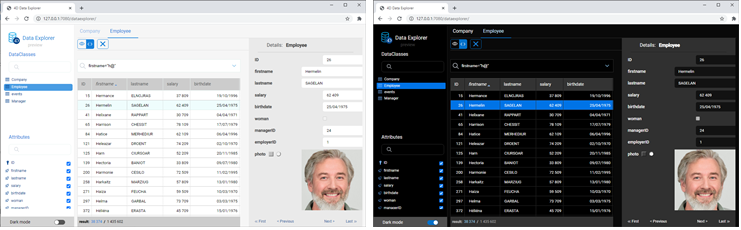
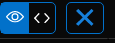
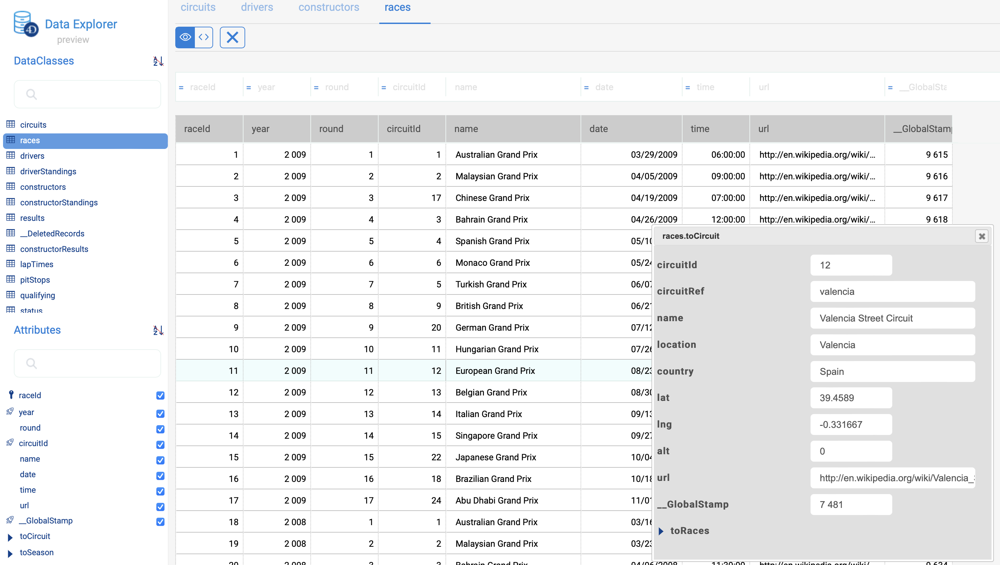
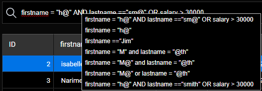

L'Explorateur de données fournit une interface Web pour visualiser, interroger et modifier les données de votre datastore. Grâce à cet outil, vous pouvez facilement naviguer parmi toutes vos entités et rechercher, ordonner ou filtrer les valeurs des attributs. Il vous aide à identifier rapidement les problèmes à chaque étape du processus de développement, ainsi qu'à contrôler et à modifier les données.


## Configuration

The Data Explorer relies on the [`WebAdmin`](webAdmin.md) web server component for the configuration and authentication settings.

- **configuration**: the Data Explorer configuration reuses the [`WebAdmin` web server settings](webAdmin.md#webadmin-settings),
- **authentication**: access to the Data Explorer is granted when the [session user is authenticated](webAdmin.md#authentication-and-session) and has the "WebAdmin" privilege. When the Data Explorer is accessed through the **Data Explorer** menu item (see below), an automatic authentication is provided.

> The Data Explorer access can be disabled using the [`.setAdminProtection()`](API/DataStoreClass.md#setadminprotection) function.

## Ouverture de l'Explorateur de données

[The `WebAdmin` web server](webAdmin.md#starting-the-webadmin-web-server) is started automatically if necessary when the Data Explorer is clicked on.

Pour se connecter à la page web de l'Explorateur de données :

- A partir d'une application 4D (avec interface) :
  - To open a new 4D window with the Data Explorer page displayed in a web area, select **Data Explorer** in the **Records** menu or click on the **Data** button in the main toolbar.
  - To open the Data Explorer in an external browser tab, select **Data Explorer In Browser** in the **Records** menu or press the **Alt** key (Windows)/**Option** key (macOS) and click on the **Data** button in the main toolbar.

- From 4D Server, select **Data Explorer In Browser** in the **Window** menu (the Data Explorer can only be opened on an external browser).

- Que vous utilisiez une application 4D sans interface ou non, vous pouvez ouvrir votre navigateur web et entrer l'adresse suivante :

`IPaddress:HTTPPort/dataexplorer`
or
`IPaddress:HTTPSPort/dataexplorer`

In this context, you will be prompted to enter the [access key](webAdmin.md#access-key) to open a `WebAdmin` session on the server:


> [HTTPPort](webAdmin.md#http-port) and [HTTPSPort](webAdmin.md#https-port) values are configured in the `WebAdmin` settings.

## Conditions requises

L'Explorateur de données prend en charge les navigateurs Web suivants :

- Chrome
- Safari
- Edge
- FireFox

La résolution minimale pour utiliser l'Explorateur de données est de 1280x720. La résolution recommandée est de 1920x1080.

## Parcourir les données

En plus d'une vue complète et personnalisable de vos données, l'Explorateur de données vous permet de rechercher et d'ordonner vos données.

### Principes de base

The Data Explorer provides an overall access to the ORDA data model with respect to the [ORDA mapping rules](ORDA/dsMapping.md#general-rules).

:::info

Lorsque les données ou le modèle ORDA sont modifiés du côté de la base de données (ajout de table, enregistrement édité ou supprimé, etc.), il suffit de rafraîchir la page de l'Explorateur de données dans le navigateur (à l'aide de la touche F5, par exemple).

:::

You can switch to the **dark mode** display theme using the selector at the bottom of the page:




La page contient plusieurs zones :

- On the left side are the **Dataclasses area** and **Attributes area**, allowing you can select the dataclasses and attributes to display. Les attributs sont classés selon l'ordre de création de la structure sous-jacente. Les clés primaires et les attributs indexés ont une icône spécifique. Vous pouvez filtrer la liste des noms de dataclasses et d'attributs proposés en utilisant les zones de recherche respectives.
  

- The central part contains the **Search area** and the **Data grid** (list of entities of the selected dataclass). Chaque colonne de la grille représente un attribut du datastore.
  - Par défaut, toutes les entités sont affichées. Vous pouvez filtrer les entités affichées en utilisant la zone de recherche. Two query modes are available: [Query on attributes](#query-on-attributes) (selected by default), and the [Advanced query with expression](#advanced-query-with-expression). You select the query mode by clicking on the corresponding button (the **X** button allows you to reset the query area and thus stop filtering):
    
  - Le nom de la dataclass sélectionnée est ajouté sous forme d'onglet au-dessus de la grille de données. A l'aide de ces onglets, vous pouvez passer d'une dataclasse à une autre qui a déjà été sélectionnée. Vous pouvez supprimer une dataclasse référencée en cliquant sur l'icône "supprimer" à droite du nom de la dataclass.
  - Vous pouvez réduire le nombre de colonnes en décochant les attributs dans la partie gauche. Vous pouvez également changer les colonnes dans la grille de données à l'aide du glisser-déposer. You can click on a column header to [sort entities](#ordering-entities) according to its values (when possible).
  - Si une opération nécessite beaucoup de temps, une barre de progression s'affiche. You can stop the running operation at any moment by clicking on the red button:<br/>
    

- On the right side is the **Details area**: it displays the attribute values of the currently selected entity as well as **related data**, if any. You can browse between the entities of the dataclass by clicking the **First** / **Previous** / **Next** / **Last** links at the bottom of the area.
  - All attribute types are displayed, including pictures, objects (expressed in json) as well as [computed](../ORDA/ordaClasses.md#computed-attributes-1) and [alias](../ORDA/ordaClasses.md#alias-attributes-1) attributes.
  - Related data (many-to-one and one-to-many relations) can be displayed through expandable/collapsable areas:<br/>
    
  - **Ctrl+Click** (Windows) or **Command+Click** (macOS) on a related attribute name in the right side area displays the values of the attribute in an independant, floating area:<br/>
    

### Ordonner les entités

Vous pouvez réorganiser la liste des entités affichées en fonction des valeurs des attributs. Tous les types d'attributs peuvent être utilisés pour un tri, sauf l'image et l'objet.

- Cliquez sur un en-tête de colonne pour ordonner les entités en fonction des valeurs d'attribut correspondantes. Par défaut, le tri est ascendant. Cliquez deux fois pour un tri décroissant. A column used to sort entities is displayed with a small icon and its name is in _italics_.


- Vous pouvez trier les attributs sur plusieurs niveaux. Par exemple, vous pouvez trier les employés par ville, puis par salaire. To do that, hold down the **Shift** key and click sequentially on each column header to include in the sort order.

### Requête sur les attributs

Dans ce mode, vous pouvez filtrer les entités en saisissant les valeurs à rechercher (ou à exclure) dans les zones situées au-dessus de la liste des attributs. Vous pouvez filtrer un ou plusieurs attributs. La liste des entités est automatiquement mise à jour lors de la saisie.


Si vous saisissez plusieurs attributs, un "ET" est automatiquement appliqué. For example, the following filter displays entities with _firstname_ attribute starting with "flo" AND _salary_ attribute value > 50000:


The **X** button allows you to remove entered attributes and thus stop filtering.

Différents opérateurs et options de requête sont disponibles, en fonction du type de données de l'attribut.

> Vous ne pouvez pas filtrer sur les attributs d'image ou d'objet.

#### Opérateurs numériques

Avec les attributs numériques, de date et d'heure, l'opérateur "=" est sélectionné par défaut. Toutefois, vous pouvez sélectionner un autre opérateur dans la liste des opérateurs (cliquez sur l'icône "=" pour afficher la liste) :


#### Dates

Avec les attributs de date, vous pouvez saisir la date à utiliser à l'aide d'un widget de sélection de date (cliquez sur la zone de la date pour afficher le calendrier) :


#### Booléens

When you click on a boolean attribute area, you can filter on **true**/**false** values but also on **null**/**not null** values:


- **null** indicates that the attribute value was not defined
- **not null** indicates that the attribute value is defined (thus true or false).

#### Text

Les filtres texte ne sont pas diacritiques (a = A).

Le filtre est du type "commence par". Par exemple, si vous saisissez "Jim", vous obtiendrez les valeurs "Jim" et "Jimmy".

Vous pouvez également utiliser le caractère générique (@) pour remplacer un ou plusieurs caractères de départ. Par exemple :

| Un filtre avec      | Résultats                                                 |
| ------------------- | --------------------------------------------------------- |
| Bel                 | Toutes les valeurs qui commencent par "Bel"               |
| @do    | Toutes les valeurs contenant "do"                         |
| Bel@do | Toutes les valeurs commençant par "Bel" et contenant "do" |

Si vous souhaitez créer des requêtes plus spécifiques, telles que "est exactement", vous devrez utiliser la fonction de requêtes avancées.

### Requêtes avancées avec des expressions

Lorsque vous sélectionnez cette option, une zone de requête s'affiche au-dessus de la liste des entités, et vous permet de saisir une expression à utiliser pour filtrer le contenu :


Vous pouvez saisir des requêtes avancées qui ne sont pas disponibles en tant que requêtes d'attributs. For example, if you want to find entities with _firstname_ attribute containing "Jim" but not "Jimmy", you can write:

```
firstname=="Jim"
```

You can use any ORDA query expression as [documented with the `query()` function](API/DataClassClass.md#query), with the following limitations or differences:

- For security, you cannot execute formulas using `eval()`.
- Placeholders cannot be used; you have to write a _queryString_ with values.
- Les valeurs de chaîne contenant des caractères d'espacement doivent être intégrées dans des guillemets doubles ("").

Par exemple, avec la dataclass Employee, vous pouvez écrire :

```
firstname = "Marie Sophie" ET manager.lastname = "@th"
```

You can click on the `v` icon to display both [`queryPlan`](API/DataClassClass.md#queryplan) and [`queryPath`](API/DataClassClass.md#querypath). Dans cette zone, vous pouvez survoler les blocs de sous-requêtes pour avoir des informations détaillées par sous-requête :


Faites un clic droit dans la zone des requêtes pour afficher les précédentes requêtes valides :



## Modifier les données

L'explorateur de données vous permet de modifier les valeurs des attributs, d'ajouter ou de supprimer des entités. Cette fonctionnalité est destinée aux administrateurs, par exemple pour tester des mises en œuvre ou résoudre des problèmes liés à des données non valides.

### Autoriser les modifications

For security reasons, to be able to edit data through the Data Explorer, you first need to enable the editing mode using the **Allow editing** selector. Lorsque cette option est activée, des boutons de modification sont affichés sur le côté droit :


This selector is enabled **per dataclass** and **per browser session**.

:::info

Le sélecteur est destiné à éviter les modifications accidentelles car aucune boîte de dialogue de confirmation n'est affichée lors de l'édition de données via l'Explorateur de données.

:::

### Saisie des valeurs

When the **Allow editing** selector is enabled for a dataclass, you can enter values for a new or selected entity through dedicated input widgets in the **Details** area for the selected dataclass.

Les valeurs d'attributs scalaires suivants peuvent être modifiées :

- text
- boolean
- numérique
- date
- time
- image (vous pouvez télécharger ou glisser-déposer une image)
- object (JSON string)

Les attributs Blob ne peuvent pas être modifiés.

New or modified values are stored in the local cache, you need to [save them explicitely](#saving-modifications) to store them in the data.

### Création d'entités

You can create a new, empty entity in the selected table by clicking on the creation button . You can then [enter values](#entering-values) for this entity.

The new entity is is kept in the local cache, you need to [save it explicitely](#saving-modifications) to store it in the data.

:::info

Les valeurs d'attributs qui doivent être calculées par 4D (ID, attributs calculés) ne seront renvoyées qu'après l'enregistrement de l'entité.

:::

### Rechargement des valeurs

The **reload** button  reloads the entity attribute values from the data file. Ce bouton est utile par exemple lorsque vous voulez vous assurer que les valeurs affichées sont les valeurs enregistrées les plus récentes.

### Enregistrer les modifications

Except for [deletion](#deleting-entities) (see below), entity modifications are done locally and need to be saved so that they are stored in the data file.

To save modifications or to save an entity you created in the Data Explorer, click on the **Save** button .

:::info

Les modifications sur une entité existante sont automatiquement enregistrées lorsque vous sélectionnez une autre entité de la même dataclass.

:::

En cas de conflit (par ex. un autre utilisateur a modifié la même valeur d'attribut sur la même entité), un message d'erreur est affiché au bas de l'Explorateur de données. You can click on the [**Reload** button](#reloading-values) to get the new value from the data and then, apply and save your modifications.

### Suppression d'entités

You can delete entities by clicking on the **delete** button .

To delete a set of entities, select two or more entities in the list area using **Shift+click** (continuous selection) or **Ctrl/Command+click** (discontinuous selection) and click on the **delete** button.

:::note

Si certaines entités n'ont pas pu être supprimées à cause d'un conflit (par exemple, des entités verrouillées sur le serveur), elles sont surlignées dans la liste.

:::

:::caution

Aucune boîte de dialogue de confirmation n'est affichée lorsque vous supprimez des entités. Les entités sélectionnées sont immédiatement supprimées des données.

:::
