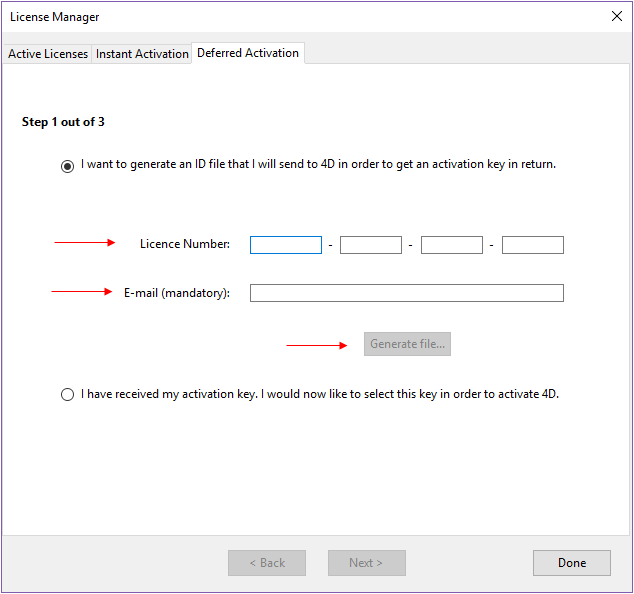
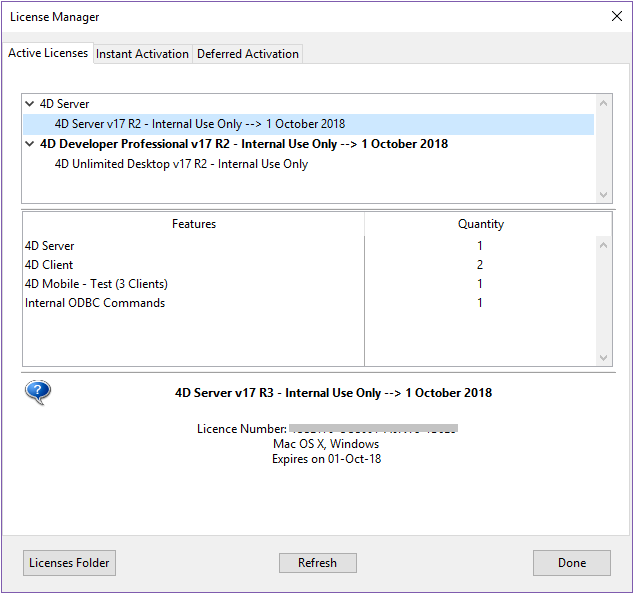
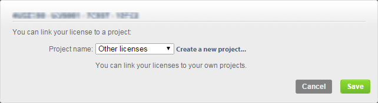
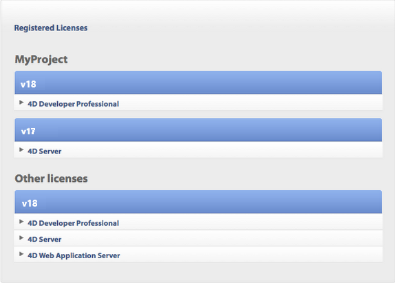

Une fois installés sur votre disque, les produits 4D doivent être activés pour que vous puissiez les utiliser. Usually, the activation is automatic if you [sign in using your 4D account](GettingStarted/Installation.md) in the Welcome Wizard.

Cependant, dans des cas spécifiques, vous pourriez avoir besoin d'activer vos licences manuellement, si par exemple :

- votre configuration ne permet pas l'activation automatique,
- vous avez acheté des licences supplémentaires.

Aucune activation n’est requise pour les usages suivants :

- 4D utilisé en mode distant (connexion à un 4D Server)
- 4D utilisé en mode local avec un projet d'application interprété sans accès au mode Développement.

## Première activation

With 4D, select the **License Manager...** command from the **Help** menu of the application. Pour activer 4D Server, lancez l'application 4D Server. The dialog box for choosing the [activation mode](#activation-mode) appears.

4D vous propose trois modes d’activation. We recommend **Instant Activation**.

### Activation immédiate

Saisissez votre identifiant utilisateur (e-mail ou compte 4D) ainsi que votre mot de passe. Si vous n'avez pas encore de compte client chez 4D, vous devez en créer un à l'adresse suivante :

[https://account.4d.com/us/login.shtml](https://account.4d.com/us/login.shtml)

Entrez ensuite le numéro de licence du produit à activer. Ce numéro se trouve dans l'e-mail de livraison ou le certificat d'authenticité reçu par courrier.

### Activation différée

If you are unable to use [instant activation](#instant-activation) because your computer does not have internet access, please proceed to deferred activation using the following steps.

1. In the License Manager window, select the **Deferred Activation** tab.
2. Enter the License Number and your e-mail address, then click **Generate file** to create the ID file (_reg.txt_).

3. Save the _reg.txt_ file to a USB drive and take it to a computer that has internet access.
4. On the machine with internet access, login to [https://activation.4d.com](https://activation.4d.com).
5. On the Web page, click on the **Choose File...** button and select the _reg.txt_ file from steps 3 and 4; then click on the **Activate** button.
6. Téléchargez le(s) fichier(s) de licence.

7. Save the _license4d_ file(s) on a shared media and transfer them back to the 4D machine from step 1.
8. Now back on the machine with 4D, still on the **Deferred Activation** page, click **Next**; then click the **Load...** button and select a _license4d_ file from the shared media from step 7.

With the license file loaded, click on **Next**.

9. Click on the **Add N°** button to add another license. Répétez ces étapes jusqu'à ce que toutes les licences téléchargées à l'étape 6 aient été intégrées.

Votre application 4D est désormais activée.

### Activation d’urgence

Ce mode permet l’activation exceptionnelle et temporaire de l’application 4D (5 jours maximum) sans connexion au site Internet de 4D. Cette activation ne peut être utilisée qu’une seule fois.

## Ajouter des licences

Vous pouvez à tout moment ajouter de nouvelles licences, par exemple pour étendre les capacités de votre application.

Choose the **License Manager...** command from the **Help** menu of the 4D or 4D Server application, then click on the **Refresh** button:

This button connects you to our customer database and automatically activates any new or updated licenses related to the current license (the current license is displayed in **bold** in the "Active Licenses" list). Vous devrez simplement saisir vos identifiants 4D (compte et mot de passe).

- If you purchased additional expansions for a 4D Server, you do not need to enter any license number -- just click **Refresh**.
- A la première activation d'un 4D Server, vous devez uniquement saisir le numéro du serveur et toutes les licences d'expansion associées sont automatiquement affectées.

You can use the **Refresh** button in the following contexts:

- Lorsque vous avez acquis une expansion supplémentaire et souhaitez l'activer,
- Lorsque vous voulez mettre à jour un numéro de licence temporaire ayant expiré (Partenaires ou évolutions).

## 4D Online Store

Sur le site web 4D Store, vous pouvez commander, mettre à jour, étendre et gérer vos produits 4D. You can reach the store at the following address: [https://store.4d.com/us/](https://store.4d.com/us/) (you will need to select your country).

Click **Login** to sign in using your existing account or **New Account** to create a new one, then follow the on-screen instructions.

### Gestion des licences

After you log in, you can click on **License list** at the top right of the page:

Vous pouvez ensuite gérer vos licences en les affectant à des projets.

Select the appropriate license from the list then click **Link to a project... >**:

Vous pouvez sélectionner un projet existant ou créer un nouveau :

Les projets vous permettent d'organiser vos licences comme vous le souhaitez :

## Dépannage

En cas d’échec du processus d’installation ou d’activation, veuillez consulter le tableau suivant, présentant les causes de dysfonctionnements les plus fréquentes :

| Symptômes                                                                                                  | Causes possibles                                | Solution(s)                                                                                                                                             |
| ---------------------------------------------------------------------------------------------------------- | ----------------------------------------------- | -------------------------------------------------------------------------------------------------------------------------------------------------------------------------- |
| Impossible de télécharger le produit depuis le site Internet de 4D                                         | Site Internet indisponible, antivirus, firewall | 1- Réessayez ultérieurement OU 2- Désactivez temporairement votre antivirus ou votre firewall.                                                             |
| Impossible d’installer le produit sur le disque (installation refusée). | Droits d’accès utilisateur insuffisants         | Ouvrez une session avec des droits d’accès permettant l’installation d’applications (accès administrateur)                                              |
| Echec de l’activation en ligne                                                                             | Antivirus, firewall, proxy                      | 1- Désactivez temporairement votre antivirus ou votre firewall OU 2- Utilisez l’activation différée (non disponible avec les licences des versions "R") |

Si ces informations ne vous permettent pas de résoudre votre problème, veuillez contacter 4D ou votre distributeur local.

## Contacts

Pour toute question relative à l’installation ou l’activation de votre produit, veuillez contacter 4D Sas ou votre distributeur local.

Pour la France :

- Web: [https://us.4d.com/4d-technical-support](https://us.4d.com/4d-technical-support)
- Téléphone : 0892 68 09 97 (0,34 Euro Ttc/Min)

Pour le Royaume-Uni :

- Web: [https://uk.4d.com/4d-technical-support](https://uk.4d.com/4d-technical-support)
- Téléphone : 01625 536178
