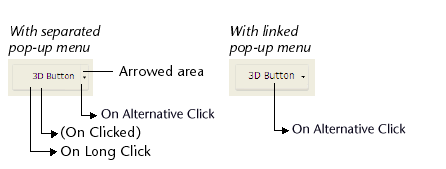

| Code | Peut être appelé par                                                                                                                                         | Définition                                                                                                                                                                |
| ---- | ------------------------------------------------------------------------------------------------------------------------------------------------------------ | ------------------------------------------------------------------------------------------------------------------------------------------------------------------------- |
| 38   | [Button](FormObjects/button_overview.md) - [List Box](FormObjects/listbox_overview.md) - [List Box Column](FormObjects/listbox_overview.md#list-box-columns) | <li>Buttons: The "arrow" area of a button is clicked</li><li>List boxes: In a column of an object array, an ellipsis button ("alternateButton" attribute) is clicked</li> |

## Description

### Boutons

Some button styles can be [linked to a pop-up menu](FormObjects/properties_TextAndPicture.md#with-pop-up-menu) and display an triangle. En cliquant sur ce triangle, une fenêtre contextuelle de sélection apparait et fournit un ensemble d'actions alternatives en relation avec l'action du bouton principal.

4D allows you to manage this type of button using the `On Alternative Click` event. Cet événement est généré lorsque l'utilisateur clique sur le triangle (dès que le bouton de la souris est maintenu enfoncé) :

- If the pop-up menu is **separated**, the event is only generated when a click occurs on the portion of the button with the arrow. Note that the [standard action](https://doc.4d.com/4Dv19R7/4D/19-R7/Standard-actions.300-6013479.en.html) assigned to the button (if any) is not executed in this case.
- If the pop-up menu is **linked**, the event is generated when a click occurs on any part of the button. Note that the [`On Long Click`](onLongClick.md) event cannot be generated with this type of button.

### List box

This event is generated in columns of [object array type list boxes](FormObjects/listbox_overview.md#object-arrays-in-columns-4d-view-pro), when the user clicks on a widget ellipsis button ("alternateButton" attribute).

See the [description of the "alternateButton" attribute](FormObjects/listbox_overview.md#alternatebutton).
