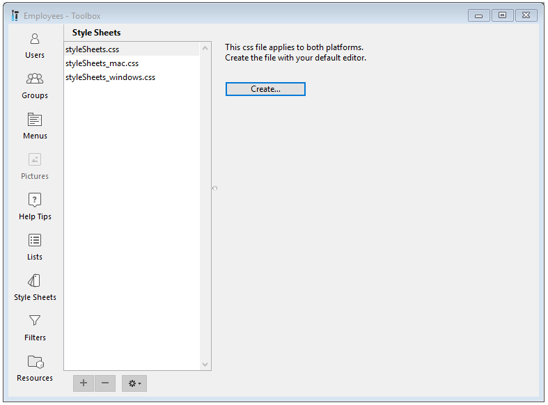

Une feuille de style regroupe une combinaison d’attributs d'objets formulaire —  allant des attributs de texte à quasiment tous les attributs d'objet disponibles.

Outre l’harmonisation de l’interface de vos applications, l’usage de feuilles de style a trois avantages majeurs :

- Gain de temps en développement : pour chaque objet, vous définissez en une seule opération un ensemble de paramétrages.
- Facilité de maintenance : les feuilles de styles ont la propriété de modifier l’apparence de tous les objets qui les utilisent. Changer, par exemple, la taille de la police dans une feuille de style changera la taille de la police pour tous les objets qui utilisent cette feuille de style.
- Contrôle du développement multi-plate-forme : les feuilles de style peuvent s'appliquer aux deux plate-formes macOS et Windows, ou bien à l'une d'elles uniquement. Lorsqu'une feuille de style est appliquée, 4D utilise automatiquement la feuille de style appropriée.

## Création ou modification d'une feuille de style

Vous créez des feuilles de styles à partir d'un éditeur de feuilles de styles de votre choix, en sauvegardant le fichier sous une extension ".css" dans le dossier "/SOURCES" du projet.

The 4D Tool Box provides a **Style Sheets** page as a shortcut option to create and edit one of three platform-specific named style sheets.

1. Open the **Style Sheets** page by choosing the **Tool Box > Style Sheet** from the Design menu or click on the **Tool Box** icon in the Form Editor toolbar.



2. Select the type of style sheet to create and click on the **Create** or **Edit** button: 

3. La feuille de style s'ouvrira dans votre éditeur de texte par défaut.

## Fichiers feuilles de style

4D accepte trois fichiers feuilles de style spécifiques :

| Feuille de style                                             | Plate-forme                                                             |
| ------------------------------------------------------------ | ----------------------------------------------------------------------- |
| styleSheets.css                              | Feuille de style globale par défaut pour macOS et Windows               |
| styleSheets_mac.css     | Pour définir des styles d'attributs spécifiques de macOS uniquement     |
| styleSheets_windows.css | Pour définir des styles d'attributs spécifiques pour Windows uniquement |

Ces fichiers sont stockés dans le dossier "/SOURCES" du projet. They can also be accessed directly via the [CSS Preview](formEditor.md#css-preview) in the Form editor toobar.

## Architecture des feuilles de style

Bien qu'elles soient adaptées pour répondre aux besoins spécifiques des formulaires 4D, les feuilles de style pour les projets d'application suivent généralement la syntaxe et la grammaire des CSS2.

Chaque règle de style d'une feuille de style contient deux parties :

- a _Selector_ - A selector defines where to apply the style. 4D prend en charge les sélecteurs "object type", "object name", "class", "all objects", et "attribute value".

- a _Declaration_ - The declaration defines the actual style to apply. Plusieurs lignes de déclaration peuvent être regroupées pour former un bloc de déclaration. Chaque ligne d'un bloc de déclaration CSS doit se terminer par un point-virgule et l'intégralité du bloc doit être entourée d'accolades.

## Sélecteurs de feuilles de style

### Type d'objet

Le type d'objet définit le type d'objet à styler et correspond au sélecteur d'élément CSS.

Spécifiez le type d'objet, puis entre accolades, déclarez le(s) style(s) à appliquer.

> The object type corresponds to the JSON [type](FormObjects/properties_Object.md#type) property of form objects.

In the following example, all objects of the _button_ type will display text in the Helvetica Neue font, with a size of 20 pixels:

```
button {
    font-family: Helvetica Neue;
    font-size: 20px;
}
```

Pour appliquer le même style à plusieurs types d’objets, spécifiez les types d'objets séparés par une "," puis, entre accolades, déclarez le(s) style(s) à appliquer :

```
text, input {
  text-align: left;
  stroke: grey;
}
```

### Nom d'objet

Corresponding to the CSS **ID selector**, the object name defines a specific object to style since the object's name is unique within the form.

Désignez l'objet avec le caractère "#" avant le nom de l'objet, puis entre accolades, déclarez le(s) style(s) à appliquer.

Dans l'exemple suivant, le texte de l'objet portant le nom "okButton" sera affiché dans la police Helvetica Neue, avec une taille de 20 pixels :

```
#okButton {
    font-family: Helvetica Neue;
    font-size: 20px;
}
```

### Classe

Corresponding to the CSS **class selector**, the class defines the style for all form objects with the `class` attribute.

Vous pouvez spécifier les classes à utiliser avec un caractère "." suivi du nom de la classe et, entre accolades, déclarez le(s) style(s) à appliquer.

In the following example, the text of all objects with the `okButtons` class will be displayed in Helvetica Neue font, with a size of 20 pixels, aligned in the center:

```
.okButtons {
    font-family: Helvetica Neue;
    font-size: 20px;
    text-align: center;
}
```

Pour indiquer qu'un style doit être appliqué uniquement à des objets de type différent, spécifiez le type suivi de "." et du nom de la classe, puis déclarez entre accolades le(s) style(s) à appliquer.

```
text.center {
  text-align: center;
  stroke: red;
}
```

In the 4D form description, you associate a class name to an object using the `class` attribute. Cet attribut contient un ou plusieurs noms de "class", séparés par un espace :

```
class: "okButtons important"       
```

### Tous les objets

Corresponding to the CSS **universal selector**, the "\*" character indicates that the following style will be applied to all objects on the form.

Indiquez qu'un style doit s'appliquer à tous les objets de formulaire avec le caractère "\*", puis, entre accolades, déclarez le(s) style(s) à appliquer.

Dans l'exemple suivant, tous les objets auront un fond gris :

```
* {
  fill: gray;
}
```

### Attributs spécifiques

Corresponding to the CSS **attribute selectors**, styles can be applied to all form objects with a specific attribute.

Spécifiez l'attribut entre parenthèses, puis entre accolades, déclarez le(s) style(s) à appliquer.

#### Syntaxes prises en charge

| Syntaxe                                                                                   | Description                                                                                             |
| ----------------------------------------------------------------------------------------- | ------------------------------------------------------------------------------------------------------- |
| [attribute]                           | matches objects with the `attribute`                                                                    |
| [attribute="valeur"]                  | matches objects with the `attribute` value containing exactly the specified "value"                     |
| [attribute~="valeur"] | matches objects with the `attribute` value containing the "value" among a space-separated list of words |
| [attribute\|="valeur"]                | matches objects with an `attribute` whose value starts with "value"                                     |

#### Exemples

All objects with the `borderStyle` attribute will have purple lines:

```
[borderStyle]
{
     stroke: purple;
}
```

Tous les objets de type texte ayant un attribut text dont la valeur est "Hello" auront des lettres bleues :

```
text[text=Hello]
{
     stroke: blue;
}
```

Tous les objets ayant un attribut text dont la valeur est "Hello" auront des traits bleus :

```
[text~=Hello]
{
     stroke: blue;
}

```

Tous les objets de type texte ayant un attribut text dont la valeur commence par "Hello" auront des lettres jaunes :

```
text[text|=Hello]
{
     stroke: yellow;


}
```

## Déclarations de feuilles de style

### Media Queries

Media queries are used to apply color schemes to an application.

A media query is composed of a media feature and a value (e.g., `\<media feature>:\<value>` ).

Available media features:

- `prefers-color-scheme`

Available media feature expressions:

- **light**<br/>For using a light scheme
- **dark**<br/>For using a dark scheme

> Color schemes are only supported on macOS.

##### Exemple

This CSS defines a color combination for text and text background in the light scheme (default) and another combination when the dark scheme is selected:

```
@media (prefers-color-scheme: light) {
 .textScheme {
   fill: LightGrey;
   stroke: Black;
  }
}

@media (prefers-color-scheme: dark) {
  .textScheme {
    fill: DarkSlateGray;
    stroke: LightGrey;
  }
}
```

### Object Attributes

La majorité des attributs d'objet formulaire peuvent être définis dans une feuille de style, à l'exception des attributs suivants :

- `method`
- `type`
- `classe`
- `evénement`
- `choiceList`, `excludedList`, `labels`, `list`, `requiredList` (list type)

Form object attributes can be declared with their [JSON name](FormObjects/properties_Reference.md) as CSS attributes (not including object types, methods, events, and lists).

#### Mappage d'attributs

Les attributs répertoriés ci-dessous peuvent accepter le nom 4D ou le nom CSS.

| 4D               | CSS                |
| ---------------- | ------------------ |
| `borderStyle`    | `border-style`     |
| `fill`           | `background-color` |
| `fontFamily`     | `font-family`      |
| `fontSize`       | `font-size`        |
| `fontStyle`      | `font-style`       |
| `fontWeight`     | `font-weight`      |
| `stroke`         | `color`            |
| `textAlign`      | `text-align`       |
| `textDecoration` | `text-decoration`  |
| `verticalAlign`  | `vertical-align`   |

> 4D-specific values (_e.g._, `sunken`) are not supported when using CSS attribute names.

#### Valeurs d'attributs spécifiques

- For `icon`, `picture`, and `customBackgroundPicture` attributes that support a path to an image, the syntax is:

```
icon: url("/RESOURCES/Images/Buttons/edit.png"); /* chemin absolu */
icon: url("edit.png"); /* chemin relatif vers le fichier du formulaire */
```

- For `fill`, `stroke` , `alternateFill` , `horizontalLineStroke` and `verticalLineStroke`, three syntaxes are supported:

  - CSS color name: `fill: red;`
  - Hexa value: `fill: #FF0000;`
  - the `rgb()` function: `fill:rgb(255,0,0)`

- Si une chaîne utilise des caractères interdits en CSS, vous pouvez l'entourer de guillemets simples ou doubles. Par exemple :
  - a xliff reference: `tooltip: ":xliff:CommonMenuFile";`
  - a datasource with a field expression: `dataSource: "[Table_1:1]ID:1";`

## Ordre de priorité

Les projets 4D hiérarchisent les définitions de style en conflit, d'abord par la définition du formulaire, puis par les feuilles de style.

### JSON vs Feuille de style

Si un attribut est défini dans la description du formulaire JSON et dans une feuille de style, 4D utilisera la valeur du fichier JSON.

To override this behavior, the style value must be followed with an `!important` declaration.

**Example 1:**

| Description du formulaire JSON | Feuille de style | 4D affiche |
| ------------------------------ | ---------------- | ---------- |
| `"text": "Button",`            | `text: Edit;`    | `"Button"` |

**Example 2:**

| Description du formulaire JSON | Feuille de style         | 4D affiche |
| ------------------------------ | ------------------------ | ---------- |
| `"text": "Button",`            | `text: Edit !important;` | `"Edit"`   |

### Feuilles de style multiples

A l'exécution, 4D hiérarchise automatiquement les feuilles de style dans l'ordre suivant :

1. The 4D form will first load the default CSS file `/SOURCES/styleSheets.css`.
2. It will then load the CSS file for the current platform `/SOURCES/styleSheets_mac.css` or `/SOURCES/styleSheets_windows.css`.
3. S'il existe, il chargera alors un fichier CSS spécifique défini dans le formulaire JSON :

- un fichier pour les deux plates-formes :

```
"css": "<path>" 
```

- ou une liste de fichiers pour les deux plates-formes :

```
"css": [
     "<path1>",
     "<path2>" 
      ],
```

- ou une liste de fichiers par plate-forme :

```
 "css": [
        {"path": "<path>", "media": "mac"},
        {"path": "<path>", "media": "windows"},
    ],
```

> Les chemins de fichiers peuvent être relatifs ou absolus.
>
> - Relative paths are resolved relative to the JSON form description file.
> - For security reasons, only filesystem paths are accepted for absolute paths. (_e.g._, "/RESOURCES", "/DATA")

## Voir également

See the [**CSS for 4D Forms**](https://www.youtube.com/watch?v=3Hk4FUQENyQ) video presentation.
