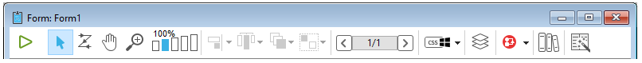
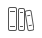
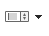
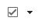
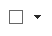
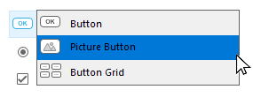
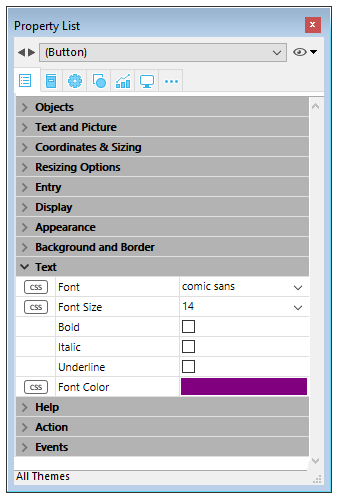
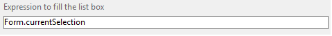
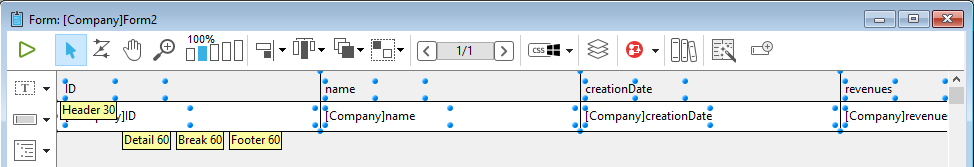
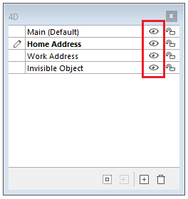

4D propose un éditeur de formulaires très complet qui vous permet de modifier votre formulaire jusqu’à ce que vous ayez atteint le résultat escompté. Dans l’éditeur de formulaires, vous pouvez créer et supprimer des objets, manipuler directement des objets et définir les propriétés des objets et des formulaires.

## Interface

L’éditeur de formulaires affiche chaque formulaire JSON ouvert dans sa propre fenêtre, dotée d’une barre d’outils et d’une barre d’objets. Vous pouvez ouvrir plusieurs formulaires en même temps.

### Display options

You can show or hide several interface elements on the current page of the form:

- **Inherited Form**: Inherited form objects (if there is an [inherited form](forms.md#inherited-forms)).
- **Page 0**: Objects from [page 0](forms.md#form-pages). Cette option vous permet de mieux visualiser et distinguer les objets de la page courante et ceux de la page 0.
- **Paper**: Borders of the printing page, which are shown as gray lines. This element can only be displayed by default in ["for printing" type](properties_FormProperties.md#form-type) forms.
- **Rulers**: Rulers of the Form editor’s window.
- **Markers**: Output control lines and associated markers that show the limits of the form’s different areas. This element can only be displayed by default in [list forms](properties_FormProperties.md#form-type).
- **Marker Labels**: Marker labels, available only when the output control lines are displayed. This element can only be displayed by default in [list forms](properties_FormProperties.md#form-type).
- **Limits**: Form’s limits. Lorsque cette option est sélectionnée, le formulaire est affiché dans l’éditeur tel qu’il apparaîtra en mode Application. Cette possibilité est particulièrement intéressante pour ajuster un formulaire sans devoir tester le mode Application pour visualiser le résultat.

> The [**Size Based on**](properties_FormSize.md#size-based-on), [**Hor margin**](properties_FormSize.md#hor-margin) and [**Vert margin**](properties_FormSize.md#vert-margin) settings of the form properties affect the form’s limits. Les limites du formulaire sont calculées en fonction des objets qui le composent. Lorsque vous déplacez ou agrandissez un objet placé près de la limite d’un formulaire, le rectangle de délimitation est modifié en conséquence.

#### Default display

When a form is opened in the editor, interface elements are displayed or hidden by default, depending on:

- the **New form default display** options set in the Preferences - unchecked options cannot be displayed by default.
- the current [form type](properties_FormProperties.md#form-type):
  - Markers and marker labels are always displayed by default on list forms
  - Paper is displayed by default on "for printing" forms.

#### Display/Hide elements

You can display or hide elements at any moment in the Form editor’s current window by selecting **Display** from the **Form** menu or the Form editor's context menu:


### Rulers

Les règles situées sur le côté et en bas de cette fenêtre ont pour but de vous aider à placer les objets dans le formulaire. They can be [displayed or hidden](#display-options).

Select **Ruler definition...** from the **Form** menu to change measurement units so that the form displays inches, centimeters, or pixels.

### Toolbar (Barre d’outils)

La barre d’outils de l’éditeur de formulaires propose un ensemble d’outils destinés à manipuler et modifier le formulaire. Chaque fenêtre dispose de sa propre barre d’outils.



La barre d’outils comporte les éléments suivants :

| Icône                                            | Nom                                                  | Description                                                                                                                                                                                                                                                                                                                                                                                                                                                 |
| ------------------------------------------------ | ---------------------------------------------------- | ----------------------------------------------------------------------------------------------------------------------------------------------------------------------------------------------------------------------------------------------------------------------------------------------------------------------------------------------------------------------------------------------------------------------------------------------------------- |
|          | Exécuter le formulaire                               | Permet de tester l’exécution du formulaire. Lorsque vous cliquez sur ce bouton, 4D ouvre une nouvelle fenêtre et affiche le formulaire dans son contexte (liste d’enregistrements pour un formulaire liste et enregistrement courant en page pour un formulaire détaillé). Le formulaire est exécuté dans le process principal.                                                          |
|        | [Selection tool](#selecting-objects)                 | Allows selecting, moving and resizing form objects.<p>**Note**: When an object of the Text or Group Box type is selected, pressing the **Enter** key lets you switch to editing mode.</p>                                                                                                                                                                                                                   |
|           | [Entry order](#data-entry-order)                     | Passe en mode “Ordre de saisie”, dans lequel il est possible de visualiser et de modifier l’ordre de saisie courant du formulaire. A noter que vous pouvez également visualiser l’ordre de saisie courant tout en travaillant dans le formulaire.                                                                                                                                                                           |
|           | [Moving](#moving-objects)                            | Passe en mode “Déplacement”, dans lequel il est possible d’atteindre rapidement n’importe quelle partie du formulaire en le faisant directement glisser dans la fenêtre. Le curseur prend la forme d’une main. Ce mode de navigation est particulièrement utile en cas de zoom dans le formulaire.                                                                                                          |
|             | [Zoom](#zoom)                                        | Permet de modifier l’échelle d’affichage du formulaire (100% par défaut). Vous pouvez passer en mode “Zoom” en cliquant sur le bouton loupe ou en cliquant directement sur la barre correspondant à l’échelle désirée. Cette fonction est détaillée dans le paragraphe précédent.                                                                                                        |
|        | [Alignment](#aligning-objects)                       | Ce bouton est associé à un menu permettant d’aligner les objets dans le formulaire. It is enabled (or not) depending on the objects selected.<p>Available only with CSS Preview None</p>                                                                                                                                                                                                                 |
|     | [Distribution](#distributing-objects)                | Ce bouton est associé à un menu permettant de répartir les objets dans le formulaire. It is enabled (or not) depending on the objects selected.<p>Available only with CSS Preview None</p>                                                                                                                                                                                                               |
|            | [Level](#layering-objects)                           | Ce bouton est associé à un menu permettant de répartir les objets dans le formulaire. Il est activé (ou non) en fonction des objets sélectionnés.                                                                                                                                                                                                                                                        |
|            | [Group/Ungroup](#grouping-objects)                   | Ce bouton est associé à un menu permettant de grouper et dégrouper la sélection d’objets du formulaire. Il est activé (ou non) en fonction des objets sélectionnés.                                                                                                                                                                                                                                      |
|    | [Display and page management](forms.html#form-pages) | Cette zone permet de passer d’une page du formulaire à une autre et d’ajouter des pages. Pour naviguer parmi les pages du formulaire, cliquez sur les boutons fléchés ou cliquez sur la zone centrale et choisissez la page à afficher dans le menu qui apparaît. Si vous cliquez sur le bouton fléché de droite alors que vous êtes sur la dernière page du formulaire, 4D vous permet d’ajouter une page. |
|   | [CSS Preview](#css-preview)                          | Ce bouton permet de sélectionner le mode CSS à utiliser.                                                                                                                                                                                                                                                                                                                                                                                    |
|            | [Managing views](#views)                             | Ce bouton affiche ou masque alternativement la palette des vues. Cette fonction est détaillée dans la section Utiliser les vues d'objet.                                                                                                                                                                                                                                                                                    |
|         | [Displaying shields](#shields)                       | Chaque clic sur ce bouton provoque l’affichage successif de tous les types de badges de formulaire. Le bouton est également associé à un menu permettant de sélectionner directement le type de badge à afficher.                                                                                                                                                                                                           |
|          | [Preconfigured object library](objectLibrary.html)   | Ce bouton affiche la fenêtre de la bibiliothèque d'objets préconfigurée, proposant de nombreux objets auxquels des propriétés par défaut ont déjà été appliquées.                                                                                                                                                                                                                                                                           |
|  | [List Box Builder](#list-box-builder)                | Ce bouton crée de nouvelles list box de type entity selection.                                                                                                                                                                                                                                                                                                                                                                              |
|     | [Insert fields](#insert-fields)                      | This button inserts all fields (except object and blob type fields) of the form table in the form, along with their labels and with respect to interface standards.                                                                                                                                                                                                                                                      |

### Object bar

The object bar contains all the active and inactive objects that can be used in 4D forms. Some objects are grouped together by themes. Each theme includes several alternatives that you can choose between. When the object bar has the focus, you can select the buttons using the keys of the keyboard. The following table describes the object groups available and their associated shortcut key.

| Bouton                                     | Group                                                                                                                                                                                                                                                     | Key |
| ------------------------------------------ | --------------------------------------------------------------------------------------------------------------------------------------------------------------------------------------------------------------------------------------------------------- | :-: |
|       | [Text](FormObjects/text.md) / [Group Box](FormObjects/groupBox.md)                                                                                                                                                                                        |  T  |
|      | [Input](FormObjects/input_overview.md)                                                                                                                                                                                                                    |  F  |
|    | [Hierarchical List](FormObjects/list_overview.md) / [List Box](FormObjects/listbox_overview.md)                                                                                                                                                           |  L  |
|      | [Combo Box](FormObjects/comboBox_overview.md) / [Drop-down List](FormObjects/dropdownList_Overview.md) / [Picture Pop-up Menu](FormObjects/picturePopupMenu_overview.md)                                                                                  |  P  |
|     | [Button](FormObjects/button_overview.md) / [Picture Button](FormObjects/pictureButton_overview.md) / [Button Grid](FormObjects/buttonGrid_overview.md)                                                                                                    |  B  |
|      | [Radio Button](FormObjects/radio_overview.md)                                                                                                                                                                                                             |  R  |
|   | [Check Box](FormObjects/checkbox_overview.md)                                                                                                                                                                                                             |  C  |
|  | [Progress Indicator](FormObjects/progressIndicator.md) / [Ruler](FormObjects/ruler.md) / [Stepper](FormObjects/stepper.md) / [Spinner](FormObjects/spinner.md)                                                                                            |  I  |
|  | [Rectangle](FormObjects/shapes_overview.md#rectangle) / [Line](FormObjects/shapes_overview.md#line) / [Oval](FormObjects/shapes_overview.md#oval)                                                                                                         |  S  |
|   | [Splitter](FormObjects/splitters.md) / [Tab Control](FormObjects/tabControl.md)                                                                                                                                                                           |  D  |
|     | [Plug-in Area](FormObjects/pluginArea_overview.md) / [Subform](FormObjects/subform_overview.md) / [Web Area](FormObjects/webArea_overview.md) / [4D Write Pro](FormObjects/writeProArea_overview.md) / [4D View Pro](FormObjects/viewProArea_overview.md) |  X  |

To draw an object type, select the corresponding button and then trace the object in the form. After creating an object, you can modify its type using the Property List. Hold down the **Shift** key as you draw to constrain the object to a regular shape. Lines are constrained to horizontal, 45°, or vertical, rectangles are constrained to squares, and ovals are constrained to circles.

The current variant of the theme is the object that will be inserted in the form. When you click the right side of a button, you access the variant menu:



You can click twice on the button so that it remains selected even after you have traced an object in the form (continual selection). This function makes creating several successive objects of the same type easier. To cancel a continual selection, click on another object or tool.

### Liste de propriétés

Both forms and form objects have properties that control access to the form, the appearance of the form, and the behavior of the form when it is used. Form properties include, for example, the form’s name, its menu bar, and its size. Object Properties include, for example, an object’s name, its dimensions, its background color, and its font.

You can display and modify form and object properties using the Property List. It displays either form or objects properties depending on what you select in the editor window.

To display/hide the Property List, choose **Property List** from the **Form** menu or from the context menu of the Form editor. You can also display it by double-clicking in an empty area of the form.

#### Raccourcis

You can use the following shortcuts in the Property List:

- **Arrow key**s ↑ ↓: Used to go from one cell to another.
- **Arrow keys** ← →: Used to expand/collapse themes or enter edit mode.
- **PgUp** and **PgDn**: Used to scroll the Property List contents.
- **Home** and **End**: Used to scroll the Property List so that the first or last cell is displayed.
- **Ctrl+click** (Windows) or **Command+click** (macOS) on an event: Used to select/deselect every event in the list, according to the initial state of the event on which you clicked.
- **Ctrl+click** (Windows) or **Command+click** (macOS) on a theme label: Used to Collapse/Expand every theme in the list.
- **Ctrl+click** (Windows) or **Command+click** (macOS) on a property value displayed in **bold**: Resets the property to its default.

## Manipulating Form Objects

### Ajouter des objets

Vous pouvez ajouter des objets dans un formulaire de nombreuses manières :

- By drawing the object directly in the form after selecting its type in the object bar (see [Using the object bar](#using-the-object-bar))
- Par glisser-déposer depuis la barre d'objets
- By drag-and-drop or copy-paste operations on an object selected from the preconfigured [object library](objectLibrary.md),
- Par glisser-déposer depuis un autre formulaire,
- Par glisser-déposer depuis l'Explorateur (champs) ou les éditeurs du mode Développement (énumérations, images, etc.)

Une fois l'objet inséré, vous pouvez modifier toutes ses caractéristiques dans l'éditeur de formulaires.

Vous pouvez travailler avec deux types d'objets dans vos formulaires :

- **Static objects** (lines, frames, background pictures, etc.): These objects are generally used for setting the appearance of the form and its labels as well as for the graphic interface. Ces objets sont accessibles via la barre d'objets de l'éditeur de formulaires. You can also set their graphic attributes (size, color, font, etc.) and their resizing properties using the Property List. A la différence des objets actifs, les objets statiques ne sont pas associés à des variables. A noter qu'il est possible d'insérer des éléments dynamiques dans les objets statiques.

- **Active objects**: These objects perform tasks or functions in the interface and can take many forms: fields, buttons, scrollable lists, etc. Un objet actif est associé soit à un champ, soit à une variable.

### Sélectionner des objets

Avant de pouvoir réaliser une opération sur un objet (comme le changement de l’épaisseur d’une ligne ou d’une police), il est nécessaire de sélectionner cet objet.

Pour sélectionner un objet à l’aide de la barre d’outils :

1. Click the Arrow tool  in the toolbar.<p></p>

<p>Lorsque vous le faites glisser au-dessus du formulaire, le pointeur prend la forme du pointeur standard</p>.

2. Cliquez sur l’objet que vous souhaitez sélectionner. Resizing handles identify the selected object.<p></p>

Pour sélectionner un objet à l’aide de la Liste des propriétés :

1. Sélectionnez le nom de l’objet dans la liste de sélection située en haut de la palette. De cette manière, vous pouvez sélectionner un objet masqué par d’autres objets ou situé en-dehors des limites de la fenêtre.
   To deselect an object, click outside the object’s boundary or **Shift+click** the object.

> Il est également possible de sélectionner des objets en double-cliquant dans la fenêtre de résultat d’une recherche globale.

### Sélection de plusieurs objets

Il est souvent nécessaire de réaliser la même opération sur plusieurs objets d’un formulaire — par exemple, pour les déplacer, les aligner ou changer leur apparence. 4D vous permet de sélectionner plusieurs objets en même temps. Vous pouvez réaliser une sélection multiple en utilisant l’une des solutions suivantes :

- Choose **Select All** from the Edit menu to select all the objects.
- Right-click on the object and choose the **Select Similar Objects** command in the context menu.
- Hold down the **Shift** key and click the objects you want to select.
- Cliquez hors du groupe d’objets que vous souhaitez sélectionner et dessinez un rectangle de sélection entourant ou traversant les objets à sélectionner. Tout objet inclus dans les limites du rectangle ou qui touche ces limites est sélectionné lorsque vous relâchez le bouton de la souris.
- Hold down the **Alt** key (Windows) or the **Option** key (macOS) and draw a marquee. Dans ce cas, seuls les objets entièrement inclus dans ce rectangle seront sélectionnés.

La fenêtre ci-dessous représente la sélection de deux objets à l’aide d’un rectangle de sélection :


To deselect an object that is part of a set of selected objects, hold down the **Shift** key and click the object. Les autres objets demeurent sélectionnés. Pour désélectionner tous les objets, cliquez hors des limites de ces objets.

### Dupliquer des objets

Vous pouvez dupliquer tout objet de formulaire, y compris les objets actifs. Les copies d’objets actifs conservent toutes les propriétés de l’objet original comme le nom, le type, l’action automatique, le format d’affichage et la méthode objet.

Vous pouvez dupliquer directement un objet ou une sélection d’objets, ou utiliser la boîte de dialogue “Dupliquer plusieurs” pour paramétrer une duplication multiple d’objets. Cette boîte de dialogue vous permet de créer autant de duplicata d’un ou de plusieurs objets que vous voulez, en une seule opération.

Pour dupliquer directement un ou plusieurs objet(s) :

1. Sélectionnez le ou les objet(s) que vous souhaitez dupliquer.
2. Choose **Duplicate** from the **Edit** menu. 4D crée une copie de chaque objet sélectionné et place la copie juste à côté de l’original.
3. Déplacez la copie à l’emplacement souhaité.
   Si vous choisissez de nouveau la commande Dupliquer, 4D crée une autre copie pour chaque objet et la place exactement au même placement relatif par rapport à la première copie. Si vous devez répartir plusieurs copies d’un objet sur un axe, appliquez la procédure suivante. Dupliquez l’objet original, déplacez la copie à un autre emplacement sur le formulaire, puis dupliquez la copie. La deuxième copie adopte le même positionnement relatif par rapport à la première copie que celui qui existe entre la position de l’original et celle de la première copie. Les copies suivantes seront alors placées avec le même écart par rapport à leur original. Le schéma ci-dessous explique le fonctionnement du placement relatif des copies :


#### Dupliquer plusieurs

The "Duplicate Many" dialog box appears when you select one or more object(s) and choose the **Duplicate Many...** command from the **Object** menu.


- Dans la zone supérieure, saisissez le nombre de colonnes et de lignes d’objets que vous souhaitez obtenir. Par exemple, si vous voulez obtenir 3 colonnes et 2 lignes d’objets, saisissez 3 dans la zone Colonne(s) et 2 dans la zone Ligne(s). Si vous souhaitez ajouter horizontalement deux copies d’un objet, saisissez 3 dans la zone Colonnes (laissez la zone Ligne(s) à 1).

- Pour les lignes et les colonnes, définissez le décalage que vous souhaitez appliquer à chaque nouveau duplicata. La valeur saisie doit être exprimée en points Elle sera appliquée à chaque copie par rapport à l'objet d'origine. Par exemple, si vous souhaitez laisser un décalage vertical de 20 points entre chaque objet et que la hauteur de l'objet source est de 50 points, entrez 70 dans la zone "Décalage" de la colonne.

- If you wish to create a matrix of variables, select the **Number Variables** option and select the direction in which the variables are to be numbered, either by line(s) or by column(s).
  Cette option n’est active que si l’objet sélectionné est une variable. For more information on this option, refer to **Duplicating on a matrix** in the _Design Reference_.

### Déplacer des objets

Vous pouvez déplacer tout objet d’un formulaire, graphique ou actif, y compris les champs ou les objets créés à l’aide d’un modèle. Pour déplacer un objet, vous pouvez :

- Déplacer l’objet en le faisant glisser avec la souris,
- Déplacer l’objet pixel par pixel en utilisant les touches fléchées du clavier,
- Déplacer l’objet par paliers (de 20 pixels par défaut),

Lorsque vous commencez à déplacer un objet à l'aide de la souris, les poignées disparaissent. 4D affiche des marqueurs qui indiquent l’emplacement des limites de l’objet dans les règles, vous pouvez ainsi placer les objets avec précision. Prenez garde à ne pas cliquer sur les poignées, ce qui aurait pour effet de redimensionner l’objet. You can press the **Shift** key to carry out the move with a constraint.

When the [Magnetic Grid](#using-the-magnetic-grid) is on, objects are moved in stages indicating noticeable locations.

Pour déplacer un objet pixel par pixel :

- Sélectionnez le ou les objet(s) que vous souhaitez déplacer. A chaque fois que vous appuyez sur une touche fléchée, la sélection est déplacée d’un pixel dans la direction de la flèche.

Pour déplacer l’objet par paliers :

- Select the object or objects you want to move  and hold down the **Shift** key and use the arrow keys to move the object by steps. Par défaut, les paliers sont de 20 pixels. Vous pouvez modifier le pas dans la Page Formulaires des Préférences.

### Grouper des objets

4D vous permet de grouper des objets de manière à ce que vous puissiez sélectionner, déplacer et modifier ce groupe comme un seul objet. Les objets qui sont groupés conservent leur position relative par rapport aux autres objets du groupe. Les objets groupés sont par exemple un champ et son libellé, un bouton invisible et son icône, etc.

Lorsque vous redimensionnez un groupe, tous les objets du groupe sont redimensionnés proportionnellement (hormis les zones de texte, qui sont redimensionnées par étape suivant leur taille de police de caractères).

Vous pouvez dégrouper un groupe d’objets à tout moment et les traiter de nouveau comme des objets indépendants.

Un objet actif qui a été groupé doit être dégroupé pour que vous puissiez accéder à ses propriétés ou à sa méthode. However, it is possible to select an object belonging to a group without degrouping the set: to do this, **Ctrl+click** (Windows) or **Command+click** (macOS) on the object (the group must be selected beforehand).

Grouper des objets n’a d’effet que dans l’éditeur de formulaires. Lors de l’exécution du formulaire, tous les objets groupés (hormis les boutons radio dans les bases binaires) se comportent comme s’ils étaient indépendants.

> It is not possible to group objects belonging to different views and only those objects belonging to the current view can be grouped (see [Views](#views) ).

Pour grouper les objets :

1. Sélectionnez les objets que vous souhaitez grouper.
2. Choose **Group** from the Object menu. OR
   Click the Group button  in the toolbar of the Form editor:<p></p>
   4D marks the boundary of the newly grouped objects with handles. Les objets du groupe ne sont plus marqués séparément par des poignées. Désormais, lorsque vous modifiez le groupe d’objets, vous modifiez tous les objets qui le composent.

Pour dégrouper un groupe d’objets :

1. Sélectionnez le groupe que vous souhaitez dégrouper.
2. Choose **Ungroup** from the **Object** menu.<p>OR</p><p>Click the **Ungroup** button (variant of the **Group** button) in the toolbar of the Form editor.</p><p>If **Ungroup** is dimmed, this means that the selected object is already separated into its simplest form.</p>4D marks the boundaries of the individual objects with handles.

### Aligner des objets

Vous pouvez aligner un ensemble d’objets entre eux ou à l’aide d’une grille magnétique.

- Vous pouvez aligner entre eux des objets sur le haut, le bas, le côté, le centre horizontal ou le centre vertical. Vous pouvez aligner directement une sélection d’objets ou utiliser une boîte de dialogue vous permettant d’appliquer tout type d’alignement et de répartition aux objets sélectionnés. Cette boîte de dialogue vous permet en outre de sélectionner l’objet par rapport auquel vous voulez aligner les autres et de prévisualiser le résultat de vos paramétrages.
- Lorsque vous utilisez la grille magnétique, chaque objet peut être aligné manuellement avec les autres sur la base de positions “remarquables” représentées visuellement.

#### Utiliser les outils et les commandes d’alignement direct

Le sous-menu Aligner du menu Objets (ou du menu contextuel de l’éditeur) et les outils d’alignement de la barre d’outils vous permettent de rapidement aligner entre eux des objets sélectionnés.


Lorsque 4D aligne des objets, il utilise l’objet le plus avancé dans la direction de l’alignement comme “ancre” sur laquelle tous les autres objets vont être alignés. Cet objet est l'"ancre". Il utilise l'objet le plus éloigné dans la direction de l'alignement comme point d'ancrage et aligne les autres objets sur cet objet. Par exemple, si vous alignez un groupe d’objets à droite, les objets seront alignés sur le côté droit de l’objet situé le plus à droite du groupe.
Voici le résultat des alignements "aucun", "à gauche", "centré horizontalement" et "à droite" :


#### Utiliser la boîte de dialogue d’alignement

La boîte de dialogue d’alignement vous permet d’appliquer tout type d’alignement et/ou de répartition aux objets sélectionnés.


To display this dialog box, select the objects you want to align then choose the **Alignment** command from the **Align** submenu in the **Object** menu or from the context menu of the editor.

- In the “Left/Right Alignment” and/or “Top/Bottom Alignment” areas, click the icon that corresponds to the alignment you want to perform.<p>The example area displays the results of your selection.</p>

- To perform an alignment that uses the standard anchor scheme, click **Preview** or **Apply**. Dans ce cas, 4D utilisera l’objet le plus avancé dans la direction de l’alignement comme “ancre” sur laquelle tous les autres objets vont être alignés. Par exemple, si vous alignez un groupe d’objets à droite, les objets seront alignés sur le côté droit de l’objet situé le plus à droite du groupe. OR:<p>To align objects to a specific object, select the **Align on** option and select the object to which you want the other objects to be aligned from the object list. In this case, the position of the reference object will not be altered.</p>

You can preview the results of the alignment by clicking the **Preview** button. l’opération s’effectue dans l’éditeur de formulaires, mais la boîte de dialogue reste au premier plan. Vous pouvez alors Appliquer ou Annuler les modifications.

> Cette boîte de dialogue combine l’alignement d’objets et leur répartition. For more information on how to distribute objects, refer to [Distributing objects](#distributing-objects).

#### Utiliser l’alignement magnétique

L’éditeur de formulaires est doté d’une grille magnétique virtuelle qui peut vous aider à placer et à aligner des objets sur un formulaire. L’alignement magnétique des objets est basée sur la position relative des objets entre eux. Le magnétisme n’est utilisable que lorsqu’au moins deux objets sont présents dans le formulaire.

Le principe est le suivant : lorsque vous faites glisser un objet dans le formulaire, 4D indique des emplacements possibles pour cet objet sur la base d’alignements remarquables avec les autres objets du formulaire. Un alignement remarquable est établi à chaque fois que :

- Horizontalement, les extrémités ou les centres de deux objets coïncident,
- Verticalement, les extrémités de deux objets coïncident.

A ce moment, 4D place l’objet à l’emplacement et affiche un trait rouge indiquant l’alignement remarquable pris en compte :


En ce qui concerne la répartition des objets, 4D propose une distance basée sur les standards d’interface (20 points). Comme pour l’alignement magnétique, des traits rouges indiquent les distances remarquables au moment où elles sont atteintes.


Ce fonctionnement s’applique à tous les types d’objets des formulaires. The Magnetic Grid can be enabled or disabled at any time using the **Magnetic Grid** command in the **Form** menu or in the editor context menu. It is also possible to set the activation of this feature by default on the **Preferences** > **Forms** page (**Activate auto alignment by default** option). You can manually activate or deactivate the magnetic grid when an object is selected by pressing the **Ctrl** (Windows) or **Control** (macOS) key .

> Le magnétisme entraîne également l’observation de paliers lors du redimensionnement manuel des objets.

### Distributing objects

Vous pouvez répartir des objets de manière à ce qu’ils soient disposés en respectant un espacement égal entre eux. Pour cela, vous pouvez utiliser des commandes directes de répartition ou passer par l’intermédiaire de la boîte de dialogue d’alignement et répartition pour effectuer des répartitions spécifiques ou combiner alignement et répartition. The latter allows you to align and distribute objects in one operation.

> When the [Magnetic Grid](#using-the-magnetic-grid) is on, a visual guide is also provided for distribution when an object is moved manually.

Pour répartir directement une sélection d’objets (verticalement ou horizontalement) :

1. Sélectionnez les objets (au moins trois) que vous souhaitez répartir.

2. In the toolbar, click on the distribution tool that corresponds to the distribution you want to apply.<p></p> OR<p>Select a distribution menu command from the **Align** submenu in the **Object** menu or from the context menu of the editor.</p>4D distributes the objects accordingly. Les objets sont répartis en fonction de la distance entre leurs centres et la plus grande distance entre deux objets consécutifs est utilisée comme référence.

Pour répartir des objets à l’aide de la boîte de dialogue d'alignement et répartition :

1. Sélectionnez les objets que vous souhaitez répartir.

2. Choose the **Alignment** command from the **Align** submenu in the **Object** menu or from the context menu of the editor. The following dialog box appears:

3. In the Left/Right Alignment and/or Top/Bottom Alignment areas, click the standard distribution icon:  <p>(Standard horizontal distribution icon)</p>The example area displays the results of your selection.

4. To perform a distribution that uses the standard scheme, click **Preview** or _Apply_.<p>In this case 4D will perform a standard distribution, so that the objects are set out with an equal amount of space between them.</p>OR:<p>To execute a specific distribution, select the **Distribute** option (for example if you want to distribute the objects based on the distance to their right side). This option acts like a switch. If the Distribute check box is selected, the icons located below it perform a different function:</p>

- Horizontally, the icons correspond to the following distributions: evenly with respect to left sides, centers (hor.) and right sides of the selected objects.
- Vertically, the icons correspond to the following distributions: evenly with respect to top edges, centers (vert.) and bottom edges of the selected objects.

You can preview the actual result of your settings by clicking on the **Preview** button: the operation is carried out in the Form editor but the dialog box stays in the foreground. You can then **Cancel** or **Apply** the modifications.

> Cette boîte de dialogue vous permet de combiner l’alignement d’objets et leur répartition. For more information about alignment, refer to [Aligning objects](#aligning-objects).

### Gérer les plans des objets

Il est parfois nécessaire de réorganiser certains objets qui occultent d’autres objets du formulaire. Par exemple, vous pouvez souhaiter voir apparaître un graphique derrière les champs dans un formulaire. 4D provides four menu items, **Move to Back**, **Move to Front**, **Up One Level** and **Down One Level** that let you “layer” objects on the form. These layers also determine the default entry order (see Modifying data entry order). La fenêtre ci-dessous représente des objets organisés en couches :


Pour modifier le plan d'un objet, sélectionnez-le et choisissez :

- One of the **Move to Back**, **Move to Front**, **Up One Level** and **Down One Level** commands of the Object menu,
- One of the commands in the **Level>** submenu in the context menu of the editor,
- Une des commandes associées au bouton de gestion des plans de la barre d'outils.


> When several objects are superimposed, the **Ctrl+Shift+click** / **Command+Shift+click** shortcut can be used to select each object successively by going down a layer with each click.

Pour ordonner les différents plans, 4D va toujours de l’arrière-plan vers l’avant-plan. Par conséquent, le plan précédent fait reculer la sélection d’objets d’un plan vers l’arrière-plan du formulaire. Le plan suivant fait avancer la sélection d’objets d’un plan vers l’avant-plan du formulaire.

### Ordre de saisie des données

The data entry order is the order in which fields, subforms, and other active objects are selected as you hit the **Tab** or the **Carriage return** key in an input form. It is possible to move through the form in the opposite direction (reverse data entry order) by pressing the **Shift+Tab** or **Shift+Carriage** return keys.

> You can change the entry order at runtime using the `FORM SET ENTRY ORDER` and `FORM GET ENTRY ORDER` commands.

Every object that supports the focusable property is included in the data entry order by default.

Setting the entry order for a JSON form is done with the [`entryOrder`](properties_JSONref.md) property.

If you don’t specify a custom entry order, by default 4D uses the layering of the objects to determine the entry order in the direction “background towards foreground.” The standard entry order thus corresponds to the order in which the objects were created in the form. Par défaut, l’ordre de saisie correspond donc à l’ordre de création des objets dans le formulaire.

Dans certains formulaires, il est nécessaire de définir un ordre de saisie personnalisé. Ci-dessous par exemple, des champs supplémentaires relatifs à l’adresse ont été ajoutés après la création du formulaire. The resulting standard entry order thus becomes illogical and forces the user to enter the information in an awkward manner:


Il est dans ce cas nécessaire de personnaliser l’ordre de saisie afin de proposer une progression plus logique :


#### Visualiser et modifier l’ordre de saisie

Vous pouvez visualiser l’ordre de saisie courant soit à l’aide des badges “Ordre de saisie”, soit à l’aide du mode “Ordre de saisie”. En revanche, vous ne pouvez modifier l’ordre de saisie qu’en mode “Ordre de saisie”.

Ce paragraphe décrit la visualisation et la modification de l’ordre de saisie en mode “Ordre de saisie”. For more information about viewing the entry order using shields, refer to [Using shields](#using-shields).

Pour visualiser ou modifier l’ordre de saisie :

1. Choose **Entry Order** from the **Form** menu or click on the Entry Order button in the toolbar of the window:<p></p>

   Le pointeur prend la forme d’un pointeur d’ordre, et 4D dessine une ligne qui permet de visualiser la séquence de l’ordre de saisie courant. Visualiser et modifier l’ordre de saisie sont les seules opérations que vous pouvez réaliser dans ce mode.

2. To change the data entry order, position the pointer on an object in the form and, while holding down the mouse button, drag the pointer to the object you want next in the data entry order.<p></p>4D will adjust the entry order accordingly.

3. Répétez l’étape 2 autant de fois que nécessaire pour obtenir le nouvel ordre de saisie.

4. When you are satisfied with the data entry order, click any unselected tool in the toolbar or choose **Entry Order** from the **Form** menu. 4D retourne dans le mode de fonctionnement normal de l’éditeur de formulaires.

> Seul l’ordre de saisie de la page courante du formulaire est affiché. If the form contains enterable objects on page 0 or coming from an inherited form, the default entry order is as follows: Objects from page 0 of the inherited form > Objects from page 1 of the inherited form > Objects from page 0 of the open form > Objects from the current page of the open form.

#### Utiliser un groupe de saisie

Lorsque vous changez l’ordre de saisie, vous pouvez sélectionner un groupe d’objets dans le formulaire afin que l’ordre de saisie s’applique aux objets du groupe. Ceci vous permet de définir facilement l’ordre de saisie pour les formulaires dans lesquels les champs sont organisés en groupes et colonnes.

Pour créer un groupe de saisie :

1. Choose **Entry Order** from the _Form_ menu or click the  button in the toolbar.
2. Dessinez un rectangle de sélection autour des objets que vous souhaitez grouper pour la saisie.

Lorsque vous relâchez le bouton de la souris, les objets contenus ou touchés par le rectangle suivent l’ordre de saisie par défaut. L’ordre de saisie des autres objets est réorganisé en conséquence.

#### Exclure un objet de l’ordre de saisie

By default, all objects that support the focusable property are included in the entry order. To exclude an object from the entry order:

1. Select the Entry order mode, then

2. **shift-click** on the object

3. **right-click** on the object and select **Remove from entry order** option from the context menu

## CSS Preview

The Form editor allows you to view your forms with or without applied CSS values.

When [style sheets](createStylesheet.md) have been defined, forms (including inherited forms and subforms) are opened in the CSS Preview mode for your operating system by default.

### Selecting CSS Preview Mode

The Form editor toolbar provides a CSS button for viewing styled objects:


Select one of the following preview modes from the menu:

| Toolbar Icon                            | CSS Preview Mode | Description                                                                                                                                   |
| --------------------------------------- | ---------------- | --------------------------------------------------------------------------------------------------------------------------------------------- |
|   | Aucun            | No CSS values are applied in the form and no CSS values or icons displayed in the Property List.                              |
|  | Windows          | CSS values for Windows platform are applied in the form. CSS values and icons displayed in the Property List. |
|  | macOS            | CSS values for macOS platform are applied in the form. CSS values and icons displayed in the Property List.   |

> If a font size too large for an object is defined in a style sheet or JSON, the object will automatically be rendered to accommodate the font, however the size of the object will not be changed.

The CSS preview mode reflects the priority order applied to style sheets vs JSON attributes as defined in the [JSON vs Style Sheet](stylesheets.html#json-vs-style-sheet) section.

Once a CSS preview mode is selected, objects are automatically displayed with the styles defined in a style sheet (if any).

> When copying or duplicating objects, only the CSS references (if any) and the JSON values are copied.

### CSS support in the Property List

In CSS Preview mode, if the value of an attribute has been defined in a style sheet, the attribute's name will appear with a CSS icon displayed next to it in the Property List. For example, the attribute values defined in this style sheet:

```4d
.myButton {
font-family: comic sans;
font-size: 14;
stroke: #800080;
}
```

are displayed with a CSS icon in the Property List:



An attribute value defined in a style sheet can be overridden in the JSON form description (except if the CSS includes the `!important` declaration, see below). In this case, the Property List displays the JSON form value in **bold**. You can reset the value to its style sheet definition with the **Ctrl + click** (Windows) or **Command + click** (macOs) shortcuts.

> If an attribute has been defined with the `!important` declaration for a group, an object within a group, or any object within a selection of multiple objects, that attribute value is locked and cannot be changed in the Property List.

#### Property List CSS Icons

| Icône                                         | Description                                                                                                                                                        |
| --------------------------------------------- | ------------------------------------------------------------------------------------------------------------------------------------------------------------------ |
|       | Indicates that an attribute value has been defined in a style sheet                                                                                                |
|  | Indicates that an attribute value has been defined in a style sheet with the `!important` declaration                                                              |
|  | Displayed when an attribute value defined in a style sheet for at least one item in a group or a selection of multiple objects is different from the other objects |

## Création de list box

You can create new entity selection list boxes quickly with the **List box builder**. La nouvelle list box peut être utilisée immédiatement ou elle peut être modifiée via l'éditeur de formulaires.

Le générateur de list box vous permet de créer et de remplir des list box de type sélection d'entités en quelques opérations simples.

### Utilisation du générateur de list box

1. Dans la barre d'outils de l'éditeur de formulaire, cliquez sur l'icône du générateur de zone de liste :


Le générateur de list box s'affiche :


2. Select a table from the **Table** dropdown list:


3. Select the fields for the list box in the **Fields** area:


Par défaut, tous les champs sont sélectionnés. You can select or deselect fields individually or use **Ctrl+click** (Windows) or **Cmd+click** (macOS) to select or deselect them all at once.

Vous pouvez modifier l'ordre des champs via un glisser-déposer.

4. L'expression qui permet de remplir les lignes de la list box à partir de la sélection d'entité est préremplie :



Cette expression peut être modifiée si nécessaire.

5. Clicking on the **Copy** button will copy the expression for loading all records into memory:


6. Click the the **Build widget** button to create the list box.


La list box finale :


## Insert fields

The **Insert fields** button inserts all fields (except object and blob type fields) of the form table in the form, along with their labels and with respect to interface standards. This wizard is a shortcut to design basic entry forms or list forms.

The **Insert fields** button is only available with table forms.

The design of the resulting form depends on the form type:

- **Detail form**: clicking on the **Insert fields** button generates a form with a page design:


- **List form**: clicking on the **Insert fields** button generates a list form design with fields organized on a single line and area markers:



## Badges

L’éditeur de formulaires 4D permet d’utiliser des badges afin de faciliter la visualisation des propriétés des objets. Ils se trouvent dans la barre d'outils du formulaire :


This function works as follows: Each shield is associated with a property (for example, **Views**, which means the object “is in the current view”). Lorsque vous activez un badge, 4D affiche une petite icône (un badge) en haut à gauche de chaque objet du formulaire auquel s’applique la propriété.


### Utilisation des badges

To activate a shield, click the _Shield_ icon from the toolbar until the desired shield is selected. Vous pouvez également cliquer sur la partie droite du bouton et sélectionner directement le type de badge à afficher dans le menu associé :

If you don't want to display shields, select **No Shields** in the selection menu.

> Vous pouvez définir les badges à afficher par défaut dans la Préférences de l’application.

### Description du badge

Voici la description de chaque type de badge :

| Icône                                           | Nom                             | Est affiché...                                                                                                                                                      |
| ----------------------------------------------- | ------------------------------- | ------------------------------------------------------------------------------------------------------------------------------------------------------------------------------------------------------------------- |
|    | Méthode objet                   | Pour les objets auxquels une méthode objet est associée                                                                                                                                                             |
|  | Action standard                 | Pour les objets auxquels une action standard est associée                                                                                                                                                           |
|        | Redimensionnement               | Pour les objets disposant d’au moins une propriété de redimensionnement, indique la combinaison de propriétés courante                                                                                              |
|      | Ordre de saisie                 | Pour les objets saisissables, indique le numéro d’ordre de saisie                                                                                                                                                   |
|      | Vue courante                    | Pour tous les objets de la vue courante                                                                                                                                                                             |
|       | [Style Sheet](stylesheets.html) | Pour les objets avec une ou plusieurs valeurs d'attribut remplacées par une feuille de style.                                                                                                       |
|          | Filtre                          | Pour les objets saisissables auxquels un filtre de saisie est associé                                                                                                                                               |
|         | Infobulle                       | Pour les objets auxquels une infobulle (message d’aide) est associée                                                                                                                             |
|       | Localisé                        | Pour les objets dont le libellé provient d’une référence (libellé débutant par “:”). La référence peut être de type ressource (STR#) ou XLIFF |
|       | Pas de badge                    | Aucun badge n’apparaît                                                                                                                                                                                              |

## Vues

L'éditeur de formulaires 4D vous permet de créer des formulaires complexes en distribuant des objets de formulaire entre des vues séparées qui peuvent ensuite être masquées ou affichées selon les besoins.

Par exemple, vous pouvez répartir les objets par type (champs, variables, objets statiques, etc.). Tout type d'objet formulaire, y compris les sous-formulaires et les zones de plug-in, peut être inclus dans les vues.

Il n'y a pas de limite au nombre de vues par formulaire. Vous pouvez créer autant de vues différentes que nécessaire. De plus, chaque vue peut être affichée, masquée et/ou verrouillée.

Les vues sont gérées via à la palette de vues.


### Accéder à la palette de vues

Il existe trois façons d'accéder à la palette de vues :

- **Toolbar**: Click on the Views icon in the Form Editor toolbar. (Cette icône apparaît en gris lorsqu'au moins un objet appartient à une vue autre que la vue par défaut.)

|                Vue par défaut uniquement                |             Avec des vues supplémentaires             |
| :-----------------------------------------------------: | :---------------------------------------------------: |
|  |  |

- **Context menu** (form or object): Right-click anywhere in the Form Editor or an object, and select **Current View**


The current view is indicated with a check mark (_e.g._, "Work Address" in the image above)

- **Form menu**: Click on the **Form** menu and select **View List**


### Avant de commencer

Voici quelques éléments importants à connaitre avant de commencer à travailler avec les vues :

- **Context of use**: Views are a purely graphic tool which can only be used in the Form Editor; you cannot access views programmatically or in the Application environment.

- **Views and pages**: Objects of the same view can belong to different form pages; only objects of the current page (and of page 0 if it is visible) can be displayed, regardless of the view configuration.

- **Views and levels**: Views are independent of object levels; there is no display hierarchy among different views.

- **Views and groups**: Only objects belonging to the current view can be grouped.

- **Current and Default** views: The Default view is the first view of a form and cannot be deleted; the Current view is the view that is being edited and the name is displayed in bold text.

### Gestion des vues

#### Créer des vues

Tout objet créé dans un formulaire est placé dans la première vue ("Vue 1") du formulaire. The first view is **always** the default view, indicated by (Default) after the name. The view's name can be changed (see [Renaming views](#renaming-views)), however it remains the default view.


Il existe deux façons d'ajouter des vues supplémentaires :

- Click on the **Add a new view** button at the bottom of the View palette:


- Right-click on an existing view and select **Insert view**:


Il n'y a pas de limitation du nombre de vues.

#### Renommer des vues

Par défaut, les vues sont nommées "Vue" + le numéro de vue, mais vous pouvez modifier ces noms pour améliorer la lisibilité et mieux répondre à vos besoins.

Pour renommer une vue, vous pouvez soit :

- Double-cliquer directement sur le nom de la vue (dans ce cas, la vue est sélectionnée). Le nom devient alors éditable :


- Faire un clic droit sur le nom de la vue. Le nom devient alors éditable :


#### Réordonner les vues

Vous pouvez modifier l'ordre d'affichage des vues en les faisant glisser/déposer dans la palette des vues.

A noter que la vue par défaut ne change pas :


#### Supprimer des vues

Pour renommer une vue, vous pouvez soit :

- Click on the **Delete the selected view** button at the bottom of the View palette:


- Right-click on the view name, and select **Delete View**:


> Si une vue est supprimée, tous les objets qu'elle contient sont automatiquement déplacés vers la vue par défaut.

### Utilisation des vues

Une fois que les vues sont créées, vous pouvez utiliser la palette des vues pour :

- Ajouter un objet aux vues,
- Déplacer des objets d'une vue à une autre,
- Sélectionner tous les objets d'une même vue en un seul clic,
- Afficher ou masquer des objets pour chaque vue,
- Verrouiller les objets d'une vue.

#### Ajouter des objets aux vues

Un objet ne peut appartenir qu’à une seule vue.

To create an object in another view, simply select the view in the View palette (prior to creating the object) by clicking its name (an Edit icon is displayed for the [Current view](#before-you-begin) and the name appears in bold text):


#### Déplacer des objets entre les vues

Il est également possible de déplacer un ou plusieurs objets d'une vue à une autre. Dans le formulaire, sélectionnez le ou les objets dont vous souhaitez modifier la vue. La liste des vues indique, à l'aide d'un symbole, la vue à laquelle appartient la sélection :


> La sélection peut contenir plusieurs objets appartenant à différentes vues.

Simply select the destination view, right-click, and select **Move to**:


OU

Select the destination view of the selection and click **Move to** button at the bottom of the View palette:


La sélection est ensuite placée dans la nouvelle vue :


Vous pouvez également déplacer un objet vers une autre vue via le menu contextuel de l'objet. Right-click on the object, select **Move to view**, and select a view from the list of available views:


> The [Current view](#before-you-begin) is shown in bold text.

#### Sélectionner tous les objets d’une vue

Vous pouvez sélectionner dans la page courante du formulaire tous les objets appartenant à une même vue. Cette fonction est utile pour appliquer des modifications globales à un ensemble d’objets.

To do this, right-click on the view in which you wish to select all the objects, click on **Select All**:


Vous pouvez également utiliser le bouton situé en dessous de la palette des vues :


#### Afficher ou masquer les objets d’une vue

Vous pouvez à tout moment afficher ou masquer les objets d’une vue dans la page courante du formulaire. Cette fonction permet par exemple de se concentrer sur certains objets lors de la modification du formulaire.

By default, all views are shown, as indicated by the _Show/Hide_ icon:



To hide a view, click the _Show/Hide_ icon. Elle est alors grisée et les objets de la vue correspondante ne sont plus affichés dans le formulaire :


> The [Current view](#before-you-begin) cannot be hidden.

To show a view that is hidden, simply select it or click on the _Show/Hide_ icon for that view.

#### Verrouiller les objets d’une vue

Vous pouvez verrouiller les objets d’une vue. Cela empêche leur sélection, leur modification ou leur suppression dans le formulaire. Once locked, an object cannot be selected by a click, a rectangle, or the **Select Similar Objects** command of the context menu. Cette fonction est utile pour éviter les erreurs de manipulation.

By default, all views are unlocked, as indicated by the _Lock/Unlock_ icon next to each view:


To lock the objects of a view, click the _Lock/Unlock_ icon. Le cadenas est alors refermé, ce qui indique que la vue est verrouillée :


> The [Current view](#before-you-begin) cannot be locked.

To unlock a view that is locked, simply select it or click on the _Lock/Unlock_ icon for that view.

## Zoom

Il est possible de zoomer dans le formulaire courant. Vous pouvez passer en mode “Zoom” soit en cliquant sur l'icône de loupe, soit en cliquant directement sur la barre correspondant à l’échelle désirée dans la barre d’outils de la fenêtre (les paliers d’affichage sont 50%, 100%, 200%, 400% et 800%) :


- Lorsque vous cliquez sur le bouton loupe, le curseur prend la forme d’une loupe. Pour réduire le pourcentage d’affichage d’un palier, appuyez sur la touche Majuscule et cliquez dans le formulaire.
- Lorsque vous cliquez sur une barre de pourcentage, l’affichage est immédiatement modifié.

En mode Zoom, toutes les fonctions de l’éditeur de formulaires restent disponibles(\*).

(\*) Pour des raisons techniques, il n'est toutefois pas possible de sélectionner d'élément de list box (en-tête, colonne ou pied) lorsque l'éditeur de formulaires est en mode Zoom.
