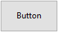
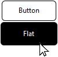

A button is an active object that can be assigned an action (_e.g._, a database task or an interface function) to perform when a user clicks on it.



Les boutons peuvent répondre à divers besoins qui dépendent du style et de l'action qui leur est affecté(e). Par exemple, les boutons peuvent amener l'utilisateur à faire des choix ou à compléter un questionnaire ou formulaire. En fonction de leurs propriétés, les bouton peuvent être destinés à être cliqués une fois seulement et à exécuter une commande, ou à être cliqués plusieurs fois pour obtenir le résultat escompté.

## Gestion des boutons

The actions assigned to buttons can originate from predefined [standard actions](properties_Action.md#standard-action) or from custom object methods. Les actions typiques peuvent consister à laisser l'utilisateur accepter, annuler ou supprimer des enregistrements, à copier ou coller des données, à passer d'une page à l'autre dans un formulaire de plusieurs pages, à ouvrir, supprimer ou ajouter des enregistrements dans un sous-formulaire, à gérer les attributs de police dans les zones de texte , etc.

Les boutons avec des actions standard sont grisés le cas échéant lors de l'exécution du formulaire. For example, if the first record of a table is displayed, a button with the `firstRecord` standard action would appear dimmed.

Si vous souhaitez qu'un bouton exécute une action qui n'est pas disponible en tant qu'action standard, laissez le champ d'action standard vide et écrivez une méthode objet pour spécifier l'action du bouton. For more information about object methods and how to create and associate them, see [Using object methods](https://doc.4d.com/4Dv17R5/4D/17-R5/Using-object-methods.300-4163733.en.html).
Normally, you would activate the `On Clicked` event and the method would run only when the button is clicked. Vous pouvez associer une méthode à n'importe quel bouton.

The [variable](properties_Object.md#variable-or-expression) associated with a button is automatically set to **0** when the form is executed for the first time in Design or Application mode. When the user clicks a button, its variable is set to **1**.

> Il est possible d'affecter à la fois une action standard et une méthode à un bouton. Dans ce cas, si le bouton n'est pas désactivé par l'action standard, la méthode est exécutée avant l'action standard.

## Styles de bouton

Les styles de bouton contrôlent l'apparence générale d'un bouton ainsi que ses propriétés. Il est possible d'appliquer différents styles prédéfinis aux boutons ou de leur associer des pop-up menus. Plusieurs variantes peuvent être obtenues en combinant ces propriétés/comportements.

With the exception of the [available properties](#supported-properties), many button objects are _structurally_ identical. La différence réside dans le traitement de leurs variables associées.

4D propose des boutons dans les styles prédéfinis suivants :

### Classique

The Regular button style is a standard system button (_i.e._, a rectangle with a descriptive label) which executes code when a user clicks on it.


Par défaut, le style Classique a un fond gris clair avec un libellé au centre. Lorsque le curseur survole le style de bouton Classique, la bordure et la l'arrière-plan changent de couleur. En plus de lancer l'exécution de code, le style de bouton Classique imite un bouton mécanique en changeant rapidement la couleur d'arrière-plan lorsque vous cliquez dessus.

#### Exemple JSON :

```4d

	"myButton": {
		"type": "button",	//define the type of object
		"style":"regular",	//define the style of the button
		"defaultButton":"true"	//define button as the default choice
		"text": "OK",	//text to appear on the button
		"action": "Cancel", //action to be be performed 
		"left": 60,	 //left position on the form  
		"top": 160, //top position on the form 
	  	"width": 100,  //width of the button
		"height": 20 //height of the button
		}
```

Only the Regular and Flat styles offer the [Default Button](properties_Appearance.md#default-button) property.

### A plat

The Flat button style is a standard system button (_i.e._, a rectangle with a descriptive label) which executes code when a user clicks on it.



Par défaut, le style A plat a un arrière-plan avec un libellé au centre, des bords arrondis et un design minimaliste. Le style graphique du bouton A plat est particulièrement utile pour les formulaires à imprimer.

#### Exemple JSON :

```4d

	"myButton": {
                "type": "button",	
                "style":"flat",	
                "defaultButton":"true"	
                "text": "OK",	
                "action": "Cancel", 
                "left": 60,			
                "top": 160,			
                "width": 100,	
                "height": 20	
                }
```

Only the Regular and Flat styles offer the [Default Button](properties_Appearance.md#default-button) property.

### Toolbar (Barre d’outils)

Le style du bouton Barre d'outils est initialement destiné à être intégré dans une barre d'outils. Il inclut l'option à ajouter à un pop-up menu (indiqué par un triangle inversé) généralement utilisé pour afficher des choix de sélection supplémentaires pour l'utilisateur.

Par défaut, le style bouton Barre d'outils a un fond transparent avec un libellé au centre. En fonction du système d'exploitation, le design du bouton peut changer lorsque la souris le survole :

- _Windows_ - the button is highlighted when it uses the “With Pop-up Menu” property, a triangle is displayed to the right and in the center of the button.


- _macOS_ - the highlight of the button never appears. Lorsqu’il dispose de la propriété “Avec pop up menu”, un triangle est affiché à droite et en bas du bouton.

#### Exemple JSON :

```4d
	"myButton": {
                "type": "button",	
                "style":"toolbar",	
                "text": "OK",		
                "popupPlacement":"separated"	
                "action": "Cancel", 	
                "left": 60,				
                "top": 160,				
                "width": 100,			
                "height": 20		
                }
```

### Bevel

The Bevel button style combines the appearance of the [Regular](#regular) (_i.e._, a rectangle with a descriptive label) style with the [Toolbar](#toolbar) style's pop-up menu property option.

Par défaut, le style Bevel a un fond gris clair avec un libellé au centre. En fonction du système d'exploitation, le design du bouton peut changer lorsque la souris le survole :

- _Windows_ - the button is highlighted. Lorsqu’il dispose de la propriété “Avec pop up menu”, un triangle est affiché à droite et au centre du bouton.


- _macOS_ - the highlight of the button never appears. Lorsqu’il dispose de la propriété “Avec pop up menu”, un triangle est affiché à droite et en bas du bouton.

#### Exemple JSON :

```4d
	"myButton": {
                "type": "button",
                "style":"bevel",	
                "text": "OK",		
                "popupPlacement":"linked"	
                "action": "Cancel", 
                "left": 60,		
                "top": 160,		
                "width": 100,	
                "height": 20	
                }
```

### Bevel arrondi

The Rounded Bevel button style is nearly identical to the [Bevel](#bevel) style except, depending on the OS, the corners of the button may be rounded. As with the Bevel style, the Rounded Bevel style combines the appearance of the [Regular](#regular) style with the [Toolbar](#toolbar) style's pop-up menu property option.

Par défaut, le style Bevel arrondi a un fond gris clair avec un libellé au centre. En fonction du système d'exploitation, le design du bouton peut changer lorsque la souris le survole :

- _Windows_ - the button is identical to the Bevel style. Lorsqu’il dispose de la propriété “Avec pop up menu”, un triangle est affiché à droite et au centre du bouton.


- _macOS_ - the corners of the button are rounded. Lorsqu’il dispose de la propriété “Avec pop up menu”, un triangle est affiché à droite et en bas du bouton.

#### Exemple JSON :

```4d
	"myButton": {
                "type": "button",
                "style":"roundedBevel",	
                "text": "OK",	
                "popupPlacement":"none"	/
                "action": "Cancel", 
                "left": 60,			
                "top": 160,	
                "width": 100,	
                "height": 20	
                }
```

### OS X Gradient

The OS X Gradient button style is nearly identical to the [Bevel](#bevel) style. As with the Bevel style, the OS X Gradient style combines the appearance of the [Regular](#regular) style with the [Toolbar](#toolbar) style's pop-up menu property option.

Par défaut, le style OS Gradient a un fond gris clair avec un libellé au centre. En fonction du système d'exploitation, le design du bouton peut changer lorsque la souris le survole :

- _Windows_ - the button is identical to the Bevel style. Lorsqu’il dispose de la propriété “Avec pop up menu”, un triangle est affiché à droite du bouton.


- _macOS_ - the button is displayed as a two-tone system button. Lorsqu’il dispose de la propriété “Avec pop up menu”, un triangle est affiché à droite et en bas du bouton.

#### Exemple JSON :

```4d
	"myButton": {
                "type": "button",	
                "style":"gradientBevel",
                "text": "OK",	
                "popupPlacement":"linked"
                "action": "Cancel", 	
                "left": 60,		
                "top": 160,	
                "width": 100,	
                "height": 20	
                }
```

### OS X Texture

The OS X Textured button style is nearly identical to the [Bevel](#bevel) style but with a smaller size (maximum size is the size of a standard macOS system button). As with the Bevel style, the OS X Textured style combines the appearance of the [Regular](#regular) style with the [Toolbar](#toolbar) style's pop-up menu property option.

Par défaut, le style OS X Textured apparaît comme :

- _Windows_ - a standard system button with a light gray background with a label in the center. Il a la particularité d'être transparent dans Vista.


- _macOS_ - a standard system button displaying a color change from light to dark gray. Sa hauteur est prédéfinie : il n'est pas possible de l'agrandir ou de la réduire.

#### Exemple JSON :

```4d
	"myButton": {
                "type": "button",	
                "style":"texturedBevel",	
                "text": "OK",	
                "popupPlacement":"separated"	
                "action": "Cancel", 
                "left": 60,			
                "top": 160,		
                "width": 100,	
                "height": 20	
                }
```

### Office XP

The Office XP button style combines the appearance of the [Regular](#regular) style with the [Toolbar](#toolbar) style's transparency and pop-up menu property option.

Les couleurs (surbrillance et arrière-plan) d'un bouton au style Office XP sont basées sur les couleurs du système. En fonction du système d'exploitation, le design du bouton peut changer lorsque la souris le survole :

- _Windows_ - its background only appears when the mouse rolls over it.


- _macOS_ - its background is always displayed.

#### Exemple JSON :

```4d
	"myButton": {
                "type": "button",	
                "style":"office",
                "text": "OK",
                "popupPlacement":"none"	
                "action": "Cancel", 
                "left": 60,		
                "top": 160,	
                "width": 100,
                "height": 20	
                }
```

### Aide

Le style du bouton Aide peut être utilisé pour afficher un bouton d'aide système standard. Par défaut, le style Aide s'affiche sous la forme d'un point d'interrogation dans un cercle.


#### Exemple JSON :

```4d
	"myButton": {
                "type": "button",
                "style":"help",		
                "text": "OK",	
                "dropping": "custom", 
                "left": 60,	
                "top": 160,		
                "width": 100,	
                "height": 20	
                }
```

> The Help style does not support [Number of States](properties_TextAndPicture.md#number-of-states), [Picture pathname](properties_TextAndPicture.md#picture-pathname), and [Title/Picture Position](properties_TextAndPicture.md#title-picture-position) basic properties.

### Rond

Le style de bouton Rond apparaît comme un bouton système circulaire. Ce style de bouton est conçu pour macOS.


Sous Windows, il est identique au style «Aucun» (le cercle en arrière-plan n'est pas pris en compte).

#### Exemple JSON :

```
	"myButton": {
                "type": "button",	
                "style":"circular",	
                "text": "OK",	
                "dropping": "custom", 
                "left": 60,	
                "top": 160,		
                "width": 100,
                "height": 20	
                }
```

### Personnalisé

Le style de bouton Personnalisé accepte une image d'arrière-plan personnalisée et permet de gérer des paramètres supplémentaires tels que la marge et le décalage d'icône.


#### Exemple JSON :

```code
	"myButton": {
                "type": "button",	
                "style":"custom",	
                "text": "",	
                "customBackgroundPicture": "/RESOURCES/bkgnd.png",
                "icon": "/RESOURCES/custom.png",  
                "textPlacement": "center",
                "left": 60,	
                "top": 160,		
                "width": 100,	
                "height": 20
                }
```

## Propriétés prises en charge

Tous les boutons partagent une même série de propriétés de base :

[Bold](properties_Text.md#bold) - [Border Line Style](properties_BackgroundAndBorder.md#border-line-style) - [Bottom](properties_CoordinatesAndSizing.md#bottom) - [Button Style](properties_TextAndPicture.md#button-style) - [Class](properties_Object.md#css-class) - [Droppable](properties_Action.md#droppable) - [Focusable](properties_Entry.md#focusable) - [Font](properties_Text.md#font) - [Font Color](properties_Text.md#font-color) - [Font Size](properties_Text.md#font-size) - [Height](properties_CoordinatesAndSizing.md#height) - [Help Tip](properties_Help.md#help-tip) - [Horizontal Alignment](properties_Text.md#horizontal-alignment) - [Horizontal Sizing](properties_ResizingOptions.md#horizontal-sizing) - [Italic](properties_Text.md#italic) - [Image hugs title](properties_TextAndPicture.md#image-hugs-title)(1) - [Left](properties_CoordinatesAndSizing.md#left) - [Not rendered](properties_Display.md#not-rendered) - [Number of States](properties_TextAndPicture.md#number-of-states)(1) - [Object Name](properties_Object.md#object-name) - [Picture pathname](properties_TextAndPicture.md#picture-pathname)(1) - [Right](properties_CoordinatesAndSizing.md#right) - [Shortcut](properties_Entry.md#shortcut) - [Standard action](properties_Action.md#standard-action) - [Title](properties_Object.md#title) - [Title/Picture Position](properties_TextAndPicture.md#title-picture-position)(1) - [Top](properties_CoordinatesAndSizing.md#top) - [Type](properties_Object.md#type) - [Underline](properties_Text.md#underline) - [Variable or Expression](properties_Object.md#variable-or-expression) - [Vertical Sizing](properties_ResizingOptions.md#vertical-sizing) - [Visibility](properties_Display.md#visibility) - [Width](properties_CoordinatesAndSizing.md#width) - [With pop-up menu](properties_TextAndPicture.md#with-pop-up-menu)(2)

> (1) Not supported by the [Help](#help) style.<br/>
> (2) Not supported by the [Help](#help), [Flat](#flat) and [Regular](#regular) styles.

Additional specific properties are available, depending on the [button style](#button-styles):

- Custom: [Background pathname](properties_TextAndPicture.md#backgroundPathname) - [Horizontal Margin](properties_TextAndPicture.md#horizontalMargin) - [Icon Offset](properties_TextAndPicture.md#icon-offset) - [Vertical Margin](properties_TextAndPicture.md#verticalMargin)
- Flat, Regular: [Default Button](properties_Appearance.md#default-button)
