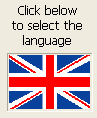

A picture button is similar to a [standard button](button_overview.md). Cependant, contrairement à un bouton standard (qui accepte trois états : activé, désactivé et cliqué), un bouton image contient une image différente pour représenter chaque état.

Les boutons image peuvent être utilisés de deux manières :

- Comme boutons de commande dans un formulaire. Dans ce cas, le bouton image accepte généralement quatre états : actif, désactivé, enfoncé et survolé.\
  Par exemple, un tableau de vignettes qui comporte une ligne de quatre colonnes, chaque vignette correspond aux états Par défaut, Cliqué, Survol et Désactivé.

  | Propriété                  | Nom JSON               | Valeur |
  | -------------------------- | ---------------------- | ------ |
  | Lignes                     | rowCount               | 1      |
  | Colonnes                   | columnCount            | 4      |
  | Switch back when Released  | switchBackWhenReleased | vrai   |
  | Switch when Roll Over      | switchWhenRollover     | vrai   |
  | Use Last Frame as Disabled | useLastFrameAsDisabled | vrai   |

- Comme bouton permettant à l’utilisateur de choisir entre plusieurs options. Dans ce cas, le bouton image peut être utilisé à la place d’un pop-up menu image. With [Picture Pop-up Menus](picturePopupMenu_overview.md), all choices are displayed simultaneously (as the items in the pop-up menu), while the picture button displays the choices consecutively (as the user clicks the button).\
  Dans ce cas, le bouton image peut être utilisé à la place d’un pop-up menu image. Vous souhaitez permettre aux utilisateurs de votre application de choisir la langue qui sera utilisée dans les menus, les boîtes de dialogue, etc. Vous pouvez implémenter cette option à l’aide d’un bouton image, placé dans une boîte de dialogue personnalisée de Propriétés :

Chaque clic modifie l'état du bouton.

## Utiliser des boutons images

Un bouton image est créé de la manière suivante :

1. Tout d’abord, vous préparez une image, dans laquelle la série d’images est organisée en colonnes, en lignes, ou les deux.

   

Vous pouvez organiser les images sous la forme de colonnes, de lignes ou de tableaux. Dans ce dernier cas, les images sont alors numérotées de gauche à droite, ligne par ligne, en débutant par 0. Par exemple, la deuxième image de la deuxième ligne d’un tableau de 2 lignes et de 3 colonnes a pour numéro 4.

2. Next, make sure the image is in your project's Resources and enter the path in the [Pathname](properties_TextAndPicture.md#picture-pathname) property.

3. Define the graphic's [Rows and Columns](properties_Crop.md) properties.

4. Specify when the images change by selecting appropriate [animation](properties_Animation.md) properties.

## Animation

Outre les paramètres de positionnement et d'apparence standard, vous pouvez définir certaines propriétés spécifiques pour les boutons image, en particulier la manière et le moment où les images sont affichées. Ces options de propriétés peuvent être combinées pour améliorer vos boutons d'image.

- By default (when no [animation option](properties_Animation.md) is selected), a picture button displays the next picture in the series when the user clicks; it displays the previous picture in the series when the user holds down the **Shift** key and clicks. La séquence d’images s’arrête lorsqu’on atteint la dernière image de la série. En d’autres termes, le bouton ne retourne pas à la première image de la série.

Les autres modes disponibles sont les suivants :

- [Loop back to first frame](properties_Animation.md#loopBackToFirstFrame)
- [Switch back when Released](properties_Animation.md#switch-back-when-released)
- [Switch when Roll Over](properties_Animation.md#switch-when-roll-over)
- [Switch continuously on clicks](properties_Animation.md#switch-continuously-on-clicks)
- [Use Last Frame as Disabled](properties_Animation.md#use-last-frame-as-disabled)
- [Use Last frame as disabled](properties_Animation.md#use-last-frame-as-disabled)

> The [associated variable](properties_Object.md#variable-or-expression) of the picture button returns the index number, in the thumbnail table, of the current picture displayed. La numérotation des images dans le tableau débute à 0.

## Propriétés prises en charge

[Bold](properties_Text.md#bold) - [Border Line Style](properties_BackgroundAndBorder.md#border-line-style) - [Bottom](properties_CoordinatesAndSizing.md#bottom) - [Button Style](properties_TextAndPicture.md#button-style) - [Class](properties_Object.md#css-class) - [Columns](properties_Crop.md#columns) - [Focusable](properties_Entry.md#focusable) - [Font](properties_Text.md#font) - [Font Color](properties_Text.md#font-color) - [Height](properties_CoordinatesAndSizing.md#height) - [Help Tip](properties_Help.md#help-tip) - [Horizontal Sizing](properties_ResizingOptions.md#horizontal-sizing) - [Italic](properties_Text.md#italic) - [Left](properties_CoordinatesAndSizing.md#left) - [Loop back to first frame](properties_Animation.md#loopBackToFirstFrame) - [Object Name](properties_Object.md#object-name) - [Pathname](properties_Picture.md#pathname) - [Right](properties_CoordinatesAndSizing.md#right) - [Rows](properties_Crop.md#rows) - [Shortcut](properties_Entry.md#shortcut) - [Standard action](properties_Action.md#standard-action) - [Switch back when released](properties_Animation.md#switchBackWhenReleased) - [Switch continuously on clicks](properties_Animation.md#switch-continuously-on-clicks) - [Switch every x ticks](properties_Animation.md#switch-every-x-ticks) - [Title](properties_Object.md#title) - [Switch when roll over](properties_Animation.md#switchWhenRollOver) - [Top](properties_CoordinatesAndSizing.md#top) - [Type](properties_Object.md#type) - [Use Last frame as disabled](properties_Animation.md#use-last-frame-as-disabled) - [Variable or Expression](properties_Object.md#variable-or-expression) - [Vertical Sizing](properties_ResizingOptions.md#vertical-sizing) - [Visibility](properties_Display.md#visibility) - [Width](properties_CoordinatesAndSizing.md#width)
