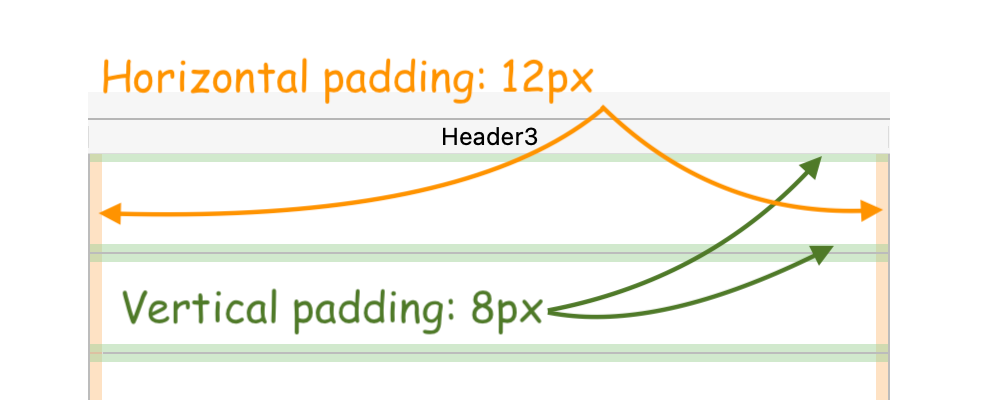

## Hauteur de ligne automatique

This property is only available for list boxes with the following [data sources](properties_Object.md#data-source):

- collection ou entity selection,
- tableau (non hiérarchique).

Par défaut, cette option n'est pas sélectionnée. Lorsqu'elle est utilisée pour au moins une colonne, la hauteur de chaque ligne de la colonne est automatiquement calculée par 4D et le contenu de la colonne est pris en compte. A noter que seules les colonnes avec l'option sélectionnée seront prises en compte pour calculer la hauteur de ligne.

:::note

When resizing the form, if the "Grow" [horizontal sizing](properties_ResizingOptions.md#horizontal-sizing) property was assigned to the list box, the right-most column will be increased beyond its maximum width if necessary.

:::

When this property is enabled, the height of every row is automatically calculated in order to make the cell contents entirely fit without being truncated (unless the [Wordwrap](properties_Display.md#wordwrap) option is disabled.

- Le calcul de la hauteur de ligne prend en compte :
  - tout type de contenu (texte, numérique, dates, heures, images (le calcul dépend du format de l'image), objets),
  - tout types de contrôle (zones de saisie, cases à cocher, listes, listes déroulantes),
  - polices, styles de polices et tailles de polices,
  - the [Wordwrap](properties_Display.md#wordwrap) option: if disabled, the height is based on the number of paragraphs (lines are truncated); if enabled, the height is based on number of lines (not truncated).

- Le calcul de la hauteur de ligne ne tient pas compte de :
  - du contenu de colonne masqué
  - [Row Height](#row-height) and [Row Height Array](#row-height-array) properties (if any) set either in the Property list or by programming.

:::caution

Etant donné qu'elle nécessite des calculs supplémentaires lors de l'exécution, l'option "hauteur de ligne automatique" peut avoir une incidence sur la fluidité du défilement de votre list box, en particulier lorsqu'elle contient un grand nombre de lignes.

:::

#### Grammaire JSON

| Nom           | Type de données | Valeurs possibles |
| ------------- | --------------- | ----------------- |
| rowHeightAuto | boolean         | true, false       |

#### Objets pris en charge

[List Box Column](listbox_overview.md#list-box-columns)

---

## Bas

Coordonnées inférieures de l'objet dans le formulaire.

#### Grammaire JSON

| Nom    | Type de données | Valeurs possibles           |
| ------ | --------------- | --------------------------- |
| bottom | number          | minimum : 0 |

#### Objets pris en charge

[4D View Pro Area](viewProArea_overview.md) - [4D Write Pro Area](writeProArea_overview.md) - [Button](button_overview.md) - [Button Grid](buttonGrid_overview.md) - [Check Box](checkbox_overview.md) - [Combo Box](comboBox_overview.md) - [Dropdown list](dropdownList_Overview.md) - [Group Box](groupBox.md) - [Hierarchical List](list_overview.md#overview) - [Input](input_overview.md) - [List Box](listbox_overview.md#overview) - [Line](shapes_overview.md#line) - [List Box Column](listbox_overview.md#list-box-columns) - [Oval](shapes_overview.md#oval) - [Picture Button](pictureButton_overview.md) - [Picture Pop up menu](picturePopupMenu_overview.md) - [Plug-in Area](pluginArea_overview.md#overview) - [Progress Indicators](progressIndicator.md) - [Radio Button](radio_overview.md) - [Rectangle](shapes_overview.md#rectangle) - [Ruler](ruler.md) - [Spinner](spinner.md) - [Splitter](splitters.md) - [Static Picture](staticPicture.md) - [Stepper](stepper.md) - [Subform](subform_overview.md) - [Tab control](tabControl.md) - [Text Area](text.md) - [Web Area](webArea_overview.md#overview)

---

## Gauche

Coordonnées de gauche de l'objet dans le formulaire.

#### Grammaire JSON

| Nom  | Type de données | Valeurs possibles           |
| ---- | --------------- | --------------------------- |
| left | number          | minimum : 0 |

#### Objets pris en charge

[4D View Pro Area](viewProArea_overview.md) - [4D Write Pro Area](writeProArea_overview.md) - [Button](button_overview.md) - [Button Grid](buttonGrid_overview.md) - [Check Box](checkbox_overview.md) - [Combo Box](comboBox_overview.md) - [Dropdown list](dropdownList_Overview.md) - [Group Box](groupBox.md) - [Hierarchical List](list_overview.md#overview) - [Input](input_overview.md) - [List Box](listbox_overview.md#overview) - [Line](shapes_overview.md#line) - [List Box Column](listbox_overview.md#list-box-columns) - [Oval](shapes_overview.md#oval) - [Picture Button](pictureButton_overview.md) - [Picture Pop up menu](picturePopupMenu_overview.md) - [Plug-in Area](pluginArea_overview.md#overview) - [Progress Indicators](progressIndicator.md) - [Radio Button](radio_overview.md) - [Ruler](ruler.md) - [Rectangle](shapes_overview.md#rectangle) - [Spinner](spinner.md) - [Splitter](splitters.md) - [Static Picture](staticPicture.md) - [Stepper](stepper.md) - [Subform](subform_overview.md) - [Tab control](tabControl.md) - [Text Area](text.md) - [Web Area](webArea_overview.md#overview)

---

## Droite

Coordonnées de droite de l'objet dans le formulaire.

#### Grammaire JSON

| Nom   | Type de données | Valeurs possibles           |
| ----- | --------------- | --------------------------- |
| right | number          | minimum : 0 |

#### Objets pris en charge

[4D View Pro Area](viewProArea_overview.md) - [4D Write Pro Area](writeProArea_overview.md) - [Button](button_overview.md) - [Button Grid](buttonGrid_overview.md) - [Check Box](checkbox_overview.md) - [Combo Box](comboBox_overview.md) - [Dropdown list](dropdownList_Overview.md) - [Group Box](groupBox.md) - [Hierarchical List](list_overview.md#overview) - [Input](input_overview.md) - [List Box](listbox_overview.md#overview) - [Line](shapes_overview.md#line) - [List Box Column](listbox_overview.md#list-box-columns) - [Oval](shapes_overview.md#oval) - [Picture Button](pictureButton_overview.md) - [Picture Pop up menu](picturePopupMenu_overview.md) - [Plug-in Area](pluginArea_overview.md#overview) - [Progress Indicators](progressIndicator.md) - [Radio Button](radio_overview.md) - [Ruler](ruler.md) - [Rectangle](shapes_overview.md#rectangle) - [Spinner](spinner.md) - [Splitter](splitters.md) - [Static Picture](staticPicture.md) - [Stepper](stepper.md) - [Subform](subform_overview.md) - [Tab control](tabControl.md) - [Text Area](text.md) - [Web Area](webArea_overview.md#overview)

---

## Haut

Coordonnées supérieures de l'objet dans le formulaire.

#### Grammaire JSON

| Nom | Type de données | Valeurs possibles           |
| --- | --------------- | --------------------------- |
| top | number          | minimum : 0 |

#### Objets pris en charge

[4D View Pro Area](viewProArea_overview.md) - [4D Write Pro Area](writeProArea_overview.md) - [Button](button_overview.md) - [Button Grid](buttonGrid_overview.md) - [Check Box](checkbox_overview.md) - [Combo Box](comboBox_overview.md) - [Dropdown list](dropdownList_Overview.md) - [Group Box](groupBox.md) - [Hierarchical List](list_overview.md#overview) - [Input](input_overview.md) - [List Box](listbox_overview.md#overview) - [Line](shapes_overview.md#line) - [List Box Column](listbox_overview.md#list-box-columns) - [Oval](shapes_overview.md#oval) - [Picture Button](pictureButton_overview.md) - [Picture Pop up menu](picturePopupMenu_overview.md) - [Plug-in Area](pluginArea_overview.md#overview) - [Progress Indicators](progressIndicator.md) - [Radio Button](radio_overview.md) - [Ruler](ruler.md) - [Rectangle](shapes_overview.md#rectangle) - [Spinner](spinner.md) - [Splitter](splitters.md) - [Static Picture](staticPicture.md) - [Stepper](stepper.md) - [Subform](subform_overview.md) - [Tab control](tabControl.md) - [Text Area](text.md) - [Web Area](webArea_overview.md#overview)

---

## Rayon d'arrondi

<details><summary>Historique</summary>

| Release | Modifications                                        |
| ------- | ---------------------------------------------------- |
| 19 R7   | Prise en charge pour les zones de saisie et de texte |

</details>

Définit l'arrondi des coins (en pixels) de l'objet. Par défaut, la valeur du rayon est de 0 pixel. Vous pouvez modifier cette propriété pour dessiner des objets arrondis avec des formes personnalisées :


La valeur minimale est de 0. Dans ce cas, un rectangle d'objet standard non arrondi est dessiné.
La valeur maximale dépend de la taille du rectangle (elle ne peut pas dépasser la moitié de la taille du côté le plus court du rectangle) et est calculée dynamiquement.

:::note

With [text areas](text.md) and [inputs](input_overview.md):

- the corner radius property is only available with "none", "solid", or "dotted" [border line styles](properties_BackgroundAndBorder.md#border-line-style),
- the corner roundness is drawn outside the area of the object (the object appears larger in the form but its [width](properties_CoordinatesAndSizing.md#width) and [height](properties_CoordinatesAndSizing.md#height) are not extended).


:::

You can also set this property using the [OBJECT Get corner radius](https://doc.4d.com/4dv19/help/command/en/page1323.html) and [OBJECT SET CORNER RADIUS](https://doc.4d.com/4dv19/help/command/en/page1324.html) commands.

#### Grammaire JSON

| Nom          | Type de données | Valeurs possibles           |
| ------------ | --------------- | --------------------------- |
| borderRadius | entier          | minimum : 0 |

#### Objets pris en charge

[Input](input_overview.md) - [Rectangle](shapes_overview.md#rectangle) - [Text Area](text.md)

---

## Hauteur

Cette propriété désigne la taille verticale d'un objet.

> Certains objets peuvent avoir une hauteur prédéfinie qui ne peut pas être modifiée.

#### Grammaire JSON

| Nom    | Type de données | Valeurs possibles           |
| ------ | --------------- | --------------------------- |
| height | number          | minimum : 0 |

#### Objets pris en charge

[4D View Pro Area](viewProArea_overview.md) - [4D Write Pro Area](writeProArea_overview.md) - [Button](button_overview.md) - [Button Grid](buttonGrid_overview.md) - [Check Box](checkbox_overview.md) - [Combo Box](comboBox_overview.md) - [Dropdown list](dropdownList_Overview.md) - [Group Box](groupBox.md) - [Hierarchical List](list_overview.md#overview) - [Input](input_overview.md) - [List Box](listbox_overview.md#overview) - [Line](shapes_overview.md#line) - [List Box Column](listbox_overview.md#list-box-columns) - [Oval](shapes_overview.md#oval) - [Picture Button](pictureButton_overview.md) - [Picture Pop up menu](picturePopupMenu_overview.md) - [Plug-in Area](pluginArea_overview.md#overview) - [Progress Indicators](progressIndicator.md) - [Radio Button](radio_overview.md) - [Ruler](ruler.md) - [Rectangle](shapes_overview.md#rectangle) - [Spinner](spinner.md) - [Splitter](splitters.md) - [Static Picture](staticPicture.md) - [Stepper](stepper.md) - [Subform](subform_overview.md) - [Tab control](tabControl.md) - [Text Area](text.md) - [Web Area](webArea_overview.md#overview)

---

## Largeur

Cette propriété désigne la taille horizontale d'un objet.

> - Certains objets peuvent avoir une hauteur prédéfinie qui ne peut pas être modifiée.
> - If the [Resizable](properties_ResizingOptions.md#resizable) property is used for a [list box column](listbox_overview.md#list-box-columns), the user can also manually resize the column.
> - When resizing the form, if the ["Grow" horizontal sizing](properties_ResizingOptions.md#horizontal-sizing) property was assigned to the list box, the right-most column will be increased beyond its maximum width if necessary.

#### Grammaire JSON

| Nom   | Type de données | Valeurs possibles           |
| ----- | --------------- | --------------------------- |
| width | number          | minimum : 0 |

#### Objets pris en charge

[4D View Pro Area](viewProArea_overview.md) - [4D Write Pro Area](writeProArea_overview.md) - [Button](button_overview.md) - [Button Grid](buttonGrid_overview.md) - [Check Box](checkbox_overview.md) - [Combo Box](comboBox_overview.md) - [Dropdown list](dropdownList_Overview.md) - [Group Box](groupBox.md) - [Hierarchical List](list_overview.md#overview) - [Input](input_overview.md) - [Line](shapes_overview.md#line) - [List Box](listbox_overview.md#overview) - [List Box Column](listbox_overview.md#list-box-columns) - [Oval](shapes_overview.md#oval) - [Picture Button](pictureButton_overview.md) - [Picture Pop up menu](picturePopupMenu_overview.md) - [Plug-in Area](pluginArea_overview.md#overview) - [Progress Indicators](progressIndicator.md) - [Radio Button](radio_overview.md) - [Ruler](ruler.md) - [Rectangle](shapes_overview.md#rectangle) - [Spinner](spinner.md) - [Splitter](splitters.md) - [Static Picture](staticPicture.md) - [Stepper](stepper.md) - [Subform](subform_overview.md) - [Tab control](tabControl.md) - [Text Area](text.md) - [Web Area](webArea_overview.md#overview)

---

## Largeur maxi

La largeur maximale de la colonne (en pixels). La largeur de la colonne ne peut pas être augmentée au-delà de cette valeur lors du redimensionnement de la colonne ou du formulaire.

> When resizing the form, if the ["Grow" horizontal sizing](properties_ResizingOptions.md#horizontal-sizing) property was assigned to the list box, the right-most column will be increased beyond its maximum width if necessary.

#### Grammaire JSON

| Nom      | Type de données | Valeurs possibles           |
| -------- | --------------- | --------------------------- |
| maxWidth | number          | minimum : 0 |

#### Objets pris en charge

[List Box Column](listbox_overview.md#list-box-columns)

---

## Largeur mini

La largeur minimale de la colonne (en pixels). La largeur de la colonne ne peut pas être réduite en dessous de cette valeur lors du redimensionnement de la colonne ou du formulaire.

> When resizing the form, if the ["Grow" horizontal sizing](properties_ResizingOptions.md#horizontal-sizing) property was assigned to the list box, the right-most column will be increased beyond its maximum width if necessary.

#### Grammaire JSON

| Nom      | Type de données | Valeurs possibles           |
| -------- | --------------- | --------------------------- |
| minWidth | number          | minimum : 0 |

#### Objets pris en charge

[List Box Column](listbox_overview.md#list-box-columns)

---

## Hauteur des lignes

Définit la hauteur des lignes de list box (hors en-têtes et pieds de page). Par défaut, la hauteur de ligne est définie en fonction de la plate-forme et de la taille de la police.

#### Grammaire JSON

| Nom       | Type de données | Valeurs possibles                                                    |
| --------- | --------------- | -------------------------------------------------------------------- |
| rowHeight | string          | valeur css dans l'unité "em" ou "px" (par défaut) |

#### Objets pris en charge

[List Box](listbox_overview.md#overview)

#### Voir également

[Row Height Array](#row-height-array)

---

## Tableau hauteurs des lignes

Cette propriété est utilisée pour indiquer le nom d'un tableau de hauteur de ligne que vous souhaitez associer à la list box. Un tableau de hauteur de ligne doit être de type numérique (entier long par défaut).

Lorsqu'un tableau de hauteur de ligne est défini, chacun de ses éléments dont la valeur est différente de 0 (zéro) est pris en compte pour déterminer la hauteur de la ligne correspondante dans la list box, en fonction de l'unité hauteur de ligne courante.

Par exemple, vous pouvez écrire :

```4d
ARRAY LONGINT(RowHeights;20)
RowHeights{5}:=3
```

En supposant que l'unité des lignes soit «lignes», alors la cinquième ligne de la list box aura une hauteur de trois lignes, tandis que chaque autre ligne conservera sa hauteur par défaut.

> - La propriété Row Height Array n'est pas prise en compte pour les list box hiérarchiques.
> - For array and collection/entity selection list boxes, this property is available only if the [Automatic Row Height](#automatic-row-height) option is not selected.

#### Grammaire JSON

| Nom             | Type de données | Valeurs possibles                              |
| --------------- | --------------- | ---------------------------------------------- |
| rowHeightSource | string          | Nom d'une variable tableau 4D. |

#### Objets pris en charge

[List Box](listbox_overview.md#overview)

#### Voir également

[Row Height](#row-height)

---

## Marge horizontale

Définit une marge horizontale pour les cellules. La valeur est définie en pixels (valeur par défaut = 0).



#### Grammaire JSON

| Nom               | Type de données | Valeurs possibles                                 |
| ----------------- | --------------- | ------------------------------------------------- |
| horizontalPadding | number          | Number of pixels (must be >=0) |

#### Objets pris en charge

[List Box](listbox_overview.md#overview) - [List Box Column](listbox_overview.md#list-box-columns) - [Footers](properties_Footers.md) - [Headers](properties_Headers.md)

#### Voir également

[Vertical Padding](#vertical-padding)

---

## Marge verticale

Définit une marge verticale pour les cellules. La valeur est définie en pixels (valeur par défaut = 0).

#### Grammaire JSON

| Nom             | Type de données | Valeurs possibles                                 |
| --------------- | --------------- | ------------------------------------------------- |
| verticalPadding | number          | Number of pixels (must be >=0) |

#### Objets pris en charge

[List Box](listbox_overview.md#overview) - [List Box Column](listbox_overview.md#list-box-columns) - [Footers](properties_Footers.md) - [Headers](properties_Headers.md)

#### Voir également

[Horizontal Padding](#horizontal-padding)
