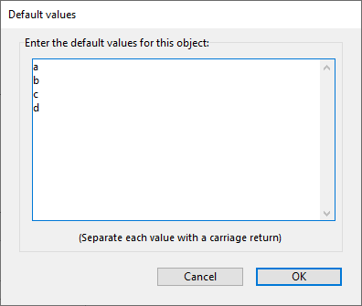

## Insertion automatique

Lorsque cette option est sélectionnée, si un utilisateur saisit une valeur introuvable dans la liste associée à l'objet, cette valeur est automatiquement ajoutée à la liste stockée en mémoire.

When the **automatic insertion** option is not set (default), the value entered is stored in the form object but not in the list in memory.

Cette propriété est prise en charge par :

- [Combo box](comboBox_overview.md) and [list box column](listbox_overview.md#list-box-columns) form objects associated to a choice list.
- [Combo box](comboBox_overview.md) form objects whose associated list is filled by their array or object datasource.

For example, given a choice list containing "France, Germany, Italy" that is associated with a "Countries" combo box: if the **automatic insertion** property is set and a user enters "Spain", then the value "Spain" is automatically added to the list in memory:

> Si la liste déroulante a été créée à partir d'une liste définie en mode Développement, la liste d'origine n'est pas modifiée.

#### Grammaire JSON

| Nom                | Type de données | Valeurs possibles |
| ------------------ | --------------- | ----------------- |
| automaticInsertion | boolean         | true, false       |

#### Objets pris en charge

[Combo Box](comboBox_overview.md) - [List Box Column](listbox_overview.md#list-box-columns)

---

## Enumération

Associe une liste de choix à un objet. Il peut s'agir d'un nom de liste de choix (une référence de liste) ou d'une collection de valeurs par défaut.

You can also associate choice lists to objects using the [OBJECT SET LIST BY NAME](https://doc.4d.com/4dv19/help/command/en/page237.html) or [OBJECT SET LIST BY REFERENCE](https://doc.4d.com/4dv19/help/command/en/page1266.html) commands.

#### Grammaire JSON

| Nom        | Type de données   | Valeurs possibles                                                                   |
| ---------- | ----------------- | ----------------------------------------------------------------------------------- |
| choiceList | liste, collection | Une liste de valeurs possibles                                                      |
| liste      | liste, collection | Une liste de valeurs possibles (listes hiérarchiques uniquement) |

#### Objets pris en charge

[Drop-down List](dropdownList_Overview.md) -
[Combo Box](comboBox_overview.md) - [Hierarchical List](list_overview.md#overview) - [List Box Column](listbox_overview.md#list-box-columns)

---

## Enumération (liste statique)

Liste de valeurs statiques à utiliser comme étiquettes pour l'objet onglet.

#### Grammaire JSON

| Nom    | Type de données   | Valeurs possibles                           |
| ------ | ----------------- | ------------------------------------------- |
| labels | liste, collection | Une liste de valeurs à saisir dans l'onglet |

#### Objets pris en charge

[Tab Control](tabControl.md)

---

## Élément courant

`Listbox de type collection ou entity selection`

Indique une variable ou une expression qui se verra attribuer l'élément/l'entité de collection sélectionné(e) par l'utilisateur. Vous devez utiliser une variable objet ou une expression assignable qui accepte des objets. Si l'utilisateur ne sélectionne rien ou si vous avez utilisé une collection de valeurs scalaires, la valeur Null est affectée.

> Cette propriété est en "lecture seule", elle est automatiquement mise à jour en fonction des actions de l'utilisateur dans la list box. Vous ne pouvez pas modifier sa valeur pour modifier l'état de sélection de la list box.

#### Grammaire JSON

| Nom               | Type de données | Valeurs possibles  |
| ----------------- | --------------- | ------------------ |
| currentItemSource | string          | Expression d'objet |

#### Objets pris en charge

[List Box](listbox_overview.md#overview)

---

## Position élément courant

`Listbox de type collection ou entity selection`

Indique une variable ou une expression qui se verra attribuer un entier long indiquant la position de l'élément/l'entité de collection sélectionné(e) par l'utilisateur.

- si aucun(e) élément/entité n'est sélectionné(e), la variable ou l'expression reçoit zéro,
- si un(e) seul(e) élément/entité est sélectionné(e), la variable ou l'expression reçoit son emplacement,
- si plusieurs éléments/entités sont sélectionnés, la variable ou l'expression reçoit la position de l'élément/entité qui a été sélectionné(e) en dernier.

> Cette propriété est en "lecture seule", elle est automatiquement mise à jour en fonction des actions de l'utilisateur dans la list box. Vous ne pouvez pas modifier sa valeur pour modifier l'état de sélection de la list box.

#### Grammaire JSON

| Nom                       | Type de données | Valeurs possibles    |
| ------------------------- | --------------- | -------------------- |
| currentItemPositionSource | string          | Expression numérique |

#### Objets pris en charge

[List Box](listbox_overview.md)

---

## Type de données (Expression type)

Définit le type de données pour l'expression affichée. Cette propriété est utilisée avec :

- [List box columns](listbox_overview.md#list-box-columns) of the selection and collection types.
- [Drop-down lists](dropdownList_Overview.md) associated to objects or arrays.

See also [**Expression Type**](properties_Object.md#expression-type) section.

#### Grammaire JSON

| Nom                | Type de données | Valeurs possibles                                                                                                                                                                                                                      |
| ------------------ | --------------- | -------------------------------------------------------------------------------------------------------------------------------------------------------------------------------------------------------------------------------------- |
| dataSourceTypeHint | string          | <li>**list box columns:** "boolean", "number", "picture", "text", date", "time". *Array/selection list box only*: "integer", "object"</li><li>**drop-down lists:** "object", "arrayText", "arrayDate", "arrayTime", "arrayNumber"</li> |

#### Objets pris en charge

[Drop-down Lists](dropdownList_Overview.md) associated to objects or arrays - [List Box column](listbox_overview.md#list-box-columns)

---

## Type de données (list)

Defines the type of data to save in the field or variable associated to the [drop-down list](dropdownList_Overview.md). Cette propriété est utilisée avec :

- Drop-down lists [associated to a choice list](dropdownList_Overview.md#using-a-choice-list).
- Drop-down lists [associated to a hierarchical choice list](dropdownList_Overview.md#using-a-hierarchical-choice-list).

Trois options sont disponibles :

- **List reference**: declares that the drop-down list is hierarchical. It means that the drop-down list can display up to two hierarchical levels and its contents can be managed by the 4D language commands of the **Hierarchical Lists** theme.
- **Selected item value** (default): the drop-down list is not hierarchical and the value of the item chosen in the list by the user is saved directly. Par exemple, si l'utilisateur choisit la valeur "Bleu", cette valeur est enregistrée dans le champ.
- **Selected item reference**: the drop-down list is not hierarchical and the reference of the choice list item is saved in the object. This reference is the numeric value associated with each item either through the _itemRef_ parameter of the [`APPEND TO LIST`](https://doc.4d.com/4dv19/help/command/en/page376.html) or [`SET LIST ITEM`](https://doc.4d.com/4dv19/help/command/en/page385.html) commands, or in the list editor. Cette option permet d'optimiser l'utilisation de la mémoire : le stockage de valeurs numériques dans les champs occupe moins d'espace que le stockage de chaînes de caractères. Il facilite également la traduction des applications : il suffit de créer plusieurs listes dans différentes langues mais avec les mêmes références d'éléments, puis de charger la liste en fonction de la langue de l'application.

Using the **Selected item reference** option requires compliance with the following principles:

- Pour pouvoir stocker la référence, la source de données du champ ou de la variable doit être de type numérique (quel que soit le type de valeur affiché dans la liste). The [expression](properties_Object.md#expression-type) property is automatically set.
- Des références valides et uniques doivent être associées aux éléments de la liste.
- La liste déroulante doit être associée à un champ ou à une variable.

#### Grammaire JSON

| Nom    | Type de données | Valeurs possibles    |
| ------ | --------------- | -------------------- |
| saveAs | string          | "value", "reference" |

> Setting only `"dataSourceTypeHint" : "integer"` with a `"type": "dropdown"` form object will declare a hierarchical drop-down list.

#### Objets pris en charge

[Drop-down Lists](dropdownList_Overview.md) associated to lists

---

## Valeurs par défaut

Liste des valeurs qui seront utilisées comme valeurs par défaut pour la colonne de la list box (type tableau uniquement). These values are automatically available in the [array variable](properties_Object.md#variable-or-expression) associated with this column when the form is executed. En utilisant le langage, vous pouvez gérer l'objet en vous référant à ce tableau.

> Do not make confusion between this property and the "[default value](properties_RangeOfValues.md#default-list-of-values)" property that allows to define a field value in new records.

Vous devez saisir une liste de valeurs. Dans l'éditeur de formulaires, une boîte de dialogue spécifique vous permet de saisir des valeurs séparées par des retours à la ligne :

> You can also define a [choice list](properties_DataSource.md#choice-list) with the list box column. Toutefois, une énumération sera utilisée comme liste de valeurs sélectionnables pour chaque ligne de colonne, alors que la liste par défaut remplit toutes les lignes de colonne.

#### Grammaire JSON

| Nom    | Type de données | Valeurs possibles                                                                                         |
| ------ | --------------- | --------------------------------------------------------------------------------------------------------- |
| values | collection      | Une collection de valeurs par défaut (chaînes), ex: "a", "b", "c", "d" |

#### Objets pris en charge

[List Box Column (array type only)](listbox_overview.md#list-box-columns)

---

## Expression

This description is specific to [selection](listbox_overview.md#selection-list-boxes)
and [collection](listbox_overview.md#collection-or-entity-selection-list-boxes) type list box columns. See also **[Variable or Expression](properties_Object.md#variable-or-expression)** section.

Une expression 4D à associer à une colonne. Vous pouvez saisir :

- A **simple variable** (in this case, it must be explicitly declared for compilation). Vous pouvez utiliser n'importe quel type de variable, à l'exception des BLOB et des tableaux. The value of the variable will be generally calculated in the `On Display Detail` event.

- A **field** using the standard [Table]Field syntax ([selection type list box](listbox_overview.md#selection-list-boxes)
  only), for example: `[Employees]LastName`. Les types de champs suivants peuvent être utilisés :
  - String
  - Numérique
  - Date
  - Time
  - Picture
  - Boolean\
    You can use fields from the Master Table or from other tables.

- A **4D expression** (simple expression, formula or 4D method). L'expression doit retourner une valeur. The value will be evaluated in the `On Display Detail` and `On Data Change` events. Le résultat de l'expression sera affiché automatiquement lorsque vous passerez en mode Application. L'expression sera évaluée pour chaque enregistrement de la sélection (courante ou nommée) de la table principale (pour les list box de type sélection), chaque élément de la collection (pour les list box de type collection) ou chaque entity de la sélection (pour les list box de type entity selection). Si elle est vide, la colonne n'affichera aucun résultat.
  Les types d'expression suivants sont pris en charge :
  - String
  - Numérique
  - Date
  - Picture
  - Boolean

For collection/entity selection list boxes, Null or unsupported types are displayed as empty strings.\
When using collections or entity selections, you will usually declare the element property or entity attribute associated to a column within an expression containing [This](https://doc.4d.com/4Dv17R6/4D/17-R6/This.301-4310806.en.html). `This` is a dedicated 4D command that returns a reference to the currently processed element. For example, you can use `This.\<propertyPath>` where `\<propertyPath>` is the path of a property in the collection or an entity attribute path to access the current value of each element/entity.
Si vous utilisez une collection de valeurs scalaires, 4D créera un objet pour chaque élément de la collection avec une seule propriété (nommée "value"), remplie avec la valeur de l'élément. In this case, you will use `This.value` as expression.

If a [non-assignable expression](Concepts/quick-tour.md#expressions) is used (e.g. `[Person]FirstName+" "+[Person]LastName`), the column is never enterable even if the [Enterable](properties_Entry.md#enterable) property is enabled.

If a field, a variable, or an assignable expression (_e.g. Person.lastName_) is used, the column can be enterable or not depending on the [Enterable](properties_Entry.md#enterable) property.

#### Grammaire JSON

| Nom        | Type de données | Valeurs possibles                                                                                  |
| ---------- | --------------- | -------------------------------------------------------------------------------------------------- |
| dataSource | string          | Une variable 4D, un nom de champ ou une expression de langage complexe arbitraire. |

#### Objets pris en charge

[List Box Column](listbox_overview.md#list-box-columns)

---

## Table principale

`Listbox de type sélection courante`

Spécifie la table dont la sélection courante sera utilisée. Cette table et sa sélection courante constitueront la référence pour les champs associés aux colonnes de la list box (références de champs ou expressions contenant des champs). Même si certaines colonnes contiennent des champs d'autres tables, le nombre de lignes affichées sera défini par la table principale.

Toutes les tables de la base de données peuvent être utilisées, que le formulaire soit lié à une table (formulaire table) ou non (formulaire projet).

#### Grammaire JSON

| Nom   | Type de données | Valeurs possibles  |
| ----- | --------------- | ------------------ |
| table | number          | Numéro de la table |

#### Objets pris en charge

[List Box](listbox_overview.md#overview)

---

## Enregistrer comme

Cette propriété est disponible dans les conditions suivantes :

- a [choice list](#choice-list) is associated with the object
- for [inputs](input_overview.md) and [list box columns](listbox_overview.md#list-box-columns), a [required list](properties_RangeOfValues.md#required-list) is also defined for the object (both options should use usually the same list), so that only values from the list can be entered by the user.

Cette propriété spécifie, dans le contexte d'un champ ou d'une variable associée à une liste de valeurs, le type de contenu à sauvegarder :

- **Save as Value** (default option): the value of the item chosen in the list by the user is saved directly. Par exemple, si l'utilisateur choisit la valeur "Bleu", cette valeur est enregistrée dans le champ.
- **Save as Reference**: the reference of the choice list item is saved in the object. This reference is the numeric value associated with each item either through the _itemRef_ parameter of the [`APPEND TO LIST`](https://doc.4d.com/4dv19/help/command/en/page376.html) or [`SET LIST ITEM`](https://doc.4d.com/4dv19/help/command/en/page385.html) commands, or in the list editor.

Cette option permet d'optimiser l'utilisation de la mémoire : le stockage de valeurs numériques dans les champs occupe moins d'espace que le stockage de chaînes de caractères. Il facilite également la traduction des applications : il suffit de créer plusieurs listes dans différentes langues mais avec les mêmes références d'éléments, puis de charger la liste en fonction de la langue de l'application.

L'utilisation de cette propriété nécessite le respect des principes suivants :

- Pour pouvoir stocker la référence, la source de données du champ ou de la variable doit être de type numérique (quel que soit le type de valeur affiché dans la liste). The [expression](properties_Object.md#expression-type) property is automatically set.
- Des références valides et uniques doivent être associées aux éléments de la liste.

#### Grammaire JSON

| Nom    | Type de données | Valeurs possibles    |
| ------ | --------------- | -------------------- |
| saveAs | string          | "value", "reference" |

#### Objets pris en charge

[Input](input_overview.md) - [List Box Column](listbox_overview.md#list-box-columns)

---

## Eléments sélectionnés

`Listbox de type collection ou entity selection`

Spécifie une variable ou une expression qui sera assignée aux éléments ou entities sélectionnés par l'utilisateur.

- pour une list box collection, vous devez utiliser une variable de collection ou une expression assignable qui accepte les collections,
- pour une list box de type entity selection, un objet entity selection est construit. Vous devez utiliser une variable objet ou une expression assignable qui accepte des objets.

> Cette propriété est en "lecture seule", elle est automatiquement mise à jour en fonction des actions de l'utilisateur dans la list box. Vous ne pouvez pas modifier sa valeur pour modifier l'état de sélection de la list box.

#### Grammaire JSON

| Nom                 | Type de données | Valeurs possibles     |
| ------------------- | --------------- | --------------------- |
| selectedItemsSource | string          | Expression collection |

#### Objets pris en charge

[List Box](listbox_overview.md#overview)

---

## Selection Name

`Listbox de type sélection nommée`

Spécifie la sélection nommée à utiliser. Vous devez entrer le nom d'une sélection nommée valide. Il peut s'agir d'une sélection nommée process ou interprocess. Le contenu de la list box sera basé sur cette sélection. La sélection nommée doit exister et être valide au moment où la list box est affichée, sinon la list box sera affichée vide.

> Les sélections nommées sont des listes ordonnées d'enregistrements. Elles sont utilisées pour garder en mémoire l'ordre et l'enregistrement courant d'une sélection. For more information, refer to **Named Selections** section in the _4D Language Reference manual_.

#### Grammaire JSON

| Nom            | Type de données | Valeurs possibles   |
| -------------- | --------------- | ------------------- |
| namedSelection | string          | Nom de la sélection |

#### Objets pris en charge

[List Box](listbox_overview.md#overview)
