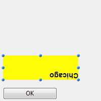
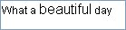

---

## Autoriser sélecteur police/couleur

When this property is enabled, the [OPEN FONT PICKER](https://doc.4d.com/4Dv18/4D/18/OPEN-FONT-PICKER.301-4505612.en.html) and [OPEN COLOR PICKER](https://doc.4d.com/4Dv18/4D/18/OPEN-COLOR-PICKER.301-4505611.en.html) commands can be called to display the system font and color picker windows. A l'aide de ces fenêtres, les utilisateurs peuvent modifier la police ou la couleur d'un objet formulaire dont le focus est accessible directement au clic. Lorsque cette propriété est désactivée (par défaut), les commandes d'ouverture du sélecteur ne produisent aucun effet.

#### Grammaire JSON

| Propriété            | Type de données | Valeurs possibles                           |
| -------------------- | --------------- | ------------------------------------------- |
| allowFontColorPicker | boolean         | false (par défaut), true |

#### Objets pris en charge

[Input](input_overview.md)

---

## Souligné

Le texte sélectionné est plus foncé et plus épais.

You can set this property using the [**OBJECT SET FONT STYLE**](https://doc.4d.com/4Dv17R5/4D/17-R5/OBJECT-SET-FONT-STYLE.301-4128244.en.html) command.

> This is normal text.<br/>
> **This is bold text.**

#### Grammaire JSON

| Propriété  | Type de données | Valeurs possibles |
| ---------- | --------------- | ----------------- |
| fontWeight | text            | "normal", "bold"  |

#### Objets pris en charge

[Button](button_overview.md) - [Check Box](checkbox_overview.md) - [Combo Box](comboBox_overview.md) - [Drop-down List](dropdownList_Overview.md) - [Group Box](groupBox.md) - [Hierarchical List](list_overview.md#overview) - [Input](input_overview.md) - [List Box](listbox_overview.md#overview) - [List Box Column](listbox_overview.md#list-box-columns) - [List Box Footer](listbox_overview.md#list-box-footers) - [List Box Header](listbox_overview.md#list-box-headers) - [Radio Button](radio_overview.md) - [Text Area](text.md)

---

## Italique

Le texte sélectionné est légèrement penché vers la droite.

You can also set this property via the [**OBJECT SET FONT STYLE**](https://doc.4d.com/4Dv17R5/4D/17-R5/OBJECT-SET-FONT-STYLE.301-4128244.en.html) command.

> This is normal text.<br/>
> _This is text in italics._

#### Grammaire JSON

| Nom       | Type de données | Valeurs possibles  |
| --------- | --------------- | ------------------ |
| fontStyle | string          | "normal", "italic" |

#### Objets pris en charge

[Button](button_overview.md) - [Check Box](checkbox_overview.md) - [Combo Box](comboBox_overview.md) - [Drop-down List](dropdownList_Overview.md) - [Group Box](groupBox.md) - [Hierarchical List](list_overview.md#overview) - [Input](input_overview.md) - [List Box](listbox_overview.md#overview) - [List Box Column](listbox_overview.md#list-box-columns) - [List Box Footer](listbox_overview.md#list-box-footers) - [List Box Header](listbox_overview.md#list-box-headers) - [Radio Button](radio_overview.md) - [Text Area](text.md)

---

## Souligné

Une ligne est placée sous le texte.

#### Grammaire JSON

| Nom            | Type de données | Valeurs possibles     |
| -------------- | --------------- | --------------------- |
| textDecoration | string          | "normal", "underline" |

#### Objets pris en charge

[Button](button_overview.md) - [Check Box](checkbox_overview.md) - [Combo Box](comboBox_overview.md) - [Drop-down List](dropdownList_Overview.md) - [Group Box](groupBox.md) - [Hierarchical List](list_overview.md#overview) - [Input](input_overview.md) - [List Box](listbox_overview.md#overview) - [List Box Column](listbox_overview.md#list-box-columns) - [List Box Footer](listbox_overview.md#list-box-footers) - [List Box Header](listbox_overview.md#list-box-headers) - [Radio Button](radio_overview.md) - [Text Area](text.md)

---

## Police

This property allows you to specify either the **font theme** or the **font family** used in the object.

> **Font theme** and **font family** properties are mutually exclusive. Un thème de police prend en charge les attributs de police, y compris la taille. Une famille de polices vous permet de définir le nom de la police, sa taille et sa couleur.

### Thème de police

La propriété de thème de police désigne un nom de style automatique. Les styles automatiques déterminent de manière dynamique la famille de police, la taille et la couleur de police à utiliser pour l'objet, en fonction des paramètres système. Ces paramètres dépendent de :

- la plateforme,
- la langue du système,
- et le type d'objet de formulaire.

Avec le thème de police, vous avez la garantie que les titres s'affichent toujours conformément aux normes de l'interface du système. Cependant, leur taille peut varier d'une machine à l'autre.

Trois thèmes de polices sont disponibles :

- **normal**: automatic style, applied by default to any new object created in the Form editor.
- **main** and **additional** font themes are only supported by [text areas](text.md) and [inputs](input_overview.md). Ces thèmes sont principalement destinés à la conception de boîtes de dialogue. Ils font référence aux styles de police utilisés respectivement pour le texte principal et les informations supplémentaires dans vos fenêtres d'interface. Voici les boîtes de dialogue typiques (macOS et Windows) utilisant ces thèmes de polices :


> Les thèmes de polices gèrent la police ainsi que sa taille et sa couleur. Vous pouvez appliquer des propriétés de style personnalisées (Gras, Italique ou Souligné) sans modifier son fonctionnement.

#### Grammaire JSON

| Nom       | Type de données | Valeurs possibles              |
| --------- | --------------- | ------------------------------ |
| fontTheme | string          | "normal", "main", "additional" |

#### Objets pris en charge

[Button](button_overview.md) - [Check Box](checkbox_overview.md) - [Combo Box](comboBox_overview.md) - [Drop-down List](dropdownList_Overview.md) - [Group Box](groupBox.md) - [Hierarchical List](list_overview.md#overview) - [Input](input_overview.md) - [List Box](listbox_overview.md#overview) - [List Box Column](listbox_overview.md#list-box-columns) - [List Box Footer](listbox_overview.md#list-box-footers) - [List Box Header](listbox_overview.md#list-box-headers) - [Radio Button](radio_overview.md) - [Text Area](text.md)

### Famille de police

Il existe deux types de noms de familles de polices :

- _family-name:_ The name of a font-family, like "times", "courier", "arial", etc.
- _generic-family:_ The name of a generic-family, like "serif", "sans-serif", "cursive", "fantasy", "monospace".

You can set this using the [**OBJECT SET FONT**](https://doc.4d.com/4Dv17R5/4D/17-R5/OBJECT-SET-FONT.301-4054834.en.html) command.

#### Grammaire JSON

| Nom        | Type de données | Valeurs possibles               |
| ---------- | --------------- | ------------------------------- |
| fontFamily | string          | Nom d'une famille de police CSS |

> 4D recommends using only [web safe](https://www.w3schools.com/cssref/css_websafe_fonts.asp) fonts.

#### Objets pris en charge

[Button](button_overview.md) - [Check Box](checkbox_overview.md) - [Combo Box](comboBox_overview.md) - [Drop-down List](dropdownList_Overview.md) - [Group Box](groupBox.md) - [Hierarchical List](list_overview.md#overview) - [Input](input_overview.md) - [List Box](listbox_overview.md#overview) - [List Box Column](listbox_overview.md#list-box-columns) - [List Box Footer](listbox_overview.md#list-box-footers) - [List Box Header](listbox_overview.md#list-box-headers) - [Radio Button](radio_overview.md) - [Text Area](text.md)

---

## Taille

Permet de définir en points la taille de police de l'objet.

#### Grammaire JSON

| Nom      | Type de données | Valeurs possibles                                                                  |
| -------- | --------------- | ---------------------------------------------------------------------------------- |
| fontSize | entier          | Taille de la police en points. Valeur minimale : 0 |

#### Objets pris en charge

[Button](button_overview.md) - [Check Box](checkbox_overview.md) - [Combo Box](comboBox_overview.md) - [Drop-down List](dropdownList_Overview.md) - [Group Box](groupBox.md) - [Hierarchical List](list_overview.md#overview) - [Input](input_overview.md) - [List Box](listbox_overview.md#overview) - [List Box Column](listbox_overview.md#list-box-columns) - [List Box Footer](listbox_overview.md#list-box-footers) - [List Box Header](listbox_overview.md#list-box-headers) - [Radio Button](radio_overview.md) - [Text Area](text.md)

---

## Couleur de la police

Désigne la couleur de la police.

> This property also sets the color of object's [border](#border-line-style-dotted-line-type) (if any) when "plain" or "dotted" style is used.

La couleur peut être spécifiée par :

- un nom de couleur - comme "red"
- une valeur HEX - comme "# ff0000"
- une valeur RVB - comme "rgb (255,0,0)"

You can also set this property using the [**OBJECT SET RGB COLORS**](https://doc.4d.com/4Dv18/4D/18/OBJECT-SET-RGB-COLORS.301-4505456.en.html) command.

#### Grammaire JSON

| Nom    | Type de données | Valeurs possibles                          |
| ------ | --------------- | ------------------------------------------ |
| stroke | string          | une valeur css; "transparent"; "automatic" |

#### Objets pris en charge

[Button](button_overview.md) - [Check Box](checkbox_overview.md) - [Combo Box](comboBox_overview.md) - [Drop-down List](dropdownList_Overview.md) - [Group Box](groupBox.md) - [Hierarchical List](list_overview.md#overview) - [Input](input_overview.md) - [List Box](listbox_overview.md#overview) - [List Box Column](listbox_overview.md#list-box-columns) - [List Box Footer](listbox_overview.md#list-box-footers) - [List Box Header](listbox_overview.md#list-box-headers) - [Progress Indicators](progressIndicator.md) - [Ruler](ruler.md) - [Radio Button](radio_overview.md) - [Text Area](text.md)

---

## Expression couleur police

`Selection and collection/entity selection type list boxes`

Utilisée pour appliquer une couleur de police personnalisée à chaque ligne de la list box. Vous devez utiliser des valeurs de couleur RVB. For more information about this, refer to the description of the [OBJECT SET RGB COLORS](https://doc.4d.com/4dv19R/help/command/en/page628.html) command in the 4D Language Reference manual.

Vous devez saisir une expression ou une variable (les variables de type tableau ne peuvent pas être utilisées). L'expression ou la variable sera évaluée pour chaque ligne affichée. You can use the constants of the [SET RGB COLORS](https://doc.4d.com/4Dv17R6/4D/17-R6/SET-RGB-COLORS.302-4310385.en.html) theme.

You can also set this property using the `LISTBOX SET PROPERTY` command with `lk font color expression` constant.

> This property can also be set using a [Meta Info Expression](properties_Text.md#meta-info-expression).

The following example uses a variable name: enter _CompanyColor_ for the **Font Color Expression** and, in the form method, write the following code:

```4d
CompanyColor:=Choose([Companies]ID;Background color;Light shadow color;   
Foreground color;Dark shadow color)
```

#### Grammaire JSON

| Nom             | Type de données | Valeurs possibles         |
| --------------- | --------------- | ------------------------- |
| rowStrokeSource | string          | Expression couleur police |

#### Objets pris en charge

[List Box](listbox_overview.md#overview)

---

## Expression style

`Selection and collection/entity selection type list boxes`

Utilisé pour appliquer un style de police personnalisé à chaque ligne de list box ou de chaque cellule de la colonne.

Vous devez saisir une expression ou une variable (les variables de type tableau ne peuvent pas être utilisées). L'expression ou variable sera évaluée pour chaque ligne affichée (si elle s'applique à la list box) ou chaque cellule affichée (si elle s'applique à la list box). You can use the constants of the [Font Styles](https://doc.4d.com/4Dv17R6/4D/17-R6/Font-Styles.302-4310343.en.html) theme.

Voici un exemple :

```4d
Choose([Companies]ID;Bold;Plain;Italic;Underline)
```

You can also set this property using the `LISTBOX SET PROPERTY` command with `lk font style expression` constant.

> This property can also be set using a [Meta Info Expression](properties_Text.md#meta-info-expression).

#### Grammaire JSON

| Nom            | Type de données | Valeurs possibles                                                        |
| -------------- | --------------- | ------------------------------------------------------------------------ |
| rowStyleSource | string          | Expression de style à évaluer pour chaque ligne/cellule. |

#### Objets pris en charge

[List Box](listbox_overview.md) - [List Box Column](listbox_overview.md#list-box-columns)

---

## Alignement horizontal

Emplacement horizontal du texte dans la zone où il apparait.

#### Grammaire JSON

| Nom       | Type de données | Valeurs possibles                                 |
| --------- | --------------- | ------------------------------------------------- |
| textAlign | string          | "right", "center", "left", "automatic", "justify" |

:::note

- "automatic" is not supported by [check boxes](checkbox_overview.md) and [radio buttons](radio_overview.md)
- "justify" is only supported by [inputs](input_overview.md) and [text areas](text.md)

:::

#### Objets pris en charge

[Button](button_overview.md) - [Check Box](checkbox_overview.md) (all styles except Regular and Flat) - [Group Box](groupBox.md) - [Input](input_overview.md) - [List Box](listbox_overview.md#overview) - [List Box Column](listbox_overview.md#list-box-columns) - [List Box Header](listbox_overview.md#list-box-headers) - [List Box Footer](listbox_overview.md#list-box-footers) - [Radio Button](radio_overview.md) (all styles except Regular and Flat) - [Text Area](text.md)

---

## Alignement vertical

Emplacement vertical du texte dans la zone où il apparait.

The **Default** option (`automatic` JSON value) sets the alignment according to the type of data found in each column:

- `bottom` for all data (except pictures) and
- `top` for picture type data.

This property can also be handled by the [OBJECT Get vertical alignment](https://doc.4d.com/4dv19R/help/command/en/page1188.html) and [OBJECT SET VERTICAL ALIGNMENT](https://doc.4d.com/4dv19R/help/command/en/page1187.html) commands.

#### Grammaire JSON

| Nom           | Type de données | Valeurs possibles                      |
| ------------- | --------------- | -------------------------------------- |
| verticalAlign | string          | "automatic", "top", "middle", "bottom" |

#### Objets pris en charge

[List Box](listbox_overview.md) - [List Box Column](listbox_overview.md#list-box-columns) - [List Box Footer](listbox_overview.md#list-box-footers) - [List Box Header](listbox_overview.md#list-box-headers)

---

## Meta Info expression

`Collection or entity selection type list boxes`

Indique une expression ou une variable qui sera évaluée pour chaque ligne affichée. Elle permet de définir un ensemble d'attributs texte des lignes. You must pass an **object variable** or an **expression that returns an object**. Les propriétés suivantes sont prises en charge :

| Nom de propriété | Type    | Description                                                                                                                                                                                                                                                                                                                                                                                                                                                                                                                                                                               |
| ---------------- | ------- | ----------------------------------------------------------------------------------------------------------------------------------------------------------------------------------------------------------------------------------------------------------------------------------------------------------------------------------------------------------------------------------------------------------------------------------------------------------------------------------------------------------------------------------------------------------------------------------------- |
| stroke           | string  | Couleur de la police. Toute couleur CSS (ex : "#FF00FF"), "automatic", "transparent"                                                                                                                                                                                                                                                                                                                                                                                                                                                   |
| border-style     | string  | Couleur de fond. Toute couleur CSS (ex : "#FF00FF"), "automatic", "transparent"                                                                                                                                                                                                                                                                                                                                                                                                                                                        |
| fontStyle        | string  | "normal","italic"                                                                                                                                                                                                                                                                                                                                                                                                                                                                                                                                                                         |
| fontWeight       | string  | "normal","bold"                                                                                                                                                                                                                                                                                                                                                                                                                                                                                                                                                                           |
| textDecoration   | string  | "normal","underline"                                                                                                                                                                                                                                                                                                                                                                                                                                                                                                                                                                      |
| unselectable     | boolean | Designates the corresponding row as not being selectable (_i.e._, highlighting is not possible). Les zones saisissables ne sont plus saisissables si cette option est activée, à moins que l'option «Single-click Edit » ne soit également activée. Les contrôles tels que les cases à cocher et les listes restent fonctionnels. Ce paramètre est ignoré si le mode de sélection de la listbox est "None". Valeur par défaut : False. |
| disabled         | boolean | Désactive la ligne correspondante. Les zones saisissables ne sont plus saisissables si cette option est activée. Text and controls (checkboxes, lists, etc.) appear dimmed or grayed out. Valeur par défaut : False.                                                                                                                                                                                                                                                   |

La propriété spéciale "cell" permet d'appliquer un ensemble de propriétés à une seule colonne :

| Nom de propriété |              |                | Type   | Description                                                                                                                                                                                                                                                                                                            |
| ---------------- | ------------ | -------------- | ------ | ---------------------------------------------------------------------------------------------------------------------------------------------------------------------------------------------------------------------------------------------------------------------------------------------------------------------- |
| cell             |              |                | object | Propriétés à appliquer individuellement aux colonnes                                                                                                                                                                                                                                                                   |
|                  | _columnName_ |                | object | _columnName_ is the object name of the list box column                                                                                                                                                                                                                                                                 |
|                  |              | _propertyName_ | string | Les propriétés "stroke", "fill", "fontStyle", "fontWeight" ou "textDecoration" (voir ci-dessus). **Note**: "unselectable" and "disabled" properties can only be defined at row level. Elles sont ignorées si elles sont passées dans l'objet "cell" |

> Style settings made with this property are ignored if other style settings are already defined through expressions (_i.e._, [Style Expression](#style-expression), [Font Color Expression](#font-color-expression), [Background Color Expression](#background-color-expression)).

**Examples**

In a _Color_ project method, write the following code:

```4d
//Color method
//Sets font color for certain rows and background color for Col2 and Col3 columns
Form.meta:=New object
If(This.ID>5) //ID is an attribute of collection objects/entities
  Form.meta.stroke:="purple"
  Form.meta.cell:=New object("Col2";New object("fill";"black");\
  	"Col3";New object("fill";"red"))
Else
  Form.meta.stroke:="orange"
End if
```

**Best Practice:** For optimization reasons, it is usually recommended to create the `meta.cell` object once in the form method:

```4d
  //form method
 Case of
    :(Form event code=On Load)
       Form.colStyle:=New object("Col2";New object("fill";"black");\
       	"Col3";New object("fill";"red"))  
 // you can also define other style sets  
       Form.colStyle2:=New object("Col2";New object("fill";"green");\
       	"Col3";New object("fontWeight";"bold"))  
 End case
```

Then, the _Color_ method would contain:

```4d
  //Color method
 ...
 If(This.ID>5)
    Form.meta.stroke:="purple"
    Form.meta.cell:=Form.colStyle //reuse the same object for better performance
 Else
 	Form.meta.stroke:="orange"
	Form.meta.cell:=Form.colStyle2
 End if
 ...
```

#### Grammaire JSON

| Nom        | Type de données | Valeurs possibles                                                          |
| ---------- | --------------- | -------------------------------------------------------------------------- |
| metaSource | string          | Expression de l'objet à évaluer pour chaque ligne/cellule. |

#### Objets pris en charge

[List Box](listbox_overview.md)

---

## Multistyle

Cette propriété permet d'utiliser des styles spécifiques dans la zone sélectionnée. When this option is checked, 4D interprets any `<SPAN> HTML` tags found in the area.

Par défaut, cette option n'est pas activée.

#### Grammaire JSON

| Nom        | Type de données | Valeurs possibles |
| ---------- | --------------- | ----------------- |
| styledText | boolean         | true, false       |

#### Objets pris en charge

[Input](input_overview.md) - [List Box Column](listbox_overview.md#list-box-columns)

---

## Orientation

Modifie l'orientation (rotation) d'une zone de texte. Les zones de texte peuvent être pivotées par incréments de 90°. Chaque valeur d'orientation est appliquée tout en conservant le même point de départ inférieur gauche pour l'objet :

| Valeur d'orientation              | Résultat                                       |
| --------------------------------- | ---------------------------------------------- |
| 0 (par défaut) |  |
| 90                                |  |
| 180                               |  |
| 270                               |  |

In addition to [static text areas](text.md), [input](input_overview.md) text objects can be rotated when they are non-[enterable](properties_Entry.md#enterable). Lorsqu'une propriété de rotation est appliquée à un objet de saisie, la propriété saisissable est supprimée (le cas échéant). Cet objet est alors exclu de l'ordre de saisie.

#### Grammaire JSON

| Nom       | Type de données | Valeurs possibles |
| --------- | --------------- | ----------------- |
| textAngle | number          | 0, 90, 180, 270   |

#### Objets pris en charge

[Input](input_overview.md) (non-enterable) - [Text Area](text.md)

---

## Tableau couleurs de police

`Array type list boxes`

Permet de définir un style de police personnalisé à chaque ligne de list box ou de chaque cellule de la colonne.

Le nom d'un tableau Entier Long doit être utilisé. Chaque élément de ce tableau correspond à une ligne de la zone de list box (si elle est appliquée à la liste box) ou à une cellule de la colonne (si elle est appliquée à une colonne), le tableau doit donc avoir la même taille que le tableau associé à la colonne. You can use the constants of the [SET RGB COLORS](https://doc.4d.com/4Dv17R6/4D/17-R6/SET-RGB-COLORS.302-4310385.en.html) theme. Si vous souhaitez que la cellule hérite de la couleur d'arrière-plan définie au niveau supérieur, passez la valeur -255 à l'élément de tableau correspondant.

#### Grammaire JSON

| Nom             | Type de données | Valeurs possibles            |
| --------------- | --------------- | ---------------------------- |
| rowStrokeSource | string          | Nom d'un tableau entier long |

#### Objets pris en charge

[List Box](listbox_overview.md) - [List Box Column](listbox_overview.md#list-box-columns)

---

## Tableau de styles

`Array type list boxes`

<a href="listbox_overview.md">List Box</a> - <a href="listbox_overview.md#list-box-columns">Colonne List Box</a>

Le nom d'un tableau Entier Long doit être utilisé. Chaque élément de ce tableau correspond à une ligne de la zone de list box (si elle est appliquée à la liste box) ou à une cellule de la colonne (si elle est appliquée à une colonne), le tableau doit donc avoir la même taille que le tableau associé à la colonne. To fill the array (using a method), use the constants of the [Font Styles](https://doc.4d.com/4Dv17R6/4D/17-R6/Font-Styles.302-4310343.en.html) theme. Vous pouvez ajouter des constantes ensemble pour combiner plusieurs styles. Si vous souhaitez que la cellule hérite du style défini au niveau supérieur, passez la valeur -255 à l'élément de tableau correspondant.

#### Grammaire JSON

| Nom            | Type de données | Valeurs possibles                             |
| -------------- | --------------- | --------------------------------------------- |
| rowStyleSource | string          | Nom d'un tableau entier long. |

#### Objets pris en charge

[List Box](listbox_overview.md#overview) - [List Box Column](listbox_overview.md#list-box-columns)

---

## Stocker les balises par défaut

This property is only available for a [Multi-style](#multi-style) input area.
Lorsque cette propriété est activée, la zone stockera les balises de style avec le texte, même si aucune modification n'a été apportée. Dans ce cas, les balises correspondent au style par défaut. Lorsque cette propriété est désactivée, seules les balises de style modifiées sont stockées.

Par exemple, voici un texte qui inclut une modification de style :



Lorsque la propriété est désactivée, la zone ne stocke que la modification qui a été apportée. Les contenus stockés sont donc :

```
What a <SPAN STYLE="font-size:13.5pt">beautiful</SPAN> day!
```

Lorsque la propriété est activée, la zone stocke toutes les informations de mise en forme. La première balise générique décrit le style par défaut puis chaque variation fait l'objet d'une paire de balises imbriquées. Les contenus stockés dans la zone sont donc :

```
<SPAN STYLE="font-family:'Arial';font-size:9pt;text-align:left;font-weight:normal;font-style:normal;text-decoration:none;color:#000000;background-color:#FFFFFF">What a <SPAN STYLE="font-size:13.5pt">beautiful</SPAN> day!</SPAN>
```

#### Grammaire JSON

| Nom               | Type de données | Valeurs possibles                                            |
| ----------------- | --------------- | ------------------------------------------------------------ |
| storeDefaultStyle | boolean         | true, false (par défaut). |

#### Objets pris en charge

[Input](input_overview.md)
