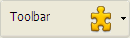

## Chemin d'accès arrière-plan

Définit le chemin d'accès de l'image qui sera dessinée en arrière-plan de l'objet. If the object uses an [icon](#picture-pathname) with [different states](#number-of-states), the background picture will automatically support the same number of states.

The pathname to enter is similar as for the [Pathname property for static pictures](properties_Picture.md#pathname).

#### Grammaire JSON

| Nom                     | Type de données | Valeurs possibles                                                                                                                        |
| ----------------------- | --------------- | ---------------------------------------------------------------------------------------------------------------------------------------- |
| customBackgroundPicture | string          | Chemin relatif en syntaxe POSIX. Doit être utilisé avec l'option "Personnalisé" de la propriété "Style". |

#### Objets pris en charge

[Custom Button](button_overview.md#custom) - [Custom Check Box](checkbox_overview.md#custom) - [Custom Radio Button](radio_overview.md#custom)

---

## Styles de bouton

Aspect général du bouton. Le style du bouton joue également un rôle dans la disponibilité de certaines options.

#### Grammaire JSON

|  Nom  | Type de données | Valeurs possibles                                                                                                                                                  |
| :---: | :-------------: | ------------------------------------------------------------------------------------------------------------------------------------------------------------------ |
| style |       text      | "regular", "flat", "toolbar", "bevel", "roundedBevel", "gradientBevel", "texturedBevel", "office", "help", "circular", "disclosure", "roundedDisclosure", "custom" |

#### Objets pris en charge

[Button](button_overview.md) - [Radio Button](radio_overview.md) - [Check Box](checkbox_overview.md) - [Radio Button](radio_overview.md)

---

## Marge horizontale

Cette propriété permet de définir la taille (en pixels) des marges horizontales du bouton. Cette marge délimite la zone que l'icône et le titre du bouton ne doivent pas dépasser.

Ce paramètre est utile, par exemple, lorsque l'image de fond contient des bordures :

| Avec / Sans          | Exemple                                                      |
| -------------------- | ------------------------------------------------------------ |
| Sans marge           |  |
| Avec marge 13 pixels |  |

> This property works in conjunction with the [Vertical Margin](#vertical-margin) property.

#### Grammaire JSON

| Nom           | Type de données | Valeurs possibles                                                                   |
| ------------- | --------------- | ----------------------------------------------------------------------------------- |
| customBorderX | number          | A utiliser avec le style "personnalisé". Minimum: 0 |

#### Objets pris en charge

[Custom Button](button_overview.md#custom) - [Custom Check Box](checkbox_overview.md#custom) - [Custom Radio Button](radio_overview.md#custom)

---

## Emplacement de l'icône

Désigne l'emplacement d'une icône par rapport à l'objet formulaire.

#### Grammaire JSON

| Nom           | Type de données | Valeurs possibles           |
| ------------- | --------------- | --------------------------- |
| iconPlacement | string          | "aucun", "gauche", "droite" |

#### Objets pris en charge

[List Box Header](listbox_overview.md#list-box-headers)

---

## Décalage icône

Définit une valeur de décalage personnalisée en pixels, qui sera utilisée lorsque le bouton est cliqué

Le titre du bouton sera décalé vers la droite et vers le bas pour le nombre de pixels saisis. Cela permet d'appliquer un effet 3D personnalisé lorsque le bouton est cliqué.

#### Grammaire JSON

| Nom          | Type de données | Valeurs possibles           |
| ------------ | --------------- | --------------------------- |
| customOffset | number          | minimum : 0 |

#### Objets pris en charge

[Custom Button](button_overview.md#custom) - [Custom Check Box](checkbox_overview.md#custom) - [Custom Radio Button](radio_overview.md#custom)

---

## Nombre d'états

This property sets the exact number of states present in the picture used as the icon for a [button with icon](button_overview.md), a [check box](checkbox_overview.md) or a custom [radio button](radio_overview.md).

The picture can contain from 2 to 6 states.

- 2 states: false, true
- 3 states: false, true, rollover,
- 4 states: false, true, rollover, disabled,
- 5 states (check box and radio button only): false, true, false rollover, true rollover, disabled
- 6 states (check box and radio button only): false, true, false rollover, true rollover, false disabled, true disable.

:::note

- "false" means button not clicked/not selected or check box unchecked (variable value=0)
- "true" means button clicked/selected or check box checked (variable value=1)

:::

Chaque état est représenté par une image différente. Dans l'image source, les états doivent être empilés verticalement :

#### Grammaire JSON

| Nom        | Type de données | Valeurs possibles                                                                |
| ---------- | --------------- | -------------------------------------------------------------------------------- |
| iconFrames | number          | Number of states in the icon picture. Minimum: 1 |

#### Objets pris en charge

[Button](button_overview.md) (all styles except [Help](button_overview.md#help)) - [Check Box](checkbox_overview.md) - [Radio Button](radio_overview.md)

---

## Chemin d'accès de l'image

Définit le chemin d'accès de l'image qui sera utilisée comme icône de l'objet.

The pathname to enter is similar as for the [Pathname property for static pictures](properties_Picture.md#pathname).

> When used as icon for active objects, the picture must be designed to support a variable [number of states](#number-of-states).

#### Grammaire JSON

| Nom   | Type de données | Valeurs possibles                                              |
| ----- | --------------- | -------------------------------------------------------------- |
| icône | picture         | Chemin relatif ou filesystem en syntaxe POSIX. |

#### Objets pris en charge

[Button](button_overview.md) (all styles except [Help](button_overview.md#help)) - [Check Box](checkbox_overview.md) - [List Box Header](listbox_overview.md#list-box-headers) - [Radio Button](radio_overview.md)

---

## Position Titre/Image

Cette propriété permet de modifier l’emplacement relatif du titre par rapport à l’icône associée. Cette propriété n’a pas d’effet lorsque le bouton contient uniquement un titre (pas d’image associée) ou une image (pas de titre). Par défaut, lorsqu’un bouton 3D contient un titre et une image, le texte est placé en-dessous de l’image.

Voici le résultat des différentes options de cette propriété :

| Option       | Description                                                                                                                                                                              | Exemple                                                           |
| ------------ | ---------------------------------------------------------------------------------------------------------------------------------------------------------------------------------------- | ----------------------------------------------------------------- |
| **Left**     | Le texte est placé à gauche de l’icône. Le contenu du bouton est aligné à droite.                                                                        |   |
| **Top**      | Le texte est placé au-dessus de l’icône. Le contenu du bouton est centré.                                                                                |       |
| **Right**    | Le texte est placé à droite de l’icône. Le contenu du bouton est aligné à gauche.                                                                        |     |
| **Bottom**   | Le texte est placé en-dessous de l’icône. Le contenu du bouton est centré.                                                                               |    |
| **Centered** | Le texte de l’icône est centré verticalement et horizontalement dans le bouton. Ce paramétrage convient par exemple pour du texte inclus dans une icône. |  |

#### Grammaire JSON

| Nom           | Type de données | Valeurs possibles                          |
| ------------- | --------------- | ------------------------------------------ |
| textPlacement | string          | "left", "top", "right", "bottom", "center" |

#### Objets pris en charge

[Button](button_overview.md) (all styles except [Help](button_overview.md#help)) - [Check Box](checkbox_overview.md) - [Radio Button](radio_overview.md)

---

## Image hugs title

This property allows you to define whether the title and the picture of the button should be visually adjoined or separated, according to the [Title/Picture position](#titlepicture-position) and [Horizontal Alignment](#horizontal-alignment) properties.

Cette propriété n’a pas d’effet lorsque le bouton contient uniquement un titre (pas d’image associée) ou une image (pas de titre).

By default, when a button contains a title and a picture, the elements are joined. The following graphic shows the effect of the `imageHugsTitle` property (true when property is enabled) with different button alignments:

#### Grammaire JSON

| Nom            | Type de données | Valeurs possibles                        |
| -------------- | --------------- | ---------------------------------------- |
| imageHugsTitle | boolean         | true (default), false |

#### Objets pris en charge

[Button](button_overview.md) (all styles except Help) - [Check Box](checkbox_overview.md) (all styles except Regular, Flat, Disclosure and Collapse/Expand) - [Radio Button](radio_overview.md) (all styles except Regular, Flat, Disclosure and Collapse/Expand).

---

## Marge verticale

Cette propriété permet de définir la taille (en pixels) des marges verticales du bouton. Cette marge délimite la zone que l'icône et le titre du bouton ne doivent pas dépasser.

Ce paramètre est utile, par exemple, lorsque l'image de fond contient des bordures.

> This property works in conjunction with the [Horizontal Margin](#horizontal-margin) property.

#### Grammaire JSON

| Nom           | Type de données | Valeurs possibles                                                                   |
| ------------- | --------------- | ----------------------------------------------------------------------------------- |
| customBorderY | number          | A utiliser avec le style "personnalisé". Minimum: 0 |

#### Objets pris en charge

[Custom Button](button_overview.md#custom) - [Custom Check Box](checkbox_overview.md#custom) - [Custom Radio Button](radio_overview.md#custom)

---

## Avec pop-up menu

Cette propriété permet d’afficher un symbole en forme de triangle indiquant qu’un pop up menu lui est associé :

L’apparence et l’emplacement de ce symbole dépend du style de bouton et de la plate-forme courante.

### Séparé et Lié

Pour associer un symbole de pop up menu à un bouton, vous disposez de deux options d’affichage :

|                           Lié                           |                           Séparé                           |
| :-----------------------------------------------------: | :--------------------------------------------------------: |
|  |  |

> La disponibilité effective d’un mode “Séparé” dépend du style de bouton et de la plate-forme.

Chaque option précise la relation entre le bouton et le pop up menu associé :

- When the pop-up menu is **separated**, clicking on the left part of the button directly executes the current action of the button; this action can be modified using the pop-up menu accessible in the right part of the button.
- When the pop-up menu is **linked**, a simple click on the button only displays the pop-up menu. Seule la sélection de l’action dans le pop up menu provoque son déclenchement.

:::info

Refer to the [`On Alternative Click` event description](../Events/onAlternativeClick.md) for more information on the handling of events in this case.

:::

### Gestion du pop up menu

Il est important de noter que la propriété “Avec pop up menu” gère uniquement l’aspect graphique du bouton. The display of the pop-up menu and its values must be handled entirely by the developer, more particularly using `form events` and the [`Dynamic pop up menu`](https://doc.4d.com/4dv19R7/help/command/en/page1006.html) and [`Pop up menu`](https://doc.4d.com/4dv19R7/help/command/en/page542.html) commands.

#### Grammaire JSON

| Nom            | Type de données | Valeurs possibles                                    |
| :------------- | --------------- | ---------------------------------------------------- |
| popupPlacement | string          | <li>"none"</li><li>"linked"</li><li>"separated"</li> |

#### Objets pris en charge

[Toolbar Button](button_overview.md#toolbar) - [Bevel Button](button_overview.md#bevel) - [Rounded Bevel Button](button_overview.md#Rounded-bevel) - [OS X Gradient Button](button_overview.md#os-x-gradient) - [OS X Textured Button](button_overview.md#os-x-textured) - [Office XP Button](button_overview.md#office-XP) - [Circle Button](button_overview.md#circle) - [Custom](button_overview.md#custom)
