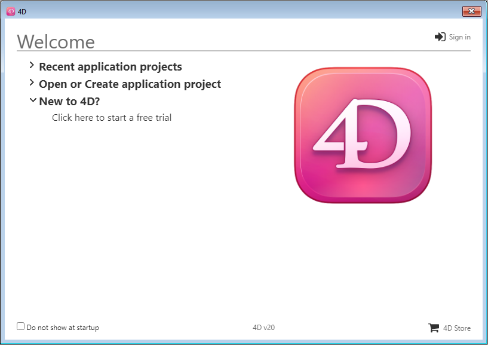

Bienvenue dans 4D ! Cette page regroupe toutes les informations nécessaires sur l'installation et le lancement de votre produit 4D.

## Configuration requise

The [Product Download](https://us.4d.com/product-download) page on the 4D website provides information about the minimum macOS / Windows system requirements for your 4D series.

Additional technical details are available on the 4D website's [Resources page](https://us.4d.com/resources/feature-release).

## Installation sur disque

Les produits 4D sont installés à partir du site web de 4D :

1. Connect to the 4D website and go to the [Downloads](https://us.4d.com/product-download) page.

2. Cliquez sur le lien de téléchargement du produit 4D de votre choix, puis suivez les instructions qui s'affichent à l'écran.

## Connexion

Une fois l'installation terminée, vous pouvez lancer 4D et vous connecter. Pour ce faire, double-cliquez sur l'icône du produit 4D.

Apparaît ensuite l'assistant de bienvenue :

- If you want to discover and explore 4D, click on the **free trial** link. Il vous sera demandé de vous connecter ou de créer un compte 4D.

- If you already have a 4D account, click on the **Sign in** link in the upper right side of the Welcome Wizard dialog and enter your account information. Toute licence 4D préalablement enregistrée est automatiquement mise à jour (ou les packs d'extension supplémentaires sont chargés) sur votre machine.

Expand the **Open or create project application** area and select the action you want to perform:

- **Connect to 4D Server** - use 4D as a remote client and connect to an application that is already loaded by 4D Server.

- **Open a local application project** - load an existing application project stored on your disk.

- **Create a new application project** - create a new, empty application project on your disk.

Nous vous souhaitons une excellente expérience 4D !

:::info

Vous avez besoin d'activer des licences spécifiques ? Visit the [Managing 4D licenses](../Admin/licenses.md) page.

:::
