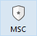

La fenêtre du Centre de sécurité et de maintenance (CSM) rassemble tous les outils nécessaires au contrôle, à l’analyse, à la maintenance, à la sauvegarde, au compactage et au chiffrement des fichiers de données et de structure. Le CSM est disponible dans toutes les applications 4D : 4D monoposte, 4D Server ou 4D Desktop.

**Note :** La fenêtre du CSM n'est pas accessible depuis une application 4D distante.

Vous pouvez accéder à la fenêtre du CSM de plusieurs manières. Le mode d’accès détermine également le mode d’ouverture du projet d'application : mode “maintenance” ou mode “standard”. En mode maintenance, le projet n’est pas ouvert par 4D, seule sa référence est fournie au CSM. En mode standard, le projet est ouvert par 4D.

## Accès au CSM en mode maintenance

En mode maintenance, seule la fenêtre du CSM est affichée (le projet n’est pas ouvert par l’application 4D). Ce principe permet notamment d’accéder à des projets trop endommagés pour pouvoir être ouvertes en mode standard par 4D. En outre, certaines opérations (compactage, réparation...) nécessitent que le projet soit ouvert en mode maintenance (cf. [Disponibilité des fonctionnalités](#feature-availability)).

Vous pouvez ouvrir le CSM en mode maintenance depuis deux emplacements :

- **À partir de la boîte de dialogue standard d'ouverture de projet**
  La boîte de dialogue standard d'ouverture inclut l'option **Centre de sécurité de maintenance** dans le menu associé au bouton **Ouvrir** :
  
- **Menu Aide/Centre de sécurité et de maintenance** ou bouton **CSM** de la barre d’outils (projet non ouvert)\
  \
  Lorsque vous appelez cette fonction, une boîte de dialogue standard d’ouverture de fichiers apparaît, vous permettant de sélectionner le fichier _.4DProject_ ou _.4dz_ à examiner. Le projet ne sera pas ouvert par 4D.

## Accès au CSM en mode standard

En mode standard, un projet est ouvert. Dans ce mode, certaines fonctions de maintenance ne sont pas disponibles. Vous disposez de plusieurs possibilités pour accéder à la fenêtre du CSM :

- Utiliser le menu **Aide/Centre de sécurité et de maintenance** ou le bouton **CSM** dans la barre d’outils 4D :\
  
- Utiliser l'action standard “Csm” qu’il est possible d’associer à une commande de menu ou à un objet de formulaire.
- Utiliser la commande `OPEN SECURITY CENTER`.

## Disponibilité des fonctionnalités

Certaines fonctions du CSM ne sont pas disponibles suivant le mode d’ouverture du CSM :

- Les informations relatives à la sauvegarde sont disponibles uniquement lorsque le projet est ouvert (le CSM doit avoir été ouvert en mode standard).
- Les fonctions de compactage, retour arrière, restitution, réparation et chiffrement des données ne sont utilisables qu’avec des bases de données non ouvertes (le CSM doit avoir été ouvert en mode maintenance). Si ces fonctions sont utilisées alors que le projet est ouvert en mode standard, une boîte de dialogue s’affiche, vous permettant de relancer l’application en mode maintenance.
- Dans les bases chiffrées, l'accès aux données chiffrées ou au fichier .journal nécessite qu'une clé de chiffrement des données valide soit fournie (voir [Page Chiffrement](encrypt.md)). Sinon, les données chiffrées ne sont pas visibles.
