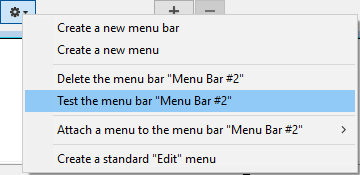

Les barres de menu fournissent la principale interface des applications personnalisées. Pour chaque application personnalisée, vous devez créer au moins une barre de menu avec au moins un menu. Par défaut, Menu Bar #1 est la barre de menu qui est affichée dans l'application. You can change which menu bar is displayed using the `SET MENU BAR` command.

4D vous permet d’associer une image d’accueil personnalisée à chaque barre de menus et de prévisualiser une barre à tout moment.

## Image d'accueil

Vous pouvez enrichir l’apparence de chaque barre de menus en lui associant une image d’accueil personnalisée. La fenêtre contenant l’image d’accueil est affichée en-dessous de la barre de menus lorsqu’elle apparaît. Elle peut contenir un logo ou tout type d’image. Par défaut, 4D affiche un logo comme image dans la fenêtre d’accueil :

Une image d’accueil personnalisée peut provenir de toute application graphique. 4D vous permet de coller une image du presse-papiers, d’utiliser une image de la bibliothèque ou toute image présente sur votre disque dur. Tous les formats d’image standard pris en charge par 4D sont utilisables.

L'image d'accueil peut être uniquement paramétrée dans l'éditeur de menus : sélectionnez la barre de menus à laquelle vous souhaitez associer une image d’accueil personnalisée. Notez la zone "Image de fond" à droite de la fenêtre.
To open a picture stored on your disk directly, click on the **Open** button or click in the "Background Image" area. Un pop up menu apparaît :

- To paste a picture from the clipboard, choose **Paste**.
- To open a picture stored in a disk file, choose **Open**.
  Si vous avez choisi la commande Ouvrir, une boîte de dialogue standard d’ouverture de fichiers apparaît, vous permettant de sélectionner le fichier image à utiliser. Une fois définie, l’image s’affiche en taille réduite dans la zone. Elle est alors associée à la barre de menus.

Vous pouvez visualiser le résultat final en testant la barre de menus (cf. paragraphe suivant). En mode Application, l’image est affichée dans la fenêtre d’accueil avec un format du type “tronqué centré”.

> You can choose whether to display or hide this window using the **Display toolbar** option in the Settings.

To remove the custom picture and display the default one instead, click on the **Clear** button or select **Clear** in the area pop-up menu.

## Prévisualiser la barre de menus

L’éditeur de menus vous permet de visualiser à tout moment les menus personnalisés et la fenêtre d’accueil sans quitter la fenêtre de la boîte à outils.

To do so, simply select the menu bar and choose **Test the menu bar "Menu Bar #X"** in the context menu or the options menu of the editor.

4D affiche un aperçu de la barre de menus ainsi que de l’écran d’accueil. Vous pouvez dérouler les menus et les sous-menus pour prévisualiser leur contenu. En revanche, les menus ne sont pas actifs. To test the functioning of menus and the toolbar, you must use the **Test Application** command from the **Run** menu.

:::info

If the **Use SDI mode on Windows** option is selected in the ["Interface" page of the Settings dialog box](../settings/interface.md#display-windows), the **Test Application** menu allows you to test your application in [SDI or MDI mode](sdi/md) on Windows:

:::
