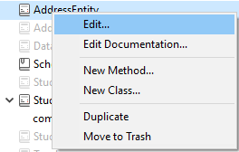

ORDA vous permet de créer des fonctions de classe de haut niveau au-dessus du modèle de données. Cela vous permet d'écrire du code orienté métier et de le «publier» comme une API. Le datastore, les dataclasses, les sélections d'entités et les entités sont tous disponibles en tant qu'objets de classe pouvant contenir des fonctions.

For example, you could create a `getNextWithHigherSalary()` function in the `EmployeeEntity` class to return employees with a salary higher than the selected one. Il serait aussi simple à appeler que :

```4d
$nextHigh:=ds.Employee.get(1).getNextWithHigherSalary()
```

Les développeurs peuvent utiliser ces fonctions non seulement dans des datastores locaux, mais aussi dans des architectures client/serveur et distantes :

```4d
 //$cityManager est la référence d'un datastore distant
Form.comp.city:=$cityManager.City.getCityName(Form.comp.zipcode)
```

Grâce à cette fonctionnalité, toute la logique métier de votre application 4D peut être stockée comme une couche indépendante afin d'être facilement maintenue ou réutilisée avec un niveau de sécurité élevé :

- Elle vous permet de «masquer» la complexité globale de la structure physique sous-jacente et d'exposer uniquement des fonctions compréhensibles et prêtes à l'emploi.

- Si la structure physique évolue, il vous suffit d'adapter le code de la fonction et les applications clientes continueront de les appeler de manière transparente.

- By default, all of your data model class functions (including [computed attribute functions](#computed-attributes-1)) and [alias attributes](#alias-attributes-1) are **not exposed** to remote applications and cannot be called from REST requests. You must explicitly declare each public function and alias with the [`exposed`](#exposed-vs-non-exposed-functions) keyword.


In addition, 4D [automatically pre-creates](#creating-classes) the classes for each available data model object.

## Architecture

ORDA provides **generic classes** exposed through the **`4D`** [class store](Concepts/classes.md#class-stores), as well as **user classes** (extending generic classes) exposed in the **`cs`** [class store](Concepts/classes.md#class-stores):


All ORDA data model classes are exposed as properties of the **`cs`** class store. Les classes ORDA suivantes sont disponibles :

| Classe                                      | Nom de l'exemple                     | Instanciée par                                                                                                                                                                                                                                                                                                                                                                                                                                                                                                                                                                                                                                                                                                                                                                                                                                                         |
| ------------------------------------------- | ------------------------------------ | ---------------------------------------------------------------------------------------------------------------------------------------------------------------------------------------------------------------------------------------------------------------------------------------------------------------------------------------------------------------------------------------------------------------------------------------------------------------------------------------------------------------------------------------------------------------------------------------------------------------------------------------------------------------------------------------------------------------------------------------------------------------------------------------------------------------------------------------------------------------------- |
| cs.DataStore                | cs.DataStore         | [`ds`](API/DataStoreClass.md#ds) command                                                                                                                                                                                                                                                                                                                                                                                                                                                                                                                                                                                                                                                                                                                                                                                                                               |
| cs._DataClassName_          | cs.Employee          | [`dataStore.DataClassName`](API/DataStoreClass.md#dataclassname), `dataStore["DataClassName"]`                                                                                                                                                                                                                                                                                                                                                                                                                                                                                                                                                                                                                                                                                                                                                                         |
| cs._DataClassName_Entity    | cs.EmployeeEntity    | [`dataClass.get()`](API/DataClassClass.md#get), [`dataClass.new()`](API/DataClassClass.md#new), [`entitySelection.first()`](API/EntitySelectionClass.md#first), [`entitySelection.last()`](API/EntitySelectionClass.md#last), [`entity.previous()`](API/EntityClass.md#previous), [`entity.next()`](API/EntityClass.md#next), [`entity.first()`](API/EntityClass.md#first), [`entity.last()`](API/EntityClass.md#last), [`entity.clone()`](API/EntityClass.md#clone)                                                                                                                                                                                                                                                                                                                                                                                                   |
| cs._DataClassName_Selection | cs.EmployeeSelection | [`dataClass.query()`](API/DataClassClass.md#query), [`entitySelection.query()`](API/EntitySelectionClass.md#query), [`dataClass.all()`](API/DataClassClass.md#all), [`dataClass.fromCollection()`](API/DataClassClass.md#fromcollection), [`dataClass.newSelection()`](API/DataClassClass.md#newselection), [`entitySelection.drop()`](API/EntitySelectionClass.md#drop), [`entity.getSelection()`](API/EntityClass.md#getselection), [`entitySelection.and()`](API/EntitySelectionClass.md#and), [`entitySelection.minus()`](API/EntitySelectionClass.md#minus), [`entitySelection.or()`](API/EntitySelectionClass.md#or), [`entitySelection.orderBy()`](API/EntitySelectionClass.md#or), [`entitySelection.orderByFormula()`](API/EntitySelectionClass.md#orderbyformula), [`entitySelection.slice()`](API/EntitySelectionClass.md#slice), `Create entity selection` |

> ORDA user classes are stored as regular class files (.4dm) in the Classes subfolder of the project [(see below)](#class-files).

De plus, les instances d'objet de classes utilisateurs du modèles de données ORDA bénéficient des propriétés et fonctions de leurs parents:

- a Datastore class object can call functions from the [ORDA Datastore generic class](API/DataStoreClass.md).
- a Dataclass class object can call functions from the [ORDA Dataclass generic class](API/DataClassClass.md).
- an Entity selection class object can call functions from the [ORDA Entity selection generic class](API/EntitySelectionClass.md).
- an Entity class object can call functions from the [ORDA Entity generic class](API/EntityClass.md).

## Description de la classe

<details><summary>Historique</summary>

| Release | Modifications                                                                                                                      |
| ------- | ---------------------------------------------------------------------------------------------------------------------------------- |
| 19 R4   | Alias attributes in the Entity Class                                                                                               |
| 19 R3   | Computed attributes in the Entity Class                                                                                            |
| 18 R5   | Data model class functions are not exposed to REST by default. New `exposed` and `local` keywords. |

</details>

### Classe DataStore

A 4D database exposes its own DataStore class in the `cs` class store.

- **Extends**: 4D.DataStoreImplementation
- **Class name**: cs.DataStore

You can create functions in the DataStore class that will be available through the `ds` object.

#### Exemple

```4d
// cs.DataStore class

Class extends DataStoreImplementation

Function getDesc
  $0:="Database exposing employees and their companies"
```

Cette foncton peut alors être appelée :

```4d
$desc:=ds.getDesc() //"Database exposing..."
```

### Classe DataClass

Each table exposed with ORDA offers a DataClass class in the `cs` class store.

- **Extends**: 4D.DataClass
- **Class name**: cs._DataClassName_ (where _DataClassName_ is the table name)
- **Example name**: cs.Employee

#### Exemple

```4D
// cs.Company class


Class extends DataClass

// Returns companies whose revenue is over the average
// Returns an entity selection related to the Company DataClass

Function GetBestOnes()
	$sel:=This.query("revenues >= :1";This.all().average("revenues"));
	$0:=$sel
```

Vous pouvez ensuite obtenir une sélection d'entité des "meilleures" entreprises en exécutant le code suivant :

```4d
	var $best : cs.CompanySelection
	$best:=ds.Company.GetBestOnes()
```

:::info

[Computed attributes](#computed-attributes) are defined in the [Entity Class](#entity-class).

:::

#### Exemple avec un datastore distant

The following _City_ catalog is exposed in a remote datastore (partial view):


The `City Class` provides an API:

```4d
// cs.City class

Class extends DataClass

Function getCityName()
	var $1; $zipcode : Integer
	var $zip : 4D.Entity
	var $0 : Text

	$zipcode:=$1
	$zip:=ds.ZipCode.get($zipcode)
	$0:="" 

	If ($zip#Null)
		$0:=$zip.city.name
	End if
```

L'application cliente ouvre une session sur le datastore distant :

```4d
$cityManager:=Open datastore(New object("hostname";"127.0.0.1:8111");"CityManager")
```

Une application cliente peut alors utiliser l'API pour obtenir la ville correspondant au code postal (par exemple) à partir d'un formulaire :

```4d
Form.comp.city:=$cityManager.City.getCityName(Form.comp.zipcode)

```

### Classe EntitySelection

Each table exposed with ORDA offers an EntitySelection class in the `cs` class store.

- **Extends**: 4D.EntitySelection
- **Class name**: _DataClassName_Selection (where _DataClassName_ is the table name)
- **Example name**: cs.EmployeeSelection

#### Exemple

```4d
// cs.EmployeeSelection class


Class extends EntitySelection

//Extract the employees with a salary greater than the average from this entity selection 

Function withSalaryGreaterThanAverage() : cs.EmployeeSelection
	return This.query("salary > :1";This.average("salary")).orderBy("salary")

```

Vous pouvez alors obtenir les employés dont le salaire est supérieur à la moyenne, dans une sélection d'entité, en exécutant le code suivant :

```4d
$moreThanAvg:=ds.Company.all().employees.withSalaryGreaterThanAverage()
```

:::info

[Restricted entity selection filters](entities.md#restricting-entity-selections) are defined in the [Dataclass Class](#dataclass-class).

:::

### Entity Class

Each table exposed with ORDA offers an Entity class in the `cs` class store.

- **Extends**: 4D.Entity
- **Class name**: _DataClassName_Entity (where _DataClassName_ is the table name)
- **Example name**: cs.CityEntity

#### Champs calculés

Entity classes allow you to define **computed attributes** using specific keywords:

- `Function get` _attributeName_
- `Function set` _attributeName_
- `Function query` _attributeName_
- `Function orderBy` _attributeName_

For information, please refer to the [Computed attributes](#computed-attributes-1) section.

#### Attributs de type alias

Entity classes allow you to define **alias attributes**, usually over related attributes, using the `Alias` keyword:

`Alias` _attributeName_ _targetPath_

For information, please refer to the [Alias attributes](#alias-attributes-1) section.

#### Exemple

```4d
// cs.CityEntity class

Class extends Entity

Function getPopulation() : Integer
    return This.zips.sum("population")


Function isBigCity(): Boolean
// The getPopulation() function is usable inside the class
	return This.getPopulation()>50000
```

Vous pouvez ensuite appeler ce code :

```4d
var $cityManager; $city : Object

$cityManager:=Open datastore(New object("hostname";"127.0.0.1:8111");"CityManager")
$city:=$cityManager.City.getCity("Caguas")

If ($city.isBigCity())
	ALERT($city.name + " is a big city")
End if
```

### Règles spécifiques

Lors de la création ou de la modification de classes de modèles de données, vous devez veiller aux règles décrites ci-dessous :

- Since they are used to define automatic DataClass class names in the **cs** [class store](Concepts/classes.md#class-stores), 4D tables must be named in order to avoid any conflict in the **cs** namespace. En particulier :
  - Do not give the same name to a 4D table and to a [user class name](Concepts/classes.md#class-names). Si un tel cas se produit, le constructeur de la classe utilisateur devient inutilisable (un avertissement est retourné par le compilateur).
  - N'utilisez pas de nom réservé pour une table 4D (par exemple "DataClass").

- When defining a class, make sure the [`Class extends`](Concepts/classes.md#class-extends-classnameclass) statement exactly matches the parent class name (remember that they're case sensitive). For example, `Class extends EntitySelection` for an entity selection class.

- You cannot instantiate a data model class object with the `new()` keyword (an error is returned). You must use a regular method as listed in the [`Instantiated by` column of the ORDA class table](#architecture).

- You cannot override a native ORDA class function from the **`4D`** [class store](Concepts/classes.md#class-stores) with a data model user class function.

### Exécution préemptive

Lors de la compilation, les fonctions de classe du modèle de données sont exécutées :

- in **preemptive or cooperative processes** (depending on the calling process) in single-user applications,
- in **preemptive processes** in client/server applications (except if the [`local`](#local-functions) keyword is used, in which case it depends on the calling process like in single-user).

Si votre projet est conçu de façon à être exécuté en client/serveur, assurez-vous que le code de la fonction de classe du modèle de données est thread-safe. Si un code thread-unsafe est appelé, une erreur sera générée au moment de l'exécution (aucune erreur ne sera déclenchée au moment de la compilation puisque l'exécution coopérative est prise en charge dans les applications monoposte).

## Champs calculés

### Vue d’ensemble

Un champ calculé est un attribut de dataclass avec un type de données qui masque un calcul. [Standard 4D classes](Concepts/classes.md) implement the concept of computed properties with `get` (_getter_) and `set` (_setter_) [accessor functions](Concepts/classes.md#function-get-and-function-set). ORDA dataclass attributes benefit from this feature and extend it with two additional functions: `query` and `orderBy`.

At the very minimum, a computed attribute requires a `get` function that describes how its value will be calculated. When a _getter_ function is supplied for an attribute, 4D does not create the underlying storage space in the datastore but instead substitutes the function's code each time the attribute is accessed. Si l'attribut n'est pas consulté, le code ne s'exécute jamais.

A computed attribute can also implement a `set` function, which executes whenever a value is assigned to the attribute. The _setter_ function describes what to do with the assigned value, usually redirecting it to one or more storage attributes or in some cases other entities.

Just like storage attributes, computed attributes may be included in **queries**. Par défaut, lorsqu'un champ calculé est utilisé dans une requête ORDA, il est calculé une fois par entité examinée. Dans certains cas, cela est suffisant. . However for better performance, especially in client/server, computed attributes can implement a `query` function that relies on actual dataclass attributes and benefits from their indexes.

Similarly, computed attributes can be included in **sorts**. Lorsqu'un champ calculé est utilisé dans un tri ORDA, l'attribut est calculé une fois par entité examinée. Just like in queries, computed attributes can implement an `orderBy` function that substitutes other attributes during the sort, thus increasing performance.

### Comment définir les champs calculés

You create a computed attribute by defining a `get` accessor in the [**entity class**](#entity-class) of the dataclass. Le champ calculé sera automatiquement disponible dans les attributs de la dataclass et dans les attributs de l'entité.

Other computed attribute functions (`set`, `query`, and `orderBy`) can also be defined in the entity class. Elles sont facultatives.

Within computed attribute functions, [`This`](Concepts/classes.md#this) designates the entity. Computed attributes can be used and handled as any dataclass attribute, i.e. they will be processed by [entity class](API/EntityClass.md) or [entity selection class](API/EntitySelectionClass.md) functions.

> ORDA computed attributes are not [**exposed**](#exposed-vs-non-exposed-functions) by default. You expose a computed attribute by adding the `exposed` keyword to the **get function** definition.

> **get and set functions** can have the [**local**](#local-functions) property to optimize client/server processing.

### `Function get <attributeName>`

#### Syntaxe

```4d
{local} {exposed} Function get <attributeName>({$event : Object}) -> $result : type
// code
```

The _getter_ function is mandatory to declare the _attributeName_ computed attribute. Whenever the _attributeName_ is accessed, 4D evaluates the `Function get` code and returns the _$result_ value.

> Un champ calculé peut utiliser la valeur d'un ou plusieurs autres champs calculés. Les appels récursifs génèrent des erreurs.

The _getter_ function defines the data type of the computed attribute thanks to the _$result_ parameter. Les types de résultats suivants sont autorisés :

- Scalar (text, boolean, date, time, number)
- Object
- Image
- BLOB
- Entity (i.e. cs.EmployeeEntity)
- \*\*Exemple \*\* : cs.EmployeeSelection

The _$event_ parameter contains the following properties:

| Propriété     | Type    | Description                                                                                                                   |
| ------------- | ------- | ----------------------------------------------------------------------------------------------------------------------------- |
| attributeName | Text    | Nom du champ calculé                                                                                                          |
| dataClassName | Text    | Nom de la dataclass                                                                                                           |
| kind          | Text    | "get"                                                                                                                         |
| result        | Variant | Optionnel. Complétez cette propriété avec la valeur Null si vous souhaitez qu'un champ scalaire retourne Null |

#### Exemples

- _fullName_ computed attribute:

```4d
Function get fullName($event : Object)-> $fullName : Text

  Case of 	
	: (This.firstName=Null) & (This.lastName=Null)
		$event.result:=Null //use result to return Null
	: (This.firstName=Null)
		$fullName:=This.lastName
	: (This.lastName=Null)
		$fullName:=This.firstName
	Else 
		$fullName:=This.firstName+" "+This.lastName
	End case 
```

- Un champ calculé peut être basé sur un attribut relatif à une entité :

```4d
Function get bigBoss($event : Object)-> $result: cs.EmployeeEntity
	$result:=This.manager.manager
    
```

- Un champ calculé peut être basé sur un attribut relatif à une entity selection :

```4d
Function get coWorkers($event : Object)-> $result: cs.EmployeeSelection
    If (This.manager.manager=Null)
        $result:=ds.Employee.newSelection()
    Else 
        $result:=This.manager.directReports.minus(this)
    End if
```

### `Function set <attributeName>`

#### Syntaxe

```4d

{local} Function set <attributeName>($value : type {; $event : Object})
// code
```

The _setter_ function executes whenever a value is assigned to the attribute. Cette fonction traite généralement la ou les valeurs d'entrée et le résultat est réparti entre un ou plusieurs autres attributs.

The _$value_ parameter receives the value assigned to the attribute.

The _$event_ parameter contains the following properties:

| Propriété     | Type    | Description                         |
| ------------- | ------- | ----------------------------------- |
| attributeName | Text    | Nom du champ calculé                |
| dataClassName | Text    | Nom de la dataclass                 |
| kind          | Text    | "set"                               |
| value         | Variant | Valeur à gérer par le champ calculé |

#### Exemple

```4d
Function set fullName($value : Text; $event : Object)
	var $p : Integer
    $p:=Position(" "; $value) 		
	This.firstname:=Substring($value; 1; $p-1)  // "" if $p<0
	This.lastname:=Substring($value; $p+1)
```

### `Function query <attributeName>`

#### Syntaxe

```4d
Function query <attributeName>($event : Object)
Function query <attributeName>($event : Object) -> $result : Text
Function query <attributeName>($event : Object) -> $result : Object
// code
```

Cette fonction prend en charge trois syntaxes :

- With the first syntax, you handle the whole query through the `$event.result` object property.
- With the second and third syntaxes, the function returns a value in _$result_:
  - If _$result_ is a Text, it must be a valid query string
  - If _$result_ is an Object, it must contain two properties:
  | Propriété                          | Type       | Description                                                                                                                  |
  | ---------------------------------- | ---------- | ---------------------------------------------------------------------------------------------------------------------------- |
  | $result.query      | Text       | Chaîne de requête valide avec placeholders (:1, :2, etc.) |
  | $result.parameters | Collection | valeurs pour placeholders                                                                                                    |

The `query` function executes whenever a query using the computed attribute is launched. Il est utile de personnaliser et d'optimiser les requêtes en s'appuyant sur les attributs indexés. When the `query` function is not implemented for a computed attribute, the search is always sequential (based upon the evaluation of all values using the `get <AttributeName>` function).

> The following features are not supported:
>
> - calling a `query` function on computed attributes of type Entity or Entity selection,
> - using the `order by` keyword in the resulting query string.

The _$event_ parameter contains the following properties:

| Propriété     | Type    | Description                                                                                                                                                                                                                                                                                                                                                                                                                                                                                                                                                                                                                                                                                                                                                    |
| ------------- | ------- | -------------------------------------------------------------------------------------------------------------------------------------------------------------------------------------------------------------------------------------------------------------------------------------------------------------------------------------------------------------------------------------------------------------------------------------------------------------------------------------------------------------------------------------------------------------------------------------------------------------------------------------------------------------------------------------------------------------------------------------------------------------- |
| attributeName | Text    | Nom du champ calculé                                                                                                                                                                                                                                                                                                                                                                                                                                                                                                                                                                                                                                                                                                                                           |
| dataClassName | Text    | Nom de la dataclass                                                                                                                                                                                                                                                                                                                                                                                                                                                                                                                                                                                                                                                                                                                                            |
| kind          | Text    | "query"                                                                                                                                                                                                                                                                                                                                                                                                                                                                                                                                                                                                                                                                                                                                                        |
| value         | Variant | Valeur à gérer par le champ calculé                                                                                                                                                                                                                                                                                                                                                                                                                                                                                                                                                                                                                                                                                                                            |
| operator      | Text    | Query operator (see also the [`query` class function](API/DataClassClass.md#query)). Possible values:<li>== (equal to, @ is wildcard)</li><li>=== (equal to, @ is not wildcard)</li><li>!= (not equal to, @ is wildcard)</li><li>!== (not equal to, @ is not wildcard)</li><li>< (less than)</li><li><= (less than or equal to)</li><li>> (greater than)</li><li>>= (greater than or equal to)</li><li>IN (included in)</li><li>% (contains keyword)</li> |
| result        | Variant | Valeur devant être gérée par le champ calculé. Pass `Null` in this property if you want to let 4D execute the default query (always sequential for computed attributes).                                                                                                                                                                                                                                                                                                                                                                                                                                                                                                                                    |

> If the function returns a value in _$result_ and another value is assigned to the `$event.result` property, the priority is given to `$event.result`.

#### Exemples

- Query on the _fullName_ computed attribute.

```4d
Function query fullName($event : Object)->$result : Object

	var $fullname; $firstname; $lastname; $query : Text
	var $operator : Text
	var $p : Integer
	var $parameters : Collection

	$operator:=$event.operator
	$fullname:=$event.value

	$p:=Position(" "; $fullname) 
	If ($p>0)
		$firstname:=Substring($fullname; 1; $p-1)+"@"
		$lastname:=Substring($fullname; $p+1)+"@"
		$parameters:=New collection($firstname; $lastname) // two items collection
	Else 
		$fullname:=$fullname+"@"
		$parameters:=New collection($fullname) // single item collection
	End if 

	Case of 
	: ($operator="==") | ($operator="===")
		If ($p>0)
			$query:="(firstName = :1 and lastName = :2) or (firstName = :2 and lastName = :1)"
		Else 
			$query:="firstName = :1 or lastName = :1"
		End if 
	: ($operator="!=")
		If ($p>0)
			$query:="firstName != :1 and lastName != :2 and firstName != :2 and lastName != :1"
		Else 
			$query:="firstName != :1 and lastName != :1"
		End if 
	End case 

	$result:=New object("query"; $query; "parameters"; $parameters)
```

> Keep in mind that using placeholders in queries based upon user text input is recommended for security reasons (see [`query()` description](API/DataClassClass.md#query)).

Code d'appel, par exemple :

```4d
$emps:=ds.Employee.query("fullName = :1"; "Flora Pionsin")
```

- This function handles queries on the _age_ computed attribute and returns an object with parameters:

```4d
Function query age($event : Object)->$result : Object
	
	var $operator : Text
	var $age : Integer
	var $_ages : Collection
	
	$operator:=$event.operator
			
	$age:=Num($event.value)  // integer
	$d1:=Add to date(Current date; -$age-1; 0; 0)
	$d2:=Add to date($d1; 1; 0; 0)
	$parameters:=New collection($d1; $d2)
	
	Case of 
			
		: ($operator="==")
			$query:="birthday > :1 and birthday <= :2"  // after d1 and before or egal d2
			
		: ($operator="===") 

			$query:="birthday = :2"  // d2 = second calculated date (= birthday date)

		: ($operator=">=")
			$query:="birthday <= :2"
			
			//... other operators			
			
			
	End case 
	
	
	If (Undefined($event.result))
		$result:=New object
		$result.query:=$query
		$result.parameters:=$parameters
	End if

```

Code d'appel, par exemple :

```4d
// people aged between 20 and 21 years (-1 day)
$twenty:=people.query("age = 20")  // calls the "==" case

// people aged 20 years today
$twentyToday:=people.query("age === 20") // equivalent to people.query("age is 20") 

```

### `Function orderBy <attributeName>`

#### Syntaxe

```4d
Function orderBy <attributeName>($event : Object)
Function orderBy <attributeName>($event : Object)-> $result : Text

// code
```

The `orderBy` function executes whenever the computed attribute needs to be ordered. Elle permet de trier le champ calculé. For example, you can sort _fullName_ on first names then last names, or conversely.
When the `orderBy` function is not implemented for a computed attribute, the sort is always sequential (based upon the evaluation of all values using the `get <AttributeName>` function).

> Calling an `orderBy` function on computed attributes of type Entity class or Entity selection class **is not supported**.

The _$event_ parameter contains the following properties:

| Propriété     | Type    | Description                                                                                                                                |
| ------------- | ------- | ------------------------------------------------------------------------------------------------------------------------------------------ |
| attributeName | Text    | Nom du champ calculé                                                                                                                       |
| dataClassName | Text    | Nom de la dataclass                                                                                                                        |
| kind          | Text    | "orderBy"                                                                                                                                  |
| value         | Variant | Valeur à gérer par le champ calculé                                                                                                        |
| operator      | Text    | "desc" or "asc" (default)                                                                                               |
| descending    | Boolean | `true` for descending order, `false` for ascending order                                                                                   |
| result        | Variant | Valeur devant être gérée par le champ calculé. Pass `Null` if you want to let 4D execute the default sort. |

> You can use either the `operator` or the `descending` property. C'est essentiellement une question de style de programmation (voir les exemples).

You can return the `orderBy` string either in the `$event.result` object property or in the _$result_ function result. If the function returns a value in _$result_ and another value is assigned to the `$event.result` property, the priority is given to `$event.result`.

#### Exemple

Vous pouvez saisir du code conditionnel :

```4d
Function orderBy fullName($event : Object)-> $result : Text
    If ($event.descending=True)
        $result:="firstName desc, lastName desc" 
    Else 
        $result:="firstName, lastName" 
    End if
```

Vous pouvez également saisir du code compact :

```4d
Function orderBy fullName($event : Object)-> $result : Text
	$result:="firstName "+$event.operator+", "lastName "+$event.operator

```

Le code conditionnel est nécessaire dans certains cas :

```4d
Function orderBy age($event : Object)-> $result : Text

    If ($event.descending=True)
        $result:="birthday asc" 
    Else 
        $result:="birthday desc" 
    End if

```

## Attributs de type alias

### Vue d’ensemble

An **alias** attribute is built above another attribute of the data model, named **target** attribute. The target attribute can belong to a related dataclass (available through any number of relation levels) or to the same dataclass. An alias attribute stores no data, but the path to its target attribute. You can define as many alias attributes as you want in a dataclass.

Alias attributes are particularly useful to handle N to N relations. They bring more readability and simplicity in the code and in queries by allowing to rely on business concepts instead of implementation details.

### How to define alias attributes

You create an alias attribute in a dataclass by using the `Alias` keyword in the [**entity class**](#entity-class) of the dataclass.

### `Alias <attributeName> <targetPath>`

#### Syntaxe

```
{exposed} Alias <attributeName> <targetPath>
```

_attributeName_ must comply with [standard rules for property names](../Concepts/identifiers.md#object-properties).

_targetPath_ is an attribute path containing one or more levels, such as "employee.company.name". If the target attribute belongs to the same dataclass, _targetPath_ is the attribute name.

An alias can be used as a part of a path of another alias.

A [computed attribute](#computed-attributes-1) can be used in an alias path, but only as the last level of the path, otherwise, an error is returned. For example, if "fullName" is a computed attribute, an alias with path "employee.fullName" is valid.

> ORDA alias attributes are **not exposed** by default. You must add the [`exposed`](#exposed-vs-non-exposed-functions) keyword before the `Alias` keyword if you want the alias to be available to remote requests.

### Using alias attributes

Alias attributes are read-only (except when based upon a scalar attribute of the same dataclass, see the last example below). They can be used instead of their target attribute path in class functions such as:

| Function                                       |
| ---------------------------------------------- |
| `dataClass.query()`, `entitySelection.query()` |
| `entity.toObject()`                            |
| `entitySelection.toCollection()`               |
| `entitySelection.extract()`                    |
| `entitySelection.orderBy()`                    |
| `entitySelection.orderByFormula()`             |
| `entitySelection.average()`                    |
| `entitySelection.count()`                      |
| `entitySelection.distinct()`                   |
| `entitySelection.sum()`                        |
| `entitySelection.min()`                        |
| `entitySelection.max()`                        |
| `entity.diff()`                                |
| `entity.touchedAttributes()`                   |

> Keep in mind that alias attributes are calculated on the server. In remote configurations, updating alias attributes in entities requires that entities are reloaded from the server.

### Alias properties

Alias attribute [`kind`](../API/DataClassClass.md#attributename) is "alias".

An alias attribute inherits its data [`type`](../API/DataClassClass.md#attributename) property from the target attribute:

- if the target attribute [`kind`](../API/DataClassClass.md#attributename) is "storage", the alias data type is of the same type,
- if the target attribute [`kind`](../API/DataClassClass.md#attributename) is "relatedEntity" or "relatedEntities", the alias data type is of the `4D.Entity` or `4D.EntitySelection` type ("_classname_Entity" or "_classname_Selection").

Alias attributes based upon relations have a specific [`path`](../API/DataClassClass.md#attributename) property, containing the path of their target attributes. Alias attributes based upon attributes of the same dataclass have the same properties as their target attributes (and no `path` property).

### Exemples

Considering the following model:


In the Teacher dataclass, an alias attribute returns all students of a teacher:

```4d
// cs.TeacherEntity class

Class extends Entity

Alias students courses.student //relatedEntities 
```

In the Student dataclass, an alias attribute returns all teachers of a student:

```4d
// cs.StudentEntity class

Class extends Entity

Alias teachers courses.teacher //relatedEntities 
```

In the Course dataclass:

- an alias attribute returns another label for the "name" attribute
- an alias attribute returns the teacher name
- an alias attribute returns the student name

```4d
// cs.CourseEntity class

Class extends Entity

Exposed Alias courseName name //scalar 
Exposed Alias teacherName teacher.name //scalar value
Exposed Alias studentName student.name //scalar value

```

You can then execute the following queries:

```4d
// Find course named "Archaeology"
ds.Course.query("courseName = :1";"Archaeology")

// Find courses given by the professor Smith
ds.Course.query("teacherName = :1";"Smith")

// Find courses where Student "Martin" assists
ds.Course.query("studentName = :1";"Martin")

// Find students who have M. Smith as teacher 
ds.Student.query("teachers.name = :1";"Smith")

// Find teachers who have M. Martin as Student
ds.Teacher.query("students.name = :1";"Martin")
// Note that this very simple query string processes a complex 
// query including a double join, as you can see in the queryPlan:   
// "Join on Table : Course  :  Teacher.ID = Course.teacherID,    
//  subquery:[ Join on Table : Student  :  Course.studentID = Student.ID,
//  subquery:[ Student.name === Martin]]"
```

You can also edit the value of the _courseName_ alias:

```4d
// Rename a course using its alias attribute
$arch:=ds.Course.query("courseName = :1";"Archaeology")
$arch.courseName:="Archaeology II"
$arch.save() //courseName and name are "Archaeology II"
```

## Fonctions exposées et non exposées

For security reasons, all of your data model class functions and alias attributes are **not exposed** (i.e., private) by default to remote requests.

Les requêtes à distance incluent :

- Requests sent by remote 4D applications connected through `Open datastore`
- Les requêtes REST

> Les requêtes client/serveur 4D standard ne sont pas impactées. Les fonctions de classe de modèle de données sont toujours disponibles dans cette architecture.

Une fonction qui n'est pas exposée n'est pas disponible sur les applications distantes et ne peut être appelée sur aucune instance d'objet à partir d'une requête REST. Si une application distante tente d'accéder à une fonction non exposée, l'erreur «-10729 - Méthode membre inconnue» est retournée.

To allow a data model class function to be called by a remote request, you must explicitly declare it using the `exposed` keyword. La syntaxe formelle est la suivante :

```4d
// declare an exposed function
exposed Function <functionName>   
```

> The `exposed` keyword can only be used with Data model class functions. If used with a [regular user class](Concepts/classes.md) function, it is ignored and an error is returned by the compiler.

### Exemple

Vous voulez qu'une fonction exposée utilise une fonction privée dans une classe dataclass :

```4d
Class extends DataClass

//Public function
exposed Function registerNewStudent($student : Object) -> $status : Object

var $entity : cs.StudentsEntity

$entity:=ds.Students.new()
$entity.fromObject($student)
$entity.school:=This.query("name=:1"; $student.schoolName).first()
$entity.serialNumber:=This.computeSerialNumber()
$status:=$entity.save()

//Not exposed (private) function
Function computeIDNumber()-> $id : Integer
//compute a new ID number
$id:=...

```

Lorsque le code est appelé :

```4d
var $remoteDS; $student; $status : Object
var $id : Integer

$remoteDS:=Open datastore(New object("hostname"; "127.0.0.1:8044"); "students")
$student:=New object("firstname"; "Mary"; "lastname"; "Smith"; "schoolName"; "Math school")

$status:=$remoteDS.Schools.registerNewStudent($student) // OK
$id:=$remoteDS.Schools.computeIDNumber() // Error "Unknown member method" 
```

## Fonctions locales

By default in client/server architecture, ORDA data model functions are executed **on the server**. Il garantit généralement les meilleures performances puisque seuls la requête de fonction et le résultat sont envoyés sur le réseau.

Cependant, il peut arriver qu'une fonction soit entièrement exécutable côté client (par exemple, lorsqu'elle traite des données qui se trouvent déjà dans le cache local). In this case, you can save requests to the server and thus, enhance the application performance by inserting the `local` keyword. La syntaxe formelle est la suivante :

```4d
// declare a function to execute locally in client/server
local Function <functionName>   
```

Avec ce mot-clé, la fonction sera toujours exécutée côté client.

> The `local` keyword can only be used with data model class functions. If used with a [regular user class](Concepts/classes.md) function, it is ignored and an error is returned by the compiler.

A noter que la fonction fonctionnera même si elle nécessite d'accéder au serveur (par exemple si le cache ORDA est expiré). Toutefois, il est fortement recommandé de s'assurer que la fonction locale n'accède pas aux données sur le serveur, sinon l'exécution locale pourrait n'apporter aucun avantage en termes de performances. Une fonction locale qui génère de nombreuses requêtes au serveur est moins efficace qu'une fonction exécutée sur le serveur qui ne retournerait que les valeurs résultantes. Prenons l'exemple suivant, avec une fonction sur l'entité Schools :

```4d
// Get the youngest students  
// Inappropriate use of local keyword
local Function getYoungest
	var $0 : Object
    $0:=This.students.query("birthDate >= :1"; !2000-01-01!).orderBy("birthDate desc").slice(0; 5)
```

- **without** the `local` keyword, the result is given using a single request
- **with** the `local` keyword, 4 requests are necessary: one to get the Schools entity students, one for the `query()`, one for the `orderBy()`, and one for the `slice()`. In this example, using the `local` keyword is inappropriate.

### Exemples

#### Calcul de l'âge

Given an entity with a _birthDate_ attribute, we want to define an `age()` function that would be called in a list box. Cette fonction peut être exécutée sur le client, ce qui évite de déclencher une requête au serveur pour chaque ligne de la list box.

On the _StudentsEntity_ class:

```4d
Class extends Entity

local Function age() -> $age: Variant

If (This.birthDate#!00-00-00!)
    $age:=Year of(Current date)-Year of(This.birthDate)
Else 
    $age:=Null
End if
```

#### Vérification des attributs

Nous souhaitons vérifier la cohérence des attributs d'une entité chargée sur le client et mise à jour par l'utilisateur, avant de demander au serveur de les enregistrer.

On the _StudentsEntity_ class, the local `checkData()` function checks the Student's age:

```4d
Class extends Entity

local Function checkData() -> $status : Object

$status:=New object("success"; True)
Case of
    : (This.age()=Null)
        $status.success:=False
        $status.statusText:="The birthdate is missing" 

    :((This.age() <15) | (This.age()>30) )
        $status.success:=False
        $status.statusText:="The student must be between 15 and 30 - This one is "+String(This.age())
End case
```

Code d'appel :

```4d
var $status : Object

//Form.student est chargé avec tous ses a attributs et mis à jour sur un Form
$status:=Form.student.checkData()
If ($status.success)
    $status:=Form.student.save() // appelle le serveur
End if
```

## Prise en charge en IDE 4D

### Fichiers de classe (class files)

An ORDA data model user class is defined by adding, at the [same location as regular class files](Concepts/classes.md#class-files) (_i.e._ in the `/Sources/Classes` folder of the project folder), a .4dm file with the name of the class. For example, an entity class for the `Utilities` dataclass will be defined through a `UtilitiesEntity.4dm` file.

### Créer des classes

4D crée préalablement et automatiquement des classes vides en mémoire pour chaque objet de modèle de données disponible.


> Par défaut, les classes ORDA vides ne sont pas affichées dans l'Explorateur. To show them you need to select **Show all data classes** from the Explorer's options menu:
> 

Les classes d'utilisateurs ORDA ont une icône différente des autres classes. Les classes vides sont grisées :


Pour créer un fichier de classe ORDA, il vous suffit de double-cliquer sur la classe prédéfinie correspondante dans l'Explorateur. 4D creates the class file and add the `extends` code. Par exemple, pour une classe Entity :

```
Class extends Entity
```

Une fois qu'une classe est définie, son nom n'est plus grisé dans l'Explorateur.

### Modifier des classes

To open a defined ORDA class in the 4D Code Editor, select or double-click on an ORDA class name and use **Edit...** from the contextual menu/options menu of the Explorer window:



For ORDA classes based upon the local datastore (`ds`), you can directly access the class code from the 4D Structure window:


### Éditeur de code

In the 4D Code Editor, variables typed as an ORDA class automatically benefit from autocompletion features. Exemple avec une variable de classe Entity :


