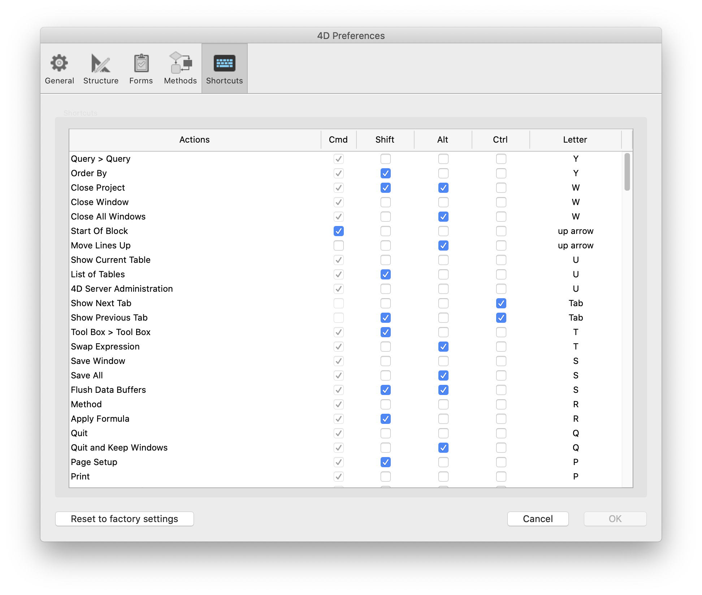

Cette page affiche la liste de tous les raccourcis-clavier utilisés dans le mode Développement de 4D (hormis les raccourcis "système" standard, tels que Ctrl+c/Commande+c pour la commande Copier).

Pour modifier un raccourci, il suffit de sélectionner/désélectionner l’élément à modifier (Majuscule, Option ou touche du clavier) dans la liste des raccourcis. Vous pouvez également double-cliquer sur la ligne d’un raccourci afin de le configurer dans la boîte de dialogue.

A noter que chaque raccourci clavier inclut implicitement la touche **Ctrl** (Windows) ou **Commande** (macOS).

Si vous modifiez cette liste, vos paramètres de raccourcis personnalisés sont stockés dans un fichier _4DShortcutsvXX.xml_, créé au même niveau que [le fichier de préférences utilisateur](overview.md#storage). Ainsi, à chaque mise à jour de 4D, vous conservez vos préférences de raccourcis clavier.
