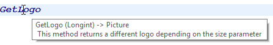

Dans les projets d'application, vous pouvez documenter vos méthodes ainsi que vos classes, formulaires, tables ou champs. La création d'une documentation est particulièrement appropriée pour les projets développés par plusieurs programmeurs et s'inscrit généralement dans les bonnes pratiques en matière de programmation. La documentation peut contenir la description d'un élément ainsi que toute information nécessaire pour comprendre comment l'élément fonctionne dans l'application.

Les éléments de projet suivants peuvent être documentés :

- Méthodes (méthodes base, méthodes composants, méthodes projet, méthodes formulaire, méthodes 4D Mobile et triggers)
- Classes
- Formulaires
- Tables et champs

Vos fichiers de documentation sont écrits dans la syntaxe Markdown (fichiers .md) à l'aide de n'importe quel éditeur prenant en charge le Markdown. Ils sont stockés en tant que fichiers indépendants dans votre dossier Project.

La documentation s'affiche dans la zone d'aperçu (panneau de droite) de l'Explorateur :


It can also be partially exposed as [code editor tips](#viewing-documentation-in-the-code-editor).

## Fichiers documentation

### Nom du fichier de documentation

Les fichiers de documentation ont le même nom que l'élément auquel ils sont rattachés, avec l'extension ".md". For example, the documentation file attached to the `myMethod.4dm` project method will be named `myMethod.md`.

Dans l'Explorateur, 4D affiche automatiquement le fichier de documentation avec le même nom que l'élément sélectionné (voir ci-dessous).

### Architecture des fichiers de documentation

All documentation files are stored in the `Documentation` folder, located at the first level of the package folder.

The `Documentation` folder architecture is the following:

- `Documentation`
  - `Classes`
    - myClass.md
  - `DatabaseMethods`
    - onStartup.md
    - ...
  - `Formulaires`
    - loginDial.md
    - ...
  - `Methods`
    - myMethod.md
    - ...
  - `TableForms`
    - **1**
      - input.md
      - ...
    - ...
  - `Les Triggers`
    - table1.md
    - ...

- Un formulaire projet et sa méthode de formulaire projet partagent le même fichier de documentation pour le formulaire et la méthode.

- Un formulaire table et sa méthode de formulaire table partagent le même fichier de documentation pour le formulaire et la méthode.

> Renommer ou supprimer un élément documenté dans votre projet renomme ou supprime également le fichier Markdown associé à l'élément.

## Documentation dans l'Explorateur

### Visualiser la documentation

Pour afficher la documentation dans la fenêtre de l'Explorateur :

1. Assurez-vous que la zone d'aperçu est affichée.
2. Sélectionnez l'élément documenté dans la liste de l'Explorateur.
3. Click the **Documentation** button located below the preview area.


- If no documentation file was found for the selected element, a **Create** button is displayed (see below).

- Sinon, s'il existe un fichier de documentation pour l'élément sélectionné, le contenu est affiché dans la zone. Le contenu n'est pas directement modifiable dans le volet.

### Modifier le fichier documentation

Vous pouvez créer et/ou modifier un fichier de documentation Markdown à partir de la fenêtre de l'Explorateur pour l'élément sélectionné.

S'il n'y a pas de fichier de documentation pour l'élément sélectionné, vous pouvez :

- click on the **Create** button in the `Documentation` pane or,
- choose the **Edit Documentation...** option in the contextual menu or options menu of the Explorer.


4D crée automatiquement un fichier .md nommé correctement avec un modèle de base à l'emplacement approprié et l'ouvre avec votre éditeur Markdown par défaut.

If a documentation file already exists for the selected element, you can open it with your Markdown editor by choosing the **Edit Documentation...** option in the contextual menu or options menu of the Explorer.

## Visualiser la documentation dans l'éditeur de code

L'éditeur de code 4D affiche une partie de la documentation d'une méthode dans son info-bulle.


If a file named `\<MethodName>.md` exists in the `\<package>/documentation` folder, the code editor displays (by priority):

- Any text entered in an HTML comment tag (`<!-- command documentation -->`) at the top of the markdown file.

- Or, if no html comment tag is used, the first sentence after a `# Description` tag of the markdown file.\
  In this case, the first line contains the **prototype** of the method, automatically generated by the 4D code parser.

:::note

Otherwise, the code editor displays [the block comment at the top of the method code](../code-editor/write-class-method.md#using-help-tips).

:::

## Définition du fichier de documentation

4D utilise un modèle de base pour créer de nouveaux fichiers de documentation. This template suggests specific features that allow you to [display information in the code editor](#viewing-documentation-in-the-code-editor).

However, you can use any [supported Markdown tags](#supported-markdown).

De nouveaux fichiers de documentation sont créés avec les contenus par défaut suivants :


| Ligne                               | Description                                                                                                                                                                                                            |
| ----------------------------------- | ---------------------------------------------------------------------------------------------------------------------------------------------------------------------------------------------------------------------- |
| `<!-- Type here your summary -->`   | Commentaire HTML. Used in priority as the method description in the [code editor tips](#viewing-documentation-in-the-code-editor)                                                                      |
| ## Description                      | Titre de niveau 2 en Markdown. La première phrase qui suit cette balise est utilisée comme description d'une méthode dans les infobulles de l'éditeur de code si le commentaire HTML n'est pas utilisé |
| ## Example                          | Titre de niveau 2, vous pouvez utiliser cette zone pour afficher un exemple de code                                                                                                                                    |
| ` ```4d Type here your example``` ` | Utilisé pour formater des exemples de code 4D (utilise la bibliothèque highlight.js)                                                                                                |

### Prise en charge du markdown

- La balise de titre est prise en charge :

```md
# Title 1
## Title 2
### Title 3
```

- Les balises de style (italique, gras, barré) sont prises en charge :

```md
_italic_
**bold**
**_bold/italic_**
~~strikethrough~~
```

- The code block tag (\`4d ... `) is supported with 4D code highlight:

````md
```4d
	var $txt : Text
	$txt:="Hello world!"  
```
````

- La balise de tableau est prise en charge :

```md
| Parameter | Type   | Description  |
| --------- | ------ | ------------ |
| wpArea    | String |Write pro area|
| toolbar   | String |Toolbar name  |
```

- La balise de lien est prise en charge :

```md
// Case 1
The [documentation](https://doc.4d.com) of the command ....

// Case 2
[4D blog][1]

[1]: https://blog.4d.com
```

- Les balises d'image sont prises en charge :

```md


[](https://blog.4d.com)
```

[](https://blog.4d.com)

> For more information, see the [GitHub Markdown guide](https://guides.github.com/features/mastering-markdown/).

## Exemple

In the `WP SwitchToolbar.md` file, you can write:

````md
<!-- This method returns a different logo depending on the size parameter -->


GetLogo (size) -> logo


| Parameter | Type   | in/out | Description |
| --------- | ------ | ------ | ----------- |
| size      | Longint | in | Logo style selector (1 to 5)  |
| logo      | Picture | out | Selected logo |


## Description

This method returns a logo of a specific size, depending on the value of the *size* parameter.
1 = smallest size, 5 = largest size.

## Example

```4d
C_PICTURE($logo)
C_LONGINT($size)

//Get the largest logo
$logo:=GetLogo(5)
```
````

- Vue de l'explorateur :


- Vue de l'éditeur de code :


