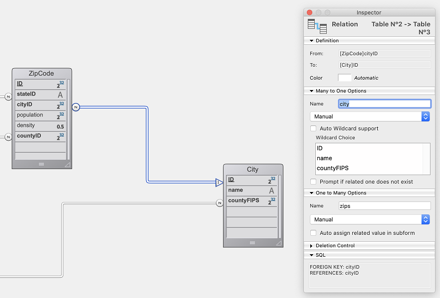

You can call [data model class functions](ORDA/ordaClasses.md) defined for the ORDA Data Model through your REST requests, so that you can benefit from the exposed API of the targeted 4D application.

Les fonctions sont simplement appelées dans les requêtes POST sur l'interface ORDA appropriée, sans (). For example, if you have defined a `getCity()` function in the City dataclass class, you could call it using the following request:

`/rest/City/getCity`

with data in the body of the POST request: `["Aguada"]`

Dans le langage 4D, cet appel équivaut à :

```4d
$city:=ds.City.getCity("Aguada")
```

> Only functions with the `exposed` keyword can be directly called from REST requests. See [Exposed vs non-exposed functions](ORDA/ordaClasses.md#exposed-vs-non-exposed-functions) section.

## Appeler des fonctions

Functions must always be called using REST **POST** requests (a GET request will receive an error).

Les fonctions sont appelées sur l'objet correspondant au datastore du serveur.

| Fonction de classe                                                 | Syntaxe                                                                     |
| ------------------------------------------------------------------ | --------------------------------------------------------------------------- |
| [datastore class](ORDA/ordaClasses.md#datastore-class)             | `/rest/$catalog/DataStoreClassFunction`                                     |
| [dataclass class](ORDA/ordaClasses.md#dataclass-class)             | `/rest/{dataClass}/DataClassClassFunction`                                  |
| [entitySelection class](ORDA/ordaClasses.md#entityselection-class) | `/rest/{dataClass}/EntitySelectionClassFunction`                            |
|                                                                    | `/rest/{dataClass}/EntitySelectionClassFunction/$entityset/entitySetNumber` |
|                                                                    | `/rest/{dataClass}/EntitySelectionClassFunction/$filter`                    |
|                                                                    | `/rest/{dataClass}/EntitySelectionClassFunction/$orderby`                   |
| [entity class](ORDA/ordaClasses.md#entity-class)                   | `/rest/{dataClass}(key)/EntityClassFunction/`                               |

> `/rest/{dataClass}/Function` can be used to call either a dataclass or an entity selection function (`/rest/{dataClass}` returns all entities of the DataClass as an entity selection).\
> The function is searched in the entity selection class first. Si elle n'est pas trouvée, elle est recherchée dans la dataclass. En d'autres termes, si une fonction portant le même nom est définie à la fois dans la classe DataClass et la classe EntitySelection, la fonction de classe de dataclass ne sera jamais exécutée.

> All 4D code called from REST requests **must be thread-safe** if the project runs in compiled mode, because the REST Server always uses preemptive processes in this case (the [_Use preemptive process_ setting value](../WebServer/preemptiveWeb.md#enabling-the-preemptive-mode-for-the-web-server) is ignored by the REST Server).

## Paramètres

Vous pouvez envoyer des paramètres aux fonctions définies dans les classes utilisateurs ORDA. On the server side, they will be received in the [declared parameters](../Concepts/parameters.md#declaring-parameters) of the class functions.

Les règles suivantes s'appliquent :

- Parameters must be passed in the **body of the POST request**
- Les paramètres doivent être inclus dans une collection (format JSON)
- Tous les types de données scalaires pris en charge dans les collections JSON peuvent être passés en tant que paramètres.
- La sélection d'entité et l'entité peuvent être passées en tant que paramètres. L'objet JSON doit contenir des attributs spécifiques utilisés par le serveur REST pour affecter des données aux objets ORDA correspondants : __DATACLASS, __ENTITY, __ENTITIES, __DATASET.

See [this example](#using-an-entity-to-be-created-on-the-server) and [this example](#receiving-an-entity-selection-as-parameter).

### Paramètre de valeur scalaire

Le(s) paramètre(s) doivent simplement être incluse dans une collection définie dans le corps. For example, with a  dataclass function `getCities()` receiving text parameters:
`/rest/City/getCities`

**Parameters in body:** ["Aguada","Paris"]

Tous les types de données JSON sont pris en charge dans les paramètres, y compris les pointeurs JSON. Les dates peuvent être passées sous forme de chaînes au format de date ISO 8601 (par exemple, "2020-08-22T22:00:000Z").

### Paramètre d'entité

Entities passed in parameters are referenced on the server through their key (_i.e._ __KEY property). Si le paramètre clé est omis dans une requête, une nouvelle entité est chargée en mémoire du serveur.
Vous pouvez également transmettre des valeurs pour tous les attributs de l'entité. Ces valeurs seront automatiquement utilisées pour l'entité traitée sur le serveur.

> Si la requête envoie des valeurs d'attribut modifiées pour une entité existante sur le serveur, la fonction de modèle de données ORDA appelée sera automatiquement exécutée sur le serveur avec des valeurs modifiées. Cette fonctionnalité vous permet, par exemple, de vérifier le résultat d'une opération sur une entité, après avoir appliqué toutes les règles métier, depuis l'application cliente. Vous pouvez alors décider de sauvegarder ou non l'entité sur le serveur.

| Propriétés                                            | Type                                                                 | Description                                                                 |
| ----------------------------------------------------- | -------------------------------------------------------------------- | --------------------------------------------------------------------------- |
| Attributs de l'entité                                 | mixte                                                                | Optionnelle - Valeurs à modifier                                            |
| __DATACLASS | String                                                               | Obligatoire - Indique la Dataclass de l'entité                              |
| __ENTITY    | Boolean                                                              | Obligatoire - Vrai pour indiquer au serveur que le paramètre est une entité |
| __KEY       | mixte (type identique à celui de la clé primaire) | Optionnel - clé primaire de l'entité                                        |

- Si __KEY n'est pas fourni, une nouvelle entité est créée sur le serveur avec les attributs donnés.
- Si __KEY est fourni, l'entité correspondant à _KEY est chargée sur le serveur avec les attributs donnés

See examples for [creating](#creating-an-entity) or [updating](#updating-an-entity) entities.

#### Paramètre d'entité associé

Same properties as for an [entity parameter](#entity-parameter). De plus, l'entité associée doit exister et est référencée par __KEY, qui contient sa clé primaire.

See examples for [creating](#creating-an-entity-with-a-related-entity) or [updating](#updating-an-entity-with-a-related-entity) entities with related entities.

### Paramètre d'entity selection

The entity selection must have been defined beforehand using [$method=entityset]($method.md#methodentityset).

> Si la requête envoie une entity selection modifiée au serveur, la fonction de modèle de données ORDA appelée sera automatiquement exécutée sur le serveur avec l'entity selection modifiée.

| Propriétés                                           | Type    | Description                                                                             |
| ---------------------------------------------------- | ------- | --------------------------------------------------------------------------------------- |
| Attributs de l'entité                                | mixte   | Optionnelle - Valeurs à modifier                                                        |
| __DATASET  | String  | Obligatoire - entitySetID (UUID) de la sélection d'entité            |
| __ENTITIES | Boolean | Obligatoire - Vrai pour indiquer au serveur que le paramètre est une sélection d'entité |

See example for [receiving an entity selection](#receiving-an-entity-selection-as-parameter).

## Exemples de requêtes

Cette base de données est exposée comme un datastore distant sur localhost (port 8111) :



### Utiliser une fonction de classe de datastore

The US_Cities `DataStore` class provides an API:

```
// DataStore class

Class extends DataStoreImplementation

exposed Function getName() : Text
    return "US cities and zip codes manager"
```

Vous pouvez lancer cette requête :

**POST** `127.0.0.1:8111/rest/$catalog/getName`

#### Résultat

```
{
"result": "US cities and zip codes manager"
}
```

### Utiliser une fonction de classe de dataclass

The Dataclass class `City` provides an API that returns a city entity from a name passed in parameter:

```
// City class

Class extends DataClass

exposed Function getCity($city : Text ) : cs.CityEntity
	return This.query("name = :1";$city).first()
```

Vous pouvez lancer cette requête :

**POST** `127.0.0.1:8111/rest/City/getCity`

Requête : ["Paris"]

#### Résultat

Le résultat est une entité :

```
{
    "__entityModel": "City",
    "__DATACLASS": "City",
    "__KEY": "1",
    "__TIMESTAMP": "2020-03-09T08:03:19.923Z",
    "__STAMP": 1,
    "ID": 1,
    "name": "Aguada",
    "countyFIPS": 72003,
    "county": {
        "__deferred": {
            "uri": "/rest/County(72003)",
            "__KEY": "72003"
        }
    },
    "zips": {
        "__deferred": {
            "uri": "/rest/City(1)/zips?$expand=zips"
        }
    }
}
```

### Utiliser une fonction de classe d'une entité

The Entity class `CityEntity` provides an API:

```
// CityEntity class

Class extends Entity

exposed Function getPopulation()
    return This.zips.sum("population")
```

Vous pouvez lancer cette requête :

**POST** `127.0.0.1:8111/rest/City(2)/getPopulation`

#### Résultat

```
{
    "result": 48814
}
```

### Utiliser une fonction de classe d'une entity selection

The EntitySelection class `CitySelection` provides an API:

```
// CitySelection class

Class extends EntitySelection

exposed Function getPopulation()
    return This.zips.sum("population")
```

Vous pouvez lancer cette requête :

**POST** `127.0.0.1:8111/rest/City/getPopulation/?$filter="ID<3"`

#### Résultat

```
{
    "result": 87256
}
```

### Utiliser une fonction de classe de sélection d'entité et un ensemble d'entité

The `StudentsSelection` class has a `getAgeAverage` function:

```
// StudentsSelection Class

Class extends EntitySelection

exposed Function getAgeAverage : Integer
	var $sum : Integer
	var $s : Object

	$sum:=0
	For each ($s;This)
	    $sum:=$sum+$s.age()
	End for each
	return $sum/This.length
```

Une fois que vous avez créé un ensemble d'entité, vous pouvez lancer cette requête :

**POST** `127.0.0.1:8044/rest/Students/getAgeAverage/$entityset/17E83633FFB54ECDBF947E5C620BB532`

#### Résultat

```
{
    "result": 34
}
```

### Utiliser une fonction de classe de sélection d'entité et un "orderBy"

The `StudentsSelection` class has a `getLastSummary` function:

```
// StudentsSelection Class


Class extends EntitySelection

exposed Function getLastSummary : Text
	var $last : Object

	$last:=This.last()
	return =$last.firstname+" - "+$last.lastname+" is ... "+String($last.age())
```

Vous pouvez lancer cette requête :

**POST** `127.0.0.1:8044/rest/Students/getLastSummary/$entityset/?$filter="lastname=b@"&$orderby="lastname"`

#### Résultat

```
{
    "result": "Wilbert - Bull is ... 21"
}
```

### Utiliser une entité à créer sur le serveur

The Dataclass class `Students` has the function `pushData()` receiving an entity containing data from the client. The `checkData()` method runs some controls. Si elles sont valides, l'entité est sauvegardée et retournée.

```
// Students Class

Class extends DataClass

exposed Function pushData($entity : Object) : Object
	var $status : Object

	$status:=checkData($entity) // $status is an object with a success boolean property

	If ($status.success)
	    $status:=$entity.save()
 	   If ($status.success)
 	       return $entity
  	  End if
	End if

	return $status

```

Lancez cette requête :

**POST** `http://127.0.0.1:8044/rest/Students/pushData`

Corps de la requête :

```
[{
"__DATACLASS":"Students",
"__ENTITY":true,
"firstname":"Ann",
"lastname":"Brown"
}]
```

Since no `__KEY` is given, a new Students entity is loaded on the server **with the attributes received from the client**. Because the `pushData()` function runs a `save()` action, the new entity is created.

#### Résultat

```
{
    "__entityModel": "Students",
    "__DATACLASS": "Students",
    "__KEY": "55",
    "__TIMESTAMP": "2020-06-16T10:54:41.805Z",
    "__STAMP": 1,
    "ID": 55,
    "firstname": "Ann",
    "lastname": "BROWN",
    "schoolID": null,
    "school": null
}
```

### Utiliser une entité à mettre à jour sur le serveur

Description semblable à la précédente, avec l'attribut _KEY

Lancez cette requête :

**POST:**`http://127.0.0.1:8044/rest/Students/pushData`

Corps de la requête :

```
[{
"__DATACLASS":"Students",
"__ENTITY":true,
"lastname":"Brownie",
"__KEY":55
}]
```

Since `__KEY` is given, the Students entity with primary key 55 is loaded **with the lastname value received from the client**. Because the function runs a `save()` action, the entity is updated.

#### Résultat

```
{
    "__entityModel": "Students",
    "__DATACLASS": "Students",
    "__KEY": "55",
    "__TIMESTAMP": "2020-06-16T11:10:21.679Z",
    "__STAMP": 3,
    "ID": 55,
    "firstname": "Ann",
    "lastname": "BROWNIE",
    "schoolID": null,
    "school": null
}
```

### Créer une entité avec une entité liée

Dans cet exemple, nous créons une nouvelle entité Students avec l'entité Schools ayant la clé primaire 2.

Lancez cette requête :

**POST:**`http://127.0.0.1:8044/rest/Students/pushData`

Corps de la requête :

```
[{
"__DATACLASS":"Students",
"__ENTITY":true,
"firstname":"John",
"lastname":"Smith",
"school":{"__KEY":2}
}]
```

#### Résultat

```
{
    "__entityModel": "Students",
    "__DATACLASS": "Students",
    "__KEY": "56",
    "__TIMESTAMP": "2020-06-16T11:16:47.601Z",
    "__STAMP": 1,
    "ID": 56,
    "firstname": "John",
    "lastname": "SMITH",
    "schoolID": 2,
       "school": {
        "__deferred": {
            "uri": "/rest/Schools(2)",
            "__KEY": "2"
        }
    }
}
```

### Mettre à jour une entité avec une entité liée

Dans cet exemple, nous associons une école existante à l'entité Students. The `StudentsEntity` class has an API:

```
// StudentsEntity class

Class extends Entity

exposed Function putToSchool()
	var $1, $school , $0, $status : Object

		//$1 is a Schools entity
	$school:=$1
		//Associate the related entity school to the current Students entity
	This.school:=$school

	$status:=This.save()

	$0:=$status
```

You run this request, called on a Students entity :
**POST** `http://127.0.0.1:8044/rest/Students(1)/putToSchool`
Body of the request:

```
[{
"__DATACLASS":"Schools",
"__ENTITY":true,
"__KEY":2
}]
```

#### Résultat

```
{
    "result": {
        "success": true
    }
}
```

### Recevoir une sélection d'entité comme paramètre

In the `Students` Dataclass class, the `setFinalExam()` function updates a received entity selection ($1). It actually updates the _finalExam_ attribute with the received value ($2). Elle retourne les clés primaires des entités mises à jour.

```
// Students class

Class extends DataClass

exposed Function setFinalExam()

    var $1, $es, $student, $status : Object
    var $2, $examResult : Text

    var $keys, $0 : Collection

      //Entity selection
    $es:=$1

    $examResult:=$2

    $keys:=New collection()

      //Loop on the entity selection
    For each ($student;$es)
        $student.finalExam:=$examResult
        $status:=$student.save()
        If ($status.success)
            $keys.push($student.ID)
        End if
    End for each

    $0:=$keys
```

Un ensemble d'entité est d'abord créé avec cette requête :

`http://127.0.0.1:8044/rest/Students/?$filter="ID<3"&$method=entityset`

Vous pouvez ensuite exécuter cette requête :

**POST** `http://127.0.0.1:8044/rest/Students/setFinalExam`

Corps de la requête :

```
[
{
"__ENTITIES":true,
"__DATASET":"9B9C053A111E4A288E9C1E48965FE671"
},
"Passed"
]

```

#### Résultat

Les entités ayant les clés primaires sont 1 et 2 ont été mises à jour.

```
{
    "result": [
        1,
        2
    ]
}
```

### Utiliser une entity selection mise à jour sur le client

Using the `getAgeAverage()` function [defined above](#using-an-entityselection-class-function-and-an-entityset).

```4d
var $remoteDS, $newStudent, $students : Object
var $ageAverage : Integer

$remoteDS:=Open datastore(New object("hostname";"127.0.0.1:8044");"students")

// $newStudent is a student entity to procees
$newStudent:=...
$students:=$remoteDS.Students.query("school.name = :1";"Math school")
// We add an entity to the $students entity selection on the client
$students.add($newStudent)

// We call a function on the StudentsSelection class returning the age average of the students in the entity selection
// The function is executed on the server on the updated $students entity selection which included the student added from the client
$ageAverage:=$students.getAgeAverage()
```
