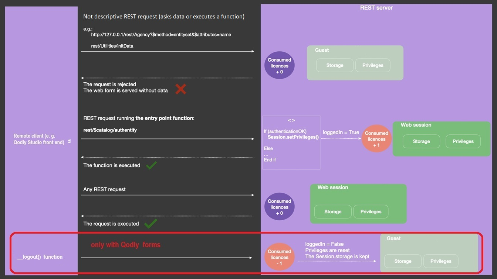

Lorsque les [sessions évolutives sont activées](WebServer/sessions.md#activer-les-sessions) (recommandé), les requêtes REST peuvent créer et utiliser des [sessions utilisateur web](WebServer/sessions.md), offrant des fonctionnalités supplémentaires telles que la gestion de requêtes multiples, le partage de données entre les process web clients et le contrôle des privilèges utilisateur.

Lorsqu'une session utilisateur web est ouverte, vous pouvez la gérer via l'objet `Session` et l'[API de session](API/SessionClass.md). Les requêtes REST ultérieures réutilisent le même cookie de session.

> - On 4D Server, opening a REST session might require that a free 4D client license is available, depending on the [user login mode](#user-login-modes).<br/>
> - Sur 4D mono-utilisateur, vous pouvez ouvrir jusqu'à trois sessions REST à des fins de test.

## User login modes

The user login mode allows you to control how REST requests acquire 4D Client licenses. You can choose between two user login modes: "default", or "force login".

You set the user login mode through the `forceLogin` property in the [`roles.json` file](../ORDA/privileges.md#rolesjson-file):

- the **default mode** is used if the "forceLogin" property is missing or set to "false",
- the **force login** mode is used if the "forceLogin" property is set to "true".

:::caution

If you modify this property, the server must be restarted to take the change into account.

:::

:::note

Dans Qodly Studio for 4D, le mode peut être défini en utilisant l'option [**Force login**](../WebServer/qodly-studio.md#force-login) dans l'onglet Privileges.

:::

### Default mode

In the default mode, any REST request is processed in a web user session that automatically consumes a license (the web user session is created if it does not already exist). You can use this simple mode if you don't need to control how many licenses are retained on the server.
When the default mode is enabled, you can authenticate users through the `On REST Authentication` database method (see below).

### Mode Force login

In "force login" mode, license usage is disconnected from web user sessions. Une licence est requise uniquement lorsque la fonction [`Session.setPrivileges()`](../API/SessionClass.md#setprivileges) est exécutée, ce qui vous permet de contrôler le nombre de licences utilisées.

[Descriptive REST requests](#descriptive-rest-requests) are always processed by the server, even if no web user session using a license is opened. Dans ce cas, elles sont traitées à travers des sessions "guest".

Toutes les autres requêtes REST (manipulant des données ou exécutant une fonction) ne seront traitées que si elles sont exécutées dans une session web avec les privilèges appropriés, sinon elles retournent une erreur. Pour attribuer des privilèges à une session web, vous devez exécuter la fonction [`Session.setPrivileges()`](../API/SessionClass.md#setprivileges) pour la session. L'exécution de cette fonction déclenche la consommation de la licence 4D.

This mode allows you to implement the following login sequence:

1. Lors de la première requête REST (pour un appel de formulaire web par exemple), une session utilisateur web "guest" est créée. It has no privileges, no rights to execute requests other than descriptive requests, no license consumption.
2. You call your exposed [datastore class function](../ORDA/ordaClasses.md#datastore-class) named [`authentify()`](#function-authentify) (created beforehand), in which you check the user credentials and call [`Session.setPrivileges()`](../API/SessionClass.md#setprivileges) with appropriate privileges.
3. La requête `/rest/$catalog/authentify` est envoyée au serveur avec les informations d'identification de l'utilisateur. This step only requires a basic login form that do not access data; it can be a Qodly form (called via the `/rest/$getWebForm` request).
4. Si l'utilisateur est authentifié avec succès, une licence 4D est consommée sur le serveur et toutes les requêtes REST sont acceptées.



### Requêtes REST descriptives

Les requêtes REST descriptives peuvent être traitées dans des sessions d'utilisateurs web qui ne nécessitent pas de licences (sessions "guest"). Ces requêtes sont :

- requêtes [`/rest/$catalog`]($catalog.md) (par exemple `/rest/$catalog/$all`) - accès aux dataclass disponibles
- `/rest/$catalog/authentify` - la fonction datastore utilisée pour connecter l'utilisateur
- `/rest/$getWebForm` - la génération d'une page Qodly


### `Function authentify`

#### Syntaxe

```4d
exposed Function authentify({params : type}) {-> result : type}
	// code
```

La fonction `authentify()` doit être implémentée dans la [classe DataStore](../ORDA/ordaClasses.md#datastore-class) du projet et doit être appelée par une requête REST.

Cette fonction est le seul point d'entrée disponible à partir des sessions guest REST lorsque le mode "force login" est activé : tout autre appel de fonction ou d'accès aux données est rejeté jusqu'à ce que la session acquière les privilèges appropriés.

:::note

La fonction `authentify()` peut toujours être exécutée par une session guest REST, quelle que soit la configuration du fichier [`roles.json`](../ORDA/privileges.md#rolesjson-file).

:::

La fonction peut recevoir toute information d'authentification ou contextuelle en tant que [paramètre(s)](ClassFunctions.md#parameters) et peut renvoyer n'importe quelle valeur. Étant donné que cette fonction ne peut être appelée que depuis une requête REST, les paramètres doivent être transmis dans le body de la requête POST.

Cette fonction doit contenir deux parties :

- un code pour identifier et authentifier l'expéditeur de la demande REST,
- si l'authentification réussit, un appel à [`Session.setPrivileges()`](../API/SessionClass.md#setprivileges) qui attribue les privilèges appropriés à la session.

Si la fonction ne fait pas appel à [`Session.setPrivileges()`](../API/SessionClass.md#setprivileges), aucun privilège n'est attribué, aucune licence n'est consommée et les requêtes REST non descriptives ultérieures sont rejetées.

#### Exemple

Vous voulez simplement savoir quels utilisateurs ont ouvert une session Web sur le serveur. Vous avez créé la fonction `authentify()` suivante dans la classe datastore :

```4d
exposed Function authentify($credentials : Object) : Text

var $users : cs.UsersSelection
var $user : cs.UsersEntity

$users:=ds.Users.query("name = :1"; $credentials.name)
$user:=$users.first()

If ($user#Null) //l'utilisateur est connu
	If (Verify password hash($credentials.password; $user.password))
		Session.setPrivileges("vip")
	Else

		return "Wrong password"
	End if
Else
        return "Wrong user"
End if
```

Pour appeler la fonction `authentify()` :

**POST** `127.0.0.1:8111/rest/$catalog/authentify`

Body de la requête :

```json
[{"name":"Henry",
"password":"123"}]
```

## Using `On REST Authentication`

In default login mode (i.e. the "force login" mode is disabled), you can log in a user to your application by calling [`$directory/login`]($directory.md#directorylogin) in a POST request including the user's name and password in the header. This request calls the `On REST Authentication` database method (if it exists), where you can check the user's credentials (see example below).

If the `On REST Authentication` database method has not been defined, a `guest` session is opened.

### Exemple

In this example, the user enters their email and password in an html page that requests [`$directory/login`]($directory.md#directorylogin) in a POST (it is recommended to use an HTTPS connection to send the html page). The `On REST Authentication` database method is called to validate the credentials and to set the session.

The HTML login page:


```html
<html><body bgcolor="#ffffff">

<div id="demo">
	<FORM name="myForm">
Email: <INPUT TYPE=TEXT NAME=userId VALUE=""><br/>
Password: <INPUT TYPE=TEXT NAME=password VALUE=""><br/>
<button type="button" onclick="onClick()">
Login
</button>
<div id="authenticationFailed" style="visibility:hidden;">Authentication failed</div>
</FORM>
</div>

<script>
function sendData(data) {
  var XHR = new XMLHttpRequest();

  XHR.onreadystatechange = function() {
    if (this.status == 200) {      
      window.location = "authenticationOK.shtml";
      }
      else {
      document.getElementById("authenticationFailed").style.visibility = "visible";
      }
  };

  XHR.open('POST', 'http://127.0.0.1:8044/rest/$directory/login'); //rest server address

  XHR.setRequestHeader('username-4D', data.userId);
  XHR.setRequestHeader('password-4D', data.password);
  XHR.setRequestHeader('session-4D-length', data.timeout);

  XHR.send();
};
function onClick()
{
sendData({userId:document.forms['myForm'].elements['userId'].value , password:document.forms['myForm'].elements['password'].value , timeout:120})
}
</script></body></html>

```

When the login page is sent to the server, the `On REST Authentication` database method is called:

```4d
	//On REST Authentication

#DECLARE($userId : Text; $password : Text) -> $Accepted : Boolean
var $sales : cs.SalesPersonsEntity

$Accepted:=False

	//A '/rest' URL has been called with headers username-4D and password-4D
If ($userId#"")
    $sales:=ds.SalesPersons.query("email = :1"; $userId).first()
    If ($sales#Null)
        If (Verify password hash($password; $sales.password))
            fillSession($sales)
            $Accepted:=True
        End if
    End if
End if
```

> As soon as it has been called and returned `True`, the `On REST Authentication` database method is no longer called in the session.

The `fillSession` project method initializes the user session, for example:

```4d
#DECLARE($sales : cs.SalesPersonsEntity)
var $info : Object

$info:=New object()
$info.userName:=$sales.firstname+" "+$sales.lastname

Session.setPrivileges($info)

Use (Session.storage)
    If (Session.storage.myTop3=Null)
        Session.storage.myTop3:=$sales.customers.orderBy("totalPurchase desc").slice(0; 3)
    End if
End use
```
