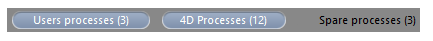

The **Processes** page lists all the processes underway.

The "Processes" button indicates, in parentheses, the total number of processes running in the server (this number does not take into account any display filters applied to the window nor the state of the **Display processes by groups** option).

Vous pouvez modifier l’ordre des colonnes par simple glisser-déposer de la zone d’en-tête des colonnes. Vous pouvez également trier la liste sur les valeurs d’une colonne en cliquant sur son en-tête.

Like the Users page, this page contains a dynamic [search/filtering area](users.md#searchfiltering-area) that can be used to reduce the number of rows displayed in the list to those that correspond to the text entered in the search area. La recherche/le filtrage est effectué(e) dans les colonnes Session et Nom de process.

Vous disposez également de trois boutons-raccourcis permettant de filtrer par famille les process affichés dans la fenêtre :

- **Users processes**: Processes generated by and for the user sessions. Ces process sont précédés d’une icône en forme de personnage.
- **4D Processes**: Processes generated by the 4D Server engine. Ces process sont précédés d’une icône en forme de roue crantée.
- **Spare processes**: Processes that are inactive but kept temporarily and that can be reused at any time. Ce mécanisme permet d’optimiser la réactivité de 4D Server. Ces process sont précédés d’une icône grisée en forme de personnage.

The **Display processes by groups** option lets you group together the internal processes of 4D Server as well as the client processes, for better readability. Lorsque vous cochez cette option :

- the "twinned" 4D client processes (main 4D client process and 4D client base process, see [Process Type](#process-type)) are grouped as one,
- le groupe "Gestionnaires de tâches" est créé ; il inclut les process internes dédiés à la répartition des tâches (Shared balancer, Net session manager, Exclusive pool worker),
- le groupe "Gestionnaires clients" est créé ; il inclut les différents process internes clients.

La zone inférieure de la fenêtre permet d’afficher la représentation graphique de l’activité du ou des process sélectionné(s).

> You can select several rows by holding down the **Shift** key for an adjacent selection or **Ctrl** (Windows) / **Command** (macOS) for a non-adjacent selection.

L’activité du process est le pourcentage du temps que 4D Server a consacré à ce process (ratio). La fenêtre fournit les informations suivantes pour chaque process :

- Type de process (cf. ci-dessous),
- Session:
  - Process 4D - vide,
  - Process utilisateur - nom de l'utilisateur 4D,
  - Process web - chemin URL,
- Nom du process,
- Number of the process (as returned by the [`New process`](https://doc.4d.com/4dv19/help/command/en/page317.html) command for example). Le numéro du process est le numéro attribué sur le serveur. Dans le cas d’un process global, ce numéro peut être différent de celui attribué sur le poste client.
- Etat courant du process,
- Temps (en secondes) d'exécution du process depuis sa création,
- Pourcentage du temps que 4D Server a consacré à ce process (ratio).

## Type du process

Chaque process est identifié par une icône et un type. La couleur et la forme de l’icône indiquent la famille du process :

| icône                                      | type                                                                                                                                                                                                                   |
| ------------------------------------------ | ---------------------------------------------------------------------------------------------------------------------------------------------------------------------------------------------------------------------- |
|   | Serveur d’application                                                                                                                                                                                                  |
|   | Serveur SQL                                                                                                                                                                                                            |
|   | Serveur DB4D (moteur de base de données)                                                                                                                                                            |
|   | Serveur Web                                                                                                                                                                                                            |
|   | Serveur SOAP                                                                                                                                                                                                           |
|   | Process client 4D protégé (process développement d’un 4D connecté)                                                                                                                                  |
|   | Main process of a connected 4D client or process created with `New process` on a connected 4D client (Collaborative process, equivalent on the server of the process created on the client machine) |
|   | Process de base client 4D (process parallèle à un process client 4D. Process préemptif chargé de contrôler le process client 4D principal correspondant)                            |
|   | Process en attente (ancien ou futur "Process client 4D base de données")                                                                                                                            |
|  | Worker serveur SQL                                                                                                                                                                                                     |
|  | Worker serveur HTTP                                                                                                                                                                                                    |
|  | Procédure stockée (process coopératif lancé par un 4D connecté et tournant sur le serveur)                                                                                                          |
|  | Méthode Web (lancée par un 4DACTION par exemple)                                                                                                                                                    |
|  | Méthode Web (process préemptif)                                                                                                                                                                     |
|  | Méthode SOAP (lancée par un Web Service)                                                                                                                                                            |
|  | Méthode SOAP (process préemptif)                                                                                                                                                                    |
|  | Logger                                                                                                                                                                                                                 |
|  | Listener connexion TCP                                                                                                                                                                                                 |
|  | Manager session TCP                                                                                                                                                                                                    |
|  | Autre process                                                                                                                                                                                                          |
|  | Process worker (coopératif)                                                                                                                                                                         |
|  | Process 4D client (préemptif)                                                                                                                                                                       |
|  | Procédure stockée (process préemptif)                                                                                                                                                               |
|  | Process worker (préemptif)                                                                                                                                                                          |

> Each main 4D client process and its "twinned" 4D client base process are grouped together when the **Display processes by groups** option is checked.

## Boutons d’administration

La page comporte cinq boutons de commande permettant d’agir sur le ou les process sélectionné(s). A noter que vous ne pouvez agir que sur les process utilisateurs.

- **Abort Process**: can be used to abort the selected process(es). Lorsque vous cliquez sur ce bouton, une boîte de dialogue d’alerte apparaît, vous permettant de confirmer ou d’annuler l’opération.

> You can also abort the selected process(es) directly without displaying the confirmation dialog box by holding down the **Alt** key while clicking on this button, or by using the [`ABORT PROCESS BY ID`](https://doc.4d.com/4dv19/help/command/en/page1634.html) command.

- **Pause Process**: can be used to pause the selected process(es).
- **Activate Process**: can be used to reactivate the selected process(es). Les process doivent avoir été auparavant endormis (via le bouton précédent ou par programmation) sinon le bouton est sans effet.
- **Debug Process**: can be used to open on the server machine one or more debugger windows for the selected process(es). Lorsque vous cliquez sur ce bouton, une boîte de dialogue d’alerte apparaît, vous permettant de confirmer ou d’annuler l’opération. A noter que la fenêtre du débogueur ne s’affiche que lorsque du code 4D est effectivement exécuté sur le poste serveur (par exemple dans le cadre d’un trigger ou de l’exécution d’une méthode ayant l’attribut "Exécuter sur serveur").

> You can also debug a process directly without displaying the confirmation dialog box by holding down the **Alt** key while clicking on this button.

- **Watch users**: used to display, on the [Users page](users.md), all the processes of the selected user(s). Le bouton est actif lorsqu’un process utilisateur au moins est sélectionné.
