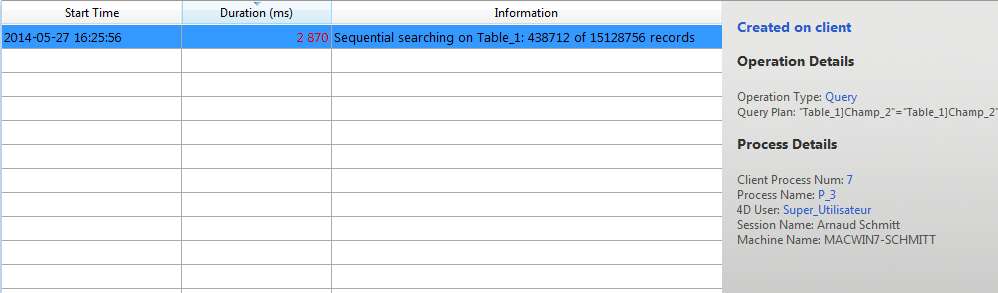

La page Moniteur temps réel permet de surveiller en temps réel le déroulement des opérations "longues" effectuées par l’application. Ces opérations sont par exemple les recherches séquentielles, l’exécution de formules, etc.

> Cette page est disponible dans la fenêtre d’administration du poste serveur et également depuis un poste 4D distant. Dans le cas d’un poste distant, la page affiche les données des opérations effectuées sur le poste serveur.

Chaque opération longue sur les données entraîne l’ajout d’une ligne. This line automatically disappears when the operation is complete (you can check the **Display operations at least 5 seconds** option to keep quick operations on screen for 5 seconds, see below).

Les informations suivantes sont fournies pour chaque ligne :

- **Start Time**: starting time of operation in the format: "dd/mm/yyyy - hh:mm:ss"
- **Duration** (ms): duration in milliseconds of operation in progress
- **Information**: title of operation.
- **Details**: this area displays detailed information which will vary according to the type of operation selected. En particulier :
  - **Created on**: indidates whether the operation results from a client action (Created on client) or if it was started explicitly on the server by means of a stored procedure or the "Execute on server" option (Created on server).
  - **Operation Details**: Operation type and (for query operations) query plan.
  - **Sub-operations** (if any): Dependent operations of the selected operation (e.g. deleting related records before a parent record).
  - **Process Details**: Additional information concerning the table, field, process or client, depending on the type of operation

> Real-time monitoring page uses the [`GET ACTIVITY SNAPSHOT`](https://doc.4d.com/4dv19/help/command/en/page1277.html) command internally. More information can be found in this command description.

La page est active et mise à jour en permanence dès qu’elle est affichée. Il est à noter que son fonctionnement peut ralentir sensiblement l’exécution de l’application. Il est possible de suspendre la mise à jour de la page d’une des manières suivantes :

- clicking on the **Pause** button,
- en cliquant dans la liste,
- en appuyant sur la barre d’espace.

When you pause the page, a "PAUSED" message appears and the button label changes to **Resume**.
Il est possible de reprendre l’observation des opérations en effectuant la même action que pour la mise en pause.

## Mode avancé

La page MTR peut afficher des informations supplémentaires, si nécessaire, pour chaque opération listée.

To access the advanced mode for an operation, press **Shift** and select the desired operation. All available information is then displayed in the "Process Details" area without any filtering (as returned by the `GET ACTIVITY SNAPSHOT` command). Les informations disponibles dépendent de l'opération sélectionnée.

Voici un exemple d'information affichée en mode standard :

In advanced mode (**Shift+Click** on the operation), additional information is displayed:

## Bouton Instantané

The **Snapshot** button allows you to copy to the clipboard all the operations displayed in the RTM panel, as well as their related details (process and sub-operation info):

## Afficher opérations au moins 5 secondes

If you check the **Display operations at least 5 seconds** option, any listed operation will be displayed on the page for at least five seconds, even after its execution is finished. Les opérations terminées restant affichées sont grisées dans la liste. Cette fonction est utile lorsque vous voulez observer des opérations dont l'exécution est très rapide.
