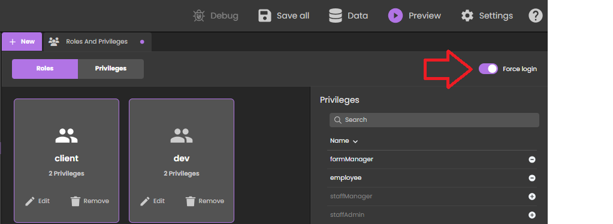

:::caution Developer Preview

Qodly Studio for 4D is currently in the **Developer Preview** phase. It should not be used in production.

:::

**Qodly Studio** is an interface builder for web applications. It provides developers with a graphical form editor to design applications running in web browsers or smartphones. It supports natively the [ORDA objects](../ORDA/overview.md).

You can use Qodly Studio directly from your **4D environment** to build modern and sophisticated interfaces that you can easily integrate to your existing 4D projects and deploy **on premise**.

Qodly Studio can also be used in the [**Qodly Cloud platform**](https://qodly.com), dedicated to the development of web business applications.

With Qodly Studio, you will discover a totally new web UI, get familiar with the concept of datasources, and learn how to:

- create Qodly forms by placing components on a page
- map components to data
- trigger 4D code by configuring events
- and much more.

:::info

The development with Qodly Studio for 4D requires at least a [4D Silver Partner license](https://us.4d.com/4d-partner-program). Qodly Studio options and menu items won't appear if the license is not activated.

:::

## Configuration

### Conditions requises

#### Browser

Qodly Studio supports the following web browsers:

- Chrome
- Edge
- FireFox

The recommended resolution is 1920x1080.

#### 4D application

- Development: 4D v20 R2 or higher
- Deployment: 4D Server v20 R2 or higher
- Qodly Studio only works with 4D projects (binary databases are not supported).

### Enabling access to Qodly Studio

By default, access to Qodly Studio is not granted.

Qodly Studio is served by the [WebAdmin web server](../Admin/webAdmin.md) and displays data from 4D projects handled by the [4D web server](webServer.md).

To enable access to Qodly Studio, you must explicitly allow it at two levels:

- at 4D level (4D or 4D Server)
- at project level

If one of the two levels (or both) are not enabled, access to Qodly Studio is denied (a 403 page is returned).

#### At 4D level

As a first security level, you need to [allow access to Qodly Studio on the WebAdmin web server](../Admin/webAdmin.md#enable-access-to-qodly-studio). This setting applies to the 4D application (4D or 4D Server) on the host machine. All projects opened with that 4D application take this setting into account.

Keep this option unchecked if you want to make sure no access to Qodly Studio is allowed on the application. Check this option to make it possible to access Qodly Studio. However, you still need to enable it at every project level.

Additionally, you can [configure the WebAdmin web server's HTTP/HTTPS port used](../Admin/webAdmin.md#accept-http-connections-on-localhost).

:::note

After any change to these settings, you must [restart the WebAdmin web server](../Admin/webAdmin.md#start-and-stop) for the new configuration to be effective.

:::

#### At project level

After you have enabled access to Qodly Studio at the 4D level, you need to explicitly designate every project that can be accessed. The **Enable access to Qodly Studio** option must be enabled on the [Web Features page of the 4D application's Settings](../settings/web.md#enable-access-to-qodly-studio).

Keep in mind that [user settings](../settings/overview.md) can be defined at several levels, and that priorities apply.

### Activating authentication

Authentication on the WebAdmin web server is granted using an access key. For more details, see [Access key](../Admin/webAdmin.md#access-key).

### Project management

In accordance with the management of 4D projects, only the following usages are supported:

- development with Qodly Studio must be done using **4D** (single-user).
- deployment of 4D applications powered with Qodly forms must be done using **4D Server**.

## Opening Qodly Studio

The Qodly Studio page is available when the [WebAdmin web server is running](../Admin/webAdmin.md#start-and-stop) and authentication is activated (see above).

There are two ways to access Qodly Studio:

- from your 4D single-user application, go to **Design** > **Qodly Studio...**.
  If the WebAdmin web server is already running, depending on its configuration, your default browser opens at `IPaddress:HTTPPort/studio` or `IPaddress:HTTPSPort/studio`. Otherwise, you will be prompted if you want to start the WebAdmin web server first.

- on a browser, with the WebAdmin web server running (launched from 4D or 4D Server), enter the following address:

`IPaddress:HTTPPort/studio`

ou :

`IPaddress:HTTPSPort/studio`

For example, after launching a local web server on port 7080, type this address in your browser:

`localhost:7080/studio`

You will then be prompted to enter the [access key](../Admin/webAdmin.md#access-key) to access Qodly Studio.

## Using Qodly Studio

### Documentation

The official Qodly Studio documentation is available on the [Qodly documentation website](https://developer.qodly.com/docs/studio/overview).

You can rely on this documentation and its associated resources for developing web applications powered by Qodly forms. However, depending on implementation stage, 4D developers will either use Qodly Studio or 4D IDE (see [Feature comparison](#feature-comparison)).

Code examples are provided in [QodlyScript](https://developer.qodly.com/docs/category/qodlyscript), but since QodlyScript inherits from the 4D Language, you won't be lost. For more information, see the [From QodlyScript to 4D Language](from-qodlyscript-to-4d.md) page.

:::info

There is no direct compatibility between apps implemented with 4D and apps implemented with Qodly.

:::

### Feature comparison

|                                                                                 | Qodly Studio for 4D developers using 4D IDE                                                                    | Qodly Studio for Qodly developers                                                   |
| ------------------------------------------------------------------------------- | -------------------------------------------------------------------------------------------------------------- | ----------------------------------------------------------------------------------- |
| View and edit tables (dataclasses), attributes and relations | 4D Structure Editor(1)                                                                      | Qodly Studio Model Editor                                                           |
| Qodly form                                                                      | Qodly Studio Webform Editor                                                                                    | Qodly Studio Webform Editor                                                         |
| Desktop forms                                                                   | 4D IDE                                                                                                         | _non supporté_                                                                      |
| Programming language                                                            | 4D Language featuring ORDA                                                                                     | [QodlyScript](https://developer.qodly.com/docs/category/qodlyscript) featuring ORDA |
| Coding IDE                                                                      | 4D IDE code editor/VS Code with [4D extension](https://github.com/4d/4D-Analyzer-VSCode)(2) | Qodly Studio code editor                                                            |
| Débogueur                                                                       | 4D IDE debugger                                                                                                | Qodly Studio debugger                                                               |
| REST/Web roles and privileges                                                   | roles.json direct edit/Qodly Studio roles and privileges editor                                | Qodly Studio role and privileges editor                                             |

(1) If you click on the **Model** button in Qodly Studio, nothing happens.
(2) When you open some 4D code in Qodly Studio, syntax coloring is not available and a "Lsp not loaded" warning is displayed.

### Langage

The following commands and classes are dedicated to the server-side management of Qodly forms:

- [`Web Form`](../API/WebFormClass.md#web-form) command: returns the Qodly form as an object.
- [`Web Event`](../API/WebFormClass.md#web-event) command: returns events triggered within Qodly form components.
- [`WebForm`](../API/WebFormClass.md) class: functions and properties to manage the rendered Qodly form.
- [`WebFormItem`](../API/WebFormItemClass.md) class: functions and properties to manage Qodly form components.

### Using project methods

We recommend using class functions over project methods. Only class functions can be called from components. However, you can still use your project methods in Qodly Studio in two ways:

- You can call your methods from class functions.
- You can directly [execute your methods](https://developer.qodly.com/docs/studio/coding#methods-and-classes) from the Qodly Explorer.

### Offline use

You can develop with Qodly Studio while your computer is not connected to the internet. In this case however, the following features are not available:

- [Templates](https://developer.qodly.com/docs/studio/design-webforms/templates): the Template library is empty
- UI tips: they are not displayed when you click on  icons.

## Déploiement

### Enabling rendering

Qodly Studio encapsulates Qodly forms, including layout, data connections, and event-driven logic, in a structured JSON file. This JSON file is processed on-the-fly by the **Qodly renderer** to serve a fully functional web page.

:::info

See [this page](https://developer.qodly.com/docs/studio/rendering) for detailed information on how to render Qodly forms in Qodly.

:::

To enable the rendering of Qodly forms, the following options must be set.

- The 4D project's **Settings** > **Web** > **Web Features** > [**Expose as REST server**](../settings/web.md#exposed-as-rest-server) option must be activated.
- The [4D web server](webServer.md) must be running.

:::note

[Renderer buttons](https://developer.qodly.com/docs/studio/rendering#how-to-render-a-webform) are not available if the configuration options are not activated.

:::

### Scope of Qodly forms

When rendering Qodly forms in the Qodly Studio, the renderer will connect to the 4D web server through HTTP or HTTPS, depending on the settings, following the same HTTP/HTTPS connection pattern as for the [4D WebAdmin web server](../Admin/webAdmin.md#accept-http-connections-on-localhost). See also [this paragraph](#about-license_usage) about URL schemes and license usage.

Keep in mind that Qodly Studio runs through the 4D WebAdmin web server. When you use Qodly Studio as a developer, even when you preview a Qodly form in the studio, you're using the 4D WebAdmin web server. This allows you to see dataclasses, functions and attributes that are not exposed as REST resources for example (they are greyed out).

However, form rendering happens outside Qodly Studio, and is served by the standard 4D web server. In this situation, your web application cannot access assets that are not exposed as REST resources. See [Exposed vs non-exposed functions](../ORDA/ordaClasses.md#exposed-vs-non-exposed-functions) and [Exposing tables](../REST/configuration.md#exposing-tables) for more information on how to expose assets.

### Accessing Qodly forms

For deployment, the WebAdmin server is not necessary. End-user access to your web application made with Qodly Studio is based on the 4D REST protocol, and as such, it works as through a conventional 4D remote application.

Your Qodly forms are available through the following url:

```
IP:port/$lib/renderer/?w=QodlyFormName
```

...where _IP:port_ represents the address of the web server and _QodlyFormName_ is the name of the Qodly form.

Par exemple :

```
https://www.myWebSite.com/$lib/renderer/?w=welcome
```

## Force login

With Qodly Studio for 4D, you can use the ["force login" mode](../REST/authUsers.md#force-login-mode) to control the number of opened web sessions that require 4D Client licenses. You can also [logout](#logout) the user at any moment to decrement the number of retained licenses.

### Setting the force login mode

You can set the ["force login" mode](../REST/authUsers.md#force-login-mode) for your 4D application in the [Roles and Privileges page](https://developer.qodly.com/docs/studio/roles/rolesPrivilegesOverview/), using the **Force login** option:



:::note

You can also set this option directly in the [**roles.json** file](../ORDA/privileges.md#rolesjson-file).

:::

When the "force login" mode is **disabled** (default mode), any REST request, including the rendering of an authentication Qodly form, creates a web session on the server and gets a 4D Client license, whatever the actual result of the authentication. When the "force login" mode is **enabled**, a simple authentication Qodly form can be rendered without consuming any license. You just need to implemented the [`authentify()`](../REST/authUsers.md#function-authentify) function in the datastore class and call it from the Qodly form. The licence is consumed only when the user is actually logged.

:::info

For more information, refer to [this blog post](https://blog.4d.com/improved-4d-client-licenses-usage-with-qodly-studio-for-4d) that tells the full story.

:::

#### Exemple

In a simple Qodly form with login/password inputs, a "Submit" button calls the following `authentify()` function we have implemented in the DataStore class:

```4d

exposed Function authentify($credentials : Object) : Text
	
var $salesPersons : cs.SalesPersonsSelection
var $sp : cs.SalesPersonsEntity
	
$salesPersons:=ds.SalesPersons.query("identifier = :1"; $credentials.identifier)
$sp:=$salesPersons.first()
	
If ($sp#Null)
	If (Verify password hash($credentials.password; $sp.password))
			
		Session.clearPrivileges()
		Session.setPrivileges("") //guest session
			
		return "Authentication successful"
	Else 
		return "Wrong password"
	End if
Else 
	return "Wrong user"
End if 
```

This call is accepted and as long as the authentication is not successful, `Session.setPrivileges()` is not called, thus no license is consumed. Once `Session.setPrivileges()` is called, a 4D client licence is used and any REST request is then accepted.

### Logout

When the ["force login" mode is enabled](#setting-the-force-login-mode), Qodly Studio for 4D allows you to implement a logout feature in your application.

To logout the user, you just need to execute the **Logout** standard action from the Qodly form. In Qodly Studio, you can associate this standard action to a button for example:


Triggering the logout action from a web user session has the following effects:

- the current web user session loses its privileges, only [descriptive REST requests](../REST/authUsers.md#descriptive-rest-requests) are allowed,
- the associated 4D license is released,
- the `Session.storage` is kept until the web session inactivity timeout is reached (at least one hour). During this period after a logout, if the user logs in again, the same session is used and the `Session.storage` shared object is available with its current contents.

## About license usage for rendering

In default mode when any form is rendered, or in "force login" mode when a form handling data or calling a function is rendered, you must have an available license, as rendering Qodly forms targets the project database's main web server.

### URL Schemes

Qodly Studio's URL scheme configuration (HTTP and HTTPS) determines how many licenses are retained when rendering Qodly forms. With the appropriate configuration, you can avoid unnecessary license retaining.

As explained in the [configuration](#configuration) section, the WebAdmin web server provides a secured web access to Qodly Studio. On the other hand, the [renderer](#rendering-webforms) communicates with the 4D web server of the database using REST requests. As such, it behaves like a conventional 4D Client.

If you run the renderer from the Qodly Studio and these two web servers are not reached through the same URL scheme (HTTP or HTTPS), it might lead to wrong licence counting.

#### Exemple

1. You run the Qodly Studio on an HTTPS URL scheme (e.g. `https://127.0.0.1:7443/studio/`)

2. The web server of your database is started only on an HTTP port.


3. In Qodly Studio, you click on the **Preview** icon. You are warned that the two web servers are started on different schemes, but despite this you click on the **Confirm** button.


As a result, two licenses are retained.

:::note

You can enable/disable the display of the renderer pop over using a Qodly Studio user setting.

:::

### SameSite attribute

The behavior previously described is due to the session cookie of the 4D web server. This session cookie has a `SameSite` attribute that determines if the session cookie is sent to the web server.

If the `SameSite` attribute's value is `Strict` (default), the session cookie is not sent to the web server, so a new session is opened each time a page is rendered or refreshed.

For more information on the `SameSite` attribute, check out [this blog post](https://blog.4d.com/get-ready-for-the-new-SameSite-and-secure-attributes-for-cookies/).

### Recommendations

To avoid using more licenses than necessary, we recommend doing one of the following:

- Run the renderer on another browser tab (by entering the rendered URL of your Web form: `IP:port/$lib/renderer/?w=QodlyFormName`).
- Ensure the Qodly Studio and your database are reached on the same URL scheme.
- Use the `Lax` value for the [session cookie](webServerConfig.md#session-cookie-samesite) of your project database's web server.

## Hello, World

This 5-minute video provides a "Hello World" example and covers how to enable access to the studio, create a basic interface, and configure an event that greets the user by their name:

<iframe width="560" height="315" src="https://www.youtube.com/embed/GwIdic4OhPQ" title="YouTube video player" frameborder="0" allow="accelerometer; clipboard-write; encrypted-media; gyroscope; picture-in-picture" allowfullscreen="true"></iframe>
