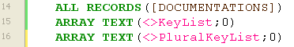
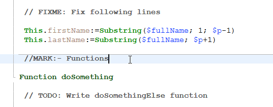
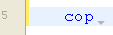

4D dispose d'un puissant éditeur de code intégré qui offre un large choix de fonctionnalités pour une édition de code hautement productive, telles que la complétion intelligente du code, la navigation dans le code, le débogage, la recherche, et bien plus encore.


L'éditeur de code fonctionne comme un éditeur de texte. L'écriture d'une méthode ou d'une classe est généralement une combinaison de saisie de texte, de sélection de composants et de déplacement d'éléments à partir de l'explorateur ou d'autres fenêtres. Vous pouvez également utiliser diverses fonctions d'anticipation (type-ahead) pour créer des méthodes plus rapidement.

Vous pouvez faire défiler le contenu des méthodes, des classes et des fonctions, qui peuvent comprendre jusqu'à 32 000 lignes de code ou 2 Go de texte.

L'éditeur de code 4D fournit un contrôle de base des erreurs de syntaxe. Un contrôle d'erreur supplémentaire est effectué lors de l'exécution du code. For more information on how to handle errors, see [Debugging](../Debugging/basics.md).

## Interface

### Toolbar (Barre d’outils)

Chaque fenêtre de l'éditeur de code dispose d'une barre d'outils qui permet un accès instantané aux fonctionnalités de base liées à l'exécution et à l'édition du code.

| Élément                       | Icône                                                                             | Description                                                                                                                                                                                                                                                                                                                                                                                                                                                                                                                                                                                                                                                                                                                                                                                                                                                                                                                                                                                                                                                                                                                                                                                                                                       |
| ----------------------------- | --------------------------------------------------------------------------------- | ------------------------------------------------------------------------------------------------------------------------------------------------------------------------------------------------------------------------------------------------------------------------------------------------------------------------------------------------------------------------------------------------------------------------------------------------------------------------------------------------------------------------------------------------------------------------------------------------------------------------------------------------------------------------------------------------------------------------------------------------------------------------------------------------------------------------------------------------------------------------------------------------------------------------------------------------------------------------------------------------------------------------------------------------------------------------------------------------------------------------------------------------------------------------------------------------------------------------------------------------- |
| **Exécuter la méthode**       |                     | Lorsque vous travaillez avec des méthodes, chaque fenêtre de l'éditeur de code dispose d'un bouton qui peut être utilisé pour exécuter la méthode en cours. Using the menu associated with this button, you can choose the type of execution:<ul><li> **Run new process**: Creates a process and runs the method in standard mode in this process.</li><li>**Run and debug new process**: Creates a new process and displays the method in the Debugger window for step by step execution in this process.</li><li>**Run in Application process**: Runs the method in standard mode in the context of the Application process (in other words, the record display window).</li><li>**Run and debug in Application process**: Displays the method in the Debugger window for step by step execution in the context of the Application process (in other words, the record display window).</li></ul>For more information on method execution, see [Calling Project Methods](../Concepts/methods.md#calling-project-methods). |
| **Find in method**            |                                | Displays the [_Search_ area](#find-and-replace).                                                                                                                                                                                                                                                                                                                                                                                                                                                                                                                                                                                                                                                                                                                                                                                                                                                                                                                                                                                                                                                                                                                                                                                  |
| **Macros**                    |                              | Insère une macro dans la sélection. Cliquez sur la flèche déroulante pour afficher la liste des macros disponibles. For more information on how to create and instantiate macros, see [Macros](#macros).                                                                                                                                                                                                                                                                                                                                                                                                                                                                                                                                                                                                                                                                                                                                                                                                                                                                                                                                                                                          |
| **Expand all / Collapse all** |        | Ces boutons permettent de déployer ou de contracter toutes les structures de flux de contrôle du code.                                                                                                                                                                                                                                                                                                                                                                                                                                                                                                                                                                                                                                                                                                                                                                                                                                                                                                                                                                                                                                                                                                                            |
| **Method information**        |        | Displays the [Method Properties](../Concepts/methods.md#project-method-properties) dialog box (project methods only).                                                                                                                                                                                                                                                                                                                                                                                                                                                                                                                                                                                                                                                                                                                                                                                                                                                                                                                                                                                                                                                                                          |
| **Last clipboard values**     |  | Affiche les dernières valeurs stockées dans le presse-papiers.                                                                                                                                                                                                                                                                                                                                                                                                                                                                                                                                                                                                                                                                                                                                                                                                                                                                                                                                                                                                                                                                                                                                                                    |
| **Clipboards**                |                        | Neuf presse-papiers sont disponibles dans l'éditeur de code. You can [use these clipboards](./write-class-method.md#multiple-copy-paste-and-numbering-of-clipboards) by clicking on them directly or by using keyboard shortcuts. You can use a [Preferences option](Preferences/methods.md#options-1) to hide them.                                                                                                                                                                                                                                                                                                                                                                                                                                                                                                                                                                                                                                                                                                                                                                                                                                                                              |
| **Navigation dropdown**       |                        | Vous permet de naviguer à l'intérieur des méthodes et des classes avec du contenu étiqueté automatiquement ou des marqueurs déclarés manuellement. Voir ci-dessous                                                                                                                                                                                                                                                                                                                                                                                                                                                                                                                                                                                                                                                                                                                                                                                                                                                                                                                                                                                                                                                                |

### Zone d'édition

C'est ici que vous écrivez et modifiez votre code. L'éditeur indente automatiquement le texte du code et colore les différents éléments de la syntaxe pour une structure de code claire.

Vous pouvez personnaliser l'affichage de la zone d'édition. Toute personnalisation est automatiquement reportée sur toutes les fenêtres de l'éditeur de code :

| Option                                 | Description                                                                                                                                                                                                                                                                                          | Défini dans...                                                                                                                                                                   |
| -------------------------------------- | ---------------------------------------------------------------------------------------------------------------------------------------------------------------------------------------------------------------------------------------------------------------------------------------------------- | -------------------------------------------------------------------------------------------------------------------------------------------------------------------------------------------------------------------------------- |
| **font** and **font size**             | Définit la police et la taille de caractères à utiliser dans la zone d'édition                                                                                                                                                                                                                       | **Preferences** > [**Methods**](../Preferences/methods.md) or **Method > View** > **Bigger Font** or **Smaller Font**                                                                                                            |
| **style and color of syntax elements** | assigner une couleur et/ou un style spécifique à chaque type d'élément du langage 4D.  Vous pouvez également changer les différentes couleurs utilisées dans l'interface de la zone d'édition (surlignement, arrière-plan, etc.). | Clic avec le bouton droit de la souris sur un élément du langage (variable, mot-clé, etc.) > **Style** submenu. Or **Preferences** > [**Methods**](../Preferences/methods.md) |
| **spaces**                             | You can display the spaces between words using dots (.) instead of blank spaces. Cette option s'applique à tous les éléments du code (noms de commandes, variables, commentaires, etc.).       | **Method > View > White Spaces**                                                                                                                                                                                                 |
| **themes**                             | Vous pouvez sélectionner le thème sombre ou clair, ou en définir un thème personnalisé                                                                                                                                                                                                               | **Preferences** > [**Methods**](../Preferences/methods.md)                                                                                                                                                                       |
| **width of code indentations**         | Définir la largeur des indentations de code                                                                                                                                                                                                                                                          | **Preferences** > [**Methods**](../Preferences/methods.md)                                                                                                                                                                       |

#### Barres de modification

Des barres de couleur vous indiquent en temps réel où les lignes de code ont été modifiées depuis l'ouverture de la méthode :



La couleur de la barre de modification indique si les modifications ont été enregistrées ou non :

- jaune : La ligne a été modifiée et la méthode n'a pas encore été enregistrée.
- vert : La ligne a été modifiée et la méthode a été enregistrée.

### Zone des listes

La zone des listes permet d'afficher une ou plusieurs listes d'éléments nécessaires à l'écriture des méthodes et des classes (commandes, constantes, formulaires, etc.). Vous pouvez choisir le nombre et le contenu des listes affichées dans la fenêtre.

Par défaut, l'éditeur de code affiche quatre listes. Vous pouvez masquer ou afficher toutes les listes en cliquant sur l'icône en bas à droite de la fenêtre. 

Vous pouvez agrandir ou réduire la largeur relative de chaque zone de liste en faisant glisser l'une de ses partitions. Il est également possible d'ajuster la taille de la zone de liste par rapport à celle de la zone d'édition en faisant glisser la ligne de séparation entre les deux.

- Un double-clic sur un élément d'une liste entraîne son insertion dans la zone d'édition, à l'endroit où se trouve le curseur.
- To **modify the contents** of a list, click on the title area of the list concerned: a pop-up menu appears, enabling you to choose the type of item to be displayed.


- Pour ajouter ou supprimer une liste, cliquez sur la zone de titre de l'une des listes et choisissez la commande correspondante dans le menu contextuel.
  The **Remove this list** command is disabled when you click on the last list. If you want to hide all the lists, you must either click on the **show or hide lists**  button at the bottom right of the window or hide them by default in the **Preferences**.

- Vous pouvez masquer les listes dans toutes les fenêtres de la manière suivante :
  - Select the **View > Lists** option in the **Method** menu (a check mark indicates whether lists are displayed)
  - Uncheck the **Preferences** > **Methods** > **Options** > **Show Lists** option. For the modifications made in the **Preferences** dialog box to be taken into account, any open methods, classes or functions must first be closed then reopened.

#### Listes d'éléments disponibles

Vous pouvez afficher les listes d'éléments suivantes dans la zone des listes de la fenêtre de l'éditeur de code :

- **All tables and fields**: Database table and field names in the form of a hierarchical list. Lorsque vous insérez un nom de champ dans la méthode en double-cliquant sur son nom, 4D l'insère en respectant la syntaxe et ajoute le nom de la table ou de la sous-table selon le cas.
- **Table** (submenu): Field names of the table selected using the submenu.
- **Current table**: Field names of the current table (available in triggers, form methods and object methods).
- **Project forms**: Database project form names. Lorsque vous double-cliquez sur le nom d'un formulaire projet, 4D l'insère en respectant la syntaxe : le nom du formulaire est inséré entre guillemets.
- **Table forms**: Database table and form names in the form of a hierarchical list. Lorsque vous insérez un nom de formulaire dans une méthode en double-cliquant sur son nom, 4D l'insère en respectant la syntaxe : le nom du formulaire est inséré entre guillemets et est précédé du nom de la table et d'un point-virgule. Par exemple: [Table]; "Formulaire".
- **Methods**: Database project method names.
- **All folders**: Names of object folders and subfolders set in the database displayed in the form of a hierarchical list. Les dossiers peuvent être utilisés pour organiser les objets de manière personnalisée. Ils sont gérés à partir de la page Démarrage de l'Explorateur.
- **Folders** (submenu): Contents of the folder selected using the submenu.
- **Macros**: Macro names defined for the database (see [Creating and using macros](#creating-and-using-macros)).
- **Commands**: 4D language commands in alphabetical order.
- **Commands by themes**: 4D language commands classified by theme in the form of a hierarchical list.
- **Menu bars**: Names and numbers of menu bars [created with the 4D Menu bar editor](../Menus/creating.md).
- **Constants**: 4D constants and those of any plug-ins, classified by theme in the form of a hierarchical list.
- **Lists**: Names of lists.
- **All plug-in commands**: Commands for all the plug-ins installed in the database (if any), classified by theme in the form of a hierarchical list.
- **SQL Keywords**: set of keywords recognized by the 4D SQL syntax parser. Cette liste comprend des commandes (par exemple SELECT), des clauses (par exemple WHERE) ainsi que des fonctions (ABS).
- **SQL Functions**: 4D SQL functions.

**Note:** Except for the Macros element, all the lists are in alphabetical order.

#### Enregistrer comme modèle

Vous pouvez enregistrer les listes définies dans la fenêtre de l'éditeur de code sous la forme d'un modèle. Une fois le modèle enregistré, les paramètres définis dans ce dernier seront utilisés pour chaque nouvelle fenêtre de l'éditeur de code qui sera ouverte.

Les paramètres suivants sont stockés dans le modèle :

- Taille relative des zones d'édition et de liste
- Nombre de listes
- Emplacement et contenu de chaque liste
- Largeur relative de chaque liste

To save a Code Editor window as a template, choose **Method** > **Save As Template**. Le modèle est enregistré immédiatement (aucune boîte de dialogue ne s'affiche). It is stored in the **Preferences** of the 4D application. Si un modèle précédent existe déjà, il est remplacé.

### Zone de points d'arrêt

Cette zone, située à gauche de la zone d'édition, permet d'afficher les numéros de ligne et d'insérer des points d'arrêt directement à côté d'instructions spécifiques. Les points d'arrêt sont utiles pendant la phase de débogage de votre programmation. Ils arrêtent l'exécution de votre code à des endroits spécifiques et affichent le débogueur.

For more information on break points, see the [Debugging](../Debugging/breakpoints.md#breakpoints) section.

Vous pouvez afficher ou masquer les numéros de ligne dans la zone de points d'arrêt pour chaque fenêtre de l'éditeur de code.

- To enable or disable the display of line numbers by default,  choose **Preferences** > **Methods** > **Show line numbers**.
- To modify this display separately for each window of the Code Editor, choose **Method** > **View** > **Line Numbers**.

L'affichage des numéros de ligne permet de se repérer plus facilement dans la fenêtre. The **Method** > **Go to Line Number...** command in the also lets you take advantage of this display.

This type of search is useful when used in conjunction with the [compiler](../Project/compiler.md), which flags runtime errors by the line number in which they occur.

### Barre d'état

La barre d'état située en bas à droite de la fenêtre de l'éditeur affiche à tout moment la position du curseur :


- **Ln**: Line number
- **Col**: Column number, i.e., the level in the hierarchy of programming structures. Le premier niveau est 0. Le numéro de colonne est utile pour le débogage car cette information peut être fournie par l'interpréteur en cas d'erreur dans le code.
- **Ch**: Location of character in the line.
- : Hide/display lists.

Lorsque vous placez le curseur dans une commande, une fonction ou un paramètre, la barre d'état affiche la syntaxe de la commande. If you write or select a parameter, the area shows the current parameter in **bold**:


### Menu déroulant de navigation

Le menu de navigation vous aide à organiser votre code et à naviguer plus facilement dans vos classes et méthodes :


Some tags are added automatically, and you can complement the dropdown list using [markers](#manual-tagging).

#### Navigation dans le code

Cliquez sur un élément de la liste déroulante pour accéder à sa première ligne dans le code. You can also navigate with arrow-keys and press **Enter**.

#### Balisage automatique

Les constructeurs, les déclarations de méthodes, les fonctions et les attributs calculés sont automatiquement balisés et ajoutés à la liste déroulante.

Lorsqu'il n'y a pas de balise dans la classe/méthode, l'outil affiche "No tag".

Les éléments suivants sont ajoutés automatiquement :

| Icône                                                                       | Élément                                                          |
| --------------------------------------------------------------------------- | ---------------------------------------------------------------- |
|                          | Pas de balise                                                    |
|                | Class constructor ou déclaration de méthode                      |
|  | Attribut calculé (get, set, orderBy et query) |
|                      | Nom de la fonction de classe                                     |

#### Balisage manuel

En ajoutant des marqueurs dans votre code, vous pouvez ajouter les balises suivantes à la liste déroulante :

| Icône                                                   | Élément                        |
| ------------------------------------------------------- | ------------------------------ |
|  | MARK : balise  |
|  | TODO : balise  |
|    | FIXME : balise |

Vous les déclarez en ajoutant des commentaires tels que :

```4d
// FIXME : Corriger les éléments suivants
```

Declarations are not case-sensitive; writing `fixme:` has the same effect.

Adding a hyphen after the `MARK:` tag draws a separating line in the code editor and the dropdown menu. Ainsi, cette saisie :



Se traduit par ceci :


All markers located inside functions are indented in the dropdown list, except for the `MARK:` tags located at the end of functions and not followed by instructions. Celles-ci apparaîtront au premier niveau.

#### Ordre d'affichage

Les balises sont affichées dans leur ordre d'apparition à l'intérieur de la méthode/classe.

Pour afficher les balises d'une méthode ou d'une classe par ordre alphabétique, effectuez l'une des opérations suivantes :

- **right-click** the dropdown tool
- hold **Cmd** on macOS or **Alt** on Windows, and click the dropdown tool

> Les balises à l'intérieur des fonctions se déplacent avec leurs éléments parents.

### Raccourcis

De nombreuses fonctionnalités de l'éditeur de code de 4D sont disponibles par le biais de raccourcis clavier par défaut.

:::info macOS

Under macOS, use the **Command** key instead of the **Ctrl** key mentioned (Windows).

:::

| **Shortcut**                                                                                                                                                                                      | **Action**                                                                                                                                                                   |
| ------------------------------------------------------------------------------------------------------------------------------------------------------------------------------------------------- | ---------------------------------------------------------------------------------------------------------------------------------------------------------------------------- |
| **Selection and navigation**                                                                                                                                                                      |                                                                                                                                                                              |
| Double-clic                                                                                                                                                                                       | Sélectionne un nom d'élément du langage                                                                                                                                      |
| [Alt]+Double-clic                                                                                                                             | Sélectionne un nom d'élément du langage contenant des espaces (constante, méthode, etc.)                                                  |
| [Maj]+[flèche droite]                                                                     | Crée et agrandit la sélection, caractère par caractère, vers la droite, ou Réduit la sélection, caractère par caractère, à partir de la gauche                               |
| [Maj]+[flèche gauche]                                                                     | Réduit la sélection, caractère par caractère, à partir de la droite ou Crée et agrandit la sélection, caractère par caractère, vers la gauche                                |
| [Maj]+[flèche vers le bas]                                                                | Crée et agrandit une sélection, ligne par ligne, du haut vers le bas                                                                                                         |
| [Maj]+[flèche haut]                                                                       | Crée et agrandit une sélection, ligne par ligne, du bas vers le haut                                                                                                         |
| [Ctrl]+[Maj]+[flèche droite]          | Crée et agrandit la sélection, mot par mot, de droite à gauche                                                                                                               |
| [Ctrl]+[Maj]+[flèche gauche]          | Réduit la sélection, mot par mot, à partir de la droite, ou crée et agrandit la sélection, mot par mot, à partir de la gauche                                                |
| [Ctrl]+[flèche droite]                                                                    | Déplace le point d'insertion, mot par mot, de gauche à droite                                                                                                                |
| [Ctrl]+[flèche gauche]                                                                    | Déplace le point d'insertion, mot par mot, de droite à gauche                                                                                                                |
| [Alt]+[flèche vers le bas]                                                                | Déplace la ou les ligne(s) où se trouve le curseur vers le bas                                                                                            |
| [Alt]+[flèche haut]                                                                       | Déplace la ou les ligne(s) où se trouve le curseur vers le haut                                                                                           |
| [Home]                                                                                                                                        | Place le point d'insertion au début de la ligne                                                                                                                              |
| [Fin]                                                                                                                                         | Place le point d'insertion à la fin de la ligne                                                                                                                              |
| [Ctrl]+[Home]                                                                             | Place le point d'insertion au début de la méthode                                                                                                                            |
| [Ctrl]+[Fin]                                                                              | Place le point d'insertion à la fin de la méthode                                                                                                                            |
| [Maj]+[Home]                                                                              | Sélectionne tous les caractères de la ligne qui se trouvent à gauche du curseur                                                                                              |
| [Maj]+[Fin]                                                                               | Sélectionne tous les caractères de la ligne qui se trouvent à droite du curseur                                                                                              |
| [PgAV]                                                                                                                                        | Fait défiler le contenu de la méthode, page par page, du bas vers le haut (ne modifie pas le point d'insertion)                                           |
| [PgAR]                                                                                                                                        | Fait défiler le contenu de la méthode, page par page, du haut vers le bas (ne modifie pas le point d'insertion)                                           |
| [**Introspection**](#goto-definition)                                                                                                                                                             |                                                                                                                                                                              |
| [Ctrl]+K ou [Alt]+double-clic                                                             | Same as [**Goto definition**](#goto-definition) command                                                                                                                      |
| [Ctrl] (Windows) ou [Alt] (macOS)+survol d'un token | Souligne le token (élément de langage identifié). Click on the underlined token = same as [**Goto definition**](#goto-definition) command |
| [**Find and replace**](#find-and-replace)                                                                                                                                                         |                                                                                                                                                                              |
| [Ctrl]+F                                                                                                                                      | Chercher                                                                                                                                                                     |
| [Ctrl]+G                                                                                                                                      | Chercher suivant                                                                                                                                                             |
| [Ctrl]+[Maj]+G                                                                            | Chercher précédent                                                                                                                                                           |
| [Ctrl]+E                                                                                                                                      | Chercher identique suivant                                                                                                                                                   |
| [Ctrl]+[Maj]+E                                                                            | Chercher identique précédent                                                                                                                                                 |
| [Ctrl]+[Alt]+F                                                                            | Remplacer                                                                                                                                                                    |
| [Ctrl]+[Alt]+G                                                                            | Remplacer suivant                                                                                                                                                            |
| [Ctrl]+[Alt]+[Maj]+G                  | Remplacer précédent                                                                                                                                                          |
| [**Clipboards**](#clipboards)                                                                                                                                                                     |                                                                                                                                                                              |
| [Maj]+clic ou [Alt]+clic sur l'icône du presse-papiers                                    | Copier le texte sélectionné dans un presse-papiers                                                                                                                           |
| [Ctrl]+[Maj]+touche numérotée                                                             | Copier le texte sélectionné dans le presse-papiers de ce numéro                                                                                                              |
| [Ctrl]+clic sur l'icône du presse-papiers                                                                                                     | Coller le contenu d'un presse-papiers à l'emplacement du curseur                                                                                                             |
| [Ctrl]+[Maj]+touche numérotée                                                             | Coller le contenu du presse-papiers de ce numéro à l'emplacement du curseur                                                                                                  |

:::tip

Most of these shortcuts can be customized in the [4D Preferences](../Preferences/shortcuts.md) dialog box.

:::

## Edition du code

4D utilise des techniques d'édition de texte standard pour la saisie et la modification dans l'Éditeur de code.

L'Éditeur de code utilise des conventions d'affichage (style, couleur) pour les éléments de syntaxe. You can [customize these conventions](#customizing-the-editing-area). Au fur et à mesure que vous tapez, lorsque vous validez votre saisie, 4D évalue le texte de la ligne et applique le format d'affichage approprié. 4D indente également chaque ligne à son niveau approprié par rapport à la ligne précédente lorsque vous utilisez des structures de programmation (If, End if...).

Vous pouvez utiliser les touches fléchées pour vous déplacer rapidement d'une ligne à l'autre. Utiliser les touches fléchées pour se déplacer sur plusieurs lignes est plus rapide que de cliquer car l'éditeur retarde l'évaluation de la ligne pour les erreurs.

Sous Windows, l'éditeur de code comprend un éditeur de code d'entrée (IME) pour faciliter l'édition de code sur les systèmes japonais ou chinois.

The Code Editor includes numerous [navigation shortcuts](#shortcuts).

#### Utilisation du backslash

The backslash character (`\`) has a specific support in the 4D language:

- inserted at the end of lines, it allows to write a single statement on [several lines](../Concepts/quick-tour.md#code-on-several-lines).
- it allows to define [escape sequences](../Concepts/quick-tour.md#escape-sequences).

:::caution

The backslash character (`\`) is used as a separator in [pathnames under Windows](../Concepts/paths.md#windows). En général, 4D interprétera correctement les noms de chemins Windows entrés dans l'éditeur de code en remplaçant la barre oblique inverse simple par une barre oblique inverse double. For instance, `C:\MyDocuments` will become `C:\\MyDocuments`. However, if you write `"C:\MyDocuments\New"`, 4D will display `"C:\\MyDocuments\New"`. In this case, the second backslash is interpreted incorrectly as `\N` (an existing [escape sequence](../Concepts/quick-tour.md#escape-sequences)). Vous devez donc saisir un double backslash lorsque vous souhaitez avoir une barre oblique inversée devant un caractère utilisé dans l'une des séquences d'échappement reconnues par 4D.

:::

### Glisser-déposer

Depuis l'explorateur, vous pouvez glisser-déposer des tables, des champs, des formulaires, des méthodes projet, des constantes ou des commandes 4D. Lorsque vous glissez et déposez un élément, 4D utilise toujours la bonne syntaxe. For example, if you drag the field name First Name from the `[People]` table, it appears in the Code Editor as `[People]First Name`. Similarly, if you drag the Form name Input from the People table, it appears in the Code Editor as `[People];"Input"`.

When you insert a command by dragging it from the **Commands** page of the Explorer, it appears with its syntax (which consists of all of its parameters) in the Code Editor. Cette fonctionnalité vous rappelle simplement les paramètres que la commande attend. Vous pouvez alors utiliser la syntaxe qui convient le mieux à votre utilisation.

Vous pouvez également effectuer un glisser-déposer à l'intérieur d'une méthode, d'une classe ou d'une fonction, ou entre deux méthodes, classes ou fonctions différentes. Dans l'éditeur de code, le mécanisme de glisser-déposer est activé dès qu'une portion de texte est sélectionnée.
By default, the drag-and-drop mechanism **moves** the selected text. In order to **copy** it, hold down the **Ctrl** key (Windows) or the **Option** key (macOS) during the operation.

### Modification de la casse

You can automatically modify the case of selected characters using the commands in **Methods** > **Case** or the context menu of the editor:

- **Uppercase** / **Lowercase**: Switch the selected characters to uppercase or lowercase.
- **camelCase** / **CamelCase** : Switch the selected characters to "camel case". Cela consiste à passer en majuscule chaque première lettre d'un groupe de mots attachés. Ce type de notation est souvent utilisé pour les nomenclatures de variables. hireDate et PurchaseDate sont des exemples de deux variantes de la notation en camel case.

Lorsque vous appliquez l'une de ces commandes à une sélection de texte, les espaces et les caractères "_" sont supprimés et la première lettre de chaque mot est mise en majuscule.

### Inverser l'expression

The **Swap Expression** function can be used to reverse the arguments of an expression assigning a value. Par exemple,

`variable1:=variable2`

devient

`variable2:=variable1`

Cette fonctionnalité est extrêmement utile pour inverser un ensemble d'affectations utilisées pour obtenir ou définir des propriétés, ou pour corriger des erreurs de saisie. To use this function, select the line(s) to be modified, then choose **Method** > **Swap Expression** or use the context menu of the area. Dans la sélection, seules les lignes assignant une valeur seront modifiées.

### Presse-papiers

En plus de l'opération standard copier-coller, 4D offre deux fonctionnalités supplémentaires qui vous permettent de travailler avec le contenu des différents presse-papiers :

- Le programme stocke en mémoire les 10 dernières actions de "copier" ou "couper" qui ont été effectuées dans l'Éditeur de code pendant la session en cours. Chacun des différents contenus enregistrés de cette manière peut être réutilisé à tout moment. To do this, use the **Clipboard History** command of the Code Editor context menu or the "Last Clipboard values" button of the toolbar:

  

  Les premiers mots des éléments copiés ou coupés sont affichés. Sélectionnez un élément pour l'insérer à l'emplacement courant du curseur.

- Nine additional numbered clipboards are available and can be employed directly using the buttons of the Code Editor toolbar or [using keyboard shortcuts](#shortcuts):


### Déplacement des lignes

You can move the line where the cursor is directly without selecting it first using the **Move Lines Up** and **Move Lines Down** commands in the **Method** menu. You can also do this using the **Alt/Option** + **Up Arrow** or **Down Arrow** [keyboard shorcut](#shortcuts).

### Fonctions d'autocomplétion

L'Éditeur de Code fournit des fonctionnalités d'autocomplétion. 4D affiche automatiquement des suggestions basées sur les premiers caractères saisis.

Dans l'exemple ci-dessous, en tapant la chaîne de caractères "cop", un triangle bleu s'affiche pour indiquer que plusieurs suggestions sont disponibles :



When the characters you enter correspond to a single possibility, this suggested value appears greyed out (and is inserted if you hit the **Tab** key):
 ---> 

> If you checked the **Insert () and closing } ) ] "** option in the **Methods** page of the **Preferences**, 4D will also automatically add **()** after a 4D command, keyword or project method that requires one or more mandatory arguments (after accepting a suggestion or completion):
>  -> 

Autocompletion also works with code structures (e.g. If..End if, For each...End for each): when you enter the first part of the structure, the Code Editor will automatically suggest the closing part:


If there are several suggestions available, 4D displays them in a pop-up list when you hit the **Tab** key:


La liste est par ordre alphabétique. Choose the value by double-clicking it or scroll the list using the arrow keys of the keyboard and then hit **Enter**, **Carriage Return** or **Tab** to insert the selected value.

By default, you can also insert a suggested value by hitting one of the following delimiter `( ; : = < [ {` keys after selecting a value: the value inserted is then followed by the delimiter, ready for data entry.

  +  **(** key --> 

> You can disable the use of delimiters for inserting suggested values in **Preferences** > **Methods** > **Options**.

You can press the **Esc** key to close the pop-up list or you can continue typing while it is open. Les valeurs suggérées dans la liste déroulante sont mises à jour à mesure que des caractères supplémentaires sont saisis.

Si les caractères saisis correspondent à différents types d'objets, la liste les affiche dans leur style courant. Les types d'objets suivants peuvent être affichés :

- Commandes 4D
- Commandes SQL
- Méthodes utilisateur
- Noms de tables
- Noms de champs
- Constantes
- Variables déclarées dans la méthode
- Noms de propriétés d'objets
- Commandes de plug-ins
- Mots-clés 4D
- Mots-clés SQL
- Macros (affichées entre < >)

> For practical reasons, you can disable the automatic display of the list of suggestions for **constants**, **(local or interprocess) variables and object attributes**, **tables** and/or **prototypes**. These options are found in **Preferences** > **Methods** > **Options**

#### Noms de propriétés d'objets

4D affiche automatiquement des suggestions sensibles à la casse de tous les noms de propriétés d'objet valides dans le code 4D lorsque vous :

- tapez un point "." après un objet ou
- use the Tab key after a dereferenced object pointer "->".


> The `length` property is always included for use with collections.

Une fois créés, les noms de propriété sont stockés dans une liste globale interne et sont disponibles dès lors qu'une méthode/classe/fonction est ouverte, fermée ou change de focus.


La liste des suggestions est mise à jour dynamiquement lorsque vous modifiez le code. Lorsque vous basculez entre les fenêtres, les noms de propriétés nouveaux/modifiés sont toujours ajoutés à la liste globale. La liste est également mise à jour lorsque vous prévisualisez une méthode, une classe ou une fonction dans l'Explorateur.

Lorsque la base de données est redémarrée, la liste est réinitialisée.

> You can disable the automatic display of object properties in **Preferences** > **Methods** > **suggestions**.

## Chercher et remplacer

The Code editor has powerful **find and replace** features that apply to the current window.

Une zone de recherche et de remplacement peut être affichée dans la barre d'outils de n'importe quelle fenêtre de méthode :


To display this area, click on the **Find in method** icon of the [toolbar](#toolbar) or select a find or replace function either through a [**shortcut**](#shortcuts) or a command from the **Edit > Find** submenu. You can close this area at any moment by clicking on the **x** button at the rightmost side of the toolbar.

:::tip

The **Find in Design** feature in the 4D toolbar or in the **Edit** menu is not specific to the Code editor but may be used to search for a value among all the methods and classes.

:::

### Chercher

Select **Find > Find...** in the **Edit** menu or type **Ctrl+F** (Windows)/**Cmd+F** (macOS) to display/enable the _Search_ area.

La recherche définie dans la zone sera effectuée dans le code situé dans la fenêtre.

The **find** entry area enables you to enter the string to be searched for. Cette zone est une combo box qui stocke les 10 dernières chaînes qui ont été recherchées ou remplacées pendant la session. If you highlight text before choosing the **Find...** command, it will appear in this area. Vous pouvez alors utiliser ce texte ou le remplacer par un autre.

Une fois qu'une chaîne de caractères est entrée ou sélectionnée, toutes les occurrences trouvées dans la fenêtre ouverte sont surlignées et le côté droit de la zone affiche le nombre total de correspondances trouvées. Il indique également la position actuelle du curseur parmi tous les résultats.

Hit the **Enter** key to select closest occurrence to the cursor. You can also click on the **Next / Previous** buttons  to select all occurrences sequentially towards the beginning or end of the current method, starting from the initial location of the cursor, or use the **Find Next** and **Find Previous** commands of the [**Edit** menu](#shortcuts).

#### Options

- **Case Sensitive** : Take the case of characters as they were entered in the find area into account. Cette option prend également en compte les caractères diacritiques. Par exemple, une recherche pour "MyVar" ne trouvera pas "myVar" ; une recherche pour "dej" ne trouvera pas "déjà".
- **Whole Word** : Limit the search to exact occurrences of the word being searched for. Lorsque cette option est cochée, par exemple, une recherche sur "client" ne trouvera ni "clients" ni "myclient". Par défaut, cette option n'est pas cochée ; par conséquent, une recherche de "var" donnera "Myvar", "variation", etc.

### Remplacer

Click on the **v** toggle button on the left side of the _Search_ area to display/hide the _Replace_ area. You can also select **Find > Replace...** in the **Edit** menu or type **Ctrl+Alt+F** (Windows)/**Cmd+Alt+F** (macOS) .

The _Replace_ entry area is used to define the character string that will replace the one defined above.

Click the **Replace** button to launch the search with all defined options and replace the first occurrence found. 4D commence la recherche à partir du point d'insertion de texte en cours et la poursuit jusqu'à la fin de la méthode. It is then possible to continue finding/replacing using the **Replace Next** and **Replace Previous** commands of the [**Edit** menu](#shortcuts).

Click the **Replace all** button to replace all the occurrences corresponding to the search criteria directly in the open method.

### Chercher identique

The **Find Same** command is used to find character strings identical to the one selected. Cette commande n'est active que si vous avez sélectionné au moins un caractère dans l'éditeur de code.

La recherche effectuée est de type "Chercher suivant" dans la fenêtre courante de l'éditeur de code.

The **Find Same Next** and **Find Same Previous** commands are used to find character strings _strictly_ identical to the ones selected. Par exemple, la casse doit correspondre.

### Tout marquer

The **Edit > Bookmark All** command is enabled when a search has already been specified in the find or replace dialog box. Lorsque vous sélectionnez cette commande, 4D place un signet à chaque ligne contenant un élément correspondant aux critères de recherche "courants". Cela permet de repérer facilement tous les résultats de la recherche. For more information about bookmarks, refer to [Bookmarks](#bookmarks).

## Warnings et erreurs

Grâce à 4D Code Live Checker, la syntaxe, la cohérence et la structure du code saisi sont automatiquement vérifiées afin d'éviter les erreurs d'exécution. Par exemple, le Code Live Checker peut détecter l'absence d'une parenthèse droite ou l'utilisation d'un attribut de dataclass inconnu.

Le Code Live Checker est activé à trois niveaux :

- lorsque vous écrivez du code dans l'éditeur de code,
- when you [check the syntax](../Project/compiler.md#check-syntax) in the compiler,
- when you [compile](../Project/compiler.md) the project.

4D vérifie automatiquement la syntaxe du code pour s'assurer qu'elle est correcte. Si vous saisissez un texte ou sélectionnez un composant qui n'est pas correct, 4D affiche un symbole pour indiquer l'expression incorrecte.

Deux types de symboles sont affichés :

- **warnings** : Warnings are intended to draw your attention to statements that might lead to execution errors. Ils n'empêchent pas la compilation.
- **errors**: errors are anomalies that prevent the code from being executed correctly. Elles doivent être corrigées, sinon le projet ne se compilera pas.

Lorsque vous passez la souris sur le symbole, une infobulle affiche la cause de l'erreur :


Le Code Live Checker est activé lorsque vous saisissez du code. Lorsqu'une ligne d'une méthode, d'une classe ou d'une fonction est signalée comme ayant une syntaxe incorrecte, vérifiez et corrigez la saisie. Si la ligne devient correcte, 4D supprime le symbole d'erreur. Lorsque vous enregistrez ou fermez la fenêtre, l'ensemble de la méthode est validé.

You can format the current line (without advancing to the next line) by pressing the **Enter** key on the numeric keypad. 4D évalue la ligne, la met en forme, marque les erreurs éventuelles et place le point d'insertion à la fin de la ligne.

Le Code Live Checker vérifie :

- les erreurs de syntaxe de base (opérateurs erronés, fautes d'orthographe, etc.)
- the structure of statements (`If`, `End if` and so on)
- la correspondance des caractères d'encadrement du code tels que les parenthèses ou les crochets (voir note ci-dessous)
- les appels d'attributs et de fonctions selon votre modèle (ORDA) et vos définitions de classes utilisateurs. Par exemple, le Code Live Checker génère une erreur lorsqu'un appel à un attribut calculé de la dataclass n'est pas compatible avec le type d'attribut calculé déclaré.

:::tip

Lorsque vous saisissez un caractère d'encadrement, 4D indique la correspondance en encadrant les caractères de début/fin avec des rectangles gris par défaut :


You can modify the way 4D indicates matching enclosing characters or disable this feature in the [**Preferences**](../Preferences/methods.md#options-1).

:::

Le Code Live Checker ne peut pas détecter certaines erreurs qui ne se produisent que pendant l'exécution. Les erreurs d'exécution sont détectées par 4D lorsque le code est exécuté. However, keep in mind that the [compiler](../Project/compiler.md) also provides indispensable help for detecting errors.

## Infobulles

L'éditeur de code fournit diverses informations contextuelles à l'aide d'infobulles. Elles apparaissent lorsque vous survolez un objet avec la souris.

:::tip

The [status bar](#status-bar) also provides contextual information.

:::

- **Errors**: When you mouse over the symbol indicating an error to the left of the editing area, a help tip displays the cause of the error (see [Syntax errors](#syntax-errors)).

- **4D command documentation**: When you move the mouse over a 4D command or function, a help tip provides its syntax along with a brief description of how it works.
  

- **Variable type and description**: When you mouse over a variable, a help tip shows its type (if it has been explicitly defined in the method) and associated comment, if any.
  

- **Project methods or functions**: When you mouse over a project method or class function, a help tip displays:

  - soit les commentaires spécifiés dans l'Explorateur.
  - or the first few lines of the method or class function if it includes comments (lines beginning with // or /_..._/ comment block). Il est courant d'insérer la documentation de la méthode ainsi que ses paramètres sous forme de commentaires au début de la méthode. Vous pouvez obtenir ces informations directement dans l'infobulle, en veillant à supprimer au préalable tous les commentaires présents dans l'Explorateur.
    Comments at the beginning of a method:
    
    Help tip in another method:
    

- You can also create a **dedicated documentation file** named `<MethodName>.md` in the `<package>/documentation` folder. See [Viewing documentation in the code editor](../Project/documentation.md#viewing-documentation-in-the-code-editor)

## Commenter / Décommenter

The 4D language supports [comments](../Concepts/quick-tour.md#comments), which are inactive lines of code. L'éditeur de code n'applique pas de style particulier dans les commentaires. La longueur des commentaires est limitée à la taille maximale de 32 000 caractères par ligne.

There are two kinds of comments: `//comment` (single line comment) and `/*comment*/`(inline comments or multiline comment blocks).

Comments can be created by typing `/` characters. Or, the **Comment/Uncomment** command, found in the **Method** menu as well as in the Code Editor context menu is used to mark a group of selected lines of code as single line comments, or, on the contrary, to remove the single line comment characters from a selection. To use this command, select the code to be marked as commented, then select the **Comment/Uncomment** command:

 --> 

When the selection contains only active code, the **Comment** command is applied. Lorsque la sélection comprend à la fois du code actif et des lignes commentées, une paire supplémentaire de caractères de commentaire ( // ) est ajoutée à ces dernières ; de cette façon, elles conserveront leur statut de commentaire initial si la ligne est ensuite "décommentée". When the selection contains only commented lines, the **Uncomment** command is applied.

> The **Comment/Uncomment** command only operates with full lines --- it cannot be used to comment only part of a line.

## Déployer / Contracter

Le code 4D situé à l'intérieur des boucles et des conditions peut être replié ou déplié, afin de faciliter la lecture des méthodes :

- Expanded code:
  

- Collapsed code:
  

Si vous placez la souris sur le bouton de déploiement [...], une infobulle apparaît, affichant les premières lignes du code masqué.

Une portion de code repliée peut être sélectionnée, copiée, collée ou supprimée. Toutes les lignes incluses seront copiées, collées ou supprimées respectivement. Lorsqu'une portion de code est collée, elle est automatiquement déployée.

There are several ways to expand and collapse code:

- Click on the expand/collapse icons ([+] and [-] under Windows) or on the opening button [...]
- Use the commands of the **Method > Collapse/Expand** submenu:

  - **Collapse Selection** / **Expand Selection**: collapses or expands all the code structures found in the text selection.
  - **Collapse Current Level** / **Expand Current Level**: collapses or expands the code structure at the level where the cursor is located. These commands are also available in the **context menu** of the editor.
  - **Collapse All** / **Expand All**: collapses or expands all the loops and conditions of a method. These commands are also available in the toolbar of the editor.

## Blocks

Blocks can be defined by:

- Guillemets
- Parentheses
- A logical structure (If/Else/End if, While/End while, Repeat/Until Case of/End case)
- Braces

### Select Enclosing Block

The **Select Enclosing Block** function is used to select the "enclosing block" of the code containing the insertion point.

If a block of text is already selected, the function selects the enclosing block of the next highest level and so on, until the entire method is selected.

Pressing **Ctrl+Shift+B** (Windows) or **Command+Shift+B** (macOS) enables you to reverse this operation and deselect the last enclosing block selected.

**Note:** If the insertion point is placed in an `If` or `Else` type structure, the enclosing block will be the one containing, respectively, the `If` or `Else` statement.

### Start of Block or End of Block

Two commands make it easier to move around within code structures (e.g. `If...Else...End if`):

- **Start Of Block**: places the cursor at the start of the current structure, just before the initial keyword.
- **End Of Block**: places the cursor at the end of the current structure, just after the final keyword.

These commands are found in the **Method** menu as well as the context menu of the editor. You can also use the following shortcuts:

- Windows: **Ctrl + up arrow** or **Ctrl** + **down arrow**‚
- macOS: **Command** + **up arrow** or **Command** +**down arrow**.

## Bookmarks

4D lets you associate bookmarks with certain lines in your methods. You can then browse quickly within the code by passing from one bookmark to another using specific commands.


A bookmark moves along with its original row if additional rows are inserted in the method. Bookmarks are saved with the methods.

Bookmarks are managed using the **Bookmarks** submenu of the **Method** menu:

- **Toggle**: Associates a bookmark with the current line (where the cursor is located) if it does not already have one or removes the existing bookmark if it does. This function is also available using the **Toggle Bookmark** command of the editor's context menu or using the **Ctrl+F3** (Windows) or **Command+F3** (macOS) keyboard shortcut.
- **Remove All**: Removes all bookmarks from the foreground window.
- **Goto Next** / **Goto Previous**: Enables browsing among bookmarks in the window. Selecting one of these commands places the cursor on the first character of the line associated with the bookmark concerned. You can also use the keyboard shortcuts **F3** (go to next) or **Shift+F3** (go to previous).

:::info

You can use bookmarks as markers for lines that contain an [item found by a search](#find). In this case, 4D automatically adds the bookmarks. For more information, refer to [Bookmark all](#bookmark-all).

:::

## Reveal in Explorer

The **Reveal in Explorer...** command opens an Explorer window with the target element selected. To do this, place the cursor inside the element's name or select it, then choose **Method** > **Reveal in Explorer...** .

## Search Callers

The **Search Callers** command in the **Method** menu is only enabled for project methods. It searches for all the objects (other methods or menus) that reference the project method.

**Note:** The **Search Callers...** command is also available in **Explorer** > **Methods**

This command displays its results in a new window.

## Goto Definition

The **Goto Definition** command opens the definition of an element referenced in the Code Editor. To do this, place the cursor inside the object name or select it, and choose **Method** > **Goto Definition...** or use the context menu of the editor.

:::tip

This feature is also available through the keyboard shortcut **Ctrl+K** (Windows) / **Command+K** (macOS) or  **Alt+double-click**.

:::

The effect of the **Goto Definition...** command varies depending on the target element:

- with a project method, it displays the contents of the method in a new window of the Code Editor
- with a class name or class function, it opens the class in the the Code Editor
- with a built-in 4D command or function, it has the same effect as the [**Show documentation**](#show-documentation) command.

## Show documentation

The **Show documentation...** command opens the documentation for the target element. To do this, place the cursor inside the element's name or select it, then choose **Method** > **Show documentation...** or use the contextual menu. The effect varies depending on the target element. Par exemple :

- Selecting a project method or a user class and choosing **Show documentation...** selects the method in the Explorer and switches to the documentation tab
- Selecting a 4D command, function, or class name and choosing **Show documentation...** displays the online documentation.
- If no element is selected, the command opens the documentation of the method currently opened in the Code Editor, [if any](../Project/documentation.md).

:::tip

To display the documentation of a 4D "classic" language command, select the command name or simply place the cursor in the name and press **F1**. The documentation of the command is displayed in a new window of your default browser. 4D looks for the documentation depending on the settings made in the Preferences (see [Documentation location](../Preferences/general.md#documentation-location)).

:::

## Search References

The **Search References...** command found in the **Method** menu or the context menu of the Code Editor finds all the objects (methods and forms) in the project where the current item of the method is referenced (used).

The current item is either the one selected or the one where the cursor is located. It can be a field name, variable name, command, string, and so on. For example, the following action looks for all the occurrences of the _vlNbCmd_ variable in the database:


This command displays its results in a new window.

## Liste des macros

Vous pouvez utiliser des macro-commandes dans vos méthodes. Les macro-commandes permettent de gagner beaucoup de temps lors de la saisie de code.

Une macro-commande est une partie de code 4D accessible en permanence et pouvant être insérée à tout endroit de vos méthodes, quelle que soit la base ouverte. Les macro-commandes peuvent contenir tout type de texte, des commandes et des constantes 4D, ainsi que des balises spéciales, remplacées au moment de l’insertion de la macro par des valeurs issues du contexte de la méthode. For instance, a macro may contain the tag `<method_name/>;` at the time of macro insertion, this tag will be replaced by the name of the current project method.

Les macro-commandes sont stockées dans un ou plusieurs fichier(s) au format XML (texte). Elles peuvent être affichées dans une liste de l’éditeur de code; elle peuvent également être appelées à l’aide du menu contextuel de l’éditeur ou à l’aide de la fonction de saisie prédictive.

Les macro-commandes de 4D sont écrites au format XML. Vous pouvez utiliser “tel quel” le fichier de macro-commandes par défaut de 4D ou le modifier.

### Emplacement des macros

4D loads the macros from a folder named **Macros v2**. Les macros doivent être présentes sous forme d’un ou plusieurs fichiers XML placés dans ce dossier.

Le dossier “Macros v2” peut être situé :

- Dans le dossier 4D actif de la machine. Les macros sont alors partagées pour toutes les bases.
  **Note:** The location of the active 4D folder varies according to the operating system used. For more information, refer to the description of the [Get 4D folder](https://doc.4d.com/4Dv19R4/4D/19-R4/Get-4D-folder.301-5739515.en.html) command in the 4D _Language Reference_ manual.
- A côté du fichier de structure de la base. Les macros ne sont chargées que pour cette structure.
- For components: in the **Components** folder of the database. Les macros ne sont alors chargées que si le composant est installé.

Ces trois emplacements peuvent être utilisés simultanément : il est possible d’installer un dossier “Macros v2” à chaque emplacement. The macros will be loaded in the following order: 4D folder, structure file, component 1... component X.

### Macros par défaut

4D propose un ensemble de macros par défaut contenant, par exemple, des mots-clés des conditions et boucles. These macros are included in the default "_Macros.xml_" file, placed in the "Macros v2" folder that is created in the active 4D folder of the machine during the initial startup of 4D.

Vous pouvez modifier ce fichier ou le contenu du dossier par la suite comme vous le souhaitez (voir le paragraphe suivant). En cas de problème avec ce dossier, il peut être supprimé et 4D le recréera au démarrage suivant.

### Ajout de macros personnalisées

Vous pouvez ajouter des macros personnalisées dans le fichier "Macros.xml" à l'aide d'un éditeur de texte standard ou par programmation. Vous pouvez également ajouter des fichiers XML de macros personnalisées dans ce dossier.

En mode local, le fichier de macros peut être ouvert tout en utilisant 4D. La liste des macros disponibles est mise à jour à chaque événement activant 4D. Par exemple, il est possible de faire passer l'éditeur de texte au premier plan, de modifier le fichier macro, puis de revenir à la méthode : la nouvelle macro est alors disponible dans l'éditeur de code.

Les macros vides ou erronées ne sont pas affichées.

#### Vérification de la syntaxe des macros personnalisées

Les fichiers de macro-commandes de 4D doivent être conformes à la norme XML. This means more particularly that XML declaration `<?xml version="1.0" ...?>` and document declaration `<!DOCTYPE macros SYSTEM "http://www.4d.com/dtd/2007/macros.dtd">` statements are mandatory at the beginning of a macro file in order for it to be loaded. Les différents types d'encodage XML sont pris en charge. Toutefois, il est recommandé d'utiliser un encodage compatible avec Mac/PC (UTF-8). 4D fournit une DTD qui peut être utilisée pour valider les fichiers macro. Ce fichier se trouve à l'emplacement suivant :

- Windows : \Resources\DTD\macros.dtd
- Mac OS : :Contenu:Ressources:DTD:macros.dtd

Si un fichier de macros ne contient pas les déclarations ou ne peut être validé, il n'est pas chargé.

#### Syntaxe des macros 4D

Les macros 4D sont construites à l'aide de balises XML personnalisées appelées "éléments".

Some tags indicate the start and end of the definition (double tags of the type `<tag> </tag>`), others are replaced by insertion context values (`<tag/>`).

Conformément aux spécifications XML, certaines balises d'éléments peuvent inclure des attributs. Sauf indication contraire, ces attributs sont facultatifs et une valeur par défaut est utilisée lorsqu'ils sont omis. La syntaxe des éléments avec attributs est la suivante :

- Double tags: `<tag attribute="value"> </macro>`
- Single tags: `<tag attribute="value"/>`

If the element accepts several attributes, you can group them in the same line of command, separated by a space:
`\<tag attribute1="value" attribute2="value" attribute3="value"... >`

Voici la liste des balises et leur mode d'utilisation :

| **Balises d'éléments** | **Description**                                                                                                                                                                                                                                                                                                                                                                                                                                                                                                                                                                                                                                                                                                                                                                                  |
| ---------------------- | ------------------------------------------------------------------------------------------------------------------------------------------------------------------------------------------------------------------------------------------------------------------------------------------------------------------------------------------------------------------------------------------------------------------------------------------------------------------------------------------------------------------------------------------------------------------------------------------------------------------------------------------------------------------------------------------------------------------------------------------------------------------------------------------------ |
| `<macros> </macros>`   | Début et fin du fichier macro (balise obligatoire).                                                                                                                                                                                                                                                                                                                                                                                                                                                                                                                                                                                                                                                                                                           |
| `<macro> </macro>`     | Début et fin de la définition d'une macro et de ses attributs.                                                                                                                                                                                                                                                                                                                                                                                                                                                                                                                                                                                                                                                                                                                   |
|                        | _Attributs_:                                                                                                                                                                                                                                                                                                                                                                                                                                                                                                                                                                                                                                                                                                                                                                     |
|                        | - name : Nom de la macro tel qu'il apparaît dans les menus et les listes de l'éditeur de code (attribut obligatoire).                                                                                                                                                                                                                                                                                                                                                                                                                                                                                                                                                                                                                         |
|                        | * type_ahead_text : Chaîne de caractères à saisir pour appeler la macro à l'aide de la fonction de saisie prédictive (ou autocomplétion).                                                                                                                                                                                                                                                                                                                                                                                                                                                                                                                                                           |
|                        | - in_menu : Booléen indiquant si la macro peut être appelée à l'aide du menu contextuel. Valeurs = "true" (par défaut) ou "false".                                                                                                                                                                                                                                                                                                                                                                                                                                                                                                                                                                       |
|                        | * type_ahead : Booléen indiquant si la macro peut être appelée en utilisant la fonction de saisie prédictive (ou autocomplétion). Valeurs = "true" (par défaut) ou "false".                                                                                                                                                                                                                                                                                                                                                                                                                                                                                                           |
|                        | - method_event : Utilisé pour déclencher l'appel automatique de la macro en fonction de la phase de traitement courante de chaque méthode (création, fermeture, etc.). Values = "on_load": The macro is triggered on the opening of each method, "on_save": The macro is triggered when each method is saved (closing of a modified method or saving using the File>Save command, "on_create": The macro is triggered when each method is created, "on_close": The macro is triggered when each method is closed. |
|                        | "on_save" et "on_close" peuvent être utilisés conjointement --- en d'autres termes, ces deux événements sont générés lorsqu'une méthode modifiée est fermée. En revanche, "on_create" et "on_load" ne sont jamais générés de manière consécutive. Cet attribut peut être utilisé, par exemple, pour préformater les méthodes lors de leur création (commentaires dans la zone d'en-tête) ou pour enregistrer des informations telles que la date et l'heure de leur clôture.                                                                                                                                                              |
|                        | * version: Used to activate the new mode of supporting text selections for the macro (see the "About the `<method>` Tag" section below). Pour activer ce mode, passez la valeur "2". Si vous omettez cet attribut ou passez la version="1", l'ancien mode est conservé.                                                                                                                                                                                                                                                                                                                                                                                                                                       |
|                        | - in_toolbar : Booléen indiquant si la macro doit être présente dans le menu du bouton Macro de la barre d'outils. Valeurs = "true" (par défaut) ou "false".                                                                                                                                                                                                                                                                                                                                                                                                                                                                                                                                             |
| `<selection/>`         | Balise remplacée par le texte sélectionné lors de l'insertion de la macro. La sélection peut être vide.                                                                                                                                                                                                                                                                                                                                                                                                                                                                                                                                                                                                                                                          |
| `<text> </text>`       | Début et fin du code qui doit être inséré dans la méthode. Un retour chariot sera ajouté avant et après le code.                                                                                                                                                                                                                                                                                                                                                                                                                                                                                                                                                                                                                                                 |
| `<method> </method>`   | Début et fin du nom de la méthode projet et de son paramètre (facultatif). La méthode est exécutée lorsque la macro est appelée. Vous pouvez passer un paramètre sous la forme ("param1;param2 ;..."). Ce paramètre sera reçu dans la méthode à l'aide des variables $1, $2, etc. For additional information about this tag, refer to the "About the `<method>` Tag" section below.                                                                                                                                                                                                                                        |
| `<caret/>`             | Emplacement du point d'insertion dans le code après l'insertion de la macro.                                                                                                                                                                                                                                                                                                                                                                                                                                                                                                                                                                                                                                                                                                     |
| `<user_4D/>`           | Balise remplacée par le nom de l'utilisateur 4D courant.                                                                                                                                                                                                                                                                                                                                                                                                                                                                                                                                                                                                                                                                                                                         |
| `<user_os/>`           | Balise remplacée par le nom d'utilisateur courant du système.                                                                                                                                                                                                                                                                                                                                                                                                                                                                                                                                                                                                                                                                                                                    |
| `<method_name/>`       | Tag replaced by the current method name.                                                                                                                                                                                                                                                                                                                                                                                                                                                                                                                                                                                                                                                                                                                                         |
| `<method_path/>`       | Tag replaced by path syntax (as returned by [`METHOD Get path`](https://doc.4d.com/4dv19R/help/command/en/page1164.html) of the current method.                                                                                                                                                                                                                                                                                                                                                                                                                                                                                                                                                                                                               |
| `<date/>`              | Balise remplacée par la date courante.                                                                                                                                                                                                                                                                                                                                                                                                                                                                                                                                                                                                                                                                                                                                           |
|                        | _Attribut_:                                                                                                                                                                                                                                                                                                                                                                                                                                                                                                                                                                                                                                                                                                                                                                      |
|                        | * format : Format 4D utilisé pour afficher la date. Si aucun format n'est défini, le format par défaut est utilisé. Valeurs = numéro du format 4D (0 à 8).                                                                                                                                                                                                                                                                                                                                                                                                                                                                                                                                                    |
| `<time/>`              | Balise remplacée par l'heure courante.                                                                                                                                                                                                                                                                                                                                                                                                                                                                                                                                                                                                                                                                                                                                           |
|                        | _Attribut_:                                                                                                                                                                                                                                                                                                                                                                                                                                                                                                                                                                                                                                                                                                                                                                      |
|                        | - format : Format 4D utilisé pour afficher l'heure. Si aucun format n'est défini, le format par défaut est utilisé. Valeurs = numéro du format 4D (0 à 6).                                                                                                                                                                                                                                                                                                                                                                                                                                                                                                                                                    |
| `<clipboard/>`         | Balise remplacée par le contenu du presse-papiers.                                                                                                                                                                                                                                                                                                                                                                                                                                                                                                                                                                                                                                                                                                                               |
|                        | _Attribut_:                                                                                                                                                                                                                                                                                                                                                                                                                                                                                                                                                                                                                                                                                                                                                                      |
|                        | * index : Presse-papiers à coller. Valeurs = numéro du presse-papiers (0 à 9).                                                                                                                                                                                                                                                                                                                                                                                                                                                                                                                                                                                                                                                |

- Les macros peuvent être appelées à l'aide du menu contextuel de l'éditeur de code ou à l'aide de la fonction type-ahead (voir la section suivante).

- Si vous voulez vous conformer aux spécifications du langage XML, vous ne devez pas utiliser de caractères étendus (caractères accentués, guillemets, etc.).

Voici un exemple de définition de macro :

| **Contenu de la macro**                                                              | **Comments**                                                                                                                                                 |
| ------------------------------------------------------------------------------------ | ------------------------------------------------------------------------------------------------------------------------------------------------------------ |
| `<?xml version="1.0"...?>`                                                           | Déclaration XML                                                                                                                                              |
| `<!DOCTYPE macros SYSTEM>`                                                           | Déclaration de document                                                                                                                                      |
| `<macros>`                                                                           | Début du fichier XML des macros                                                                                                                              |
| `<macro name="RecordLoop">`                                                          | Début de la définition et du nom de la macro                                                                                                                 |
| `<text>`                                                                             | Début du code de la macro                                                                                                                                    |
| For($i;1;Records in selection(`<Selection/>`)) | The `<Selection/>` tag will be replaced by the selected code in the 4D method at the time of macro insertion (for instance, a table name) |
| SAVE RECORD(`<Selection/>`)                                       |                                                                                                                                                              |
| NEXT RECORD(`<Selection/>`)                                       |                                                                                                                                                              |
| End for                                                                              |                                                                                                                                                              |
| `</text>`                                                                            | Fin du code de la macro                                                                                                                                      |
| `</macro>`                                                                           | Fin de la définition de la macro                                                                                                                             |
| `</macros>`                                                                          | Fin du fichier XML des macros                                                                                                                                |

#### About the `<method>` tag

The `<method>` tag allows you to generate and use macro-commands that execute 4D project methods. Cela permet aux développeurs de créer des fonctions sophistiquées qui peuvent être distribuées via des macro-commandes associées à des composants. For example, the following macro will cause the _MyMethod_ method to be executed with the name of the current method as parameter:

`<method>MyMethod("<method_name/>")</method>`

Le code d'une méthode appelée est exécuté dans un nouveau process. Ce process est tué une fois la méthode exécutée.

> Le process de structure reste figé jusqu'à ce que l'exécution de la méthode appelée soit terminée. Vous devez vous assurer que l'exécution est rapide et qu'il n'y a aucun risque qu'elle bloque l'application. If this occurs, use the **Ctrl+F8** (Windows) or **Command+F8** (Mac OS) command to "kill" the process.

### Appeler des macros

Par défaut, les macros peuvent être appelées à l'aide du menu contextuel ou de la barre d'outils de l'éditeur de code, de la fonction d'auto-complétion ou d'une liste spécifique au bas de la fenêtre de l'éditeur de code.

Notez que pour chaque macro, il est possible de restreindre la possibilité de l'appeler à l'aide du menu contextuel et/ou de la fonction d'autocomplétion.

#### Menu contextuel et barre d'outils

By default, all macros can be called via the context menu of the Code Editor (using the **Insert macro** hierarchical command) or the **Macros** button of the toolbar.

The _in_menu_ attribute of the `<macro>` tag is used to set whether or not the macro appears in this menu.

Dans le menu contextuel, les macros sont affichées dans l'ordre du fichier "Macros.xml" et des éventuels fichiers XML supplémentaires. Il est donc possible de changer l'ordre en modifiant ces fichiers.

#### Autocomplétion

By default, all macros are accessible using the autocomplete (aka type-ahead) function (see [Writing a method](./write-class-method.md)). The _type_ahead_ attribute of the `<macro>` tag can be used to exclude a macro from this type of operation.

**Note:** If the macro contains the `<selection/>` tag, it will not appear in the autocomplete pop-up window.

#### Liste de l'éditeur de code

You can display your macros in a list of the Code Editor (see [Writing a method](./write-class-method.md)). Il suffit de double-cliquer sur le nom d'une macro dans la liste pour l'appeler. Il n'est pas possible d'exclure une macro spécifique de cette liste.

### Notes de compatibilité

La prise en charge des macros peut changer d'une version de 4D à l'autre. Afin de garder les différentes versions compatibles tout en conservant vos personnalisations, 4D ne supprime pas les versions précédentes. Si vous souhaitez utiliser les dernières fonctionnalités disponibles, vous devez adapter votre version en conséquence.

#### Variables de sélection de texte pour les méthodes

It is recommended to manage text selections using the [GET MACRO PARAMETER](https://doc.4d.com/4dv19/help/command/en/page997.html) and [SET MACRO PARAMETER](https://doc.4d.com/4dv19/help/command/en/page998.html) commands. Ces commandes peuvent être utilisées pour surmonter le cloisonnement des espaces d'exécution du projet hôte/composant et ainsi permettre la création de composants dédiés à la gestion des macros. Afin d'activer ce mode pour une macro, vous devez déclarer l'attribut Version avec la valeur 2 dans l'élément Macro. In this case, 4D no longer manages the predefined variables _textSel,_textReplace, etc. and the [GET MACRO PARAMETER](https://doc.4d.com/4dv19/help/command/en/page997.html) and [SET MACRO PARAMETER](https://doc.4d.com/4dv19/help/command/en/page998.html) commands are used. Cet attribut doit être déclaré comme suit :

`<macro name="MyMacro" version="2">`<br/>
`--- Text of the macro ---`<br/>
`</macro>`

Si vous ne passez pas cet attribut, le mode précédent est conservé.

#### Incompatibilités liées à la norme XML

Des règles syntaxiques strictes doivent être observées pour que les fichiers de macros respectent la norme XML. Cela peut entraîner des incompatibilités avec le code des macros créées avec les versions précédentes et empêcher le chargement des fichiers XML. Les principales sources de dysfonctionnement sont les suivantes :

- Comments of the "// my comment" type, allowed inside `<macro>` elements in previous versions of 4D, are not compatible with the XML syntax. The lines of comments must respect the standard `"<!-- my comment -->"` form.
- The `<>` symbols used more particularly for interprocess object names must be encoded. For example, the `<>params` variable must be written `&lt;>params`.
- The initial `<macros>` declaration tag could be omitted in previous versions of 4D. Il est maintenant obligatoire ; sinon, le fichier ne sera pas chargé.
