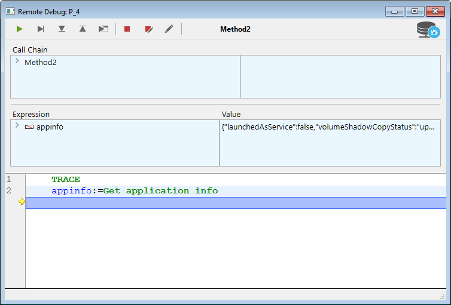

## Vue d’ensemble

Lorsqu'une base de données 4D est exécutée sur 4D Server en mode interprété, vous pouvez déboguer le code 4D exécuté sur le serveur à partir d'un client 4D distant connecté au projet. Il suffit d'associer le débogueur à une machine distante spécifique, et l'exécution du code peut être surveillée dans le débogueur directement sur la machine distante.

Sur une machine distante, la [fenêtre du débogueur](debugger.md) affiche une icône de serveur spécifique et une couleur de fond bleue pour indiquer que vous déboguez du code serveur :

Cette fonctionnalité est particulièrement utile lorsque 4D Server fonctionne en mode headless (voir [Interface en ligne de commande](../Admin/cli.md)), ou lorsque l'accès à la machine serveur n'est pas facile.

## Débogueur associé

Un seul débogueur peut déboguer une application 4D Server à un moment donné. Il s'agit du **débogueur associé**. Le débogueur associé peut être :

- le débogueur local de 4D Server (par défaut) - si le serveur ne tourne pas en mode headless.
- le débogueur d'un client 4D distant - si la session distante a accès au mode Développement.

Le débogueur associé est appelé chaque fois que 4D Server rencontre :

- un point d'arrêt
- a `TRACE` command
- un point d'arrêt sur commande
- une erreur

A noter que les messages d'erreur sont envoyés à la machine du débogueur associé. Cela signifie que dans le cas d'un débogueur distant, les messages d'erreur du serveur sont affichés sur le client 4D distant.

A noter que :

- The code executed in the `On Server Startup Database` Method cannot be debugged remotely. Il ne peut être débogué que du côté serveur
- Si aucun débogueur n'est associé, le code en cours d'exécution n'est pas arrêté par les commandes de débogage

## Associer le débogueur

Par défaut, lorsque vous démarrez une application interprétée:

- si 4D Server ne fonctionne pas en mode "headless", le débogueur est associé au serveur,
- si 4D Server fonctionne en mode "headless", aucun débogueur n'est associé.

Vous pouvez associer le débogueur à tout client 4D distant autorisé à se connecter à l'application 4D Server.

> La session utilisateur du client 4D distant doit avoir accès à l'environnement de développement de la base de données.

Pour associer le débogueur à un client 4D distant :

1. In the 4D Server menu bar, select **Edit** > **Detach Debugger** so that the debugger becomes available to remote machines (this step is useless if the 4D Server is running headless).
2. In a remote 4D client connected to the server, select **Run** > **Attach Remote Debugger**

If the attachment is accepted (see [Rejected attachment requests](#rejected-attachment-requests)), the menu command becomes **Detach Remote Debugger**.

Le débogueur est alors attaché au client 4D distant :

- jusqu'à la fin de la session utilisateur
- until you select `Detach Remote Debugger`

Pour rattacher le débogueur au serveur :

1. On the remote 4D client that has the debugger attached, select **Run** > **Detach Remote Debugger**.
2. In the 4D Server menu bar, select **Edit** > **Attach debugger**.

> Lorsque le débogueur est attaché au serveur (par défaut), tous les process du serveur sont automatiquement exécutés en mode coopératif pour permettre le débogage. Cela peut avoir un impact significatif sur les performances. Lorsque vous n'avez pas besoin de déboguer sur la machine du serveur, il est recommandé de détacher le débogueur et de l'attacher à une machine distante si nécessaire.

## Attacher le débogueur au démarrage

4D vous permet d'associer le débogueur à un client 4D distant ou au serveur automatiquement au démarrage :

- On the server (if not headless), this option is named **Attach Debugger At Startup**. Lorsque le serveur est démarré, il associe automatiquement le débogueur (par défaut).

> **Warning**: If this option is selected for a server which is subsequently launched in headless mode, the debugger won't be available for this server.

- On a remote 4D client, this option is named **Attach Remote Debugger At Startup**. Lorsqu'elle est sélectionnée, le client 4D distant tente automatiquement d'attacher le débogueur distant à chaque connexion ultérieure à la même base de données 4D Server. If the attachment is accepted (see [Rejected attachment requests](#rejected-attachment-requests)), the remote debugger is automatically attached to the remote 4D client and the **Detach Remote Debugger option is displayed**.

> This setting is applied per project and is stored locally in the [`.4DPreferences`](Project/architecture.md#userpreferencesusername) file.

## Demandes d'association rejetées

Si le débogueur est déjà attaché à un client 4D distant ou à 4D Server, aucune autre machine ne peut s'associer au débogueur.

Si une machine tente d'attacher le débogueur alors qu'il est déjà attaché, l'attachement est rejeté et une boîte de dialogue apparaît :

L'attachement du débogueur dans ce cas nécessite que :

- the attached debugger is detached from the server or from the remote 4D client using respectively the **Detach debugger** or **Detach remote debugger** menu command,
- la session du client distant 4D associée soit fermée.
