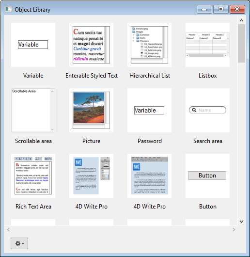

Vous pouvez utiliser des bibliothèques d'objets dans vos formulaires. Une bibliothèque d'objets propose une collection d'objets préconfigurés pouvant être utilisés dans vos formulaires par simple copier-coller ou glisser-déposer.

4D propose deux types de bibliothèques d'objets :

- une bibliothèque d'objets standard préconfigurée, standard, disponible dans tous vos projets.
- des bibliothèques d’objets personnalisées, que vous pouvez utiliser pour stocker vos objets formulaires favoris ou des formulaires projets complets.

## Utilisation de la bibliothèque d'objets standard

The standard object library is available from the Form editor: click on the last button of the toolbar:\

La bibliothèque est affichée dans une fenêtre séparée :

La fenêtre présente les caractéristiques principales suivantes :

- Zone d'aperçu avec des messages d'aide : la zone centrale affiche un aperçu de chaque objet. Vous pouvez survoler un objet pour obtenir des informations sur celui-ci dans un message d'aide.
- You can filter the window contents by using the **Categories** menu:
  
- Pour utiliser un objet de la bibliothèque dans votre formulaire, vous pouvez soit :
  - faire un clic droit sur un objet et sélectionnez **Copier** dans le menu contextuel
  - or drag and drop the object from the library The object is then added to the form.

Cette bibliothèque est en lecture seule. Si vous souhaitez modifier des objets par défaut ou créer votre propre bibliothèque d'objets préconfigurés ou vos formulaires projets, vous devez créer une bibliothèque d'objets personnalisée (voir ci-dessous).

Tous les objets proposés dans la bibliothèque d'objets standard sont décrits dans [cette section sur doc.4d.com](https://doc.4d.com/4Dv17R6/4D/17-R6/Library-objects.200-4354586.en.html).

## Créer et utiliser des bibliothèques d'objets personnalisées

4D permet de créer et d’utiliser des bibliothèques d’objets personnalisées. A custom object library is a 4D project where you can store your favorite objects (buttons, texts, pictures, etc.) You can then reuse these objects in different forms and different projects. Vous pouvez ensuite réutiliser ces objets sous différentes formes et dans différents projets.

Les objets sont stockés avec toutes leurs propriétés, y compris leurs méthodes objet. Les bibliothèques sont constituées et utilisées par simple glisser-déposer ou copier-coller.

A l’aide des bibliothèques d'objets, vous pouvez constituer des fonds d’objets de formulaires regroupés par familles graphiques, par fonctionnalités, etc.

### Créer une bibliothèque d’objets

Pour créer une bibliothèque d’objets, sélectionnez la commande **Nouveau > Bibliothèque d’objets...** dans le menu **Fichier** ou dans la barre d’outils de 4D. Une boîte de dialogue standard d’enregistrement de fichiers apparaît, vous permettant de choisir le nom et l’emplacement de la bibliothèque d’objets.

Lorsque vous validez la boîte de dialogue, 4D crée sur disque une nouvelle bibliothèque d’objets et affiche sa fenêtre (vide par défaut).

Vous pouvez créer autant de bibliothèques que vous voulez par projet. Une bibliothèque créée et construite sous macOS peut être utilisée sous Windows et inversement.

### Ouvrir une bibliothèque d’objets

Une même bibliothèque d’objets ne peut être ouverte que par un seul projet à la fois. En revanche, il est possible d’ouvrir plusieurs bibliothèques différentes dans le même projet.

Pour ouvrir une bibliothèque d’objets personnalisée, sélectionnez la commande **Ouvrir>Bibliothèque d’objets...** dans le menu **Fichier** ou la barre d’outils de 4D. Une boîte de dialogue standard d’ouverture de fichiers apparaît, vous permettant de désigner la bibliothèque d’objets à ouvrir. Vous pouvez sélectionner les types de fichier suivants :

- **.4dproject**
- **.4dz**

Les bibliothèques d’objets personnalisées sont des projets 4D classiques. Seules les parties suivantes d'un projet sont exposées lorsqu'il est ouvert en tant que bibliothèque :

- formulaires projet
- pages 1 des formulaires

### Construire une bibliothèque d’objets

Les objets sont placés dans une bibliothèque d’objets par glisser-déposer ou couper/copier-coller. Ils peuvent provenir soit d’un formulaire soit d’une autre bibliothèque d’objets (y compris la [bibliothèque préconfigurée](#using-the-standard-object-library)). Aucun lien n’est conservé avec l’objet d’origine : si celui-ci est modifié, la modification ne sera pas reportée dans l’objet copié.

> Pour que vous puissiez effectuer des glisser-déposer d’objets depuis les formulaires vers des bibliothèques, vous devez sélectionner l’option de déplacement **Commencer un glisser-déposer** dans les Préférences de 4D.

Les principales opérations sont accessibles via le menu contextuel ou le menu d'options de la fenêtre :

- **Couper** ou **Copier** vers le conteneur de données
- **Coller** un objet à partir du conteneur de données
- **Effacer** - supprime l'objet de la bibliothèque
- **Renommer** - une boite de dialogue apparait pour vous permettre de renommer l'élément. A noter que les noms d'objets doivent être uniques dans une bibliothèque.

Vous pouvez placer dans la bibliothèque des objets individuels (y compris des sous-formulaires) ou des ensembles d’objets. Chaque objet ou ensemble d’objets est regroupé en un seul élément :

Une bibliothèque d’objets peut contenir jusqu’à 32 000 éléments.

Les objets sont copiés avec toutes leurs propriétés, graphiques et fonctionnelles, y compris leurs méthodes. Elles sont intégralement conservées lorsque l’élément est recopié dans un formulaire ou une autre bibliothèque.

#### Objets dépendants

Le copier-coller ou le glisser-déposer de certains objets dans la bibliothèque entraîne également la copie des objets dépendants. Par exemple, la copie d’un bouton entraînera obligatoirement la copie de la méthode objet qui lui est éventuellement attachée. Ces objets dépendants ne peuvent, quant à eux, être directement copiés ou glissés-déposés.

Voici la liste des objets dépendants qui seront collés dans la bibliothèque en même temps que l’objet principal qui les utilise (le cas échéant) :

- Enumérations
- Formats/Filtres
- Images
- Messages d’aide (liés à un champ)
- Méthodes objet
