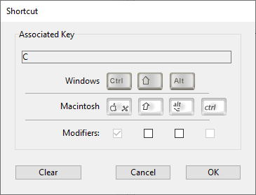

Vous pouvez définir plusieurs propriétés à partir des lignes de menu, telles que des actions, des styles de police, les lignes de séparation, des raccourcis clavier ou des icônes.

## Titre

La propriété **Title** contient le libellé d'un menu ou d'une ligne de menu, tel qu'il sera affiché dans l'interface de l'application.

Dans l'éditeur de menus, vous pouvez saisir directement le libellé "en dur". Vous pouvez également saisir une référence pour une variable ou un élément XLIFF, ce qui facilitera la mise à jour et la traduction des applications. Vous pouvez utiliser types de références suivants :

- Une référence à une ressource XLIFF, du type :xliff:MonLibellé. Pour plus d’informations sur les références XLIFF, reportez-vous à la section *Annexe B : Architecture XLIFF* du *Mode Développement 4D*.
- Un nom de variable interprocess suivi d’un chiffre, par exemple :`:<>vlang,3`. Il suffit de changer le contenu de cette variable pour modifier le libellé du menu lors de son affichage. Dans ce cas, le libellé fera appel à une ressource XLIFF. La valeur contenue dans la variable `<>vlang` correspond à l’attribut *id* de l’élément *group*. La seconde valeur (3 dans cet exemple) désigne l’attribut *id* de l’élément *trans-unit*.

En utilisant le langage 4D, vous définissez la propriété Title à l'aide du paramètre *itemText* des commandes `APPEND MENU ITEM`, `INSERT MENU ITEM`, et `SET MENU ITEM`.

### Caractères de contrôle

Il est possible de définir les propriétés des lignes de menus en insérant des caractères de contrôle (“métacaractères”) directement dans les libellés des commandes de menus. Par exemple, vous pouvez associer le raccourci-clavier Ctrl+G (ou Commande+G sous macOS) à une ligne de menu en plaçant les caractères "/G" dans son libellé.

Les caractères de contrôle n’apparaissent pas dans les libellés des commandes de menus. Vous devez donc les éviter afin de ne pas obtenir d’effets indésirables. Ces caractères sont les suivants :

| Caractère            | Description                   | Utilisation                                                                                                      |
| -------------------- | ----------------------------- | ---------------------------------------------------------------------------------------------------------------- |
| ( | parenthèse ouvrante           | Désactiver la ligne                                                                                              |
| \<B                  | inférieur à B                 | Gras                                                                                                             |
| \<I                  | inférieur à I                 | Italique                                                                                                         |
| \<U                  | inférieur à U                 | Souligné                                                                                                         |
| !+caractère          | point d'exclamation+caractère | Caractère d'ajout sous forme de coche (macOS); ajouter une coche (Windows) |
| /+caractère          | slash+caractère               | Ajouter un caractère comme raccourci                                                                             |

## Paramètres

Il est possible d’associer un paramètre personnalisé à chaque ligne de menu. Un paramètre de ligne de menu est une chaîne de caractères dont le contenu est libre. Il peut être défini dans l'éditeur de menu ou à l'aide de la commande `SET MENU ITEM PARAMETER`.

Les paramètres de lignes de menus sont utiles pour la gestion programmée des menus, en particulier lors de l’utilisation des commandes `Dynamic pop up menu`, `Get menu item parameter` et `Get selected menu item parameter`.

## Action

Chaque commande de menu peut avoir une méthode projet ou une action standard qui lui est associée. Lorsqu’une ligne de menu est sélectionnée, 4D exécute l’action standard ou la méthode projet qui lui est associée. Par exemple, la ligne **Etat** peut appeler une méthode projet qui prépare un état mensuel à partir d’une table contenant des données financières. La ligne **Couper** peut appeler l’action standard `Couper` pour placer la sélection dans le Presse-papiers et l’effacer de la fenêtre de premier plan.

Si aucune méthode ou action standard n'est affectée à une commande de menu, le choix de cette commande provoquera la fermeture du mode Application et l'ouverture du mode Développement. Si seul le mode Application est disponible, ce qui signifie un retour au Desktop.

Standard actions can be used to carry out various current operations linked to system functions (copy, quit, etc.) or to those of the database (add record, select all, etc.).

Vous pouvez associer à la fois une action standard et une méthode projet à une commande de menu. Dans ce cas, l’action standard n’est jamais exécutée ; toutefois, 4D utilise cette action pour activer/inactiver la commande de menu en fonction du contexte et pour associer une opération spécifique en fonction de la plateforme. Lorsqu’une commande de menu est inactivée, la méthode projet associée ne peut être exécutée.

Vous choisissez d’associer une action standard ou une méthode projet à la commande de menu en fonction du type de résultat attendu. En principe, il est préférable de choisir une action standard lorsque cela est possible car les actions standard mettent en oeuvre des mécanismes optimisés, notamment l'activation/inactivation de la ligne en fonction du contexte.

### Associer une méthode projet ou une action standard

Pour associer une méthode projet et/ou une action standard à une commande de menu sélectionnée dans l'éditeur de menu :

- **Nom de la méthode** : sélectionnez une méthode projet existante dans la combo box. If the project method does not exist, enter its name in the "Method Name" combo box then click on the [...] bouton. 4D affiche une boîte de dialogue de création de méthode de projet qui permet d'accéder à l'éditeur de code.
- **Action standard associée** : Choisissez ou saisissez le nom de l’action que vous souhaitez associer dans la combo box "Action standard associée". Vous pouvez saisir toute action prise en charge et (optionnellement) tout paramètre dans la zone. Pour la liste complète des actions standard, veuillez vous reporter à la section **Actions standard** dans le *Mode Développement*.
  **Note macOS :** Sous macOS, les commandes de menus créés associées à l'action *Quitter* sont automatiquement placées dans le menu de l’application, conformément aux normes d’interface de cette plate-forme.

A l'aide du langage 4D, vous pouvez associer une méthode projet via la commande `SET MENU ITEM METHOD` et une action standard via la commande `SET MENU ITEM PROPERTY`.

### Démarrer un process

L'option **Démarrer un nouveau process** est disponible pour les commandes de menu associées à des méthodes. Elle peut être définie via une case à cocher dans l'éditeur de menus, ou via le paramètre *property* de la commande `SET MENU ITEM PROPERTY`.

Lorsque l'option **Démarrer un nouveau process** est activée, un nouveau process est créé lorsque la commande de menu est choisie.
Normalement, une méthode associée à une commande de menu est exécutée dans le process courant, à moins que vous n'appeliez explicitement un autre process dans votre code. La case à cocher **Démarrer un nouveau process** facilite le lancement d'un nouveau process. Si vous la sélectionnez, 4D créera un nouveau process lorsque la commande de menu sera sélectionnée.

Dans la liste des process, 4D affecte au nouveau process un nom par défaut “ML_NumeroProcess”.
Les noms des process lancés à partir d’une ligne de menu sont créés en combinant le préfixe “ML_” avec le numéro de process.

### Exécuter sans valider

L'option **Exécuter sans valider** est disponible pour les commandes de menu associées à des actions standard uniquement dans l'éditeur de menus.

Lorsque cette option est cochée, 4D ne provoquera pas la “validation” du champ dans lequel se trouve le curseur avant d’exécuter l’action associée.
Cette option est principalement destinée aux commandes du menu **Edition**. Par défaut, 4D traite et “valide” le contenu d’un champ avant d’exécuter une action standard (via une commande de menu ou un raccourci-clavier), ce qui a pour effet de générer un événement formulaire `Sur données modifiées`. Ce principe peut gêner le fonctionnement des commandes du type copier ou coller, car au moment de leur appel, l’événement `Sur données modifiées` est généré de manière inopinée. Dans ce cas, il est utile de cocher l’option **Exécuter sans valider**.

## Privilèges d'accès à distance

Cette option de l'éditeur de menus permet de définir un groupe pour une commande de menu afin que seuls les utilisateurs de ce groupe puissent utiliser la commande de menu depuis un 4D distant (voir Utilisateurs et groupes).

## Options

### Ligne de séparation

Les groupes de commandes de menus peuvent être séparés par un filet. Cette fonctionnalité est utile pour rassembler les commandes de menus par fonction.

Vous ajoutez un filet de séparation en créant une commande de menu.

Dans l'éditeur de menus, au lieu de saisir le nom de la commande de menu, il suffit de cocher l’option **Ligne de séparation**. La ligne apparaît alors dans la zone de la commande courante. Lorsque cette option est cochée, les autres propriétés sont sans effet.
**Note :** Sous macOS, il est possible de procéder en faisant commencer le nom de la commande par un tiret “-”. Cette commande sera alors affichée comme une ligne de séparation.

Dans le langage 4D, vous insérez une ligne de séparation en saisissant `-` ou `(-` comme itemText pour les commandes `APPEND MENU ITEM`, `INSERT MENU ITEM`, ou `SET MENU ITEM`.

### Raccourcis clavier

Vous pouvez affecter des raccourcis clavier à toute commande de menu. Lorsqu’une commande de menu se voit affecter un raccourci clavier, il s’affiche en face de son libellé. Par exemple, “Ctrl+C” (Windows) ou “Commande+C” (macOS) apparaît en face de la commande de menu **Copier** dans le menu **Edition**.

Vous pouvez également ajouter les touches **Majuscule** ainsi que **Alt** (Windows) ou **Option** (macOS) au raccourci clavier associé à une commande. Cette possibilité multiplie le nombre de raccourcis clavier utilisables dans les barres de menus. Les raccourcis clavier définis peuvent donc être de différents types :

- Sous Windows :
  - Ctrl+lettre
  - Ctrl+Maj+lettre
  - Ctrl+Alt+lettre
  - Ctrl+Maj+Alt+lettre

- Sous macOS :
  - Commande+lettre
  - Commande+Maj+lettre
  - Commande+Option+lettre
  - Commande+Maj+Option+lettre

> Lorsque vous utilisez des actions standard, il est conseillé de conserver les raccourcis clavier qui leur sont associés par défaut.

Vous pouvez utiliser toute touche alphanumérique comme raccourci clavier, hormis celles qui sont utilisées par les commandes de menus standard qui apparaissent dans les menus **Editer** et **Fichier**, et les clés réservées aux commandes de menu 4D.

Les combinaisons réservées sont décrites dans le tableau suivant :

| Clé (Windows)                  | Clé (macOS)                        | Opération               |
| ------------------------------------------------- | ----------------------------------------------------- | ----------------------- |
| Ctrl+C                                            | Commande+C                                            | Copier                  |
| Ctrl+Q                                            | Commande+Q                                            | Quitter                 |
| Ctrl+V                                            | Commande+V                                            | Coller                  |
| Ctrl+X                                            | Commande+X                                            | Couper                  |
| Ctrl+Z                                            | Commande+Z                                            | Annuler                 |
| Ctrl+. (point) | Commande+. (point) | Arrêter action en cours |

Pour affecter un raccourci clavier dans l'éditeur de menus :

Sélectionnez la ligne de menu à laquelle vous souhaitez affecter un raccourci clavier.
Click on the [...] button to the right of the "Shortcut" entry area. La fenêtre suivante apparaît :

Saisissez le caractère à utiliser puis (facultatif) cochez les options **Majuscule** et/ou **Alt** (**Option**) en fonction de la combinaison que vous souhaitez obtenir.
Vous pouvez également appuyer sur les touches constituant la combinaison (n’appuyez pas sur la touche **Ctrl/Commande**).

> Il n’est pas possible de désélectionner la touche Ctrl/Commande, elle est obligatoire dans les raccourcis clavier des menus.
> Pour recommencer, cliquez sur la touche **Effacer**. Cliquez sur **OK** pour valider la modification. Le raccourci défini est représenté dans la zone “Raccourci clavier” .

Pour affecter un raccourci clavier à l'aide du langage 4D, utilisez la commande `SET ITEM SHORTCUT`.

> Un objet actif peut aussi avoir un raccourci clavier. Si la touche **Ctrl/Commande** est sujette à un conflit, l’objet actif sera prioritaire.

### Ligne active

Dans l'éditeur de menus, vous pouvez spécifier si une ligne est activée ou désactivée. Une commande de menu activée peut être choisie par l’utilisateur ; une commande de menu désactivée est grisée et ne peut pas être choisie. Pour désactiver une ligne de menu, désélectionnez l’option **Ligne active**. Dans ce cas, la ligne apparaît grisée dans le menu et ne peut pas être sélectionnée.

Par défaut, 4D active automatiquement toute commande de menu ajoutée à un menu personnalisé. Vous pouvez désactiver une commande afin, par exemple, de l’activer uniquement par programmation (commandes `ENABLE MENU ITEM` et `DISABLE MENU ITEM`).

### Coche

Cette option de l'éditeur de menus permet d’associer par défaut une coche système à la ligne de menu. Vous pourrez ensuite gérer (masquer ou afficher) la coche au moyen des commandes du langage (`SET MENU ITEM MARK` et `Get menu item mark`).

Les coches sont généralement utilisées pour des menus à action permanente et indiquent que l’action est en cours.

### Styles des polices

4D vous permet de personnaliser les menus en appliquant différents styles de caractères aux commandes de menus. Vous pouvez personnaliser vos menus avec les styles Gras, Italique ou Souligné, ou à l'aide de la commande `SET MENU ITEM STYLE`.

En règle générale, les styles de police doivent être appliqués à vos menus avec parcimonie, afin d’éviter de conférer une apparence confuse à votre application.

> Vous pouvez également appliquer un style en saisissant des caractères spéciaux dans le titre du menu (voir [Caractères de contrôle](properties.md#using-control-characters) ci-dessus).

### Icône ligne

Vous pouvez associer une icône à une ligne de menu. Elle sera affichée directement dans le menu, à côté de la ligne :

Pour définir l’icône dans l'éditeur de menu, choisissez l'option **Ouvrir** pour ouvrir un fichier image à partir du disque. Lorsque vous sélectionnez un fichier image qui n'est pas stocké dans le dossier Resources du projet, il est automatiquement copié dans ce dossier. Une fois définie, l’icône de ligne apparaît dans la zone d’aperçu :

Pour supprimer l’icône de ligne, choisissez l’option **Pas d’icône** dans le menu de la zone “Icône ligne”.

Pour définir ds icônes de ligne à l'aide du langage 4D, appelez la commande `SET MENU ITEM ICON`.
