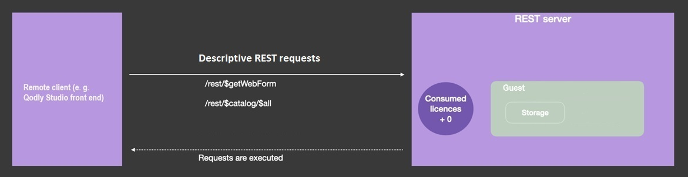

## Sessions

Lorsque les [sessions évolutives sont activées](WebServer/sessions.md#activer-les-sessions) (recommandé), les requêtes REST peuvent créer et utiliser des [sessions utilisateur web](WebServer/sessions.md), offrant des fonctionnalités supplémentaires telles que la gestion de requêtes multiples, le partage de données entre les process web clients et le contrôle des privilèges utilisateur.

Lorsqu'une session utilisateur web est ouverte, vous pouvez la gérer via l'objet `Session` et l'[API de session](API/SessionClass.md). Les requêtes REST ultérieures réutilisent le même cookie de session.

Une session est ouverte après que l'utilisateur a été connecté avec succès (voir ci-dessous).

> - Sur 4D Server, l'ouverture d'une session REST nécessite une licence client 4D disponible.<br/>
> - Sur 4D mono-utilisateur, vous pouvez ouvrir jusqu'à trois sessions REST à des fins de test.

## Mode Force login

:::note Compatibilité

L'ancien mode de connexion basé sur la méthode base `On REST Authentication` est **déprécié** à partir de 4D 20 R6. Il est maintenant recommandé d'[utiliser le **mode Force login**](../ORDA/privileges.md#fichier-rolesjson) (automatiquement activé dans les nouveaux projets) et de mettre en œuvre la fonction [`ds.authentify()`](#dsauthentify). Dans les projets convertis, [un bouton dans la boîte de dialogue des Paramètres](../settings/web.md#activate-rest-authentication-through-dsauthentify-function) vous aide à mettre à niveau votre configuration. Dans Qodly Studio for 4D, le mode peut être défini en utilisant l'option [**Force login**](../WebServer/qodly-studio.md#force-login) dans l'onglet Privileges.

:::

La séquence de connexion d'un utilisateur est la suivante :

1. Lors de la première requête REST (pour un appel de formulaire web par exemple), une session utilisateur web "guest" est créée. Elle n'a aucun privilège, aucun droit d'exécuter des requêtes autres que des [requêtes REST descriptives](#descriptive-rest-requests), aucune licence n'est consommée.\
   Les requêtes REST descriptives sont toujours traitées par le serveur, même si aucune session utilisateur web utilisant une licence n'est ouverte. Dans ce cas, elles sont traitées à travers des sessions "guest".

2. Vous appelez votre fonction [`authentify()`](#authentify) (créée au préalable), dans laquelle vous vérifiez les informations d'identification de l'utilisateur et appelez [`Session.setPrivileges()`](../API/SessionClass.md#setprivileges) avec les privilèges appropriés. `authentify()` doit être une [fonction de datastore class](../ORDA/ordaClasses.md#datastore-class) exposée.

3. La requête `/rest/$catalog/authentify` est envoyée au serveur avec les informations d'identification de l'utilisateur. This step only requires a basic login form that do not access data; it can be a [Qodly form](../WebServer/qodly-studio.md) (called via the `/rest/$getWebForm` request).

4. If the user is successfully authentified, a 4D license is consumed on the server and all REST requests are accepted.


In the user login phase, license usage is disconnected from web user sessions. A license is required only when the [`Session.setPrivileges()`](../API/SessionClass.md#setprivileges) is executed, allowing you to control the number of used licenses.

All other REST requests (handling data or executing a function) will only be processed if they are executed within a web session with appropriate privileges, otherwise they return an error. To assign privileges to a web session, you need to execute the [`Session.setPrivileges()`](../API/SessionClass.md#setprivileges) function for the session. Executing this function triggers the 4D license consumption.

### Descriptive REST requests

Descriptive REST requests can be processed in web user sessions that do not require licenses ("guest" sessions). These requests are:

- [`/rest/$catalog`]($catalog.md) requests (e.g. `/rest/$catalog/$all`) - access to available dataclasses
- `/rest/$catalog/authentify` - the datastore function used to login the user
- `/rest/$getWebForm` - the rendering of a Qodly form



## `Function authentify`

### Syntaxe

```4d
exposed Function authentify({params : type}) {-> result : type}
	// code
```

The `authentify()` function must be implemented in the [DataStore class](../ORDA/ordaClasses.md#datastore-class) of the project and must be called through a REST request.

This function is the only available entry point from REST guest sessions when the "force login" mode is enabled: any other function call or data access is rejected until the session acquires appropriate privileges.

:::note

The `authentify()` function can always be executed by a REST guest session, whatever the [`roles.json` file](../ORDA/privileges.md#rolesjson-file) configuration.

:::

The function can receive any authentication or contextual information as [parameter(s)](ClassFunctions.md#parameters) and can return any value. Since this function can only be called from a REST request, parameters must be passed through the body of the POST request.

This function should contain two parts:

- some code to identify and authenticate the REST request sender,
- if the authentication is successful, a call to [`Session.setPrivileges()`](../API/SessionClass.md#setprivileges) that assigns appropriate privileges to the session.

If the function does not call [`Session.setPrivileges()`](../API/SessionClass.md#setprivileges), no privileges are assigned, no license is consumed and subsequent non-descriptive REST requests are rejected.

### Exemple

You only want to know users to open a web session on the server. You created the following `authentify()` function in the datastore class:

```4d
exposed Function authentify($credentials : Object) : Text

var $users : cs.UsersSelection
var $user : cs.UsersEntity

$users:=ds.Users.query("name = :1"; $credentials.name)
$user:=$users.first()

If ($user#Null) //the user is known
	If (Verify password hash($credentials.password; $user.password))
		Session.setPrivileges("vip")
	Else

		return "Wrong password"
	End if
Else
        return "Wrong user"
End if
```

To call the `authentify()` function:

**POST** `127.0.0.1:8111/rest/$catalog/authentify`

Corps de la requête :

```json
[{"name":"Henry",
"password":"123"}]
```
