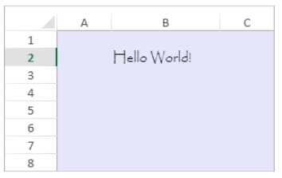

<!-- REF #_method_.VP Get default style.Syntax -->

**VP Get default style** ( *vpAreaName* : Text { ; *sheet* :  Integer } ) : Object<!-- END REF -->

<!-- REF #_method_.VP Get default style.Params -->

| Paramètres | Type    |                             | Description                                                                 |                  |
| ---------- | ------- | --------------------------- | --------------------------------------------------------------------------- | ---------------- |
| vpAreaName | Text    | ->                          | Nom d'objet formulaire zone 4D View Pro                                     |                  |
| sheet      | Integer | ->                          | Numéro d'indice de la feuille (feuille courante si omis) |                  |
| Résultat   | Object  | <- | Default style settings                                                      | <!-- END REF --> |

#### Description

The `VP Get default style` command <!-- REF #_method_.VP Get default style.Summary -->returns a default style object for a sheet<!-- END REF -->. The returned object contains basic document rendering properties as well as the default style settings (if any) previously set by the [VP SET DEFAULT STYLE](vp-set-default-style.md) method. For more information about style properties, see [Style Objects & Style Sheets](../configuring.md#style-objects--style-sheets).

Dans *vpAreaName*, passez le nom de la zone 4D View Pro. Si vous passez un nom inexistant, une erreur est retournée.

You can define where to get the column count in the optional *sheet* parameter using the sheet index (counting begins at 0). Si le paramètre est omis ou si vous passez `vk current sheet`, la feuille courante est utilisée.

#### Exemple

Pour lire les détails du style par défaut de ce document :



Le code suivant :

```4d
$defaultStyle:=VP Get default style("myDoc")
```

will return this information in the *$defaultStyle* object:

```4d
{
 backColor:#E6E6FA,
 hAlign:0,
 vAlign:0,
 font:12pt papyrus
}
```

#### Voir également

[VP Get cell style](vp-get-cell-style.md)<br/>
[VP SET DEFAULT STYLE](vp-set-default-style.md)
