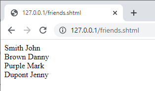

Cette section d'initiation est destinée aux nouveaux utilisateurs qui souhaitent avoir une vue d'ensemble sur la façon de créer à partir de rien un site Web 4D qui gère des données provenant de la base. C'est parti !

## Hello World Example

Commençons par faire en sorte que le serveur web envoie "Hello World" au navigateur. La manière la plus simple de faire cela est de créer un projet, démarrer le serveur web et écrire un petit code qui retourne un texte dans la méthode base `On Web Connection`.

### Démarrer le serveur web

Pour démarrer le Serveur Web 4D:

1. Lancez votre application 4D et créez un nouveau projet 4D vide.
2. Dans le menu **Exécution**, sélectionnez **Démarrer le serveur Web**.

C'est tout ! Le serveur web est démarré (vous pouvez voir que l'élément de menu est devenu **Arrêter le serveur web**). Il est maintenant prêt à traiter les requêtes. Pour le vérifier, nous allons afficher la page d'accueil par défaut.

### Affichage de la page home par défaut

Le serveur web 4D crée automatiquement une page `index.html` par défaut dans le dossier racine `WebFolder` par défaut, créé au même niveau que le dossier Project.

1. Lancez un navigateur web et connectez-vous à l'adresse IP du serveur web (le port http par défaut pour le serveur web 4D est 80). Si le serveur web et le navigateur sont sur la même machine, vous pouvez sélectionner **Tester le serveur Web** dans le menu **Exécution**.

La page d'accueil par défaut est affichée :


### Affichage de Hello World

1. Ouvrez l'Explorateur, affichez la liste des méthodes base et double-cliquez sur `On Web Connection`.

2. Saisissez le code suivant :

```4d
Case of 
	: ($1="/hello")
		WEB SEND TEXT("Hello World!")
	Else 
		// Error 404 par exemple
End case 
```

La méthode base [`On Web Connection`](httpRequests.md#on-web-connection) est appelée pour les requêtes entrantes et reçoit l'URL cible dans le paramètre `$1`. Ce code très simple envoie simplement le texte au navigateur.

3. Dans votre navigateur, saisissez l'URL suivante :

```
http://localhost/hello
```

Le serveur web traite la demande et renvoie :


## Obtenir des données à partir de la base

Maintenant, nous allons voir à quel point il est simple de récupérer des données de la base. Tout d'abord, nous allons créer une table et la remplir avec quelques données.

Créez une base de données basique avec, par exemple, une seule table contenant quelques enregistrements :


### Affichage des données dans une page

La solution la plus simple pour afficher des données est d'appeler une [page de modèle](templates.md) contenant des balises.

1. À l'aide de n'importe quel éditeur de texte, créez un fichier contenant les lignes suivantes :

```html
<html>
<body>
<!--#4DCODE ALL RECORDS([Friends])-->
<!--#4DLOOP [Friends]-->
<!--#4DTEXT [Friends]lastName--> <!--#4DTEXT [Friends]firstName--><br/>
<!--#4DENDLOOP-->
</body>
</html>
```

2. Nommez le fichier "friends.shtml" et enregistrez-le dans le dossier **WebFolder** de votre projet.
3. Dans votre navigateur, saisissez l'URL suivante :

```
http://localhost/friends.shtml
```

Les pages `.shtml` sont automatiquement traitées par le serveur web. Votre page remplie avec les données est renvoyée :



### REST request

If we not only want to *display* data, but to *use* it, we can use ORDA and the REST server. Thanks to the [ORDA concept](ORDA/overview.md), the `Friends` table is automatically mapped to a dataclass and is available through [REST](REST/gettingStarted.md).

1. Nous allons utiliser le serveur REST pour accéder aux données : dans la boîte de dialogue des \*\* Paramètres\*\*, sélectionnez **Web** > **Fonctionnalités Web**, et cochez l'option **Exposer en tant que serveur REST**.


2. Dans votre navigateur, saisissez l'URL suivante :

```
http://localhost/rest/$catalog
```

The web server returns the results in JSON:

```json
{
	"__UNIQID": "3F1B6ACFFE12B64493629AD76011922D",
	"dataClasses": [
		{
			"name": "Friends",
			"uri": "/rest/$catalog/Friends",
			"dataURI": "/rest/Friends"
		}
	]
}
```

You get the catalog, i.e. the list of exposed dataclasses and attributes in the datastore.

You can also get any data.

3. Enter the following URL:

```
http://localhost/rest/Friends
```

The server returns the entities, i.e. the data, from the Friends dataclass:

```json
{
	"__DATACLASS": "Friends",
	"__entityModel": "Friends",
	"__GlobalStamp": 0,
	"__COUNT": 4,
	"__FIRST": 0,
	"__ENTITIES": [
		{
			"__KEY": "1",
			"__TIMESTAMP": "2020-10-27T14:29:01.914Z",
			"__STAMP": 1,
			"ID": 1,
			"lastName": "Smith",
			"firstName": "John"
		},
		{
			"__KEY": "2",
			"__TIMESTAMP": "2020-10-27T14:29:16.035Z",
			"__STAMP": 1,
			"ID": 2,
			"lastName": "Brown",
			"firstName": "Danny"
		},
		{
			"__KEY": "3",
			"__TIMESTAMP": "2020-10-27T14:29:43.945Z",
			"__STAMP": 1,
			"ID": 3,
			"lastName": "Purple",
			"firstName": "Mark"
		},
		{
			"__KEY": "4",
			"__TIMESTAMP": "2020-10-27T14:34:58.457Z",
			"__STAMP": 1,
			"ID": 4,
			"lastName": "Dupont",
			"firstName": "Jenny"
		}
	],
	"__SENT": 4
}
```

This very simple example shows how the web server interacts transparently with the [REST server](REST/gettingStarted.md) to return any requested data, provided it is exposed. In your web interfaces, you can easily bind the javascript or html code with returned data. See the built-in [Web Data Explorer](Admin/dataExplorer.md) to have an example of sophisticated web interface bound to dataclasses.

## Login and session

In the above sections, we get free access to the application from web requests. However, in the world of web applications, data access security is the first priority. When connecting to the 4D web server, users must be authentified and their navigation controlled.

### Creating a table of users

The most simple and secured way to log a user on the 4D web server is based upon the following scenario:

- Users are stored in a dedicated, unexposed table (named *WebUsers* for example)
- The *WebUsers* table could be [encrypted](MSC/encrypt.md) and stores the user login and a hash of their password.

1. Create a table with some fields, for example:


2. Write and execute the following code to create a user:

```4d
var $webUser : cs.WebUsersEntity

$webUser:=ds.WebUsers.new()
$webUser.firstName:="John"
$webUser.lastName:="Doe"
// the password would be entered by the user
$webUser.password:=Generate password hash("123")
$webUser.userId:="john@4d.com"
$webUser.save()
```

### Authentification des utilisateurs

> To be secure from end to end, it is necessary that the whole connection is established via [https](webServerConfig.md#enable-https).

1. Open the Explorer and create a project method named "login".

2. Write the following code:

```4d
var $indexUserId; $indexPassword : Integer
var $userId; $password : Text
var $user; $info : Object
ARRAY TEXT($anames; 0)
ARRAY TEXT($avalues; 0)

// get values sent in the header of the request
WEB GET VARIABLES($anames; $avalues)

// look for header login fields
$indexUserId:=Find in array($anames; "userId")
$userId:=$avalues{$indexUserId}
$indexPassword:=Find in array($anames; "password")
$password:=$avalues{$indexPassword}

//look for a user with the entered name in the users table
$user:=ds.WebUsers.query("userId = :1"; $userId).first()

If ($user#Null) //a user was found
		//check the password
    If (Verify password hash($password; $user.password))
    		//password ok, fill the session
        $info:=New object()
        $info.userName:=$user.firstName+" "+$user.lastName
        Session.setPrivileges($info)
        	//You can use the user session to store any information
        WEB SEND TEXT("Welcome "+Session.userName)
    Else 
        WEB SEND TEXT("Wrong user name or password.")
    End if 
Else 
    WEB SEND TEXT("Wrong user name or password.")
End if 
```

3. Display the method properties by clicking on the **[i]** button in the code editor, check the `4D tags and URLs (4DACTION...)` option and click **OK**.


4. Dans votre navigateur, saisissez l'URL suivante :

```
http://localhost/4DACTION/login/?userID=john@4d.com&password=123
```

> Using such URLs is not recommended, it is only presented here to keep the example simple. A more realistic login request must be handled through a web form and a POST request. See [this page](sessions.md#example) for an example of form POST.

Then you will be logged for the session:


Wrong credentials would be rejected:


Once a user is logged, you can handle the associated session using the `WEB Get Current Session ID` method. See the [User sessions](sessions.md) page.
