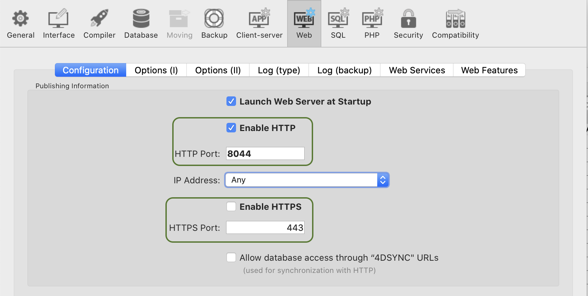

:::caution Developer Preview

Qodly Studio pour 4D est actuellement en phase **Developer Preview**. Il ne doit pas être utilisé en production.

:::

**Qodly Studio** est un constructeur d'interface pour des applications web. It provides developers with a graphical page editor to design applications running in web browsers or smartphones. Il prend en charge nativement les [objets ORDA](../ORDA/overview.md).

Vous pouvez utiliser Qodly Studio directement depuis votre environnement **4D** pour construire des interfaces modernes et sophistiquées que vous pouvez facilement intégrer à vos projets 4D existants et déployer **on premise** (sur site).

Qodly Studio peut également être utilisé sur la [**plateforme Qodly Cloud**](https://qodly.com), dédiée au développement d'applications web métier.

With Qodly Studio, you will discover a totally new web UI, get familiar with the concept of Qodly Sources, and learn how to:

- create Qodly pages by placing components on a canvas
- associer les composants à des données
- déclencher du code 4D en configurant des événements
- et bien plus encore !

:::info

Le développement avec Qodly Studio pour 4D nécessite au moins une [licence Partenaire 4D Silver ](https://us.4d.com/4d-partner-program). Les options et les éléments de menu de Qodly Studio n'apparaîtront pas si la licence n'est pas activée.

:::

## Configuration

### Conditions requises

#### Navigateur

Qodly Studio prend en charge les navigateurs Web suivants :

- Chrome
- Edge
- FireFox

La résolution recommandée est de 1920x1080.

#### Application 4D

- Développement : 4D 20 R2 ou version ultérieure
- Déploiement : 4D Server 20 R2 ou version ultérieure
- Qodly Studio ne fonctionne qu'avec des projets 4D (les bases de données binaires ne sont pas prises en charge).
- Les sessions web (*également appelées sessions évolutives*) doivent [être activées](sessions.md#enabling-web-sessions).
- Le code 4D appelé par les pages Qodly doit être [thread-safe](preemptiveWeb.md).

### Activer l'accès à Qodly Studio

Par défaut, l'accès à Qodly Studio n'est pas accordé.

Qodly Studio est alimenté par le [serveur WebAdmin](../Admin/webAdmin.md) et affiche les données des projets 4D gérés par le [serveur web 4D](webServer.md).

Pour permettre l'accès à Qodly Studio, vous devez explicitement autoriser deux niveaux :

- niveau 4D (4D ou 4D Server)
- niveau projet

Si l'un des deux niveaux (ou les deux) n'est pas activé, l'accès à Qodly Studio est refusé (une page 403 est renvoyée).

#### Au niveau 4D

Comme premier niveau de sécurité, vous devez [autoriser l'accès à Qodly Studio sur le serveur WebAdmin](../Admin/webAdmin.md#enable-access-to-qodly-studio). Ce paramètre s'applique à l'application 4D (4D ou 4D Server) sur la machine hôte. Tous les projets ouverts avec cette application 4D tiennent compte de ce paramètre.

Laissez cette option désélectionnée si vous voulez vous assurer qu'aucun accès à Qodly Studio n'est autorisé sur l'application. Cochez cette option pour rendre possible l'accès à Qodly Studio. Cependant, vous devez aussi l'activer au niveau de chaque projet.

De plus, vous pouvez [configurer le port HTTP/HTTPS utilisé par le serveur web WebAdmin](../Admin/webAdmin.md#accept-http-connections-on-localhost).

:::note

Après toute modification de ces paramètres, vous devez [redémarrer le serveur WebAdmin](../Admin/webAdmin.md#start-and-stop) pour que la nouvelle configuration soit effective.

:::

#### Au niveau du projet

Après avoir activé l'accès à Qodly Studio au niveau 4D, vous devez désigner explicitement chaque projet qui peut être consulté. L'option **Activer l'accès à Qodly Studio** doit être activée sur la [page Fonctionnalités Web des Propriétés de l'application 4D](../settings/web.md#enable-access-to-qodly-studio).

N'oubliez pas que les [propriétés utilisateurs](../settings/overview.md) peuvent être définies à plusieurs niveaux et que des priorités s'appliquent.

### Activation de l'authentification

L'authentification sur le serveur WebAdmin utilise une access key (clé d'accès). Pour plus de détails, voir [Access key](../Admin/webAdmin.md#access-key).

### Gestion du projet

Conformément à la gestion des projets 4D, seules les utilisations suivantes sont prises en charge :

- le développement avec Qodly Studio s'effectue avec **4D** (monoposte).
- le déploiement d'applications 4D alimentées par les pages Qodly s'effectue avec **4D Server**.

## Ouverture de Qodly Studio

La page Qodly Studio est disponible lorsque le [serveur WebAdmin est lancé](../Admin/webAdmin.md#start-and-stop) et l'authentification est activée (voir ci-dessus).

Il y a deux façons d'accéder à Qodly Studio :

- à partir de votre application 4D mono-utilisateur, allez dans **Développement** > **Qodly Studio...**.
  Si le serveur WebAdmin est déjà en cours d'exécution, selon sa configuration, votre navigateur par défaut s'ouvre à l'adresse `IPaddress:HTTPPort/studio` ou `IPaddress:HTTPSPort/studio`. Sinon, vous serez invité à démarrer d'abord le serveur web WebAdmin.

- sur un navigateur, avec le serveur WebAdmin en cours d'exécution (lancé à partir de 4D ou 4D Server), entrez l'adresse suivante :

`IPaddress:HTTPPort/studio`

ou :

`IPaddress:HTTPSPort/studio`

Par exemple, après avoir lancé un serveur web local sur le port 7080, saisissez cette adresse dans votre navigateur :

`localhost:7080/studio`

Vous serez ensuite invité à saisir l'[access key](../Admin/webAdmin.md#access-key) pour accéder à Qodly Studio.

## Utilisation de Qodly Studio

### Documentation

La documentation officielle de Qodly Studio est disponible sur le [site web de documentation de Qodly](https://developer.qodly.com/docs/studio/overview).

Vous pouvez vous appuyer sur cette documentation et ses ressources associées pour développer des applications web alimentées par les pages Qodly. Cependant, en fonction de la phase de mise en œuvre, les développeurs 4D utiliseront soit Qodly Studio, soit 4D IDE (voir [Comparaison des fonctionnalités](#feature-comparison)).

Les exemples de code sont fournis en [QodlyScript](https://developer.qodly.com/docs/category/qodlyscript), mais étant donné que QodlyScript hérite du langage 4D, vous ne serez pas perdu. Pour plus d'informations, consultez la page [De QodlyScript au langage 4D](from-qodlyscript-to-4d.md).

:::info

Il n'y a pas de compatibilité directe entre les applications implémentées avec 4D et les applications implémentées avec Qodly.

:::

### Comparatif des fonctionnalités

|                                                                                                    | Qodly Studio pour les développeurs 4D utilisant l'IDE 4D                                                           | Qodly Studio pour les développeurs Qodly                                       |
| -------------------------------------------------------------------------------------------------- | ------------------------------------------------------------------------------------------------------------------ | ------------------------------------------------------------------------------ |
| Afficher et modifier les tableaux (dataclasses), les attributs et les relations | Éditeur de structure 4D(1)                                                                      | Éditeur de modèles de Qodly Studio                                             |
| Qodly pages                                                                                        | Qodly Studio Page Editor                                                                                           | Qodly Studio Page Editor                                                       |
| Formulaires Desktop                                                                                | 4D IDE                                                                                                             | *non supporté*                                                                 |
| Langage de programmation                                                                           | Langage 4D avec ORDA                                                                                               | [QodlyScript](https://developer.qodly.com/docs/category/qodlyscript) avec ORDA |
| IDE code                                                                                           | Éditeur de code 4D IDE/VS Code avec [extension 4D](https://github.com/4d/4D-Analyzer-VSCode)(2) | Éditeur de code Qodly Studio                                                   |
| Débogueur                                                                                          | 4D IDE debugger                                                                                                    | Débogueur Qodly Studio                                                         |
| Rôles et privilèges REST/Web                                                                       | Edition directe roles.json / Éditeur de rôles et privilèges de Qodly Studio                        | Éditeur de rôles et privilèges de Qodly Studio                                 |

(1) Si vous cliquez sur le bouton **Model** dans Qodly Studio, rien ne se passe.
(2) Lorsque vous ouvrez du code 4D dans Qodly Studio, la coloration syntaxique n'est pas disponible et un avertissement "Lsp not loaded" est affiché.

### Langage

The following commands and classes are dedicated to the server-side management of Qodly pages:

- [`Web Form`](../API/WebFormClass.md#web-form) command: returns the Qodly page as an object.
- [`Web Event`](../API/WebFormClass.md#web-event) command: returns events triggered within Qodly page components.
- [`WebForm`](../API/WebFormClass.md) class: functions and properties to manage the rendered Qodly page.
- [`WebFormItem`](../API/WebFormItemClass.md) class: functions and properties to manage Qodly page components.

### Utilisation des méthodes projet

Nous recommandons d'utiliser les fonctions de classe plutôt que les méthodes projet. Seules les fonctions de classe peuvent être appelées à partir des composants. Cependant, vous pouvez toujours utiliser les méthodes projet dans Qodly Studio de deux manières :

- Vous pouvez appeler vos méthodes à partir des fonctions de classe.
- Vous pouvez directement [exécuter vos méthodes](https://developer.qodly.com/docs/studio/coding#methods-and-classes) depuis l'Explorateur Qodly.

### Utilisation hors ligne

Vous pouvez développer avec Qodly Studio lorsque votre ordinateur n'est pas connecté à internet. Dans ce cas cependant, les fonctions suivantes ne sont pas accessibles :

- [Templates](https://developer.qodly.com/docs/studio/design-webforms/templates): la bibliothèque de templates (modèles) est vide
- UI tips (infobulles interface utilisateur) : ils ne sont pas affichés lorsque vous cliquez sur les icônes .

## Déploiement

### Activation du rendu

Qodly Studio encapsulates Qodly pages, including layout, data connections, and event-driven logic, in a structured JSON file. Ce fichier JSON est traité en temps réel par le **moteur de rendu Qodly** (renderer) pour servir une page web entièrement fonctionnelle.

:::info

See [this page](https://developer.qodly.com/docs/studio/rendering) for detailed information on how to render Qodly pages in Qodly.

:::

To enable the rendering of Qodly pages, the following options must be set.

- L'option **Activer le service REST** du projet 4D dans **Propriétés** > **Web** > **Fonctionnalités Web** doit être activée.
- Le [serveur Web 4D](webServer.md) doit être démarré.

:::note

Les [boutons de rendu](https://developer.qodly.com/docs/studio/rendering#how-to-render-a-webform) ne sont pas disponibles si les options de configuration ne sont pas activées.

:::

### Portée des pages Qodly

Lors du rendu des pages Qodly dans Qodly Studio, le moteur de rendu se connectera au serveur web 4D via HTTP ou HTTPS, en fonction des propriétés, en suivant le même schéma de connexion HTTP/HTTPS que pour le [serveur webAdmin 4D](../Admin/webAdmin.md#accept-http-connections-on-localhost). Voir aussi [ce paragraphe](#about-license_usage) sur les schémas d'URL et l'utilisation de la licence.

Gardez à l'esprit que Qodly Studio fonctionne à travers le serveur web 4D WebAdmin. When you use Qodly Studio as a developer, even when you preview a Qodly Page in the studio, you're using the 4D WebAdmin web server. Cela vous permet de voir les dataclass, les fonctions et les attributs qui ne sont pas exposés en tant que ressources REST par exemple (ils sont grisés).

However, page rendering happens outside Qodly Studio, and is served by the standard 4D web server. Dans cette situation, votre application web ne peut pas accéder aux ressources qui ne sont pas exposées en tant que ressources REST. Voir [Fonctions exposées et non exposées](../ORDA/ordaClasses.md#fonctions-exposees-et-non-exposees) et [Exposer des tables](../REST/configuration.md#exposer-des-tables) pour plus d'informations sur la façon d'exposer des ressources.

### Accessing Qodly pages

Pour le déploiement, le serveur WebAdmin n'est pas nécessaire. L'accès des utilisateurs finaux à votre application web créée avec Qodly Studio est basé sur le protocole REST 4D, et en tant que tel, il fonctionne comme une application distante 4D conventionnelle.

Your Qodly pages are available through the following url:

```
IP:port/$lib/renderer/?w=QodlyPageName
```

...where *IP:port* represents the address of the web server and *QodlyPageName* is the name of the Qodly page.

Par exemple :

```
https://www.myWebSite.com/$lib/renderer/?w=welcome
```

## Force login

With Qodly Studio for 4D, the ["force login" mode](../REST/authUsers.md#force-login-mode) allows you to control the number of opened web sessions that require 4D Client licenses. Vous pouvez également [déconnecter](#logout) l'utilisateur à tout moment pour décrémenter le nombre de licences consommées.

### Configuration

Make sure the ["force login" mode](../REST/authUsers.md#force-login-mode) is enabled for your 4D application in the [Roles and Privileges page](https://developer.qodly.com/docs/studio/roles/rolesPrivilegesOverview/), using the **Force login** option:


Vous pouvez également définir cette option directement dans le fichier [**roles.json**](../ORDA/privileges.md#fichier-rolesjson).

You just need then to implemented the [`authentify()`](../REST/authUsers.md#function-authentify) function in the datastore class and call it from the Qodly page. A licence will be consumed only when the user is actually logged.

:::note Compatibilité

When the legacy login mode ([deprecated as of 4D 20 R6](https://blog.4d.com/force-login-now-is-the-default-mode-for-all-rest-authentications)) is enabled, any REST request, including the rendering of an authentication Qodly page, creates a web session on the server and gets a 4D Client license, whatever the actual result of the authentication. Pour plus d'informations, veuillez vous référer à [cet article de blog](https://blog.4d.com/improved-4d-client-licenses-usage-with-qodly-studio-for-4d) qui détaille ce principe.

:::

#### Exemple

In a simple Qodly page with login/password inputs, a "Submit" button calls the following `authentify()` function we have implemented in the DataStore class:

```4d

exposed Function authentify($credentials : Object) : Text

var $salesPersons : cs.SalesPersonsSelection
var $sp : cs.SalesPersonsEntity

$salesPersons:=ds.SalesPersons.query("identifier = :1"; $credentials.identifier)
$sp:=$salesPersons.first()

If ($sp#Null)
	If (Verify password hash($credentials.password; $sp.password))

		Session.clearPrivileges()
		Session.setPrivileges("") //guest session

		return "Authentication successful"
	Else
		return "Wrong password"
	End if
Else
	return "Wrong user"
End if
```

Cet appel est accepté et tant que l'authentification n'est pas réussie, `Session.setPrivileges()` n'est pas appelée, donc aucune licence n'est consommée. Une fois que `Session.setPrivileges()` est appelée, une licence client 4D est utilisée et toute requête REST est alors acceptée.

### Logout

Quand le [mode "force login" est activé](#setting-the-force-login-mode), Qodly Studio for 4D vous permet d'implémenter une fonctionnalité de déconnexion dans votre application.

To logout the user, you just need to execute the **Logout** standard action from the Qodly page. Dans Qodly Studio, vous pouvez associer cette action standard à un bouton par exemple :


Déclencher l'action de déconnexion d'une session utilisateur Web a les effets suivants :

- la session utilisateur web courante perd ses privilèges, seules les [requêtes REST descriptives](../REST/authUsers.md#descriptive-rest-requests) sont autorisées,
- la licence 4D associée est libérée,
- le `Session.storage` est conservé jusqu'à ce que le délai d'inactivité de la session Web soit atteint (au moins une heure). Pendant cette période après une déconnexion, si l'utilisateur se connecte à nouveau, la même session est réutilisée et l'objet partagé `Session.storage` est disponible avec son contenu actuel.

## Utilisation de licences pour le rendu

In default mode when any page is rendered, or in "force login" mode when a page handling data or calling a function is rendered, you must have an available license, as rendering Qodly forms targets the project database's main web server.

### Schemas d'URL

La configuration de schéma d'URL de Qodly Studio (HTTP et HTTPS) influe sur le nombre de licences qui sont prises lors du rendu des pages Qodly. Avec une configuration appropriée, vous pouvez éviter la consommation inutile de licences.

Comme expliqué dans la section [configuration](#configuration), le serveur Web WebAdmin fournit un accès sécurisé à Qodly Studio. D'autre part, le [moteur de rendu](#rendering-webforms) communique avec le serveur web 4D de la base de données en utilisant des requêtes REST. En tant que tel, il se comporte comme un client 4D conventionnel.

Si vous exécutez le moteur de rendu depuis Qodly Studio et que ces deux serveurs Web ne sont pas accessibles via le même schéma d'URL (HTTP ou HTTPS), cela peut entraîner un décompte de licence incorrect.

:::info

Using different schemes might also lead to [session](sessions.md) issues, such as losing [privileges](../ORDA/privileges.md) after a page refresh.

:::

#### Exemple

1. Vous exécutez Qodly Studio sur un schéma d'URL HTTPS (par exemple, `https://127.0.0.1:7443/studio/`)

2. Le serveur web de votre base de données est démarré uniquement sur un port HTTP.



3. Dans Qodly Studio, vous cliquez sur l'icône **Preview**. Vous êtes averti que les deux serveurs Web sont lancés sur des schémas différents, mais malgré cela, vous cliquez sur le bouton **Confirmer**.


En conséquence, deux licences sont consommées.

:::note

Vous pouvez activer/désactiver l'affichage de la fenêtre "pop over" de rendu en utilisant un paramètre utilisateur de Qodly Studio.

:::

### Attribut SameSite

Le comportement précédemment décrit est dû au cookie de session du serveur web 4D. Ce cookie de session a un attribut `SameSite` qui détermine si le cookie de session est envoyé au serveur web.

Si la valeur de l'attribut `SameSite` est `Strict` (par défaut), le cookie de session n'est pas envoyé au serveur web, donc une nouvelle session est ouverte à chaque fois qu'une page est affichée ou rafraîchie.

Pour plus d'informations sur l'attribut `SameSite`, consultez [cet article de blog](https://blog.4d.com/get-ready-for-the-new-SameSite-and-secure-attributes-for-cookies/).

### Recommandations

Pour éviter d'utiliser plus de licences que nécessaire, nous vous recommandons d'effectuer l'une des actions suivantes :

- Run the renderer on another browser tab (by entering the rendered URL of your Qodly page: `IP:port/$lib/renderer/?w=QodlyPageName`).
- Assurez-vous que Qodly Studio et votre base de données sont accessibles sur le même schéma d'URL.
- Utilisez la valeur `Lax` pour le [cookie de session](webServerConfig.md#session-cookie-samesite) du serveur web de la base de données de votre projet.

## Hello, World

Cette vidéo de 5 minutes fournit un exemple de "Hello World" et explique comment autoriser l'accès au studio, créer une interface de base, et configurer un événement qui accueille l'utilisateur par son nom :

<iframe width="560" height="315" src="https://www.youtube.com/embed/GwIdic4OhPQ" title="YouTube video player" frameborder="0" allow="accelerometer; clipboard-write; encrypted-media; gyroscope; picture-in-picture" allowfullscreen="true"></iframe>
