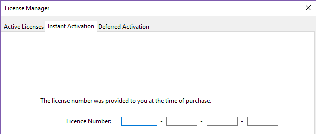

Une fois installés sur votre disque, les produits 4D doivent être activés pour que vous puissiez les utiliser. Habituellement, l'activation est automatique si vous [vous connectez à l'aide de votre compte 4D](GettingStarted/Installation.md) dans l'assistant de bienvenue.

Cependant, dans des cas spécifiques, vous pourriez avoir besoin d'activer vos licences manuellement, si par exemple :

- votre configuration ne permet pas l'activation automatique,
- vous avez acheté des licences supplémentaires.

Aucune activation n’est requise pour les usages suivants :

- 4D utilisé en mode distant (connexion à un 4D Server)
- 4D utilisé en mode local avec un projet d'application interprété sans accès au mode Développement.

## Première activation

Pour activer 4D, sélectionnez la commande **Gestionnaire de licences...** du menu **Aide**. Pour activer 4D Server, lancez l'application 4D Server. La boîte de dialogue de choix du mode d'activation apparaît.

4D vous propose trois modes d’activation. **L'activation immédiate** est recommandée.

### Activation immédiate

Saisissez votre identifiant utilisateur (e-mail ou compte 4D) ainsi que votre mot de passe. Si vous n'avez pas encore de compte client chez 4D, vous devez en créer un à l'adresse suivante :

[https://account.4d.com/us/login.shtml](https://account.4d.com/us/login.shtml)

Entrez ensuite le numéro de licence du produit à activer. Ce numéro se trouve dans l'e-mail de livraison ou le certificat d'authenticité reçu par courrier.

### Activation différée

Si vous ne pouvez pas utiliser [l'activation immédiate](#instant-activation) parce que votre ordinateur n'a pas d'accès Internet, vous pouvez effectuer une activation différée comme décrit dans les étapes suivantes.

1. Dans la fenêtre du Gestionnaire de licences de 4D accessible depuis le menu Aide, sélectionnez l'onglet **Activation différée**.
2. Entrez votre Numéro de licence ainsi que votre adresse E-mail, puis cliquez sur **Générer le fichier...** afin de créer le fichier d'ID (*reg.txt*).

3. Enregistrez le fichier *reg.txt* sur un support USB puis connectez ce support à un ordinateur qui a un accès Internet.
4. Depuis la machine qui a un accès Internet, connectez-vous sur [https://activation.4d.com](https://activation.4d.com).
5. Dans la page Web, cliquez sur le bouton **Parcourir...** et sélectionnez le fichier *reg.txt* généré lors des étapes 3 et 4 ; puis cliquez sur le bouton **Activer**.
6. Téléchargez le(s) fichier(s) de licence.

7. Enregistrez le ou les fichier(s) *license4d* sur un support partagé et transférez-le(s) sur la machine 4D utilisée lors de l'étape 1.
8. De retour sur la machine avec 4D, toujours dans l'écran **Activation différée**, cliquez sur le bouton **Suivant** ; puis cliquez sur le bouton **Charger...** et sélectionnez un fichier *license4d* depuis le media partagé utilisé à l'étape 7.

Une fois le fichier de licence chargé, cliquez sur le bouton **Suivant**.

9. Cliquez sur le bouton **Ajouter N°** pour ajouter une autre licence. Répétez ces étapes jusqu'à ce que toutes les licences téléchargées à l'étape 6 aient été intégrées.

Votre application 4D est désormais activée.

### Activation d’urgence

Ce mode permet l’activation exceptionnelle et temporaire de l’application 4D (5 jours maximum) sans connexion au site Internet de 4D. Cette activation ne peut être utilisée qu’une seule fois.

## Ajouter des licences

Vous pouvez à tout moment ajouter de nouvelles licences, par exemple pour étendre les capacités de votre application.

Choisissez la commande **Gestionnaire de licences...** dans le menu **Aide** de l’application 4D ou 4D Server puis cliquez sur le bouton **Actualiser** :

Ce bouton vous connecte à notre base clients et active automatiquement toutes les licences nouvelles ou mises à jour liées à la licence courante (la licence courante est affichée en **gras** dans la liste des Licences actives). Vous devrez simplement saisir vos identifiants 4D (compte et mot de passe).

- Si vous avez acheté des expansions supplémentaires pour un 4D Server, vous n'avez pas besoin de saisir de numéro -- cliquez simplement sur **Actualiser**.
- A la première activation d'un 4D Server, vous devez uniquement saisir le numéro du serveur et toutes les licences d'expansion associées sont automatiquement affectées.

Vous pouvez utiliser le bouton **Actualiser** dans les contextes suivants :

- Lorsque vous avez acquis une expansion supplémentaire et souhaitez l'activer,
- Lorsque vous voulez mettre à jour un numéro de licence temporaire ayant expiré (Partenaires ou évolutions).

## 4D Online Store

Sur le site web 4D Store, vous pouvez commander, mettre à jour, étendre et gérer vos produits 4D. Vous pouvez vous connecter au store à l'adresse suivante : [https://store.4d.com/fr/](https://store.4d.com/us/) (veuillez sélectionner votre pays).

Cliquez sur **Se connecter** pour vous identifier à l'aide de votre compte existant ou sur **Nouveau compte** pour en créer un nouveau, puis suivez les instructions à l'écran.

### Gestion des licences

Après vous être identifié, vous pouvez cliquer sur le lien **Liste de mes licences** en haut de la partie droite de la fenêtre :

Vous pouvez ensuite gérer vos licences en les affectant à des projets.

Sélectionnez la licence appropriée dans la liste, puis cliquez sur **Lier à un projet... >**:

Vous pouvez sélectionner un projet existant ou créer un nouveau :

Les projets vous permettent d'organiser vos licences comme vous le souhaitez :

## Dépannage

En cas d’échec du processus d’installation ou d’activation, veuillez consulter le tableau suivant, présentant les causes de dysfonctionnements les plus fréquentes :

| Symptômes                                                                                                  | Causes possibles                                | Solution(s)                                                                                                                                             |
| ---------------------------------------------------------------------------------------------------------- | ----------------------------------------------- | -------------------------------------------------------------------------------------------------------------------------------------------------------------------------- |
| Impossible de télécharger le produit depuis le site Internet de 4D                                         | Site Internet indisponible, antivirus, firewall | 1- Réessayez ultérieurement OU 2- Désactivez temporairement votre antivirus ou votre firewall.                                                             |
| Impossible d’installer le produit sur le disque (installation refusée). | Droits d’accès utilisateur insuffisants         | Ouvrez une session avec des droits d’accès permettant l’installation d’applications (accès administrateur)                                              |
| Echec de l’activation en ligne                                                                             | Antivirus, firewall, proxy                      | 1- Désactivez temporairement votre antivirus ou votre firewall OU 2- Utilisez l’activation différée (non disponible avec les licences des versions "R") |

Si ces informations ne vous permettent pas de résoudre votre problème, veuillez contacter 4D ou votre distributeur local.

## Contacts

Pour toute question relative à l’installation ou l’activation de votre produit, veuillez contacter 4D Sas ou votre distributeur local.

Pour la France :

- Web : [http://www.4d.com/fr/](https://us.4d.com/4d-technical-support)
- Téléphone : 0892 68 09 97 (0,34 Euro Ttc/Min)

Pour le Royaume-Uni :

- Web: [https://uk.4d.com/4d-technical-support](https://uk.4d.com/4d-technical-support)
- Téléphone : 01625 536178
