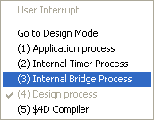
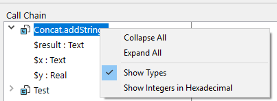

Le débogueur est utile lorsque vous devez repérer des erreurs ou surveiller l'exécution de méthodes. Il vous permet d'avancer pas à pas dans le code et d'examiner les informations. Ce processus est appelé le "traçage".


## Appeler le débogueur

Il existe plusieurs façons d'afficher le débogueur :

- En cliquant sur le bouton **Trace** dans [la fenêtre des erreurs de syntaxe](basics.md#syntax-error-window)
- En utilisant la commande [`TRACE`](https://doc.4d.com/4dv19/help/command/fr/page157.html)
- En cliquant sur le bouton **Debug** dans la fenêtre d'exécution de méthode ou en sélectionnant le bouton **Run and debug...** dans l'éditeur de code
- En utilisant **Alt+Shift+Clic** droit (Windows) ou **Ctrl+Option+Cmd+Clic (macOS)** pendant l'exécution d'une méthode, puis en sélectionnant le processus à suivre dans le menu contextuel :



- En cliquant sur le bouton **Trace** lorsqu'un process est sélectionné dans la page Process de l'Explorateur d'exécution.
- En ajoutant un point d'arrêt dans la fenêtre de l'éditeur de code ou dans les pages Break et Catch de l'explorateur d'exécution.

Lorsqu'il est appelé, la fenêtre du débogueur fournit le nom de la méthode ou de la fonction de classe que vous êtes en train de tracer, ainsi que l'action qui a provoqué l'apparition initiale de la fenêtre du débogueur. Par exemple, dans la fenêtre du débogueur ci-dessus :

- *Clients_BuildLogo* est la méthode en cours de traçage
- La fenêtre du débogueur s'est affichée parce qu'elle a détecté un appel à la commande `C_PICTURE`, qui faisait partie des commandes à identifier

L'affichage d'une nouvelle fenêtre de débogage utilise la même configuration que la dernière fenêtre affichée dans la même session. Si vous exécutez plusieurs process utilisateur, vous pouvez les tracer indépendamment et avoir une fenêtre de débogage ouverte pour chaque process.

La fenêtre du débogueur est généralement affichée sur la machine où le code est exécuté. Avec une application mono-utilisateur, elle est toujours affichée sur la machine qui exécute l'application. Avec une application client/serveur, elle est affichée :

- sur le 4D distant pour le code s'exécutant localement
- sur la machine du serveur pour le code exécuté sur le serveur (par exemple, une méthode avec l'option **Exécuter sur serveur**).

:::note Notes

- Si le serveur fonctionne en mode headless, aucune fenêtre de débogage ne peut être affichée sur le serveur, vous devez utiliser le débogueur distant. Voir [Débogage depuis des machines distantes](./debugging-remote.md).
- You can also [attach the Qodly Studio debugger to a 4D Server application](../WebServer/qodly-studio.md#using-qodly-debugger-on-4d-server) if you need to debug Qodly pages in a deployed environment.

:::

## Boutons de la barre d'outils

La barre d'outils du débogueur comprend plusieurs boutons, associés aux raccourcis par défaut :


> Les raccourcis par défaut peuvent être personnalisés dans la page Raccourcis de la boîte de dialogue Préférences.

#### Reprendre exécution

Arrêt du mode Trace et reprise du cours normal de l’exécution de la méthode.

> **Shift** + **F5** or **Shift** + clicking the **No Trace** button resumes execution. avec désactivation de tous les appels à TRACE suivants dans le process courant.

#### Exécuter pas à pas

Exécute la ligne de méthode en cours, indiquée par le compteur de programme (la flèche jaune). Le débogueur passe à la ligne suivante.

Le bouton Exécuter pas à pas ne passe pas dans les sous-routines et les fonctions. Il reste au niveau de la méthode que vous êtes en train de tracer. If you want to also trace subroutines and functions calls, use the **Step Into** button.

Dans le débogage distant, lors de l'exécution de la méthode sur le serveur, la méthode parente est appelée après l'exécution de la dernière ligne de méthode enfant. If the parent method is executed on the remote side, the **Step Over** button has the same effect as the **No Trace** button.

#### Exécuter pas à pas détaillé

Lors de l’exécution d’une ligne qui appelle une autre méthode (sous-routine ou fonction), ce bouton provoque l’affichage de la méthode appelée dans la fenêtre du débogueur, et permet au développeur de passer pas à pas dans cette méthode.

The new method becomes the current (top) method in the [Call Chain Pane](#call-chain-pane) of the Debugger window.

When executing a line that does not call another method, this button has the same effect as the **Step Over** button.

#### Step Out

If you are tracing subroutines and functions, clicking on this button allows you to execute the entire method currently being traced and to step back to the caller method. The Debugger window is brought back to the previous method in the call chain. If the current method is the last method in the call chain, the Debugger window is closed.

In remote debugging, on execution of the last line of the method, if the method is executed on the server, the parent method is called. If the parent method is executed on the remote side, the button acts in the same manner as the No Trace button.

#### Step Into Process

On execution of a line that creates a new process (i.e., calling the New process command), this button opens a new Debugger window that allows you to trace the process method of the newly created process. On execution of a line that does not creates a new process, this button acts in the same manner as the Step Over button.

#### Stopper exécution

La méthode s’arrête et vous retournez là où vous étiez avant son exécution :

- Si vous tracez une méthode formulaire ou une méthode objet s’exécutant en réponse à un événement, elle s’arrête et vous retournez au formulaire.
- Si vous tracez une méthode s’exécutant à partir du mode Application, vous retournez à ce mode.

#### Stopper et éditer

The method that is executing when you click the **Abort and Edit** button opens in the Code Editor.

> **Tip**: Use this button when you know which changes are required in your code, and when these changes are required to pursue the testing of your methods. Une fois vos modifications effectuées, ré-exécutez la méthode.

#### Editer méthode

La méthode qui s'exécute au moment où vous cliquez sur le bouton Éditer s'ouvre dans l'éditeur de méthode.

Si vous utilisez ce bouton pour modifier une méthode, les modifications ne seront effectives que la prochaine fois qu'elle sera exécutée.

> **Tip:** Use this button when you know which changes are required in your code and when they don't interfere with the rest of the code to be executed or traced.

#### Enregistrer paramètres

Ce bouton permet de sauvegarder la configuration courante de la fenêtre du débogueur (taille et position de la fenêtre, emplacement des lignes de division et contenu de la zone d’évaluation des expressions). Elle sera alors utilisée par défaut à chaque ouverture de la base. Cela inclut :

- la taille et la position de la fenêtre
- la position des lignes de division et le contenu de la zone qui évalue les expressions

Ces paramétrages sont stockés dans le projet.

Cette action n'est pas disponible en mode débogueur distant (voir [Débogage depuis des machines distantes](./debugging-remote)).

## Fenêtre d'expression

La **Fenêtre d’expression** est située en haut à gauche de la fenêtre du débogueur, sous la barre d’outils de contrôle d’exécution. Voici un exemple :


> Ce volet n'est pas disponible en mode débogage à distance.

La **Fenêtre d’expression** affiche toutes les informations générales utiles sur l'environnement 4D et l’environnement d'exécution.

La colonne **Expression** affiche les noms des objets et des expressions. La colonne **Valeur** affiche les valeurs courantes correspondantes. Cliquer sur n'importe quelle valeur sur le côté droit du panneau vous permet de modifier la valeur de l'objet, si cela est autorisé pour cet objet.

À tout moment, vous pouvez glisser déposer des thèmes, des sous-listes de thèmes (le cas échéant) et des éléments de thème vers la [Fenêtre d'évaluation](#fenetre-devaluation).

### Liste Expression

#### Objets courants

Ce thème vous permet de garder une trace des valeurs des objets ou des expressions :

- utilisé(e) s dans la ligne de code à exécuter (celle qui est indiquée par le compteur de programme — la flèche jaune dans la [Fenêtre d'évaluation du code](#fenetre-devaluation-du-code)),
- utilisé(e) s dans la ligne de code précédente

Comme la ligne de code précédente est celle qui a été exécutée avant, ce thème montre donc les objets ou expressions de la ligne courante avant et après que la ligne ait été exécutée.  Imaginons que vous exécutiez la méthode suivante :

```4d
TRACE
$a:=1
$b:=a+1
$c:=a+b
```

1. Une fenêtre de débogage s'ouvre avec le compteur de programme défini à la ligne avec `a:=1`. À ce stade, le thème **Objets courants** affiche :

   | $a | Undefined |
   | -- | --------- |

   La variable `$a` n'est pas encore initialisée, mais elle est affichée parce qu'elle est utilisée dans la ligne à exécuter.

2. Vous cliquez sur le bouton **Exécuter pas à pas**. Le compteur du programme est maintenant défini sur la ligne `b:=a+1`. À ce stade, le thème **Objets courants** affiche :

   | $a | 1         |
   | -- | --------- |
   | $b | Undefined |

   La valeur de la variable `$a` est maintenant 1. La variable `$b` n'est pas encore initialisée, mais elle est affichée parce qu'elle est utilisée dans la ligne à exécuter.

3. Vous cliquez à nouveau sur le bouton **Exécuter pas à pas**. Le compteur de programme est maintenant placé sur la ligne avec $c:=a+b. Le thème **Objets courants** affiche :

   | $c | Undefined |
   | -- | --------- |
   | $a | 1         |
   | $b | 2         |

   La valeur de la variable `$b` est maintenant 2. La variable `$c` n'est pas encore initialisée, mais elle est affichée parce qu'elle est utilisée dans la ligne à exécuter.

#### Variables

Ce thème est composé des sous-thèmes suivants :

| Sous-thème   | Description                                                              | Peut-on modifier les valeurs ? |
| ------------ | ------------------------------------------------------------------------ | ------------------------------ |
| Interprocess | Liste des variables interprocess utilisées à ce stade                    | Oui                            |
| Process      | Liste des variables process utilisées par le process courant             | Oui                            |
| Local        | Liste des variables locales utilisées par la méthode en cours de traçage | Oui                            |
| Paramètres   | Liste des paramètres reçus par la méthode                                | Oui                            |
| Self         | Pointeur vers l'objet courant, lors du traçage d'une méthode objet       | Non                            |

Les tableaux, comme les autres variables, apparaissent dans les sous-thèmes interprocess, process et local, selon leur portée. Le débogueur affiche les 100 premiers éléments. À l'intérieur de la colonne **Valeur**, vous pouvez modifier les valeurs des éléments des tableaux, mais pas la taille des tableaux.

Pour afficher les types de variables et leurs noms internes, faites un clic droit et cochez l'option **Afficher les types** dans le menu contextuel :


Voici le résultat :


#### Valeurs du formulaire courant

Ce thème contient le nom de chaque objet dynamique inclus dans le formulaire courant, ainsi que la valeur de sa variable associée :


Certains objets, tels que les list box tableaux, peuvent être présentés comme deux objets distincts, la variable de l'objet lui-même et sa source de données.

#### Constantes

Comme la page Constantes de la fenêtre de l'Explorateur, ce thème affiche des constantes prédéfinies fournies par 4D. Les expressions de ce thème ne peuvent pas être modifiées.

#### Sémaphores

Ce thème liste les sémaphores locaux définis. Pour chaque sémaphore, la colonne Valeur fournit le nom du process qui a posé le sémaphore. Les expressions de ce thème ne peuvent pas être modifiées. Les sémaphores globaux ne sont pas affichés.

#### Process

Ce thème liste les process démarrés depuis le début de la session de travail. La colonne de valeur affiche le temps utilisé et l'état courant pour chaque process (Exécution, Pause, etc.). Les expressions de ce thème ne peuvent pas être modifiées.

#### Tables et champs

Ce thème répertorie les tables et les champs dans la base de données 4D. Pour chaque élément de table, la colonne Valeur affiche la taille de la sélection courante pour le process courant ainsi que le nombre d'**enregistrements verrouillés**.

Pour chaque champ, la colonne Valeur affiche la valeur du champ pour l'enregistrement courant (sauf image et BLOB). Vous pouvez modifier les valeurs des champs, mais pas les informations des tables.

#### Ensembles

Ce thème liste les ensembles définis dans le process courant (celui que vous tracez actuellement) et les ensembles interprocess. Pour chaque ensemble, la colonne Valeur affiche le nombre d'enregistrements et le nom de la table. Les expressions de ce thème ne peuvent pas être modifiées.

#### Sélections temporaires

Ce thème répertorie les sélections temporaires qui sont définies dans le process courant (celui que vous tracez actuellement) ; il répertorie également les sélections temporaires interprocess. Pour chaque sélection temporaire, la colonne Valeur affiche le nombre d'enregistrements et le nom de la table. Les expressions de ce thème ne peuvent pas être modifiées.

#### Informations

Ce thème contient des informations générales sur les opérations de base de données, telles que la table par défaut courante (si elle existe), l'espace de mémoire physique, virtuel, libre et utilisée, la destination des requêtes, etc.

#### Web

Ce thème affiche des informations concernant le serveur Web principal de l'application (disponible uniquement si le serveur Web est actif) :

- Fichier Web à envoyer : nom du fichier Web en attente d'envoi (le cas échéant)
- Occupation du cache Web : nombre de pages présentes dans le cache Web ainsi que le pourcentage d'utilisation
- Temps d’activité du serveur Web : durée d'utilisation du serveur Web au format heures:minutes:secondes
- Nombre de requêtes http : nombre total de requêtes HTTP reçues depuis le lancement du serveur web, ainsi que le nombre instantané de requêtes par seconde
- Nombre de process Web actifs : nombre de process Web actifs, tous process Web confondus

Les expressions contenues dans ce thème ne peuvent pas être modifiées.

### Menu contextuel

Le menu contextuel de la fenêtre d’expression vous propose des options supplémentaires.


- **Contracter** : Contracte tous les niveaux de la liste hiérarchique des expressions.
- **Déployer** : Déploie tous les niveaux de la liste hiérarchique des expressions.
- **Montrer les types** : Lorsque vous sélectionnez cette option, le type de l’objet s’affiche (lorsque cela est pertinent).
- **Montrer le numéro de champ et de table** : Affiche le numéro des tables ou de champs. Utile si vous travaillez avec les numéros de table ou de champ, ou avec des pointeurs en utilisant des commandes telles que `Table` ou `Field`.
- **Montrer les icônes** : Chaque objet est précédé d'une icône qui indique son type. Vous pouvez désactiver cette option pour accélérer l’affichage, ou tout simplement parce que l’option **Montrer les types** vous convient.
- **Tables et champs triés** : Cette option force les tables et les champs à s’afficher par ordre alphabétique (dans leurs listes respectives).
- **Afficher les entiers en hexadécimal** : Les nombres s’affichent en notation décimale. Sélectionnez cette option pour les afficher en hexadécimal. Note : Pour exprimer une valeur numérique en hexadécimal, saisissez 0x (zéro + "x") puis les caractères hexadécimaux.
- **Activer le suivi d'activité** : Active le suivi d'activité (contrôle avancé de l'activité interne de l'application) et affiche les informations collectées dans des thèmes supplémentaires : **Séquenceur**, **Web** et **Réseau**.

## Chaîne d'appel

Une méthode peut appeler d'autres méthodes ou fonctions de classe, qui peuvent à leur tour appeler d'autres méthodes ou fonctions. Le volet Chaîne d'appels vous permet de suivre cette hiérarchie.


Chaque élément de niveau principal est le nom d'une méthode ou d'une fonction de classe. L'élément supérieur est celui que vous tracez actuellement, l'élément de niveau principal suivant est le nom de l'appelant (la méthode ou la fonction qui a appelé celle que vous tracez actuellement), le suivant est l'appelant de l'appelant, et ainsi de suite.

Dans l'image ci-dessus :

- `thirdMethod` n'a reçu aucun paramètre
- `$0` est actuellement indéfini, car la méthode n'a pas attribué de valeur à `$0` (parce qu'elle n'a pas encore exécuté cette assignation ou parce que la méthode est une sous-routine et non une fonction)
- `secondMethod` a reçu trois paramètres de `firstMethod` :
  - $1 est un pointeur vers la table `[Employee]`
  - $2 est un pointeur vers le champ `ID` dans la table `[Employee]`
  - $3 est un paramètre alphanumérique dont la valeur est "Z"

Vous pouvez double-cliquer sur le nom de n'importe quelle méthode pour afficher son contenu dans le [Fenêtre d'évaluation des méthodes](#fenetre-devaluation-des-methodes).

En cliquant sur l'icône à côté d'un nom de méthode ou de fonction, vous pouvez développer ou replier les paramètres et le résultat (le cas échéant). Les valeurs apparaissent sur le côté droit du volet. En cliquant sur n'importe quelle valeur du côté droit, vous pouvez modifier la valeur de n'importe quel paramètre ou résultat de fonction.

Pour afficher le type de paramètre, cochez l'option **Afficher les types** dans le menu contextuel :



Après avoir déployé la liste des paramètres, vous pouvez faire glisser et déposer les paramètres et les résultats de la fonction dans la [fenêtre d'évaluation](#fenetre-devaluation).

You can also use the [Call chain](https://doc.4d.com/4dv19/help/command/en/page1662.html) command to retrieve the call chain programmatically.

## Fenêtre d'évaluation

Le fenêtre d'évaluation sert à évaluer les expressions. Elle est similaire au [fenêtre Expression](#fenetre-dexpression), sauf que vous décidez quelles expressions sont affichées. Tout type d'expression peut être évalué :

- champ
- variable
- pointer
- calcul
- commande 4D
- method
- et tout ce qui renvoie une valeur


Vous pouvez évaluer toute expression qui peut être affichée sous forme de texte. Ceci n'inclut pas les champs et les variables image et BLOB. Pour afficher le contenu du BLOB, vous pouvez utiliser les commandes BLOB, telles que [BLOB to text](https://doc.4d.com/4dv20/help/command/fr/page555.html).

### Gestion des expressions

Il y a plusieurs façons d'ajouter des expressions à la liste :

- Glisser et déposer un objet ou une expression depuis la fenêtre d'expression ou la fenêtre de chaîne d'appel
- Sélectionner une expression dans le volet [source](#source-code-pane) et appuyer sur **ctrl+D** (Windows) ou **cmd+D** (macOS)
- Double-cliquer quelque part dans l'espace vide du volet (ajoute une expression avec un nom de paramètre fictif que vous pouvez modifier)

Vous pouvez entrer n'importe quelle formule qui renvoie un résultat.

Pour modifier une expression, cliquez dessus pour la sélectionner, puis cliquez à nouveau ou appuyez sur **Enter** sur votre clavier.

Pour supprimer une expression, cliquez dessus pour la sélectionner, puis appuyez sur **Backspace** ou **Delete** sur votre clavier.

> **Attention :** Soyez prudent lorsque vous évaluez une expression 4D modifiant la valeur d'une des variables système (par exemple, la variable OK) car l'exécution du reste de la méthode peut être altérée.

### Menu contextuel

Le menu contextuel de la fenêtre vous donne accès à l'éditeur de formule 4D et à d'autres options :


**Nouvelle expression**: insère une nouvelle expression et affiche l'Éditeur de formules 4D.


Pour plus d'informations sur l'Éditeur de formules, consultez le [manuel Mode Développement](https://doc.4d.com/4Dv19/4D/19/4D-Design-Reference.100-5416591.en.html).

- **Insérer commande** : Raccourci pour insérer une commande 4D en tant qu'expression.
- **Supprimer tout** : Supprime toutes les expressions de la fenêtre d"évaluation.
- **Expressions par défaut** : Copie la liste des expressions de la fenêtre d'expression.

> Cette option n'est pas disponible en [mode débogueur distant](debugging-remote.md).

- **Contracter tout/Développer tout** : Contracte ou développe toutes les listes hiérarchiques.
- **Montrer les types** : Affiche le type de chaque élément dans la liste (lorsque cela est pertinent).
- **Montrer le numéro de champ et de table** : Affiche le numéro des tables ou de champs. Utile si vous travaillez avec des numéros de table ou de champs, ou avec des pointeurs utilisant les commandes `Table` ou `Champ`.
- **Montrer les icônes** : Chaque objet est précédé d'une icône qui indique son type.
- **Tables et champs triés** : Affiche la table et les champs par ordre alphabétique.
- **Afficher les entiers en hexadécimal** : Affiche les nombres en utilisant la notation hexadécimale. Pour entrer une valeur numérique en hexadécimal, tapez 0x (zéro + "x"), suivi des chiffres hexadécimaux.

## Fenêtre d'évaluation du code

Ce panneau affiche le code source de la méthode ou de la fonction en cours de traçage.

Cette zone vous permet également d'ajouter ou de supprimer des [**points d'arrêt**](breakpoints.md).

### Infobulle

Passez votre pointeur sur une expression pour afficher une info-bulle qui indique :

- le type déclaré de l'expression
- la valeur courante de l'expression


Cela fonctionne également avec les sélections :


### Ajout d'expressions à la fenêtre d'évaluation

Vous pouvez copier n'importe quelle expression sélectionnée depuis la fenêtre de code source vers la [fenêtre d'évaluation](#custom-watch-pane).

1. Dans le volet Code Source, sélectionnez l'expression à évaluer
2. Effectuez l'une des opérations suivantes :
   - Glissez et déposez le texte sélectionné dans la zone d'expression
   - Appuyez sur **Ctrl+D** (Windows) ou **Cmd+D** (macOS)
   - Cliquez avec le bouton droit sur le texte sélectionné **>** **Copier dans la fenêtre d'expression**

### Compteur de programme

La flèche jaune située dans la marge gauche de la fenêtre du code source s'appelle le compteur de programme. Elle marque la prochaine ligne à exécuter.

Par défaut, la ligne du compteur de programme (également appelée ligne d'exécution) est mise en évidence dans le débogueur. Vous pouvez personnaliser la couleur de surbrillance dans la [page Méthodes des Préférences](Preferences/methods.md).

#### Déplacer le compteur de programme

À des fins de débogage, vous pouvez déplacer le compteur de programme de la méthode située au sommet de la chaîne d'appels (la méthode en cours d'exécution). Pour ce faire, cliquez et faites glisser la flèche jaune vers une autre ligne.

Cela indique seulement au débogueur de poursuivre le traçage ou l'exécution à partir d'un point différent. Il n'exécute pas les lignes et n'annule pas leur exécution. Tous les paramètres, champs, variables, etc. courants ne sont pas affectés.

Par exemple :

```4d
  // ...
 If(This condition)
    DO_SOMETHING
 Else
    DO_SOMETHING_ELSE
 End if
  // ...
```

Considérons que le compteur de programme est défini sur la ligne `If (This condition)`.
Lorsque vous cliquez sur le bouton **Exécuter pas à pas** , le compteur du programme passe directement à la ligne `DO_SOMETHING_ELSE` .
Pour examiner les résultats de la ligne `DO_SOMETHING` , vous pouvez déplacer le compteur de programme sur cette ligne et l'exécuter.

### Menu contexuel

Le menu contextuel de la Fenêtre d'évaluation du code donne accès à plusieurs fonctions utiles en phase d’exécution du code en mode Trace :


- **Aller à définition** : permet d’accéder à la définition de l’objet sélectionné. Cette commande est disponible avec les objets suivants :
  - *Méthode projet :* affiche le contenu de la méthode dans une nouvelle fenêtre de l'éditeur de code
  - *Champ* : affiche les propriétés du champ dans l’inspecteur de la fenêtre de structure
  - *table* : affiche les propriétés de la table dans l’inspecteur de la fenêtre de structure
  - *formulaire* : affiche le formulaire dans l’éditeur de formulaires
  - *variable* (locale, process, interprocess ou paramètre $n) : affiche la ligne de déclaration de la variable dans la méthode courante ou parmi les méthodes compilateur
- **Chercher les références** (cette fonction est également accessible depuis l’Editeur de code) : rechercher tous le projet (méthodes et formulaires) dans lesquels l’élément courant de la méthode est référencé. L’élément courant est l’élément sélectionné ou l’élément dans lequel se trouve le curseur. Il peut s’agir d’un nom de champ, de variable, de commande, d’une chaîne, etc. Le résultat de la recherche est affiché dans une nouvelle fenêtre de résultat standard.
- **Copier** : copie standard de l'expression sélectionnée dans le conteneur de données.
- **Copier dans la fenêtre d'expression** : copie l'expression sélectionnée dans la Fenêtre d'évaluation.
- **Exécuter jusqu’au curseur** : provoque l’exécution des instructions situées entre le compteur de programme (flèche jaune) et la ligne sélectionnée de la méthode (dans laquelle se trouve le curseur).
- **Fixer prochaine instruction** : déplace le compteur de programme jusqu’à la ligne sélectionnée sans l’exécuter et sans exécuter les lignes intermédiaires. La ligne désignée ne sera exécutée que si l’utilisateur clique sur l’un des boutons d’exécution.
- **Permuter point d’arrêt** (également accessible depuis l’Editeur de code) : permet alternativement d’insérer ou de supprimer le point d’arrêt correspondant la ligne sélectionnée. Cette fonction modifie le point d’arrêt de façon permanente : par exemple, un point d’arrêt supprimé dans le débogueur n’apparaît plus dans la méthode d’origine.
- **Modifier point d’arrêt...** (également accessible depuis l’Editeur de code) : permet d’afficher la boîte de dialogue des Propriétés du point d’arrêt. Cette fonction modifie le point d’arrêt de façon permanente.

### Chercher Suivant/Précédent

Des raccourcis spécifiques permettent de trouver des chaînes de caractères identiques à celle qui est sélectionnée :

- Pour rechercher les prochaines chaînes identiques, appuyez sur **Ctrl+E** (Windows) ou **Cmd+E** (macOS)
- Pour rechercher les chaînes identiques précédentes, appuyez sur **Ctrl+Shift+E** (Windows) ou **Cmd+Shift+E** (macOS)

La recherche s'effectue uniquement si vous sélectionnez au moins un caractère dans le volet Code source.

## Raccourcis

Cette section répertorie tous les raccourcis disponibles dans la fenêtre du débogueur.

> La barre d'outils comporte également des [raccourcis](#tool-bar-buttons).

#### Fenêtre d'évaluation & Sous-fenêtre d’évaluation

- Un **double-clic** sur un article de la fenêtre d’expression copie cet article dans la fenêtre d’évaluation
- Un **double-clic** dans la sous-fenêtre d’évaluation crée une nouvelle expression

#### Fenêtre d'évaluation du code

- Un clic dans la marge gauche place ou supprime un point d’arrêt.
- **Alt+Majuscule+clic** (Windows) ou **Option+Majuscule+clic** (macOS) pose un point d’arrêt provisoire.
- **Alt+clic** (Windows) ou **Option+clic** (macOS) affiche la fenêtre des propriétés du point d’arrêt pour un point d’arrêt nouveau ou existant.
- Une expression ou un objet sélectionné(e) peut être copié(e) dans la Fenêtre d'évaluation par glisser-déposer.
- **Ctrl+D** (Windows) ou **Commande+D** (macOS) sur un texte sélectionné le copie dans la Fenêtre d'évaluation.
- **Ctrl+E** (Windows) ou **Commande+E** (macOS) identifie les chaînes suivantes qui sont identiques à la chaîne sélectionnée.
- **Ctrl+Majuscule+E** (Windows) ou **Commande+Majuscule+E** (macOS) identifie les chaînes précédentes qui sont identiques à la chaîne sélectionnée.

#### Toutes les fenêtres

- **Ctrl** + **+/-** (Windows) ou **Commande** + **+/-** (macOS) augmente ou réduit la taille de la police pour une meilleure lisibilité. La taille de la police modifiée s'applique également à l'Editeur de code et est stockée dans les Préférences.
- **Ctrl+***(Windows) ou **Commande+*** (macOS) force la réactualisation de la Fenêtre d'expression.
- Lorsqu'aucun objet n’est sélectionné dans les fenêtres, en appuyant sur **Entrée**, vous avancez d’une ligne.
- Lorsque la valeur d’un élément est sélectionnée, utilisez les touches directionnelles pour naviguer dans la liste.
- Lorsque vous êtes en train d’éditer un élément, utilisez les touches directionnelles pour déplacer le curseur. Utilisez Ctrl+A/X/C/V (Windows) ou Commande+A/X/C/V (macOS) en raccourci des commandes du menu Edition : Tout Sélectionner/Couper/Copier/Coller.
