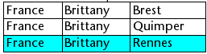
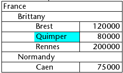
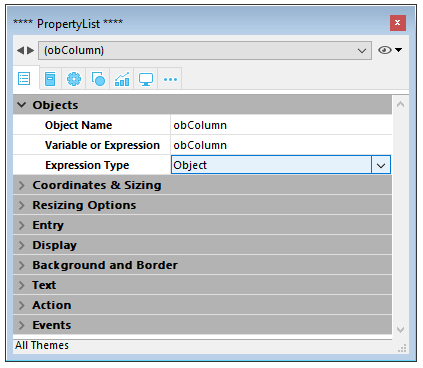
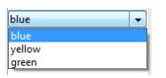
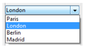

Les list box sont des objets actifs complexes permettant d’afficher et de saisir des données sous forme de tableaux. Ils peuvent être liés au contenu de la base de données, comme les sélections d'entités ("entity selections") et les sélections d'enregistrement, ou à tout contenu linguistique tel que les collections et les tableaux. Ils incluent des fonctionnalités avancées concernant la saisie de données, le tri des colonnes, la gestion des événements, l'apparence personnalisée, le déplacement des colonnes, etc.


Une list box contient une ou plusieurs colonnes dont le contenu est automatiquement synchronisé. Le nombre de colonnes est en principe illimité (il dépend des ressources de la machine).

## Vue d’ensemble

### Principes d'utilisation basiques

En exécution, les list box permettent d’afficher et de saisir des données sous forme de listes. Pour passer une cellule en mode édition ([si la saisie est autorisée pour la colonne associée](#managing-entry)), il suffit de cliquer deux fois sur la valeur qu’elle contient :


Les utilisateurs peuvent saisir et afficher du texte sur plusieurs lignes au sein d’une cellule de list box. Pour ajouter un retour à la ligne, appuyez sur les touches **Ctrl+Retour chariot** sous Windows, ou appuyez sur les touches **Option+Retour chariot** sous macOS.

Les booléens et les images peuvent être affichés dans des cellules, ainsi que des dates, des heures ou des nombres. Il est possible de trier les valeurs de colonne en cliquant sur un en-tête ([tri standard](#managing-sorts)). Toutes les colonnes sont automatiquement synchronisées.

Il est également possible de redimensionner chaque colonne, et l'utilisateur peut modifier l'ordre des [colonnes](properties_ListBox.md#locked-columns-and-static-columns) et des [lignes](properties_Action.md#movable-rows) en les déplaçant à l'aide de la s Notez que les list box peuvent être utilisées [en mode hiérarchique](#hierarchical-list-boxes).

L'utilisateur peut sélectionner une ou plusieurs lignes à l'aide des raccourcis standard : **Maj + clic** pour une sélection adjacente et **Ctrl + clic** (Windows) ou **Commande + clic** (macOS) pour une sélection non adjacente.

### Parties de list box

Une list box est composée de quatre parties distinctes :

- l’objet list box dans sa globalité,
- les colonnes,
- les en-têtes des colonnes, et
- les pieds des colonnes.


Chaque partie dispose de son propre nom d’objet et de propriétés spécifiques. Par exemple, le nombre de colonnes ou la couleur alternée de chaque ligne sont définies dans les propriétés de l’objet list box, la largeur de chaque colonne est définie dans les propriétés des colonnes et la police de l’en-tête est définie dans les propriétés des en-têtes.

Il est possible d'ajouter une méthode objet à l'objet list box et/ou à chaque colonne de la list box. Les méthodes objet sont appelées dans l'ordre suivant :

1. Méthode objet de chaque colonne
2. Méthode objet de la list box

La méthode objet de colonne obtient les événements qui se produisent dans son [en-tête](#list-box-headers) et son [pied](#list-box-footers).

### Types de list box

Il existe différents types de list box avec leurs propres comportements et propriétés spécifiques. Le type de list box dépend de sa propriété [Data Source](properties_Object.md#data-source) :

- **Tableaux**: chaque colonne est liée à un tableau 4D. Les list box basées sur des tableaux peuvent être affichées sous forme de [list box hiérarchiques](listbox_overview.md#list-box-hierarchiques).
- **Sélection** (**Sélection courante** ou **Sélection temporaire**) : chaque colonne est liée à une expression (par exemple un champ) qui est évaluée pour chaque enregistrement de la sélection.
- **Collection ou Entity selection** : chaque colonne est liée à une expression qui est évaluée pour chaque élément de la collection ou chaque entité de l'entity selection.

> Il n'est pas possible de combiner différents types de list box dans le même objet list box. La source de données est définie lors de la création de la list box. Il n'est alors plus possible de la modifier par programmation.

### Gestion des list box

Vous pouvez configurer complètement un objet de type list box via ses propriétés, et vous pouvez également le gérer dynamiquement par programmation.

Le langage 4D comprend un thème "List Box" dédié aux commandes de list box mais les commandes de divers autres thèmes comme "Propriétés des objets" ou les commandes `EDIT ITEM` et `Displayed line number` peuvent également être utilisées. Pour plus d'informations, consultez la page [List Box Commands Summary](https://doc.4d.com/4Dv19R6/4D/19-R6/List-Box-Commands-Summary.300-5911039.en.html) du manuel *4D Language*.

## Objets List box

### List box de type tableau

Dans une list box de type tableau, chaque colonne est associée à un tableau 4D à une dimension ; tous les types de tableaux peuvent être utilisés, à l’exception des tableaux de pointeurs. Le nombre de lignes est basé sur le nombre d’éléments du tableau.

Par défaut, 4D affecte le nom “ColonneN” à chaque variable de colonne. Vous pouvez le modifier, ainsi que les autres [propriétés des colonnes](listbox_overview.md#proprietes-specifiques-des-colonnes). Le format d'affichage de chaque colonne peut également être défini à l'aide de la commande `OBJECT SET FORMAT`.

> Les list box basées sur des tableaux peuvent être affichées sous forme de [list box hiérarchiques](listbox_overview.md#list-box-hierarchiques), disposant de mécanismes spécifiques.

Avec les list box de type tableau, les valeurs des colonnes (saisie et affichage) sont gérées à l’aide des commandes du langage 4D. Vous pouvez également associer une [énumération](properties_DataSource.md#énumération) à une colonne afin de contrôler la saisie.
Les valeurs des colonnes sont gérées à l’aide des commandes de haut niveau du thème List box (telles que `LISTBOX INSERT ROWS` ou `LISTBOX INSERT COLUMN`) ainsi que des commandes de manipulation des tableaux. Par exemple, pour initialiser le contenu d’une colonne, vous pouvez utiliser l’instruction suivante :

```4d
ARRAY TEXT(varCol;size)
```

Vous pouvez également utiliser une énumération :

```4d
LIST TO ARRAY("ListName";varCol)
```

> **Attention :** Lorsqu’un objet List box contient plusieurs colonnes de tailles différentes, seul le nombre d’éléments correspondant au plus petit tableau est affiché. Il est donc conseillé de veiller à ce que chaque tableau ait le même nombre d’éléments que les autres. A noter également que si une colonne de la list box est “vide” (c'est le cas lorsque le tableau associé n'a pas été correctement déclaré ou dimensionné via le langage), la list box n'affiche aucun contenu.

### List box de type sélection

Dans ce type de list box, chaque colonne peut être associée à un champ (par exemple `[Employees]LastName)` ou à une expression. L’expression peut être basée sur un ou plusieurs champs (par exemple `[Employés]Nom+“ ”+[Employés]Prénom`) ou être simplement une formule (par exemple`String(Milliseconds)`). L’expression peut également être une méthode projet, une variable ou un élément de tableau. Vous pouvez utiliser les commandes `LISTBOX SET COLUMN FORMULA` et `LISTBOX INSERT COLUMN FORMULA` pour modifier les colonnes par programmation.

Le contenu de chaque ligne est ensuite évalué en fonction d'une sélection d'enregistrements : la **sélection courante** d'une table ou une **sélection temporaire**.

Dans le cas d’une list box basée sur la sélection courante, toute modification effectuée côté base de données est automatiquement reportée dans la list box et inversement. La sélection courante est donc toujours identique aux deux emplacements.

### List box collection ou entity selection

Dans ce type de list box, chaque colonne doit être associée à une expression. Le contenu de chaque ligne est ensuite évalué par élément de la collection ou par entité de l'entity selection.

Chaque élément de la collection ou chaque entité est disponible en tant qu'objet auquel on peut accéder via le mot-clé [This](../Concepts/classes.md#this). Une expression de colonne peut être un chemin de propriété, une méthode de projet, une variable ou n'importe quelle formule, accédant à chaque entité ou objet élément de collection via `This`, par exemple `This.<propertyPath>` (ou `This.value` dans le cas Vous pouvez utiliser les commandes `LISTBOX SET COLUMN FORMULA` et `LISTBOX INSERT COLUMN FORMULA` pour modifier les colonnes par programmation.

Lorsque la source de données est une entity selection, les modifications apportées du côté de la list box sont automatiquement enregistrées dans la base de données. En revanche, les modifications apportées du côté de la base de données sont visibles dans la list box après le rechargement des entités modifiées.

:::note

When entities are deleted, their references remain in the entity selection with an *undefined* value, thus displaying blank rows in the list box. Dans ce cas, vous pouvez appeler la fonction [`.clean()`](API/EntitySelectionClass.md#clean) pour obtenir une nouvelle entity selection sans les références d'entités supprimées.

:::

Lorsque la source de données est une collection, toute modification apportée aux valeurs de la list box se reflète dans la collection. On the other hand, if modifications are done on the collection using for example the various functions of the [Collection class](../API/CollectionClass.md), you will need to explicitely notify 4D by reassigning the collection variable to itself, so that the list box contents is refreshed. Par exemple :

```4d
myCol:=myCol.push("new value") //afficher new value dans la list box
```

### Propriétés prises en charge

Les propriétés prises en charge dépendent du type de list box.

| Propriété                                                                                    | List box tableau | Liste box sélection | List box collection ou entity selection |
| -------------------------------------------------------------------------------------------- | ---------------- | ------------------- | --------------------------------------- |
| [Alternate Background Color](properties_BackgroundAndBorder.md#alternate-background-color)   | X                | X                   | X                                       |
| [Background Color](properties_BackgroundAndBorder.md#background-color--fill-color)           | X                | X                   | X                                       |
| [Bold](properties_Text.md#bold)                                                              | X                | X                   | X                                       |
| [Background Color Expression](properties_BackgroundAndBorder.md#background-color-expression) |                  | X                   | X                                       |
| [Border Line Style](properties_BackgroundAndBorder.md#border-line-style)                     | X                | X                   | X                                       |
| [Bottom](properties_CoordinatesAndSizing.md#bottom)                                          | X                | X                   | X                                       |
| [Class](properties_Object.md#css-class)                                                      | X                | X                   | X                                       |
| [Collection or entity selection](properties_Object.md#collection-or-entity-selection)        |                  | X                   | X                                       |
| [Column Auto-Resizing](properties_ResizingOptions.md#column-auto-resizing)                   | X                | X                   | X                                       |
| [Current item](properties_DataSource.md#current-item)                                        |                  |                     | X                                       |
| [Current item position](properties_DataSource.md#current-item-position)                      |                  |                     | X                                       |
| [Data Source](properties_Object.md#data-source)                                              | X                | X                   | X                                       |
| [Detail Form Name](properties_ListBox.md#detail-form-name)                                   |                  | X                   |                                         |
| [Display Headers](properties_Headers.md#display-headers)                                     | X                | X                   | X                                       |
| [Display Footers](properties_Footers.md#display-footers)                                     | X                | X                   | X                                       |
| [Double-click on row](properties_ListBox.md#double-click-on-row)                             |                  | X                   |                                         |
| [Draggable](properties_Action.md#droppable)                                                  | X                | X                   | X                                       |
| [Droppable](properties_Action.md#droppable)                                                  | X                | X                   | X                                       |
| [Focusable](properties_Entry.md#focusable)                                                   | X                | X                   | X                                       |
| [Font](properties_Text.md#font)                                                              | X                | X                   | X                                       |
| [Font Color](properties_Text.md#font-color)                                                  | X                | X                   | X                                       |
| [Font Color Expression](properties_Text.md#font-color-expression)                            |                  | X                   | X                                       |
| [Font Size](properties_Text.md#font-size)                                                    | X                | X                   | X                                       |
| [Height (list box)](properties_CoordinatesAndSizing.md#height)            | X                | X                   | X                                       |
| [Height (headers)](properties_Headers.md#height)                          | X                | X                   | X                                       |
| [Height (footers)](properties_Footers.md#height)                          | X                | X                   | X                                       |
| [Hide extra blank rows](properties_BackgroundAndBorder.md#hide-extra-blank-rows)             | X                | X                   | X                                       |
| [Hide focus rectangle](properties_Appearance.md#hide-focus-rectangle)                        | X                | X                   | X                                       |
| [Hide selection highlight](properties_Appearance.md#hide-selection-highlight)                | X                | X                   | X                                       |
| [Hierarchical List Box](properties_Object.md#array-list-box)                                 | X                |                     |                                         |
| [Highlight Set](properties_ListBox.md#highlight-set)                                         |                  | X                   |                                         |
| [Horizontal Alignment](properties_Text.md#horizontal-alignment)                              | X                | X                   | X                                       |
| [Horizontal Line Color](properties_Gridlines.md#horizontal-line-color)                       | X                | X                   | X                                       |
| [Horizontal Padding](properties_CoordinatesAndSizing.md#horizontal-padding)                  | X                | X                   | X                                       |
| [Horizontal Scroll Bar](properties_Appearance.md#horizontal-scroll-bar)                      | X                | X                   | X                                       |
| [Horizontal Sizing](properties_ResizingOptions.md#horizontal-sizing)                         | X                | X                   | X                                       |
| [Italic](properties_Text.md#italic)                                                          | X                | X                   | X                                       |
| [Left](properties_CoordinatesAndSizing.md#left)                                              | X                | X                   | X                                       |
| [Master Table](properties_DataSource.md#master-table)                                        |                  | X                   |                                         |
| [Meta info expression](properties_Text.md#meta-info-expression)                              |                  |                     | X                                       |
| [Method](properties_Action.md#method)                                                        | X                | X                   | X                                       |
| [Movable Rows](properties_Action.md#movable-rows)                                            | X                |                     |                                         |
| [Named Selection](properties_DataSource.md#selection-name)                                   |                  | X                   |                                         |
| [Number of Columns](properties_ListBox.md#number-of-columns)                                 | X                | X                   | X                                       |
| [Number of Locked Columns](properties_ListBox.md#number-of-locked-columns)                   | X                | X                   | X                                       |
| [Number of Static Columns](properties_ListBox.md#number-of-static-columns)                   | X                | X                   | X                                       |
| [Object Name](properties_Object.md#object-name)                                              | X                | X                   | X                                       |
| [Right](properties_CoordinatesAndSizing.md#right)                                            | X                | X                   | X                                       |
| [Row Background Color Array](properties_BackgroundAndBorder.md#row-background-color-array)   | X                |                     |                                         |
| [Row Control Array](properties_ListBox.md#row-control-array)                                 | X                |                     |                                         |
| [Row Font Color Array](properties_Text.md#row-font-color-array)                              | X                |                     |                                         |
| [Row Height](properties_CoordinatesAndSizing.md#row-height)                                  | X                |                     |                                         |
| [Row Height Array](properties_CoordinatesAndSizing.md#row-height-array)                      | X                |                     |                                         |
| [Row Style Array](properties_Text.md#row-style-array)                                        | X                |                     |                                         |
| [Selected Items](properties_DataSource.md#selected-items)                                    |                  |                     | X                                       |
| [Selection Mode](properties_ListBox.md#selection-mode)                                       | X                | X                   | X                                       |
| [Single-Click Edit](properties_Entry.md#single-click-edit)                                   | X                | X                   | X                                       |
| [Sortable](properties_Action.md#sortable)                                                    | X                | X                   | X                                       |
| [Standard action](properties_Action.md#standard-action)                                      | X                |                     |                                         |
| [Style Expression](properties_Text.md#style-expression)                                      |                  | X                   | X                                       |
| [Top](properties_CoordinatesAndSizing.md#top)                                                | X                | X                   | X                                       |
| [Transparent](properties_BackgroundAndBorder.md#transparent)                                 | X                | X                   | X                                       |
| [Type](properties_Object.md#type)                                                            | X                | X                   | X                                       |
| [Underline](properties_Text.md#underline)                                                    | X                | X                   | X                                       |
| [Variable or Expression](properties_Object.md#variable-or-expression)                        | X                | X                   |                                         |
| [Vertical Alignment](properties_Text.md#vertical-alignment)                                  | X                | X                   | X                                       |
| [Vertical Line Color](properties_Gridlines.md#vertical-line-color)                           | X                | X                   | X                                       |
| [Vertical Padding](properties_CoordinatesAndSizing.md#vertical-padding)                      | X                | X                   | X                                       |
| [Vertical Scroll Bar](properties_Appearance.md#vertical-scroll-bar)                          | X                | X                   | X                                       |
| [Vertical Sizing](properties_ResizingOptions.md#vertical-sizing)                             | X                | X                   | X                                       |
| [Visibility](properties_Display.md#visibility)                                               | X                | X                   | X                                       |
| [Width](properties_CoordinatesAndSizing.md#width)                                            | X                | X                   | X                                       |

> Les colonnes, en-têtes et pieds de list box prennent en charge des propriétés spécifiques.

### Événements formulaire pris en charge

| Evénement formulaire | Propriétés supplémentaires retournées (voir [Evénement formulaire](https://doc.4d.com/4Dv18/4D/18/FORM-Evenement.301-4522191.fr.html) pour les propriétés principales)                      | Commentaires                                                                                                                                                                       |
| -------------------- | -------------------------------------------------------------------------------------------------------------------------------------------------------------------------------------------------------------- | ---------------------------------------------------------------------------------------------------------------------------------------------------------------------------------- |
| On After Edit        | <li>[column](#additional-properties)</li><li>[columnName](#additional-properties)</li><li>[row](#additional-properties)</li>                                                                                   |                                                                                                                                                                                    |
| On After Keystroke   | <li>[column](#additional-properties)</li><li>[columnName](#additional-properties)</li><li>[row](#additional-properties)</li>                                                                                   |                                                                                                                                                                                    |
| On After Sort        | <li>[column](#additional-properties)</li><li>[columnName](#additional-properties)</li><li>[headerName](#additional-properties)</li>                                                                            | *Les formules composées ne peuvent pas être triées. <br/>(ex : This.firstName + This.lastName)* |
| On Alternative Click | <li>[column](#additional-properties)</li><li>[columnName](#additional-properties)</li><li>[row](#additional-properties)</li>                                                                                   | *Listbox tableau uniquement*                                                                                                                                                       |
| On Before Data Entry | <li>[column](#additional-properties)</li><li>[columnName](#additional-properties)</li><li>[row](#additional-properties)</li>                                                                                   |                                                                                                                                                                                    |
| On Before Keystroke  | <li>[column](#additional-properties)</li><li>[columnName](#additional-properties)</li><li>[row](#additional-properties)</li>                                                                                   |                                                                                                                                                                                    |
| On Begin Drag Over   | <li>[column](#additional-properties)</li><li>[columnName](#additional-properties)</li><li>[row](#additional-properties)</li>                                                                                   |                                                                                                                                                                                    |
| On Clicked           | <li>[column](#additional-properties)</li><li>[columnName](#additional-properties)</li><li>[row](#additional-properties)</li>                                                                                   |                                                                                                                                                                                    |
| On Close Detail      | <li>[row](#additional-properties)</li>                                                                                                                                                                         | *Current Selection & Named Selection list boxes only*                                                                                                          |
| On Collapse          | <li>[column](#additional-properties)</li><li>[columnName](#additional-properties)</li><li>[row](#additional-properties)</li>                                                                                   | *List box hiérarchiques uniquement*                                                                                                                                                |
| On Column Moved      | <li>[columnName](#additional-properties)</li><li>[newPosition](#additional-properties)</li><li>[oldPosition](#additional-properties)</li>                                                                      |                                                                                                                                                                                    |
| On Column Resize     | <li>[column](#additional-properties)</li><li>[columnName](#additional-properties)</li><li>[newSize](#additional-properties)</li><li>[oldSize](#additional-properties)</li>                                     |                                                                                                                                                                                    |
| On Data Change       | <li>[column](#additional-properties)</li><li>[columnName](#additional-properties)</li><li>[row](#additional-properties)</li>                                                                                   |                                                                                                                                                                                    |
| On Delete Action     | <li>[row](#additional-properties)</li>                                                                                                                                                                         |                                                                                                                                                                                    |
| On Display Detail    | <li>[isRowSelected](#additional-properties)</li><li>[row](#additional-properties)</li>                                                                                                                         |                                                                                                                                                                                    |
| On Double Clicked    | <li>[column](#additional-properties)</li><li>[columnName](#additional-properties)</li><li>[row](#additional-properties)</li>                                                                                   |                                                                                                                                                                                    |
| On Drag Over         | <li>[area](#additional-properties)</li><li>[areaName](#additional-properties)</li><li>[column](#additional-properties)</li><li>[columnName](#additional-properties)</li><li>[row](#additional-properties)</li> |                                                                                                                                                                                    |
| On Drop              | <li>[column](#additional-properties)</li><li>[columnName](#additional-properties)</li><li>[row](#additional-properties)</li>                                                                                   |                                                                                                                                                                                    |
| On Expand            | <li>[column](#additional-properties)</li><li>[columnName](#additional-properties)</li><li>[row](#additional-properties)</li>                                                                                   | *List box hiérarchiques uniquement*                                                                                                                                                |
| On Footer Click      | <li>[column](#additional-properties)</li><li>[columnName](#additional-properties)</li><li>[footerName](#additional-properties)</li>                                                                            | *Arrays, Current Selection & Named Selection list boxes only*                                                                                                  |
| On Getting Focus     | <li>[column](#additional-properties)</li><li>[columnName](#additional-properties)</li><li>[row](#additional-properties)</li>                                                                                   | *Propriétés supplémentaires retournées uniquement lors de la modification d'une cellule*                                                                                           |
| On Header Click      | <li>[column](#additional-properties)</li><li>[columnName](#additional-properties)</li><li>[headerName](#additional-properties)</li>                                                                            |                                                                                                                                                                                    |
| On Load              |                                                                                                                                                                                                                |                                                                                                                                                                                    |
| On Losing Focus      | <li>[column](#additional-properties)</li><li>[columnName](#additional-properties)</li><li>[row](#additional-properties)</li>                                                                                   | *Propriétés supplémentaires retournées uniquement lorsque la modification d'une cellule est achevée*                                                                               |
| On Mouse Enter       | <li>[area](#additional-properties)</li><li>[areaName](#additional-properties)</li><li>[column](#additional-properties)</li><li>[columnName](#additional-properties)</li><li>[row](#additional-properties)</li> |                                                                                                                                                                                    |
| On Mouse Leave       |                                                                                                                                                                                                                |                                                                                                                                                                                    |
| On Mouse Move        | <li>[area](#additional-properties)</li><li>[areaName](#additional-properties)</li><li>[column](#additional-properties)</li><li>[columnName](#additional-properties)</li><li>[row](#additional-properties)</li> |                                                                                                                                                                                    |
| On Open Detail       | <li>[row](#additional-properties)</li>                                                                                                                                                                         | *Current Selection & Named Selection list boxes only*                                                                                                          |
| On Row Moved         | <li>[newPosition](#additional-properties)</li><li>[oldPosition](#additional-properties)</li>                                                                                                                   | *Listbox tableau uniquement*                                                                                                                                                       |
| On Selection Change  |                                                                                                                                                                                                                |                                                                                                                                                                                    |
| On Scroll            | <li>[horizontalScroll](#additional-properties)</li><li>[verticalScroll](#additional-properties)</li>                                                                                                           |                                                                                                                                                                                    |
| On Unload            |                                                                                                                                                                                                                |                                                                                                                                                                                    |

#### Propriétés supplémentaires

Les événements formulaire sur les list box ou colonnes de list box peuvent retourner les propriétés supplémentaires suivantes :

| Propriété        | Type        | Description                                                                   |
| ---------------- | ----------- | ----------------------------------------------------------------------------- |
| area             | text        | Zone de l'objet List box ("header", "footer", "cell")      |
| areaName         | text        | Nom de la zone                                                                |
| column           | entier long | Numéro de colonne                                                             |
| columnName       | text        | Nom de la colonne                                                             |
| footerName       | text        | Nom du pied                                                                   |
| headerName       | text        | Nom de l'en-tête                                                              |
| horizontalScroll | entier long | Positif si le défilement est vers la droite, négatif s'il est vers la gauche  |
| isRowSelected    | boolean     | Vrai si la ligne est sélectionnée, sinon Faux                                 |
| newPosition      | entier long | Nouvelle position de la colonne ou de la ligne                                |
| newSize          | entier long | Nouvelle taille (en pixels) de la colonne ou de la ligne   |
| oldPosition      | entier long | Position précédente de la colonne ou de la ligne                              |
| oldSize          | entier long | Taille précédente (en pixels) de la colonne ou de la ligne |
| row              | entier long | Numéro de ligne                                                               |
| verticalScroll   | entier long | Positif si le défilement est vers le bas, négatif s'il est vers le haut       |

> Si un événement se produit sur une "fake" colonne ou ligne qui n'existe pas, une chaîne vide est généralement renvoyée.

## List box columns {#list-box-columns}

Une list box est composée d'un ou plusieurs objets colonnes qui ont des propriétés spécifiques. Vous pouvez sélectionner une colonne de list box dans l’éditeur de formulaires en cliquant dessus lorsque l’objet List box est sélectionné :


You can set standard properties (text, background color, etc.) for each column of the list box; these properties take priority over those of the list box object properties.

> Vous pouvez définir le [Type d'expression](properties_Object.md#expression-type) pour les colonnes de list box de type tableau (Alpha, Texte, Numérique, Date, Heure, Image, Booléen ou Objet).

### Propriétés spécifiques des colonnes

[Alpha Format](properties_Display.md#alpha-format) - [Alternate Background Color](properties_BackgroundAndBorder.md#alternate-background-color) - [Automatic Row Height](properties_CoordinatesAndSizing.md#automatic-row-height) - [Background Color](properties_BackgroundAndBorder.md#background-color--fill-color) - [Background Color Expression](properties_BackgroundAndBorder.md#background-color-expression) - [Bold](properties_Text.md#bold) - [Choice List](properties_DataSource.md#choice-list) - [Class](properties_Object.md#css-class) - [Data Type (selection and collection list box column)](properties_DataSource.md#data-type) - [Date Format](properties_Display.md#date-format) - [Default Values](properties_DataSource.md#default-list-of-values) - [Display Type](properties_Display.md#display-type) - [Enterable](properties_Entry.md#enterable) - [Entry Filter](properties_Entry.md#entry-filter) - [Excluded List](properties_RangeOfValues.md#excluded-list) - [Expression](properties_DataSource.md#expression) - [Expression Type (array list box column)](properties_Object.md#expression-type) - [Font](properties_Text.md#font) - [Font Color](properties_Text.md#font-color) - [Horizontal Alignment](properties_Text.md#horizontal-alignment) - [Horizontal Padding](properties_CoordinatesAndSizing.md#horizontal-padding) - [Italic](properties_Text.md#italic) - [Invisible](properties_Display.md#visibility) - [Maximum Width](properties_CoordinatesAndSizing.md#maximum-width) - [Method](properties_Action.md#method) - [Minimum Width](properties_CoordinatesAndSizing.md#minimum-width) - [Multi-style](properties_Text.md#multi-style) - [Number Format](properties_Display.md#number-format) - [Object Name](properties_Object.md#object-name) - [Picture Format](properties_Display.md#picture-format) - [Resizable](properties_ResizingOptions.md#resizable) - [Required List](properties_RangeOfValues.md#required-list) - [Row Background Color Array](properties_BackgroundAndBorder.md#row-background-color-array) - [Row Font Color Array](properties_Text.md#row-font-color-array) - [Row Style Array](properties_Text.md#row-style-array) - [Save as](properties_DataSource.md#save-as) - [Style Expression](properties_Text.md#style-expression) - [Text when False/Text when True](properties_Display.md#text-when-falsetext-when-true) - [Time Format](properties_Display.md#time-format) - [Truncate with ellipsis](properties_Display.md#truncate-with-ellipsis) - [Underline](properties_Text.md#underline) - [Variable or Expression](properties_Object.md#variable-or-expression) - [Vertical Alignment](properties_Text.md#vertical-alignment) - [Vertical Padding](properties_CoordinatesAndSizing.md#vertical-padding) - [Width](properties_CoordinatesAndSizing.md#width) - [Wordwrap](properties_Display.md#wordwrap)

### Événements formulaire pris en charge

| Evénement formulaire | Propriétés supplémentaires retournées (voir [Evénement formulaire](https://doc.4d.com/4Dv18/4D/18/FORM-Evenement.301-4522191.fr.html) pour les propriétés principales)                      | Commentaires                                                                                                                                                                       |
| -------------------- | -------------------------------------------------------------------------------------------------------------------------------------------------------------------------------------------------------------- | ---------------------------------------------------------------------------------------------------------------------------------------------------------------------------------- |
| On After Edit        | <li>[column](#additional-properties)</li><li>[columnName](#additional-properties)</li><li>[row](#additional-properties)</li>                                                                                   |                                                                                                                                                                                    |
| On After Keystroke   | <li>[column](#additional-properties)</li><li>[columnName](#additional-properties)</li><li>[row](#additional-properties)</li>                                                                                   |                                                                                                                                                                                    |
| On After Sort        | <li>[column](#additional-properties)</li><li>[columnName](#additional-properties)</li><li>[headerName](#additional-properties)</li>                                                                            | *Les formules composées ne peuvent pas être triées. <br/>(ex : This.firstName + This.lastName)* |
| On Alternative Click | <li>[column](#additional-properties)</li><li>[columnName](#additional-properties)</li><li>[row](#additional-properties)</li>                                                                                   | *Listbox tableau uniquement*                                                                                                                                                       |
| On Before Data Entry | <li>[column](#additional-properties)</li><li>[columnName](#additional-properties)</li><li>[row](#additional-properties)</li>                                                                                   |                                                                                                                                                                                    |
| On Before Keystroke  | <li>[column](#additional-properties)</li><li>[columnName](#additional-properties)</li><li>[row](#additional-properties)</li>                                                                                   |                                                                                                                                                                                    |
| On Begin Drag Over   | <li>[column](#additional-properties)</li><li>[columnName](#additional-properties)</li><li>[row](#additional-properties)</li>                                                                                   |                                                                                                                                                                                    |
| On Clicked           | <li>[column](#additional-properties)</li><li>[columnName](#additional-properties)</li><li>[row](#additional-properties)</li>                                                                                   |                                                                                                                                                                                    |
| On Column Moved      | <li>[columnName](#additional-properties)</li><li>[newPosition](#additional-properties)</li><li>[oldPosition](#additional-properties)</li>                                                                      |                                                                                                                                                                                    |
| On Column Resize     | <li>[column](#additional-properties)</li><li>[columnName](#additional-properties)</li><li>[newSize](#additional-properties)</li><li>[oldSize](#additional-properties)</li>                                     |                                                                                                                                                                                    |
| On Data Change       | <li>[column](#additional-properties)</li><li>[columnName](#additional-properties)</li><li>[row](#additional-properties)</li>                                                                                   |                                                                                                                                                                                    |
| On Double Clicked    | <li>[column](#additional-properties)</li><li>[columnName](#additional-properties)</li><li>[row](#additional-properties)</li>                                                                                   |                                                                                                                                                                                    |
| On Drag Over         | <li>[area](#additional-properties)</li><li>[areaName](#additional-properties)</li><li>[column](#additional-properties)</li><li>[columnName](#additional-properties)</li><li>[row](#additional-properties)</li> |                                                                                                                                                                                    |
| On Drop              | <li>[column](#additional-properties)</li><li>[columnName](#additional-properties)</li><li>[row](#additional-properties)</li>                                                                                   |                                                                                                                                                                                    |
| On Footer Click      | <li>[column](#additional-properties)</li><li>[columnName](#additional-properties)</li><li>[footerName](#additional-properties)</li>                                                                            | *Arrays, Current Selection & Named Selection list boxes only*                                                                                                  |
| On Getting Focus     | <li>[column](#additional-properties)</li><li>[columnName](#additional-properties)</li><li>[row](#additional-properties)</li>                                                                                   | *Propriétés supplémentaires retournées uniquement lors de la modification d'une cellule*                                                                                           |
| On Header Click      | <li>[column](#additional-properties)</li><li>[columnName](#additional-properties)</li><li>[headerName](#additional-properties)</li>                                                                            |                                                                                                                                                                                    |
| On Load              |                                                                                                                                                                                                                |                                                                                                                                                                                    |
| On Losing Focus      | <li>[column](#additional-properties)</li><li>[columnName](#additional-properties)</li><li>[row](#additional-properties)</li>                                                                                   | *Propriétés supplémentaires retournées uniquement lorsque la modification d'une cellule est achevée*                                                                               |
| On Row Moved         | <li>[newPosition](#additional-properties)</li><li>[oldPosition](#additional-properties)</li>                                                                                                                   | *Listbox tableau uniquement*                                                                                                                                                       |
| On Scroll            | <li>[horizontalScroll](#additional-properties)</li><li>[verticalScroll](#additional-properties)</li>                                                                                                           |                                                                                                                                                                                    |
| On Unload            |                                                                                                                                                                                                                |                                                                                                                                                                                    |

## En-têtes de list box

> Pour pouvoir accéder aux propriétés des pieds d'une List box, vous devez avoir coché l'option [Afficher pieds](properties_Footers.md#display-footers) dans la Liste des propriétés de la List box.

Lorsque les en-têtes sont affichés, vous pouvez sélectionner un en-tête dans l'éditeur de formulaires en cliquant dessus lorsque l'objet List box est sélectionné :


Vous pouvez définir, pour chaque en-tête de colonne de List box, des propriétés standard de texte : dans ce cas, ces propriétés sont prioritaires par rapport à celles de la colonne ou de la list box.

Vous pouvez également accéder à des propriétés spécifiques aux en-têtes. En particulier, une icône peut être affichée dans l’en-tête à côté ou à la place du libellé de la colonne, notamment dans le cadre des [tris personnalisés](#gestion-des-tris).


Au moment de l'exécution, les événements qui se produisent dans un en-tête sont générés dans la [méthode objet de la colonne de list box](#object-methods).

Lorsque la commande `OBJECT SET VISIBLE` est utilisée avec un en-tête, elle est appliquée à tous les en-têtes, quel que soit l'élément individuel défini par la commande. Par exemple, `OBJECT SET VISIBLE(* ; "header3";False)` masquera tous les en-têtes de l'objet list box auquel *header3* appartient et pas simplement cet en-tête.

### Propriétés spécifiques des en-têtes

[Bold](properties_Text.md#bold) - [Class](properties_Object.md#css-class) - [Font](properties_Text.md#font) - [Font Color](properties_Text.md#font-color) - [Help Tip](properties_Help.md#help-tip) - [Horizontal Alignment](properties_Text.md#horizontal-alignment) - [Horizontal Padding](properties_CoordinatesAndSizing.md#horizontal-padding) - [Icon Location](properties_TextAndPicture.md#icon-location) - [Italic](properties_Text.md#italic) - [Object Name](properties_Object.md#object-name) - [Pathname](properties_TextAndPicture.md#picture-pathname) - [Title](properties_Object.md#title) - [Underline](properties_Text.md#underline) - [Variable or Expression](properties_Object.md#variable-or-expression) - [Vertical Alignment](properties_Text.md#vertical-alignment) - [Vertical Padding](properties_CoordinatesAndSizing.md#vertical-padding) - [Width](properties_CoordinatesAndSizing.md#width)

## Pieds de list box

> Pour pouvoir accéder aux propriétés des pieds d'une List box, vous devez avoir coché l'option [Afficher pieds](properties_Footers.md#display-footers) dans la Liste des propriétés de la List box.

Les List box peuvent contenir des zones de "pied de page" non saisissables, affichant des informations supplémentaires. Dans les données présentées sous forme de tableaux, les pieds sont généralement utilisés pour afficher des calculs, tels que des sommes ou des moyennes.

Lorsque les pieds sont affichés, vous pouvez sélectionner un pied de list box dans l’éditeur de formulaires en cliquant dessus lorsque l’objet List box est sélectionné :


Vous pouvez définir, pour chaque pied de colonne de List box, des propriétés standard de texte : dans ce cas, ces propriétés sont prioritaires par rapport à celles de la colonne ou de la list box. Vous pouvez également accéder à des propriétés spécifiques pour les pieds de page. En particulier, vous pouvez insérer un [calcul personnalisé ou automatique](properties_Object.md#variable-calculation).

Au moment de l'exécution, les événements qui se produisent dans un pied de page sont générés dans la [méthode objet de la colonne de list box](#object-methods).

Lorsque la commande `OBJECT SET VISIBLE` est utilisée avec un pied de page, elle est appliquée à tous les pieds de page, quel que soit l'élément individuel défini par la commande. Par exemple, `OBJECT SET VISIBLE(* ; "footer3";False)` masquera tous les pieds de page de l'objet list box auquel *footer3* appartient et pas simplement ce pied de page.

### Propriétés spécifiques des pieds de page

[Alpha Format](properties_Display.md#alpha-format) - [Background Color](properties_BackgroundAndBorder.md#background-color--fill-color) - [Bold](properties_Text.md#bold) - [Class](properties_Object.md#css-class) - [Date Format](properties_Display.md#date-format) - [Expression Type](properties_Object.md#expression-type) - [Font](properties_Text.md#font) - [Font Color](properties_Text.md#font-color) - [Help Tip](properties_Help.md#help-tip) - [Horizontal Alignment](properties_Text.md#horizontal-alignment) - [Horizontal Padding](properties_CoordinatesAndSizing.md#horizontal-padding) - [Italic](properties_Text.md#italic) - [Number Format](properties_Display.md#number-format) - [Object Name](properties_Object.md#object-name) - [Picture Format](properties_Display.md#picture-format) - [Time Format](properties_Display.md#time-format) - [Truncate with ellipsis](properties_Display.md#truncate-with-ellipsis) - [Underline](properties_Text.md#underline) - [Variable Calculation](properties_Object.md#variable-calculation) - [Variable or Expression](properties_Object.md#variable-or-expression) - [Vertical Alignment](properties_Text.md#vertical-alignment) - [Vertical Padding](properties_CoordinatesAndSizing.md#vertical-padding) - [Width](properties_CoordinatesAndSizing.md#width) - [Wordwrap](properties_Display.md#wordwrap)

## Gestion de la saisie

Pour qu’une cellule de list box soit saisissable, il est nécessaire que les conditions suivantes soient réunies :

- La colonne de la cellule a été définie comme [Saisissable](properties_Entry.md#enterable)(dans le cas contraire, les cellules de la colonne ne seront jamais saisissables).
- Dans l’événement formulaire `On Before Data Entry`, $0 ne retourne pas -1. Lorsque le curseur arrive dans la cellule, l'événement `On Before Data Entry` est généré dans la méthode de la colonne. Si, dans le contexte de cet événement, $0 est défini sur -1, la cellule est considérée comme non saisissable. Si l'événement a été généré après avoir appuyé sur **Tab** ou **Maj+Tab**, le focus va respectivement à la cellule suivante ou à la précédente. Si la valeur de $0 n'est pas -1 (par défaut $0 est 0), la cellule est saisissable et passe en mode d'édition.

Imaginons par exemple une list box contenant deux tableaux, de type date et texte. Le tableau date n’est pas saisissable mais le tableau texte est saisissable si la date n’est pas déjà passée.


Voici la méthode de la colonne \*tText \* :

```4d
 Case of
    :(FORM event.code=On Before Data Entry) // a cell gets the focus
       LISTBOX GET CELL POSITION(*;"lb";$col;$row)
  // identification of cell
       If(arrDate{$row}<Current date) // if date is earlier than today
          $0:=-1 // cell is NOT enterable
       Else
  // otherwise, cell is enterable
       End if
 End case
```

L’événement `On Before Data Entry` est retourné avant `On Getting Focus`.

Afin de préserver la cohérence des données pour les list box de type de sélection et entity sélection, tout enregistrement/entité modifié(e) est automatiquement sauvegardé(e) dès que la cellule est validée, c'est-à-dire :

- lorsque la cellule est désactivée (l'utilisateur appuie sur la touche tabulation, clique, etc.),
- lorsque la list box n'a plus le focus,
- lorsque le formulaire perd le focus.

La séquence typique d'événements générés pendant la saisie ou la modification des données est la suivante :

| Action                                                                                                             | Type(s) de Listbox        | Séquence d'événements                                                                                                                                                                                                                                                                                                                                |
| ------------------------------------------------------------------------------------------------------------------ | -------------------------------------------- | ---------------------------------------------------------------------------------------------------------------------------------------------------------------------------------------------------------------------------------------------------------------------------------------------------------------------------------------------------- |
| Une cellule passe en mode édition (action de l'utilisateur ou appel de la commande `EDIT ITEM`) | Tous                                         | On Before Data Entry                                                                                                                                                                                                                                                                                                                                 |
|                                                                                                                    | Tous                                         | On Getting Focus                                                                                                                                                                                                                                                                                                                                     |
| Sa valeur est modifiée                                                                                             | Tous                                         | On Before Keystroke                                                                                                                                                                                                                                                                                                                                  |
|                                                                                                                    | Tous                                         | On After Keystroke                                                                                                                                                                                                                                                                                                                                   |
|                                                                                                                    | Tous                                         | On After Edit                                                                                                                                                                                                                                                                                                                                        |
| Un utilisateur valide et quitte la cellule                                                                         | List box de type sélection                   | Sauvegarde                                                                                                                                                                                                                                                                                                                                           |
|                                                                                                                    | List box de type sélection d'enregistrements | Trigger On saving an existing record (si défini)                                                                                                                                                                                                                                                                                  |
|                                                                                                                    | List box de type sélection                   | On Data Change(\*)                                                                                                                                                                                                                                                                                                                |
|                                                                                                                    | List box de type entity selection            | L'entité est sauvegardée avec l'option automerge, verrouillage optimiste (voir entity.save()). En cas de sauvegarde réussie, l'entité est rafraîchie avec la dernière mise à jour effectuée. Si la sauvegarde échoue, une erreur est affichée. |
|                                                                                                                    | Tous                                         | On Losing Focus                                                                                                                                                                                                                                                                                                                                      |

(\*) Avec les list box de type entity selection, dans l'événement "On Data Change" :

- l'objet [élément courant](properties_DataSource.md#element-courant) contient la valeur avant modification.
- l'objet `This` contient la valeur modifiée.

> La saisie de données dans les list box de type collection/entity selection présente une limitation lorsque l'expression est évaluée comme nulle. Dans ce cas, il n'est pas possible de modifier ou de supprimer la valeur nulle dans la cellule.

## Gestion des sélections

La gestion des sélections s'effectue différemment selon que la list box de type tableau, sélection d'enregistrements, ou collection/entity selection :

- **List box de type sélection :** les sélections sont gérées par l'intermédiaire d'un ensemble appelé par défaut `$ListboxSetN` (N débute à 0 et est incrémenté en fonction du nombre de list box dans le formulaire), que vous pouvez modifier si nécessaire. Cet ensemble est [défini dans les propriétés](properties_ListBox.md#highlight-set) de la list box. Il est maintenu automatiquement par 4D : si l'utilisateur sélectionne une ou plusieurs ligne(s) dans la list box, l'ensemble est immédiatement mis à jour. A l'inverse, il est possible d'utiliser les commandes du thème "Ensembles" afin de modifier par programmation la sélection dans la list box.

- **List box de type collection/entity selection** : les sélections sont gérées via des propriétés de list box dédiées :
  - [Elément courant](properties_DataSource.md#current-item) est un objet qui reçoit l'élément/l'entité sélectionné(e),
  - [Selected Items](properties_DataSource.md#selected-items) is a collection/entity selection object of selected items
  - [Position élément courant](properties_DataSource.md#current-item-position) retourne la position de l'élément ou de l'entité sélectionné(e).

- **List box de type tableau :** la commande `LISTBOX SELECT ROW` permet de sélectionner par programmation une ou plusieurs lignes de list box.
  En outre, [la variable associée à l’objet List box](properties_Object.md#variable-or-expression) peut être utilisée pour lire, fixer ou stocker les sélections de lignes dans l’objet. Cette variable correspond à un tableau de booléens automatiquement créé et maintenu par 4D. La taille de ce tableau est déterminée par celle de la list box : il contient le même nombre d’éléments que le plus petit tableau associé aux colonnes.
  Chaque élément de ce tableau contient `Vrai` si la ligne correspondante est sélectionnée et `Faux` sinon. 4D met à jour le contenu de ce tableau en fonction des actions utilisateur. A l’inverse, vous pouvez modifier la valeur des éléments de ce tableau afin de modifier la sélection dans la list box.
  En revanche, vous ne pouvez ni insérer ni supprimer de ligne dans ce tableau ; il n’est pas possible non plus de le retyper. La commande `Count in array` est utile dans ce cas pour connaître le nombre de lignes sélectionnées.
  Par exemple, cette méthode permet d’inverser la sélection de la première ligne de la list box (type tableau) :

```4d
 ARRAY BOOLEAN(tBListBox;10)
  //tBListBox is the name of the list box variable in the form
 If(tBListBox{1}=True)
    tBListBox{1}:=False
 Else
    tBListBox{1}:=True
 End if
```

> La commande `OBJECT SET SCROLL POSITION` fait défiler les lignes de la list box de façon à afficher la première ligne sélectionnée ou une ligne spécifiée.

### Personnaliser la représentation des sélections de lignes

Lorsque l'option [Cacher surlignage sélection](properties_Appearance.md#cacher-surlignage-selection) est sélectionnée, vous devez gérer la représentation visuelle des sélections dans la list box à l'aide des options d'interface disponibles. Comme les sélections elles-mêmes sont gérées par 4D, cela signifie que :

- Pour les list box de type tableau, vous devez parcourir le tableau booléen associé à la list box afin de déterminer quelles lignes sont sélectionnées.
- Propriétés spécifiques des list box

Vous pouvez alors définir par programmation des couleurs d'arrière-plan, des couleurs ou des styles de polices spécifiques permettant de visualiser l'apparence des lignes sélectionnées. Pour cela, vous pouvez utiliser des tableaux ou des expressions en fonction du type de list box affiché (cf. sections suivantes).

> Utilisez la constante `lk inherited` pour appliquer l'apparence courante de la list box (couleur d'arrière-plan, style de police, etc.).

#### List box de type sélection

Pour déterminer quelles lignes sont sélectionnées, vous devez tester si elles sont incluses dans l'ensemble désigné par la propriété [Ensemble surlignage](properties_ListBox.md#ensemble-surlignage) de la list box. Vous pouvez alors personnaliser l'apparence des lignes sélectionnées à l'aide d'une ou plusieurs [expressions de couleur et de style](#using-arrays-and-expressions).

N'oubliez pas que les expressions sont automatiquement réévaluées à chaque fois que :

- la sélection dans la list box est modifiée,
- la list box prend ou perd le focus,
- la fenêtre formulaire contenant la list box passe au premier plan ou quitte le premier plan.

#### List box de type tableau

Pour déterminer quelles lignes sont sélectionnées, vous devez parcourir le tableau booléen [Variable ou Expression](properties_Object.md#variable-or-expression) associé à la list box.

Vous pouvez alors personnaliser l'apparence des lignes sélectionnées à l'aide d'un ou plusieurs [tableaux de couleur et de style](#using-arrays-and-expressions).

Notez que les tableaux de list box utilisés pour définir l'apparence des lignes sélectionnées doivent être recalculés dans l'événement formulaire `On Selection Change` ; cependant, vous pouvez également modifier ces tableaux dans les événements formulaire

- `On Getting Focus` (propriété de list box)
- `On Losing Focus` (propriété de list box)
- `On Activate` (propriété de formulaire)
- `On Deactivate` (propriété de formulaire) ...en fonction du moment et de la manière dont vous souhaitez représenter visuellement le changement de focus des sélections.

##### Exemple

Vous avez choisi de cacher le surlignage système et souhaitez représenter les sélections dans la list box à l'aide d'une couleur de fond verte, comme dans cet exemple :


Avec une list box de type tableau, vous devez mettre à jour le [Tableau couleurs de fond](properties_BackgroundAndBorder.md#row-background-color-array) par programmation. Dans le formulaire JSON, vous avez défini le Tableau couleurs de fond suivant pour la list box :

```
	"rowFillSource": "_ListboxBackground",
```

Dans la méthode objet de la list box, vous pouvez écrire :

```4d
 Case of
    :(FORM event.code=On Selection Change)
       $n:=Size of array(LB_Arrays)
       ARRAY LONGINT(_ListboxBackground;$n) // row background colors
       For($i;1;$n)
          If(LB_Arrays{$i}=True) // selected
             _ListboxBackground{$i}:=0x0080C080 // green background
          Else // not selected
             _ListboxBackground{$i}:=lk inherited
          End if
       End for
 End case
```

For a selection type list box, to produce the same effect you can use a method to update the [Background Color Expression](properties_BackgroundAndBorder.md#background-color-expression) based on the set specified in the [Highlight Set](properties_ListBox.md#highlight-set) property.

Par exemple, dans le formulaire JSON, vous avez défini l'ensemble surlignage et l'expression de couleur de fond suivants pour la list box :

```
	"highlightSet": "$SampleSet",
	"rowFillSource": "UI_SetColor",
```

Dans la méthode *UI_SetColor*, vous pouvez écrire :

```4d
 If(Is in set("$SampleSet"))
    $color:=0x0080C080 // green background
 Else
    $color:=lk inherited
 End if

 $0:=$color
```

> Dans les list box hiérarchiques, les lignes de rupture ne peuvent pas être surlignées lorsque l'option [Cacher surlignage sélection](properties_Appearance.md#cacher-surlignage-selection) est sélectionnée. Comme il n'est pas possible d'avoir des couleurs distinctes pour les en-têtes de même niveau, il n'y a aucun moyen de surligner une ligne de rupture spécifique par programmation.

## Gestion des tris

Le tri dans une list box peut être standard ou personnalisé. Lorsqu'une colonne de list box est triée, toutes les autres colonnes sont toujours synchronisées automatiquement.

### Tri standard

Par défaut, une list box gère automatiquement les tris standard des colonnes en cas de clic sur l’en-tête. Un tri standard est un tri alphanumérique des valeurs de la colonne, alternativement croissant / décroissant lors de clics successifs.

Il est possible d'activer ou d'inactiver le tri utilisateur standard via la propriété [Triable](properties_Action.md#triable)” de la list box (sélectionnée par défaut).

La prise en charge du tri standard dépend du type de list box :

| Type de list box                | Prise en charge du tri standard | Commentaires                                                                                                                                                                                                                                                                                                                                                                                                                                                                                                                                                                                                                                                  |
| ------------------------------- | ------------------------------- | ------------------------------------------------------------------------------------------------------------------------------------------------------------------------------------------------------------------------------------------------------------------------------------------------------------------------------------------------------------------------------------------------------------------------------------------------------------------------------------------------------------------------------------------------------------------------------------------------------------------------------------------------------------- |
| Collection d'objets             | Oui                             | <ul><li>"This.a" or "This.a.b" columns are sortable.</li><li>The [list box source property](properties_Object.md#variable-or-expression) must be an [assignable expression](../Concepts/quick-tour.md#assignable-vs-non-assignable-expressions).</li></ul>                                                                                                                                                                                                                                                                                                                                                                                                    |
| Collection de valeurs scalaires | Non                             | Use custom sort with [`orderBy()`](../API/CollectionClass.md#orderby) function                                                                                                                                                                                                                                                                                                                                                                                                                                                                                                                                                                                |
| Entity selection                | Oui                             | <li>The [list box source property](properties_Object.md#variable-or-expression) must be an [assignable expression](../Concepts/quick-tour.md#assignable-vs-non-assignable-expressions).</li><li>Supported: sorts on object attribute properties (e.g. "This.data.city" when "data" is an object attribute)</li><li>Supported: sorts on related attributes (e.g. "This.company.name")</li><li>Not supported: sorts on object attribute properties through related attributes (e.g. "This.company.data.city"). For this, you need to use custom sort with [`orderByFormula()`](../API/EntitySelectionClass.md#orderbyformula) function (see example below)</li> |
| Sélection courante              | Oui                             | Seules les expressions simples sont triables (par exemple `[Table_1]Champ_2`)                                                                                                                                                                                                                                                                                                                                                                                                                                                                                                                                                              |
| Sélection temporaire            | Non                             |                                                                                                                                                                                                                                                                                                                                                                                                                                                                                                                                                                                                                                                               |
| Tableaux                        | Oui                             | Les colonnes liées à des tableaux d'images et de pointeurs ne sont pas triables                                                                                                                                                                                                                                                                                                                                                                                                                                                                                                                                                                               |

### Tri personnalisé

The developer can set up custom sorts, for example using the [`LISTBOX SORT COLUMNS`](https://doc.4d.com/4dv19/help/command/en/page916.html) command and/or combining the [`On Header Click`](../Events/onHeaderClick) and [`On After Sort`](../Events/onAfterSort) form events and relevant 4D commands.

Les tris personnalisés vous permettent de :

- carry out multi-level sorts on several columns, thanks to the [`LISTBOX SORT COLUMNS`](https://doc.4d.com/4dv19/help/command/en/page916.html) command,
- use functions such as [`collection.orderByFormula()`](../API/CollectionClass.md#orderbyformula) or [`entitySelection.orderByFormula()`](../API/EntitySelectionClass.md#orderbyformula) to sort columns on complex criteria.

#### Exemple

Vous souhaitez trier une list box en utilisant les valeurs d'une propriété stockée dans un attribut d'objet lié. Vous avez la structure suivante :


Vous concevez une list box de type entity selection liée à l'expression `Form.child`. Dans l'événement formulaire `On Load`, vous exécutez `Form.child:=ds.Child.all()`.

Vous affichez deux colonnes :

| Child name  | Parent's nickname            |
| ----------- | ---------------------------- |
| `This.name` | `This.parent.extra.nickname` |

Si vous voulez trier la list box en utilisant les valeurs de la deuxième colonne, vous devez écrire :

```4d
If (Form event code=On Header Click)
	Form.child:=Form.child.orderByFormula("This.parent.extra.nickname"; dk ascending)
End if
```

### Variable d'en-tête de colonne

La valeur de la variable [variable associée à l’en-tête d’une colonne](properties_Object.md#variable-or-expression) permet de gérer une information supplémentaire : le tri courant de la colonne (lecture) et l’affichage de la flèche de tri.

- Si la variable est définie sur 0, la colonne n'est pas triée et la flèche de tri n'est pas affichée.\
  

- If the variable is set to 1, the column is sorted in ascending order and the sort arrow is displayed.
  

- If the variable is set to 2, the column is sorted in descending order and the sort arrow is displayed.
  

> Seules les [variables](Concepts/variables.md) déclarées ou dynamiques peuvent être utilisées comme variables d'en-tête de colonne. Les autres types d'[expressions](Concepts/quick-tour.md#expressions) telles que `Form.sortValue` ne sont pas pris en charge.

Vous pouvez définir la valeur de la variable (par exemple, Header2:=2) afin de "forcer" l'affichage de la flèche de tri. Le tri de la colonne lui-même n'est pas modifié dans ce cas ; c'est au développeur de s'en charger.

> The [`OBJECT SET FORMAT`](https://doc.4d.com/4dv19/help/command/en/page236.html) command offers specific support for icons in list box headers, which can be useful when you want to work with a customized sort icon.

## Gestion des styles et des couleurs

Vous disposez de plusieurs possibilités pour définir des couleurs de fond, des couleurs de police et des styles de police dans les list box :

- au niveau des [propriétés de l’objet list box](#list-box-objects),
- au niveau des [propriétés de la colonne,](#list-box-columns),
- en utilisant des [tableaux ou expressions](#using-arrays-and-expressions) pour la list box et/ou pour chaque colonne,
- au niveau du texte de chaque cellule (si [texte multistyle](properties_Text.md#multi-style)).

### Priorité & héritage

Des principes de priorité et d'héritage sont observés lorsqu’une même propriété est définie à plusieurs niveaux.

| Niveau de priorité | Emplacement du paramètre                                                                           |
| ------------------ | -------------------------------------------------------------------------------------------------- |
| priorité élevée    | Cellule (si texte multistyle)                                                   |
|                    | Tableaux/Méthodes colonne                                                                          |
|                    | Tableaux/Méthodes list box                                                                         |
|                    | Propriétés de colonne                                                                              |
|                    | Propriétés de list box                                                                             |
| priorité basse     | Meta Info expression (pour les list box de type collection ou entity selection) |

Par exemple, si vous définissez un style de caractères dans les propriétés de la list box et un autre via un tableau de styles pour la colonne, ce dernier sera pris en compte.

Pour chaque attribut (style, couleur et couleur de fond), un **héritage** est mis en oeuvre lorsque la valeur par défaut est utilisée :

- pour les attributs des cellules : valeurs d’attributs des lignes
- pour les attributs des lignes : valeurs d’attributs des colonnes
- pour les attributs des colonnes : valeurs d’attributs de la list box

Ainsi, si vous souhaitez qu’un objet hérite de la valeur d’attribut du niveau supérieur, il vous suffit de passer `lk inherited` (valeur par défaut) à la commande de définition ou directement dans l’élément de tableau de style/couleur correspondant. For example, given an array list box containing a standard font style with alternating colors:


Vous effectuez les modifications suivantes :

- fond de la ligne 2 est passé en rouge via la propriété [Tableau couleurs de fond](properties_BackgroundAndBorder.md#row-background-color-array) de l’objet list box,
- le style de la ligne 4 est passé en italique via la propriété [Tableau de styles](properties_Text.md#row-style-array) de l’objet list box,
- deux élements de la colonne 5 sont passés en gras via la propriété [Tableau de styles](properties_Text.md#row-style-array) de l’objet colonne 5,
- les éléments 2 de la colonne 1 et 2 sont passés en fond bleu via la propriété [Tableau couleurs de fond](properties_BackgroundAndBorder.md#row-background-color-array) des objets colonne 1 et 2 :


Pour restaurer l’apparence initiale de la list box, il suffit de :

- passer la constante `lk inherited` dans les éléments 2 des tableaux de fond des colonnes 1 et 2 : ils héritont alors de la couleur de fond rouge de la ligne.
- passer la constante `lk inherited` dans les éléments 3 et 4 des tableaux de style de la colonne 5 : ils héritont alors du style standard, hormis l’élément 4, qui passera en italique comme défini dans le tableau de style de la list box.
- passer la constante `lk inherited` dans l’élément 4 du tableau de style de la list box afin de supprimer le style italique.
- passer la constante `lk inherited` dans l’élément 2 du tableau de couleurs de fond de la list box afin de restaurer la couleur alternée d’origine de la list box.

### Utiliser des tableaux et des expressions

Selon le type de list box, vous pouvez utiliser différentes propriétés pour personnaliser les couleurs, les styles et l'affichage des lignes :

| Propriété            | List box tableau                                                                           | Liste box sélection                                                                          | List box collection ou entity selection                                                                                                                       |
| -------------------- | ------------------------------------------------------------------------------------------ | -------------------------------------------------------------------------------------------- | ------------------------------------------------------------------------------------------------------------------------------------------------------------- |
| Couleur de fond      | [Row Background Color Array](properties_BackgroundAndBorder.md#row-background-color-array) | [Background Color Expression](properties_BackgroundAndBorder.md#background-color-expression) | [Expression couleur de fond](properties_BackgroundAndBorder.md#expression-couleur-de-fond) ou [Meta info expression](properties_Text.md#meta-info-expression) |
| Couleur de la police | [Row Font Color Array](properties_Text.md#row-font-color-array)                            | [Font Color Expression](properties_Text.md#font-color-expression)                            | [Expression couleur police](properties_Text.md#expression-couleur-police) or [Meta info expression](properties_Text.md#meta-info-expression)                  |
| Style de police      | [Row Style Array](properties_Text.md#row-style-array)                                      | [Style Expression](properties_Text.md#style-expression)                                      | [Expression style](properties_Text.md#expression-style) ou [Meta info expression](properties_Text.md#meta-info-expression)                                    |
| Affichage            | [Row Control Array](properties_ListBox.md#row-control-array)                               | -                                                                                            | -                                                                                                                                                             |

## Gestion des impressions

Deux modes d’impression sont proposés : le **mode prévisualisation**, permettant d’imprimer une list box comme un objet de formulaire et le **mode avancé**, permettant de contrôler l’impression de l’objet list box lui-même au sein du formulaire. A noter que l'apparence "Impression" est proposée pour les list box dans l'éditeur de formulaires.

### Mode prévisualisation

L’impression d’une list box en mode prévisualisation consiste à imprimer directement la list box avec le formulaire qui la contient via les commandes d’impression standard ou la commande de menu **Imprimer**. La list box est imprimée dans l’état où elle se trouve dans le formulaire. Ce mode ne permet pas de contrôler précisément l’impression de l’objet ; en particulier, il ne permet pas d’imprimer toutes les lignes d’une list box contenant plus de lignes qu’elle ne peut en afficher.

### Mode avancé

Dans ce mode, l’impression des list box s’effectue par programmation, via la commande `Print object` (les formulaires projet et les formulaires table sont pris en charge). La commande `LISTBOX GET PRINT INFORMATION` permet de contrôler l’impression de l’objet.

Dans ce mode :

- La hauteur de l’objet list box est automatiquement réduite lorsque le nombre de lignes à imprimer est inférieur à la hauteur d’origine de l’objet (il n’y a pas de lignes "vides" imprimées). En revanche, la hauteur n’augmente pas automatiquement en fonction du contenu de l’objet. La taille de l’objet effectivement imprimé peut être obtenue via la commande `LISTBOX GET PRINT INFORMATION`.
- L'objet list box est imprimé "tel quel", c’est-à-dire en tenant compte de ses paramètres d’affichage courants : visibilité des en-têtes et des grilles, lignes affichées et masquées, etc.
  Ces paramètres incluent également la première ligne à imprimer : si vous appelez la commande `OBJECT SET SCROLL POSITION` avant de lancer l’impression, la première ligne imprimée dans la list box sera celle désignée par la commande.
- Un mécanisme automatique facilite l’impression des list box contenant plus de lignes qu’il est possible d’en afficher : des appels successifs à `Print object` permettent d’imprimer à chaque fois un nouvel ensemble de lignes. La commande `LISTBOX GET PRINT INFORMATION` permet de contrôler le statut de l’impression durant l'opération.

## List box hiérarchiques

Une list box hiérarchique est une list box dans laquelle le contenu de la première colonne apparaît sous forme hiérarchique. Ce type de représentation est adapté à la présentation d’informations comportant des valeurs répétées et/ou hiérarchiquement dépendantes (pays/région/ville...).

> Seules les [list box de type tableau](#array-list-boxes) peuvent être hiérarchiques.

Les list box hiérarchiques constituent un mode de représentation particulier des données, mais ne modifient pas la structure de ces données (les tableaux). Les list box hiérarchiques sont gérées exactement de la même manière que les list box non hiérarchiques.

### Définir une hiérarchie

Pour définir une list box hiérarchique, vous disposez de trois possibilités :

- Configurer manuellement les éléments hiérarchiques via la liste des propriétés dans l’éditeur de formulaires (ou éditer le formulaire JSON).
- Générer visuellement la hiérarchie à l’aide du pop up menu de gestion des list box, dans l’éditeur de formulaires.
- Use the [LISTBOX SET HIERARCHY](https://doc.4d.com/4Dv17R5/4D/17-R5/LISTBOX-SET-HIERARCHY.301-4127969.en.html) and [LISTBOX GET HIERARCHY](https://doc.4d.com/4Dv17R5/4D/17-R5/LISTBOX-GET-HIERARCHY.301-4127970.en.html) commands, described in the *4D Language Reference* manual.

#### Propriété List box hiérarchique

Cette propriété permet de définir que la list box doit être affichée sous forme hiérarchique. In the JSON form, this feature is triggered [when the column *dataSource* property value is an array](properties_Object.md#array-list-box), i.e. a collection.

Des options supplémentaires (**Variable 1...10**) sont disponibles lorsqu'une *List box hiérarchique* est définie, correspondant à chaque élément du tableau *dataSource* à utiliser comme colonne de rupture. A chaque saisie d’une valeur dans un champ, une nouvelle ligne est ajoutée. Jusqu’à 10 variables peuvent être définies. Ces variables définissent les niveaux hiérarchiques à afficher dans la première colonne.

La première variable correspond toujours au nom de variable de la première colonne de la list box (les deux valeurs sont automatiquement liées). Cette première variable est toujours visible et saisissable. Par exemple : pays.
La seconde variable est également toujours visible et saisissable, elle définit le deuxième niveau hiérarchique. Par exemple : régions.
A partir du troisième champ, chaque variable dépend de celle qui la précède. Par exemple : départements, villes, etc. Un maximum de dix niveaux hiérarchiques peut être défini. Si vous effacez une valeur, l’ensemble de la liste hiérarchique définie remonte d’un niveau.

La dernière variable n’est jamais hiérarchique même si plusieurs valeurs identiques existent à ce niveau. Par exemple, en reprenant la configuration illustrée ci-dessus, imaginons que tab1 contienne les valeurs A A A B B B, tab2 les valeurs 1 1 1 2 2 2 et tab3 les valeurs X X Y Y Y Z. Dans ce cas, A, B, 1 et 2 pourront apparaître sous forme contractée, mais pas X et Y :


Ce principe n’est pas appliqué lorsqu’une seule variable est définie dans la hiérarchie : dans ce cas, les valeurs identiques pourront être groupées.

> Si vous définissez une hiérarchie basée sur les premières colonnes d’une list box existante, vous devez ensuite supprimer ou masquer ces colonnes (à l’exception de la première) sinon elles apparaîtront en double dans la list box. Si vous définissez la hiérarchie via le pop up menu de l’éditeur (cf. ci-dessous), les colonnes superflues sont automatiquement supprimées de la list box.

#### Créer une hiérarchie via le menu contextuel

Lorsque vous sélectionnez au moins une colonne en plus de la première dans un objet list box (de type tableau) dans l’éditeur de formulaires, la commande **Créer hiérarchie** est disponible dans le menu contextuel :


Cette commande est un raccourci pour définir une hiérarchie. Lorsque vous la choisissez, les actions suivantes sont effectuées :

- L'option **List box hiérarchique** est cochée pour l’objet dans la Liste des propriétés.
- Les variables des colonnes sont utilisées pour définir la hiérarchie. Elles remplacent les variables éventuellement déjà définies.
- Les colonnes sélectionnées n’apparaissent plus dans la list box (à l’exception du titre de la première).

Exemple : soit une list box dont les premières colonnes contiennent Pays, Région, Ville et Population. Lorsque Pays, Région et Ville sont sélectionnées (cf. illustration ci-dessus), si vous choisissez **Créer hiérarchie** dans le menu contextuel, une hiérarchie à trois niveaux est créée dans la première colonne, les colonnes 2 et 3 sont supprimées et la co


##### Annuler une hiérarchie

Lorsque la première colonne est sélectionnée et déjà définie comme hiérarchique, vous pouvez utiliser la commande **Annuler hiérarchie**. Lorsque vous choisissez cette commande, les actions suivantes sont effectuées :

- L’option **List box hiérarchique** est désélectionnée pour l’objet,
- Les niveaux hiérarchiques 2 à n sont supprimés et transformés en colonnes ajoutées dans la list box.

### Principes de fonctionnement

A la première ouverture d’un formulaire contenant une list box hiérarchique, par défaut toutes les lignes sont déployées.

Une ligne de rupture et un "noeud" hiérarchique sont automatiquement ajoutés dans la list box lorsque des valeurs sont répétées dans les tableaux. Par exemple, imaginons une list box contenant quatre tableaux définissant des villes, chaque ville étant caractérisée par un pays, une région, un nom et un nombre d’habitants :


Si cette list box est affichée sous forme hiérarchique (les trois premiers tableaux étant inclus dans la hiérarchie), vous obtenez :


Les tableaux ne sont pas triés avant la construction de la hiérarchie. If, for example, an array contains the data AAABBAACC, the hierarchy obtained is:
\>    A
\>    B
\>    A
\>    C

Pour déployer ou contracter un "nœud" hiérarchique, cliquez dessus. Si vous effectuez **Alt+clic** (Windows) ou **Option+clic** (macOS) sur le nœud, tous ses sous-éléments seront déployés ou contractés. Ces opérations peuvent également être effectuées par programmation à l'aide des commandes `LISTBOX EXPAND` et `LISTBOX COLLAPSE`.

Lorsque des valeurs de type date ou heure sont incluses dans une list box hiérarchique, elles sont affichées dans un format normalisé.

#### Gestion des tris dans les list box hiérarchiques

Dans une list box en mode hiérarchique, un tri standard (effectué suite à un clic dans un en-tête de colonne de la list box) est toujours construit de la manière suivante :

- En premier lieu, tous les niveaux de la colonne hiérarchique (première colonne) sont automatiquement triés par ordre croissant.
- Le tri est ensuite effectué par ordre croissant ou décroissant (suivant l’action utilisateur) sur les valeurs de la colonne où le clic a eu lieu.
- Toutes les colonnes sont synchronisées.
- Lors des tris ultérieurs des colonnes non hiérarchiques de la list box, seul le dernier niveau de la première colonne est trié. Il est possible de modifier le tri de cette colonne en cliquant sur son en-tête.

Soit par exemple la list box suivante, dans laquelle aucun tri spécifique n’est défini :


Si vous cliquez sur l’en-tête "Population" afin de trier les populations par ordre croissant (ou alternativement décroissant), les données apparaissent ainsi :


Comme pour toutes les list box, vous pouvez [désactiver le mécanisme de tri standard](properties_Action.md#sortable) en désélectionnant la propriété "Triable" pour la list box et gérer le tri par programmation.

#### Gestion des sélections et des positions dans les list box hiérarchiques

Une list box hiérarchique affiche un nombre variable de lignes à l’écran en fonction de l’état déployé/contracté des nœuds hiérachiques. Cela ne signifie pas pour autant que le nombre de lignes des tableaux varie. Seul l’affichage est modifié, pas les données. Il est important de comprendre ce principe car la gestion programmée des list box hiérarchiques se base toujours sur les données des tableaux, pas sur les données affichées. En particulier, les lignes de rupture ajoutées automatiquement ne sont pas prises en compte dans les tableaux d’options d’affichage (cf. ci-dessous).

Examinons par exemple les tableaux suivants :


Si ces tableaux sont représentés hiérarchiquement, la ligne "Quimper" ne sera pas affichée sur la deuxième ligne mais sur la quatrième, à cause des deux lignes de rupture ajoutées :


Quelle que soit la manière dont les données sont affichées dans la list box (hiérarchique ou non-hiérarchique), si vous souhaitez passer la ligne contenant "Quimper" en gras, vous devrez utiliser l’instruction <code>TabStyle{2} = bold</code>. Seule la position de la ligne dans les tableaux est prise en compte.

Ce principe est mis en oeuvre pour les tableaux internes permettant de gérer :

- les couleurs

- les couleurs de fond

- les styles

- les lignes masquées

- les sélections

Par exemple, si vous voulez sélectionner la ligne contenant Rennes, vous devez passer :

```4d
 ->MyListbox{3}:=True
```

Non-hierarchical representation:

Hierarchical representation:


> Si une ou plusieurs lignes sont masquées du fait que leurs parents ont été contractés, elles ne sont plus sélectionnées. Seules les lignes visibles (directement ou suite à un défilement) sont sélectionnables. Autrement dit, les lignes ne peuvent pas être à la fois sélectionnées et cachées.

Tout comme pour les sélections, la commande `LISTBOX GET CELL POSITION` retournera les mêmes valeurs pour une list box hiérarchique et une list box non hiérarchique. Cela signifie que dans les deux exemples ci-dessous, `LISTBOX GET CELL POSITION` retournera la même position : (3;2).

*Non-hierarchical representation:*


*Hierarchical representation:*


Lorsque toutes les lignes d’une sous-hiérarchie sont masquées, la ligne de rupture est automatiquement masquée. Dans l’exemple ci-dessus, si les lignes 1 à 3 sont masquées, la ligne de rupture "Bretagne" n’apparaîtra pas.

#### Lignes de rupture

Si l’utilisateur sélectionne une ligne de rupture, `LISTBOX GET CELL POSITION` retourne la première occurrence de la ligne dans le tableau correspondant. Dans le cas suivant :


... `LISTBOX GET CELL POSITION` returns (2;4). Pour sélectionner une ligne de rupture par programmation, vous devez utiliser la commande `LISTBOX SELECT BREAK`.

Les lignes de rupture ne sont pas prises en compte dans les tableaux internes permettant de gérer l’apparence graphique des list box (styles et couleurs). Il est toutefois possible de modifier ces caractéristiques pour les lignes de rupture via les commandes de gestion graphique des objets. Il suffit pour cela d’exécuter ces commandes appropriées sur les tableaux constituant la hiérarchie.

Soit par exemple la list box suivante (les noms des tableaux associés sont précisés entre parenthèses) :

*Non-hierarchical representation:*


*Hierarchical representation:*


En mode hiérarchique, les niveaux de rupture ne sont pas pris en compte par les tableaux de modification de style nommés `tStyle` et `tCouleurs`. Pour modifier la couleur ou le style des niveaux de rupture, vous devez exécuter les instructions suivantes :

```4d
 OBJECT SET RGB COLORS(T1;0x0000FF;0xB0B0B0)
 OBJECT SET FONT STYLE(T2;Bold)
```

> Dans ce contexte, seule la syntaxe utilisant la variable tableau peut fonctionner avec les commandes de propriété d’objet car les tableaux n’ont alors pas d’objet associé.

Résultat:


#### Gestion optimisée du déployer/contracter

Vous pouvez optimiser l’affichage et la gestion des list box hiérarchiques en tirant parti des événements formulaire `On Expand` et `On Collapse`.

Une list box hiérarchique est construite à partir du contenu des tableaux qui la constituent, elle ne peut donc être affichée que lorsque tous les tableaux sont chargés en mémoire. Ce principe peut rendre difficile la génération de list box hiérarchiques de grande taille basées sur des tableaux générés à partir des données (via la commande `SELECTION TO ARRAY`), pour des raisons de rapidité d’affichage et d’utilisation de la mémoire

L'emploi des événements formulaire `On Expand` et `On Collapse` permet de s’affranchir de ces contraintes : il est possible de n’afficher qu’une partie de la hiérarchie et d’effectuer le chargement et le déchargement des tableaux à la volée, en fonction d Dans le contexte de ces événements, la commande `LISTBOX GET CELL POSITION` retourne la cellule sur laquelle l’utilisateur a cliqué afin de déployer ou de contracter une ligne.

Dans ce cas, le remplissage et le vidage des tableaux doivent être effectués par le code. Les principes à mettre en oeuvre sont :

- A l’affichage de la listbox, seul le premier tableau doit être rempli. However, you must create a second array with empty values so that the list box displays the expand/collapse buttons:
  

- Lorsque l’utilisateur clique sur un bouton de déploiement, vous pouvez traiter l’événement `On Expand`. The `LISTBOX GET CELL POSITION` command returns the cell concerned and lets you build the appropriate hierarchy: you fill the first array with the repeated values and the second with the values sent from the `SELECTION TO ARRAY` command and you insert as many rows as needed in the list box using the `LISTBOX INSERT ROWS` command.
  

- Lorsque l’utilisateur clique sur un bouton de contraction, vous pouvez traiter l’événement `On Collapse`. La commande `LISTBOX GET CELL POSITION` retourne la cellule concernée : vous supprimez de la list box autant de lignes que nécessaire à l’aide de la commande `LISTBOX DELETE ROWS`.

## Tableaux d'objets dans les colonnes

Les colonnes de list box peuvent être associées à des tableaux d'objets. Comme les tableaux d'objets peuvent contenir des données de types différents, cette puissante fonctionnalité vous permet de saisir et d'afficher divers types de valeurs dans les lignes d'une même colonne, ainsi que d'utiliser divers objets d'interface (widgets). Par exemple, vous pouvez placer une zone de saisie de texte dans la première ligne, une case à cocher dans la seconde, et une liste déroulante dans la troisième. Les tableaux d'objets vous donnent également accès à des widgets supplémentaires, tels que des boutons ou des sélecteurs de couleurs (color picker).

La list box suivante a été définie à l'aide d'un tableau d'objets :


### Configurer une colonne tableau d'objets

To assign an object array to a list box column, you just need to set the object array name in either the Property list ("Variable Name" field), or using the [LISTBOX INSERT COLUMN](https://doc.4d.com/4Dv17R6/4D/17-R6/LISTBOX-INSERT-COLUMN.301-4311153.en.html) command, like with any array-based column. Dans la Liste des propriétés, vous pouvez sélectionner Objet comme "Type de variable" pour la colonne :



Les propriétés standard liées aux coordonnées, taille et style sont disponibles pour les colonnes de type objet. Elles peuvent être gérées à l'aide de la Liste des propriétés, ou en programmant les attributs de style, visibilité, couleur de police et de fond de chaque ligne de colonne objet de la list box. Ce type de colonne peut également être masqué.

Toutefois, le thème Source de données n'est pas disponible pour les colonnes objet des list box. En fait, le contenu de chaque cellule de la colonne est basé sur les attributs présents dans l'élément correspondant du tableau d'objets. Chaque élément du tableau peut définir :

le type de valeur (obligatoire) : texte, couleur, événement, etc.
la valeur elle-même (optionnel) : utilisé aussi bien pour la saisie que pour l'affichage.
le mode d'affichage du contenu de la cellule (optionnel) : bouton, liste, etc.
des paramètres supplémentaires (optionnel) : dépend du type de valeur
Pour définir ces propriétés, vous devez placer les attributs adéquats dans l'objet (la liste des attributs disponibles est fournie ci-dessous). Par exemple, vous pouvez écrire "Hello World!" dans une colonne objet à l'aide de ce simple code :

```4d
ARRAY OBJECT(obColumn;0) //column array
 C_OBJECT($ob) //first element
 OB SET($ob;"valueType";"text") //defines the value type (mandatory)
 OB SET($ob;"value";"Hello World!") //defines the value
 APPEND TO ARRAY(obColumn;$ob)  
```


> Il n'est pas possible de choisir un format d'affichage et/ou un filtre de saisie pour les colonnes objet. Ces paramètres sont automatiquement définis en fonction du type de valeur.

#### valueType et affichage des données

Lorsqu'une colonne de list box est associée à un tableau d'objets, l'affichage, la saisie et l'édition des cellules sont basées sur l'attribut valueType présent dans chaque élément du tableau. Les valeurs valueType prises en charge sont les suivantes :

- "text" : pour une valeur texte
- "real" : pour une valeur numérique incluant des séparateurs tels que `\<espace>`, `<.>`, ou `<,>`
- "integer" : pour une valeur entière
- "boolean" : pour une valeur True/False
- "color" : pour définir une couleur de fond
- "event" : pour afficher un bouton avec un libellé.

4D uses default widgets with regards to the "valueType" value (i.e., a "text" is displayed as a text input widget, a "boolean" as a check box), but alternate displays are also available through options (*e.g.*, a real can also be represented as a drop-down menu). Le tableau suivant indique l'affichage par défaut ainsi que les variations possibles pour chaque type de valeur :

| valueType | Format défaut                                                                | Widget(s) alternatif(s)                                                                          |
| --------- | ---------------------------------------------------------------------------- | -------------------------------------------------------------------------------------------------------------------------------------- |
| text      | zone de saisie de texte                                                      | menu déroulant (enumération obligatoire) ou combo box (enumération)                              |
| réel      | zone de saisie de texte contrôlée (nombre et séparateurs) | menu déroulant (enumération obligatoire) ou combo box (enumération)                              |
| integer   | zone de saisie de texte contrôlée (nombre)                | menu déroulant (enumération obligatoire) ou combo box (enumération) ou case à cocher trois états |
| boolean   | case à cocher                                                                | menu déroulant (enumération obligatoire)                                                                            |
| color     | couleur de fond                                                              | text                                                                                                                                   |
| event     | bouton avec libellé                                                          |                                                                                                                                        |
|           |                                                                              | Tous les widgets peuvent associer un unit toggle button ou ellipsis button à la cellule.                               |

Vous définissez l'affichage de la cellule et les variations à l'aide d'attributs spécifiques dans chaque objet (voir ci-dessous).

#### Formats d'affichage et filtres de saisie

Il n'est pas possible de choisir un format d'affichage et/ou un filtre de saisie pour les colonnes objet des list box. Ils sont automatiquement définis en fonction du type de valeur. Ils sont listés dans le tableau suivant :

| Value type | Format défaut                                                                               | Contrôle de saisie                                          |
| ---------- | ------------------------------------------------------------------------------------------- | ----------------------------------------------------------- |
| text       | le même que celui de l'objet                                                                | pas de contrôle (tout caractère accepté) |
| réel       | le même que celui de l'objet (utilisation du séparateur décimal système) | "0-9" et "." et "-"                         |
|            |                                                                                             | "0-9" et "." si min>=0                      |
| integer    | le même que celui de l'objet                                                                | "0-9" et "-"                                                |
|            |                                                                                             | "0-9" si min>=0                                             |
| Boolean    | case à cocher                                                                               | N/A                                                         |
| color      | N/A                                                                                         | N/A                                                         |
| event      | N/A                                                                                         | N/A                                                         |

### Attributs

Chaque élément du tableau d'objets est un objet qui peut contenir un ou plusieurs attributs qui définiront le contenu de la cellule et l'affichage des données (voir exemple ci-dessus).

L'unique attribut obligatoire est "valueType" et ses valeurs acceptées sont "text", "real", "integer", "boolean", "color" et "event". Le tableau suivant liste tous les attributs acceptés dans les tableaux d'objets des list box, suivant la valeur de "valueType" (tout autre attribut est ignoré). Les formats d'affichage et des exemples sont fournis ci-dessous.

|                       | valueType                                                     | text | réel | integer | boolean | color | event |
| --------------------- | ------------------------------------------------------------- | ---- | ---- | ------- | ------- | ----- | ----- |
| *Attributs*           | *Description*                                                 |      |      |         |         |       |       |
| value                 | valeur de la cellule (saisie ou affichage) | x    | x    | x       |         |       |       |
| min                   | valeur minimum                                                |      | x    | x       |         |       |       |
| max                   | valeur maximum                                                |      | x    | x       |         |       |       |
| behavior              | valeur "threeStates"                                          |      |      | x       |         |       |       |
| requiredList          | menu déroulant défini dans l'objet                            | x    | x    | x       |         |       |       |
| choiceList            | combo box défini dans l'objet                                 | x    | x    | x       |         |       |       |
| requiredListReference | RefList 4D, dépend de la valeur de "saveAs"                   | x    | x    | x       |         |       |       |
| requiredListName      | nom d'énumération 4D, dépend de la valeur de "saveAs"         | x    | x    | x       |         |       |       |
| saveAs                | "reference" ou "value"                                        | x    | x    | x       |         |       |       |
| choiceListReference   | RefList 4D, affiche une combo box                             | x    | x    | x       |         |       |       |
| choiceListName        | nom d'énumération 4D, affiche une combo box                   | x    | x    | x       |         |       |       |
| unitList              | tableau de X éléments                                         | x    | x    | x       |         |       |       |
| unitReference         | indice de l'élément sélectionné                               | x    | x    | x       |         |       |       |
| unitsListReference    | RefList 4D pour les unités                                    | x    | x    | x       |         |       |       |
| unitsListName         | nom d'énumération 4D pour les unités                          | x    | x    | x       |         |       |       |
| alternateButton       | ajouter un bouton alternatif                                  | x    | x    | x       | x       | x     |       |

#### value

La valeur des cellules est stockée dans l'attribut "value". Cet attribut est utilisé pour la saisie (entrée) et pour l'affichage (sortie). Il peut également être utilisé pour définir des valeurs par défaut lors de l'utilisation des listes (voir ci-dessous).

```4d
 ARRAY OBJECT(obColumn;0) //column array
 C_OBJECT($ob1)
 $entry:="Hello world!"
 OB SET($ob1;"valueType";"text")
 OB SET($ob1;"value";$entry) // if the user enters a new value, $entry will contain the edited value
 C_OBJECT($ob2)
 OB SET($ob2;"valueType";"real")
 OB SET($ob2;"value";2/3)
 C_OBJECT($ob3)
 OB SET($ob3;"valueType";"boolean")
 OB SET($ob3;"value";True)

 APPEND TO ARRAY(obColumn;$ob1)
 APPEND TO ARRAY(obColumn;$ob2)
 APPEND TO ARRAY(obColumn;$ob3)
```


> La valeur Null est acceptée, elle définit une cellule vide.

#### min et max

Lorsque le "valueType" est "real" ou "integer", l'objet accepte également les attributs min et max avec les valeurs appropriées (les valeurs doivent être du même type que valueType).

Ces attributs peuvent être utilisés pour contrôler la plage de valeurs d'entrée. Lorsqu'une cellule est validée (lorsqu'elle perd le focus), si la valeur de saisie est inférieure à la valeur minimale ou supérieure à la valeur maximale, elle est rejetée. Dans ce cas, la valeur précédente est conservée et une astuce affiche une explication.

```4d
 C_OBJECT($ob3)
 $entry3:=2015
 OB SET($ob3;"valueType";"integer")
 OB SET($ob3;"value";$entry3)
 OB SET($ob3;"min";2000)
 OB SET($ob3;"max";3000)
```


#### behavior

L'attribut behavior propose des variations de la représentation standard des valeurs. Une seule variation est possible :

| Attribut | Valeur(s) disponible(s) | valueType(s) | Description                                                                                                                                                                                                                        |
| -------- | ------------------------------------------------------------- | ------------------------------- | ---------------------------------------------------------------------------------------------------------------------------------------------------------------------------------------------------------------------------------- |
| behavior | threeStates                                                   | integer                         | Représente une valeur numérique sous forme de case à cocher à trois états. <br/>2=intermédiaire, 1=cochée, 0=non cochée, -1=invisible, -2=non cochée désactivée, -3=cochée désactivée, -4=intermédiaire désactivée |

```4d
 C_OBJECT($ob3)
 OB SET($ob3;"valueType";"integer")

 OB SET($ob3;"value";-3)
 C_OBJECT($ob4)
 OB SET($ob4;"valueType";"integer")
 OB SET($ob4;"value";-3)
 OB SET($ob4;"behavior";"threeStates")
```


#### requiredList et choiceList

Lorsqu'un attribut "choiceList" ou "requiredList" est présent dans l'objet, la zone de saisie de texte est remplacée par une liste déroulante ou une combo box, en fonction de l'attribut :

- Si l'attribut est "choiceList", la cellule est affichée sous forme de combo box. Cela signifie que l'utilisateur peut sélectionner ou saisir une valeur.
- Si l'attribut est "requiredList", la cellule est affichée sous forme de liste déroulante. Cela signifie que l'utilisateur peut uniquement sélectionner une des valeurs de la liste.

Dans les deux cas, vous pouvez utiliser un attribut "value" pour présélectionner une valeur dans le widget.

> Les valeurs du widget sont définies via un tableau. Si vous souhaitez associer le widget à une énumération 4D existante, vous devez utiliser les attributs "requiredListReference", "requiredListName", "choiceListReference" ou "choiceListName".

Exemples :

- Vous voulez afficher une liste déroulante avec juste deux options, "Open" ou "Closed". "Closed" doit être présélectionné :

```4d
	ARRAY TEXT($RequiredList;0)
	APPEND TO ARRAY($RequiredList;"Open")
	APPEND TO ARRAY($RequiredList;"Closed")
	C_OBJECT($ob)
	OB SET($ob;"valueType";"text")
	OB SET($ob;"value";"Closed")
	OB SET ARRAY($ob;"requiredList";$RequiredList)
```


- Vous voulez accepter toute valeur entière, mais afficher une combo box contenant les valeurs les plus communes :

```4d
	ARRAY LONGINT($ChoiceList;0)
	APPEND TO ARRAY($ChoiceList;5)
	APPEND TO ARRAY($ChoiceList;10)
	APPEND TO ARRAY($ChoiceList;20)
	APPEND TO ARRAY($ChoiceList;50)
	APPEND TO ARRAY($ChoiceList;100)
	C_OBJECT($ob)
	OB SET($ob;"valueType";"integer")
	OB SET($ob;"value";10) //10 as default value
	OB SET ARRAY($ob;"choiceList";$ChoiceList)
```


#### requiredListName et requiredListReference

Les attributs "requiredListName" et "requiredListReference" vous permettent d'utiliser, dans une cellule de list box, une énumération définie dans 4D soit en mode Développement (via l'éditeur d'Enumérations de la Boîte à outils) soit par programmation (à l'aide de la commande New list). La cellule sera alors affichée sous forme de liste déroulante. Cela signifie que l'utilisateur pourra uniquement choisir une des valeurs fournies dans la liste.

Utilisez "requiredListName" ou "requiredListReference" en fonction de la provenance de la liste : si la liste provient de la Boîte à outils, utilisez son nom ; sinon, si la liste a été définie par programmation, passez sa référence. Dans les deux cas, vous pouvez utiliser un attribut "value" pour présélectionner une valeur dans le widget.

> - Si vous souhaitez définir des valeurs d'énumération via un simple tableau, vous pouvez utiliser l'attribut "requiredList".
> - Si la liste contient du texte représentant des valeurs réelles, le séparateur décimal doit être le point ("."), quels que soient les paramètres locaux, ex : "17.6" "1234.456".

Exemples :

- Vous voulez afficher une liste déroulante basée sur une énumération nommée "colors" définie dans la Boîte à outils (contenant les valeurs "bleu", "jaune" et "vert"), la stocker en tant que valeur et afficher "bleu" par défaut :


```4d
	C_OBJECT($ob)
	OB SET($ob;"valueType";"text")
	OB SET($ob;"saveAs";"value")
	OB SET($ob;"value";"blue")
	OB SET($ob;"requiredListName";"colors")
```



- Vous voulez afficher une liste déroulante basée sur une liste créée par programmation, et la stocker en tant que référence :

```4d
	<>List:=New list
	APPEND TO LIST(<>List;"Paris";1)
	APPEND TO LIST(<>List;"London";2)
	APPEND TO LIST(<>List;"Berlin";3)
	APPEND TO LIST(<>List;"Madrid";4)
	C_OBJECT($ob)
	OB SET($ob;"valueType";"integer")
	OB SET($ob;"saveAs";"reference")
	OB SET($ob;"value";2) //displays London by default
	OB SET($ob;"requiredListReference";<>List)
```

```

```

#### choiceListName et choiceListReference

Les attributs "choiceListName" et "choiceListReference" permettent d'utiliser, dans une cellule de list box, une énumération définie dans 4D soit en mode Développement (via l'éditeur de la Boîte à outils) soit par programmation (à l'aide de la commande New list). La cellule sera alors affichée sous forme de combo box, ce qui signifie que l'utilisateur pourra choisir une des valeurs de la liste ou en saisir une.

Utilisez "choiceListName" ou "choiceListReference" en fonction de la provenance de la liste : si la liste provient de la Boîte à outils, utilisez son nom ; sinon, si la liste a été définie par programmation, passez sa référence. Dans les deux cas, vous pouvez utiliser un attribut "value" pour présélectionner une valeur dans le widget.

> - Si vous souhaitez définir des valeurs d'énumération via un simple tableau, vous pouvez utiliser l'attribut "choiceList".
> - Si la liste contient du texte représentant des valeurs réelles, le séparateur décimal doit être le point ("."), quels que soient les paramètres locaux, ex : "17.6" "1234.456".

Voici un exemple :

Vous voulez afficher une combo box basée sur une énumération nommée "colors" définie dans la Boîte à outils (contenant les valeurs "bleu", "jaune" et "vert") et afficher "vert" par défaut :


```4d
 C_OBJECT($ob)
 OB SET($ob;"valueType";"text")

 OB SET($ob;"value";"blue")
 OB SET($ob;"choiceListName";"colors")
```


#### unitsList, unitsListName, unitsListReference et unitReference

Vous pouvez utiliser des attributs spécifiques afin d'associer des unités aux valeurs des cellules (par exemple "10 cm", "20 pixels", etc.). Pour définir une liste d'unités, vous pouvez utiliser l'un des attributs suivants :

- "unitsList" : un tableau contenant les x éléments définissant les unités disponibles (ex : "cm", "pouces", "km", "miles", etc.). Utilisez cet attribut pour définir des unités dans l'objet.
- "unitsListReference" : une référence de liste 4D contenant les unités disponibles. Utilisez cet attribut pour définir des unités à l'aide d'une liste 4D créée avec la commande [New list](https://doc.4d.com/4Dv15/4D/15.6/New-list.301-3818474.en.html).
- "unitsListName" : un nom d'énumération 4D créée en mode Développement contenant les unités disponibles. Utilisez cet attribut pour définir des unités à l'aide d'une énumération 4D créée dans la Boîte à outils.

Quel que soit son mode de définition, la liste d'unités peut être associée à l'attribut suivant :

- "unitReference" : une valeur simple contenant l'indice (de 1 à x) de l'élément sélectionné dans la liste de valeurs "unitList", "unitsListReference" ou "unitsListName".

L'unité courante est affichée sous forme de bouton affichant successivement les valeurs de "unitList", "unitsListReference" ou "unitsListName" à chaque clic (par exemple "pixels" -> "lignes" -> "cm" -> "pixels" -> etc.)

Voici un exemple :

Vous souhaitez définir une valeur de saisie numérique suivie d'une unité parmi deux possibles : "cm" ou "pixels". La valeur courante est "2" + "cm". Vous utilisez des valeurs définies directement dans l'objet (attribut "unitsList") :

```4d
ARRAY TEXT($_units;0)
APPEND TO ARRAY($_units;"cm")
APPEND TO ARRAY($_units;"pixels")
C_OBJECT($ob)
OB SET($ob;"valueType";"integer")
OB SET($ob;"value";2) // 2 "units"
OB SET($ob;"unitReference";1) //"cm"
OB SET ARRAY($ob;"unitsList";$_units)
```


#### alternateButton

If you want to add an ellipsis button [...] to a cell, you just need to pass the "alternateButton" with the True value in the object. Le bouton sera automatiquement affiché dans la cellule.

Lorsque l'utilisateur clique sur ce bouton, un événement `On Alternative Click` est généré, vous permettant de traiter cette action comme vous le souhaitez (reportez-vous ci-dessous au paragraphe "Gestion des événements" pour plus d'informations).

Voici un exemple :

```4d
C_OBJECT($ob1)
$entry:="Hello world!"
OB SET($ob;"valueType";"text")
OB SET($ob;"alternateButton";True)
OB SET($ob;"value";$entry)
```


#### valueType color

L'attribut "valueType" de valeur "color" vous permet d'afficher soit une couleur, soit un texte.

- Si la valeur est un nombre, un rectangle de couleur est dessiné à l'intérieur de la cellule. Voici un exemple :

  ```4d
  C_OBJECT($ob4)
  OB SET($ob4;"valueType";"color")
  OB SET($ob4;"value";0x00FF0000)
  ```


- Si la valeur est un texte, le texte est simplement affiché (par exemple : "value";"Automatic").

#### valueType event

L'attribut "valueType" de valeur "event" affiche un bouton qui génère simplement un événement `On Clicked` lorsque l'utilisateur clique dessus. Aucune donnée ou valeur ne peut être passée ou retournée.

Optionnellement, il est possible de passer un attribut "label".

Voici un exemple :

```4d
C_OBJECT($ob)
OB SET($ob;"valueType";"event")
OB SET($ob;"label";"Edit...")
```


### Gestion des événements

Plusieurs événements peuvent être gérés lors de l'utilisation d'une listbox tableau d'objets :

- **Sur données modifiées** : L'événement `On Data Change` est généré en cas de modification d'une valeur de la colonne, quel que soit le widget :
  - zone de saisie de texte
  - listes déroulante
  - zone de combo box
  - bouton d'unité (passage valeur x à valeur x+1)
  - case à cocher (passage cochée/non cochée)
- **Sur clic** : Lorsque l'utilisateur clique sur un bouton installé à l'aide de l'attribut *valueType*, un événement `On Clicked` est généré. Cet événement doit être ensuite géré par le programmeur.
- **Sur clic alternatif** : Lorsque l'utilisateur clique sur un bouton d'ellipse (attribut "alternateButton"), un événement `On Alternative Click` est généré. Cet événement doit être ensuite géré par le programmeur.
