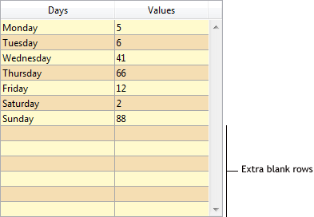

## Couleur de fond alternée

Permet de définir une couleur d'arrière-plan différente pour les lignes / colonnes impaires dans une list box. Par défaut, *Automatique* est sélectionné : la colonne utilise la couleur de fond alternative définie au niveau de la list box.

You can also set this property using the [`OBJECT SET RGB COLORS`](https://doc.4d.com/4dv20/help/command/en/page628.html) command.

#### Grammaire JSON

| Nom           | Type de données | Valeurs possibles                                                        |
| ------------- | --------------- | ------------------------------------------------------------------------ |
| alternateFill | string          | toutes les valeurs css; "transparent"; "automatic"; "automaticAlternate" |

#### Objets pris en charge

[List Box](listbox_overview.md#overview) - [Colonne List Box](listbox_overview.md#list-box-columns)

---

## Couleur de fond

Définit la couleur de fond d'un objet.

Dans le cas d'une list box, par défaut *Automatique* est sélectionné : la colonne utilise la couleur de fond définie au niveau de la list box.

You can also set this property using the [`OBJECT SET RGB COLORS`](https://doc.4d.com/4dv20/help/command/en/page628.html) command.

#### Grammaire JSON

| Nom  | Type de données | Valeurs possibles                          |
| ---- | --------------- | ------------------------------------------ |
| fill | string          | une valeur css; "transparent"; "automatic" |

#### Objets pris en charge

[Hierarchical List](list_overview.md) - [Input](input_overview.md) - [List Box](listbox_overview.md) - [List Box Column](listbox_overview.md#list-box-columns) - [List Box Footer](listbox_overview.md#list-box-footers) - [Oval](shapes_overview.md#oval) - [Rectangle](shapes_overview.md#rectangle) - [Text Area](text.md)

#### Voir également

[Transparent](#transparent)

---

## Expression couleur de fond

`List box de type collection et de type sélection d'entité`

Une expression ou une variable (les variables de tableau ne peuvent pas être utilisées) pour appliquer une couleur d'arrière-plan personnalisée à chaque ligne de la list box. L'expression ou la variable sera évaluée pour chaque ligne affichée et doit retourner une valeur de couleur RGB. For more information, refer to the description of the [`OBJECT SET RGB COLORS`](https://doc.4d.com/4dv20/help/command/en/page628.html) command in the *4D Language Reference manual*.

You can also set this property using the [`LISTBOX SET PROPERTY`](https://doc.4d.com/4dv20/help/command/en/page1440.html) command with `lk background color expression` constant.

> Avec les list box de type collection ou sélection d'entité, cette propriété peut également être définie à l'aide d'une [Meta Info Expression](properties_Text.md#meta-info-expression).

#### Grammaire JSON

| Nom           | Type de données | Valeurs possibles                                   |
| ------------- | --------------- | --------------------------------------------------- |
| rowFillSource | string          | Une expression retournant une valeur de couleur RGB |

#### Objets pris en charge

[List Box](listbox_overview.md#overview) - [Colonne List Box](listbox_overview.md#list-box-columns)

---

## Style de la bordure

Permet de définir un style standard pour la bordure de l'objet.

#### Grammaire JSON

| Nom         | Type de données | Valeurs possibles                                                 |
| ----------- | --------------- | ----------------------------------------------------------------- |
| borderStyle | text            | "system", "none", "solid", "dotted", "raised", "sunken", "double" |

#### Objets pris en charge

[4D View Pro Area](viewProArea_overview.md) - [4D Write Pro areas](writeProArea_overview.md) - [Buttons](button_overview.md) - [Button Grid](buttonGrid_overview.md) - [Hierarchical List](list_overview.md#overview) - [Input](input_overview.md) - [List Box](listbox_overview.md#overview) - [Picture Button](pictureButton_overview.md) - [Picture Pop-up Menu](picturePopupMenu_overview.md) - [Plug-in Area](pluginArea_overview.md#overview) - [Progress Indicator](progressIndicator.md) - [Ruler](ruler.md) - [Spinner](spinner.md) - [Stepper](stepper.md) - [Subform](subform_overview.md#overview) - [Text Area](text.md) - [Web Area](webArea_overview.md#overview)

---

## Type de ligne pointillée

Décrit le type de ligne en pointillé comme une séquence de points noirs et blancs.

#### Grammaire JSON

| Nom             | Type de données            | Valeurs possibles                                                                                                                                |
| --------------- | -------------------------- | ------------------------------------------------------------------------------------------------------------------------------------------------ |
| strokeDashArray | tableau numérique ou texte | Ex : "6 1" ou \[6,1\] pour une séquence de 6 points noirs et 1 point blanc |

#### Objets pris en charge

[Rectangle](shapes_overview.md#rectangle) - [Ovale](shapes_overview.md#oval) - [Ligne](shapes_overview.md#line)

---

## Masquer lignes vides finales

Contrôle l'affichage des lignes vides supplémentaires ajoutées au bas d'un objet list box. Par défaut, 4D ajoute ces lignes supplémentaires pour remplir la zone vide :



Vous pouvez supprimer ces lignes vides en sélectionnant cette option. Le bas de l'objet list box est alors laissé vide :


#### Grammaire JSON

| Nom                | Type de données | Valeurs possibles |
| ------------------ | --------------- | ----------------- |
| hideExtraBlankRows | boolean         | true, false       |

#### Objets pris en charge

[List Box](listbox_overview.md#overview)

---

## Couleur du trait

Désigne la couleur des lignes de l'objet.
La couleur peut être spécifiée par :

- un nom de couleur - comme "red"
- une valeur HEX - comme "# ff0000"
- une valeur RVB - comme "rgb (255,0,0)"

You can also set this property using the [`OBJECT SET RGB COLORS`](https://doc.4d.com/4dv20/help/command/en/page628.html) command.

#### Grammaire JSON

| Nom    | Type de données | Valeurs possibles                          |
| ------ | --------------- | ------------------------------------------ |
| stroke | string          | une valeur css; "transparent"; "automatic" |

> Cette propriété est également disponible pour les objets à base de texte, auquel cas elle désigne à la fois la couleur de la police et les lignes de l'objet, voir [Couleur de la police](properties_Text.md#font-color).

#### Objets pris en charge

[Ligne](shapes_overview.md#line) - [Ovale](shapes_overview.md#oval) - [Rectangle](shapes_overview.md#rectangle)

---

## Epaisseur du trait

Désigne l'épaisseur d'une ligne.

#### Grammaire JSON

| Nom         | Type de données | Valeurs possibles                                                                                                |
| ----------- | --------------- | ---------------------------------------------------------------------------------------------------------------- |
| strokeWidth | number          | 0 pour la plus petite largeur dans un formulaire imprimé, ou toute valeur d'entier < 20 |

#### Objets pris en charge

[Ligne](shapes_overview.md#line) - [Ovale](shapes_overview.md#oval) - [Rectangle](shapes_overview.md#rectangle)

---

## Tableau couleurs de fond

`Array type list boxes`

Le nom d'un tableau pour appliquer une couleur d'arrière-plan personnalisée à chaque ligne ou colonne de la list box.

Le nom d'un tableau Entier long doit être saisi. Chaque élément de ce tableau correspond à une ligne de la zone de list box (si elle est appliquée à la liste box) ou à une cellule de la colonne (si elle est appliquée à une colonne), le tableau doit donc avoir la même taille que le tableau associé à la colonne. Vous pouvez utiliser les constantes du thème [SET RGB COLORS](https://doc.4d.com/4Dv20/4D/20.1/SET-RGB-COLORS.302-6481080.en.html). Si vous souhaitez que la cellule hérite de la couleur d'arrière-plan définie au niveau supérieur, passez la valeur -255 à l'élément de tableau correspondant.

Par exemple, considérons une list box où les lignes ont une couleur alternée gris/gris clair, définie dans les propriétés de la list box. Un tableau de couleurs d'arrière-plan a également été défini pour la list box afin de changer en orange clair la couleur des lignes où au moins une valeur est négative :

```4d
 <>_BgndColors{$i}:=0x00FFD0B0 // orange
 <>_BgndColors{$i}:=-255 // default value
```


Vous souhaitez ensuite colorer les cellules avec des valeurs négatives en orange foncé. Pour ce faire, vous définissez un tableau de couleurs d'arrière-plan pour chaque colonne, par exemple `<>_BgndColor_1`, `<>_BgndColor_2` et `<>_BgndColor_3`. Les valeurs de ces tableaux ont la priorité sur celles définies dans les propriétés de list box ainsi que sur celles du tableau de couleurs d'arrière-plan général :

```4d
 <>_BgndColorsCol_3{2}:=0x00FF8000 // dark orange
 <>_BgndColorsCol_2{5}:=0x00FF8000
 <>_BgndColorsCol_1{9}:=0x00FF8000
 <>_BgndColorsCol_1{16}:=0x00FF8000
```


You can get the same result using the [`LISTBOX SET ROW FONT STYLE`](https://doc.4d.com/4dv20/help/command/en/page1268.html) and [`LISTBOX SET ROW COLOR`](https://doc.4d.com/4dv20/help/command/en/page1270.html) commands. Elles ont l'avantage de vous permettre d'éviter d'avoir à prédéfinir des tableaux de style/couleur pour les colonnes : ils sont créés dynamiquement par les commandes.

#### Grammaire JSON

| Nom           | Type de données | Valeurs possibles                             |
| ------------- | --------------- | --------------------------------------------- |
| rowFillSource | string          | Nom d'un tableau entier long. |

#### Objets pris en charge

[List Box](listbox_overview.md) - [Colonne List Box](listbox_overview.md#list-box-columns)

---

## Transparent

Définit l'arrière-plan de la list box sur "Transparent". When set, any [alternate background color](#alternate-background-color) or [background color](#background-color--fill-color) defined for the column is ignored.

#### Grammaire JSON

| Nom  | Type de données | Valeurs possibles |
| ---- | --------------- | ----------------- |
| fill | text            | "transparent"     |

#### Objets pris en charge

[List Box](listbox_overview.md#overview)

#### Voir également

[Background Color / Fill Color](#background-color--fill-color)
