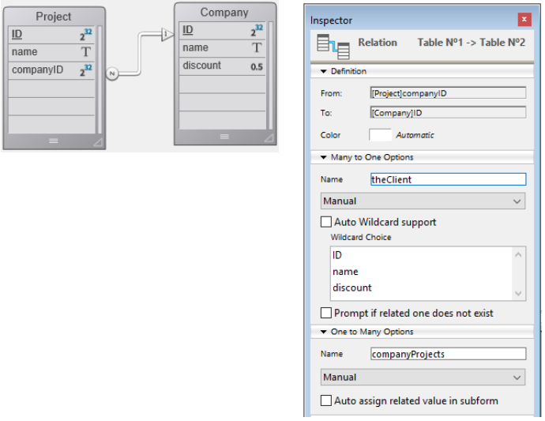

La technologie ORDA est fondée sur une cartographie automatique d'une structure de base sous-jacente. Elle permet également d'accéder aux données via des objets sélection d'entités (entity selection) et entité (entity). Par conséquent, ORDA expose la base de données entière comme un ensemble d'objets de modèle de données.

## Correspondance de la structure

When you call a datastore using the [`ds`](commands/ds.md) or the [`Open datastore`](commands/open-datastore.md) command, 4D automatically references tables and fields of the corresponding 4D structure as properties of the returned [datastore](#datastore) object:

- Les tables correspondent à des dataclasses.
- Les champs correspondent à des attributs de stockage.
- Les relations correspondent à des attributs de relation - les noms de relation, définis dans l'éditeur de structure, sont utilisés comme noms d'attribut de relation.


### Règles générales

Les règles suivantes s'appliquent à toutes les conversions :

- Les noms de table, de champ et de relation correspondent à des noms de propriété d'objet. Assurez-vous que ces noms sont conformes aux règles générales de dénomination des objets, comme expliqué dans la section [Conventions de dénomination des objets](Concepts/identifiers.md).
- Un datastore ne référence que les tables avec une seule clé primaire. Les tables suivantes ne sont pas référencées :
  - Tables sans clé primaire
  - Tables avec clés primaires composites.
- Les champs BLOB sont automatiquement disponibles comme attributs de type [objet Blob](Concepts/dt_blob.md#blob-types).

> La correspondance ORDA ne prend pas en compte :
>
> - l'option "Invisible" pour les tables ou les champs,
> - la structure virtuelle définie par `SET TABLE TITLES` ou `SET FIELD TITLES`,
> - la propriété "manuelle" ou "automatique" des relations.

### Règles de contrôle d'accès à distance

Lorsque vous accédez à un datastore distant via la commande `Ouvrir datastore` ou des [requêtes REST](REST/gettingStarted.md), seules les tables et les champs avec la propriété de ressource **Expose as REST resource** sont disponibles à distance.

Cette option doit être choisie au niveau de la structure 4D pour chaque table et chaque champ que vous souhaitez voir apparaître comme dataclass et attribut dans le datastore :


### Mise à jour des données

Toute modification apportée à la structure de la base invalide la couche courante de données ORDA. Ces modifications incluent :

- l'ajout ou la suppression d'une table, d'un champ ou d'une relation
- le renommage d'une table, d'un champ ou d'une relation
- la modification d'une propriété principale d'un champ (type, unique, index, autoincrement, valeur null)

Lorsque la couche courante de données ORDA est invalidée, elle est automatiquement rechargée et mise à jour dans les prochains appels du datastore local `ds` vers 4D et 4D Server. A noter que les références existantes vers des objets ORDA tels que des entités ou des sélections d'entités continueront d'utiliser les données à partir desquelles elles ont été créées, et ce jusqu'à ce qu'elles soient regénérées.

Toutefois, la couche de données ORDA mise à jour n'est pas automatiquement disponible dans les contextes suivants :

- une application 4D distante connectée à 4D Server -- l'application distante doit être reconnectée au serveur.
- un datastore distant ouvert à l'aide de `Ouvrir datastore` ou des [appels REST](REST/gettingStarted.md) -- une nouvelle session doit être ouverte.

## Définitions des objets

### Datastore

Un datastore est l'objet d'interface d'une base de données. Il crée une représentation de toute la base sous forme d'objet. Un datastore est constitué d'un **modèle** et à de **données** :

- Le modèle contient et décrit toutes les dataclasses qui composent le datastore. Il est indépendant de la base de données sous-jacente.
- Les données se réfèrent à l'information qui va être utilisée et stockée dans ce modèle. Par exemple, les noms, adresses et dates de naissance des employés sont des éléments de données que vous pouvez utiliser dans un datastore.

Lorsqu'il est géré via le code, le datastore est un objet dont les propriétés sont toutes les [dataclasses](#dataclass) ayant été spécifiquement exposées.

4d vous permet de gérer les datastores suivants :

- le datastore local, fondé sur la base 4D courante, retourné par la commande `ds` (le datastore principal).
- un ou plusieurs datastores distants, exposés en tant que ressources RESET dans des bases 4D distantes, retournés par la commande `Ouvrir datastore`.

Un datastore ne référence qu'une seule base de données locale ou distante.

L'objet datastore lui-même ne peut pas être copié en tant qu'objet :

```4d
$mydatastore:=OB Copy(ds) //retourne null
```

Les propriétés du datastore sont toutefois énumérables :

```4d
 ARRAY TEXT($prop;0)
 OB GET PROPERTY NAMES(ds;$prop)
  //$prop contient les noms de toutes les dataclasses
```

Le datastore principal (par défaut) est toujours disponible via la commande `ds`, mais la commande `Ouvrir datastore` permet de référencer n'importe quel datastore distant.

### Dataclass

Une dataclasse est l'équivalent d'une table. Elle est utilisée comme modèle d'objet et référence tous les champs comme attributs, y compris les attributs relationnels (attributs construits à partir des relations entre les dataclasses). Les attributs relationnels peuvent être utilisés dans les requêtes comme tout autre attribut.

Toutes les dataclasses d'un projet 4D sont disponibles en tant que propriété du datastore `ds`. Pour les datastores distants accédés via `Open datastore` ou les [requêtes REST](REST/gettingStarted.md), l'option **Exposer comme ressource REST** doit être sélectionnée au niveau de la structure 4D pour chaque table que vous souhaitez exposer en tant que dataclass du datastore.

Par exemple, considérons cette table dans la structure suivante :


La table `Company` est automatiquement disponible en tant que dataclasse dans la banque de données `ds`. Vous pouvez écrire :

```4d
var $compClass : cs.Company //déclare une variable objet $compClass de la classe Company
$compClass:=ds.Company //affecte la référence de dataclasse Company à $compClass
```

Un objet dataclass peut contenir :

- attributes
- des attributs relationnels

La dataclass offre une abstraction de la base de données physique et permet de gérer un modèle de données conceptuel. La dataclass est le seul moyen d'interroger le datastore. Une requête est effectuée à partir d'une seule dataclass. Les requêtes sont construites autour des attributs et des noms d'attributs relationnels des dataclasses. Les attributs relationnels sont ainsi les moyens d'impliquer plusieurs tables liées dans une requête.

L'objet dataclass lui-même ne peut pas être copié en tant qu'objet :

```4d
$mydataclass:=OB Copy(ds.Employee) //retourne null
```

Les propriétés de la dataclass sont toutefois énumérables :

```code4d
ARRAY TEXT($prop;0)
OB GET PROPERTY NAMES(ds.Employee;$prop)
//$prop contient les noms de tous les attributs de dataclass
```

### Attribut

Les propriétés de dataclass sont des objets attribut décrivant les champs ou relations sous-jacents. Par exemple :

```4d
 $nameAttribute:=ds.Company.name //référence à un attribut de classe
 $revenuesAttribute:=ds.Company["revenues"] //méthode alternative
```

Ce code attribue à `$nameAttribute` et `$revenuesAttribute` des références aux attributs name et revenues de la classe `Company`. Cette syntaxe ne retourne PAS les valeurs contenues dans l'attribut, mais retourne plutôt des références aux attributs eux-mêmes. Pour gérer les valeurs, vous devez passer par les [Entités](#entite).

Tous les fichiers éligibles d'une table sont disponibles en tant qu'attributs de leur [dataclass](#dataclass) parente. Pour les datastores distants accessibles via `Open datastore` ou les [requêtes REST](REST/gettingStarted.md), l'option **Exposer comme ressource REST** doit être sélectionnée au niveau de la structure 4D pour chaque champ que vous souhaitez exposer en tant qu'attribut de dataclass.

#### Attributs de stockage et relationnels

Les attributs de la Dataclass sont de plusieurs types : storage, relatedEntity et relatedEntities. Les attributs scalaires (c'est-à-dire qui ne fournissent qu'une seule valeur) prennent en charge tous les types de données standard 4D (Entier, texte, objet, etc.).

- Un **attribut de stockage** (storage) est équivalent à un champ dans la base de données 4D et peut être indexé. Les valeurs affectées à un attribut de stockage sont stockées en tant que partie de l'entité lors de son enregistrement. Lorsqu'on accède à un attribut de stockage, sa valeur provient directement du datastore. Les attributs de stockage sont le bloc de construction le plus élémentaire d'une entité et sont définis par un nom et un type de données.
- Un **attribut relationnel** (relatedEntity et relatedEntities) donne accès à d'autres entités. Les attributs relationnels peuvent aboutir soit à une entité unique (ou à aucune entité), soit à une sélection d'entité (0 à N entités). Les attributs relationnels s'appuient sur les relations "classiques" dans la structure relationnelle pour fournir un accès direct à une entité ou à des entités reliées. Tous les attributs relationnels sont directement disponibles dans ORDA si vous utilisez leurs noms.

Prenons l'exemple de la structure de base de données partielle suivante et les propriétés relationnelles :



Tous les attributs relationnels seront disponibles automatiquement :

- dans la dataclass Project : "ID", "name", et "companyID"
- dans la dataclass Company : "ID", "name", et "discount"

En outre, les attributs relationnels suivant seront également disponibles automatiquement :

- dans la dataclass Project : l'attribut **theClient**, du type "relatedEntity" ; il y a au plus une compagnie pour chaque projet (le client)
- dans la dataclass Company : l'attribut **companyProjects**, du type "relatedEntities" ; pour chaque compagnie, il existe un certain nombre de projets reliés.

> La propriété manuelle ou automatique d'une relation de base de données n'a aucun effet dans ORDA.

Tous les attributs de la dataclass sont exposés en tant que propriétés de la dataclass :


Gardez à l'esprit que ces objets décrivent des attributs, mais ne donnent pas accès aux données. La lecture ou l'écriture des données se fait à travers des [objets entité](entities.md#using-entity-attributes).

#### Attributs calculés et Alias

Les [attributs calculés](ordaClasses.md#computed-attributes) et les[attributs alias](ordaClasses.md#alias-attributes) sont des attributs "virtuels". Leur valeur n'est pas stockée mais évaluée à chaque fois qu'on y accède. Ils n'appartiennent pas à la structure sous-jacente de la base, mais ils se basent sur elle et peuvent être utilisés comme n'importe quel champ du modèle de données.

### Entity

Une entité est l'équivalent d'un enregistrement. Il s'agit d'un objet qui fait référence à un enregistrement de la base de données. Elle peut être perçue comme une instance de la [dataclass](#dataclass), comme un enregistrement de la table correspondante à la dataclass. Toutefois, une entité contient également des données corrélées à la base de données liée au datastore.

Le but de l'entité est de gérer les données (créer, mettre à jour, supprimer). Lorsqu'une référence d'entité est obtenue au moyen d'une sélection d'entité, elle conserve également des informations sur la sélection d'entité qui permet une itération à travers la sélection.

L'objet entité lui-même ne peut pas être copié en tant qu'objet :

```4d
 $myentity:=OB Copy(ds.Employee.get(1)) //retourne null
```

Les propriétés de l'entité sont toutefois énumérables :

```4d
 ARRAY TEXT($prop;0)
 OB GET PROPERTY NAMES(ds.Employee.get(1);$prop)
  //$prop contient les noms de tous les attributs de l'entité
```

### Entity selection

Une entity selection est un objet contenant une ou plusieurs référence(s) à des entités appartenant à la même dataclasse. Elle est généralement créée à la suite d'une requête ou retournée à partir d'un attribut relationnel. Une entity selection peut contenir 0, 1 ou X entités de la dataclass - où X peut représenter le nombre total d'entités contenues dans la dataclass.

Voici un exemple :

```4d
var $e : cs.EmployeeSelection //déclare une variable objet $e de type de classe EmployeeSelection
$e:=ds.Employee.all() //assigne la référence de la sélection d'entité résultante à la variable $e
```

Les entity selections peuvent être "triées" ou "non triées" ([voir ci-dessous](#ordered-or-unordered-entity-selection)).

> Les entity selections peuvent également être "partageables" ou "non partageables", selon [la façon dont elles ont été créées](entities.md#shareable-or-alterable-entity-selections).

L'objet sélection d'entités lui-même ne peut pas être copié en tant qu'objet :

```4d
 $myentitysel:=OB Copy(ds.Employee.all()) //retourne null
```

Les propriétés des entity selections sont toutefois énumérables :

```4d
 ARRAY TEXT($prop;0)
 OB GET PROPERTY NAMES(ds.Employee.all();$prop)
  //$prop contient les noms des propriétés des sélections d'entités
  //("length", "00", "01"...)
```

#### Entity selections triées vs Entity selections non-triées

Pour des raisons d'optimisation, par défaut, 4D ORDA crée généralement des sélections d'entités non-ordonnées, sauf lorsque vous utilisez la méthode `orderBy( )` ou si vous utilisez les options appropriées. Dans cette documentation, sauf indication contraire, "entity selection" fait généralement référence à une "entity selection non-triée".

Les entity selections triées sont créées uniquement lorsque cela est nécessaire ou lorsqu'elles sont spécifiquement demandées à l'aide d'options, c'est-à-dire dans les cas suivants :

- résultat d'un `orderBy( )` sur une sélection (de n'importe quel type) ou un `orderBy( )` sur une dataclass,
- résultat de la méthode `newSelection( )` avec l'option `dk keep ordered`

Les sélections d'entités non-triées sont créées dans les cas suivants :

- résultat d'un `query()` standard sur une sélection (de n'importe quel type) ou un `query()` sur une dataclass,
- résultat de la méthode `newSelection()` sans option,
- résultat de l'une des méthodes de comparaison, quel que soit le type de sélection saisi : `or()`, `and()`, `minus()`.

> Les entity selections suivantes sont toujours **triées** :
>
> - entity selections retournées par 4D Server vers un client distant
> - entity selections basées sur des datastores distants.

Notez que lorsqu'une sélection d'entités ordonnée devient une sélection non-ordonnée, toute référence d'entité répétée est supprimée.
