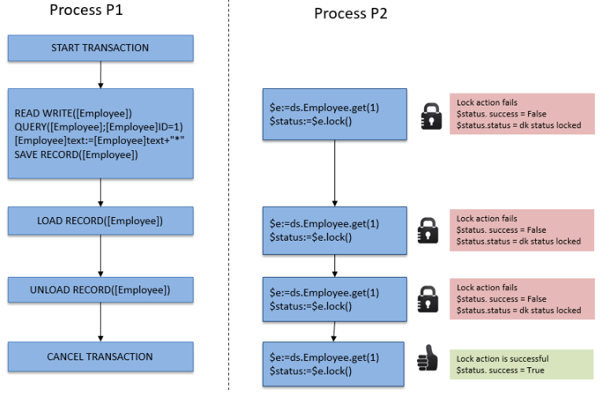

Dans ORDA, vous accédez aux données via des [entités](dsMapping.md#entity) (entities) et des [sélections d'entités](dsMapping.md#entity-selection) (entity selections). Ces objets vous permettent de créer, mettre à jour, rechercher ou trier les données du datastore.

## Créer une entité

Il existe deux façons de créer une nouvelle entité dans une dataclass :

- Étant donné que les entités sont des références à des enregistrements de la base de données, vous pouvez créer des entités en créant des enregistrements en utilisant le langage 4D, puis les référencer avec des fonctions ORDA telles que [`entity.next()`](../API/EntityClass.md#next) ou [`entitySelection.first()`](../API/EntitySelectionClass.md#first).
- Vous pouvez également créer une entité en utilisant la fonction [`dataClass.new()`](../API/DataClassClass.md#new).

Gardez à l'esprit que l'entité est créée uniquement en mémoire. Si vous souhaitez l'ajouter au datastore, vous devez appeler la fonction [`entity.save()`](../API/EntityClass.md#save).

Les attributs de l'entité sont directement disponibles en tant que propriétés de l'objet entité. Pour plus d'informations, reportez-vous à [Utilisation des attributs d'entité](#using-entity-attributes).

Par exemple, nous voulons créer une nouvelle entité dans la dataclass "Employee" dans le datastore courant avec "John" et "Dupont" affectés aux attributs de prénom et de nom :

```4d
var $myEntity : cs.EmployeeEntity
$myEntity:=ds.Employee.new() //Créer un nouvel objet de type entité
$myEntity.name:="Dupont" //assigner 'Dupont' à l'attribut 'name'
$myEntity.firstname:="John" //assigner 'John' à l'attribut 'firstname' 
$myEntity.save() //sauvegarder l'entité
```

> Une entité est définie uniquement dans le process où elle a été créée. Vous ne pouvez pas, par exemple, stocker une référence à une entité dans une variable interprocess et l'utiliser dans un autre process.

## Entités et références

Une entité contient une référence à un enregistrement 4D. Différentes entités peuvent référencer le même enregistrement 4D. De plus, comme une entité peut être stockée dans une variable objet 4D, différentes variables peuvent contenir une référence à la même entité.

Si vous exécutez le code suivant :

```4d
 var $e1; $e2 : cs.EmployeeEntity
 $e1:=ds.Employee.get(1) //accéder à l'employé avec ID 1
 $e2:=$e1
 $e1.name:="Hammer"
  //les variables $e1 et $e2 partagent la référence à la même entité
  //$e2.name contient "Hammer"
If($e1=$e2) //True
```

Ceci est illustré par le graphique suivant :


Maintenant, si vous exécutez :

```4d
 var $e1; $e2 : cs.EmployeeEntity
 $e1:=ds.Employee.get(1)
 $e2:=ds.Employee.get(1)
 $e1.name:="Hammer"
  //la variable $e1 contient une référence vers une entité
  //variable $e2 contient une autre référence vers une autre entité
  //$e2.name contient "smith"
If($e1=$e2) //False
```

Ceci est illustré par le graphique suivant :


A noter cependant que les entités font référence au même enregistrement. Dans tous les cas, si vous appelez la méthode `entity.save()`, l'enregistrement sera mis à jour (sauf en cas de conflit, voir [Verrouillage d'entité](#entity-locking)).

En fait, `$e1` et `$e2` ne sont pas l'entité elle-même, mais des références à l'entité. Cela signifie que vous pouvez les passer directement à n'importe quelle fonction ou méthode, et qu'elle agira comme un pointeur, et plus rapidement qu'un pointeur 4D. Par exemple :

```4d
 For each($entity;$selection)
    do_Capitalize($entity)
 End for each
```

Et la méthode est :

```4d
 $entity:=$1
 $name:=$entity.lastname
 If(Not($name=Null))
    $name:=Uppercase(Substring($name;1;1))+Lowercase(Substring($name;2))
 End if
 $entity.lastname:=$name
```

Vous pouvez gérer les entités comme n'importe quel autre objet dans 4D et passer leurs références directement en tant que [paramètres](Concepts/parameters.md).

:::info

Avec les entités, il n'y a pas le concept d'"enregistrement courant" comme dans le langage 4D. Vous pouvez utiliser autant d'entités que nécessaire, en même temps. Il n'existe pas non plus de verrouillage automatique d'une entité (voir [Verrouillage d'une entité](#entity-locking)). Lorsqu'une entité est chargée, elle utilise le mécanisme de [lazy loading](glossary.md#lazy-loading), ce qui signifie que seules les informations nécessaires sont chargées. Néanmoins, en mode client/serveur, l'entité peut être automatiquement chargée directement si nécessaire.

:::

## Utilisation des attributs d'entités

Les attributs d'entité stockent les données et sont reliés aux champs correspondants dans la table correspondante.

- les attributs du type **storage** peuvent être écrits ou lus en tant que simples propriétés de l'objet entité,
- les attributs du type **relatedEntity** renvoient une entité,
- les attributs du type **relatedEntities** renvoient une entity selection,
- les attributs **calculés** et **alias** peuvent renvoyer n'importe quel type de données, en fonction de la manière dont ils sont configurés.

:::info

Pour plus d'informations sur le type d'attribut, reportez-vous au paragraphe [Attributs de stockage et de relation](dsMapping.md#storage-and-relation-attributes).

:::

Par exemple, pour lire et écrire une valeur d'attribut de stockage de type chaîne :

```4d
 $entity:=ds.Employee.get(1) //obtenir l'attribut d'Employee avec l'ID 1
 $name:=$entity.lastname //obtenir le nom de l'employé, par exemple "Smith"
$entity.lastname:="Jones" //définir le nom de l'employé
$entity.save() //sauvegarder les modifications
```

> Les champs Blob des bases de données ([blobs scalaires](Concepts/dt_blob.md)) sont automatiquement convertis en attributs d'objets blob ([`4D.Blob`](Concepts/dt_blob.md)) lorsqu'ils sont traités par ORDA. Lorsque vous sauvegardez un attribut d'objet blob, gardez à l'esprit que, contrairement à la taille de l'objet blob qui n'est limitée que par la mémoire disponible, la taille du champ Blob est limitée à 2 Go.

L'accès à un attribut associé dépend du type d'attribut. Par exemple, avec la structure suivante :


Vous pouvez accéder aux données via le ou les objets associé(s) :

```4d
 $entity:=ds.Project.all().first().theClient //récupère l'entité Company associée au projet
 $EntitySel:=ds.Company.all().first().companyProjects //récupère la sélection de projets pour l'entreprise(Company)
```

Notez que dans l'exemple ci-dessus, _theClient_ et _companyProjects_ sont des attributs de relation et représentent une relation directe entre les deux dataclasses. Cependant, les attributs de relation peuvent également être créés sur des chemins via des relations à plusieurs niveaux, y compris des références circulaires. Par exemple, considérons la structure suivante :


Chaque employé peut être un manager et peut avoir un manager. Pour obtenir le manager du manager d'un employé, vous pouvez simplement écrire :

```4d
 $myEmp:=ds.Employee.get(50)
 $manLev2:=$myEmp.manager.manager.lastname
```

### Assigner des fichiers à des attributs image ou blob

Vous pouvez stocker des images dans les attributs image ; de même, vous pouvez stocker des données binaires dans les attributs blob.

ORDA vous permet d'assigner à l'attribut soit les données elles-mêmes, c'est-à-dire une image ou un objet blob, soit une référence **à un fichier** contenant les données. Seul le chemin d'accès au fichier est sauvegardé dans l'entité.

Grâce à cette fonctionnalité, vous pouvez réutiliser la même image dans plusieurs entités sans la dupliquer, organiser les fichiers comme vous le souhaitez ou les utiliser en dehors de 4D. De plus, vous pouvez contrôler la taille du fichier de données.

La référence du fichier peut être :

- un objet 4D.File
- un chemin au format POSIX

Voici un exemple :

```4d
Function createCompany($name : Text; $logo : 4D.File)

	var $company : cs.CompanyEntity
	$company:=ds.Company.new()

	$company.name:=$name
		//affectation en utilisant un objet file
	$company.logo:=$logo
		//affectation en utilisant un chemin
	$company.datablob:="/RESOURCES/"+$name+"/data.bin"
	$company.save()
```

Indépendamment de la façon dont l'attribut est assigné (données elles-mêmes ou référence à un fichier), l'accès en lecture à l'attribut est transparent du point de vue de l'utilisateur.

Le fichier n'a pas besoin d'exister sur le disque au moment de l'assignation (aucune erreur n'est renvoyée dans ce cas). Si le fichier référencé n'est pas trouvé lors de la lecture de l'attribut, une valeur nulle est renvoyée.

:::tip

4D charge les images et les données dans un cache local. Si le fichier référencé est modifié après son chargement, vous devez réaffecter le fichier pour que la modification soit prise en compte dans l'application.

:::

:::note

L'assignation de référence de fichier n'est prise en charge qu'en mode local (4D Server ou 4D mono-utilisateur). Une erreur est générée si l'assignation est effectuée à distance ou via une requête REST.

:::

### Assigner des valeurs aux attributs de relation

Dans l'architecture ORDA, les attributs de relation contiennent directement des données liées aux entités :

- Un attribut de relation de type N-> 1 (type **relatedEntity**) contient une entité
- Un attribut de relation de type 1-> N (type **relatedEntities**) contient une sélection d'entité

Regardons la structure (simplifiée) suivante :


Dans cet exemple, une entité de la dataclass "Employee" contient un objet de type Entité dans l'attribut "employer" (ou une valeur nulle). Une entité de la dataclass "Company" contient un objet de type EntitySelection dans l'attribut "staff" (ou une valeur nulle).

> Dans ORDA, la propriété Automatic ou Manual des relations ne produit aucun effet.

Pour attribuer une valeur directement à l'attribut "employer", vous devez passer une entité existante de la dataclass "Company". Par exemple :

```4d
 $emp:=ds.Employee.new() // créer un employé
 $emp.lastname:="Smith" // attribuer une valeur à un attribut
 $emp.employer:=ds.Company.query("name =:1";"4D")[0]  //attribuer une entité de "company"
 $emp.save()
```

Vous pouvez également obtenir directement l'entité "1" liée par le biais de sa valeur de clé primaire (nombre ou texte). Par exemple :

```4d
 $emp:=ds.Employee.new()
 $emp.lastname:="Wesson"
 $emp.employer:=ds.Company.get(2)
  //obtient l'entité Company avec la valeur de clé primaire 2
  //l'assigne à l'employé
 $emp.save()
```

Ceci est particulièrement utile lorsque vous importez un grand nombre de données à partir d'une base de données relationnelle. Ce type d'import contient généralement une colonne "ID", qui référence une clé primaire que vous pouvez ensuite affecter directement à un attribut de relation.

Vous pouvez attribuer ou modifier la valeur d'un attribut d'entité associé "1" à partir de la dataclass "N" directement via l'attribut associé. Par exemple, si vous souhaitez modifier l'attribut de nom d'une entité "Company" associée d'une entité "Employee", vous pouvez écrire :

```code4d
 $emp:=ds.Employee.get(2) // charger l'entité Employee avec la clé primaire 2
 $emp.employer.name:="4D, Inc." //modifier l'attribut "name" de nom de la société (Company) liée
 $emp.employer.save() //sauvegarde l'attribut associé
  //l'entité associée est mise à jour
```

## Créer une entity selection (sélection d'entités)

Vous pouvez créer un objet de type [entity selection](dsMapping.md#entity-selection) comme suit :

- En lançant une requête sur les entités [dans une dataclass](API/DataClassClass.md#query) ou dans une [entity selection existante](API/EntitySelectionClass.md#query) ;
- En utilisant la fonction [`.all()`](API/DataClassClass.md#all) pour sélectionner toutes les entités d'une dataclass ;
- Using the [`Create entity selection`](../commands/create-entity-selection.md) command or the [`.newSelection()`](API/DataClassClass.md#newselection) dataclass function to create a blank entity selection;
- En utilisant la fonction [`.copy()`](API/EntitySelectionClass.md#copy) pour dupliquer une entity selection existante ;
- En utilisant l'une des différentes fonctions de la [classe Entity selection](API/EntitySelectionClass.md) qui retourne une nouvelle entity selection, comme [`.or()`](API/EntitySelectionClass.md#or) ;
- En utilisant un attribut de relation de type "related entities" (voir ci-dessous).

:::note

Vous pouvez filtrer les entités qui doivent être incluses dans les entity selections pour une dataclass en fonction de règles métier, grâce à la fonction d'[entity selection restreinte](#restricting-entity-selections).

:::

Vous pouvez créer et utiliser simultanément autant de sélections d'entités différentes que vous le souhaitez pour une dataclass. A noter qu'une sélection d'entité ne contient que des références à des entités. Différentes sélections d'entités peuvent contenir des références vers les mêmes entités.

:::note

Lorsque des entités sont supprimées, leurs références restent dans l'entity selection avec une valeur _undefined_. Dans ce cas, vous pouvez appeler la fonction [`.clean()`](API/EntitySelectionClass.md#clean) pour obtenir une nouvelle entity selection sans les références d'entités supprimées.

:::

### Entity selections partageables ou modifiables

Une entity selection peut être **partageable** (lisible par plusieurs process, mais non modifiable après sa création) ou **modifiable** (supporte la fonction [`.add()`](API/EntitySelectionClass.md#add), mais utilisable uniquement par le process courant).

#### Propriétés

Une entity selection **partageable** a les caractéristiques suivantes :

- elle peut être stockée dans un objet partagé ou une collection partagée, et peut être passée comme paramètre entre plusieurs process ou workers ;
- it can be stored in several shared objects or collections, or in a shared object or collection which already belongs to a group;
- elle ne permet pas d'ajouter de nouvelles entités. Essayer d'ajouter une entité à une entity selection partageable génèrera une erreur (1637 - Cette entity selection ne peut pas être modifiée). Pour ajouter une entité à une entity selection partageable, vous devez d'abord la transformer en une entity selection non partageable en utilisant la fonction [`.copy()`](API/EntitySelectionClass.md#copy) avant d'appeler [`.add()`](API/EntitySelectionClass.md#add).

> La plupart des fonctions d'entity selection (telles que [`.slice()`](API/EntitySelectionClass.md#slice), [`.and()`](API/EntitySelectionClass.md#and)...) prennent en charge les entity selection partageables puisqu'elles ne modifient pas la sélection d'origine (elles en renvoient une nouvelle).

Une entity selection **modifiable** a les caractéristiques suivantes :

- elle ne peut pas être partagée entre les process, ni être stockée dans un objet partagé ou une collection partagée. Essayer de stocker une entity selection non partageable dans un objet partagé ou une collection partagée génèrera une erreur (-10721 - Type de valeur non pris en charge dans un objet partagé ou une collection partagée) ;
- elle accepte l'ajout de nouvelles entités, c'est-à-dire qu'elle prend en charge la fonction [`.add()`](API/EntitySelectionClass.md#add).

#### Comment les définir ?

La nature **partageable** ou **modifiable** d'une entity selection est définie lors de sa création (elle ne peut pas être modifiée par la suite). Vous pouvez connaître la nature d'une entity selection à l'aide de la fonction [.isAlterable()](API/EntitySelectionClass.md#isalterable) ou de la commande `OB Is shared`.

Une nouvelle entity selection est **partageable** dans les cas suivants :

- la nouvelle entity selection résulte d'une fonction de classe ORDA appliquée à une dataClass : [dataClass.all()](API/DataClassClass.md#all), [dataClass.fromCollection()](API/DataClassClass.md#fromcollection), [dataClass.query()](API/DataClassClass.md#quer
- la nouvelle entity selection est basée sur une relation [entity._attributeName_](API/EntityClass.md#attributename) (par exemple, "company.employees") lorsque _attributeName_ est un attribut lié 1-vers-N mais que l'entité n'appartient pas à une entity selection.
- la nouvelle entity selection est explicitement copiée comme partageable avec [entitySelection.copy()](API/EntitySelectionClass.md#copy) ou `OB Copy` (c'est-à-dire avec l'option `ck shared`).

Voici un exemple :

```4d
var $myComp : cs.CompanyEntity
var $employees : cs.EmployeeSelection
$myComp:=ds.Company.get(2) //$myComp n'appartient pas à une entity selection
$employees:=$myComp.employees //$employees est partageable
```

Une nouvelle entity selection est **modifiable** dans les cas suivants :

- nouvelle entity selection créée vide à l'aide de la fonction [dataClass.newSelection()](API/DataClassClass.md#newselection) ou de la commande `Create entity selection`,
- nouvelle entity selection explicitement copiée comme modifiable avec [entitySelection.copy()](API/EntitySelectionClass.md#copy) ou `OB Copy` (c'est-à-dire sans l'option `ck shared`).

Voici un exemple :

```4d
var $toModify : cs.CompanySelection
$toModify:=ds.Company.all().copy() //$toModify est modifiable
```

Une nouvelle entity selection **hérite** de la nature de l'entity selection originale dans les cas suivants :

- la nouvelle entity selection résulte de l'une des diverses fonctions des classes ORDA appliquées à une entity selection existante ([.query()](API/EntitySelectionClass.md#query), [.slice()](API/EntitySelectionClass.md#slice), etc.) .
- la nouvelle entity selection est basée sur une relation :
  - [entity._attributeName_](API/EntityClass.md#attributename) (par exemple "company.employees") lorsque _attributeName_ est un attribut lié de type "1-vers-N" et que l'entité appartient à une entity selection (de même nature que l'entity selection [.getSelection()](API/EntityClass.md#getselection)),
  - [entitySelection._attributeName_](API/EntitySelectionClass.md#attributename) (par exemple "employees.employer") lorsque _attributeName_ est un attribut lié (de même nature que l'entity selection),
  - [.extract()](API/EntitySelectionClass.md#extract), lorsque la collection résultante contient des sélections d'entités (de même nature que l'entity selection'").

Exemples :

```4d
var $highSal; $lowSal : cs.EmployeeSelection
var $comp; $comp2 : cs.Company

$highSal:=ds.Employee.query("salary >= :1"; 1000000)   

	//$highSal est partageable en raison de la recherche sur la dataclass
$comp:=$highSal.employer //$comp est partageable car $highSal est partageable

$lowSal:=ds.Employee.query("salary <= :1"; 10000).copy()
	//$lowSal est modifiable en raison du copy()
$comp2:=$lowSal.employer //$comp2 est modifiable car $lowSal est modifiable
```

:::note Entity selections retournées depuis le serveur

Dans l'architecture client/serveur, les entity selections renvoyées par le serveur sont toujours partageables sur le client, même si [`copy()`](API/EntitySelectionClass.md#copy) a été appelée sur le serveur. Pour rendre une telle entity selection modifiable côté client, vous devez exécuter [`copy()`](API/EntitySelectionClass.md#copy) côté client. Voici un exemple :

```4d
	//une fonction est toujours exécutée sue le serveur
exposed Function getSome() : cs.MembersSelection
    return This.query("ID >= :1"; 15).orderBy("ID ASC")

	//dans une méthode, éxécuter côté distant
var $result : cs.MembersSelection
var $alterable : Boolean
$result:=ds.Members.getSome() //$result est partageable
$alterable:=$result.isAlterable() //False

$result:=ds.Members.getSome().copy() // $result est maintenant modifiable
$alterable:=$result.isAlterable() // True
```

:::

#### Partage d'une entity selection entre process (exemple)

Vous travaillez avec deux entity selections que vous souhaitez transmettre à un process worker afin qu'il puisse envoyer des mails aux personnes concernées :

```4d

var $paid; $unpaid : cs.InvoicesSelection
//Nous obtenons les entity selections pour les factures payées et non payées
$paid:=ds.Invoices.query("status=:1" ; "Paid")
$unpaid:=ds.Invoices.query("status=:1" ; "Unpaid")

//Nous transmettons les références des entity selection comme paramètres au worker
CALL WORKER("mailing" ; "sendMails" ; $paid; $unpaid)

```

La méthode `sendMails` :

```4d

 #DECLARE ($paid : cs.InvoicesSelection; $unpaid : cs.InvoicesSelection)
 var $invoice : cs.InvoicesEntity

 var $server; $transporter; $email; $status : Object

  //Prepare emails
 $server:=New object()
 $server.host:="exchange.company.com"
 $server.user:="myName@company.com"
 $server.password:="my!!password"
 $transporter:=SMTP New transporter($server)
 $email:=New object()
 $email.from:="myName@company.com"

  //Loops on entity selections
 For each($invoice;$paid)
    $email.to:=$invoice.customer.address // email address of the customer
    $email.subject:="Payment OK for invoice # "+String($invoice.number)
    $status:=$transporter.send($email)
 End for each

 For each($invoice;$unpaid)
    $email.to:=$invoice.customer.address // email address of the customer
    $email.subject:="Please pay invoice # "+String($invoice.number)
    $status:=$transporter.send($email)
 End for each
```

### Entity selections et attributs de stockage

Tous les attributs de stockage (texte, numérique, booléen, date) sont disponibles en tant que propriétés d'entity selections et propriétés d'entités. Lorsqu'il est utilisé avec une entity selection, un attribut scalaire retourne une collection de valeurs scalaires. Par exemple :

```4d
var $locals : cs.PersonSelection
var $localEmails : Collection
$locals:=ds.Person.query("city = :1" ; "San Jose") //entity selection de personnes
$localEmails:=$locals.emailAddress //collection d'adresses mails (chaînes)
```

Ce code retourne dans _$localEmails_ une collection d'adresses e-mail sous forme de chaînes.

### Entity selections et attributs relationnels

En plus des multiples manières d'effectuer des recherches, vous pouvez également utiliser les attributs relationnels comme propriétés des entity selections afin de renvoyer de nouvelles entity selections. Par exemple, considérons la structure suivante :


```4d
var $myParts : cs.PartSelection
var $myInvoices : cs.InvoiceSelection
$myParts:=ds.Part.query("ID < 100") //Retourne les pièces dont l'ID est inférieur à 100
$myInvoices:=$myParts.invoiceItems.invoice
  //Toutes les factures avec au moins une ligne liée à une pièce de $myParts
```

La dernière ligne renverra dans _$myInvoices_ une entity selection de toutes les factures qui ont au moins une ligne liée à une pièce dans l'entity selection myParts. Lorsqu'un attribut relationnel est utilisé comme propriété d'une entity selection, le résultat est toujours une autre entity selection, même si une seule entité est retournée. Lorsqu'un attribut relationnel est utilisé comme propriété d'une entity selection et qu'aucune entité n'est retournée, le résultat est une entity selection vide, et non nulle.

## Entity selections restreintes

Dans ORDA, vous pouvez créer des filtres pour restreindre l'accès aux entités de n'importe quelle dataclass. Une fois implémenté, un filtre est automatiquement appliqué chaque fois qu'on accède aux entités de la dataclass soit par les fonctions de classe **ORDA** telles que [`all()`](../API/DataClassClass.md#all) ou [`query()`](../API/EntitySelectionClass.md#query), soit par l'[**API REST**](../category/api-dataclass) (ce qui inclut l'[Explorateur de données](../Admin/dataExplorer.md) et les [datastores distants](remoteDatastores.md)).

Un filtre crée une vue restreinte des données, basée sur des règles métier telles que l'utilisateur de la session courante. Par exemple, dans une application utilisée par des vendeurs pour conclure des marchés avec leurs clients, vous pouvez limiter les clients accessibles à ceux gérés par le vendeur authentifié.

:::info

Les filtres s'appliquent aux **entités**. Si vous souhaitez restreindre l'accès à une **dataclass** elle-même ou à un ou plusieurs de ses **attributs**, vous pourriez envisager d'utiliser des [privilèges de session](privileges.md) qui sont plus appropriés dans ce cas.

:::

### Comment définir un filtre de restriction

Vous créez un filtre pour une dataclass en définissant une fonction `event restrict` dans la [**classe dataclass**](dsMapping.md#classe-dataclass) de la dataclass. Le filtre est alors automatiquement activé.

### `Function event restrict`

#### Syntaxe

```4d
Function event restrict() -> $result : cs.*DataClassName*Selection
// code
```

Cette fonction est appelée chaque fois qu'une entity selection ou une entité de la dataclass est demandée. Le filtre est exécuté une seule fois, lors de la création de l'entity selection.

Le filtre doit retourner une entity selection de la dataclass. Il peut s'agir d'une entity selection basée sur une recherche, stockée dans le [`Storage`], etc.

:::note

Pour des raisons de performances, nous recommandons d'utiliser les **attributs indexés** dans la définition du filtre.

:::

La fonction doit retourner une entity selection valide de la dataclass. Aucun filtre n'est appliqué (toutes les entités correspondant à la requête initiale sont retournées) si :

- la fonction retourne **null**,
- la fonction retourne **undefined**,
- la fonction ne retourne pas une entity selection valide.

#### Exemple

Lorsqu'on y accède à partir d'une requête web ou REST, nous voulons que la dataclass Customers n'expose que les clients appartenant au vendeur identifié. Pendant la phase d'authentification, le vendeur est stocké dans l'objet `Session`. D'autres types de requêtes sont également traitées.

```4d
Class extends DataClass


Function event restrict() : cs.CustomersSelection


    	//Nous travaillons dans un contexte web ou REST
    If (Session#Null)

        Case of
                // Ne renvoie que les clients du vendeur authentifié stocké dans la session
            : (Session.storage.salesInfo#Null)
                return This.query("sales.internalId = :1" ; Session.storage.salesInfo.internalId)

                //Explorateur de données - Aucun filtre n'est appliqué
            : (Session.hasPrivilege("WebAdmin"))
                return Null
            Else
                //Aucun client ne peut être lu
                return This.newSelection()

        End case

    Else // Nous travaillons en client serveur
        return This.query("sales.userName = :1" ; Current user)
    End if
```

### Détails de l'activation du filtre

Les filtres s'appliquent à toutes les requêtes ORDA ou REST exécutées dans vos projets 4D (architectures monoposte et client/serveur). Un filtre est activé dès que le projet est ouvert, c'est-à-dire qu'il peut être déclenché dans la méthode base `On Startup`.

:::info

Les filtres ne s'appliquent pas aux sélections d'enregistrements classiques gérées à travers l'interface 4D ou le langage 4D (par exemple lors de l'appel à `ALL RECORDS`).

:::

| Fonctions                                                                                                | Commentaire                                                                                                                                                                                                                                                                                                                                                                                                                  |
| -------------------------------------------------------------------------------------------------------- | ---------------------------------------------------------------------------------------------------------------------------------------------------------------------------------------------------------------------------------------------------------------------------------------------------------------------------------------------------------------------------------------------------------------------------- |
| [dataclass.get()](../API/DataClassClass.md#get)                       | Si l'entité ne correspond pas au filtre, `null` est renvoyé                                                                                                                                                                                                                                                                                                                                                                  |
| [entity.reload()](../API/EntityClass.md#reload)                       | Uniquement en client/server et datastores distants                                                                                                                                                                                                                                                                                                                                                                           |
| [dataclass.all()](../API/DataClassClass.md#all)                       |                                                                                                                                                                                                                                                                                                                                                                                                                              |
| [dataclass.fromCollection()](../API/DataClassClass.md#fromcollection) | <li>En cas de mise à jour, seules les entités correspondant au filtre peuvent être mises à jour. Si la collection fait référence à des entités ne correspondant pas au filtre, elles sont créées en tant que nouvelles entités (si aucune erreur de clé primaire en double n'est détectée)</li><li>En cas de création, les entités ne correspondant pas au filtre sont créées mais ne seront pas lues après la création</li> |
| [entitySelection.and()](../API/EntitySelectionClass.md#and)           | Seules les entités correspondant au filtre sont retournées                                                                                                                                                                                                                                                                                                                                                                   |
| [entitySelection.or()](../API/EntitySelectionClass.md#or)             | Seules les entités correspondant au filtre sont retournées                                                                                                                                                                                                                                                                                                                                                                   |
| [entitySelection.minus()](../API/EntitySelectionClass.md#minus)       | Seules les entités correspondant au filtre sont retournées                                                                                                                                                                                                                                                                                                                                                                   |
| [dataclass.query()](../API/DataClassClass.md#query)                   |                                                                                                                                                                                                                                                                                                                                                                                                                              |
| [entitySelection.query()](../API/EntitySelectionClass.md#query)       |                                                                                                                                                                                                                                                                                                                                                                                                                              |
| [entitySelection.attributeName](../API/EntitySelectionClass.md#attributename)            | Filtre appliqué si _attributeName_ est une entité liée ou des entités liées d'une dataclass filtrée (y compris alias ou attribut calculé)                                                                                                                                                                                                                                                                 |
| [entity.attributeName](../API/EntityClass.md#attributename)                              | Filtre appliqué si _attributeName_ correspond aux entités liées d'une dataclass filtrée (y compris alias ou attribut calculé)                                                                                                                                                                                                                                                                             |
| [Create entity selection](../commands/create-entity-selection.md)                                        |                                                                                                                                                                                                                                                                                                                                                                                                                              |

Les autres fonctions ORDA accédant aux données ne déclenchent pas directement le filtre, mais elles en bénéficient néanmoins. Par exemple, la fonction [`entity.next()`](../API/EntityClass.md#next) renverra l'entité suivante dans l'entity selection déjà filtrée. En revanche, si l'entity selection n'est pas filtrée, [`entity.next()`](../API/EntityClass.md#next) fonctionnera sur les entités non filtrées.

:::note

Si une erreur survient dans le filtre au moment de l'exécution, elle est générée comme si elle provenait de la fonction ORDA elle-même.

:::

## Verrouillage d'une entité

Vous devez souvent gérer d'éventuels conflits pouvant survenir lorsque plusieurs utilisateurs ou process se chargent et tentent de modifier les mêmes entités en même temps. Le verrouillage des enregistrements est une méthodologie utilisée dans les bases de données relationnelles pour éviter les mises à jour incohérentes des données. Le concept consiste soit à verrouiller un enregistrement lors de sa lecture afin qu'aucun autre process ne puisse le mettre à jour, soit à vérifier lors de la sauvegarde d'un enregistrement qu'un autre process ne l'a pas modifié depuis sa lecture. Le premier est appelé **verrouillage d'enregistrement pessimiste** et garantit qu'un enregistrement modifié peut être écrit au détriment du verrouillage des enregistrements pour d'autres utilisateurs. Ce dernier est appelé **verrouillage d'enregistrement optimiste** et il échange la garantie des privilèges d'écriture sur l'enregistrement contre la flexibilité de décider des privilèges d'écriture uniquement si l'enregistrement doit être mis à jour. Dans le verrouillage d'enregistrement pessimiste, l'enregistrement est verrouillé même s'il n'est pas nécessaire de le mettre à jour. Dans le verrouillage d'enregistrement optimiste, la validité de la modification d'un enregistrement est évaluée au moment de la mise à jour.

ORDA vous propose deux modes de verrouillage d'entité :

- un mode automatique "optimiste", adapté à la plupart des applications,
- un mode "pessimiste" permettant de verrouiller les entités avant d'y accéder.

### Verrouillage optimiste automatique

Ce mécanisme automatique est basé sur le concept de "verrouillage optimiste" qui est particulièrement adapté aux problématiques des applications web. Ce concept se caractérise par les principes de fonctionnement suivants :

- Toutes les entités peuvent toujours être chargées en lecture-écriture; il n'y a pas de «verrouillage» _a priori_ des entités.
- Chaque entité possède un marqueur de verrouillage interne qui est incrémenté à chaque fois qu'il est enregistré.
- Lorsqu'un utilisateur ou un process tente de sauvegarder une entité à l'aide de la méthode `entity.save()`, 4D compare la valeur du marqueur de l'entité à sauvegarder avec celle de l'entité trouvée dans les données (en cas de modification) :
  - Lorsque les valeurs correspondent, l'entité est enregistrée et la valeur du marqueur interne est incrémentée.

  - Lorsque les valeurs ne correspondent pas, cela signifie qu'un autre utilisateur a modifié cette entité entre-temps. La sauvegarde n'est pas effectuée et une erreur est retournée.

Le diagramme suivant illustre le verrouillage optimiste :

1. Deux process chargent la même entité.<br/><br/>

2. Le premier process modifie l'entité et valide le changement. La méthode `entity.save()` est appelée. Le moteur 4D compare automatiquement la valeur du marqueur interne de l'entité modifiée avec celle de l'entité stockée dans les données. Étant donné qu'ils correspondent, l'entité est enregistrée et sa valeur de marqueur est incrémentée.<br/><br/>

3. Le deuxième process modifie également l'entité chargée et valide ses modifications. La méthode `entity.save()` est appelée. Comme la valeur du marqueur de l'entité modifiée ne correspond pas à celle de l'entité stockée dans les données, la sauvegarde n'est pas effectuée et une erreur est renvoyée.<br/><br/>

Cela peut également être illustré par le code suivant :

```4d
 $person1:=ds.Person.get(1) //Référence à l'entité
 $person2:=ds.Person.get(1) //Autre référence à la même entité
 $person1.name:="Bill"
 $result:=$person1.save() //$result.success=true, modification enregistrée
 $person2.name:="William"
$result:=$person2.save() //$result.success=false, modification non enregistrée
```

Dans cet exemple, nous attribuons à $person1 une référence à l'entité "person" avec une clé de 1. Nous attribuons ensuite une autre référence de la même entité à la variable $person2. Avec $person1, nous modifions le prénom de la personne et sauvegardons l'entité. Lorsque nous essayons de faire de même avec $person2, 4D vérifie que l'entité sur le disque est la même que lors de la première attribution de la référence dans $person1. Puisqu'elles ne sont pas identiques, 4D retourne "faux" dans la propriété "success" et ne sauvegarde pas la deuxième modification.

Lorsque cette situation se produit, vous pouvez, par exemple, recharger l'entité à partir du disque à l'aide de la fonction `entity.reload()` afin d'essayer à nouveau d'effectuer la modification. La fonction `entity.save()` propose également une option "automerge" pour sauvegarder l'entité dans le cas où des process modifient des attributs qui ne sont pas les mêmes.

> Les marqueurs d'enregistrements ne sont pas utilisés dans les \*\*transactions \*\* car il n'existe qu'une seule copie d'un enregistrement dans ce contexte. Quel que soit le nombre d'entités qui référencent un enregistrement, c'est la même copie qui est modifiée. Ainsi, les opérations `entity.save()` ne génèrent jamais d'erreurs de marqueur.

### Verrouillage pessimiste

Vous pouvez verrouiller et déverrouiller des entités à la demande lorsque vous accédez aux données. Lorsqu'une entité est verrouillée par un process, elle est chargée en lecture/écriture dans ce process mais elle est verrouillée pour tous les autres process. L'entité peut être chargée uniquement en mode lecture seule dans ces process; ses valeurs ne peuvent pas être modifiées ou enregistrées.

This feature is based upon two methods of the `Entity` class:

- [`entity.lock()`](../API/EntityClass.md#lock)
- [`entity.unlock()`](../API/EntityClass.md#unlock)

Pour plus d'informations, reportez-vous aux descriptions de ces méthodes.

> Les verrous pessimistes peuvent également être gérés par l'intermédiaire de l'[API REST](../REST/$lock.md).

### Utilisation simultanée des verrouillages classiques 4D et des verrouillages pessimistes ORDA

L'utilisation des commandes classiques et ORDA pour le verrouillage des enregistrements est basé sur les principes suivants :

- Un verrouillage défini avec une commande 4D classique sur un enregistrement empêche ORDA de verrouiller l'entité correspondant à l'enregistrement.
- Un verrouillage défini avec ORDA sur une entité empêche les commandes 4D classiques de verrouiller l'enregistrement correspondant à l'entité.

Ces principes sont illustrés dans le diagramme suivant :


Les **verrouillages de transaction** s'appliquent également aux commandes classiques et aux commandes ORDA. Dans une application multiprocess ou multi-utilisateurs, un verrouillage défini dans une transaction sur un enregistrement par une commande classique aura pour effet d'empêcher tout autre process de verrouiller les entités liées à cet enregistrement (ou inversement), jusqu'à ce que la transaction soit validée ou annulée.

- Exemple avec un verrou mis en place par une commande classique:<br/><br/>
- Exemple avec un verrou mis en place par une fonction ORDA:<br/><br/>
