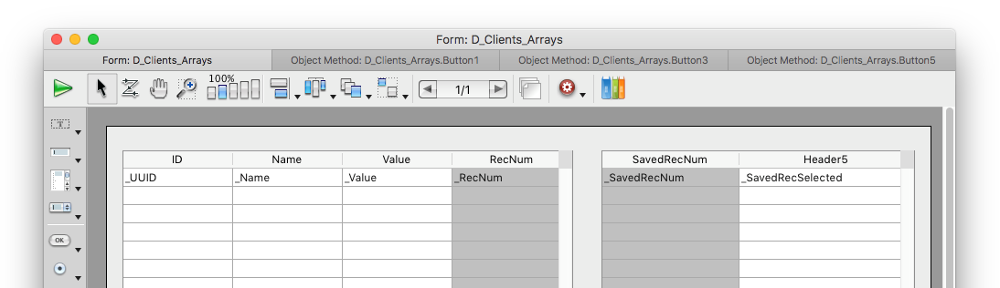
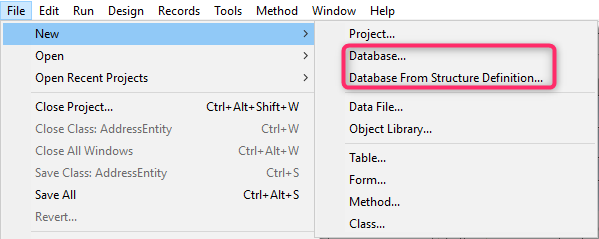

Cette page regroupe diverses options permettant de paramétrer le fonctionnement général de votre application 4D.

## Options

### Au démarrage

Cette option permet de configurer l’affichage proposé par défaut par 4D au démarrage, lorsque l’utilisateur lance uniquement l’application.

- **Ne rien faire** : seule la fenêtre de l’application apparaît, vide.
- **Dialogue d’ouverture de base de données locale** : 4D affiche une boîte de dialogue standard d’ouverture de documents, permettant de désigner un projet local.
- **Ouvrir le dernier projet utilisé** : 4D ouvre directement le dernier projet utilisé, aucune boîte de dialogue d’ouverture n’apparaît.
  > To force the display of the opening dialog box when this option is selected, hold down the **Alt** (Windows) or **Option** (macOS) key while launching the project.
- **Dialogue d’ouverture du projet distant** : 4D affiche la boîte de dialogue standard de connexion avec 4D Server, permettant de désigner une base de données publiée sur le réseau.
- **Dialogue Assistant de bienvenue** (réglage d'usine) : 4D affiche la boîte de dialogue de l'Assistant de bienvenue.

> > > **4D Server**: The 4D Server application ignores this option. Dans cet environnement, le mode **Ne rien faire** est toujours utilisé.

### Création de formulaire automatique

> Cette option n'est utilisée que dans les bases de données binaires ; elle est ignorée dans l'architecture projets. Voir doc.4d.com.

### Fenêtre à onglets (macOS seulement)

Depuis macOS Sierra, les applications Mac bénéficient d'onglets automatiques facilitant l'organisation de l'écran lors de l'ouverture de fenêtres multiples : les fenêtres documents sont regroupées dans une seule fenêtre parente et sont accessibles via des onglets. Cette fonctionnalité est particulièrement utile avec les écrans de taille réduite ou lorsqu'un trackpad est utilisé.

Vous pouvez bénéficier de cette fonctionnalité dans les environnements de 4D suivants (versions 64 bits uniquement) :

- Fenêtres de l'éditeur de code
- Fenêtres de l'éditeur de formulaires

Toutes les fenêtres de ces éditeurs peuvent être ouvertes sous forme d'onglets :



Un ensemble de commandes du menu **Fenêtre** permet de gérer les onglets :


Dans la boîte de dialogue des Préférences de 4D, l'option **Fenêtre à onglets** vous permet de contrôler ce fonctionnement :


Trois options sont disponibles :

- **Selon les préférences système** (défaut) : les fenêtres de 4D se comporteront comme elles ont été définies dans les Préférences Système de macOS (En plein écran uniquement, Toujours ou Manuellement).
- **Never**: Opening a new document in 4D form editor or Code Editor will always result in creating a new window (tabs are never created).
- **Toujours** : L'ouverture d'un nouveau document dans l'éditeur de formulaires ou l'éditeur de méthodes de 4D provoquera l'ajout d'un onglet.

### Apparence (macOS uniquement)

Ce menu vous permet de sélectionner la palette de couleurs à utiliser pour l'environnement de **développement 4D**. La palette spécifiée sera appliquée à tous les éditeurs et fenêtres du mode Développement.

> Vous pouvez également définir la palette de couleurs à utiliser dans vos **applications de bureau** dans la page "Interface" de la boîte de dialogue des Paramètres.

Trois options sont disponibles :

- **Selon les préférences de la palette de couleurs du système** (par défaut) : Utilisez la palette de couleurs définie dans les préférences système de macOS.
- **Clair** : Utiliser le thème clair
- **Sombre** : utiliser le thème sombre

> Cette préférence n'est prise en charge que sur macOS. Sous Windows, la palette "Light" est toujours utilisée.

### Quitter le mode Développement lors du passage en mode Application

Si cette option est cochée, lorsque l’utilisateur passe en mode Application via la commande de menu **Tester l'application**, toutes les fenêtres du mode Développement sont fermées. Si cette option n’est pas cochée (valeur par défaut), les fenêtres du mode Développement restent affichées à l’arrière-plan du mode Application.

### Activer la création de bases de données en binaire

Si vous sélectionnez cette option, deux éléments s'ajoutent au menu **Fichier > Nouveau** et au bouton **Nouveau** de la barre d'outils :

- **Database...**
- **Base de données à partir d'une définition de structure...**



Ces éléments vous permettent de créer des bases binaires (voir la section [Créer une nouvelle base](https://doc.4d.com/4Dv19R4/4D/19-R4/Creer-une-nouvelle-base.300-5736754.fe.html)). Ils ne sont plus proposés par défaut car 4D recommande, pour les nouveaux développements, l'utilisation d'une architecture de bases projets.

## Lors de la création d'un nouveau projet

### Utiliser le fichier d'historique

Lorsque cette option est cochée, un fichier d'historique est automatiquement démarré et utilisé dans chaque nouvelle base. Pour plus d’informations, reportez-vous à la section [Fichier d'historique (.journal)](Backup/log.md).

### Créer un paquet

Lorsque cette option est cochée, les bases de données 4D sont automatiquement créées dans un dossier suffixé .4dbase.

Grâce à ce principe, sous macOS les dossiers des bases apparaissent sous forme de paquets (packages) disposant de propriétés spécifiques. Sous Windows, ce fonctionnement n’a pas d’incidence particulière.

### Inclure les tokens dans les fichiers sources des projets

Lorsque cette option est cochée, les [fichiers sources des méthodes](../Project/architecture.md#sources) enregistrées dans les nouveaux projets 4D contiendront des **tokens** pour les objets du langage classic et de la base (constantes, commandes, tables et champs). Tokens are additional characters such as `:C10` or `:5` inserted in the source code files, that allow renaming tables and fields and identifying elements whatever the 4D version (see [Using tokens in formulas](https://doc.4d.com/4Dv19R3/4D/19-R3/Using-tokens-in-formulas.300-5583062.en.html)).

Si vous avez l'intention d'utiliser des VCS ou des éditeurs de code externes avec vos nouveaux projets, il est préférable de décocher cette option pour une meilleure lisibilité du code avec ces outils.

> Vous pouvez toujours obtenir le code avec les tokens en appelant la <a href="https://doc.4d.com/4dv19R/help/command/en/page1190.html"><code>METHOD GET CODE</code></a> avec 1 dans le paramètre <em x-id="3">option</em>.

> You can always get the code with tokens by calling [`METHOD GET CODE`](https://doc.4d.com/4dv19R/help/command/en/page1190.html) with 1 in the _option_ parameter.

#### Exclusion des tokens dans les projets existants

You can configure your existing projects to save code **without tokens** by inserting the following key in the [`<applicationName>.4DProject`](../Project/architecture.md#applicationname4dproject-file) file using a text editor:

```
"tokenizedText" : false
```

> Ce paramètre n'est pris en compte que lors de l'enregistrement des méthodes. Les méthodes existantes dans vos projets ne sont pas modifiées, sauf si vous les enregistrez à nouveau.

### Créer le fichier `.gitignore`

Si vous avez besoin ou souhaitez que git ignore certains fichiers dans vos nouveaux projets.

Vous pouvez définir cette préférence en cochant l'option **Créer le fichier .gitignore**.

Lorsqu'un projet est créé dans 4D et que cette case est cochée, 4D crée un fichier `.gitignore` au même niveau que le dossier `Project` (voir [Architecture d'un projet](Project/architecture.md#gitignore-file-optional)).

Vous pouvez définir le contenu par défaut du fichier `.gitignore` en cliquant sur l'icône du crayon. Cela ouvrira le fichier de configuration .gitignore dans votre éditeur de texte. Le contenu de ce fichier sera utilisé pour générer les fichiers `.gitignore` dans vos nouveaux projets.

La [documentation officielle de git](https://git-scm.com/docs/gitignore) est une excellente ressource pour comprendre le fonctionnement des fichiers `.gitignore`.

### Langue de comparaison de texte

Ce paramètre permet de définir la langue utilisée par défaut pour le traitement et la comparaison des chaînes de caractères dans les nouvelles bases. Le choix d’une langue de comparaison influe sur le tri et la recherche des textes ainsi que le passage en minuscules/majuscules mais n’a pas d’incidence sur la traduction des libellés ou sur les formats de dates, d’heure ou monétaires qui restent, eux, dans la langue du système. Par défaut (réglage d'usine), 4D utilise la langue courante de l'utilisateur définie dans le système.

Une base 4D peut donc fonctionner dans une langue différente de celle du système. A l’ouverture d’une base, le moteur de 4D détecte la langue utilisée par le fichier de données et la fournit au langage (interpréteur ou mode compilé). Les comparaisons de texte, qu’elles soient effectuées par le moteur de base de données ou par le langage, sont donc toujours effectuées dans la même langue.

Lors de la création d’un nouveau fichier de données, 4D utilise la langue définie dans ce menu. En cas d’ouverture d’un fichier de données qui n’est pas dans la même langue que la structure, la langue du fichier de données est utilisée et le code de langue est recopié dans la structure.

> Cette option n'est prise en compte que pour l'accès à la documentation des commandes (à l'exclusion des fonctions de classe).

## Emplacement de la documentation

Cette zone permet de configurer l'accès à la documentation HTML de 4D qui s'affiche dans votre navigateur courant :

- When you hit the **F1** key while the cursor is inserted in a 4D class function or command name in the Code Editor;
- Lorsque l'utilisateur double-clique sur une commande dans la **page des commandes** de l'Explorateur .

### Langue de documentation

Langue de la documentation HTML à afficher. Vous pouvez sélectionner une documentation dans une langue différente de celle de l'application.

### Commencer par consulter le dossier local

> Cette option n'est prise en compte que pour l'accès à la documentation des commandes (à l'exclusion des fonctions de classe).

Définit l'emplacement des pages de documentation recherchées par 4D.

- Lorsque cette option est cochée (par défaut), 4D recherche d'abord la page dans le dossier local (voir ci-dessous). Si la page est trouvée à l'emplacement défini, elle est affichée dans le navigateur courant. Si la page est trouvée à l'emplacement défini, elle est affichée dans le navigateur courant. Ce principe permet par exemple de travailler en mode déconnecté, en accédant à une version locale de la documentation.
- If it is not found, 4D displays an error message in the browser. Si elle n'est pas trouvée, 4D affiche un message d'erreur dans le navigateur.

### Dossier local

> Cette option n'est prise en compte que pour l'accès à la documentation des commandes (à l'exclusion des fonctions de classe).

Indique l'emplacement de la version statique de la documentation HTML. Par défaut, cet emplacement correspond au sous-dossier \Help\Command\langue. Vous pouvez le visualiser en affichant le menu associé à la zone (clic sur la zone). Si le sous-dossier n'est pas présent, l'emplacement est affiché en rouge.

Vous pouvez modifier cet emplacement si vous le souhaitez, par exemple pour afficher la documentation dans une langue différente de celle de l'application. La documentation HTML statique peut être située sur un autre volume, un serveur web, etc. Pour désigner un autre emplacement, cliquez sur le bouton **[...]** à côté de la zone de saisie et choisissez un dossier racine de documentation (dossier correspondant à la langue : `fr`, `en`, `es`, `de` ou `ja`).
