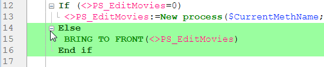

This page contains parameters defining the Code Editor interface and its default display as well as options concerning its operation. Elle est divisée en deux parties, accessibles via les onglets Thèmes et Options.

## Thèmes

This page allows selecting, creating, or configuring Code Editor themes. Un thème définit la police, la taille de la police, les couleurs et les styles des éléments de l'éditeur de code.

### Liste des thèmes

Sélectionnez, dans cette liste, le thème à appliquer à l'éditeur de code. Tous les thèmes disponibles sont affichés, y compris les thèmes personnalisés (le cas échéant). 4D propose deux thèmes par défaut :

- **Default Light Theme**
- **Default Dark Theme**

> Les thèmes par défaut ne peuvent être ni modifiés ni supprimés.

A **myTheme** theme is automatically added if you already customized Code Editor styles in previous 4D releases.

### Création de thèmes personnalisés

Vous pouvez créer des thèmes à personnaliser entièrement. Pour créer un thème, sélectionnez un thème existant et cliquez sur le **+** en bas de la liste des thèmes. Vous pouvez également ajouter des thèmes personnalisés en copiant les fichiers de thème dans le dossier `4D Editor Themes` (voir ci-dessous).

### Fichiers de thèmes personnalisés

Chaque thème personnalisé est stocké dans un seul fichier JSON nommé _themeName.json_. Les fichiers JSON des thèmes personnalisés sont stockés dans le dossier `4D Editor Themes` situé au même niveau que le [fichier de préférences](overview.md#storage) de

Si des valeurs clés ne sont pas définies dans un thème personnalisé, elles prennent par défaut les valeurs du thème _Default Light Theme_. Si un fichier de thème JSON est invalide, le thème _Default Light Theme_ est chargé et une erreur est générée.

> Lorsqu'un fichier de thème est modifié par un éditeur externe, 4D doit être redémarré pour prendre en compte la ou les modifications.

## Définition d'un thème

Définir un thème signifie :

- définir une police et une taille de police pour l'ensemble de l'éditeur de code,
- attribuer des styles et des couleurs spécifiques à chaque élément de langage 4D (champs, tables, variables, paramètres, SQL, etc.), à chaque élément de langage SQL (mots-clés, fonctions, etc.) et aux fonds de couleur.

La combinaison de couleurs et de styles différents est particulièrement utile à des fins de maintenance du code.

### Police et taille de police

The **font** and **font size** menus allows you to select the font name and size used in the Code Editor entry area for all categories.

### Langage 4D et langage SQL

Vous pouvez définir différents styles et couleurs de police (couleur de police ou couleur de fond) pour chaque type d'élément de langage. Vous pouvez sélectionner le ou les éléments à personnaliser dans la liste Catégorie.

### Autres styles

These options configure the various colors used in the Code Editor and debugger interfaces.

|                                                                | Description                                                                                                                                                                                                                   |
| -------------------------------------------------------------- | ----------------------------------------------------------------------------------------------------------------------------------------------------------------------------------------------------------------------------- |
| **Couleur de la police**                                       | Background color of Code Editor window.                                                                                                                                                                       |
| **Bordure de la ligne en cours d'exécution dans le débogueur** | Couleur de la bordure entourant la ligne en cours d'exécution dans le débogueur lorsque l'option "Surligner la ligne en cours d'exécution" est activée dans la page [Options](#options).                      |
| **Couleur de fond de la ligne du curseur**                     | Couleur de fond de la ligne contenant le curseur.                                                                                                                                                             |
| **Couleur de fond de la ligne en cours d'exécution**           | Couleur de fond de la ligne en cours d'exécution dans le débogueur.                                                                                                                                           |
| **Mise en évidence des mots trouvés**                          | Couleur de surlignage des mots trouvés à l'issue d'une recherche.                                                                                                                                             |
| **Mise en évidence des parenthèses**                           | Couleur de mise en évidence des parenthèses correspondantes (utilisée lorsque des paires de parenthèses sont signalées par la mise en évidence, voir [Options](#options)).                 |
| **Mise en évidence des blocs**                                 | Couleur de mise en évidence des blocs logiques sélectionnés lorsque l'option "Mise en évidence des blocs logiques" est activée dans les [Options](#options).                                                  |
| **Mise en évidence de la même variable ou du même champ**      | Couleur de mise en évidence pour les autres occurrences de la même variable ou du même texte de champ lorsque l'option "Mise en évidence des variables et du texte" est activée dans les [Options](#options). |
| **Mise en évidence de la ligne courante dans le débogueur**    | Couleur de mise en évidence de la ligne courante dans le débogueur lorsque l'option "Surlignage de la ligne en cours" est activée dans les [Options](#options).                                               |
| **Couleur de fond de la sélection**                            | Couleur de fond de la sélection.                                                                                                                                                                              |
| **Texte suggéré**                                              | Color of autocomplete text suggested by the Code Editor.                                                                                                                                                      |

## Options

This page configures Code Editor display options.

### Options

#### Langage de programmation 4D (Utiliser les paramètres régionaux du système)

Permet de désactiver/activer les paramètres du code "international" pour l'application 4D locale.

- **non coché (par défaut)** : Les paramètres Anglais-US et la langue de programmation anglaise sont utilisés dans les méthodes 4D.
- **coché** : Les paramètres régionaux sont utilisés dans les méthodes 4D.

> Si vous modifiez cette option, vous devez redémarrer l'application 4D pour que le changement soit pris en compte.

#### Indentation

Changes the indentation value for the 4D code in the Code Editor. La largeur doit être définie en points (10 par défaut).

Le code 4D est automatiquement indenté afin de faire apparaître sa structure :

Modifier cette valeur par défaut peut être utile si vos méthodes contiennent des algorithmes complexes avec de nombreux niveaux d'intégration. Une indentation plus étroite peut être utilisée afin de limiter le défilement horizontal.

#### Afficher les numéros de ligne

Lets you display the line numbers by default in each window of the Code Editor. You can also show/hide line numbers for the current window directly from the Code Editor.

#### Afficher les listes

Lets you choose whether or not to show the lists of objects (Commands, Tables and fields, etc.) by default when the Code Editor window is opened. You can also show or hide each list directly from the Code Editor.

#### Afficher les presse-papiers

Vous permet de choisir d'afficher ou non les multiples presse-papiers dans l'éditeur de code.

Les [raccourcis du presse-papiers](https://doc.4d.com/4Dv19R3/4D/19-R3/Writing-a-method.300-5612559.en.html#3977166) correspondants demeurent actifs lorsque ces presse-papiers sont masqués.

#### Surbrillance des blocs logiques

Lorsque vous cochez l'option, tout le code correspondant à un bloc logique (Si/Fin de si par exemple) est surligné lorsque la souris est placée au-dessus de l'icône plier/déplier :

La couleur de surlignage peut être modifiée dans la page [Définition d'un thème](#définition-dun-thème).

#### Toujours afficher les lignes de blocs

Permet de cacher de façon permanente les lignes verticales de blocs. Les lignes de blocs sont conçues pour visualiser les blocs logiques. Par défaut, elles sont toujours affichées, excepté lorsque les icônes plier/déplier sont masquées (voir ci-dessous).

#### Masquer les icônes plier/déplier

Permet de masquer, par défaut, toutes les icônes plier/déplier lorsque vous affichez le code. Lorsque cette option est cochée, les icônes plier/déplier (ainsi que les lignes de blocs locales, voir ci-dessus) sont affichées temporairement lorsque la souris survole une icône :

#### Insérer () et ajouter } ) ] " fermants

Active l'insertion automatique de () et de caractères fermants lors de la saisie du code. Cette option contrôle deux fonctionnalités automatiques :

- **paire de parenthèses ()** : Ajoutée après une commande 4D, un mot-clé ou une méthode projet insérée à partir d'une liste de suggestions ou de complétion, si l'élément inséré nécessite un ou plusieurs arguments obligatoires. Par exemple, si vous tapez "C_OB" et vous appuyez sur la touche Tab, 4D écrit "C_OBJECT()" et place le point d'insertion à l'intérieur du ().

- **fermeture }, ), ] ou "** : caractère ajouté lorsque vous tapez respectivement une ouverture {, (, ] ou ". Cette fonction permet d'insérer des paires de symboles correspondants au point d'insertion ou autour d'un texte sélectionné. Par exemple, si vous mettez en surbrillance une chaîne de caractères et que vous tapez un simple caractère ", toute la chaîne sélectionnée sera entourée de "" :

\

#### Correspondance \[]\(){}

Permet de modifier la signalisation graphique des caractères d'encadrement correspondants dans le code. Cette signalisation apparaît lorsqu’un crochet, une parenthèse ou une accolade est sélectionné(e).
Les options suivantes sont disponibles :

- **Aucun** : Aucun signal
- **Rectangle** (default): Braces surrounded by a black line\
  
- **Couleur de fond** : Caractères mis en surbrillance (la couleur est définie dans la page [Thème](thèmes)).
- **Gras** : caractères affichés en gras.

#### Surbrillance des variables et champs

Permet de mettre en surbrillance toutes les occurrences d'un(e) même variable ou champ dans une fenêtre de méthode ouverte.

- **Non** (par défaut) : Pas de surbrillance
- **Sur curseur** : Toutes les occurrences sont mises en évidence lorsque le texte est cliqué
- **Sur sélection** : Toutes les occurrences sont mises en évidence lorsque le texte est sélectionné

La couleur de surlignage peut être modifiée dans la page [Définition d'un thème](#définition-dun-thème).

#### Mode trace (Surbrillance de la ligne en exécution)

Permet de mettre en surbrillance la ligne en exécution dans le Débogueur, en plus de la flèche jaune.

Si vous désélectionnez cette option, seule la flèche jaune est affichée.

### Suggestions

This area lets you configure autocomplete mechanisms in the Code Editor to adapt it to your own work habits.

|                                     | Description                                                                                                                                                                                                                                                                                                                                                                                                                                                                                                                                                                                                                                                                                                                                                                                                                                                                                                                                                                                                                                                                                                                       |
| ----------------------------------- | --------------------------------------------------------------------------------------------------------------------------------------------------------------------------------------------------------------------------------------------------------------------------------------------------------------------------------------------------------------------------------------------------------------------------------------------------------------------------------------------------------------------------------------------------------------------------------------------------------------------------------------------------------------------------------------------------------------------------------------------------------------------------------------------------------------------------------------------------------------------------------------------------------------------------------------------------------------------------------------------------------------------------------------------------------------------------------------------------------------------------------- |
| Affichage automatique de la fenêtre | Triggers the automatic display of the suggestion window for:<ul><li>Constants</li><li>Variables (local and interprocess) and object attributes</li><li>Tables</li><li>Prototypes (_i.e._, class functions)</li></ul>
For example, when the "Variables (local or interprocess) and object attributes" option is checked, a list of suggestions appears when you type the $ character:

 You can disable this functioning for certain elements of the language by deselecting their corresponding option.                                                                                                                                                                                                                                                                                                                                                                                                                  |
| Validation d'une suggestion         | Sets the entry context that allows the Code Editor to validate automatically the current suggestion displayed in the autocomplete window.<ul><li>**Tab and delimiters** When this option is selected, you can validate the current selection with the Tab key or any delimiter that is relevant to the context. Par exemple, si vous entrez "ALE" et ensuite "(", 4D écrit automatiquement "ALERT(" dans l'éditeur. Here is the list of delimiters that are taken into account:  ( ; : = < [ {</li><li>**Tab only** When this option is selected, you can only use the Tab key to insert the current suggestion. This can be used more particularly to facilitate the entry of delimiter characters in element names, such as ${1}.**Note**: You can also double-click in the window or press the Carriage return key to validate a suggestion.</li></ul> |
