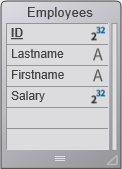

4D vous fournit un serveur REST puissant, qui permet d'accéder directement aux données stockées dans vos applications 4D.

Le serveur REST est inclus dans 4D et 4D Server et automatiquement disponible dans vos applications 4D [une fois configuré](configuration.md).

Cette section est destinée à vous familiariser avec la fonctionnalité REST à l'aide d'un exemple simple. Nous allons :

- créer et configurer un projet d'application 4D basique
- accéder aux données du projet 4D via REST à l'aide d'un navigateur standard.

Pour simplifier l'exemple, nous allons utiliser 4D et un navigateur qui s'exécutent sur la même machine. Bien entendu, vous pouvez également utiliser une architecture distante.

## Créer et configurer le projet 4D

1. Lancez votre application 4D ou 4D Server et créez un nouveau projet. Vous pouvez, par exemple, le nommer "Emp4D".

2. Dans l'éditeur de structure, créez une table [Employees] et ajoutez-y les champs suivants :
   - Lastname (Alpha)
   - Firstname (Alpha)
   - Salary (Longint)



> L'option "Exposer une ressource REST" est cochée par défaut pour la table et pour chaque champ ; ne modifiez pas ce paramètre.

3. Créez des formulaires, puis créez quelques employés :


4. Affichez la page **Web > Web Features** de la boîte de dialogue des Propriétés et [cochez l'option Exposer en tant que serveur REST](configuration.md#starting-the-rest-server).

5. Dans le menu **Exécuter**, sélectionnez **Démarrer le serveur Web** (si nécessaire), puis sélectionnez **Tester le serveur Web**.

4D affiche la page d'accueil par défaut du serveur Web 4D.

## Accéder aux données 4D avec le navigateur

Vous pouvez désormais lire et modifier des données dans 4D uniquement via les requêtes REST.

Toute requête d'URL 4D REST commence par `/ rest`, pour être insérée après la zone `adress:port`. Par exemple, pour voir le contenu du datastore 4D, vous pouvez écrire :

```
http://127.0.0.1/rest/$catalog
```

Le serveur REST répond :

```
{
	"__UNIQID": "96A49F7EF2ABDE44BF32059D9ABC65C1",
	"dataClasses": [
		{
			"name": "Employees",
			"uri": "/rest/$catalog/Employees",
			"dataURI": "/rest/Employees"
		}
	]
}
```

Cela signifie que le datastore contient le dataclass Employees. Vous pouvez voir les attributs de la dataclass en tapant :

```
/rest/$catalog/Employees
```

Si vous souhaitez obtenir toutes les entités de la dataclass Employee, vous pouvez écrire :

```
/rest/Employees
```

**Réponse :**

```
{
	"__entityModel": "Employees",
	"__GlobalStamp": 0,
	"__COUNT": 3,
	"__FIRST": 0,
	"__ENTITIES": [
		{
			"__KEY": "1",
			"__TIMESTAMP": "2020-01-07T17:07:52.467Z",
			"__STAMP": 2,
			"ID": 1,
			"Lastname": "Brown",
			"Firstname": "Michael",
			"Salary": 25000
		},
		{
			"__KEY": "2",
			"__TIMESTAMP": "2020-01-07T17:08:14.387Z",
			"__STAMP": 2,
			"ID": 2,
			"Lastname": "Jones",
			"Firstname": "Maryanne",
			"Salary": 35000
		},
		{
			"__KEY": "3",
			"__TIMESTAMP": "2020-01-07T17:08:34.844Z",
			"__STAMP": 2,
			"ID": 3,
			"Lastname": "Smithers",
			"Firstname": "Jack",
			"Salary": 41000
		}
	],
	"__SENT": 3
}
```

Il existe plusieurs possibilités pour filtrer les données à recevoir. Par exemple, pour obtenir uniquement la valeur de l'attribut "Lastname" de la 2ème entité, vous pouvez simplement écrire :

```
/rest/Employees(2)/Lastname
```

**Réponse :**

```
{
	"__entityModel": "Employees",
	"__KEY": "2",
	"__TIMESTAMP": "2020-01-07T17:08:14.387Z",
	"__STAMP": 2,
	"Lastname": "Jones"
}
```

L'[API REST](REST_requests.md) de 4D fournit plusieurs commandes pour interagir avec les applications 4D.
