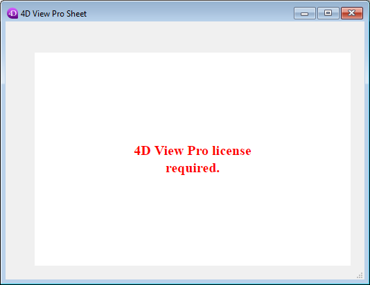
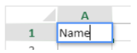

4D View Pro est un [composant 4D](Concepts/components.md) qui inclut une [zone de formulaire 4D](FormObjects/viewProArea_overview.md) et des [commandes](commands.md) spécifiques. Il vous permet d'intégrer des fonctionnalités avancées de tableur dans vos projets.


Une tableur est une application contenant une grille de cellules dans lesquelles vous pouvez saisir des informations, effectuer des calculs ou afficher des images. 4D View Pro est alimenté par la [solution de feuille de calcul SpreadJS](https://developer.mescius.com/spreadjs) intégrée en 4D.

L'intégration de zones 4D View Pro dans vos formulaires vous permet d'importer et d'exporter des documents de type tableur à l'aide des commandes 4D View Pro.

## Installation et activation

Les fonctionnalités de 4D View Pro sont directement inclues dans 4D, ce qui en facilite le déploiement et la gestion. Aucune installation supplémentaire n'est nécessaire.

Cependant, 4D View Pro nécessite une licence. Vous devez activer cette licence dans votre application afin d'utiliser ses fonctionnalités. Lorsque vous utilisez ce composant sans licence, le contenu d'un objet nécessitant une fonctionnalité 4D View Pro ne s'affiche pas au moment de l'exécution; au lieu de cela, un message d'erreur :



## Insertion d'une zone 4D View Pro

Les documents 4D View Pro sont affichés et modifiés manuellement dans un [objet du formulaire 4D](FormObjects/viewProArea_overview.md) nommé 4D View Pro. Pour sélectionner cet objet, cliquez sur le dernier outil de la barre d'objets :


Vous pouvez également sélectionner une zone 4D View Pro préconfigurée dans la [bibliothèque d'objets](FormEditor/objectLibrary.md).

> Les zones 4D View Pro peuvent également être [créées et utilisées hors écran](commands/vp-run-offscreen-area.md).

Vous pouvez [configurer la zone](configuring.md) à l'aide de la liste de propriétés et des commandes 4D View Pro.

## Fondamentaux de la sélection, de la saisie et de la navigation

Les feuilles de calcul sont composées de lignes et de colonnes. Un numéro est associé à chaque ligne. Une lettre (ou un groupe de lettres lorsque le nombre de colonnes est supérieur au nombre de lettres de l'alphabet) est associée à chaque colonne. L'intersection d'une ligne et d'une colonne constitue une cellule. Les cellules peuvent être sélectionnées et leur contenu modifié.

### Sélection des cellules, des colonnes et des lignes

- Pour sélectionner une cellule, il suffit de cliquer dessus ou d'utiliser les flèches de direction du clavier. Son contenu (ou sa formule) s'affiche dans la cellule.

- Pour sélectionner plusieurs cellules continues, faites glisser la souris d'une extrémité à l'autre de la sélection. Vous pouvez également cliquer sur les deux extrémités de la sélection tout en maintenant la touche Maj enfoncée.

- Pour sélectionner toutes les cellules dans la feuille de calcul, cliquez sur la cellule en haut à gauche de la zone :
  

- Pour sélectionner une colonne, cliquez sur la lettre (ou le groupe de lettres) correspondant(e).

- Pour sélectionner une ligne, cliquez sur le chiffre correspondant.

- Pour sélectionner un groupe de cellules non continues, maintenez la touche **Ctrl** (Windows) ou **Command** (macOS) enfoncée et cliquez sur chaque cellule à sélectionner.

- Pour désélectionner des cellules, il suffit de cliquer n'importe où dans la feuille de calcul.

### Saisie de données

Un double-clic sur une cellule permet de passer en mode saisie dans la cellule concernée. Si la cellule n'est pas vide, le curseur d'insertion se place après le contenu de la cellule.



Les données peuvent être saisies directement lorsqu'une cellule est déjà sélectionnée, même si le curseur d'insertion n'est pas visible. The input then replaces the content of the cell.

La touche **Tab** valide la saisie de la cellule et sélectionne la cellule à sa droite. La combinaison des touches **Shift + Tab** valide la saisie de la cellule et sélectionne la cellule située à sa gauche.

La touche **Retour chariot** valide la saisie de la cellule et sélectionne la cellule située en dessous. La combinaison des touches **Shift + Retour chariot** valide la saisie de la cellule et sélectionne la cellule située au-dessus.

Les touches de direction (flèches) permettent de déplacer une cellule dans la direction indiquée par la flèche.

### Utilisation du menu contextuel

Les zones 4D View Pro bénéficient d'un menu contextuel automatique qui offre des fonctions d'édition standard telles que le copier-coller, mais aussi des fonctions de base de tableur :


> Les fonctions Copier/Couper et Coller du menu contextuel fonctionnent uniquement dans la zone de la feuille de calcul, elles n'ont pas accès au presse-papiers du système. Les raccourcis système tels que **Ctrl+c/Ctrl+v** fonctionnent néanmoins et peuvent être utilisés pour échanger des données entre la zone et d'autres applications.

En fonction de la zone cliquée, les options suivantes sont également disponibles :

- cliquez sur un en-tête de colonne ou de ligne : **Insérer**, **Supprimer**, **Masquer** ou **Décompresser** le contenu
- cliquez sur une cellule ou une plage de cellules :
  - **Filtrer** : permet de masquer la ligne via des filtres (voir "Filtrer les lignes" dans la [documentation SpreadJS](https://developer.mescius.com/spreadjs/docs/)).
  - **Trier** : permet de trier le contenu des colonnes.
  - **Insérer un commentaire** : permet à l'utilisateur de saisir un commentaire pour une zone. Lorsqu'un commentaire a été saisi pour une zone, la cellule supérieure gauche de la zone affiche un petit triangle rouge :\
    

## Utilisation des commandes 4D View Pro

Les commandes 4D View Pro peuvent être utilisées dans l'éditeur de code 4D, tout comme les commandes du langage 4D.

Étant donné que 4D View Pro est un composant 4D intégré, vous pouvez accéder à sa liste de commandes depuis l'Explorateur, dans la section **Méthodes composants** :


Pour une liste détaillée, consultez [Commands](commands.md).

### Traiter une zone 4D View Pro

Une zone 4D View Pro gère plusieurs objets et éléments.


La plupart des commandes 4D View Pro nécessitent un paramètre _vpAreaName_, qui correspond au [**nom de la zone de formulaire 4D View Pro**](FormObjects/viewProArea_overview.md) (objet de formulaire 4D). Ce nom est la propriété du [nom de l'objet](FormObjects/properties_Object.md#object-name).

Par exemple, si vous souhaitez définir le nombre total de colonnes d'une zone nommée "myVpArea", saisissez le code suivant :

```4d
VP SET COLUMN COUNT("myVpArea";5)
```

> Lorsque vous chargez un objet 4D View Pro dans une zone de formulaire, 4D génère l'événement formulaire [On VP Ready](../Events/onVpReady.md) une fois que toute la zone est chargée. Vous devez exécuter tout code 4D View Pro manipulant la zone dans cet événement, sinon une erreur est retournée.

### Utilisation d'objets de plage

Certaines commandes 4D View Pro nécessitent un paramètre _rangeObj_. Dans 4D View Pro, une plage est un objet qui fait référence à une zone dans une feuille de calcul. Cette zone peut être composée d'une ou plusieurs cellules. À l'aide des commandes 4D View Pro, vous pouvez créer des plages et les passer à d'autres commandes pour lire ou écrire dans des emplacements spécifiques de votre document.

Par exemple, pour créer un objet plage pour les cellules suivantes :


Vous pouvez utiliser la méthode [VP Cells](commands/vp-cells.md) :

```4d
var $myRange : Object
$myRange:=VP Cells("ViewProArea";2;4;2;3) // C5 to D7
```

Ensuite, vous pouvez passer `$myRange` à une autre méthode 4D View Pro pour modifier ces cellules (par exemple ajouter une bordure à l'ensemble des cellules avec [VP SET BORDER](commands/vp-set-border.md)).

Les objets plage 4D View Pro sont composés de plusieurs propriétés :

- area - Le nom de la zone 4D View Pro
- ranges - Une collection d'objet(s) plage. Les propriétés disponibles dans chaque objet de gamme dépendent du type d'objet plage. Par exemple, un objet plage de type colonne comprendra uniquement les propriétés _.column_ et _.sheet_.

| Propriété |                                                                                       | Type       | Description                                                                                                                      | Disponible pour                                                |
| --------- | ------------------------------------------------------------------------------------- | ---------- | -------------------------------------------------------------------------------------------------------------------------------- | -------------------------------------------------------------- |
| area      |                                                                                       | text       | Nom d'objet formulaire zone 4D View Pro                                                                                          | toujours disponible                                            |
| ranges    |                                                                                       | collection | Collection de plage(s)                                                                                        | toujours disponible                                            |
|           | \[ ].name        | text       | Nom de plage                                                                                                                     | name                                                           |
|           | \[ ].sheet       | number     | Indice de la feuille (par défaut, indice de la feuille courante) (le comptage démarre à 0) | cellule, cellules, ligne, lignes, colonne, colonnes, tout, nom |
|           | \[ ].row         | number     | Indice de la ligne (le comptage démarre à 0)                                                                  | cellule, cellules, ligne, lignes                               |
|           | \[ ].rowCount    | number     | Row count                                                                                                                        | cellule, lignes                                                |
|           | \[ ].column      | number     | Indice de la colonne (le comptage démarre à 0)                                                                | cellule, cellules, colonne, colonnes                           |
|           | \[ ].columnCount | number     | Column count                                                                                                                     | cellules, colonnes                                             |

## Import et export de documents

4D View Pro prend en charge l'import et l'export de plusieurs formats de documents :

- .4vp
- .xlsx
- .txt et .csv
- .sjs
- .pdf (à des fins d'export uniquement)

Pour plus de détails, consultez la description de [VP IMPORT DOCUMENT](commands/vp-import-document.md) et [VP EXPORT DOCUMENT](commands/vp-export-document.md).
