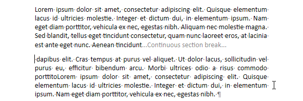
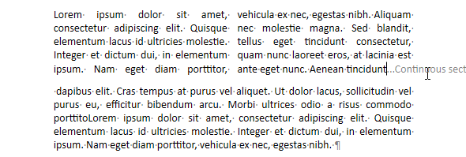

<!--REF #_command_.WP INSERT BREAK.Syntax-->**WP INSERT BREAK** ( *objCible* ; *typeRupture* ; *mode* {; *miseAJourPlage*} )<!-- END REF-->
<!--REF #_command_.WP INSERT BREAK.Params-->
| Paramètre | Type |  | Description |
| --- | --- | --- | --- |
| objCible | Object | &#8594;  | Plage ou élément ou document 4D Write Pro |
| typeRupture | Integer | &#8594;  | Type de rupture à insérer |
| mode | Integer | &#8594;  | Mode d'insertion |
| miseAJourPlage | Integer | &#8594;  | Mode de mise à jour de la plage de sélection |

<!-- END REF-->

## Description 

<!--REF #_command_.WP INSERT BREAK.Summary-->La commande **WP INSERT BREAK** insère une nouvelle rupture de type *typeRupture* dans la plage de sélection *objCible* selon le mode d'insertion *mode* et le paramètre *miseAJourPlage*.<!-- END REF-->

Dans *objCible*, passez :

* une plage, ou
* un élément (tableau / ligne / paragraphe / corps / paragraphe / en-tête / pied / image en ligne / section / sous-section), ou
* un document 4D Write Pro

Dans *typeRupture*, passez une des constantes suivantes, du thème *Constantes 4D Write Pro*, pour définir le type de rupture à insérer :

| Constante                   | Type        | Valeur | Comment                                                                                                                    |
| --------------------------- | ----------- | ------ | -------------------------------------------------------------------------------------------------------------------------- |
| wk column break             | Entier long | 3      | Saut de colonne : insère un saut de colonne                                                                                |
| wk continuous section break | Entier long | 5      | Définit un saut de section continu (souvent utilisé pour modifier le nombre de colonnes sans commencer une nouvelle page). |
| wk line break               | Entier long | 0      | Saut de ligne (dans le même paragraphe)                                                                                    |
| wk page break               | Entier long | 2      | Saut de page : définit une nouvelle page                                                                                   |
| wk paragraph break          | Entier long | 4      | Saut de paragraphe : définit un nouveau paragraphe                                                                         |
| wk section break            | Entier long | 1      | Saut de section: définit une nouvelle section                                                                              |

Dans le paramètre *mode*, passez une constante pour indiquer le mode d'insertion à utiliser pour la rupture dans la plage de sélection *objCible* :

| Constante  | Type        | Valeur | Comment                                    |
| ---------- | ----------- | ------ | ------------------------------------------ |
| wk append  | Entier long | 2      | Insère le contenu à la fin de la cible     |
| wk prepend | Entier long | 1      | Le contenu est inséré au début de la cible |
| wk replace | Entier long | 0      | Remplace le contenu de la cible            |

* Si *objCible* est une plage, vous pouvez utiliser le paramètre optionnel *miseAJourPlage* pour passer une des constantes suivante et spécifier si le contenu est inclus dans la sélection résultante ou pas :  
    
| Constante             | Type        | Valeur | Comment                                                         |  
| --------------------- | ----------- | ------ | --------------------------------------------------------------- |  
| wk exclude from range | Entier long | 1      | Le contenu inséré n'est pas inclus dans la plage mise à jour    |  
| wk include in range   | Entier long | 0      | Le contenu inséré est inclus dans la plage mise à jour (défaut) |  
    
    
Si vous ne passez pas un paramètre *miseAJourPlage*, par défaut, le contenu inséré sera inclus dans la plage mise à jour.
* Si *objCible* n'est pas une plage, *miseAJourPlage* est ignoré.

## Exemple 1 

En construisant vos factures, vous souhaitez insérer un saut de page à chaque facture, excepté sur la dernière page :

```4d
 $nbInvoices:=Records in selection([INVOICE])
 For($j;1;$nbInvoices)
    ... //traitement des factures
    If($j#$nbInvoices) //on insère un saut de page, excepté sur la dernière
       WP INSERT BREAK($buildRange;wk page break;wk append;wk exclude from range)
    End if
 End for
```

## Exemple 2 

Vous souhaitez insérer un saut de section continu pour avoir une section à une seule colonne et une section à deux colonnes sur la même page.

1. Insérez un saut de section continu au niveau de la sélection pour créer une nouvelle section :  
    
```4d  
 $range:=WP Selection range(*;"WParea")  
 WP INSERT BREAK($range;wk continuous section break;wk append)  
```  
    
    

2. Set the column count to 2 for the first section:  
    
```4d  
 $section:=WP Get section(WParea;1)  
 WP SET ATTRIBUTES($section;wk column count;2)  
```  
    
    


## Voir aussi 

[WP Get breaks](wp-get-breaks.md)  
[WP INSERT DOCUMENT](wp-insert-document.md)  