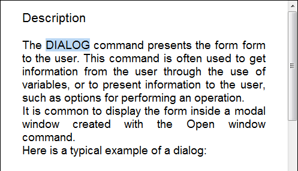

<!--REF #_command_.WP SET ATTRIBUTES.Syntax-->**WP SET ATTRIBUTES** ( *objCible* ; *nomAttribut* ; *valeurAttribut* {; *nomAttribut2* ; *valeurAttribut2* ; ... ; *nomAttributN* ; *valeurAttributN*} )<!-- END REF-->
<!--REF #_command_.WP SET ATTRIBUTES.Params-->
| Paramètre | Type |  | Description |
| --- | --- | --- | --- |
| objCible | Object | &#8594;  | Plage ou élément ou document 4D Write Pro |
| nomAttribut | Text | &#8594;  | Nom d'attribut dont vous souhaitez fixer la valeur |
| valeurAttribut | Text, Number, Object, Collection, Picture, Date | &#8594;  | Nouvelle valeur de l'attribut |

<!-- END REF-->

#### Description 

<!--REF #_command_.WP SET ATTRIBUTES.Summary-->La commande **WP SET ATTRIBUTES** vous permet de fixer la valeur d'un ou plusieurs attribut(s) dans une plage, un élément ou un document 4D Write Pro.<!-- END REF--> Cette commande donne accès à tous les types d'attributs internes de 4D Write Pro : caractère, paragraphe, tableau, document ou image. 

Dans *objCible*, vous pouvez passer :

* un objet plage 4D Write Pro, ou
* un élément (en-tête / pied / corps / tableau / ligne / image en ligne ou ancrée / paragraphe / section / sous-section / feuille de style), ou
* un document 4D Write Pro.

Dans *nomAttribut*, passez le nom de l'attribut à modifier pour la cible et dans *valeurAttribut*, passez la valeur à définir. Pour une liste complète des attributs que vous pouvez passer dans *nomAttribut* ainsi que les valeurs que vous pouvez passer dans *valeurAttribut*, veuillez vous référer à la section *Attributs 4D Write Pro*.

Vous pouvez passer autant de paires *nomAttribut* / *valeurAttribut* que vous voulez.

**Note :** Si vous devez définir plusieurs attributs pour la même cible, il est plus optimisé d'effectuer un appel unique à **WP SET ATTRIBUTES** avec toutes les paires attributs/valeurs, que d'appeler plusieurs fois **WP SET ATTRIBUTES**.

#### Exemple 1 

Dans cette zone 4D Write Pro, vous sélectionnez un mot :



Si vous exécutez le code suivant :

```4d
 $range:=WP Get selection(*;"WParea") //récupérer la plage sélectionnée
 
  // fixer le décalage d'ombre en pt pour la sélection
 WP SET ATTRIBUTES($range;wk text shadow offset;1)
  //définir la marge intérieure du paragraphe
 WP SET ATTRIBUTES($range;wk padding;1)
  //définir une bordure de 10 pt
 WP SET ATTRIBUTES($range;wk border style;wk solid;wk border width;10)
  //définir les couleurs de bordure
 WP SET ATTRIBUTES($range;wk border color;"blue";wk border color bottom;"#00FA9A";wk border color right;"#00FA9A")
```

Vous obtenez le résultat suivant :


#### Exemple 2 

Cet exemple illustre le rôle des constantes wk inside et wk outside :

```4d
 $wpRange:=WP Get selection(writeProdoc)
 WP SET ATTRIBUTES($wpRange;wk border style+wk inside;wk dotted)
 WP SET ATTRIBUTES($wpRange;wk border style+wk outside;wk solid)
 WP SET ATTRIBUTES($wpRange;wk border color+wk outside;"#00FA9A")
```

En supposant que tout le contenu était sélectionné, le résultat est :


#### Exemple 3 

Vous souhaitez définir une image de fond pour le document :

```4d
 var WParea : Object
 WParea:=WP New
 
 READ PICTURE FILE("C:\\Pictures\\boats.jpg";$picture)
 
 WP SET ATTRIBUTES(WParea;wk background image;$picture)
```

Le résultat est le suivant :


Vous souhaitez définir une image de fond qui recouvre la totalité de la zone d'impression :

```4d
 var WParea : Object
 WParea:=WP New
 
 READ PICTURE FILE("C:\\Pictures\\boats.jpg";$picture)
 
 WP SET ATTRIBUTES(WParea;wk background image;$picture)
 WP SET ATTRIBUTES(WParea;wk background clip;wk paper box)
 WP SET ATTRIBUTES(WParea;wk background origin;wk paper box)
```

Le résultat est le suivant :


**Note** : La valeur wk paper box peut être appliquée uniquement aux documents ou aux sections.

#### Exemple 4 

Vous souhaitez définir des tabulations à intervalles variés et définir un caractère comme étant le caractère principal pour la différente tabulation :

```4d
 $tab1:=New object()
 $tab1[wk type]:=wk left
 $tab1[wk offset]:="3cm"
 $tab1[wk leading]:=""
 
 $tab2:=New object()
 $tab2[wk type]:=wk center
 $tab2[wk offset]:="8cm"
 $tab2[wk leading]:=""
 
 $tab3:=New object()
 $tab3[wk type]:=wk right
 $tab3[wk offset]:="12cm"
 $tab3[wk leading]:="."
 
 $_tabs:=New collection($tab1;$tab2;$tab3)
 WP SET ATTRIBUTES(wpArea;wk tabs;$_tabs)
```

Le résultat est du type :


#### Voir aussi 

*Attributs 4D Write Pro*  
[WP GET ATTRIBUTES](wp-get-attributes.md)  
[WP RESET ATTRIBUTES](../commands/wp-reset-attributes.md)  