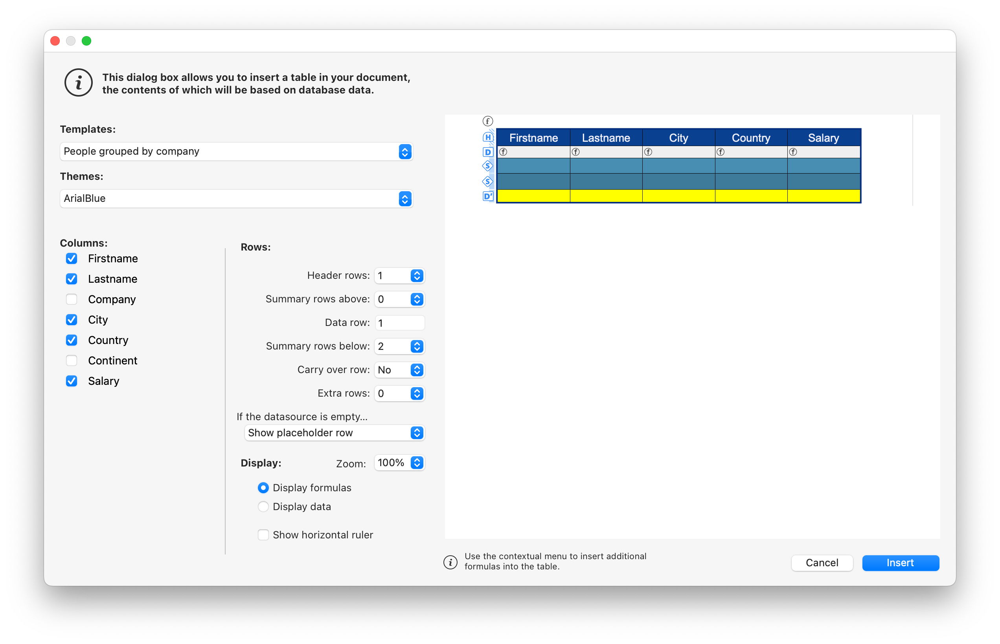
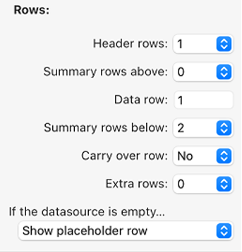

L'interface de 4D WritePro offre un ensemble de palettes, qui permettent aux utilisateurs de personnaliser facilement un document 4D Write Pro.

Un développeur 4D peut facilement implémenter ces palettes dans leur application. Ainsi, les utilisateurs finaux peuvent gérer toutes les propriétés de 4D Write Pro, telles que les polices, l'alignement du texte, les signets, la mise en page des tableaux et les cadres.

La documentation principale de l'[interface 4D Write Pro](https://doc.4d.com/4Dv20/4D/20/Entry-areas.300-6263967.en.html) se trouve dans le _4D - Mode Développement_.

Vous trouverez ci-dessous la documentation de configuration de l'Assistant de table.

## Assistant de table

L'Assistant de table est là pour simplifier encore davantage la création de table basée sur les données de la base de données en utilisant des contextes, des sources de données et des formules.

L'Assistant de table, accessible aux utilisateurs finaux, charge les modèles fournis et configurés par les développeurs de 4D. Cela permet aux développeurs de personnaliser le modèle en fonction des cas d'utilisation spécifiques et des exigences métier des utilisateurs.

L'Assistant de table est fourni avec des modèles et des thèmes par défaut, que les développeurs peuvent configurer pour adapter son contenu en fonction des exigences spécifiques de l'application.

Pour implémenter l'Assistant de table dans votre application, les développeurs peuvent créer et configurer des fichiers de modèle.

### Interface de l'Assistant de table WP

L'utilisateur ouvre la boîte de dialogue de l'Assistant de table à partir de l'élément de menu "Insérer une table" dans la barre d'outils et la barre latérale de l'interface de 4D Write Pro.



À partir de cette interface, l'utilisateur peut sélectionner un modèle ou un tableau dans la première liste déroulante et un thème dans la deuxième.

##### Dans Colonnes :


Selon la sélection de l'utilisateur d'un modèle ou d'un tableau, l'utilisateur peut voir la liste des champs stockés dans le modèle (Blob et les types d'objets sont automatiquement exclus). Ensuite, ils peuvent sélectionner les colonnes à afficher dans le tableau en cochant la case devant le nom du champ et les ordonner en déplaçant et en faisant glisser la liste des champs.

##### Dans Lignes :



Dans l'Assistant de table, l'utilisateur peut également définir le nombre de lignes d'en-tête et de lignes supplémentaires (de 0 à 5 chacune), définir les [lignes de rupture](https://doc.4d.com/4Dv20/4D/20/Handling-tables.200-6229469.fr.html#6233076) (lignes de synthèse) au-dessus ou en dessous de la ligne de données, et choisir d'afficher/masquer les [lignes de report](https://doc.4d.com/4Dv20/4D/20/Handling-tables.200-6229469.fr.html#6236686).

In addition, the user has the possibility to choose the table's behavior when its datasource is empty with the following options: Show data row, Hide date row, Hide table, Show placeholder row.

##### Dans Affichage :


L'utilisateur ajuste le niveau de zoom selon ses préférences en sélectionnant l'option souhaitée dans une liste déroulante, utilise des boutons radio pour afficher les formules ou les données pour une présentation claire, et choisit d'afficher une règle horizontale à l'aide d'une case à cocher.

Après avoir finalisé la création et la personnalisation de la table, l'utilisateur peut cliquer sur le bouton **Insérer** pour ajouter la table à son document WP.

Une fois que la table a été intégrée dans le document, l'utilisateur peut personnaliser son style. Les outils de mise en forme de la barre d'outils et de la barre latérale sont toujours disponibles.

### Configuration du modèle de l'Assistant de table WP

La configuration des modèles inclut:

- Définir des tables et des champs ainsi que préparer des formules adaptées à l'application à partir du [fichier de modèle](#template-files).
- Traduction des noms de table, de champ et de formule à partir du [fichier de traduction](#translation-files).
- Conception de styles graphiques et de thèmes personnalisés à partir du [fichier de thème](#theme-files).

Ces trois types de fichiers contribuent à la configuration de l'Assistant de table, et bien que chacun remplisse une fonction distincte, aucun d'entre eux n'est considéré comme un composant essentiel.

#### Fichiers de modèle

Le fichier de modèle vous permet de définir les éléments suivants :

- la formule qui retourne une sélection d'entité utilisée comme source de données de la table,
- the break formulas (if any break row can be inserted)
- les attributs de dataclass qui peuvent être utilisés comme colonnes de table,
- the formulas available as contextual menus inside break rows, carry-over row, placeholder row or extra rows.

Le fichier modèle doit être stocké dans un dossier "[`Resources`](../Project/architecture.md#resources)/4DWP_Wizard/Templates" dans votre projet.

Le fichier de modèle au format JSON contient les attributs suivants :

| Attribut                             | Type       | Obligatoire | Description                                                                                                                                                                                              |
| :----------------------------------- | :--------- | :---------- | :------------------------------------------------------------------------------------------------------------------------------------------------------------------------------------------------------- |
| tableDataSource                      | Text       | x           | Formule de la source de données de la table                                                                                                                                                              |
| colonnes                             | Collection | x           | Collection des colonnes de la table                                                                                                                                                                      |
| columns.check        | Text       | x           | Vrai lorsque la colonne est déjà cochée dans l'éditeur de modèle. Faux lorsque la colonne est décochée dans l'éditeur de modèle.                                         |
| columns.header       | Text       | x           | Étiquette affichée à l'utilisateur                                                                                                                                                                       |
| columns.source       | Text       | x           | Formula                                                                                                                                                                                                  |
| ruptures/sauts                       | Collection |             | Collection of break objects. The order of the breaks is important. It corresponds to the order in the document when the breaks are above the data lines. |
| breaks.label         | Text       | x           | Étiquette affichée à l'utilisateur                                                                                                                                                                       |
| breaks.source        | Text       | x           | Formula                                                                                                                                                                                                  |
| breakFormulas                        | Collection |             | Collection of formula objects applicable to break rows                                                                                                                                                   |
| breakFormulas.label  | Text       | x           | Étiquette affichée à l'utilisateur                                                                                                                                                                       |
| breakFormulas.source | Text       | x           | Formula                                                                                                                                                                                                  |
| bcorFormulas                         | Collection |             | Collection of formula objects applicable to bottom carry over rows                                                                                                                                       |
| bcorFormulas.label   | Text       | x           | Étiquette affichée à l'utilisateur                                                                                                                                                                       |
| bcorFormulas.source  | Text       | x           | Formula                                                                                                                                                                                                  |
| extraFormulas                        | Collection |             | Collection of formula objects applicable to extra rows                                                                                                                                                   |
| extraFormulas.label  | Text       | x           | Étiquette affichée à l'utilisateur                                                                                                                                                                       |
| extraFormulas.source | Text       | x           | Formula                                                                                                                                                                                                  |
| placeholderFormulas                  | Collection |             | Collection of formula objects that are inserted in the placeholder row                                                                                                                                   |

:::note Langue française

Si votre application est susceptible d'être exécutée sur un 4D avec une langue définie en français, assurez-vous d'utiliser [tokens](https://doc.4d.com/4Dv20/4D/20/Using-tokens-in-formulas.300-6237731.en.html) dans vos formules afin qu'elles soient correctement interprétées quelle que soit la configuration de la langue de l'utilisateur.

:::

##### Exemple

Here's a brief example of what your JSON file might look like:

```json
{
    "tableDataSource": "ds.People.all().orderBy(\"toCompany.name asc, continent asc, country asc, city asc\")",
    "columns": [{
            "check": true,
            "header": "Firstname",
            "source": "This.item.firstname"
        }, {
            "check": true,
            "header": "Lastname",
            "source": "This.item.lastname"
        }, {
            "check": true,
            "header": "Salary",
            "source": "String(This.item.salary;\"###,###.00\")"
        }
    ],
    "breaks": [{
            "label": "Company",
            "source": "This.item.toCompany.name"
        }
    ],
    "breakFormulas": [{
            "label": "Company",
            "source": "This.item.toCompany.name"
	}, {
            "label": "Sum of salaries",
            "source": "String(This.breakItems.sum(\"salary\"); \"###,###.00\")"
        }
    ],
    "bcorFormulas": [{
            "label": "Sum of salaries",
            "source": "String(This.tableData.sum(\"salary\"); \"###,###.00\")"
        }
    ],
    "extraFormulas": [{
            "label": "Sum of salaries",
            "source": "String(This.tableData.sum(\"salary\"); \"###,###.00\")"
        }
    ]
}

```

#### Fichiers de traduction

Les fichiers de traduction traduisent les noms des modèles, thèmes, tables, champs et formules. Ces fichiers sont ajoutés au dossier "[`Resources`](../Project/architecture.md#resources)/4DWP_Wizard/Translations" de votre projet.

Chaque fichier de traduction doit être nommé avec le code de langue correspondant (par exemple "en" pour l'anglais ou "fr" pour le français).

Le fichier de traduction au format JSON contient les attributs suivants :

| Attribut  | Type       | Obligatoire | Description                                                                                        |
| :-------- | :--------- | :---------- | :------------------------------------------------------------------------------------------------- |
| tables    | Collection |             | Collection d'objets de table traduits                                                              |
| fields    | Collection |             | Collection d'objets de champ traduits                                                              |
| formulas  | Collection |             | Collection d'objets de formule traduits                                                            |
| fileNames | Collection |             | Collection d'objets fileName traduits (applicable au thème et au nom du modèle) |

Dans chacun de ces attributs, l'objet de traduction contient les attributs suivants :

| Attribut    | Type | Obligatoire | Description                            |
| :---------- | :--- | :---------- | :------------------------------------- |
| original    | Text | x           | Texte original destiné à la traduction |
| translation | Text | x           | Version traduite du texte original     |

La définition de ces attributs dans l'objet de traduction garantit une organisation et un alignement corrects entre le contenu source et le contenu traduit.

If the template name or the formula (break, carry-over row, or extra) exists in the translated file, its translation is applied in the Table Wizard. De plus, seule la table définie dans le fichier de traduction est affichée et traduite.

The translation file serves an additional role when a user selects a table in the interface. It can filter the tables and fields proposed to the user. Par exemple, pour masquer les IDs de table, ce comportement est similaire aux commandes `SET TABLE TITLES` et `SET FIELD TITLES`.

##### Exemple

```json
{
    "tables": [{
            "original": "People",
            "translation": "Personne"
        }
    ],
    "fields": [{
            "original": "lastname",
            "translation": "Nom"
        }, {
            "original": "firstname",
            "translation": "Prénom"
        }, {
            "original": "salary",
            "translation": "Salaire"
        }, {
            "original": "company",
            "translation": "Société"
        }
    ],
    "formulas": [{
            "original": "Sum of salary",
            "translation": "Somme des salaires"
        }
    ]
}
    
```

#### Fichiers de thème

Une liste de thèmes est fournie par défaut dans le composant Interface 4D Write Pro, tels que "Arial", "CourierNew" et "YuGothic", disponibles en plusieurs variations comme "Bleu" et "Vert". Cependant, vous pouvez créer votre propre thème en le plaçant dans le dossier "[`Resources`](../Project/architecture.md#resources)/4DWP_Wizard/Themes" de votre projet.

Le fichier de thème au format JSON contient les attributs suivants:

| Attribut       | Type   | Obligatoire | Description                                                                                                                                                                                                                       |
| :------------- | :----- | :---------- | :-------------------------------------------------------------------------------------------------------------------------------------------------------------------------------------------------------------------------------- |
| default        | Object |             | Objet contenant le style par défaut applicable à toutes les lignes.                                                                                                                                               |
| table          | Object |             | Objet contenant la définition de style applicable à la table.                                                                                                                                                     |
| rows           | Object |             | Objet contenant la définition de style applicable à toutes les lignes.                                                                                                                                            |
| cells          | Object |             | Objet contenant la définition de style applicable à toutes les cellules.                                                                                                                                          |
| header1        | Object |             | Objet contenant la définition de style applicable à la première ligne d'en-tête.                                                                                                                                  |
| header2        | Object |             | Objet contenant la définition de style applicable à la deuxième ligne d'en-tête.                                                                                                                                  |
| header3        | Object |             | Objet contenant la définition de style applicable à la ligne du troisième en-tête.                                                                                                                                |
| header4        | Object |             | Objet contenant la définition de style applicable à la quatrième ligne d'en-tête.                                                                                                                                 |
| header5        | Object |             | Objet contenant la définition de style applicable à la cinquième ligne d'en-tête.                                                                                                                                 |
| headers        | Object |             | Objet contenant la définition de style applicable aux lignes d'en-tête, si un en-tête spécifique (comme header1, header2...) n'est pas défini. |
| data           | Object |             | Object containing the style definition applicable to the repeated data row.                                                                                                                                       |
| break1         | Object |             | Object containing the style definition applicable to the first break row.                                                                                                                                         |
| break2         | Object |             | Object containing the style definition applicable to the second break row.                                                                                                                                        |
| break3         | Object |             | Object containing the style definition applicable to the third break row.                                                                                                                                         |
| break4         | Object |             | Object containing the style definition applicable to the fourth break row.                                                                                                                                        |
| break5         | Object |             | Object containing the style definition applicable to the fifth break row.                                                                                                                                         |
| ruptures/sauts | Object |             | Object containing the style definition applicable to the break rows, if a specific break (like break1, break2...) n'est pas défini.            |
| bcor           | Object |             | Object containing the style definition applicable to the bottom carry-over row.                                                                                                                                   |
| placeholder    | Object |             | Object containing the default style applicable to the placeholder row.                                                                                                                                            |

For every attribute used in your JSON file (header, data, carry-over, summary, and extra rows), you can define the following WP attributes, mentionned with their [corresponding WP constant](https://doc.4d.com/4Dv20/4D/20/4D-Write-Pro-Attributes.300-6229528.en.html):

| Attributs WP    | Constante WP correspondante |
| :-------------- | :-------------------------- |
| textAlign       | wk text align               |
| backgroundColor | wk background color         |
| borderColor     | wk border color             |
| borderStyle     | wk border style             |
| borderWidth     | wk border width             |
| font            | wk font                     |
| color           | wk font color               |
| fontFamily      | wk font family              |
| fontSize        | wk font size                |
| padding         | wk padding                  |

##### Exemple

```json
{
    "default": {
           "backgroundColor": "#F0F0F0",
           "borderColor": "#101010",
           "borderStyle": 1,
           "borderWidth": "0.5pt",
           "font": "Times New Roman",
           "color": "#101010",
           "fontFamily": "Times New Roman",
           "fontSize": "7pt",
           "padding": "2pt"
    },
    "table": {
           "backgroundColor": "#E1EAF3"
    },
    "header1": {
           "textAlign": 2,
           "borderColor": "#41548F",
           "borderWidth": "1.5pt",
           "backgroundColor": "#979BA9",
           "color": "#F4F4FF",
           "font": "Times New Roman Bold"
    },
    "data": {
           "fontSize": "13pt",
           "textAlign": 0
    },
    "break1": {
           "textAlign": 2,
           "fontSize": "15pt"
    }
}
    
```

#### Voir également

[4D Write Pro - Table Wizard (vidéo tutorial)](https://www.youtube.com/watch?v=2ChlTju-mtM)
