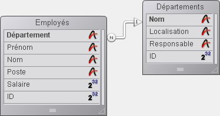
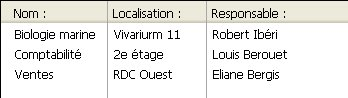
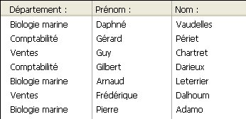
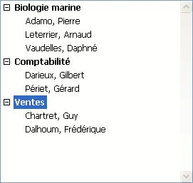

<!--REF #_command_.APPEND TO LIST.Syntax-->**APPEND TO LIST** ( *liste* ; *libelléElément* ; *réfElément* {; sous_Liste ; *déployée*} )<!-- END REF-->
<!--REF #_command_.APPEND TO LIST.Params-->
| Paramètre | Type |  | Description |
| --- | --- | --- | --- |
| liste | Integer | &#8594;  | Numéro de référence de liste |
| libelléElément | Text | &#8594;  | Libellé du nouvel élément |
| réfElément | Integer | &#8594;  | Numéro de référence unique du nouvel élément |
| sous_Liste | Integer | &#8594;  | Sous-liste optionnelle à rattacher au nouvel élément |
| déployée | Boolean | &#8594;  | Indique si la sous-liste doit être déployée ou non |

<!-- END REF-->

*Cette commande n'est pas thread-safe, elle ne peut pas être utilisée dans du code préemptif.*


#### Description 

<!--REF #_command_.APPEND TO LIST.Summary-->La commande **APPEND TO LIST** ajoute un nouvel élément à la liste hiérarchique dont vous avez passé le numéro de référence dans le paramètre *liste*.<!-- END REF-->

Vous passez le libellé de l'élément dans le paramètre *libelléElément*. Vous pouvez passer une expression de type Alpha ou Texte, pouvant contenir jusqu'à 2 milliards de caractères. A compter de 4D v16 R4, si l'élément est associé à une action standard, vous pouvez passer la constante ak standard action title dans *libelléElément* pour utiliser automatiquement le nom de l'action traduit. Pour plus d'informations, veuillez vous reporter à la section *Actions standard*.

Vous passez le numéro de référence unique de l'élément (de type Entier long) dans le paramètre *réfElément*. Même si nous qualifions ce numéro de référence d'élément comme unique, vous pouvez en réalité passer la valeur que vous voulez. Reportez-vous à la section *Gestion des listes hiérarchiques* pour plus d'informations sur le paramètre *réfElément*. 

Si vous souhaitez également que l'élément comporte des sous-éléments, passez un numéro de référence de liste valide dans le paramètre *sous\_Liste*. Dans ce cas, vous devez également passer le paramètre *déployée*. Passez Vrai ou Faux dans ce paramètre pour que cette sous-liste s'affiche respectivement déployée ou contractée. 

La référence de la liste que vous passez dans *sous\_Liste* doit être une liste existante. Elle peut comporter un seul niveau ou contenir elle-même des sous-listes. Si vous ne voulez pas rattacher de sous-liste au nouvel élément, omettez le paramètre ou passez 0\. Si vous passez le paramètre *sous\_Liste* et ne passez pas le paramètre *déployée*, la sous-liste apparaît par défaut contractée.

**Conseils :**

* Pour insérer un nouvel élément dans une liste, utilisez [INSERT IN LIST](insert-in-list.md). Pour modifier le libellé d'un élément existant ou sa sous-liste, ainsi que son état déployé/contracté, utilisez [SET LIST ITEM](set-list-item.md).
* Pour changer l'apparence de l'élément ajouté, utilisez [SET LIST ITEM PROPERTIES](set-list-item-properties.md).

#### Exemple 

Voici une vue partielle de la structure d'une base :



Les tables \[Départements\] et \[Employés\] contiennent les enregistrements suivants :





Vous voulez utiliser une liste hiérarchique, appelée *hlList*, qui affiche les départements, et pour chaque département, une sous-liste contenant les employés travaillant dans ce département. La méthode objet de *hlList* est la suivante:

```4d
  // Méthode objet Liste hiérarchique hlList
 
 Case of
 
    :(FORM Event=On Load)
       var hlList;$hSousListe;$vlDépartement;$vlEmployé;$vlDépartementID : Integer
  // Créer une nouvelle liste hiérarchique vide
       hlList:=New list
  // Sélectionner tous les enregistrements de la table [Départements]
       ALL RECORDS([Départements])
  // For each Département
       For($vlDepartement;1;Records in selection([Départements]))
  // Sélectionner les employés de ce département
          RELATE MANY([Départements]Nom)
  // Combien sont-ils?
          $vlNbEmployés:=Records in selection([Employés])
  // Y a-t-il au moins un employé dans ce département?
          If($vlNbEmployés>0)
  // Créer une sous-liste pour l'élément Département
             $hSousListe:=New list
  // For each Employé
             For($vlEmployé;1;Records in selection([Employés]))
  // Ajouter l'élément Employé à la sous-liste
  // Noter que le champ ID de l'enregistrement [Employés] est passé comme numéro de référence de l'élément
                APPEND TO LIST($hSousListe;[Employés]Nom+", "+[Employés]Prénom;[Employés]ID)
  // Aller à l'enregistrement [Employés] suivant
                NEXT RECORD([Employés])
             End for
          Else
  // Pas d'Employé, pas de sous-liste pour l'élément Département
             $hSousListe:=0
          End if
 
  // Ajouter l'élément Département à la liste principale
  // Notez que le champ ID de l'enregistrement [Départements] est passé comme numéro de référence de l'élément. Le bit #31 de cet ID est forcé à 1.
  // Ainsi nous pourrons faire la distinction entre les éléments Département et Employés (cf. note ci-dessous)
          APPEND TO LIST(hlList;[Départements]Nom;[Départements]ID?+31;$hSousListe;$hSousListe#0)
  // Passer l'élément Département en gras pour renforcer la hiérarchie de la liste
          SET LIST ITEM PROPERTIES(hlList;0;False;Bold;0)
  // Aller au département suivant
          NEXT RECORD([Départements])
       End for
  // Trier toute la liste en ordre croissant
       SORT LIST(hlList;>)
  // Afficher la liste en style Windows et forcer la hauteur de ligne minimale à 14 Pts
       SET LIST PROPERTIES(hlList;Ala Windows;Windows node;14)
 
    :(FORM Event=On Unload)
  // La liste n'est plus utile. N'oubliez pas de l'effacer !
       CLEAR LIST(hlList;*)
 
    :(FORM Event=On Double Clicked)
  // Il y a eu un double-clic
  // Obtenir la position de l'élément sélectionné
       $vlÉlémentPos:=Selected list items(hlList)
  // A toutes fins utiles, vérifier la position
       If($vlÉlémentPos # 0)
  // Obtenir l'information de l'élément de la liste
          GET LIST ITEM(hlList;$vlÉlémentPos;$vlÉlémentRef;$vsÉlémentText;$vlÉlémentSousListe;$vbÉlémentDéployé)
  // Cet élément est-il l'élément d'un Département?
          If($vlÉlémentRef ?? 31)
  // Si oui, c'est un double-clic sur un élément Département
             ALERT("Vous avez double-cliqué sur l'élément Département "+Char(34)+$vsÉlémentText+Char(34)+".")
          Else
  // Else, c'est un double-clic sur un élément Employé. Avec l'ID de l'élément parent, trouver l'enregistrement [Départements]
             $vlDépartementID:=List item parent(hlList;$vlÉlémentRef)?-31
             QUERY([Départements];[Départements]ID=$vlDépartementID)
  // Indiquer où l'Employé travaille et de qui il dépend
             ALERT("Vous avez double-cliqué sur l'élément Employé "+Char(34)+$vsÉlémentText+Char(34)+" qui travaille dans le Département "+Char(34)+[Départements]Nom+Char(34)+" dont le responsable est "+Char(34)+[Départements]Responsable+Char(34)+".")
          End if
       End if
 
 End case
 
  // Note : 4D peut stocker jusqu'à 1 milliard d'enregistrements par table. Dans notre exemple, nous utilisons le bit #31 de l'octet supérieur inutilisé
  // pour différencier les éléments des Employés des Départements.
```

Dans cet exemple, il y a une seule raison d'établir une distinction entre les éléments Départements et les éléments Employés : 

1\. Nous stockons des ID d'enregistrements dans les numéros de référence des éléments. En conséquence, nous avons toutes les chances de rencontrer des éléments Départements dont les numéros de référence sont les mêmes que ceux des éléments Employés.

2\. Nous utilisons la commande [List item parent](list-item-parent.md) pour récupérer le parent de l'élément sélectionné. Si nous cliquons sur un élément Employés dont le numéro d'ID associé est 10, et s'il existe aussi un élément Départements qui a le numéro 10, l'élément Départements sera trouvé en premier par [List item parent](list-item-parent.md) quand cette fonction passera la liste en revue pour repérer l'élément avec le numéro de référence que nous passons. La commande retournera le parent de l'élément Départements et non celui de l'élément Employés.

C'est pourquoi nous avons choisi des numéros de référence d'éléments uniques, non pas pour des questions de principe, mais parce que nous devions différencier les éléments de Départements et d'Employés. 

Dans le formulaire en exécution, la liste apparaîtra ainsi :



**Note :** Cet exemple est utile dans le cadre de la gestion de l'interface utilisateur, si vous manipulez un nombre limité d'enregistrements. Souvenez-vous que les listes sont conservées en mémoire ; donc, ne construisez pas d'interfaces utilisateur exploitant des listes hiérarchiques comportant des millions d'éléments.

#### Voir aussi 

[INSERT IN LIST](insert-in-list.md)  
[SET LIST ITEM](set-list-item.md)  
[SET LIST ITEM PARAMETER](set-list-item-parameter.md)  
[SET LIST ITEM PROPERTIES](set-list-item-properties.md)  