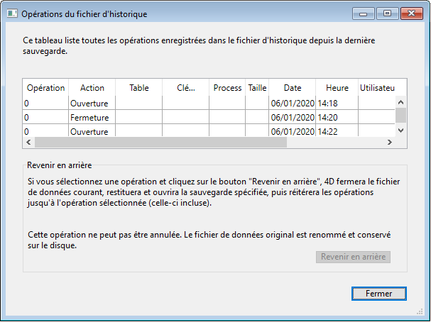

<!--REF #_command_.CHECK LOG FILE.Syntax-->**CHECK LOG FILE**<!-- END REF-->
<!--REF #_command_.CHECK LOG FILE.Params-->
| Ne requiert pas de paramètre |  |
| --- | --- |

<!-- END REF-->

*Cette commande n'est pas thread-safe, elle ne peut pas être utilisée dans du code préemptif.*

#### Description 

<!--REF #_command_.CHECK LOG FILE.Summary-->La commande **CHECK LOG FILE** affiche la boîte de dialogue de visualisation du fichier d’historique courant de la base (également accessible via la fenêtre du Centre de sécurité et de maintenance) :

Cette boîte de dialogue comporte le bouton **Revenir en arrière**, permettant d’annuler des opérations effectuées sur les données de la base.<!-- END REF--> Pour plus d’informations sur cette boîte de dialogue, reportez-vous au manuel Mode Développement de 4D.

**Note :** La fonction de retour en arrière étant relativement puissante, il est conseillé de restreindre l’accès à la commande **CHECK LOG FILE** aux administrateurs de la base.

Cette commande est utilisable dans le contexte d’une application monoposte uniquement. Elle permet notamment d'accéder à la fonction de retour en arrière depuis les applications 4D Volume Desktop (applications sans mode Développement). Si elle est appelée dans une application client/serveur, elle ne fait rien et l’erreur 1421 est retournée.

#### Gestion des erreurs 

* Si cette commande est exécutée dans une base de données fonctionnant sans fichier d’historique, elle ne fait rien et l’erreur 1403 est retournée.
* Si cette commande est exécutée sur une base client/serveur, elle ne fait rien et l’erreur 1421 est retournée.  
Vous pouvez intercepter ces erreurs à l’aide d’une méthode de gestion d’erreurs installée par la commande [ON ERR CALL](on-err-call.md).

#### Voir aussi 

*Erreurs du gestionnaire de sauvegarde (1401 -> 1421)*  
[RESTORE](restore.md)  