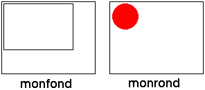
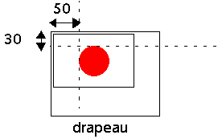

<!--REF #_command_.COMBINE PICTURES.Syntax-->**COMBINE PICTURES** ( *imageRésultat* ; *image1* ; *opérateur* ; *image2* {; *décalHoriz* ; *décalVert*} )<!-- END REF-->
<!--REF #_command_.COMBINE PICTURES.Params-->
| Paramètre | Type |  | Description |
| --- | --- | --- | --- |
| imageRésultat | Picture | &#8592; | Image résultant de la combinaison |
| image1 | Picture | &#8594;  | Première image à combiner |
| opérateur | Integer | &#8594;  | Type de combinaison à effectuer |
| image2 | Picture | &#8594;  | Seconde image à combiner |
| décalHoriz | Integer | &#8594;  | Décalage horizontal pour la superposition |
| décalVert | Integer | &#8594;  | Décalage vertical pour la superposition |

<!-- END REF-->

#### Description 

<!--REF #_command_.COMBINE PICTURES.Summary-->La commande **COMBINE PICTURES** permet de combiner les images *image1* et *image2* en mode *opérateur* pour en produire une troisième, *imageRésultat*.<!-- END REF--> L’image résultat est de type composé et conserve toutes les caractéristiques des images sources.

**Note :** Cette commande reprend et étend les fonctionnalités proposées par les opérateurs “classiques” de transformation d’images (+/, etc., cf. section [C\_BOOLEAN](c-boolean.md)). Ces opérateurs restent parfaitement utilisables dans 4D.

Passez dans *opérateur* le type de combinaison à appliquer. Trois types de combinaisons sont proposés, accessibles via des constantes placées dans le thème “*Transformation des images*” :

* Horizontal concatenation (1) : *image2* est accolée à *image1*, le coin supérieur gauche de *image2* coïncidant avec le coin supérieur droit de *image1*.
* Vertical concatenation (2) : image2 est accolée à *image1*, le coin supérieur gauche de *image2* coïncidant avec le coin inférieur gauche de *image1*.
* Superimposition (3) : *image2* est placée par-dessus *image1*, le coin supérieur gauche de *image2* coïncidant avec le coin supérieur gauche de *image1*.  
Si les paramètres facultatifs *décalHoriz* et *décalVert* sont utilisés, une translation est appliquée à *image2* avant la superposition. Les valeurs passées dans *décalHoriz* et *décalVert* doivent correspondre à des pixels. Passez des valeurs positives pour un décalage vers la droite ou vers le bas et une valeur négative pour un décalage vers la gauche ou vers le haut.

**Note :** La superposition effectuée par la commande **COMBINE PICTURES** diffère de la superposition proposée par les opérateurs “classiques” & et | (superposition exclusive et superposition inclusive). Tandis que la commande **COMBINE PICTURES** conserve les caractéristiques de chaque image source dans l’image résultante, les opérateurs & et | traitent chaque pixel et génèrent une image bitmap dans tous les cas. Ces opérateurs, conçus à l’origine pour les images monochromes, sont désormais obsolètes.

#### Exemple 

Soient les images suivantes : 



```4d
 COMBINE PICTURES(drapeau;monfond;Superimposition;monrond;50;30)
```

Résultat :



#### Voir aussi 

[TRANSFORM PICTURE](transform-picture.md)  

#### Propriétés

|  |  |
| --- | --- |
| Numéro de commande | 987 |
| Thread safe | &check; |


