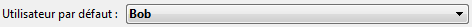

<!--REF #_command_.Current client authentication.Syntax-->**Current client authentication** {( *domaine* ; *protocole* )} : Text<!-- END REF-->
<!--REF #_command_.Current client authentication.Params-->
| Paramètre | Type |  | Description |
| --- | --- | --- | --- |
| domaine | Text | &#8592; | Nom du domaine |
| protocole | Text | &#8592; | "Kerberos", "NTLM" ou chaîne vide |
| Résultat | Text | &#8592; | Nom d'utilisateur de session retourné par Windows |

<!-- END REF-->

#### Description 

<!--REF #_command_.Current client authentication.Summary-->La commande **Current client authentication** envoie au serveur Active Directory de Windows une requête d'authentification du client courant et, en cas de succès, retourne le nom d'utilisateur Windows de ce client (identifiant de session).<!-- END REF--> Si l'authentification échoue, une chaîne vide est retournée. 

Cette commande peut être utilisée uniquement dans le contexte d'une implémentation SSO sous Windows avec 4D Server. Pour plus d'informations, veuillez vous reporter à la section *Authentification unique (SSO) sous Windows*.

Généralement, le client et le serveur doivent être gérés par le même serveur Active Directory. Cependant, des configurations spécifiques peuvent être prises en charge, comme décrit dans le paragraphe *Configuration requise pour le SSO*. 

La chaîne retournée par la commande doit être passée à votre module d'identification 4D. Vous pouvez ainsi déterminer automatiquement les droits d'accès du client en fonction de son identifiant de session Windows. Si vous définissez un "Utilisateur par défaut", vous pouvez implémenter une interface dans laquelle l'utilisateur n'a pas de ressaisir son identifiant -- la boîte de dialogue d'identification de l'utilisateur de 4D Server n'apparaît pas (voir exemple). 

Optionnellement, la commande peut retourner deux paramètres de type texte :

* *domaine* : nom du domaine auquel appartient le client.
* *protocole* : nom du protocole utilisé par Windows pour authentifier l'utilisateur. Il peut contenir "Kerberos" ou "NTLM", en fonction des ressources disponibles. Si l'authentification a échoué, une chaîne vide ("") est retournée.

 Ces paramètres peuvent être utilisés pour accepter ou rejeter les connexions si vous souhaitez filtrer les accès en fonction du domaine du client ou du protocole utilisé. 

##### Niveau de sécurité de l'authentification 

Le niveau de sécurité de l'authentification (c'est-à-dire le degré de confiance que vous pouvez avoir dans le nom d'utilisateur récupéré par la commande) dépend de la manière dont l'utilisateur a été identifié. Les valeurs retournées dans les différents paramètres de la commande **Current client authentication** vous permettent de savoir quelles informations ont été utilisées pour l'identification et donc, le niveau de sécurité :

| **Nom d'utilisateur** | **domaine**  | **protocole** | **Commentaire**                                                                                                                                                                                                                                                                                                                                                                                           |
| --------------------- | ------------ | ------------- | --------------------------------------------------------------------------------------------------------------------------------------------------------------------------------------------------------------------------------------------------------------------------------------------------------------------------------------------------------------------------------------------------------- |
| Vide                  | Vide         | Vide          | La commande n'a pas pu récupérer d'information d'authentification relatives à l'utilisateur connecté.                                                                                                                                                                                                                                                                                                     |
| Valeur reçue          | Vide         | NTLM          | La valeur reçue est le nom d'utilisateur local, défini sur la machine locale.                                                                                                                                                                                                                                                                                                                             |
| Valeur reçue          | Valeur reçue | NTLM          | Le nom d'utilisateur retourné a été authentifié via le protocole NTLM dans le domaine retourné par le paramètre *domaine*. Dans ce cas, vous devez contrôler le domaine afin d'augmenter le niveau de sécurité. Comme certaines architectures comportent une forêt de domaines, vous devez en particulier vérifier que le domaine dans lequel l'utilisateur a été identifié est bien le domaine souhaité. |
| Valeur reçue          | Valeur reçue | Kerberos      | Le nom d'utilisateur retourné a été authentifié avec le protocole Kerberos dans le domaine souhaité. Cette configuration constitue le niveau de sécurité le plus élevé.                                                                                                                                                                                                                                   |

Pour plus d'informations sur les configurations, veuillez vous reporter au paragraphe *Configuration requise pour le SSO*.

#### Exemple 

Dans votre base 4D Server, vous avez conçu un système de contrôle d'accès basé sur la fonctionnalité des utilisateurs et des groupes de 4D. Vous souhaitez configurer votre application de manière à ce que les utilisateurs 4D distants sous Windows puissent se connecter directement à 4D Server (sans qu'aucune boîte de dialogue de mot de passe ne s'affiche), tout en étant connectés avec leurs propres droits d'accès.

1. Dans la page "Sécurité" de la boîte de dialogue des Propriétés de la base, désignez un "Utilisateur par défaut" :  
  
Avec ce paramétrage, aucune boîte de dialogue d'identification n'est affichée pour les utilisateurs 4D distants qui se connectent au serveur -- tous les clients sont connectés par défaut en tant que "Bob".
2. Dans la [On Server Open Connection database method](on-server-open-connection-database-method.md), ajoutez le code suivant afin d'authentifier l'utilisateur auprès de l'Active Directory:

```4d
  //Méthode base Sur ouverture connexion serveur
 var $0;$1;$2;$3 : Integer
 $login:=Current client authentication($domain;$protocol)
 If($login #"") //un nom d'utilisateur a bien été retourné
  //appelez votre méthode d'identification personnalisée
    $0:=CheckCredentials($login)
  //elle doit retourner 0 en cas de succès, -1 en cas d'erreur
 Else
    $0:=-1 //rejeter la connexion
 End if
```

**Note :** Cet exemple constitue un scénario de base, qui doit être adapté à vos solutions. La méthode d'identification personnalisée de l'utilisateur 4D (CheckCredentials dans l'exemple ci-dessus) peut être basée sur l'une des implémentations suivantes :

* réplication de l'Active Directory dans les noms d'utilisateurs et groupes de 4D, permettant une correspondance automatique,
* utilisation d'une table \[Utilisateurs\] personnalisée,
* utilisation des fonctions LDAP afin de récupérer les droits d'accès de l'utilisateur.


#### Propriétés

|  |  |
| --- | --- |
| Numéro de commande | 1355 |
| Thread safe | &check; |


