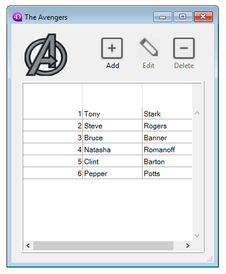

<!--REF #_command_.DIALOG.Syntax-->**DIALOG** ( {*laTable* ;} *formulaire* {; *formData*}{; *} )<!-- END REF-->
<!--REF #_command_.DIALOG.Params-->
| Paramètre | Type |  | Description |
| --- | --- | --- | --- |
| laTable | Table | &#8594;  | Table à laquelle appartient le formulaire Si omis : Table par défaut ou utilisation d'un formulaire projet |
| formulaire | Text, Object | &#8594;  | Nom du formulaire table ou projet à afficher, ouChemin POSIX (chaîne) d'un fichier .json décrivant le formulaire, ouObjet décrivant le formulaire |
| formData | Object | &#8594;  | Données à associer au formulaire |
| * | Opérateur | &#8594;  | Utiliser le même process |

<!-- END REF-->

#### Description 

<!--REF #_command_.DIALOG.Summary-->La commande **DIALOG** présente le *formulaire* à l'utilisateur en lui passant des paramètres via *formData* (optionnel).<!-- END REF--> 

Cette commande permet de concevoir des interfaces utilisateur personnalisées et sophistiquées, basées sur des formulaires. Vous pouvez l'utiliser pour afficher des informations provenant de la base ou d'autres sources, ou proposer des fonctions de saisie des données. A la différence de [ADD RECORD](add-record.md) ou [MODIFY RECORD](modify-record.md), **DIALOG** vous permet de contrôler intégralement le formulaire, son contenu et ses boutons de navigation et validation. 

**DIALOG** est généralement utilisée avec la commande [Open form window](open-form-window.md) pour afficher des formulaires complexes, comme par exemple :


La commande **DIALOG** peut également être utilisée au lieu de [ALERT](alert.md), [CONFIRM](confirm.md) ou [Request](request.md) lorsque les informations à afficher ou à recueillir sont plus complexes que celles que peuvent gérer ces trois commandes.

**Note :** Dans les bases de données converties, il est possible d'interdire la saisie dans les champs dans les boîtes de dialogue (et donc de limiter la saisie aux seules variables) via une option des Propriétés de la base (page Compatibilité). Cette restriction correspond au fonctionnement des anciennes versions de 4D. 

Dans le paramètre *formulaire*, vous pouvez passer soit :

* le nom du formulaire (formulaire projet ou formulaire table) à utiliser,
* le chemin (en syntaxe POSIX) d'un fichier .json valide contenant la description du formulaire à utiliser (voir *Chemin d'accès du formulaire*),
* un objet contenant la description du formulaire à utiliser.

Optionnellement, vous pouvez passer un ou plusieurs paramètre(s) au *formulaire* à l'aide de l'objet *formData*. Chaque propriété de l'objet *formData* sera disponible depuis le contexte du formulaire par l'intermédiaire de la commande [Form](form.md). Par exemple, si vous passez un objet contenant {"version","12"} dans *formData*, vous pouvez lire la valeur de la propriété "version" dans le formulaire en exécutant :

```4d
 $v:=Form.version //"12"
```

Lorsque vous utilisez une variable locale pour *formData*, cette fonctionnalité vous permet de passer en toute sécurité des paramètres à vos formulaires, quel que soit le contexte d'appel. En particulier, si le même formulaire est appelé depuis différents endroits dans le même process, vous pourrez à tout moment accéder à ses valeurs spécifiques en appelant simplement [Form](form.md).monAttribut. De plus, comme les objets sont passés par référence, si l'utilisateur modifie une valeur de propriété dans le formulaire, elle sera automatiquement mise à jour dans l'objet lui-même.   
En combinant l'objet *formData* et la commande [Form](form.md), vous pouvez à tout moment passer des paramètres aux formulaires et récupérer des valeurs depuis le formulaire en utilisant du code propre et sûr. 

**Note :** Si vous ne passez pas le paramètre *formData* ou si vous passez un objet indéfini, **DIALOG** crée automatiquement un nouvel objet vide associé au *formulaire*, accessible via la commande [Form](form.md). 

Le dialogue est refermé par l'utilisateur soit via une action "accepter" (déclenchée par l'action standard ak accept, la touche **Entrée** ou la commande [ACCEPT](accept.md)), soit via une action "annuler" (déclenchée par l'action standard ak cancel, la touche **Echap** ou la commande [CANCEL](cancel.md)). L'action "accepter" mettra la variable système OK à 1, alors que l'action "annuler" la mettra à 0.

A noter que la validation n'entraîne pas la sauvegarde : si le dialogue comporte des champs, vous devez appeler explicitement la commande [SAVE RECORD](save-record.md) pour stocker les données éventuellement modifiées. 

validé si l'utilisateur clique sur le bouton de validation ou appuie sur la touche **Entrée**, ou si la commande [ACCEPT](accept.md) est exécutée. 

Si vous passez le paramètre facultatif *\** , le formulaire est chargé et affiché dans la dernière fenêtre ouverte du process courant et la commande termine son exécution en laissant le formulaire actif à l’écran.   
Ce formulaire réagit alors “normalement” aux actions de l’utilisateur et est fermé via une action standard ou lorsque du code 4D lié au formulaire (méthode objet ou méthode formulaire) appelle la commande [CANCEL](cancel.md) ou [ACCEPT](accept.md). Si le process courant se termine, les formulaires créés de cette façon sont automatiquement fermés en simulant un [CANCEL](cancel.md). Ce mode d’ouverture est particulièrement utile pour afficher une palette flottante en rapport avec un document, sans pour autant nécessiter un autre process. 

**Notes :** 

* Vous pouvez combiner l'utilisation de la syntaxe **DIALOG**(form;\*) avec la commande [CALL FORM](call-form.md) afin d'établir une communication entre les formulaires.
* Vous devez créer une fenêtre avant d'appeler l'instruction **DIALOG**(form;\*), il n'est pas possible d'utiliser la fenêtre du dialogue en cours dans le process ni la fenêtre créée par défaut pour chaque process. Dans le cas contraire, l'erreur -9909 est générée.
* Lorsque le paramètre *\** est utilisé, la fenêtre est refermée automatiquement à la suite d'une action standard ou de l'appel de la commande [CANCEL](cancel.md) ou [ACCEPT](accept.md). Vous ne devez pas gérer vous-même la fermeture de la fenêtre.

#### Exemple 1 

L'exemple suivant permet de créer une palette d'outils :

```4d
  //Affichage palette d’outils
 $window_palette:=Open form window("tools";Palette form window)
 DIALOG("tools";*) //Rend la main immédiatement
  //Affichage fenêtre document principal
 $window_document:=Open form window("doc";Plain form window)
 DIALOG("doc")
```

#### Exemple 2 

Dans un formulaire affichant l'enregistrement d'une personne, un bouton ouvre un dialogue permettant de vérifier ou de modifier les noms et âges de ses enfants :


**Note :** Le champ objet "enfants" est représenté uniquement dans cet exemple afin de faire apparaître sa structure.

Dans le formulaire de vérification, vous avez assigné des propriétés d'objet [Form](form.md) aux variables :


Voici le code du bouton "Check Children" :

```4d
 var $win;$n;$i : Integer
 var $save : Boolean
 ARRAY OBJECT($children;0)
 OB GET ARRAY([Person]Children;"children";$children) //récupérer les enfants
 $save:=False //initialisation du marqueur de sauvegarde
 
 $n:=Size of array($children)
 If($n>0)
    $win:=Open form window("Edit_Children";Movable form dialog box)
    SET WINDOW TITLE("Vérification des enfants pour "+[Person]Name)
    For($i;1;$n) //pour chaque enfant
       DIALOG("Edit_Children";$children{$i}) //afficher le dialogue prérempli
       If(OK=1) //l'utilisateur a cliqué sur OK
          $save:=True
       End if
    End for
    If($save=True)
       [Person]Children:=[Person]Children //Forcer la mise à jour du champ
    End if
    CLOSE WINDOW($win)
 Else
    ALERT("Pas d'enfant à vérifier.")
 End if
```

**Note :** Cet exemple nécessite l'activation de la notation objet dans la base (voir *Page Compatibilité*).

Le formulaire affiche les informations pour chaque enfant :


Si des valeurs sont modifiées et que l'utilisateur clique sur le bouton OK, le champ est mis à jour (bien entendu, l'enregistrement parent devra être sauvegardé par la suite).

#### Exemple 3 

L'exemple suivant utilise le chemin d'un fichier .json décrivant un formulaire permettant d'afficher les enregistrements d'une liste d'employés :

```4d
 Open form window("/RESOURCES/OutputPersonnel.json";Plain form window)
 ALL RECORDS([Personnel])
 DIALOG("/RESOURCES/OutputPersonnel.json";*)
```

Résultat :


#### Exemple 4 

L'exemple suivant crée un objet à partir d'un fichier .json décrivant un formulaire et en modifie certaines propriétés : 

```4d
 var $form : Object
 $form:=JSON Parse(Document to text(Get 4D folder(Current resources folder)+"OutputPersonnel.json"))
 $form.windowTitle:="The Avengers"
 $form.pages[1].objects.logo.picture:="/RESOURCES/Images/Avengers.png"
 $form.pages[1].objects.myListBox.borderStyle:="double"
 Open form window($form;Plain form window)
 DIALOG($form;*)
```

Le formulaire est affiché avec la bordure, le logo et le titre modifiés :



#### Variables et ensembles système 

Si l'utilisateur valide le dialogue, la variable système OK prend la valeur 1, si le dialogue est annulé OK prend la valeur 0.

#### Voir aussi 

[ACCEPT](accept.md)  
[ADD RECORD](add-record.md)  
[CALL FORM](call-form.md)  
[CANCEL](cancel.md)  
[Form](form.md)  
[Open window](open-window.md)  

#### Propriétés
|  |  |
| --- | --- |
| Numéro de commande | 40 |
| Thread safe | &check; |
| Modifie les variables | OK, error |
| Interdite sur le serveur ||


