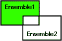

<!--REF #_command_.DIFFERENCE.Syntax-->**DIFFERENCE** ( *ensemble1* ; *ensemble2* ; *résultat* )<!-- END REF-->
<!--REF #_command_.DIFFERENCE.Params-->
| Paramètre | Type |  | Description |
| --- | --- | --- | --- |
| ensemble1 | Text | &#8594;  | Ensemble initial |
| ensemble2 | Text | &#8594;  | Ensemble à exclure |
| résultat | Text | &#8594;  | Ensemble résultant |

<!-- END REF-->

#### Description 

<!--REF #_command_.DIFFERENCE.Summary-->**DIFFERENCE** fusionne *ensemble1* et *ensemble2* et exclut de l'ensemble *résultat* tous les enregistrements se trouvant dans *ensemble2*.<!-- END REF--> Autrement dit, un enregistrement est inclus dans l'ensemble *résultat* s'il appartient à *ensemble1* mais n'appartient pas à *ensemble2*. Le tableau suivant liste les résultats possibles d'une opération de différence d'ensembles.

| **Ensemble1** | **Ensemble2** | **Ensemble résultant** |
| ------------- | ------------- | ---------------------- |
| Oui           | Non           | Oui                    |
| Oui           | Oui           | Non                    |
| Non           | Oui           | Non                    |
| Non           | Non           | Non                    |

Le schéma ci-dessous est la représentation graphique d'une opération de différence entre deux ensembles. La zone colorée est l'ensemble résultant.



L'ensemble *résultat* est créé par **DIFFERENCE**. Il remplace tout ensemble du même nom existant déjà, y compris *ensemble1* et *ensemble2*. Les ensembles *ensemble1* et *ensemble2* doivent appartenir à la même table. L'ensemble *résultat* appartient à la même table que *ensemble1* et *ensemble2*.

**4D Server :** En mode client/serveur, les ensembles sont "visibles" en fonction de leur type (interprocess, process et local) et de leur lieu de création (serveur ou client). **DIFFERENCE** requiert que les trois ensembles soient visibles sur la même machine. Pour plus d'informations sur ce point, reportez-vous au paragraphe *4D Server, ensembles et sélections* dans le manuel de référence de 4D Server.

#### Exemple 

L'exemple suivant exclut les enregistrements sélectionnés par l'utilisateur. Les enregistrements sont affichés à l'écran par l'instruction suivante :

```4d
 DISPLAY SELECTION([Clients]) // Affichage des clients sous forme de liste
```

Un bouton associé à une méthode objet est placé en bas de la liste. La méthode objet exclut les enregistrements sélectionnés par l'utilisateur (l'ensemble système nommé UserSet) et affiche une sélection réduite : 

```4d
 CREATE SET([Clients];"$Courant") // Création d'un ensemble à partir de la sélection courante
 DIFFERENCE("$Courant";"UserSet";"$Courant") // Exclusion des enregistrements sélectionnés
 USE SET("$Courant") // Utilisation du nouvel ensemble
 CLEAR SET("$Courant") // Effacement de l'ensemble
```

#### Voir aussi 

[INTERSECTION](intersection.md)  
[UNION](union.md)  

#### Propriétés

|  |  |
| --- | --- |
| Numéro de commande | 122 |
| Thread safe | &check; |


